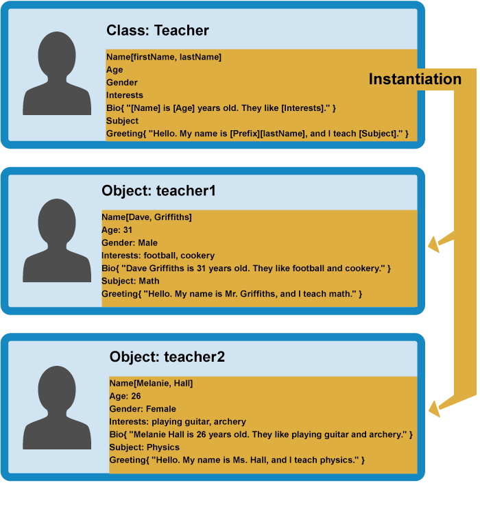

{{LearnSidebar}}{{PreviousMenuNext("Learn/JavaScript/Objects/Basics", "Learn/JavaScript/Objects/Object_prototypes", "Learn/JavaScript/Objects")}}

Con lo básico fuera del camino, nos enfocaremos en Javascript Orientado a Objetos (JSOO) — este artículo presenta una descripción básica de la teoría de la Programación Orientada a Objetos (POO), luego explora cómo Javascript emula classes de objetos via funciones constructoras, y cómo crea instancias de objetos.

| Prerequisitos: | Conocimientos básicos de computación, entendimiento básico de HTML y CSS, familiaridad con las bases de Javascript (ver [Primeros pasos con JavaScript](/es/docs/conflicting/Learn_web_development/Core/Scripting) y [Bloques de construcción JavaScript](/es/docs/Learn_web_development/Core/Scripting)) y las bases de JSOO (ver [Introducción a objetos](/es/docs/Learn_web_development/Core/Scripting/Object_basics)). |
| -------------- | ------------------------------------------------------------------------------------------------------------------------------------------------------------------------------------------------------------------------------------------------------------------------------------------------------------------------------------------------------------------------------- |
| Objetivo:      | Entender la teoría base de la programación orientada a objetos, como se relaciona esta con JavaScript ("todo es un objeto"), y como crear constructores e instacias de objetos.                                                                                                                                                                                                 |

## Programacion Orientada a Objetos— lo básico

Para empezar, daremos una descripción simple y de alto nivel acerca de lo que es la Programación Orientada a Objetos (POO). Decimos simple, porque la POO puede volverse complicada rápidamente, y darte un tratamiento completo ahora, probablemente podría confundirte más que ayudar. La idea básica de la POO es que usamos objetos para modelar cosas del mundo real que queremos representar en nuestros programas, y/o proveemos una simple manera para acceder a la funcionalidad que, de otra manera, sería difícil o imposible de usar.

Los objetos pueden contener información y código relacionados, los cuales representan información acerca de lo que estás tratando de modelar, y la funcionalidad o comportamiento que deseas que tenga. Los datos de un Objeto (y frecuentemente, también las funciones) se pueden almacenar ordenadamente (la palabra oficial es **encapsular**) dentro del paquete de un objeto (al que se puede asignar un nombre específico, llamado a veces **espacio de nombres**), haciéndolo fácil de estructurar y acceder; los objetos también se usan comúnmente como almacenes de datos que se pueden enviar fácilmente a través de la red.

### Definiendo una plantilla de objeto

Vamos a considerar un sencillo programa que muestra información sobre estudiantes y profesores en una escuela. Aquí daremos un vistazo a la POO (Programación Orientada a Objetos) en general, no en el contexto de algún lenguaje de programación específico.

Para empezar, podríamos volver a ver al objeto `Persona` de nuestro [artículo de primeros objetos](/es/docs/Learn_web_development/Core/Scripting/Object_basics), que define los datos generales y funcionalidades de una persona. Hay muchas cosas que podrías saber acerca de una persona (su dirección, estatura, tamaño de calzado, perfil de ADN, número de pasaporte, rasgos significativos de su personalidad...), pero, en este caso, solo estamos interesados en mostrar su nombre, edad, género e intereses, además de una pequeña introducción sobre este individuo basada en los datos anteriores. También queremos que sea capaz de saludar.

Esto es conocido como **abstracción** — crear un modelo simple de algo complejo que represente sus aspectos más importantes y que sea fácil de manipular para el propósito de nuestro programa.


En algunos lenguajes de POO, esta definición de tipo de objeto se la llama **class** (JavaScript utiliza diferentes mecanismos y terminologías, como verás a continuación) — esto no es en realidad un objeto, en vez de esto es un modelo que define las características que un objeto debería tener.

### Creando objetos

Partiendo de nuestra clase, podemos crear **instancias de objetos** — objetos que contienen los datos y funcionalidades definidas en la clase original. Teniendo a nuestra clase `Persona`, ahora podemos crear gente con características más específicas:


Cuando una instancia del objeto es creada a partir de una clase, se ejecuta **la función constructora** (constructor en inglés) de la clase para crearla. El proceso de crear una instancia del objeto desde una clase se llama **instanciación**.

### Clases especializadas

En este caso nosotros no queremos personas genericas — queremos docentes y estudiantes, que son los dos tipos más específicos de personas. En POO, podemos crear nuevas clases basadas en otras clases, estas nuevas **clases secundarias** se pueden hacer para **heredar** los datos y código de su **clase primaria**, de modo que pueden reutilizar la funcionalidad común a todos los tipos de objetos en lugar de tener que duplicarla. Cuando la funcionalidad difiere entre clases, puedes definir funciones especializadas directamente en ellas según sea necesario.


Esto es realmente útil, los profesores y los estudiantes comparten muchas características comunes como el nombre, el género y la edad, por lo que es conveniente tener que definir esas características solo una vez. También puedes definir la misma característica por separado en diferentes clases, ya que cada definición de esa característica estará en un espacio de nombres diferente. Por ejemplo, el saludo de un estudiante puede tener la forma "Yo, soy \[Nombre]" (por ejemplo, Yo, soy Sam), mientras que un profesor puede usar algo más formal, como "Hola, mi nombre es \[Prefix] \[lastName], y enseño \[Asunto] ". (Por ejemplo, Hola, mi nombre es Sr. Griffiths, y yo enseño Química).

> [!NOTE]
> La palabra elegante para la capacidad de múltiples tipos de objetos de implementar la misma funcionalidad es **polimorfismo.** Por si acaso te preguntabas.

Ahora puedes crear instancias de objetos de las clases "hijo". Por ejemplo:



En el resto del articulo, comenzaremos a ver como podemos practicar la teoría de POO en JavaScript.

## Constructores e instancias de objetos

Algunas personas sostienen que JavaScript no es un verdadero lenguaje orientado a objetos — por ejemplo, su enunciado [`class`](/es/docs/Web/JavaScript/Reference/Statements/class) es sólo azúcar sintáctica sobre la herencia prototípica existente y no es una `class` en el sentido tradicional. JavaScript, utiliza funciones especiales llamadas funciones constructoras para definir objetos y sus características. Son útiles porque a menudo te encontrarás con situaciones en las que no sabes cuántos objetos crearás; los constructores proporcionan los medios para crear tantos objetos como necesites de una manera efectiva, adjuntando datos y funciones a ellos según sea necesario.

Cuando se crea una nueva instancia del objeto a partir de una función constructora, su funcionalidad central (tal como se define en su prototipo, que exploraremos en el [artículo Prototipos](/es/docs/Learn_web_development/Extensions/Advanced_JavaScript_objects/Object_prototypes) de objetos) no se copia en el nuevo objeto como lenguajes OO "clásicos", sino que la funcionalidad está vinculada a través de una cadena de referencia llamada cadena prototipo. Así que esto no es una verdadera instanciación, estrictamente hablando, JavaScript usa un mecanismo diferente para compartir funcionalidad entre objetos.

> [!NOTE]
> No ser "POO clásica" no es necesariamente algo malo; Como se mencionó anteriormente, la POO puede ser muy compleja muy rápidamente, y JavaScript tiene algunas agradables formas de aprovechar las características de la OO sin tener que profundizar demasiado en ello.

Exploremos la creación de clases a través de constructores y la creación de instancias de objetos a partir de ellas en JavaScript. En primer lugar, nos gustaría que hicieras una nueva copia local del archivo `oojs.html` que vimos en nuestro primer artículo de Objetos.

### Un ejemplo simple

1.  Comencemos por ver cómo puedes definir una persona con una funcion normal. Agrega esta funcion dentro del elemento `script`:

    ```js
    function createNewPerson(name) {
      var obj = {};
      obj.name = name;
      obj.greeting = function() {
        alert('Hi! I\'m ' + this.name + '.');
      };
      return obj;
    }
    ```

2.  Ahora puedes crear una nueva persona llamando a esta funcion — prueba con las siguientes lineas en la consola Javascript de tu navegador:

    ```js
    var salva = createNewPerson('Salva');
    salva.name;
    salva.greeting();
    ```

    Esto funciona bastante bien, pero es un poco largo; si sabemos que queremos crear un objeto, ¿por qué necesitamos crear explícitamente un nuevo objeto vacío y devolverlo? Afortunadamente, JavaScript nos proporciona un práctico acceso directo, en forma de funciones constructoras — ¡hagamos una ahora!

3.  Reemplaza tu función anterior por la siguiente:

    ```js
    function Person(name) {
      this.name = name;
      this.greeting = function() {
        alert('Hi! I\'m ' + this.name + '.');
      };
    }
    ```

La función constructora es la versión de JavaScript de una clase. Notarás que tiene todas las características que esperas en una función, aunque no devuelve nada o crea explícitamente un objeto — básicamente sólo define propiedades y métodos. Verás que la palabra clave `this` se está usando aquí también — es básicamente decir que cuando se crea una de estas instancias de objeto, la propiedad `name` del objeto será igual al valor del nombre pasado a la llamada del constructor, y el método `greeting()` usará también el valor del nombre pasado a la llamada del constructor.

> [!NOTE]
> Un nombre de función constructora generalmente comienza con una letra mayúscula — esta convención se utiliza para hacer que las funciones constructoras sean más fáciles de reconocer en el código.

Entonces, ¿cómo llamamos a un constructor para crear algunos objetos?

1.  Agrega las siguientes líneas debajo de tu código anterior:

    ```js
    var person1 = new Person('Bob');
    var person2 = new Person('Sarah');
    ```

2.  Guarda el código y vuelve a cargarlo en el navegador, e intenta ingresar las siguientes líneas en la consola Javascript :

    ```js
    person1.name
    person1.greeting()
    person2.name
    person2.greeting()
    ```

¡Guaw! Ahora veras que tenemos dos nuevos objetos, cada uno de los cuales está almacenado en un espacio de nombres diferente: para acceder a sus propiedades y métodos, debes llamarlos como `person1` o `person2`; están cuidadosamente empaquetados para que no entren en conflicto con otras funciones. Sin embargo, tienen disponible la misma propiedad name y el método `greeting()`. Ten en cuenta que están utilizando su propio `name` que se les asignó cuando se crearon; esta es una razón por la cual es muy importante usar `this`, para que usen sus propios valores, y no algún otro valor.

Veamos nuevamente las llamadas del constructor:

```js
var person1 = new Person('Bob');
var person2 = new Person('Sarah');
```

En cada caso, la palabra clave `new` se usa para indicarle al navegador que queremos crear una nueva instancia del objeto, seguida del nombre de la función con sus parámetros requeridos entre paréntesis, y el resultado se almacena en una variable — muy similar a cómo se llama a una función estándar. Cada instancia se crea de acuerdo con esta definición:

```js
function Person(name) {
  this.name = name;
  this.greeting = function() {
    alert('Hi! I\'m ' + this.name + '.');
  };
}
```

Una vez creados los nuevos objetos, las variables `person1` y `person2` contienen los siguientes objetos:

```js
{
  name: 'Bob',
  greeting: function() {
    alert('Hi! I\'m ' + this.name + '.');
  }
}

{
  name: 'Sarah',
  greeting: function() {
    alert('Hi! I\'m ' + this.name + '.');
  }
}
```

Ten en cuenta que cuando llamamos a nuestra función constructora, estamos definiendo `greeting()` cada vez, lo cual no es lo ideal. Para evitar esto, podemos definir funciones en el prototipo, que veremos más adelante.

### Creando nuestro constructor final

El ejercicio que vimos anteriormente fue solo un ejemplo simple para comenzar. Ahora crearemos nuestra función `constructor Person()` final.

1.  Elimina el código que insertaste hasta ahora y agrega este constructor de reemplazo; este es exactamente el mismo que el ejemplo simple del principio, con un poco más de complejidad:

    ```js
    function Person(first, last, age, gender, interests) {
      this.name = {
        'first': first,
        'last' : last
      };
      this.age = age;
      this.gender = gender;
      this.interests = interests;
      this.bio = function() {
        alert(this.name.first + ' ' + this.name.last + ' is ' + this.age + ' years old. He likes ' + this.interests[0] + ' and ' + this.interests[1] + '.');
      };
      this.greeting = function() {
        alert('Hi! I\'m ' + this.name.first + '.');
      };
    }
    ```

2.  Ahora, agrega la siguiente línea para crear una instancia del objeto:

    ```js
    var person1 = new Person('Bob', 'Smith', 32, 'male', ['music', 'skiing']);
    ```

Ahora verás que puedes acceder a las propiedades y métodos justo como lo hiciste anteriormente — intenta esto en tu consola JS:

```js
person1['age']
person1.interests[1]
person1.bio()
// etc.
```

> [!NOTE]
> Si tienes problemas para lograr que funcione, puedes comparar tu código con nuestra versión — ve [oojs-class-finished.html](https://github.com/mdn/learning-area/blob/master/javascript/oojs/introduction/oojs-class-finished.html) (también lo puedes ver [corriendo en vivo](https://mdn.github.io/learning-area/javascript/oojs/introduction/oojs-class-finished.html)).

### Ejercicios adicionales

Para empezar, intenta añadir un par de líneas de creación de objetos propias, y trata de obtener y asignar valores a los miembros de las instancias del objeto.

Además, hay un par de problemas con nuestro método `bio()` — la salida siempre incluye el pronombre "He", incluso para personas de otros géneros. Y `bio` solamente incluye dos intereses, sin importar la cantidad que hay en el arreglo `interests`. ¿Podrías corregir esto en la definición de la clase (constructor)? Puedes poner cualquier código dentro de un constructor (probablemente necesites algunos condicionales y un bucle). Piensa como se deben estructurar las declaraciones dependiendo del género, y de la cantidad de intereses.

> [!NOTE]
> Si estás atascado, hay una [respuesta en nuestro repositorio de GitHub](https://github.com/mdn/learning-area/blob/master/javascript/oojs/introduction/oojs-class-further-exercises.html) ([see it live](https://mdn.github.io/learning-area/javascript/oojs/introduction/oojs-class-further-exercises.html)) — igualmente ¡intentea resolverla primero!

## Otras formas de crear instancias de objetos

Hasta ahora hemos visto dos diferentes formas de crear una instancia de objeto — [declarando un objeto literal](/es/docs/Learn_web_development/Core/Scripting/Object_basics#object_basics), y usando una función constructora (ver arriba).

Esto tiene sentido, pero hay otras formas — se muestran aquí para que te vayas familiarizando en caso de encontrarte con ellas.

### El constructor Object()

Antes que nada, puedes usar el constructor [`Object()`](/es/docs/Web/JavaScript/Reference/Global_Objects/Object) para crear un nuevo objeto. Si, incluso objetos genéricos tienen un constructor que genera un objeto vacío.

1.  Intenta ingresar este código en la consola JavaScript de tu navegador:

    ```js
    var person1 = new Object();
    ```

2.  Esto guarda un objeto vacío en la variable `person1`. Luego pueded agregar propiedades y métodos a este objeto usando la notación de punto (.) o de corchetes (\['']); prueba estos ejemplos en tu consola:

    ```js
    person1.name = 'Chris';
    person1['age'] = 38;
    person1.greeting = function() {
      alert('Hi! I\'m ' + this.name + '.');
    };
    ```

3.  También puedes pasar un objeto literal como parámetro al constructor `Object()`, para precargarlo con propiedades/métodos. Prueba esto en tu consola:

    ```js
    var person1 = new Object({
      name: 'Chris',
      age: 38,
      greeting: function() {
        alert('Hi! I\'m ' + this.name + '.');
      }
    });
    ```

### Usando el método create()

Los constructores te pueden ayudar a ordenar tu código — puedes crear constructores en un lugar, y luego crear instancias cuando sean necesarias.

Sin embargo, algunas personas prefieren crear instancias de objetos sin crear antes constructores, especialmente si van a crear solamente pocas instancias de un objeto.

JavaScript tiene un método llamado [`create()`](/es/docs/Web/JavaScript/Reference/Global_Objects/Object/create) que permite hacer esto. Con este método puedes crear un nuevo objeto basado en cualquier otro objeto existente.

1.  Con tu ejercicio de la sección anterior cargado en el navegador, prueba esto en tu consola JavaScript

    ```js
    var person2 = Object.create(person1);
    ```

2.  Y ahora prueba esto:

    ```js
    person2.name
    person2.greeting()
    ```

Verás que `person2` fue creado basado en `person1 `— tiene las mismas propiedades y métodos.

Una limitación del método `create()` es que no está soportado por el navegador IE8. Por lo que los constructores serán más efectivos sin necesitas soportar navegadores antiguos.

Más tarde, exploraremos en detalle los efectos de `create()`.

## Resumen

Este artículo provee una visión simplificada de la teoría de la orientación a objetos — esta no es toda la historia, pero te da una idea de con que estamos lidiando aquí. Adicionalmente, empezamos a ver como JavaScript está relacionado y difiere de la orientación a objetos "clásica", cómo usamos funciones constructoras para implementar clases en JavaScript, y diferentes formas de generar instancias de objetos.

En el próximo artículo, exploraremos los prototipos de objeto JavaScript.

{{PreviousMenuNext("Learn/JavaScript/Objects/Basics", "Learn/JavaScript/Objects/Object_prototypes", "Learn/JavaScript/Objects")}}

## En este modulo

- [Objetos básicos](/es/docs/Learn_web_development/Core/Scripting/Object_basics)
- [JavaScript orientedo a objetos para principiantes](/es/docs/conflicting/Learn/JavaScript/Objects/Classes_in_JavaScript)
- [Prototipos de Objetos](/es/docs/Learn_web_development/Extensions/Advanced_JavaScript_objects/Object_prototypes)
- [Herencia en JavaScript](/es/docs/Learn_web_development/Extensions/Advanced_JavaScript_objects/Classes_in_JavaScript)
- [Trabajando con datos JSON](/es/docs/Learn_web_development/Core/Scripting/JSON)
- [Práctica de construcción de objetos](/es/docs/Learn_web_development/Extensions/Advanced_JavaScript_objects/Object_building_practice)
- [Agregar funciones a nuestro demo de pelotas que rebotan](/es/docs/Learn_web_development/Extensions/Advanced_JavaScript_objects/Adding_bouncing_balls_features)
