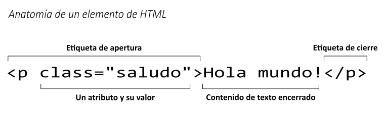

{{GlossarySidebar}}

HTML (Lenguaje de marcado de hipertexto o HyperText Markup Language por sus siglas en inglés) es un lenguaje descriptivo que especifica la estructura de las páginas web.

## Breve historia

En 1990, como parte de su visión de la {{glossary("World Wide Web","Web")}} (art. en inglés), Tim Berners-Lee definió el concepto de {{glossary("hypertext")}} (art. en inglés), el cual Berners-Lee formalizó el siguiente año a través de una marca principalmente basada en {{glossary("SGML")}} (art. en inglés). El {{glossary("IETF")}} (art. en inglés) comenzó formalmente a especificar HTML en 1993, y después de varios borradores se liberó la version 2.0 en 1995. En 1994 Berners-Lee fundó el {{glossary("W3C")}} (art. en inglés) para desarrollar la Web. En 1996, el W3C asumió el control de los trabajos de HTML y publicó la recomendación HTML 3.2 un año más tarde. HTML 4.0 fue liberada en 1999 y se convirtió en estándar en el año 2000.

En ese momento, el W3C casi abandonó HTML en favor a {{glossary("XHTML")}}, crear un grupo independiente llamado {{glossary("WHATWG")}} (art. en inglés) en 2004. Gracias al WHATWG, el trabajo de {{glossary("HTML5")}} (art. en inglés) continuó: las dos organizaciones liberaron el primer borrador en 2008 y el estándar final en 2014.

## Conceptos y sintaxis

Un documento HTML es un documento de texto plano estructurado con {{glossary("element","elements")}} (elementos en español) (art. en inglés). Los elementos están encerrados con parejas de {{Glossary("tag","tags" )}} (etiquetas en español) (art. en inglés) que realizan la apertura y el cierre . Cada etiqueta comienza y termina con paréntesis angulados (símbolos de menor que y mayor que (`<>`)). Existen unas pocas etiquetas vacías o nulas que no puede encerrar ningún texto, como por ejemplo {{htmlelement("img")}} (art. en inglés).

Usted puede extender las etiquetas (tags) de HTML con {{Glossary("attribute","attributes")}}(atributos en español) (art. en inglés), las cuales proporcionan información adicional que afecta el modo como el navegador interpreta los elementos:

Un archivo HTML es normalmente guardado con una extensión `.htm` o `.html`, es entregado por un {{Glossary("Server","web server")}} (servidor de internet) (art. en inglés), y puede ser interpretado por cualquier {{Glossary("browser","web browser")}} (navegador de internet) (art. en inglés).

## Aprenda más

### Cultura general

- [HTML](https://es.wikipedia.org/wiki/HTML) en Wikipedia

### Aprendiendo HTML

- [Nuestro tutorial de HTML](/es/docs/Learn/HTML)
- [Curso web en codecademy.com](https://www.codecademy.com/en/tracks/web) (sitio en inglés)

### Referencia técnica

- [La documentación de HTML en MDN](/es/docs/Web/HTML)
- [La especificación de HTML](https://www.w3.org/TR/html5/) (art. en inglés)
