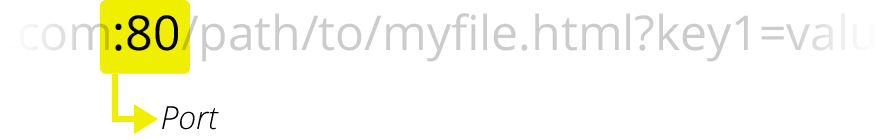

Este artículo habla sobre las Uniform Resource Locators (URLs), explicando qué son y cómo se estructuran.

<table>
  <tbody>
    <tr>
      <th scope="row">Prerequisitos:</th>
      <td>
        Primero necesitas saber
        <a href="/es/docs/Learn/How_the_Internet_works"
          >Como funciona Internet</a
        >,
        <a href="/es/docs/Learn/What_is_a_Web_server"
          >qué es un servidor Web</a
        >
        y
        <a href="/es/docs/Learn/Understanding_links_on_the_web"
          >los conceptos detrás de los enlaces en la web</a
        >.
      </td>
    </tr>
    <tr>
      <th scope="row">Objetivo:</th>
      <td>Aprenderás lo que es una URL y como funcionan en la Web.</td>
    </tr>
  </tbody>
</table>

## Resumen

Junto con el {{Glossary("Hypertext", "Hipertexto")}} y {{Glossary("HTTP")}}, las **_URL_** son uno de los conceptos claves de la Web. Es el mecanismo usado por los {{Glossary("Browser","navegadores")}} para obtener cualquier recurso publicado en la web.

**URL** significa _Uniform Resource Locator (Localizador de Recursos Uniforme)_. Una URL no es más que una direccion que es dada a un recurso único en la Web. En teoria, cada URL válida apunta a un único recurso. Dichos recursos pueden ser páginas HTML, documentos CSS, imagenes, etc. En la practica, hay algunas excepciones, siendo la más común una URL apuntando a un recurso que ya no existe o que ha sido movido. Como el recurso representado por la URL y la URL en si son manejadas por el servidor Web, depende del dueño del servidor web manejar ese recurso y su URL asociada adecuadamente.

## Active Learning

_There is no active learning available yet. [Please, consider contributing](/es/docs/MDN/Getting_started)._

## Profundizando

### Conceptos básicos: anatomía de una URL

Aquí hay algunos ejemplos de URL:

```
https://developer.mozilla.org
https://developer.mozilla.org/es/docs/Learn/
https://developer.mozilla.org/en-US/search?q=URL
```

Cualquiera de esas URL se puede escribir en la barra de direcciones de su navegador para indicarle que cargue la página (recurso) asociada.

Una URL está compuesta de diferentes partes, algunas obligatorias y otras opcionales. Veamos las partes más importantes usando la siguiente URL:

```
http://www.example.com:80/path/to/myfile.html?key1=value1&key2=value2#SomewhereInTheDocument
```

- 
  - : `http` es el protocolo. La primera parte de la URL indica qué protocolo debe usar el navegador. Un protocolo es un método establecido para intercambiar o transferir datos alrededor de una red informática. Por lo general, para sitios web es el protocolo HTTP o su versión segura, HTTPS. La Web requiere uno de estos dos, pero los navegadores también saben cómo manejar otros protocolos como mailto: (para abrir un cliente de correo) o ftp: para manejar la transferencia de archivos, así que no se sorprenda si ve tales protocolos.
- 
  - : `www.example.com` es el nombre de dominio. Indica qué servidor web se solicita. Alternativamente, es posible usar directamente un {{Glossary("dirección IP")}}, pero debido a que es menos conveniente, no se usa con frecuencia en la Web.
- 
  - : `:80` es el puerto. Indica la "puerta" técnica utilizada para acceder a los recursos en el servidor web. Por lo general, se omite si el servidor web utiliza los puertos estándar del protocolo HTTP (80 para HTTP y 443 para HTTPS) para otorgar acceso a sus recursos. De lo contrario es obligatorio.
- 
  - : `/path/to/myfile.html` es la ruta al recurso en el servidor web. En los primeros días de la Web, una ruta como esta representaba la ubicación de un archivo físico en el servidor web. Hoy en día, es principalmente una abstracción manejada por servidores web sin ninguna realidad física.
- 
  - : `?key1=value1&key2=value2` son parámetros adicionales proporcionados al servidor web. Esos parámetros son una lista de pares clave/valor separados con el símbolo &. El servidor web puede usar esos parámetros para hacer cosas adicionales antes de devolver el recurso. Cada servidor web tiene sus propias reglas con respecto a los parámetros, y la única forma confiable de saber si un servidor web específico está manejando parámetros es preguntando al propietario del servidor web.
- 
  - : `#SomewhereInTheDocument` es un ancla para otra parte del recurso en sí. Un ancla representa una especie de "marcador" dentro del recurso, dando al navegador las instrucciones para mostrar el contenido ubicado en ese lugar "marcado". En un documento HTML, por ejemplo, el navegador se desplazará hasta el punto donde se define el ancla; en un video o documento de audio, el navegador intentará ir a la hora que representa el ancla. Vale la pena señalar que la parte después del #, también conocido como el identificador de fragmento, nunca se envía al servidor con la solicitud.

> **Nota:** Existen [algunas partes extras y reglas extras](http://en.wikipedia.org/wiki/Uniform_Resource_Locator") con respecto a las URL, pero no son relevantes para usuarios habituales o desarrolladores web. No se preocupe por esto, no necesita conocerlos para construir y usar URL completamente funcionales.

Puede pensar en una URL como una dirección de correo postal normal: el protocolo representa el servicio postal que desea utilizar, el nombre de dominio es la ciudad o el pueblo y el puerto es como el código postal; la ruta representa el edificio donde se debe entregar su correo; los parámetros representan información adicional como el número de apartamento en el edificio; y, finalmente, el ancla representa a la persona real a la que ha dirigido su correo.

### Cómo usar las URL

Se puede escribir cualquier URL dentro de la barra de direcciones del navegador para acceder al recurso que se encuentra detrás. ¡Pero esto es sólo la punta del iceberg!

El lenguaje {{Glossary("HTML")}} — [que se discutirá más adelante](/es/docs/Learn/HTML/HTML_tags) — hace un uso extensivo de las URL:

- para crear enlaces a otros documentos con el elemento {{HTMLElement("a")}};
- para vincular un documento con sus recursos relacionados a través de varios elementos como {{HTMLElement("link")}} o {{HTMLElement("script")}};
- para mostrar recursos como imágenes (con el elemento {{HTMLElement("img")}}), videos (con el elemento {{HTMLElement("video")}}), sonido y música (con el elemento {{HTMLElement("audio")}} ), etc.;
- para mostrar otros documentos HTML con el elemento {{HTMLElement ("iframe")}}.

> **Nota:** Al especificar URL para cargar recursos como parte de una página (como cuando se usa \<script>, \<audio>, \, \<video> y similares), solo debe usar URL HTTP y HTTPS. El uso de FTP, por ejemplo, no es particularmente seguro y muchos navegadores ya no lo admiten.

Otras tecnologías, como {{Glossary("CSS")}} o {{Glossary("JavaScript")}}, usan URLs ampliamente, y estos son realmente el corazón de la Web.

### URL absolutas vs URL relativas

Lo que vimos arriba se llama URL absoluta, pero también hay algo llamado URL relativa. Examinemos lo que significa esa distinción con más detalle.

Las partes requeridas de una URL dependen en gran medida del contexto en el que se utiliza la URL. En la barra de direcciones de su navegador, una URL no tiene ningún contexto, por lo que debe proporcionar una URL completa (o absoluta), como las que vimos anteriormente. No necesita incluir el protocolo (el navegador usa HTTP de manera predeterminada) o el puerto (que solo se requiere cuando el servidor web de destino está utilizando algún puerto inusual), pero todas las otras partes de la URL son necesarias.

Cuando se usa una URL dentro de un documento, como en una página HTML, las cosas son un poco diferentes. Debido a que el navegador ya tiene la propia URL del documento, puede usar esta información para completar las partes faltantes de cualquier URL disponible dentro de ese documento. Podemos diferenciar entre una URL absoluta y una URL relativa mirando solo la parte de ruta de la URL. Si la parte de ruta de la URL comienza con el carácter "/", el navegador buscará ese recurso desde la raíz superior del servidor, sin referencia al contexto dado por el documento actual.

Veamos algunos ejemplos para aclarar esto.

#### Ejemplos de URL absolutas

<table>
  <tbody>
    <tr>
      <td>URL Completa (la misma que usamos antes)</td>
      <td><pre>https://developer.mozilla.org/es/docs/Learn</pre></td>
    </tr>
    <tr>
      <td>Protocolo implícito</td>
      <td>
        <pre>//developer.mozilla.org/es/docs/Learn</pre>
        <p>
          En este caso, el navegador llamará a esa URL con el mismo protocolo
          que el utilizado para cargar el documento que aloja esa URL.
        </p>
      </td>
    </tr>
    <tr>
      <td>Nombre de dominio implícito</td>
      <td>
        <pre>/es/docs/Learn</pre>
        <p>
          Este es el caso de uso más común para una URL absoluta dentro de un
          documento HTML. El navegador utilizará el mismo protocolo y el mismo
          nombre de dominio que el utilizado para cargar el documento que aloja
          esa URL.
          <strong>Note:</strong>
          <em
            >no es posible omitir el nombre de dominio sin omitir también el
            protocolo.</em
          >.
        </p>
      </td>
    </tr>
  </tbody>
</table>

#### Ejemplos de URL relativas

Para comprender mejor los siguientes ejemplos, supongamos que las URL se invocan desde el documento ubicado en la siguiente URL: `https://developer.mozilla.org/es/docs/Learn`

<table>
  <tbody>
    <tr>
      <td>Sub-recursos</td>
      <td>
        <pre>Skills/Infrastructure/Understanding_URLs</pre>
        <p>
          Debido a que la URL no se inicia con <code>/</code>el navegador
          intentará encontrar el documento en un subdirectorio del que contiene
          el recurso actual. Entonces, en este ejemplo, realmente queremos
          llegar a esta URL:
          https://developer.mozilla.org/es/docs/Learn/Skills/Infrastructure/Understanding_URLs.
        </p>
      </td>
    </tr>
    <tr>
      <td>Volviendo en el árbol de directorios</td>
      <td>
        <pre>../CSS/display</pre>
        <p>
          En este caso, usamos el <code>../</code> convención de escritura,
          heredada del mundo del sistema de archivos UNIX, para decirle al
          navegador que queremos subir desde un directorio. Aquí queremos
          llegar a esta URL:
          https://developer.mozilla.org/es/docs/Learn/../CSS/display, que se
          puede simplificar a:
          https://developer.mozilla.org/es/docs/CSS/display.
        </p>
      </td>
    </tr>
  </tbody>
</table>

### URL semánticas

A pesar de su sabor muy técnico, las URL representan un punto de entrada legible para un sitio web. Se pueden memorizar y cualquiera puede ingresarlos en la barra de direcciones de un navegador. Las personas están en el centro de la Web, por lo que se considera una buena práctica construir lo que se llama [_URL semánticas_](http://en.wikipedia.org/wiki/Semantic_URL). Las URL semánticas usan palabras con un significado inherente que cualquier persona puede entender, independientemente de sus conocimientos técnicos.

La semántica lingüística es, por supuesto, irrelevante para las computadoras. Probablemente has visto URL que parecen mashups de caracteres aleatorios. Pero hay muchas ventajas en la creación de URL legibles por humanos:

- Es más fácil para ti manipularlos.
- Aclara las cosas para los usuarios en términos de dónde están, qué están haciendo, qué están leyendo o interactuando en la Web.
- Algunos motores de búsqueda pueden usar esa semántica para mejorar la clasificación de las páginas asociadas.

## Próximos pasos

- [Comprendiendo nombres de dominio](/es/docs/Learn/Understanding_domain_names)
