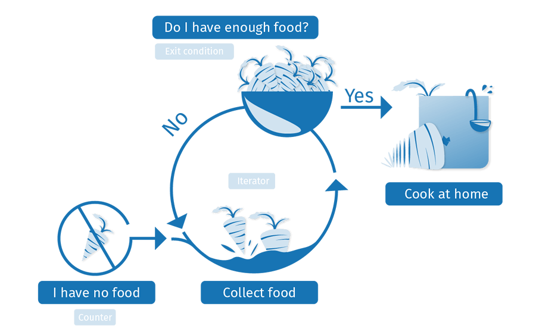

{{LearnSidebar}}{{PreviousMenuNext("Learn/JavaScript/Building_blocks/conditionals","Learn/JavaScript/Building_blocks/Functions", "Learn/JavaScript/Building_blocks")}}

Los lenguajes de programación son muy útiles para completar rápidamente tareas repetitivas, desde múltimples cálculos básicos hasta cualquier otra situación en donde tengas un montón de elementos de trabajo similares que completar. Aquí vamos a ver las estructuras de bucles disponibles en JavaScript que pueden manejar tales necesidades.

| Prerequisitos: | Conocimientos básicos de computación, entendimiento básico de HTML y CSS, [JavaScript first steps](/es/docs/Learn/JavaScript/First_steps). |
| -------------- | ------------------------------------------------------------------------------------------------------------------------------------------ |
| Objetivo:      | Entender cómo usar bucles en JavaScript.                                                                                                   |

## Mantente en el Bucle

Bucles, bucles, bucles. Además de ser conocidos como un cereal de desayuno popular, montañas rusas y producción músical, también son un concepto muy importante en programación. Los bucles de programación están relacionados con todo lo referente a hacer una misma cosa una y otra vez — que se denomina como **iteración** en el idioma de programación.

Consideremos el caso de un agricultor que se asegura de tener suficiente comida para alimentar a su familia durante la semana. Podría usar el siguiente bucle para lograr esto:



Un bucle cuenta con una o más de las siguientes características:

- Un **contador,** que se inicia con un determinado valor — este será el valor del punto inicial del bucle ("Inicio: No tengo comida",mirar arriba).
- Una **condicion de salida**, que será el criterio bajo el cual, el bucle se romperá — normalmente un contador que alcanza un determinado valor. Aquí se ilustra como "¿Tengo suficiente comida?", arriba. Digamos que son necesarias 10 porciones de comida para alimentar a su familia.
- Un **iterador,** que generalmente incrementa el valor del contador en una cantidad pequeña a cada paso del bucle, hasta que alcanza la condición de salida. No hemos ilustrado esto de manera explícita arriba, pero podríamos pensar que el granjero está recolectando 2 porciones de comida cada hora. Después de cada hora, la cantidad de comida recolectada se incrementa en dos, y comprueba si tiene suficiente comida. Si alcanza los 10 puntos (la condición de salida), puede parar la recolecta e irse para casa.

En {{glossary("pseudocódigo")}},esto se vería como sigue:

```
bucle(comida = 0; comidaNecesaria = 10) {
  if (comida = comidaNecesaria) {
    salida bucle;
    // Tenemos suficiente comida; vamonos para casa
  } else {
    comida += 2; // Pasar una hora recogiendo 2 más de comida
    // Comenzar el bucle de nuevo
  }
}
```

Así que la cantidad necesaria de comida se establece en 10, y la cantidad incial del granjero en 0. En cada iteración del bucle comprobamos si la cantidad de comida del granjero es mayor o igual a la cantidad que necesita. Si lo es, podemos salir del bucle. Si no, el granjero se pasará una hora más recogiendo dos porciones de comida, y el bucle arrancará de nuevo.

### ¿Por qué molestarse?

En este punto, probablemente entiendas los conceptos de alto nivel que hay detrás de los bucles, pero probablemente estés pensando "OK, fantástico, pero ¿cómo me ayuda esto a escribir un mejor codigo JavaScript?". Como dijimos antes, **los bucles tienen que ver con hacer lo mismo una y otra vez**, lo cual es bueno para **completar rápidamente tareas repetitivas**.

Muchas veces, el código será ligeramente diferente en cada iteracción sucesiva del bucle, lo que significa que puedes completar una carga completa de tareas que son similares, pero ligeramente diferentes — si tienes muchos calculos diferentes que hacer, quieres hacer cada uno de ellos, ¡no el mismo una y otra vez!

Vamos a ver un ejemplo para ilustrar perfectamente por qué los bucles son tan útiles. Digamos que queremos dibujar 100 círculos aleatorios en un elemento {{htmlelement("canvas")}} (presiona el botón _Update_ para ejecutar el ejemplo una y otra vez y ver diferentes configuraciones aleatorias):

```html hidden
<!doctype html>
<html>
  <head>
    <meta charset="utf-8" />
    <title>Random canvas circles</title>
    <style>
      html {
        width: 100%;
        height: inherit;
        background: #ddd;
      }

      canvas {
        display: block;
      }

      body {
        margin: 0;
      }

      button {
        position: absolute;
        top: 5px;
        left: 5px;
      }
    </style>
  </head>
  <body>
    <button>Update</button>

    <canvas></canvas>

    <script>
      var btn = document.querySelector("button");
      var canvas = document.querySelector("canvas");
      var ctx = canvas.getContext("2d");

      var WIDTH = document.documentElement.clientWidth;
      var HEIGHT = document.documentElement.clientHeight;

      canvas.width = WIDTH;
      canvas.height = HEIGHT;

      function random(number) {
        return Math.floor(Math.random() * number);
      }

      function draw() {
        ctx.clearRect(0, 0, WIDTH, HEIGHT);
        for (var i = 0; i < 100; i++) {
          ctx.beginPath();
          ctx.fillStyle = "rgba(255,0,0,0.5)";
          ctx.arc(random(WIDTH), random(HEIGHT), random(50), 0, 2 * Math.PI);
          ctx.fill();
        }
      }

      btn.addEventListener("click", draw);
    </script>
  </body>
</html>
```

{{ EmbedLiveSample('Hidden_code', '100%', 400, "", "", "hide-codepen-jsfiddle") }}

No tienes que entender todo el código por ahora, pero vamos a echar un vistazo a la parte de código que dibuja los 100 círculos:

```js
for (var i = 0; i < 100; i++) {
  ctx.beginPath();
  ctx.fillStyle = "rgba(255,0,0,0.5)";
  ctx.arc(random(WIDTH), random(HEIGHT), random(50), 0, 2 * Math.PI);
  ctx.fill();
}
```

Debes quedarte con la idea básica. — utilizamos un bucle para ejecutar 100 iteracciones de este código, cada una de las cuales dibuja un círculo en una posición aleatoria de la página. La cantidad de código necesario sería el mismo si dibujáramos 100, 1000, o 10,000 círculos. Solo necesitamos cambiar un número.

Si no usáramos un bucle aquí, tendríamos que repetir el siguiente código por cada círculo que quisiéramos dibujar:

```js
ctx.beginPath();
ctx.fillStyle = "rgba(255,0,0,0.5)";
ctx.arc(random(WIDTH), random(HEIGHT), random(50), 0, 2 * Math.PI);
ctx.fill();
```

Esto sería muy aburrido y difícil de mantener de forma rápida. Los bucles son realmente lo mejor.

## El bucle estándar `for`

Exploremos algunos constructores de bucles específicos. El primero, que usarás la mayoría de las veces, es el bucle [for](/es/docs/Web/JavaScript/Referencia/Sentencias/for) - este tiene la siguiente sintaxis:

```
for (inicializador; condición de salida; expresión final) {
  // código a ejecutar
}
```

Aquí tenemos:

1. La palabra reservada `for`, seguida por algunos paréntesis.
2. Dentro de los paréntesis tenemos tres ítems, separados por punto y coma (;):

   1. Un **inicializador** - Este es usualmente una variable con un número asignado, que aumenta el número de veces que el bucle ha sijo ejecutado. También se le llama **contador** o **variable de conteo**.
   2. Una **condición de salida** - como se mencionó previamente, ésta define cuando el bucle debería detenerse. Generalmente es una expresión que contiene un operador de comparación, una prueba para verificar ue la condición de término o salida ha sido cumplida.
   3. Una **expresión final** - que es siempre evaluada o ejecutada cada vez que el bucle ha completado una iteración. Usualmente sirve para modificar al contador (incrementando su valor o algunas veces disminuyendolo), para aproximarse a la condición de salida.

3. Algunos corchetes curvos que contienen un bloque de código - este código se ejecutará cada vez que se repita el bucle.

Observa un ejemplo real para poder entender esto más claramente.

```js
var cats = ["Bill", "Jeff", "Pete", "Biggles", "Jasmin"];
var info = "My cats are called ";
var para = document.querySelector("p");

for (var i = 0; i < cats.length; i++) {
  info += cats[i] + ", ";
}

para.textContent = info;
```

Esto nos da el siguiente resultado:

```html hidden
<!doctype html>
<html>
  <head>
    <meta charset="utf-8" />
    <title>Basic for loop example</title>
    <style></style>
  </head>
  <body>
    <p></p>

    <script>
      var cats = ["Bill", "Jeff", "Pete", "Biggles", "Jasmin"];
      var info = "My cats are called ";
      var para = document.querySelector("p");

      for (var i = 0; i < cats.length; i++) {
        info += cats[i] + ", ";
      }

      para.textContent = info;
    </script>
  </body>
</html>
```

{{ EmbedLiveSample('Hidden_code_2', '100%', 60, "", "", "hide-codepen-jsfiddle") }}

> **Nota:** Puedes encontrar este [ejemplo de código en GitHub](https://github.com/mdn/learning-area/blob/master/javascript/building-blocks/loops/basic-for.html) también (además puedes [verlo ejecutar en vivo](http://mdn.github.io/learning-area/javascript/building-blocks/loops/basic-for.html)).

Esto muestra un bucle siendo usado para iterar sobre los elementos de un arreglo (matriz), y hacer algo con cada uno de ellos - un patrón muy común en JavaScript. Aquí:

1. El iterador, `i`, inicia en `0` (`var i = 0`).
2. Se le ha dicho que debe ejecutarse hasta que no sea menor que la longitud del arreglo `cats`. Esto es importante - la condición de salida muestra la condicion bajo la cual el bucle seguirá iterando. Así, en este caso, mientras `i < cats.length` sea verdadero, el bucle seguirá ejecutándose.
3. Dentro del bucle, concatenamos el elemento del bucle actual (`cats[i]` es `cats[lo que sea i en ese momento]`) junto con una coma y un espacio, al final de la variable `info`. Así:

   1. Durante la primera ejecución, `i = 0`, así `cats[0] + ', '` se concatenará con la información ("Bill, ").
   2. Durante la segunda ejecución, `i = 1`, así `cats[1] + ', '` agregará el siguiente nombre ("Jeff, ").
   3. Y así sucesivamente. Después de cada vez que se ejecute el bucle, se incrementará en 1 el valod de i (`i++`), entonces el proceso comenzará de nuevo.

4. Cuando `i` sea igual a `cats.length`, el bucle se detendrá, y el navegador se moverá al siguiente segmento de código bajo el bucle.

> **Nota:** Hemos programado la condición de salidad como `i < cats.length`, y no como `i <= cats.length`, porque los computadores cuentan desde 0, no 1 - inicializamos la variable i en 0, para llegar a `i = 4` (el índice del último elemento del arreglo). `cats.length` responde 5, ya que existen 5 elementos en el arreglo, pero no queremos que i = 5, dado que respondería `undefined` para el último elemento (no existe un elemento en el arreglo con un índice 5). for the last item (there is no array item with an index of 5). Por ello, queremos llegar a 1 menos que `cats.length` (`i <`), que no es lo mismo que `cats.length` (`i <=`).

> **Nota:** Un error común con la condición de salida es utilizar el comparador "igual a" (`===`) en vez de "menor o igual a" (`<=`). Si queremos que nuestro bucle se ejecute hasta que `i = 5`, la condición de salida debería ser `i <= cats.length`. Si la declaramos `i === cats.length`, el bucle no debería ejecutarse , porque `i` no es igual a `5` en la primera iteración del bucle, por lo que debería detenerse inmediatamente.

Un pequeño problema que se presenta es que la frase de salida final no está muy bien formada:

> My cats are called Bill, Jeff, Pete, Biggles, Jasmin,

Idealmente querríamos cambiar la concatenacion al final de la última iteracion del bucle, así no tendríamos una coma en el final de la frase. Bueno, no hay problema - podemos insertar un condicional dentro de nuestro bucle para solucionar este caso especial:

```js
for (var i = 0; i < cats.length; i++) {
  if (i === cats.length - 1) {
    info += "and " + cats[i] + ".";
  } else {
    info += cats[i] + ", ";
  }
}
```

> **Nota:** You can find this [example code on GitHub](https://github.com/mdn/learning-area/blob/master/javascript/building-blocks/loops/basic-for-improved.html) too (also [see it running live](http://mdn.github.io/learning-area/javascript/building-blocks/loops/basic-for-improved.html)).

> **Advertencia:** **Importante**: Con `for` - como con todos los bucles - debes estar seguro de que el inicializador es repetido hasta que eventualemtne alcance la condición de salida. Si no, el bucle seguirá repitiéndose indefinidamente, y puede que el navegador lo fuerce a detenerse o se interrumpa. Esto se denomina **bucle infinito**.

## Salir de un bucle con `break`

Si deseas salir de un bucle antes de que se hayan completado todas las iteraciones, puedes usar la declaración [break](/es/docs/Web/JavaScript/Referencia/Sentencias/break). Ya la vimos en el artículo previo cuando revisamos la declaración [switch](/es/docs/Web/JavaScript/Referencia/Sentencias/switch) - cuando un caso en una declaración `switch` coincide con la expresión de entrada, la declaración `break` inmediatamente sale de la declaración `switch` y avanza al código que se encuentra después.

Ocurre lo mismo con los bucles - una declaración `break` saldrá inmediatamente del bucle y hará que el navegador siga con el código que sigue después.

Digamos que queremos buscar a través de un arreglo de contactos y números telefónicos y retornar sólo el número que queríamos encontrar. primero, un simple HTML - un {{htmlelement("input")}} de texto que nos permita ingresar un nombre para buscar, un elemento {{htmlelement("button")}} para enviar la búsqueda, y un elemento {{htmlelement("p")}} para mostrar el resultado:

```html
<label for="search">Search by contact name: </label>
<input id="search" type="text" />
<button>Search</button>

<p></p>
```

Ahora en el JavaScript:

```js
var contacts = [
  "Chris:2232322",
  "Sarah:3453456",
  "Bill:7654322",
  "Mary:9998769",
  "Dianne:9384975",
];
var para = document.querySelector("p");
var input = document.querySelector("input");
var btn = document.querySelector("button");

btn.addEventListener("click", function () {
  var searchName = input.value;
  input.value = "";
  input.focus();
  for (var i = 0; i < contacts.length; i++) {
    var splitContact = contacts[i].split(":");
    if (splitContact[0] === searchName) {
      para.textContent =
        splitContact[0] + "'s number is " + splitContact[1] + ".";
      break;
    } else {
      para.textContent = "Contact not found.";
    }
  }
});
```

{{ EmbedLiveSample('Hidden_code_3', '100%', 100, "", "", "hide-codepen-jsfiddle") }}

1. First of all we have some variable definitions — we have an array of contact information, with each item being a string containing a name and phone number separated by a colon.
2. Next, we attach an event listener to the button (`btn`), so that when it is pressed, some code is run to perform the search and return the results.
3. We store the value entered into the text input in a variable called `searchName`, before then emptying the text input and focusing it again, ready for the next search.
4. Now onto the interesting part, the for loop:

   1. We start the counter at `0`, run the loop until the counter is no longer less than `contacts.length`, and increment `i` by 1 after each iteration of the loop.
   2. Inside the loop we first split the current contact (`contacts[i]`) at the colon character, and store the resulting two values in an array called `splitContact`.
   3. We then use a conditional statement to test whether `splitContact[0]` (the contact's name) is equal to the inputted `searchName`. If it is, we enter a string into the paragraph to report what the contact's number is, and use `break` to end the loop.

5. If the contact name does not match the entered search, the paragraph text is set to "Contact not found.", and the loop continues iterating.

> **Nota:** Note: You can view the [full source code on GitHub](https://github.com/mdn/learning-area/blob/master/javascript/building-blocks/loops/contact-search.html) too (also [see it running live](http://mdn.github.io/learning-area/javascript/building-blocks/loops/contact-search.html)).

## Skipping iterations with continue

The [continue](/es/docs/Web/JavaScript/Reference/Statements/continue) statement works in a similar manner to `break`, but instead of breaking out of the loop entirely, it skips to the next iteration of the loop. Let's look at another example that takes a number as an input, and returns only the numbers that are squares of integers (whole numbers).

The HTML is basically the same as the last example — a simple text input, and a paragraph for output. The JavaScript is mostly the same too, although the loop itself is a bit different:

```js
var num = input.value;

for (var i = 1; i <= num; i++) {
  var sqRoot = Math.sqrt(i);
  if (Math.floor(sqRoot) !== sqRoot) {
    continue;
  }

  para.textContent += i + " ";
}
```

Here's the output:

```html hidden
<!doctype html>
<html>
  <head>
    <meta charset="utf-8" />
    <title>Integer squares generator</title>
    <style></style>
  </head>
  <body>
    <label for="number">Enter number: </label>
    <input id="number" type="text" />
    <button>Generate integer squares</button>

    <p>Output:</p>

    <script>
      var para = document.querySelector("p");
      var input = document.querySelector("input");
      var btn = document.querySelector("button");

      btn.addEventListener("click", function () {
        para.textContent = "Output: ";
        var num = input.value;
        input.value = "";
        input.focus();
        for (var i = 1; i <= num; i++) {
          var sqRoot = Math.sqrt(i);
          if (Math.floor(sqRoot) !== sqRoot) {
            continue;
          }

          para.textContent += i + " ";
        }
      });
    </script>
  </body>
</html>
```

{{ EmbedLiveSample('Hidden_code_4', '100%', 100, "", "", "hide-codepen-jsfiddle") }}

1. In this case, the input should be a number (`num`). The `for` loop is given a counter starting at 1 (as we are not interested in 0 in this case), an exit condition that says the loop will stop when the counter becomes bigger than the input `num`, and an iterator that adds 1 to the counter each time.
2. Inside the loop, we find the square root of each number using [Math.sqrt(i)](/es/docs/Web/JavaScript/Reference/Global_Objects/Math/sqrt), then check whether the square root is an integer by testing whether it is the same as itself when it has been rounded down to the nearest integer (this is what [Math.floor()](/es/docs/Web/JavaScript/Reference/Global_Objects/Math/floor) does to the number it is passed).
3. If the square root and the rounded down square root do not equal one another (`!==`), it means that the square root is not an integer, so we are not interested in it. In such a case, we use the `continue` statement to skip on to the next loop iteration without recording the number anywhere.
4. If the square root IS an integer, we skip past the if block entirely so the `continue` statement is not executed; instead, we concatenate the current `i` value plus a space on to the end of the paragraph content.

> **Nota:** You can view the [full source code on GitHub](https://github.com/mdn/learning-area/blob/master/javascript/building-blocks/loops/integer-squares.html) too (also [see it running live](http://mdn.github.io/learning-area/javascript/building-blocks/loops/integer-squares.html)).

## while and do ... while

`for` is not the only type of loop available in JavaScript. There are actually many others and, while you don't need to understand all of these now, it is worth having a look at the structure of a couple of others so that you can recognize the same features at work in a slightly different way.

First, let's have a look at the [while](/es/docs/Web/JavaScript/Reference/Statements/while) loop. This loop's syntax looks like so:

```
initializer
while (exit-condition) {
  // code to run

  final-expression
}
```

This works in a very similar way to the for loop, except that the initializer variable is set before the loop, and the final-expression is included inside the loop after the code to run — rather than these two items being included inside the parentheses. The exit-condition is included inside the parentheses, which are preceded by the `while` keyword rather than `for`.

The same three items are still present, and they are still defined in the same order as they are in the for loop — this makes sense, as you still have to have an initializer defined before you can check whether it has reached the exit-condition; the final-condition is then run after the code inside the loop has run (an iteration has been completed), which will only happen if the exit-condition has still not been reached.

Let's have a look again at our cats list example, but rewritten to use a while loop:

```js
var i = 0;

while (i < cats.length) {
  if (i === cats.length - 1) {
    info += "and " + cats[i] + ".";
  } else {
    info += cats[i] + ", ";
  }

  i++;
}
```

> **Nota:** This still works just the same as expected — have a look at it [running live on GitHub](http://mdn.github.io/learning-area/javascript/building-blocks/loops/while.html) (also view the [full source code](https://github.com/mdn/learning-area/blob/master/javascript/building-blocks/loops/while.html)).

The [do...while](/es/docs/Web/JavaScript/Reference/Statements/do...while) loop is very similar, but provides a variation on the while structure:

```
initializer
do {
  // code to run

  final-expression
} while (exit-condition)
```

In this case, the initializer again comes first, before the loop starts. The `do` keyword directly precedes the curly braces containing the code to run and the final-expression.

The differentiator here is that the exit-condition comes after everything else, wrapped in parentheses and preceded by a `while` keyword. In a `do...while` loop, the code inside the curly braces is always run once before the check is made to see if it should be executed again (in while and for, the check comes first, so the code might never be executed).

Let's rewrite our cat listing example again to use a `do...while` loop:

```js
var i = 0;

do {
  if (i === cats.length - 1) {
    info += "and " + cats[i] + ".";
  } else {
    info += cats[i] + ", ";
  }

  i++;
} while (i < cats.length);
```

> **Nota:** Again, this works just the same as expected — have a look at it [running live on GitHub](http://mdn.github.io/learning-area/javascript/building-blocks/loops/do-while.html) (also view the [full source code](https://github.com/mdn/learning-area/blob/master/javascript/building-blocks/loops/do-while.html)).

> **Advertencia:** **Important**: With while and do...while — as with all loops — you must make sure that the initializer is iterated so that it eventually reaches the exit condition. If not, the loop will go on forever, and either the browser will force it to stop, or it will crash. This is called an **infinite loop**.

## Active learning: Launch countdown!

In this exercise, we want you to print out a simple launch countdown to the output box, from 10 down to Blast off. Specifically, we want you to:

- Loop from 10 down to 0. We've provided you with an initializer — `var i = 10;`.
- For each iteration, create a new paragraph and append it to the output `<div>`, which we've selected using `var output = document.querySelector('.output');`. In comments, we've provided you with three code lines that need to be used somewhere inside the loop:

  - `var para = document.createElement('p');` — creates a new paragraph.
  - `output.appendChild(para);` — appends the paragraph to the output `<div>`.
  - `para.textContent =` — makes the text inside the paragraph equal to whatever you put on the right hand side, after the equals sign.

- Different iteration numbers require different text to be put in the paragraph for that iteration (you'll need a conditional statement and multiple `para.textContent =` lines):

  - If the number is 10, print "Countdown 10" to the paragraph.
  - If the number is 0, print "Blast off!" to the paragraph.
  - For any other number, print just the number to the paragraph.

- Remember to include an iterator! However, in this example we are counting down after each iteration, not up, so you **don't** want `i++` — how do you iterate downwards?

If you make a mistake, you can always reset the example with the "Reset" button. If you get really stuck, press "Show solution" to see a solution.

###### Active learning

```html hidden
<h2>Live output</h2>
<div class="output" style="height: 410px;overflow: auto;"></div>

<h2>Editable code</h2>
<p class="a11y-label">
  Press Esc to move focus away from the code area (Tab inserts a tab character).
</p>
<textarea id="code" class="playable-code" style="height: 300px;width: 95%">
var output = document.querySelector('.output');
output.innerHTML = '';

// var i = 10;

// var para = document.createElement('p');
// para.textContent = ;
// output.appendChild(para);
</textarea>

<div class="playable-buttons">
  <input id="reset" type="button" value="Reset" />
  <input id="solution" type="button" value="Show solution" />
</div>
```

```css hidden
html {
  font-family: sans-serif;
}

h2 {
  font-size: 16px;
}

.a11y-label {
  margin: 0;
  text-align: right;
  font-size: 0.7rem;
  width: 98%;
}

body {
  margin: 10px;
  background: #f5f9fa;
}
```

```js hidden
var textarea = document.getElementById("code");
var reset = document.getElementById("reset");
var solution = document.getElementById("solution");
var code = textarea.value;
var userEntry = textarea.value;

function updateCode() {
  eval(textarea.value);
}

reset.addEventListener("click", function () {
  textarea.value = code;
  userEntry = textarea.value;
  solutionEntry = jsSolution;
  solution.value = "Show solution";
  updateCode();
});

solution.addEventListener("click", function () {
  if (solution.value === "Show solution") {
    textarea.value = solutionEntry;
    solution.value = "Hide solution";
  } else {
    textarea.value = userEntry;
    solution.value = "Show solution";
  }
  updateCode();
});

var jsSolution =
  "var output = document.querySelector('.output');\noutput.innerHTML = '';\n\nvar i = 10;\n\nwhile(i >= 0) {\n var para = document.createElement('p');\n if(i === 10) {\n para.textContent = 'Countdown ' + i;\n } else if(i === 0) {\n  para.textContent = 'Blast off!';\n } else {\n para.textContent = i;\n }\n\n output.appendChild(para);\n\n i--;\n}";
var solutionEntry = jsSolution;

textarea.addEventListener("input", updateCode);
window.addEventListener("load", updateCode);

// stop tab key tabbing out of textarea and
// make it write a tab at the caret position instead

textarea.onkeydown = function (e) {
  if (e.keyCode === 9) {
    e.preventDefault();
    insertAtCaret("\t");
  }

  if (e.keyCode === 27) {
    textarea.blur();
  }
};

function insertAtCaret(text) {
  var scrollPos = textarea.scrollTop;
  var caretPos = textarea.selectionStart;

  var front = textarea.value.substring(0, caretPos);
  var back = textarea.value.substring(
    textarea.selectionEnd,
    textarea.value.length,
  );
  textarea.value = front + text + back;
  caretPos = caretPos + text.length;
  textarea.selectionStart = caretPos;
  textarea.selectionEnd = caretPos;
  textarea.focus();
  textarea.scrollTop = scrollPos;
}

// Update the saved userCode every time the user updates the text area code

textarea.onkeyup = function () {
  // We only want to save the state when the user code is being shown,
  // not the solution, so that solution is not saved over the user code
  if (solution.value === "Show solution") {
    userEntry = textarea.value;
  } else {
    solutionEntry = textarea.value;
  }

  updateCode();
};
```

{{ EmbedLiveSample('Active_learning', '100%', 880, "", "", "hide-codepen-jsfiddle") }}

## Active learning: Filling in a guest list

In this exercise, we want you to take a list of names stored in an array, and put them into a guest list. But it's not quite that easy — we don't want to let Phil and Lola in because they are greedy and rude, and always eat all the food! We have two lists, one for guests to admit, and one for guests to refuse.

Specifically, we want you to:

- Write a loop that will iterate from 0 to the length of the `people` array. You'll need to start with an initializer of `var i = 0;`, but what exit condition do you need?
- During each loop iteration, check if the current array item is equal to "Phil" or "Lola" using a conditional statement:

  - If it is, concatenate the array item to the end of the `refused` paragraph's `textContent`, followed by a comma and a space.
  - If it isn't, concatenate the array item to the end of the `admitted` paragraph's `textContent`, followed by a comma and a space.

We've already provided you with:

- `var i = 0;` — Your initializer.
- `refused.textContent +=` — the beginnings of a line that will concatenate something on to the end of `refused.textContent`.
- `admitted.textContent +=` — the beginnings of a line that will concatenate something on to the end of `admitted.textContent`.

Extra bonus question — after completing the above tasks successfully, you will be left with two lists of names, separated by commas, but they will be untidy — there will be a comma at the end of each one. Can you work out how to write lines that slice the last comma off in each case, and add a full stop to the end? Have a look at the [Useful string methods](/es/docs/Learn/JavaScript/First_steps/Useful_string_methods) article for help.

If you make a mistake, you can always reset the example with the "Reset" button. If you get really stuck, press "Show solution" to see a solution.

```html hidden
<h2>Live output</h2>
<div class="output" style="height: 100px;overflow: auto;">
  <p class="admitted">Admit:</p>
  <p class="refused">Refuse:</p>
</div>

<h2>Editable code</h2>
<p class="a11y-label">
  Press Esc to move focus away from the code area (Tab inserts a tab character).
</p>
<textarea id="code" class="playable-code" style="height: 400px;width: 95%">
var people = ['Chris', 'Anne', 'Colin', 'Terri', 'Phil', 'Lola', 'Sam', 'Kay', 'Bruce'];

var admitted = document.querySelector('.admitted');
var refused = document.querySelector('.refused');
admitted.textContent = 'Admit: ';
refused.textContent = 'Refuse: '

// var i = 0;

// refused.textContent += ;
// admitted.textContent += ;

</textarea>

<div class="playable-buttons">
  <input id="reset" type="button" value="Reset" />
  <input id="solution" type="button" value="Show solution" />
</div>
```

```css hidden
html {
  font-family: sans-serif;
}

h2 {
  font-size: 16px;
}

.a11y-label {
  margin: 0;
  text-align: right;
  font-size: 0.7rem;
  width: 98%;
}

body {
  margin: 10px;
  background: #f5f9fa;
}
```

```js hidden
var textarea = document.getElementById("code");
var reset = document.getElementById("reset");
var solution = document.getElementById("solution");
var code = textarea.value;
var userEntry = textarea.value;

function updateCode() {
  eval(textarea.value);
}

reset.addEventListener("click", function () {
  textarea.value = code;
  userEntry = textarea.value;
  solutionEntry = jsSolution;
  solution.value = "Show solution";
  updateCode();
});

solution.addEventListener("click", function () {
  if (solution.value === "Show solution") {
    textarea.value = solutionEntry;
    solution.value = "Hide solution";
  } else {
    textarea.value = userEntry;
    solution.value = "Show solution";
  }
  updateCode();
});

var jsSolution =
  "var people = ['Chris', 'Anne', 'Colin', 'Terri', 'Phil', 'Lola', 'Sam', 'Kay', 'Bruce'];\n\nvar admitted = document.querySelector('.admitted');\nvar refused = document.querySelector('.refused');\n\nadmitted.textContent = 'Admit: ';\nrefused.textContent = 'Refuse: '\nvar i = 0;\n\ndo {\n if(people[i] === 'Phil' || people[i] === 'Lola') {\n refused.textContent += people[i] + ', ';\n } else {\n admitted.textContent += people[i] + ', ';\n }\n i++;\n} while(i < people.length);\n\nrefused.textContent = refused.textContent.slice(0,refused.textContent.length-2) + '.';\nadmitted.textContent = admitted.textContent.slice(0,admitted.textContent.length-2) + '.';";
var solutionEntry = jsSolution;

textarea.addEventListener("input", updateCode);
window.addEventListener("load", updateCode);

// stop tab key tabbing out of textarea and
// make it write a tab at the caret position instead

textarea.onkeydown = function (e) {
  if (e.keyCode === 9) {
    e.preventDefault();
    insertAtCaret("\t");
  }

  if (e.keyCode === 27) {
    textarea.blur();
  }
};

function insertAtCaret(text) {
  var scrollPos = textarea.scrollTop;
  var caretPos = textarea.selectionStart;

  var front = textarea.value.substring(0, caretPos);
  var back = textarea.value.substring(
    textarea.selectionEnd,
    textarea.value.length,
  );
  textarea.value = front + text + back;
  caretPos = caretPos + text.length;
  textarea.selectionStart = caretPos;
  textarea.selectionEnd = caretPos;
  textarea.focus();
  textarea.scrollTop = scrollPos;
}

// Update the saved userCode every time the user updates the text area code

textarea.onkeyup = function () {
  // We only want to save the state when the user code is being shown,
  // not the solution, so that solution is not saved over the user code
  if (solution.value === "Show solution") {
    userEntry = textarea.value;
  } else {
    solutionEntry = textarea.value;
  }

  updateCode();
};
```

{{ EmbedLiveSample('Active_learning_2', '100%', 680, "", "", "hide-codepen-jsfiddle") }}

## Which loop type should you use?

For basic uses, `for`, `while`, and `do...while` loops are largely interchangeable. They can all be used to solve the same problems, and which one you use will largely depend on your personal preference — which one you find easiest to remember or most intuitive. Let's have a look at them again.

First `for`:

```
for (initializer; exit-condition; final-expression) {
  // code to run
}
```

`while`:

```
initializer
while (exit-condition) {
  // code to run

  final-expression
}
```

and finally `do...while`:

```
initializer
do {
  // code to run

  final-expression
} while (exit-condition)
```

We would recommend `for`, at least to begin with, as it is probably the easiest for remembering everything — the initializer, exit-condition, and final-expression all have to go neatly into the parentheses, so it is easy to see where they are and check that you aren't missing them.

> **Nota:** There are other loop types/features too, which are useful in advanced/specialized situations and beyond the scope of this article. If you want to go further with your loop learning, read our advanced [Loops and iteration guide](/es/docs/Web/JavaScript/Guide/Loops_and_iteration).

## Conclusion

This article has revealed to you the basic concepts behind, and different options available when, looping code in JavaScript. You should now be clear on why loops are a good mechanism for dealing with repetitive code, and be raring to use them in your own examples!

If there is anything you didn't understand, feel free to read through the article again, or [contact us](/es/Learn#Contact_us) to ask for help.

## See also

- [Loops and iteration in detail](/es/docs/Web/JavaScript/Guide/Loops_and_iteration)
- [for statement reference](/es/docs/Web/JavaScript/Reference/Statements/for)
- [while](/es/docs/Web/JavaScript/Reference/Statements/while) and [do...while](/es/docs/Web/JavaScript/Reference/Statements/do...while) references
- [break](/es/docs/Web/JavaScript/Reference/Statements/break) and [continue](/es/docs/Web/JavaScript/Reference/Statements/continue) references
- [What's the Best Way to Write a JavaScript For Loop?](https://www.impressivewebs.com/javascript-for-loop/) — some advanced loop best practices

{{PreviousMenuNext("Learn/JavaScript/Building_blocks/conditionals","Learn/JavaScript/Building_blocks/Functions", "Learn/JavaScript/Building_blocks")}}
