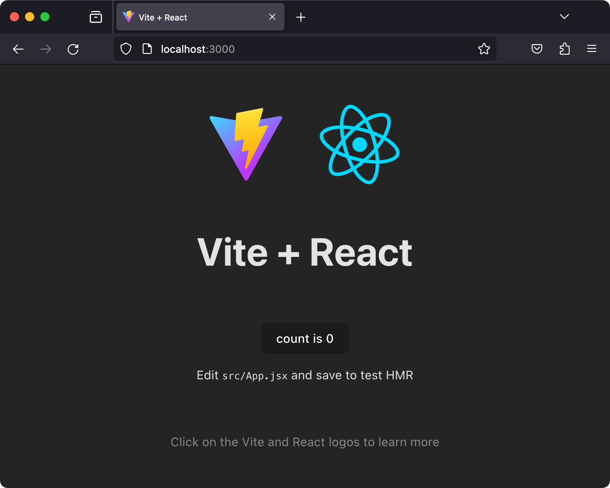

{{PreviousMenuNext("Learn_web_development/Core/Frameworks_libraries/Main_features","Learn_web_development/Core/Frameworks_libraries/React_todo_list_beginning", "Learn_web_development/Core/Frameworks_libraries")}}

En este artículo le diremos hola a React. Descubriremos un poco de detalle sobre sus antecedentes y casos de uso, configuraremos una cadena de herramientas básica de React en nuestra computadora local, y crearemos y jugaremos con una aplicación inicial sencilla — aprendiendo un poco sobre cómo funciona React en el proceso.

<table>
  <tbody>
    <tr>
      <th scope="row">Prerrequisitos:</th>
      <td>
        Familiaridad con los lenguajes
        <a href="/es/docs/Learn_web_development/Core/Structuring_content">HTML</a>,
        <a href="/es/docs/Learn_web_development/Core/Styling_basics">CSS</a> y
        <a href="/es/docs/Learn_web_development/Core/Scripting">JavaScript</a>, y con el
        <a href="/es/docs/Learn_web_development/Getting_started/Environment_setup/Command_line">terminal/línea de comandos</a>.
      </td>
    </tr>
    <tr>
      <th scope="row">Resultados del aprendizaje:</th>
      <td>
          Configurar un entorno de desarrollo local de React, crear una aplicación inicial y
          entender los conceptos básicos de cómo funciona.
      </td>
    </tr>
  </tbody>
</table>

## Hola, React

Como su eslogan oficial señala, [React](https://react.dev/) es una biblioteca para construir interfaces de usuario. React no es un _framework_ — ni siquiera es exclusivo de la web. Se usa con otras bibliotecas para renderizar en ciertos entornos. Por ejemplo, [React Native](https://reactnative.dev/) se puede usar para construir aplicaciones móviles.

Para construir para la web, los desarrolladores usan React en conjunto con [ReactDOM](https://react.dev/reference/react-dom). A menudo se habla de React y ReactDOM en los mismos espacios que —y se utilizan para resolver los mismos problemas que— otros verdaderos frameworks de desarrollo web. Cuando nos referimos a React como un "framework", estamos trabajando con esa comprensión coloquial.

El objetivo principal de React es minimizar los errores que ocurren cuando los desarrolladores construyen interfaces de usuario. Lo logra mediante el uso de componentes — piezas de código lógicas y autocontenidas que describen una parte de la interfaz de usuario. Estos componentes se pueden componer juntos para crear una interfaz de usuario completa, y React abstrae gran parte del trabajo de renderizado, dejándote concentrarte en el diseño de la interfaz.

## Casos de uso

A diferencia de los otros frameworks cubiertos en este módulo, React no impone reglas estrictas sobre convenciones de código u organización de archivos. Esto permite que los equipos establezcan las convenciones que mejor les funcionen y adopten React de la manera que quieran. React puede manejar un solo botón, algunas piezas de una interfaz o toda la interfaz de usuario de una aplicación.

Si bien React _puede_ usarse para [pequeñas piezas de una interfaz](https://react.dev/learn/add-react-to-an-existing-project), no es tan fácil "insertarlo" en una aplicación como una biblioteca como jQuery, o incluso un framework como Vue — es más abordable cuando construyes toda tu aplicación con React.

Además, muchos de los beneficios de la experiencia de desarrollo de una aplicación React, como escribir interfaces con JSX, requieren un proceso de compilación. Agregar un compilador como Babel a un sitio web hace que el código se ejecute lentamente, por lo que los desarrolladores a menudo configuran dichas herramientas con un paso de compilación. Podría decirse que React tiene un requisito de herramientas considerable, pero se puede aprender.

Este artículo se centrará en el caso de uso de usar React para renderizar toda la interfaz de usuario de una aplicación con el soporte de [Vite](https://vite.dev/), una herramienta de compilación front-end moderna.

## ¿Cómo usa React JavaScript?

React utiliza características de JavaScript moderno para muchos de sus patrones. Su mayor diferencia con JavaScript viene con el uso de la sintaxis [JSX](https://react.dev/learn/writing-markup-with-jsx). JSX amplía la sintaxis de JavaScript para que el código similar a HTML pueda coexistir con ella. Por ejemplo:

```jsx
const heading = <h1>Mozilla Developer Network</h1>;
```

Esta constante `heading` se conoce como una **expresión JSX**. React puede usarla para renderizar la etiqueta [`<h1>`](/es/docs/Web/HTML/Reference/Elements/Heading_Elements) en nuestra aplicación.

Supongamos que quisiéramos envolver nuestro encabezado en una etiqueta [`<header>`](/es/docs/Web/HTML/Reference/Elements/header), por razones semánticas. El enfoque JSX nos permite anidar nuestros elementos entre sí, tal como lo hacemos con HTML:

```jsx
const header = (
  <header>
    <h1>Mozilla Developer Network</h1>
  </header>
);
```

> [!NOTE]
> Los paréntesis en el fragmento anterior no son exclusivos de JSX y no tienen ningún efecto en tu aplicación. Son una señal para ti (y tu computadora) de que las múltiples líneas de código dentro forman parte de la misma expresión. Igualmente podrías escribir la expresión del encabezado así:
>
> ```jsx-nolint
> const header = <header>
>   <h1>Mozilla Developer Network</h1>
> </header>;
> ```
>
> Sin embargo, esto se ve un poco raro, porque la etiqueta [`<header>`](/es/docs/Web/HTML/Reference/Elements/header) que inicia la expresión no está sangrada a la misma posición que su correspondiente etiqueta de cierre.

Por supuesto, tu navegador no puede leer JSX sin ayuda. Cuando se compila (usando una herramienta como [Babel](https://babeljs.io/) o [Parcel](https://parceljs.org/)), nuestra expresión de encabezado se vería así:

```jsx
const header = React.createElement(
  "header",
  null,
  React.createElement("h1", null, "Mozilla Developer Network"),
);
```

Es _posible_ omitir el paso de la compilación y usar [`React.createElement()`](https://react.dev/reference/react/createElement) para escribir tu interfaz de usuario tú mismo. Sin embargo, al hacer esto, pierdes el beneficio declarativo de JSX y tu código se vuelve más difícil de leer. La compilación es un paso adicional en el proceso de desarrollo, pero muchos desarrolladores de la comunidad React piensan que la legibilidad de JSX vale la pena. Además, el desarrollo front-end moderno casi siempre involucra un proceso de compilación de todos modos — tienes que reducir la sintaxis moderna para que sea compatible con navegadores más antiguos, y es posible que quieras [minificar](/es/docs/Glossary/Minification) tu código para optimizar el rendimiento de carga. Herramientas populares como Babel ya vienen con soporte JSX listo para usar, por lo que no tienes que configurar la compilación tú mismo a menos que quieras.

Dado que JSX es una combinación de HTML y JavaScript, algunos desarrolladores lo encuentran intuitivo. Otros dicen que su naturaleza combinada lo hace confuso. Sin embargo, una vez que te sientas cómodo con él, te permitirá construir interfaces de usuario de forma más rápida e intuitiva, y permitirá que otros comprendan mejor tu base de código de un vistazo.

Para leer más sobre JSX, consulta el artículo [Writing Markup with JSX](https://react.dev/learn/writing-markup-with-jsx) del equipo de React.

## Configurando tu primera aplicación React

Hay muchas maneras de crear una nueva aplicación React. Vamos a usar Vite para crear una nueva aplicación a través de la línea de comandos.

Es posible [agregar React a un proyecto existente](https://react.dev/learn/add-react-to-an-existing-project) copiando algunos elementos [`<script>`](/es/docs/Web/HTML/Reference/Elements/script) en un archivo HTML, pero usar Vite te permitirá dedicar más tiempo a construir tu aplicación y menos a lidiar con la configuración.

> [!NOTE]
> Puedes comenzar a escribir código React sin hacer _ninguna_ configuración local trabajando con el scrim [First React Code](https://scrimba.com/learn-react-c0e/~03uo?via=mdn) <sup>[_socio de aprendizaje de MDN_](/es/docs/MDN/Writing_guidelines/Learning_content#partner_links_and_embeds)</sup> de Scrimba.
> No dudes en probarlo antes de continuar.

### Requerimientos

Para usar Vite, necesitas tener instalado [Node.js](https://nodejs.org/en/). A partir de Vite 5.0, se requiere al menos la versión 18 de Node o posterior, y es buena idea ejecutar la última versión de soporte a largo plazo (LTS) cuando puedas. A partir del 24 de octubre de 2023, Node 20 es la última versión LTS. Node incluye npm (el administrador de paquetes de Node).

Para comprobar tu versión de Node, ejecuta lo siguiente en tu terminal:

```bash
node -v
```

Si Node está instalado, verás un número de versión. Si no lo está, verás un mensaje de error. Para instalar Node, sigue las instrucciones en el [sitio web de Node.js](https://nodejs.org/en/).

Puedes usar el administrador de paquetes Yarn como alternativa a npm, pero asumiremos que estás usando npm en este conjunto de tutoriales. Consulta [Conceptos básicos de administración de paquetes](/es/docs/Learn_web_development/Extensions/Client-side_tools/Package_management) para obtener más información sobre npm y yarn.

Si estás usando Windows, necesitarás instalar algún software para darte paridad con el terminal de Unix/macOS y así poder usar los comandos de terminal mencionados en este tutorial. **Git Bash** (que viene como parte del [conjunto de herramientas git para Windows](https://gitforwindows.org/)) o el **[Subsistema de Windows para Linux](https://learn.microsoft.com/en-us/windows/wsl/about)** (**WSL**) son ambos adecuados. Consulta [Curso intensivo de línea de comandos](/es/docs/Learn_web_development/Getting_started/Environment_setup/Command_line) para obtener más información sobre estos y sobre los comandos de terminal en general.

Ten también en cuenta que React y ReactDOM producen aplicaciones que solo funcionan en un conjunto bastante moderno de navegadores como Firefox, Microsoft Edge, Safari o Chrome cuando trabajas con estos tutoriales.

Consulta lo siguiente para obtener más información:

- ["About npm" en el blog de npm](https://docs.npmjs.com/about-npm/)
- ["Introducing npx" en el blog de npm](https://blog.npmjs.org/post/162869356040/introducing-npx-an-npm-package-runner)
- [La documentación de Vite](https://vite.dev/guide/)

### Inicializando tu aplicación

El administrador de paquetes npm viene con un comando `create` que te permite crear nuevos proyectos a partir de plantillas. Podemos usarlo para crear una nueva aplicación a partir de la plantilla React estándar de Vite. Asegúrate de hacer `cd` al lugar donde te gustaría que viva tu aplicación en tu máquina, y luego ejecuta lo siguiente en tu terminal:

```bash
npm create vite@latest moz-todo-react -- --template react
```

Esto crea un directorio `moz-todo-react` usando la plantilla `react` de Vite.

> [!NOTE]
> El `--` es necesario para pasar argumentos a comandos de npm como `create`, y el argumento `--template react` le dice a Vite que use su plantilla de React.

Tu terminal habrá impreso algunos mensajes si este comando fue exitoso. Deberías ver texto pidiéndote que hagas `cd` a tu nuevo directorio, que instales las dependencias de la aplicación y que ejecutes la aplicación localmente. Comencemos con dos de esos comandos. Ejecuta lo siguiente en tu terminal:

```bash
cd moz-todo-react && npm install
```

Una vez que el proceso esté completo, necesitamos iniciar un servidor de desarrollo local para ejecutar nuestra aplicación. Aquí, vamos a agregar algunas banderas de línea de comandos a la sugerencia predeterminada de Vite para abrir la aplicación en nuestro navegador tan pronto como el servidor se inicie, y usar el puerto 3000.

Ejecuta lo siguiente en tu terminal:

```bash
npm run dev -- --open --port 3000
```

Una vez que el servidor se inicie, deberías ver una nueva pestaña del navegador con tu aplicación React:



### Estructura de la aplicación

Vite nos da todo lo que necesitamos para desarrollar una aplicación React. Su estructura inicial de archivos se ve así:

```plain
moz-todo-react
├── README.md
├── index.html
├── node_modules
├── package-lock.json
├── package.json
├── public
│   └── vite.svg
├── src
│   ├── App.css
│   ├── App.jsx
│   ├── assets
│   │   └── react.svg
│   ├── index.css
│   └── main.jsx
└── vite.config.js
```

**`index.html`** es el archivo de nivel superior más importante. Vite inyecta tu código en este archivo para que tu navegador pueda ejecutarlo. No necesitarás editar este archivo durante nuestro tutorial, pero deberías cambiar el texto dentro del elemento [`<title>`](/es/docs/Web/HTML/Reference/Elements/title) de este archivo para que refleje el título de tu aplicación. Los títulos de página precisos son importantes para la accesibilidad.

El directorio **`public`** contiene archivos estáticos que se servirán directamente a tu navegador sin ser procesados por las herramientas de compilación de Vite. Por ahora, solo contiene un logotipo de Vite.

El directorio **`src`** es donde pasaremos la mayor parte de nuestro tiempo, ya que es donde vive el código fuente de nuestra aplicación. Notarás que algunos archivos JavaScript en este directorio terminan con la extensión `.jsx`. Esta extensión es necesaria para cualquier archivo que contenga JSX — le dice a Vite que convierta la sintaxis JSX en JavaScript que tu navegador pueda entender. El directorio `src/assets` contiene el logotipo de React que viste en el navegador.

Los archivos `package.json` y `package-lock.json` contienen metadatos sobre nuestro proyecto. Estos archivos no son exclusivos de las aplicaciones React: Vite completó `package.json` por nosotros, y npm creó `package-lock.json` cuando instalamos las dependencias de la aplicación. No necesitas entender estos archivos en absoluto para completar este tutorial. Sin embargo, si quieres aprender más sobre ellos, puedes leer sobre [`package.json`](https://docs.npmjs.com/cli/v9/configuring-npm/package-json/) y [`package-lock.json`](https://docs.npmjs.com/cli/v9/configuring-npm/package-lock-json/) en la documentación de npm. También hablamos sobre `package.json` en nuestro tutorial [Conceptos básicos de administración de paquetes](/es/docs/Learn_web_development/Extensions/Client-side_tools/Package_management).

### Personalizando nuestro script de desarrollo

Antes de continuar, quizás quieras cambiar un poco tu archivo `package.json` para no tener que pasar las banderas `--open` y `--port` cada vez que ejecutes `npm run dev`. Abre `package.json` en tu editor de texto y encuentra el objeto `scripts`. Cambia la clave `"dev"` para que se vea así:

```diff
- "dev": "vite",
+ "dev": "vite --open --port 3000",
```

Con esto en su lugar, tu aplicación se abrirá en tu navegador en `http://localhost:3000` cada vez que ejecutes `npm run dev`.

> [!NOTE]
> Aquí _no_ necesitas el `--` extra porque estamos pasando argumentos directamente a `vite`, en lugar de a un script npm predefinido.

## Explorando nuestro primer componente React — `<App />`

En React, un **componente** es un módulo reutilizable que renderiza una parte de nuestra aplicación en general. Los componentes pueden ser grandes o pequeños, pero generalmente están claramente definidos: sirven a un propósito único y obvio.

Abramos `src/App.jsx`, ya que nuestro navegador nos está pidiendo que lo editemos. Este archivo contiene nuestro primer componente, `<App />`:

```jsx
import { useState } from "react";
import viteLogo from "/vite.svg";
import reactLogo from "./assets/react.svg";
import "./App.css";

function App() {
  const [count, setCount] = useState(0);

  return (
    <>
      <div>
        <a href="https://vite.dev" target="_blank">
          
        </a>
        <a href="https://react.dev" target="_blank">
          
        </a>
      </div>
      <h1>Vite + React</h1>
      <div className="card">
        <button onClick={() => setCount((count) => count + 1)}>
          count is {count}
        </button>
        <p>
          Edit <code>src/App.jsx</code> and save to test HMR
        </p>
      </div>
      <p className="read-the-docs">
        Click on the Vite and React logos to learn more
      </p>
    </>
  );
}

export default App;
```

El archivo `App.jsx` consta de tres partes principales: algunas declaraciones [`import`](/es/docs/Web/JavaScript/Reference/Statements/import) en la parte superior, la función `App()` en el medio y una declaración [`export`](/es/docs/Web/JavaScript/Reference/Statements/export) en la parte inferior. La mayoría de los componentes de React siguen este patrón.

### Declaraciones `import`

Las declaraciones `import` en la parte superior del archivo le permiten a `App.jsx` usar código que ha sido definido en otro lugar. Veamos estas declaraciones más de cerca.

```jsx
import { useState } from "react";
import viteLogo from "/vite.svg";
import reactLogo from "./assets/react.svg";
import "./App.css";
```

La primera declaración importa el hook `useState` de la biblioteca `react`. Los hooks son una forma de usar las características de React dentro de un componente. Hablaremos más sobre los hooks más adelante en este tutorial.

Después de eso, importamos `reactLogo` y `viteLogo`. Observa que sus rutas de importación comienzan con `./` y `/` respectivamente y que terminan con la extensión `.svg`. Esto nos dice que estas importaciones son _locales_, refiriéndose a nuestros propios archivos en lugar de paquetes npm.

La declaración final importa el CSS relacionado con nuestro componente `<App />`. Observa que no hay nombre de variable ni directiva `from`. Esto se llama una [importación de efectos secundarios](/es/docs/Web/JavaScript/Reference/Statements/import#importa_un_módulo_entero_para_efectos_secundarios_solamente) — no importa ningún valor al archivo JavaScript, pero le dice a Vite que agregue el archivo CSS referenciado a la salida final del código, para que pueda usarse en el navegador.

### La función `App()`

Después de las importaciones, tenemos una función llamada `App()`, que define la estructura del componente `App`. Mientras que la mayor parte de la comunidad JavaScript prefiere nombres en {{Glossary("camel_case", "camel case")}} como `helloWorld`, los componentes de React usan nombres de variables en PascalCase (o camel case superior) como `HelloWorld`, para dejar claro que un determinado elemento JSX es un componente de React y no una etiqueta HTML normal. Si renombraras la función `App()` a `app()`, tu navegador lanzaría un error.

Veamos `App()` más de cerca.

```jsx
function App() {
  const [count, setCount] = useState(0);

  return (
    <>
      <div>
        <a href="https://vite.dev" target="_blank">
          
        </a>
        <a href="https://react.dev" target="_blank">
          
        </a>
      </div>
      <h1>Vite + React</h1>
      <div className="card">
        <button onClick={() => setCount((count) => count + 1)}>
          count is {count}
        </button>
        <p>
          Edit <code>src/App.jsx</code> and save to test HMR
        </p>
      </div>
      <p className="read-the-docs">
        Click on the Vite and React logos to learn more
      </p>
    </>
  );
}
```

La función `App()` devuelve una expresión JSX. Esta expresión define lo que tu navegador finalmente renderiza en el DOM.

Justo debajo de la palabra clave `return` hay una sintaxis especial: `<>`. Esto es un [fragmento](https://react.dev/reference/react/Fragment). Los componentes de React tienen que devolver un único elemento JSX, y los fragmentos nos permiten hacerlo sin renderizar `<div>`s arbitrarios en el navegador. Verás fragmentos en muchas aplicaciones React.

### La declaración `export`

Hay una línea más de código después de la función `App()`:

```jsx
export default App;
```

Esta declaración de exportación hace que nuestra función `App()` esté disponible para otros módulos. Hablaremos más sobre esto más adelante.

## Continuando con `main`

Abramos `src/main.jsx`, porque es donde se está usando el componente `<App />`. Este archivo es el punto de entrada de nuestra aplicación, e inicialmente se ve así:

```jsx
import { StrictMode } from "react";
import { createRoot } from "react-dom/client";
import "./index.css";
import App from "./App.jsx";

createRoot(document.getElementById("root")).render(
  <StrictMode>
    <App />
  </StrictMode>,
);
```

Al igual que con `App.jsx`, el archivo comienza importando todos los módulos JavaScript y otros activos que necesita para ejecutarse.

Las dos primeras declaraciones importan `StrictMode` y `createRoot` de las bibliotecas `react` y `react-dom` porque se referencian más adelante en el archivo. No escribimos una ruta o extensión al importar estas bibliotecas porque no son archivos locales. De hecho, están listadas como dependencias en nuestro archivo `package.json`. ¡Ten cuidado con esta distinción mientras trabajas en esta lección!

Luego importamos nuestra función `App()` e `index.css`, que contiene estilos globales que se aplican a toda nuestra aplicación.

Luego llamamos a la función `createRoot()`, que define el nodo raíz de nuestra aplicación. Esta toma como argumento el elemento DOM dentro del cual queremos que se renderice nuestra aplicación React. En este caso, es el elemento DOM con un ID de `root`. Finalmente, encadenamos el método `render()` a la llamada `createRoot()`, pasándole la expresión JSX que queremos renderizar dentro de nuestra raíz. Al escribir `<App />` como esta expresión JSX, le estamos diciendo a React que llame a la función `App()`, que renderiza el _componente_ `App` dentro del nodo raíz.

> [!NOTE]
> `<App />` se renderiza dentro de un componente especial `<React.StrictMode>`. Este componente ayuda a los desarrolladores a detectar problemas potenciales en su código.

Puedes leer sobre estas APIs de React, si quieres:

- [`ReactDOM.createRoot()`](https://react.dev/reference/react-dom/client/createRoot)
- [`React.StrictMode`](https://react.dev/reference/react/StrictMode)

## Empezando de cero

Antes de comenzar a construir nuestra aplicación, vamos a eliminar parte del código repetitivo que Vite nos proporcionó.

Primero, como experimento, cambia el elemento [`<h1>`](/es/docs/Web/HTML/Reference/Elements/Heading_Elements) en `App.jsx` para que diga "Hello, World!", y luego guarda tu archivo. Notarás que este cambio se renderiza inmediatamente en el servidor de desarrollo que se ejecuta en `http://localhost:3000` en tu navegador. Ten esto en cuenta mientras trabajas en tu aplicación.

¡No usaremos el resto del código! Reemplaza el contenido de `App.jsx` con lo siguiente:

```jsx
import "./App.css";

function App() {
  return (
    <>
      <header>
        <h1>Hello, World!</h1>
      </header>
    </>
  );
}

export default App;
```

## Práctica con JSX

A continuación, usaremos nuestras habilidades de JavaScript para sentirnos un poco más cómodos escribiendo JSX y trabajando con datos en React. Hablaremos sobre cómo agregar atributos a los elementos JSX, cómo escribir comentarios, cómo renderizar contenido desde variables y otras expresiones, y cómo pasar datos a los componentes con props.

### Añadir atributos a los elementos JSX

Los elementos JSX pueden tener atributos, al igual que los elementos HTML. Intenta agregar un `<button>` debajo del elemento `<h1>` en tu archivo `App.jsx`, así:

```jsx
<button type="button">Click me!</button>
```

Cuando guardes tu archivo, verás un botón con las palabras "Click me!". El botón aún no hace nada, pero pronto aprenderemos sobre cómo agregar interactividad a nuestra aplicación.

Algunos atributos son diferentes a sus contrapartes HTML. Por ejemplo, el atributo `class` en HTML se traduce a `className` en JSX. Esto se debe a que `class` es una palabra reservada en JavaScript, y JSX es una extensión de JavaScript. Si quisieras agregar una clase `primary` a tu botón, lo escribirías así:

```jsx
<button type="button" className="primary">
  Click me!
</button>
```

### Expresiones de JavaScript como contenido

A diferencia de HTML, JSX nos permite escribir variables y otras expresiones de JavaScript junto a nuestro otro contenido. Declaremos una variable llamada `subject` justo arriba de la función `App()` en tu archivo `App.jsx`:

```jsx
const subject = "React";
function App() {
  // código omitido por brevedad
}
```

A continuación, reemplaza la palabra "World" en el elemento `<h1>` con `{subject}`:

```jsx
<h1>Hello, {subject}!</h1>
```

Guarda tu archivo y revisa tu navegador. Deberías ver "Hello, React!" renderizado.

Las llaves alrededor de `subject` son otra característica de la sintaxis de JSX. Las llaves le dicen a React que queremos leer el valor de la variable `subject`, en lugar de renderizar la cadena literal `"subject"`. Puedes poner cualquier expresión de JavaScript válida dentro de llaves en JSX; React la evaluará y renderizará el _resultado_ de la expresión como el contenido final. A continuación se muestra una serie de ejemplos, con comentarios arriba explicando qué renderizará cada expresión:

```jsx-nolint
{/* Hello, React :)! */}
<h1>Hello, {`${subject} :)`}!</h1>
{/* Hello, REACT */}
<h1>Hello, {subject.toUpperCase()}</h1>
{/* Hello, 4! */}
<h1>Hello, {2 + 2}!</h1>
```

¡Incluso los comentarios en JSX se escriben dentro de llaves! Esto se debe a que las llaves pueden contener una única expresión de JavaScript, y los comentarios son válidos como parte de una expresión de JavaScript (y se ignoran). Puedes usar tanto la `/* sintaxis de comentario de bloque */` como la `// sintaxis de comentario de línea` (con una nueva línea final) dentro de llaves.

### Props de componentes

**Los props** son un medio para pasar datos a un componente de React. Su sintaxis es idéntica a la de los atributos, de hecho: `prop="value"`. La diferencia es que mientras los atributos se pasan a elementos simples, los props se pasan a los componentes de React.

En React, el flujo de datos es unidireccional: los props solo se pueden pasar de los componentes padres a los componentes hijos.

Abramos `main.jsx` y démosle a nuestro componente `<App />` su primer prop.

Agrega un prop `subject` a la llamada del componente `<App />`, con un valor de `Clarice`. Cuando termines, debería verse algo así:

```jsx
<App subject="Clarice" />
```

De vuelta en `App.jsx`, revisemos la función `App()`. Cambia la firma de `App()` para que acepte `props` como parámetro y registra `props` en la consola para que puedas inspeccionarlo. También elimina la constante `subject`; ya no la necesitamos. Tu archivo `App.jsx` debería verse así:

```jsx
function App(props) {
  console.log(props);
  return (
    <>
      {
        // código omitido por brevedad
      }
    </>
  );
}
```

Guarda tu archivo y revisa tu navegador. Verás un fondo en blanco sin contenido. Esto se debe a que estamos tratando de leer una variable `subject` que ya no está definida. Arregla esto comentando la línea `<h1>Hello {subject}!</h1>`.

> [!NOTE]
> Si tu editor de código sabe cómo analizar JSX (¡la mayoría de los editores modernos lo hacen!), puedes usar su atajo de comentario integrado — `Ctrl + /` (en Windows) o `Cmd + /` (en macOS) — para crear comentarios más rápidamente.

Guarda el archivo con esa línea comentada. Esta vez, deberías ver tu botón "Click me!" renderizado por sí solo. Si abres la consola de desarrollador de tu navegador, verás un mensaje que se ve así:

```plain
Object { subject: "Clarice" }
```

La propiedad `subject` del objeto corresponde al prop `subject` que agregamos a la llamada de nuestro componente `<App />`, y la cadena `Clarice` corresponde a su valor. Los props de componentes en React siempre se recopilan en objetos de esta manera.

Usemos este prop `subject` para arreglar el error en nuestra aplicación. Descomenta la línea `<h1>Hello, {subject}!</h1>` y cámbiala a `<h1>Hello, {props.subject}!</h1>`, y luego elimina la declaración `console.log()`. Tu código debería verse así:

```jsx
function App(props) {
  return (
    <>
      <header>
        <h1>Hello, {props.subject}!</h1>
        <button type="button" className="primary">
          Click me!
        </button>
      </header>
    </>
  );
}
```

Cuando guardes, la aplicación ahora debería saludarte con "Hello, Clarice!". Si regresas a `main.jsx`, editas el valor de `subject` y guardas, tu texto cambiará.

Para práctica adicional, podrías intentar agregar un prop adicional `greeting` a la llamada del componente `<App />` dentro de `main.jsx` y usarlo junto al prop `subject` dentro de `App.jsx`.

## Resumen

Esto nos lleva al final de nuestra mirada inicial a React, incluyendo cómo instalarlo localmente, crear una aplicación inicial y cómo funcionan los conceptos básicos. En el próximo artículo, comenzaremos a construir nuestra primera aplicación propiamente dicha: una lista de tareas pendientes. Antes de hacer eso, sin embargo, recapitulemos algunas de las cosas que hemos aprendido.

En React:

- Los componentes pueden importar los módulos que necesitan y deben exportarse a sí mismos al final de sus archivos.
- Las funciones de los componentes se nombran con `PascalCase`.
- Puedes renderizar expresiones de JavaScript en JSX poniéndolas entre llaves, como `{so}`.
- Algunos atributos JSX son diferentes a los atributos HTML para que no entren en conflicto con las palabras reservadas de JavaScript. Por ejemplo, `class` en HTML se traduce a `className` en JSX.
- Los props se escriben igual que los atributos dentro de las llamadas a los componentes y se pasan a los componentes.

## Véase también

- [Learn React](https://scrimba.com/learn-react-c0e?via=mdn) <sup>[_socio de aprendizaje de MDN_](/es/docs/MDN/Writing_guidelines/Learning_content#partner_links_and_embeds)</sup>
  - : El curso _Learn React_ de [Scrimba](https://scrimba.com/?via=mdn) es el React 101 definitivo — el punto de partida perfecto para cualquier principiante de React. Aprende los conceptos básicos de React moderno resolviendo más de 140 desafíos de codificación interactivos y construyendo ocho proyectos divertidos.

{{PreviousMenuNext("Learn_web_development/Core/Frameworks_libraries/Main_features","Learn_web_development/Core/Frameworks_libraries/React_todo_list_beginning", "Learn_web_development/Core/Frameworks_libraries")}}
