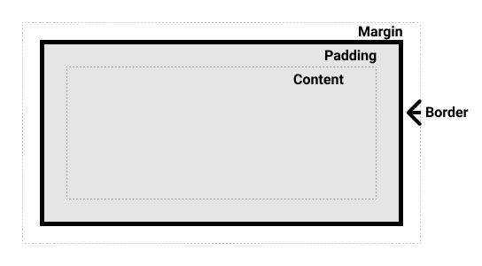
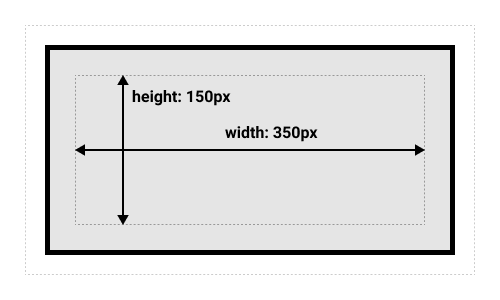
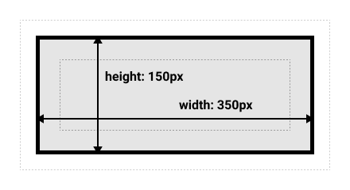
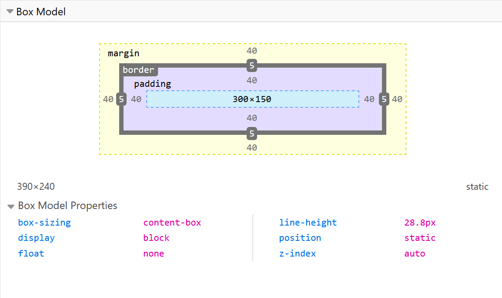

{{LearnSidebar}}

{{PreviousMenuNext("Learn_web_development/Core/Styling_basics/Test_your_skills/Selectors", "Learn_web_development/Core/Styling_basics/Test_your_skills/Box_model", "Learn_web_development/Core/Styling_basics")}}

Todo en CSS tiene una caja alrededor, y comprender estas cajas es clave para poder crear diseños más complejos con CSS, o para alinear elementos entre sí. En esta lección, echaremos un vistazo al _modelo de caja_ de CSS. Vas a entender cómo funciona y la terminología relacionada.

<table>
  <tbody>
    <tr>
      <th scope="row">Requisitos previos:</th>
      <td>
        Conceptos básicos de HTML (estudia
        <a href="/es/docs/Learn_web_development/Core/Structuring_content/Basic_HTML_syntax"
          >Primeros pasos con HTML</a
        >)
      </td>
    </tr>
    <tr>
      <th scope="row">Resultados del aprendizaje:</th>
      <td>
        <ul>
          <li>Elementos de bloque y en línea.</li>
          <li>Las diferentes cajas que conforman un elemento y cómo darles estilo: contenido, margen, borde, relleno.</li>
          <li>El modelo de caja alternativo (al que se accede mediante <code>box-sizing: border-box</code>) y en qué se diferencia del modelo de caja habitual.</li>
          <li>El colapso de márgenes.</li>
          <li>Los valores básicos de <code>display</code> y cómo afectan al comportamiento de la caja: <code>block</code>, <code>inline</code>, <code>inline-block</code>, <code>none</code>.</li>
        </ul>
      </td>
    </tr>
  </tbody>
</table>

## Cajas de bloque y en línea

En CSS tenemos varios tipos de cajas que, en general, se ajustan a las categorías de **cajas de bloque** y **cajas en línea**. El tipo se refiere a cómo se comporta la caja en cuanto al flujo de la página y en relación con otras cajas de la página. Las cajas tienen un **tipo de visualización interna** y un **tipo de visualización externa**.

En general, puedes establecer varios valores para el tipo de visualización mediante la propiedad {{cssxref("display")}}.

Si una caja tiene un valor de visualización `block`, entonces:

- La caja se colocará en una nueva línea.
- Se respetan las propiedades {{cssxref("width")}} y {{cssxref("height")}}.
- El relleno, el margen y el borde harán que otros elementos se alejen de la caja.
- Si no se especifica {{cssxref("width")}}, la caja se extenderá en la dirección en línea para llenar el espacio disponible en su contenedor. En la mayoría de los casos, la caja será tan ancha como su contenedor, ocupando el 100% del espacio disponible.

Algunos elementos HTML, como `<h1>` y `<p>`, usan `block` como tipo de visualización externa de forma predeterminada.

Si una caja tiene un tipo de visualización `inline`, entonces:

- La caja no se colocará en una nueva línea.
- Las propiedades {{cssxref("width")}}, {{cssxref("height")}} y los márgenes superior e inferior no tendrán efecto.
- El relleno y los bordes **superior e inferior** cambiarán el tamaño de la caja sin afectar la posición del contenido circundante, lo que puede causar superposición.
- El relleno, los márgenes y los bordes **izquierdo y derecho** afectarán la posición del contenido en línea circundante.

Algunos elementos HTML, como `<a>`, `<span>`, `<em>` y `<strong>`, usan `inline` como tipo de visualización externa de forma predeterminada.

La disposición en bloque y en línea es la forma predeterminada en la que se comportan las cosas en la web. De forma predeterminada y sin ninguna otra instrucción, los elementos dentro de una caja también se disponen en **[flujo normal](/es/docs/Learn_web_development/Core/CSS_layout/Introduction#normal_layout_flow)** y se comportan como cajas de bloque o en línea.

## Tipos de visualización interna y externa

Se dice que los valores de visualización `block` e `inline` son tipos de **visualización externa**: afectan cómo se dispone la caja en relación con otras cajas a su alrededor. Las cajas también tienen un tipo de **visualización interna**, que determina cómo se disponen los elementos dentro de esa caja.

Puedes cambiar el tipo de visualización interna estableciendo un valor de visualización interna, por ejemplo, `display: flex;`. El elemento seguirá usando el tipo de visualización externa `block`, pero esto cambia el tipo de visualización interna a `flex`. Cualquier hijo directo de esta caja se convertirá en un elemento flexible y se comportará de acuerdo con la especificación de [Flexbox](/es/docs/Learn_web_development/Core/CSS_layout/Flexbox).

Cuando avances para aprender sobre el diseño en CSS con más detalle, te encontrarás con [`flex`](/es/docs/Learn_web_development/Core/CSS_layout/Flexbox) y otros valores internos que pueden tener tus cajas, por ejemplo, [`grid`](/es/docs/Learn_web_development/Core/CSS_layout/Grids).

No te preocupes demasiado por la terminología de interno y externo por ahora; esto es lo que ocurre internamente, y lo mencionamos aquí por si te lo encuentras en otro lugar. Por lo general, solo tratarás con valores únicos de `display`, y no necesitarás pensar mucho en ello.

## Ejemplos de diferentes tipos de visualización

El siguiente ejemplo tiene tres elementos HTML diferentes, todos con un tipo de visualización externa `block`.

- Un párrafo con un borde añadido en CSS. El navegador lo representa como una caja de bloque. El párrafo comienza en una nueva línea y se extiende horizontalmente para llenar todo el ancho disponible.

- Una lista, que se dispone usando `display: flex`. Esto establece un diseño flexible para los hijos del contenedor, que son elementos flexibles dispuestos en fila de forma predeterminada. La lista en sí es una caja de bloque y, al igual que el párrafo, se expande al ancho completo del contenedor y se coloca en una nueva línea.

- Un párrafo a nivel de bloque, dentro del cual hay dos elementos `<span>`. Estos elementos normalmente serían `inline`; sin embargo, uno de ellos tiene una clase `block` y se establece en `display: block`. Como resultado, esa única palabra comienza en una nueva línea que ocupa todo el ancho de su elemento padre.

```html live-sample___block
<p>I am a paragraph. A short one.</p>
<ul>
  <li>Item One</li>
  <li>Item Two</li>
  <li>Item Three</li>
</ul>
<p>
  I am another paragraph. Some of the <span class="block">words</span> have been
  wrapped in a <span>span element</span>.
</p>
```

```css live-sample___block
body {
  font-family: sans-serif;
}
p,
ul {
  border: 2px solid rebeccapurple;
  padding: 0.2em;
}

.block,
li {
  border: 2px solid blue;
  padding: 0.2em;
}

ul {
  display: flex;
  list-style: none;
}

.block {
  display: block;
}
```

{{EmbedLiveSample("block", "", "220px")}}

En el siguiente ejemplo, podemos ver cómo se comportan los elementos `inline`.

- Los elementos `<span>` del primer párrafo son en línea de forma predeterminada, por lo que no fuerzan saltos de línea.

- El elemento `<ul>`, que se establece en `display: inline-flex`, crea una caja en línea que contiene algunos elementos flexibles.

- Los dos párrafos se establecen en `display: inline`. El contenedor flexible en línea y los párrafos se juntan todos en una sola línea en lugar de saltar a nuevas líneas (como lo harían si se mostraran como elementos de nivel de bloque).

Para alternar entre los modos de visualización, puedes cambiar `display: inline` a `display: block`, o `display: inline-flex` a `display: flex`:

```html live-sample___inline
<p>
  I am a paragraph. Some of the
  <span>words</span> have been wrapped in a <span>span element</span>.
</p>
<ul>
  <li>Item One</li>
  <li>Item Two</li>
  <li>Item Three</li>
</ul>
<p class="inline">I am a paragraph. A short one.</p>
<p class="inline">I am another paragraph. Also a short one.</p>
```

```css live-sample___inline
body {
  font-family: sans-serif;
}
p,
ul {
  border: 2px solid rebeccapurple;
}

span,
li {
  border: 2px solid blue;
}

ul {
  display: inline-flex;
  list-style: none;
  padding: 0;
}

.inline {
  display: inline;
}
```

{{EmbedLiveSample("inline")}}

Lo más importante que debes recordar por ahora es: cambiar el valor de la propiedad `display` puede cambiar si el tipo de visualización externa de una caja es de bloque o en línea. Esto cambia la forma en que se muestra junto a otros elementos en el diseño.

## ¿Qué es el modelo de caja CSS?

El modelo de caja CSS en su conjunto se aplica a las cajas de bloque y define cómo las diferentes partes de una caja (margen, borde, relleno y contenido) trabajan juntas para crear una caja que puedes ver en una página. Las cajas en línea usan solo _parte_ del comportamiento definido en el modelo de caja.

Para añadir complejidad, existe un modelo de caja estándar y otro alternativo. De forma predeterminada, los navegadores usan el modelo de caja estándar.

### Partes de una caja

Una caja de bloque en CSS está formada por:

- **Caja de contenido**: el área donde se muestra tu contenido; ajusta su tamaño con propiedades como {{cssxref("width")}} y {{cssxref("height")}}.
- **Caja de relleno**: el relleno rodea el contenido como espacio en blanco; ajusta su tamaño con {{cssxref("padding")}} y propiedades relacionadas.
- **Caja de borde**: la caja de borde envuelve el contenido y cualquier relleno; ajusta su tamaño con {{cssxref("border")}} y propiedades relacionadas.
- **Caja de margen**: el margen es la capa más externa, que envuelve el contenido, el relleno y el borde como espacio en blanco entre esta caja y otros elementos; ajusta su tamaño con {{cssxref("margin")}} y propiedades relacionadas.

El siguiente diagrama muestra estas capas:



### El modelo de caja CSS estándar

En el modelo de caja estándar, si estableces valores para las propiedades `width` y `height` en una caja, estos valores definen el `width` y el `height` de la _caja de contenido_. Luego, cualquier relleno y borde se añaden a esas dimensiones para obtener el tamaño total que ocupa la caja (consulta la imagen a continuación).

Si suponemos que una caja tiene el siguiente CSS:

```css
.box {
  width: 350px;
  height: 150px;
  margin: 10px;
  padding: 25px;
  border: 5px solid black;
}
```

El espacio _real_ que ocupa la caja será de `410px` de ancho (350 + 25 + 25 + 5 + 5) y `210px` de alto (150 + 25 + 25 + 5 + 5).



> [!NOTE]
> El margen no cuenta para el tamaño real de la caja: sí, afecta el espacio total que la caja ocupará en la página, pero solo el espacio fuera de la caja. El área de la caja termina en el borde, no se extiende hasta el margen.

### El modelo de caja CSS alternativo

En el modelo de caja alternativo, cualquier ancho es el ancho de la caja visible en la página. El ancho del área de contenido es ese ancho menos el ancho del relleno y el borde (consulta la imagen a continuación). Esto es conveniente porque no hace falta sumar el borde y el relleno para obtener el tamaño real de la caja.

Para activar el modelo alternativo en un elemento, establece `box-sizing: border-box` en él:

```css
.box {
  box-sizing: border-box;
}
```

Si suponemos que la caja tiene el mismo CSS que antes:

```css
.box {
  width: 350px;
  height: 150px;
  margin: 10px;
  padding: 25px;
  border: 5px solid black;
}
```

El espacio _real_ que ocupa la caja será ahora `350px` en la dirección en línea y `150px` en la dirección de bloque.



Para usar el modelo de caja alternativo en todos tus elementos (una opción común entre los desarrolladores), establece la propiedad `box-sizing` en el elemento `<html>` y haz que todos los demás elementos hereden ese valor:

```css
html {
  box-sizing: border-box;
}

*,
*::before,
*::after {
  box-sizing: inherit;
}
```

Para entender la idea subyacente, puedes leer [el artículo de CSS Tricks sobre box-sizing](https://css-tricks.com/inheriting-box-sizing-probably-slightly-better-best-practice/).

## Jugar con los modelos de caja

En el siguiente ejemplo, puedes ver dos cajas. Ambas tienen una clase `.box`, que les da el mismo `width`, `height`, `margin`, `border` y `padding`. La única diferencia es que la segunda caja se ha configurado para usar el modelo de caja alternativo.
¿Puedes cambiar el tamaño de la segunda caja (añadiendo CSS a la clase `.alternate`) para que coincida con la primera en ancho y alto?

```html live-sample___box-models
<div class="box">I use the standard box model.</div>
<div class="box alternate">I use the alternate box model.</div>
```

```css live-sample___box-models
.box {
  border: 5px solid rebeccapurple;
  background-color: lightgray;
  padding: 40px;
  margin: 40px;
  width: 300px;
  height: 150px;
}

.alternate {
  box-sizing: border-box;
}
```

{{EmbedLiveSample("box-models", "", "400px")}}

> [!NOTE]
> Puedes encontrar una solución para esta tarea [en nuestro repositorio css-examples](https://github.com/mdn/css-examples/blob/main/learn/solutions.md#the-box-model).

### Usar las herramientas de desarrollo del navegador para ver el modelo de caja

Las [herramientas de desarrollo de tu navegador](/es/docs/Learn_web_development/Howto/Tools_and_setup/What_are_browser_developer_tools) pueden facilitar mucho la comprensión del modelo de caja: pueden mostrarte el tamaño del elemento más su margen, relleno y borde. Inspeccionar un elemento de esta manera es una excelente forma de averiguar si tu caja realmente tiene el tamaño que crees.



## Márgenes, relleno y bordes

Ya has visto las propiedades {{cssxref("margin")}}, {{cssxref("padding")}} y {{cssxref("border")}} en acción en el ejemplo anterior. Las propiedades usadas en ese ejemplo son **abreviadas** y nos permiten establecer los cuatro lados de la caja a la vez. Estas abreviaturas también tienen propiedades equivalentes sin abreviar, que permiten controlar los diferentes lados de la caja individualmente.

Vamos a explorar estas propiedades con más detalle.

### Margen

El margen es un espacio invisible alrededor de tu caja. Aleja otros elementos de la caja. Los márgenes pueden tener valores positivos o negativos. Establecer un margen negativo en un lado de tu caja puede hacer que se superponga con otras cosas en la página. Ya sea que uses el modelo de caja estándar o el alternativo, el margen siempre se añade después de haber calculado el tamaño de la caja visible.

Podemos controlar todos los márgenes de un elemento a la vez usando la propiedad {{cssxref("margin")}}, o cada lado individualmente usando las propiedades equivalentes sin abreviar:

- {{cssxref("margin-top")}}
- {{cssxref("margin-right")}}
- {{cssxref("margin-bottom")}}
- {{cssxref("margin-left")}}

#### Jugar con los márgenes

Edita el siguiente ejemplo. Prueba a cambiar los valores de margen para ver cómo se desplaza la caja debido a que el margen crea o elimina espacio (si es un margen negativo) entre este elemento y el elemento contenedor.

```html live-sample___margin
<div class="container">
  <div class="box">Change my margin.</div>
</div>
```

```css live-sample___margin
.container {
  border: 5px solid blue;
  margin: 40px;
}

.box {
  border: 5px solid rebeccapurple;
  background-color: lightgray;
  padding: 10px;
  height: 100px;
  /* prueba cambiar las propiedades de margen: */
  margin-top: -40px;
  margin-right: 30px;
  margin-bottom: 40px;
  margin-left: 4em;
}
```

{{EmbedLiveSample("margin", "", "220px")}}

#### Colapso de márgenes

Dependiendo de si dos elementos cuyos márgenes se tocan tienen márgenes positivos o negativos, los resultados serán diferentes:

- Dos márgenes positivos se combinan para convertirse en uno solo. Su tamaño será igual al del margen individual más grande.
- Dos márgenes negativos colapsarán y se usará el valor más pequeño (el más alejado de cero).
- Si un margen es negativo, su valor se _restará_ del total.

En el siguiente ejemplo, tenemos dos párrafos. El párrafo superior tiene un `margin-bottom` de 50 píxeles, y el otro tiene un `margin-top` de 30 píxeles. Los márgenes han colapsado, por lo que el margen real entre las cajas es de 50 píxeles y no la suma de los dos márgenes.

Puedes probar esto estableciendo el `margin-top` del segundo párrafo en `0`. El margen visible entre los dos párrafos no cambiará: conserva los 50 píxeles establecidos en el `margin-bottom` del primer párrafo. Si lo estableces en `-10px`, verás que el margen total pasa a ser `40px`: se resta de los `50px`.

```html live-sample___margin-collapse
<div class="container">
  <p class="one">I am paragraph one.</p>
  <p class="two">I am paragraph two.</p>
</div>
```

```css live-sample___margin-collapse
.container {
  border: 5px solid blue;
  margin: 40px;
}

p {
  border: 5px solid rebeccapurple;
  background-color: lightgray;
  padding: 10px;
}
.one {
  margin-bottom: 50px;
}

.two {
  margin-top: 30px;
}
```

{{EmbedLiveSample("margin-collapse", "", "280px")}}

Una serie de reglas determinan cuándo los márgenes colapsan y cuándo no. Para más información, consulta la página detallada sobre [cómo dominar el colapso de márgenes](/es/docs/Web/CSS/Guides/Box_model/Margin_collapsing). Lo principal que debes recordar es que el colapso de márgenes es algo que puede ocurrir si estás creando espacio con márgenes y no obtienes el espacio que esperas.

> [!NOTE]
> [Aprende los márgenes con banderas](https://scrimba.com/frontend-path-c0j/~01e?via=mdn) <sup>[_socio de aprendizaje de MDN_](/es/docs/MDN/Writing_guidelines/Learning_content#partner_links_and_embeds)</sup>, de Scrimba, es una lección interactiva que ofrece práctica útil con los márgenes.

### Bordes

El borde se dibuja entre el margen y el relleno de una caja. Si usas el modelo de caja estándar, el tamaño del borde se añade al `width` y al `height` de la caja de contenido. Si usas el modelo de caja alternativo, cuanto más grande sea el borde, más pequeña será la caja de contenido, ya que el borde ocupa parte del `width` y `height` disponibles de la caja del elemento.

Para dar estilo a los bordes hay una gran cantidad de propiedades: hay cuatro bordes, y cada borde tiene un estilo, un ancho y un color que podríamos querer manipular.

Puedes establecer el ancho, el estilo o el color de los cuatro bordes a la vez usando la propiedad {{cssxref("border")}}.

Para establecer las propiedades de cada lado individualmente, usa:

- {{cssxref("border-top")}}
- {{cssxref("border-right")}}
- {{cssxref("border-bottom")}}
- {{cssxref("border-left")}}

Para establecer el ancho, el estilo o el color de todos los lados, usa:

- {{cssxref("border-width")}}
- {{cssxref("border-style")}}
- {{cssxref("border-color")}}

Para establecer el ancho, el estilo o el color de un solo lado, usa una de las propiedades sin abreviar más específicas:

- {{cssxref("border-top-width")}}
- {{cssxref("border-top-style")}}
- {{cssxref("border-top-color")}}
- {{cssxref("border-right-width")}}
- {{cssxref("border-right-style")}}
- {{cssxref("border-right-color")}}
- {{cssxref("border-bottom-width")}}
- {{cssxref("border-bottom-style")}}
- {{cssxref("border-bottom-color")}}
- {{cssxref("border-left-width")}}
- {{cssxref("border-left-style")}}
- {{cssxref("border-left-color")}}

#### Jugar con los bordes

En el siguiente ejemplo hemos usado varias propiedades abreviadas y sin abreviar para crear bordes. Edita las diferentes propiedades para comprobar que entiendes cómo funcionan. Las páginas de MDN sobre las propiedades de borde te dan información sobre los diferentes estilos de borde disponibles.

```html live-sample___border
<div class="container">
  <div class="box">Change my borders.</div>
</div>
```

```css live-sample___border
body {
  font-family: sans-serif;
}
.container {
  margin: 40px;
  padding: 20px;
  border-top: 5px dotted green;
  border-right: 1px solid black;
  border-bottom: 20px double rgb(23 45 145);
}

.box {
  padding: 20px;
  background-color: lightgray;
  border: 1px solid #333333;
  border-top-style: dotted;
  border-right-width: 20px;
  border-bottom-color: hotpink;
}
```

{{EmbedLiveSample("border", "", "220px")}}

### Relleno

El relleno se ubica entre el borde y el área de contenido, y se usa para alejar el contenido del borde. A diferencia de los márgenes, no puedes tener un relleno negativo. Cualquier fondo aplicado a tu elemento se mostrará detrás del relleno.

La propiedad {{cssxref("padding")}} controla el relleno en todos los lados de un elemento. Para controlar cada lado individualmente, usa estas propiedades sin abreviar:

- {{cssxref("padding-top")}}
- {{cssxref("padding-right")}}
- {{cssxref("padding-bottom")}}
- {{cssxref("padding-left")}}

#### Jugar con el relleno

En el siguiente ejemplo, edita los valores de relleno en la clase `.box` y observa cómo cambia dónde comienza el texto en relación con la caja. También puedes cambiar el relleno en la clase `.container` para crear espacio entre el contenedor y la caja. Puedes cambiar el relleno en cualquier elemento para crear espacio entre su borde y lo que sea que esté dentro de ese elemento.

```html live-sample___padding
<div class="container">
  <div class="box">Change my padding.</div>
</div>
```

```css live-sample___padding
body {
  font-family: sans-serif;
}
.box {
  border: 5px solid rebeccapurple;
  background-color: lightgray;
  padding-top: 0;
  padding-right: 30px;
  padding-bottom: 40px;
  padding-left: 4em;
}

.container {
  border: 5px solid blue;
  margin: 40px;
  padding: 20px;
}
```

{{EmbedLiveSample("padding", "", "220px")}}

## El modelo de caja y las cajas en línea

Todo lo anterior se aplica por completo a las cajas de bloque. Algunas de las propiedades también pueden aplicarse a las cajas en línea, como las creadas por un elemento `<span>`.

En el siguiente ejemplo, tenemos un `<span>` dentro de un párrafo. Le hemos aplicado `width`, `height`, `margin`, `border` y `padding`. Puedes ver que el ancho, el alto y los márgenes superior e inferior no afectan al `<span>`. El relleno y los bordes superior e inferior alteran el tamaño de la caja en línea, pero no afectan la posición del contenido circundante. En cambio, el relleno y los bordes superior e inferior se superponen a otras palabras del párrafo. Solo el relleno, los márgenes y los bordes izquierdo y derecho afectan la posición del texto que rodea al `<span>`.

```html live-sample___inline-box-model
<p>
  I am a paragraph and this is a <span>span</span> inside that paragraph. A span
  is an inline element and so does not respect width and height.
</p>
```

```css live-sample___inline-box-model
body {
  font-family: sans-serif;
}
p {
  border: 2px solid rebeccapurple;
  width: 200px;
}
span {
  margin: 20px 30px;
  padding: 10px 20px;
  width: 80px;
  height: 150px;
  background-color: lightblue;
  border: solid blue;
  border-width: 7px 1px;
}
```

{{EmbedLiveSample("inline-box-model")}}

## Usar display: inline-block

`display: inline-block` es un valor especial de `display`, que ofrece un punto intermedio entre `inline` y `block`. Úsalo si no quieres que un elemento se coloque en una nueva línea, pero sí quieres que respete `width` y `height` y evite la superposición que vimos antes.

Un elemento con `display: inline-block` hace un subconjunto de las cosas de bloque que ya conocemos:

- Se respetan las propiedades `width` y `height`.
- `padding`, `margin` y `border` harán que otros elementos se alejen de la caja.

Sin embargo, no se coloca en una nueva línea, y solo se hará más grande que su contenido si añades explícitamente las propiedades `width` y `height`.

### Jugar con inline-block

En este siguiente ejemplo, hemos añadido `display: inline-block` a nuestro elemento `<span>`. Prueba a cambiar esto a `display: block`, o a eliminar la línea por completo, para ver la diferencia entre los modelos de visualización:

```html live-sample___inline-block
<p>
  I am a paragraph and this is a <span>span</span> inside that paragraph. A span
  is an inline element and so does not respect width and height.
</p>
```

```css live-sample___inline-block
body {
  font-family: sans-serif;
}
p {
  border: 2px solid rebeccapurple;
  width: 300px;
}

span {
  margin: 20px;
  padding: 20px;
  width: 80px;
  height: 50px;
  background-color: lightblue;
  border: 2px solid blue;
  display: inline-block;
}
```

{{EmbedLiveSample("inline-block", "", "240px")}}

Esto puede ser útil cuando quieres dar a un enlace un área de clic más grande añadiendo `padding`. `<a>` es un elemento en línea como `<span>`; puedes usar `display: inline-block` para poder establecerle un relleno, lo que facilita al usuario hacer clic en el enlace.

Esto se ve con bastante frecuencia en las barras de navegación. La siguiente navegación se muestra en una fila usando flexbox, y hemos añadido relleno al elemento `<a>` porque queremos poder cambiar el `background-color` cuando se pasa el cursor sobre el `<a>`. El relleno parece superponerse al borde del elemento `<ul>`. Esto se debe a que el `<a>` es un elemento en línea.

Añade `display: inline-block;` a la regla con el selector `.links-list a`, y verás cómo esto soluciona el problema al hacer que otros elementos respeten el relleno:

```html live-sample___inline-block-nav
<nav>
  <ul class="links-list">
    <li><a href="">Link one</a></li>
    <li><a href="">Link two</a></li>
    <li><a href="">Link three</a></li>
  </ul>
</nav>
```

```css live-sample___inline-block-nav
ul {
  font-family: sans-serif;
  display: flex;
  list-style: none;
  border: 1px solid black;
}

li {
  margin: 5px;
}

.links-list a {
  background-color: rgb(179 57 81);
  color: white;
  text-decoration: none;
  padding: 1em 2em;
}

.links-list a:hover {
  background-color: rgb(66 28 40);
  color: white;
}
```

{{EmbedLiveSample("inline-block-nav")}}

## Resumen

Eso es la mayor parte de lo que necesitas entender sobre el modelo de caja. Es posible que quieras volver a esta lección en el futuro si alguna vez te encuentras confundido sobre el tamaño de las cajas en tu diseño.

En el siguiente artículo, te daremos algunas pruebas que puedes usar para comprobar qué tan bien has entendido y retenido la información que te hemos dado sobre el modelo de caja CSS.

{{PreviousMenuNext("Learn_web_development/Core/Styling_basics/Test_your_skills/Selectors", "Learn_web_development/Core/Styling_basics/Test_your_skills/Box_model", "Learn_web_development/Core/Styling_basics")}}
