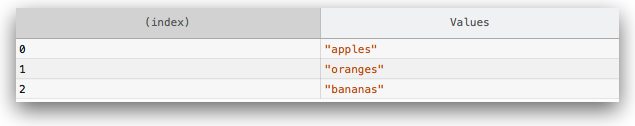
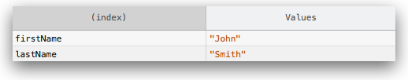
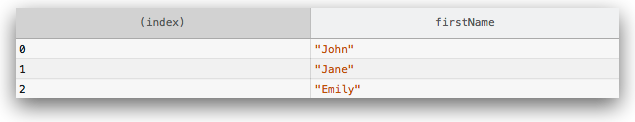

{{APIRef("Console API")}}

Muestra datos tabulares como una tabla.

Esta función toma un argumento obligatorio: `data`, que debe ser un array o un objeto, y un parámetro adicional: `columns`.

Muestra `data` como una tabla en la consola. Cada elemento en el array (o propiedad enumerable si `data` es un objeto) será una fila en la tabla.

La primera columna de la tabla se identificará como `(index)`. Si `data` es un array, sus valores serán los índices del array. Si `data` es un objeto, entonces sus valores serán los nombres de las propiedades. Tenga en cuenta que (en Firefox) `console.table` está limitado a mostrar 1000 filas (la primera columna es la llamada `index`).

{{AvailableInWorkers}}

### Colecciones de tipos primitivos

El argumento `data` puede ser un array o un objeto.

```js
// un array de strings

console.table(["apples", "oranges", "bananas"]);
```



```js
// un objeto cuyas propiedades son strings

function Person(firstName, lastName) {
  this.firstName = firstName;
  this.lastName = lastName;
}

var me = new Person("John", "Smith");

console.table(me);
```



### Colecciones de tipos compuestos

Si los elementos en el array, o propiedades en el objeto, son también arrays u objetos, sus elementos o propiedades serán enumeradas en la fila, una por columna:

```js
// un array de arrays

var people = [["John", "Smith"], ["Jane", "Doe"], ["Emily", "Jones"]]
console.table(people);
```


```js
// un array de objetos

function Person(firstName, lastName) {
  this.firstName = firstName;
  this.lastName = lastName;
}

var john = new Person("John", "Smith");
var jane = new Person("Jane", "Doe");
var emily = new Person("Emily", "Jones");

console.table([john, jane, emily]);
```

Tenga en cuenta que si el array contiene objetos, las columnas se etiquetarán con el nombre de la propiedad.


```js
// un objeto cuyas propiedades son objetos

var family = {};

family.mother = new Person("Jane", "Smith");
family.father = new Person("John", "Smith");
family.daughter = new Person("Emily", "Smith");

console.table(family);
```


### Restringiendo las columnas mostradas

Por defecto, `console.table()` muestra todos los elementos de cada fila. Puedes emplear el parámetro opcional `columns` para seleccionar un subconjunto de columnas que mostrar:

```js
// an array of objects, logging only firstName

function Person(firstName, lastName) {
  this.firstName = firstName;
  this.lastName = lastName;
}

var john = new Person("John", "Smith");
var jane = new Person("Jane", "Doe");
var emily = new Person("Emily", "Jones");

console.table([john, jane, emily], ["firstName"]);
```



### Ordenando columnas

Se puede ordenar la tabla por una columna en particular pulsando en la etiqueta de dicha columna.

## Sintaxis

```
console.table(data [, columns]);
```

### Parámetros

- `data`
  - : La información a mostrar. Puede ser tanto un array como un objeto.
- `columns`
  - : Un array que contenga los nombres de las columnas a incluir.

## Especificaciones

{{Specifications}}

## Compatibilidad con navegadores

{{Compat("api.console.table")}}
