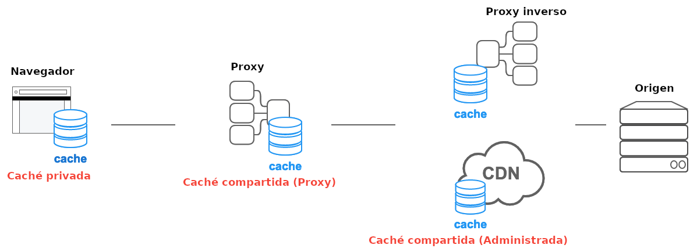

{{HTTPSidebar}}

## Visión general

La caché HTTP almacena una respuesta asociada con una solicitud y reutiliza la respuesta almacenada para solicitudes posteriores.

Hay varias ventajas de reusabilidad. En primer lugar, dado que no es necesario enviar la solicitu al servidor origen, cuanto más cerca están el cliente y la caché, más rápida será la respuesta. El ejemplo más típico es cuando el navegador almacena una caché para las solicitudes.

Además, cuando una respuesta es reutilizable, el servidor de origen no necesita procesar la solicitud, por lo que no necesita parsear y enrutar la solicitud, restaurar la sesión en función de la cookie, consultar los resultados de la base de datos o renderizar la plantilla. Eso reduce la carga en el servidor.

El funcionamiento adecuado de la memoria caché es fundamental para la salud del sistema.

## Tipos de caché

En la especificación [HTTP Caching](https://httpwg.org/specs/rfc9111.html), hay dos tipos principales de caché: **caché privada** y **caché compartida**.

### Caché privada

Una caché privada es una caché vinculada a un cliente específico, generalmente un caché de navegador. Dado que la respuesta almacenada no se comparte con otros clientes, una caché privada puede almacenar una respuesta personalizada para ese usuario.

Por otro lado, si contenidos personalizados se almacenan en una caché que no sea privada, entonces otros usuarios pueden recuperar esos contenidos, lo que puede causar una fuga de información no intencionada.

Si una respuesta contiene contenido personalizado y se desea almacenar la respuesta solo en la caché privada, se debe especificar la directiva `private`.

```http
Cache-Control: private
```

Los contenidos personalizados suelen estar controlados por las cookies, pero la presencia de una cookie no siempre indica que es privada, y por lo tanto, una cookie por sí sola no hace que la respuesta sea privada.

Hay que tener en cuenta que si la respuesta tiene un encabezado `Authorization`, no se puede almacenar en la caché privada (o en una caché compartida, a menos que se especifique `public`).

### Caché compartida

La caché compartida se encuentra entre el cliente y el servidor y puede almacenar respuestas que pueden ser compartidas entre varios usuarios. Las cachés compartidas pueden ser subclasificadas como **cachés proxy** y **cachés administradas**.

#### Cachés proxy

Además de la función de control de acceso, algunos proxies implementan la caché para reducir el tráfico a través de la red. Por lo general, esto no lo administra el desarrollador del servicio, así que debe controlarse con las cabeceras HTTP apropiadas. De todos modos, en el pasado, las implementaciónes de caché de proxy obsoletas, como las implementaciones que no comprenden el estándar de almacenamiento en caché HTTP, a menudo han causado problemas a los desarrolladores.

**Kitchen-sink headers** como los siguientes se utilizan para tratar de evitar las implementaciones de "caché de proxy antiguo y no actualizado" que no comprenden las directivas de especificación de almacenamiento en caché HTTP actuales como `no-store`.

```http
Cache-Control: no-store, no-cache, max-age=0, must-revalidate, proxy-revalidate
```

De todos modos, en los últimos años, a medida que HTTPS se ha vuelto más común y la comunicación cliente/servidor se ha encriptado, las cachés de proxy en la ruta solamente pueden canalizar una respuesta y no pueden comportarse como una caché, en muchos casos. Así que en este escenario, no hay necesidad de preocuparse por las implementaciones obsoletas de la caché proxy que ni siquiera pueden ver la respuesta.

Por otro lado, si un proxy TLS desencripta todas las comunicaciones con un person-in-the-middle, mediante la instalación de un certificado de una CA administrada por la organización en el PC, y realiza el control de acceso, es posible ver los contenidos de la respuesta y cachearla. De todos modos, desde la CT (Transparencia en la certificación) se ha generalizado en los últimos años, y algunos navegadores solamente permiten certificados emitidos con una SCT (Marca de tiempo de Certificado Firmado), este método requiere la aplicación de una política empresarial. En un entorno tan controlado, no hay necesidad de preocuparse de que la caché proxy esté "desactualizada".

#### Cachés administradas

Las cachés administradas son implementadas específicamente por desarrolladores de servicios para evitar la sobrecarga en el servidor de origen y entregar contenido de manera eficiente. Algunos ejemplos pueden ser proxies reversos, CDNs, y service workers en combinacion con la API de caché.

Las características de las cachés administradas varía dependiendo del producto, pero en la mayoría de los casos se puede controlar su comportamiento no solamente a través de `Cache-Control`, sino también a través de su propios archivos de configuración y dashboards.

Por ejemplo, la especificación de caché HTTP no define esencialmente un modo explícito de eliminar una caché, pero con una caché administrada, la respuesta almacenada puede ser eliminada cada vez a través de los dashboards, llamadas a la API, reinicios y más. Esto permite una estrategia de caché más proactiva.

También es posible ignorar los protocolos de especificación del estándar de caché HTTP a favor de la manipulación explícita. Por ejemplo, se puede especificar lo siguiente para excluir una caché privada o una caché proxy, mientras se usa su propia estrategia para almacenar caché en una caché administrada.

```http
Cache-Control: no-store
```

Por ejemplo, Varnish usa la lógica basada en VCL para manegar el almacenamiento caché, mientras los service workes, en combinación con la API, permiten crear esa lógica en Javascript.

Eso significa que si una caché administrada ignora intencionalmente una directiva `no-store`, entonces no hay necesidad de percibirla como "no compatible" con el estándar. Lo que se debería hacer entonces es evitar cabeceras kitchen-sink", pero leer atentamente la documentación del mecanismo de caché administrada que se esté usando, y asegurarse que se está controlando la caché correctamente de la manera proporcionada por el mecanismo que se ha elegido utilizar.

Se debe tener en cuenta que algunas CDNs proporcionan sus propias cabeceras que son solamente efectivas por esa misma CDN (por ejemplo `Surrogate-Control`). Actualmente se está trabajando para definir un encabezado para estandarizarlo [`CDN-Cache-Control`](https://httpwg.org/specs/rfc9213.html)



## Caché heurística

HTTP está diseñado para almacenar en caché tanto como sea posible, por lo que incluso si no se proporciona una cabecera `Cache-Control`, las respuestas se almacenarán y reutilizarán si se cumplen ciertas condiciones. A esto se le conoce como **Caché heurística**

Por ejemplo, en el ejemplo siguiente la respuesta fué actualizada hace un año.

```http
HTTP/1.1 200 OK
Content-Type: text/html
Content-Length: 1024
Date: Tue, 22 Feb 2022 22:22:22 GMT
Last-Modified: Tue, 22 Feb 2021 22:22:22 GMT

<!doctype html>
...
```

Se sabe heurísticamente que el contenido que no se ha actualizado durante un año no se actualizará durante algún tiempo después de eso. Por lo tanto, el cliente almacena esta respuesta (a pesar de la falta de `max-age`) y la reutiliza por un tiempo. El tiempo de reutilización depende de la implementación, pero la especificación recomienda acerca de un 10% (en este caso 0.1 años) del tiempo después del almacenamiento.

El almacenamiento en caché heurístico es una solución que surgió antes de que el soporte de `Cache-Control` se generalizara, y básicamente todas las respuestas deben especificar explícitamente un encabezado `Cache-Control`.

## Estados fresh y stale según la edad

Las respuestas HTTP tienen dos estados: **fresh** (nuevo) y **stale** (viejo). El estado _fresh_ indica, generalmente, que la respuesta sigue siendo válida y puede ser reusada, mientras que el estado _stale_ significa que la respuesta cacheada ya ha expirado.

El criterio para determinar cuando una respuesta es _fresh_ y cuando es _stale_ es el tiempo de vida. En HTTP, age es el tiempo que ha pasado desde que la respuesta fue generada. Esto es similar al TTL en otros sistemas de caché

Aquí nos encontramos con el siguiente ejemplo (604800 segundos es una semana).

```http
HTTP/1.1 200 OK
Content-Type: text/html
Content-Length: 1024
Date: Tue, 22 Feb 2022 22:22:22 GMT
Cache-Control: max-age=604800

<!doctype html>
...
```

La caché que almacenó esa respuesta cuenta el tiempo transcurrido desde que la respuesta fue generada. El significado de `max-age` es que si la respuesta se creó hace menos de una semana, entonces es _fresh_, y si se creó hace más de una semana, entonces es _stale_ .

Si esa respuesta está almacenada en una caché privada, estará disponible para su reutilización en respuesta a las solicitudes de los clientes durante una semana después de que se almacene. Si la caché compartida lo guarda, es necesario informar al cliente del tiempo transcurrido desde que fue almacenada en la caché compartida hasta que sea reutilizada por el cliente. Si la respuesta ha sido almacenada en la caché compartida durante un día y luego el cliente la reutilizó, entonces la siguiente respuesta será enviada desde la caché compartida al cliente.

```http
HTTP/1.1 200 OK
Content-Type: text/html
Content-Length: 1024
Date: Tue, 22 Feb 2022 22:22:22 GMT
Cache-Control: max-age=604800
Age: 86400

<!doctype html>
...
```

El cliente que recibe esa respuesta la encontrará _fresh_ durante los 604800-86400 segundos restantes; es decir, por 518400 segundos más.

## Expires o max-age

En HTTP/1.0, freshness solía ser especificada por el header `Expires`.

El header `Expires` especifica la vida útil de la memoria caché usando una fecha explícita en lugar de un tiempo transcurrido.

```http
Expires: Tue, 28 Feb 2022 22:22:22 GMT
```

Sin embargo, el formato de hora es difícil de analizar, de ahí a que se encontraran varios bugs en la implementación, y es posible inducir problemas cambiando intencionalmente el reloj del sistema. Por lo tanto, `max-age`, para especificar un tiempo transcurrido, se adoptó para `Cache-Control` en HTTP/1.1.

Si tanto `Expires` como `Cache-Control: max-age` están disponibles, `max-age` se define como preferido. Por lo tanto, no es necesario proporcionar `Expires` ahora que HTTP/1.1 se usa ampliamente.

## Vary

La forma en que las respuestas se distinguen entre sí se basa esencialmente en sus URL:


Pero el contenido de las respuestas no siempre es el mismo aunque tengan la misma URL. Especialmente cuando se realiza la negociación de contenido, la respuesta del servidor puede depender de los valores de los headers de solicitud `Accept`, `Accept-Language` y `Accept-Encoding`.

Por ejemplo, para el contenido en inglés devuelto con un header `Accept-Language: en` y almacenado en caché, no es deseable reutilizar esa respuesta almacenada en caché para las solicitudes que tienen un header de solicitud `Accept-Language: ja`. En este caso, puede hacer que las respuestas se almacenen en caché por separado, según el idioma, agregando "`Accept-Language`" al valor del header `Vary`.

```http
Vary: Accept-Language
```

Esto causa que la caché se devuelva en función a la combinación de la URL y el header `Accept-Language`, en lugar de basarse únicamente en la URL.


Además, si está proporcionando optimización de contenido (por ejemplo, para un diseño responsive) basado en el agente de usuario, puede verse tentado a incluir "`User-Agent`" en el valor del header `Vary`. Sin embargo, el header de solicitud `User-Agent` generalmente tiene una gran cantidad de variantes, lo que reduce drásticamante la posibilidad de que esa caché se reutilice. Entonces, a ser posible, se debería considerar una forma de variar el comportamiento basado en la detección de características en lugar de basarse en el header de solicitud `User-Agent`.

Para aplicaciones que emplean cookies para evitar que otros reutilicen contenido personalizado cacheado, se debería especificar `Cache-Control: private` en lugar de especificar una cookie para `Vary`.

## Validación

Las respuestas _stale_ no se descartan inmediatamente. HTTP tiene un mecanismo para transformar una respuesta _stale_ en una respuesta _fresh_ preguntando al servidor origen. Esto se denomina **validacion** o **revalidación**.

La validación se realiza mediante una **solicitud condicional** que incluye un header de solicitud `If-Modified-Since` o `If-None-Match`.

### If-Modified-Since

La siguiente respuesta se generó a las 22:22 y tiene `max-age` de 1 hora, por lo que se sabe que es _fresh_ hasta las 23:22.

```http
HTTP/1.1 200 OK
Content-Type: text/html
Content-Length: 1024
Date: Tue, 22 Feb 2022 22:22:22 GMT
Last-Modified: Tue, 22 Feb 2022 22:00:00 GMT
Cache-Control: max-age=3600

<!doctype html>
...
```

A las 23:22, la respuesta se vuelve _stale_ y la caché no puede ser reutilizada. Así que la caché realiza una petición con un header `If-Modified-Since`, para preguntar al servidor si han habido cambios desde el tiempo especificado.

```http
GET /index.html HTTP/1.1
Host: example.com
Accept: text/html
If-Modified-Since: Tue, 22 Feb 2022 22:00:00 GMT
```

El servidor responderá con un `304 Not Modified` si el contenido no ha cambiado desde el tiempo especificado.

Dado que esta respuesta solo indica "sin cambios", no hay un cuerpo de respuesta; en su lugar, solo hay un código de estado, por lo que el tamaño de la transferencia es extremadamente pequeño.

```http
HTTP/1.1 304 Not Modified
Content-Type: text/html
Date: Tue, 22 Feb 2022 22:23:22 GMT
Last-Modified: Tue, 22 Feb 2022 22:00:00 GMT
Cache-Control: max-age=3600
```

Al recibir esta respuesta, el cliente revierte la respuesta _stale_ en _fresh_ y puede ser reutilizada durante 1 hora.

El servidor puede obtener la fecha de modificación del sistema de archivos del sistema operativo, lo cual es relativamente fácil de hacer en el caso de servir archivos estáticos. Sin embargo, hay algunos problemas; por ejemplo, el formato de hora es complejo y difícil de analizar, y los servidores distribuidos tienen dificultades para sincronizar las horas de actualización de archivos.

Para resolver tales problemas, el header de respuesta `ETag` se estandarizó como alternativa.

### ETag/If-None-Match

El valor del header de respuesta `ETag` es un valor arbitrario generado por el servidor. No hay restricciones sobre cómo el servidor debe generar el valor, por lo que los servidores son libres de establecer el valor en función de los medios que elijan, como un hash del contenido del cuerpo o un número de versión.

Como ejemplo, si se utiliza un valor hash para el header `ETag` y el valor hash del recurso `index.html` es `deadbeef`, la respuesta será la siguiente:

```http
HTTP/1.1 200 OK
Content-Type: text/html
Content-Length: 1024
Date: Tue, 22 Feb 2022 22:22:22 GMT
ETag: "deadbeef"
Cache-Control: max-age=3600

<!doctype html>
...
```

Si esa respuesta es _stale_ , el cliente toma el valor del header de respuesta 'ETag' para la respuesta en caché y lo coloca en el header de solicitud 'If-None-Match', para preguntarle al servidor si el recurso ha sido modificado:

```http
GET /index.html HTTP/1.1
Host: example.com
Accept: text/html
If-None-Match: "deadbeef"
```

El servidor devolverá `304 Not modified` si el valor del header `ETag` que determina para el recurso solicitado es el mismo que el valor `If-None-Match` en la solicitud.

Pero si el servidor determina que el recurso solicitado ahora debería tener un valor `ETag` diferente, el servidor responderá con `200 OK` y la última versión del recurso.

> [!NOTE]
> A la hora de evaluar como usar `ETag` y `Last-Modified`, se debería considerar lo siguiente:
> Durante la revalidación de la caché, si `ETag` y `Last-Modified` están presentes, `ETag` toma la preferencia.
> Por lo tanto, si solamente se está considerando el almacenamiento en caché, se puede pensar que `Last-Modified` es innecesario.
> Sin embargo, `Last-Modified` no solo es útil para el almacenamiento en caché; en cambio, es un encabezado HTTP estándar que también utilizan los sistemas de administración de contenido (CMS) para mostrar la hora de la última modificación, los rastreadores para ajustar la frecuencia de rastreo y para otros fines diversos.
> Entonces, considerando el ecosistema HTTP general, es preferible proporcionar tanto `ETag` como `Last-Modified`.

### Forzar la revalidación

Si no desea que se reutilice una respuesta, sino que desea obtener siempre el contenido más reciente del servidor, puede utilizar la directiva `no-cache` para forzar la validación.

Al agregar `Cache-Control: no-cache` a la respuesta junto con `Last-Modified` y `ETag`, como se muestra a continuación, el cliente recibirá una respuesta `200 OK` si el recurso solicitado se actualizó o de lo contrario, recibirá una respuesta `304 Not Modified` si el recurso solicitado no se ha actualizado.

```http
HTTP/1.1 200 OK
Content-Type: text/html
Content-Length: 1024
Date: Tue, 22 Feb 2022 22:22:22 GMT
Last-Modified: Tue, 22 Feb 2022 22:00:00 GMT
ETag: deadbeef
Cache-Control: no-cache

<!doctype html>
...
```

A menudo se afirma que la combinación de `max-age=0` y `must-revalidate` tiene el mismo significado que `no-cache`.

```
Cache-Control: max-age=0, must-revalidate
```

`max-age=0` significa que la respuesta es _stale_ de inmediato, y `must-revalidate` significa que no debe reutilizarse sin revalidación una vez que esté _stale_ ; por lo tanto, en combinación, la semántica parece ser la misma que `no-cache`.

Sin embargo, ese uso de `max-age=0` es un remanente del hecho de que muchas implementaciones anteriores a HTTP/1.1 no pudieron manejar la directiva `no-cache` y, por lo tanto, para lidiar con esa limitación, `max-age =0` se utilizó como solución alternativa.

Pero ahora que los servidores compatibles con HTTP/1.1 están ampliamente implementados, no hay razón para usar esa combinación `max-age=0` y `must-revalidate`; en su lugar, debe usar `no-cache`.

## No caché

La directiva `no-cache` no evita el almacenamiento de respuestas, sino que evita la reutilización de respuestas sin revalidación.

Si no desea que una respuesta se almacene en ningún caché, use `no-store`.

```http
Cache-Control: no-store
```

Sin embargo, en general, un requisito de "no almacenar en caché" equivale en la práctica al siguiente conjunto de circunstancias:

- No se desea que nadie que no sea el cliente específico almacene la respuesta, por razones de privacidad.
- Se quiere proporcionar información actualizada siempre.
- No se sabe qué podría pasar en implementaciones obsoletas.

Bajo ese conjunto de circunstancias, `no-store` no siempre es la directiva más apropiada.

Las siguientes secciones analizan las circunstancias con más detalle.

### No compartir con otros

Sería un problema si una respuesta con contenido personalizado es inesperadamente visible para otros usuarios.

En ese caso, el uso de la directiva `private` hará que solo se almacene con el cliente específico y no se filtre a nadie más.

```http
Cache-Control: private
```

En tal caso, incluso si se da `no-store`, también se debe dar `private`.

### Proporcionar contenido actualizado

La directiva `no-store` evita que se almacene una respuesta, pero no elimina ninguna respuesta ya almacenada para la misma URL.

En otras palabras, si ya hay una respuesta anterior almacenada para una URL en particular, devolver `no-store` no evitará que se reutilice la respuesta anterior.

Sin embargo, una directiva `no-cache` forzará al cliente a enviar una solicitud de validación antes de reutilizar cualquier respuesta almacenada.

```http
Cache-Control: no-cache
```

Si el servidor no admite solicitudes condicionales, se puede obligar al cliente a acceder al servidor cada vez y obtener siempre la última respuesta con `200 OK`.

### Tratar con implementaciones obsoletas

Como solución alternativa para las implementaciones obsoletas que ignoran `no-store`, es posible que vea headers kitchen-sink como los que se utilizan a continuación.

```http
Cache-Control: no-store, no-cache, max-age=0, must-revalidate, proxy-revalidate
```

Es [recomendado](https://docs.microsoft.com/es-es/troubleshoot/developer/browsers/connectivity-navigation/how-to-prevent-caching) usar `no-cache` como una alternativa para lidiar con implementaciones obsoletas, y no será un problema si se da `no-cache` desde el principio, ya que el servidor siempre recibirá la solicitud.

Si lo que le preocupa es el caché compartido, puede asegurarse de evitar el almacenamiento en caché no deseado agregando también `private`:

```http
Cache-Control: no-cache, private
```

### Lo que se pierde con `no-store`

Puede pensar que agregar `no-store` sería la forma correcta de excluir el almacenamiento en caché.

Sin embargo, básicamente no se recomienda otorgar `no-store` fácilmente, porque se pierden muchas de las ventajas que tienen HTTP y los navegadores, incluida la caché de avance/retroceso del navegador.

Por lo tanto, para obtener las ventajas del conjunto completo de funciones de la plataforma web, es preferible el uso de `no-cache` en combinación con `private`.

## Recargar y forzar recarga

La validación se puede realizar tanto para solicitudes como para respuestas.

Las acciones **recargar** y **forzar recarga** son ejemplos comunes de validación realizada desde el lado del navegador.

### Recargar

Para recuperarse de la corrupción de la ventana o actualizar a la última versión del recurso, los navegadores brindan una función de recarga para los usuarios.

Una vista simplificada de la solicitud HTTP enviada durante una recarga del navegador es la siguiente:

```http
GET / HTTP/1.1
Host: example.com
Cache-Control: max-age=0
If-None-Match: "deadbeef"
If-Modified-Since: Tue, 22 Feb 2022 20:20:20 GMT
```

(Las solicitudes de Chrome, Edge y Firefox se parecen mucho a las anteriores; las solicitudes de Safari se ven un poco diferentes).

La directiva `max-age=0` en la solicitud especifica "reutilización de respuestas con una edad de 0 o menos", por lo que, en efecto, las respuestas almacenadas intermedias no se reutilizan.

Como resultado, una solicitud es validada por `If-None-Match` y `If-Modified-Since`.

Ese comportamiento también se define en el estándar [Fetch](https://fetch.spec.whatwg.org/#http-network-or-cache-fetch) y se puede reproducir en JavaScript llamando a `fetch()` con el modo de caché establecido en `no-cache` (tenga en cuenta que `reload` no es el modo correcto para este caso):

```js
// Nota: "Recargar" no es el modo correcto para una recarga normal; "no-cache" es
fetch("/", { cache: "no-cache" });
```

### Forzar recarga

Los navegadores usan `max-age=0` durante las recargas por razones de compatibilidad con versiones anteriores, porque muchas implementaciones obsoletas anteriores a HTTP/1.1 no entendían `no-cache`. Pero `no-cache` está bien ahora en este caso de uso, y **force reload** es una forma adicional de evitar las respuestas almacenadas en caché.

La solicitud HTTP durante una **recarga forzada** del navegador tiene la siguiente forma:

```http
GET / HTTP/1.1
Host: example.com
Pragma: no-cache
Cache-Control: no-cache
```

(Las solicitudes de Chrome, Edge y Firefox se parecen mucho a las anteriores; las solicitudes de Safari se ven un poco diferentes).

Dado que no se trata de una solicitud condicional con `no-cache`, se podría asegurar que se obtendrá un `200 OK` del servidor de origen.

Ese comportamiento también se define en el estándar [Fetch](https://fetch.spec.whatwg.org/#http-network-or-cache-fetch) y se puede reproducir en JavaScript llamando a `fetch()` con el modo de caché establecido en `reload` (tenga en cuenta que no es `force-reload`):

```js
// Nota: "reload", en lugar de "no-cache", es el modo correcto para una "recarga forzada"
fetch("/", { cache: "reload" });
```

### Evitar la revalidación

Al contenido que nunca cambia se le debe dar un `max-age` largo mediante el uso de la prevención de caché, es decir, al incluir un número de versión, un valor hash, etc., en la URL de solicitud.

Sin embargo, cuando el usuario recarga, se envía una solicitud de revalidación a pesar de que el servidor sabe que el contenido es inmutable.

Para evitar eso, la directiva `immutable` se puede usar para indicar explícitamente que no se requiere revalidación porque el contenido nunca cambia.

```http
Cache-Control: max-age=31536000, immutable
```

Eso evita la revalidación innecesaria durante las recargas.

Tenga en cuenta que, en lugar de implementar esa directiva, [Chrome ha cambiado su implementación](https://blog.chromium.org/2017/01/reload-reloaded-faster-and-leaner-page_26.html) para que la revalidación no sea realizada durante las recargas de subrecursos.

## Eliminando respuestas almacenadas

Básicamente, no hay forma de eliminar las respuestas que ya se han almacenado con un `max-age` largo.

Imagine que se almacenó la siguiente respuesta de `https://example.com/`.

```http
HTTP/1.1 200 OK
Content-Type: text/html
Content-Length: 1024
Cache-Control: max-age=31536000

<!doctype html>
...
```

Es posible que desee sobrescribir esa respuesta una vez que caduque en el servidor, pero no hay nada que el servidor pueda hacer una vez que se almacena la respuesta, ya que no llegan más solicitudes al servidor debido al almacenamiento en caché.

Uno de los métodos mencionados en la especificación es enviar una solicitud de la misma URL con un método no seguro como `POST`, pero eso suele ser difícil de hacer intencionalmente en muchos clientes.

También hay una especificación para un header y valor `Clear-Site-Data: cache`, pero [no todos los navegadores lo admiten](https://groups.google.com/a/mozilla.org/g/dev-platform/c/I939w1yrTp4), e incluso cuando se usa, solo afecta los cachés del navegador, pero no tiene efecto en los cachés intermedios.

Por lo tanto, se debe suponer que cualquier respuesta almacenada permanecerá durante su período de `max-age` a menos que el usuario realice manualmente una acción de recarga, recarga forzada o borrado del historial.

El almacenamiento en caché reduce el acceso al servidor, lo que significa que el servidor pierde el control de esa URL. Si el servidor no quiere perder el control de una URL, por ejemplo, en el caso de un recurso que se actualiza con frecuencia, debe agregar `no-cache` para que el servidor siempre reciba solicitudes y envíe las respuestas deseadas.

## Colapso de la solicitud

La memoria caché compartida se encuentra principalmente antes del servidor de origen y su objetivo es reducir el tráfico al servidor de origen.

Por lo tanto, si varias solicitudes idénticas llegan a un caché compartido al mismo tiempo, el caché intermedio reenviará una sola solicitud en su nombre al origen, que luego puede reutilizar el resultado para todos los clientes. Esto se llama _**colapso de la solicitud**_.

El colapso de la solicitud ocurre cuando las solicitudes llegan al mismo tiempo, por lo que incluso si se proporciona `max-age=0` o `no-cache` en la respuesta, se reutilizará.

Si la respuesta está personalizada para un usuario en particular y no desea que se comparta colapsada, debe agregar la directiva `private`:


## Patrones comunes de almacenamiento caché

Hay muchas directivas en la especificación `Cache-Control` y puede ser difícil entenderlas todas. Pero la mayoría de los sitios web pueden estar cubiertos por una combinación de un puñado de patrones.

Esta sección describe los patrones comunes en el diseño de cachés.

### Configuración por defecto

Como se mencionó anteriormente, el comportamiento predeterminado para el almacenamiento en caché (es decir, para una respuesta sin `Cache-Control`) no es simplemente "no almacenar en caché", sino el almacenamiento en caché implícito de acuerdo con el llamado "almacenamiento en caché heurístico".

To avoid that heuristic caching, it's preferable to explicitly give all responses a default `Cache-Control` header.

Para evitar ese almacenamiento en caché heurístico, es preferible dar explícitamente a todas las respuestas un header `Cache-Control` predeterminado.

```http
Cache-Control: no-cache
```

Además, si el servicio implementa cookies u otros métodos de inicio de sesión, y el contenido es personalizado para cada usuario, también se debe dar `privado`, para evitar compartir con otros usuarios:

```http
Cache-Control: no-cache, private
```

### Cache Busting

Los recursos que funcionan mejor con el almacenamiento en caché son archivos estáticos inmutables cuyo contenido nunca cambia. Y para los recursos que _sí_ cambian, es una buena práctica común cambiar la URL cada vez que cambia el contenido, de modo que la unidad de URL se pueda almacenar en caché durante un período de tiempo más largo.

Como ejemplo, considere el siguiente HTML:

```html
<script src="bundle.js"></script>
<link rel="stylesheet" href="build.css" />
<body>
  hello
</body>
```

En el desarrollo web moderno, los recursos de JavaScript y CSS se actualizan con frecuencia a medida que avanza el desarrollo. Además, si las versiones de los recursos de JavaScript y CSS que usa un cliente no están sincronizadas, la visualización se interrumpirá.

Entonces, el HTML anterior dificulta el almacenamiento en caché de `bundle.js` y `build.css` con `max-age`.

Por lo tanto, puede servir JavaScript y CSS con URLs que incluyan una parte cambiante según un número de versión o un valor hash. Algunas de las formas de hacerlo se muestran a continuación.

```
# versión en el nombre del archivo
bundle.v123.js

# versión en la query
bundle.js?v=123

# hash en el nombre del archivo
bundle.YsAIAAAA-QG4G6kCMAMBAAAAAAAoK.js

# hash en la query
bundle.js?v=YsAIAAAA-QG4G6kCMAMBAAAAAAAoK
```

Dado que la memoria caché distingue los recursos entre sí en función de sus URLs, la memoria caché no se volverá a utilizar si la URL cambia cuando se actualiza un recurso.

```html
<script src="bundle.v123.js"></script>
<link rel="stylesheet" href="build.v123.css" />
<body>
  hello
</body>
```

Con ese diseño, los recursos de JavaScript y CSS se pueden almacenar en caché durante mucho tiempo. Entonces, ¿cuánto tiempo debe establecerse `max-age`? La especificación QPACK proporciona una respuesta a esa pregunta.

[QPACK](https://datatracker.ietf.org/doc/html/rfc9204) es un estándar para comprimir campos de headers HTTP, con tablas de valores de campo de uso común definidos.

A continuación se muestran algunos valores de headers de caché de uso común.

```
36 cache-control max-age=0
37 cache-control max-age=2592000
38 cache-control max-age=604800
39 cache-control no-cache
40 cache-control no-store
41 cache-control public, max-age=31536000
```

Si selecciona una de esas opciones numeradas, se pueden comprimir valores en 1 byte cuando son transferidos a través de HTTP3.

Los números '37', '38' y '41' son para períodos de una semana, un mes y un año.

Debido a que el caché elimina las entradas antiguas cuando se guardan las nuevas, la probabilidad de que aún exista una respuesta almacenada después de una semana no es tan alta, incluso si `max-age` se establece en 1 semana. Por lo tanto, en la práctica, no importa mucho cuál se elija.

A tener en cuenta que el número '41' tiene la 'max-age' más larga (1 año), pero con 'public'.

El valor `public` tiene el efecto de hacer que la respuesta se pueda almacenar incluso si el encabezado `Authorization` está presente.

> [!NOTE]
> La directiva `public` solo debe usarse si es necesario almacenar la respuesta cuando se establece el header `Authorization`.
> De lo contrario, no se requiere, porque una respuesta se almacenará en el caché compartido siempre que se proporcione `max-age`.

Entonces, si la respuesta está personalizada con autenticación básica, la presencia de `public` puede causar problemas. Si le preocupa eso, puede elegir el segundo valor más largo, `37` (1 mes).

```http
# respuesta para bundle.v123.js

# Si nunca personaliza las respuestas a través de Autorización
Cache-Control: public, max-age=31536000

# Si no se está seguro de ello
Cache-Control: max-age=2592000
```

### Validación

No olvide configurar los encabezados `Last-Modified` y `ETag`, para que no tenga que volver a transmitir un recurso al recargar. Es fácil generar esos encabezados para archivos estáticos prediseñados.

El valor `ETag` aquí puede ser un hash del archivo.

```http
# response for bundle.v123.js
Last-Modified: Tue, 22 Feb 2022 20:20:20 GMT
ETag: YsAIAAAA-QG4G6kCMAMBAAAAAAAoK
```

Además, se puede agregar `inmutable` para evitar la validación al recargar.

El resultado combinado se muestra a continuación.

```http
# bundle.v123.js
200 OK HTTP/1.1
Content-Type: application/javascript
Content-Length: 1024
Cache-Control: public, max-age=31536000, immutable
Last-Modified: Tue, 22 Feb 2022 20:20:20 GMT
ETag: YsAIAAAA-QG4G6kCMAMBAAAAAAAoK
```

Hacer que una respuesta se pueda almacenar en caché durante un largo período de tiempo cambiando la URL cuando cambia el contenido se denomina **cache busting**. Esa técnica se puede aplicar a todos los subrecursos, como las imágenes.

> [!NOTE]
> Al evaluar el uso de `immutable` y QPACK:
> Si le preocupa que `immutable` cambie el valor predefinido proporcionado por QPACK, considere que
> en este caso, la parte `immutable` se puede codificar por separado dividiendo el valor `Cache-Control` en dos líneas, aunque esto depende del algoritmo de codificación que utilice una implementación particular de QPACK.

```http
Cache-Control: public, max-age=31536000
Cache-Control: immutable
```

### Recursos principales

A diferencia de los subrecursos, los recursos principales no se pueden almacenar en caché porque sus URL no se pueden decorar de la misma manera que las URL de los subrecursos.

Si se almacena el siguiente HTML, la última versión no se puede mostrar incluso si el contenido se actualiza en el lado del servidor.

```html
<script src="bundle.v123.js"></script>
<link rel="stylesheet" href="build.v123.css" />
<body>
  hola
</body>
```

Para ese caso, `no-cache` sería apropiado, en lugar de `no-store`, ya que no queremos almacenar HTML, sino que solo queremos que esté siempre actualizado.

Además, agregar `Last-Modified` y `ETag` permitirá a los clientes enviar solicitudes condicionales, y se puede devolver un `304 Not Modified` si no ha habido actualizaciones en el HTML:

```http
200 OK HTTP/1.1
Content-Type: text/html
Content-Length: 1024
Cache-Control: no-cache
Last-Modified: Tue, 22 Feb 2022 20:20:20 GMT
ETag: AAPuIbAOdvAGEETbgAAAAAAABAAE
```

Esa configuración es apropiada para HTML no personalizado, pero para una respuesta que se personaliza usando cookies (por ejemplo, después de un inicio de sesión), no olvide especificar también `private`:

```http
200 OK HTTP/1.1
Content-Type: text/html
Content-Length: 1024
Cache-Control: no-cache, private
Last-Modified: Tue, 22 Feb 2022 20:20:20 GMT
ETag: AAPuIbAOdvAGEETbgAAAAAAABAAE
Set-Cookie: __Host-SID=AHNtAyt3fvJrUL5g5tnGwER; Secure; Path=/; HttpOnly
```

Lo mismo se puede usar para `favicon.ico`, `manifest.json`, `.well-known` y endpoints de API cuyas URL no se pueden cambiar mediante la prevención de caché.

La mayor parte del contenido web se puede cubrir mediante una combinación de los dos patrones descritos anteriormente.

### Más sobre cachés administradas

Con el método descrito en las secciones anteriores, los subrecursos se pueden almacenar en caché durante mucho tiempo mediante cache busting, pero los recursos principales (que generalmente son documentos HTML) no.

El almacenamiento en caché de los recursos principales es difícil porque, usando solo directivas estándar de la especificación de almacenamiento en caché HTTP, no hay forma de eliminar activamente el contenido del caché cuando el contenido se actualiza en el servidor.

Sin embargo, es posible mediante la implementación de una memoria caché administrada, como una CDN o un service worker.

Por ejemplo, una CDN que permite la depuración de caché a través de una API o un dashboard permitiría una estrategia de almacenamiento en caché más agresiva al almacenar el recurso principal y depurar explícitamente la caché relevante solo cuando se produce una actualización en el servidor.

Un service worker podría hacer lo mismo si pudiera eliminar el contenido de la API de caché cuando se produce una actualización en el servidor.

Para obtener más información, consulte la documentación de su CDN y consulte la [documentación del trabajador de servicios](/es/docs/Web/API/Service_Worker_API).

## Véase también

- [RFC 9111: Hypertext Transfer Protocol (HTTP/1.1): Caching](https://datatracker.ietf.org/doc/html/RFC9111)
- [Caching Tutorial - Mark Nottingham](https://www.mnot.net/cache_docs/)
