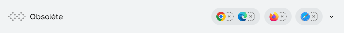

**Baseline** identifie la disponibilité des fonctionnalités de la plateforme web dans les principaux navigateurs, y compris les API, les propriétés CSS et la syntaxe JavaScript. Baseline décrit les fonctionnalités web comme étant soit largement disponibles, soit nouvellement disponibles. Les fonctionnalités qui ne répondent pas aux critères Baseline sont considérées comme ayant une disponibilité limitée.

Baseline prend en compte la prise en charge dans les navigateurs suivants&nbsp;:

- Apple Safari (iOS)
- Apple Safari (macOS)
- Google Chrome (Android)
- Google Chrome (bureau)
- Microsoft Edge (bureau)
- Mozilla Firefox (Android)
- Mozilla Firefox (bureau)

Baseline est un résumé de la compatibilité des navigateurs. Ce n'est pas un substitut à l'accessibilité, à l'utilisabilité, à la performance, à la sécurité ou à d'autres tests. Baseline ne vous indique pas forcément si une fonctionnalité fonctionne avec&nbsp;:

- Des appareils ou versions de navigateurs plus anciens
- Des navigateurs non couverts par la définition Baseline, comme les webviews des systèmes d'exploitation
- Des technologies d'assistance, comme les lecteurs d'écran.

## Badges Baseline

Les fonctionnalités indiquées comme **largement disponibles** bénéficient d'un historique de prise en charge cohérent dans chacun des navigateurs Baseline depuis au moins 2,5 ans.

Les fonctionnalités indiquées comme **nouvellement disponibles** fonctionnent au moins dans la dernière version stable de chacun des navigateurs Baseline, mais peuvent ne pas fonctionner avec des navigateurs ou appareils plus anciens.

Les fonctionnalités indiquées avec une **disponibilité limitée** ne sont _pas_ encore disponibles dans tous les navigateurs.

Les fonctionnalités marquées comme **obsolètes** peuvent être disponibles dans un ou plusieurs navigateurs, mais ne doivent pas être utilisées lors du développement.

Les fonctionnalités répertoriées comme **obsolètes et en cours de suppressions** peuvent être disponibles dans un ou plusieurs navigateurs, mais sont appelées à être supprimées et ne doivent pas être utilisées en développement.

## Voir aussi

- [Tests](/fr/docs/Learn_web_development/Extensions/Testing)
- [Dépôt web-platform-dx/web-features (angl.)](https://github.com/web-platform-dx/web-features)
- [Groupe communautaire W3C WebDX (angl.)](https://www.w3.org/community/webdx/)
- [Dépôt mdn/browser-compat-data (angl.)](https://github.com/mdn/browser-compat-data)
- [caniuse.com (angl.)](https://caniuse.com/)
- [a11ysupport.io (angl.)](https://a11ysupport.io/)
