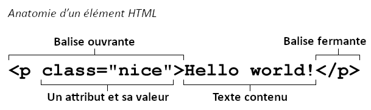

{{QuickLinksWithSubpages("/fr/docs/Glossaire")}}

**HTML** (HyperText Markup Language) est un langage descriptif qui définit la structure d'une page web.

## Bref historique

En 1990, lorsqu'il présente sa vision du {{Glossary("World Wide Web","Web")}}, Tim Berners-Lee définit le concept d'{{Glossary("Hypertext","hypertexte")}}, qu'il formalise l'année suivante avec un langage de balisage essentiellement basé sur {{Glossary("SGML")}}. L'{{Glossary("IETF")}} commence officiellement à spécifier le HTML en 1993, et publie la version 2.0 en 1995, après plusieurs versions de travail. En 1994, Berners-Lee fonde le {{Glossary("W3C")}} pour développer le Web. En 1996, le W3C reprend le travail sur le HTML et publie un an plus tard la recommandation HTML 3.2. HTML 4.0 fut publié en 1999 et devient une norme {{Glossary("ISO")}} en 2000.

À cette période, le W3C est sur le point d'abandonner le HTML au profit du {{Glossary("XHTML")}}, ce qui provoque la création d'un groupe indépendant appelé {{Glossary("WHATWG")}} en 2004.  Grâce au WHATWG, le travail sur le {{Glossary("HTML5")}} se poursuit : les deux organisations publient la première version de travail en 2008 puis la norme finale en 2014.

## Concept et syntaxe

Un document HTML est un document texte brut structuré par des {{Glossary("Element","éléments")}}. Les éléments sont encadrés par des {{Glossary("Tag","balises")}} ouvrantes et fermantes associées. Chaque balise commence et se termine par les caractères inférieur et supérieur (`<>`). Il existe quelques balises _vides_ qui ne contiennent pas de texte, comme par exemple {{htmlelement("img")}}.

On peut préciser les balises HTML avec des {{Glossary("Attribute","attributs")}} pour fournir des informations complémentaires qui vont modifier la façon dont le navigateur va interpréter l'élément :

Un fichier HTML est généralement enregistré avec une extension `.htm` ou `.html`. Il est mis à disposition par un {{Glossary("Server","serveur web")}}, et le rendu est réalisé par un {{Glossary("Browser","navigateur Web")}}.

## Pour en savoir plus

### Culture générale

- {{interwiki("wikipedia", "HTML", "Hypertext_Markup_Language")}} sur Wikipédia

### Apprendre le HTML

- [Notre tutoriel HTML](/fr/docs/Apprendre/HTML)
- [Les cours web sur codecademy.com](http://www.codecademy.com/en/tracks/web)

### Référence technique

- [La documentation HTML sur MDN](/fr/docs/Web/HTML)
- [La spécification HTML](http://www.w3.org/TR/html5/)
