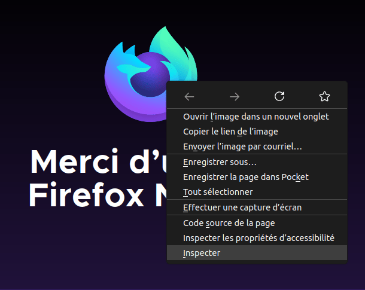
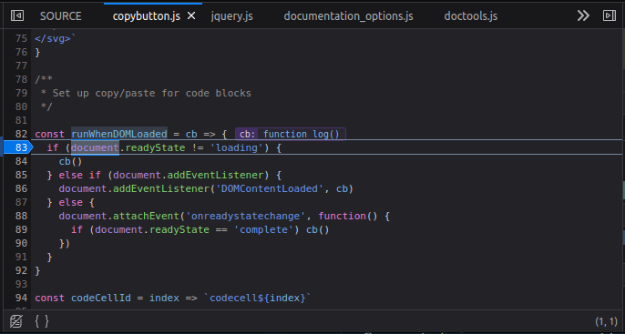
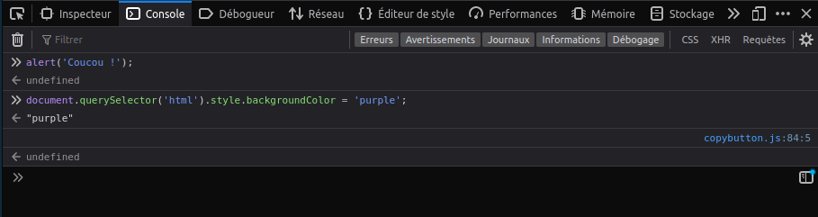

Tous les navigateurs web modernes possèdent un ensemble d'outils de développement. Ces outils permettent de réaliser différentes actions&nbsp;: inspecter le code HTML, CSS ou JavaScript chargé à la volée dans la page, montrer les fichiers téléchargés et leur temps de chargement, etc. Dans cet article, nous verrons comment utiliser les fonctionnalités basiques des outils de développements d'un navigateur (aussi souvent appelés par l'anglicisme «&nbsp;<i lang="en">devtools</i>&nbsp;»).

> **Note :** Avant de poursuivre avec les exemples présentés ci-après, nous vous conseillons d'utiliser [l'exemple construit](https://mdn.github.io/beginner-html-site-scripted/) dans la série d'articles [Commencer avec le Web](/fr/docs/Learn/Getting_started_with_the_web) et d'ouvrir le site dans votre navigateur pour poursuivre avec les étapes suivantes.

## Comment ouvrir les outils de développement d'un navigateur

Les outils de développement, s'affichent généralement dans une sous-fenêtre du navigateur, de la façon suivante (cela peut varier légèrement d'un navigateur à l'autre)&nbsp;:

![Capture d'écran d'un navigateur avec les outils de développement ouverts. La page web est affichée sur la moitié supérieure de la fenêtre du navigateur et les outils de développement sur la moitié inférieure. Dans les outils de développement, on distingue trois panneaux : HTML avec l'élément `body` sélectionné, CSS avec les styles qui cibles l'élément `body` sélectionné et un panneau pour les styles calculés qui affiche les styles du site, la case à cocher pour les styles du navigateur n'étant pas cochée.](devtools_63_inspector.png)

Comment faire pour que cette sous-fenêtre apparaisse&nbsp;? Trois méthodes&nbsp;:

- Au clavier&nbsp;: _<kbd>Ctrl</kbd> + <kbd>Shift</kbd> + <kbd>I</kbd>_, sauf pour&nbsp;:

  - Edge&nbsp;: <kbd>F12</kbd>
  - macOS&nbsp;: _<kbd>⌘</kbd> + <kbd>⌥</kbd> + <kbd>I</kbd>_

- Via les menus

  - Firefox&nbsp;: _Menu ➤ Outils supplémentaires ➤ Outils de développement web_
  - Chrome&nbsp;: _Plus d'outils ➤ Outils de développement_
  - Safari&nbsp;: _Développement ➤ Afficher l'inspecteur web._ Si vous ne pouvez pas voir le menu _Développement_, aller sous _Safari ➤ Préférences ➤ Avancé_ et vérifiez que l'option _Afficher le menu de développement_ est bien coché.
  - Opera. _Développement ➤ Inspecteur web_

- Via un menu contextuel&nbsp;: Cliquez-droit sur un élément de la page web (ou <kbd>Ctrl</kbd>+clic sur macOS) et sélectionnez _Examiner l'élément_ dans le menu qui apparait (_Bonus&nbsp;:_ cette méthode ouvrira l'inspecteur et sélectionnera directement l'élément en question&nbsp;!).



## L'inspecteur&nbsp;: explorateur du DOM et éditeur de CSS

Les outils de développement s'ouvrent généralement par défaut sur l'inspecteur, qu'on peut voir dans la capture d'écran qui suit. Cet outil montre le code HTML de la page lors de l'exécution ainsi que le CSS appliqué à chaque élément de la page. Il permet également de modifier instantanément le HTML et le CSS et de voir les modifications affichées en direct sur la zone d'affichage du navigateur.


Si vous n'arrivez _pas_ sur l'inspecteur&nbsp;:

- Cliquez ou appuyez l'onglet _Inspecteur_.
- Sous Edge, ou Opera, cliquez ou appuyez sur Éléments.
- Sous Safari, les contrôles n'apparaissent pas clairement, mais vous devriez voir le code HTML si vous n'avez rien sélectionné d'autre. Pour voir le code CSS, appuyez sur le bouton _Style_.

### Manipuler l'inspecteur du DOM

Pour commencer, cliquez-droit sur un élément HTML dans l'inspecteur du DOM et regardez le menu contextuel qui s'affiche. Les options du menu qui apparaît peuvent varier d'un navigateur à un autre mais les options les plus importantes s'y trouvent toujours&nbsp;:


- Supprimer le nœud (parfois _Supprimer l'élément_)
  - : Supprime l'élément sélectionné du document.
- Modifier comme HTML (parfois _Ajouter un attribut_/_Éditer le texte_)
  - : Permet de changer le HTML et de voir le résultat obtenu à la volée. Cette option est très utile pour déboguer ou tester.
- `:hover/:active/:focus` (parfois _Changer de pseudo-classe_)
  - : Force l'état d'un élément afin de pouvoir voir ce que la mise en forme donne pour cet état.
- Copier/Copier comme HTML
  - : Permet de copier l'élément HTML actuellement sélectionné.

Certains navigateurs disposent également d'options comme _Copier le chemin CSS_ et/ou _Copier le chemin XPath_ qui permettent de copier le sélecteur CSS ou l'expression XPath qui permettrait de sélectionner l'élément HTML courant.

Essayez d'éditer le DOM de votre page. Double-cliquez sur un élément ou cliquez-droit puis choisissez «&nbsp;Modifier comme HTML&nbsp;» depuis le menu contextuel. Vous pouvez modifier tout ce que vous voulez, mais vous ne pouvez pas sauvegarder vos modifications.

### Manipuler l'éditeur CSS

Par défaut, l'éditeur CSS affiche les règles CSS qui s'appliquent à l'élément qui est sélectionné&nbsp;:


Ces fonctionnalités sont plutôt pratiques&nbsp;:

- Les règles qui s'appliquent à l'élément courant sont affichées en commençant avec les règles les plus spécifiques et en terminant avec les règles les moins spécifiques.
- Il est possible de cocher les boîtes à côté de chaque déclaration pour voir l'effet qui serait obtenu si la déclaration était supprimée.
- Vous pouvez cliquer sur la petite flèche à côté de chaque propriété en notation résumée pour voir les équivalents en notation détaillée.
- Vous pouvez cliquer sur le nom d'une propriété ou d'une valeur pour éditer une valeur en live et immédiatement voir le changement.
- À côté de chaque règle, si celle-ci est «&nbsp;dépliée&nbsp;», vous pouvez voir le nom du fichier et la ligne sur laquelle la règle est définie. En cliquant sur le lien, vous arriverez directement sur le fichier CSS que vous pourrez éditer et sauvegarder.
- Vous pouvez également cliquer sur l'accolade fermant d'une règle donnée pour afficher une nouvelle zone de texte dans laquelle vous pourrez écrire une toute nouvelle déclaration.

Vous aurez remarqué plusieurs onglets en haut du panneau pour le CSS&nbsp;:

- Calculé
  - : Cet onglet affiche les styles calculés pour l'élément sélectionné (les valeurs finales, normalisées, appliquées par le navigateur).
- Mise en page
  - : Dans Firefox, cette zone contient trois sections&nbsp;:
    - Flexbox
      - : Si la page inspectée utilise les boîtes flexibles, cette section affichera les paramètres du conteneur et des éléments flexibles.
    - Grilles
      - : Si la page inspectée utilise les grilles CSS, cette section permet d'en voir les détails.
    - Modèle de boîte
      - : Cet onglet représente visuellement le modèle de boîte pour l'élément sélectionner afin de visualiser rapidement le remplissage (<i lang="en">padding</i>), la bordure et la marge appliquée à l'élément. Il permet aussi de voir la taille du contenu.
- Polices
  - : Dans Firefox, cet onglet affiche les polices appliquées à l'élément sélectionné.

### En savoir plus

Pour en apprendre plus sur l'inspecteur présent dans les différents navigateurs, les ressources suivantes pourront vous être utiles&nbsp;:

- [Firefox](https://firefox-source-docs.mozilla.org/devtools-user/page_inspector/index.html)
- [Chrome](https://developer.chrome.com/docs/devtools/dom/) (l'inspecteur d'Opera fonctionne de la même façon)
- [Edge](https://docs.microsoft.com/fr-fr/microsoft-edge/devtools-guide-chromium/elements-tool/elements-tool)
- [Safari](https://support.apple.com/en-gb/guide/safari-developer/dev9c17ada48/mac)

## Le débogueur JavaScript

Le débogueur JavaScript (aussi appelé «&nbsp;debugger&nbsp;») permet d'observer les valeurs de variables et de placer des points d'arrêt afin de suspendre l'exécution pour identifier les problèmes empêchant le code de s'exécuter correctement.


Pour ouvrir le débogueur&nbsp;:

- Firefox
  - : _Menu ➤ Outils supplémentaires ➤ Outils de développement web_ puis sélectionnez l'onglet «&nbsp;Débogueur&nbsp;» ou utilisez le raccourci clavier <kbd>Ctrl</kbd>+<kbd>Shift</kbd>+<kbd>Z</kbd> pour ouvrir le débogueur. Si les outils de développement sont déjà ouverts, cliquez sur l'onglet **Débogueur**.
- Chrome, Edge et Opera
  - : Ouvrez les outils de développement puis sélectionnez l'onglet **Sources** (Opera fonctionne de la même façon).
- Safari
  - : Ouvrez les outils de développement puis sélectionnez l'onglet Débogueur.

### Parcourir le débogueur

Sur Firefox, le débogueur JavaScript se compose de trois panneaux.

#### Liste de fichiers

Le premier panneau à gauche contient la liste des fichiers associés à la page en cours de débogage. Sélectionnez le fichier sur lequel vous souhaitez travailler depuis cette liste. Cliquez sur un fichier pour le sélectionner et en voir le contenu dans le panneau central du débogueur.


#### Code source

Ce panneau permet de placer des points d'arrêt aux endroits où on souhaite suspendre l'exécution. Dans l'image qui suit, on voit un point d'arrêt placé sur la ligne 83.



#### Observation d'expressions et points d'arrêt

Le panneau le plus à droite contient une liste des expressions espionnes et des points d'arrêts définis.

Dans l'image, la première section, **expressions espionnes**, indique que la variable `cb` a été ajoutée. Vous pouvez développer la liste afin de voir les valeurs du tableau.

La section qui suit, **points d'arrêt**, liste les points d'arrêt placés sur la page. Dans le fichier `copybutton.js`, on voit un point d'arrêt placé sur l'instruction `if (document.readyState != 'loading')`.

Les deux dernières sections apparaissent uniquement lorsque le code s'exécute.

La section sur la **pile d'exécution** indique le code exécuté pour parvenir à la ligne actuelle. Dans notre exemple, on peut voir que le code suspendu est dans une fonction qui gère les clics de souris et qu'il est suspendu sur un point d'arrêt.

La dernière section, sur les **portées**, montre les valeurs visibles aux différents endroits du code. Dans l'exemple de l'image qui suit, on peut voir les objets disponibles depuis le code de la fonction `runWhenDOMLoaded()`.


### En savoir plus

Pour plus d'informations sur le débogueur JavaScript dans les différents navigateurs&nbsp;:

- [Firefox](https://firefox-source-docs.mozilla.org/devtools-user/debugger/index.html)
- [Chrome](https://developer.chrome.com/docs/devtools/javascript/)
- [Edge](https://docs.microsoft.com/fr-fr/microsoft-edge/devtools-guide-chromium/javascript/)
- [Safari](https://support.apple.com/en-gb/guide/safari-developer/devd24689f72/mac)

## La console JavaScript

La console JavaScript est un outil formidable pour déboguer du code JavaScript qui ne fonctionne pas comme on le souhaite. Elle permet d'exécuter des lignes de JavaScript sur la page qui est actuellement chargée dans le navigateur et de rapporter les erreurs rencontrées lorsque le navigateur souhaite exécuter le code.

Pour accéder à la console, quel que soit le navigateur, ouvrez les outils de développement s'ils ne sont pas déjà ouverts, puis cliquez sur l'onglet «&nbsp;Console&nbsp;».

Firefox permet d'utiliser le raccourci clavier <kbd>Ctrl</kbd>+<kbd>Shift</kbd>+<kbd>K</kbd>.

Vous verrez alors quelque chose comme ceci à l'écran&nbsp;:



Pour voir ce qui se passe, essayez de saisir les fragments de code suivants dans la console, un à un en pressant <kbd>Entrée</kbd> entre chaque&nbsp;:

```js
alert("Coucou !");
```

```js
document.querySelector("html").style.backgroundColor = "purple";
```

```js
const logoWikipedia = document.createElement("img");
logoWikipedia.setAttribute(
  "src",
  "https://upload.wikimedia.org/wikipedia/commons/6/63/Wikipedia-logo.png",
);
document.querySelector("h1").appendChild(logoWikipedia);
```

Désormais, essayez de saisir ces versions incorrectes pour voir le résultat.

```js example-bad
alert('Coucou !);
```

```js example-bad
document.cheeseSelector("html").style.backgroundColor = "purple";
```

```js example-bad
const logoWikipedia = document.createElement("img");
myBanana.setAttribute(
  "src",
  "https://upload.wikimedia.org/wikipedia/commons/6/63/Wikipedia-logo.png",
);
document.querySelector("h1").appendChild(logoWikipedia);
```

Vous pourrez voir les erreurs que renvoie le navigateur. Il arrive que ces erreurs soient plutôt incompréhensibles, mais comprendre l'origine du problème en relisant le code devrait être jouable&nbsp;!

### En savoir plus

Pour en apprendre plus sur la console JavaScript présente dans les différents navigateurs, les ressources listées ici devraient vous être utiles&nbsp;:

- [Firefox](https://firefox-source-docs.mozilla.org/devtools-user/web_console/index.html)
- [Chrome](https://developer.chrome.com/docs/devtools/console/) (la console pour Opera fonctionnera de la même façon)
- [Edge](https://docs.microsoft.com/en-us/microsoft-edge/devtools-guide-chromium/console/)
- [Safari](https://support.apple.com/en-gb/guide/safari-developer/dev170bfef99/mac)

## Voir aussi

- [Déboguer du HTML](/fr/docs/Learn/HTML/Introduction_to_HTML/Debugging_HTML)
- [Déboguer du CSS](/fr/docs/Learn/CSS/Building_blocks/Debugging_CSS)
