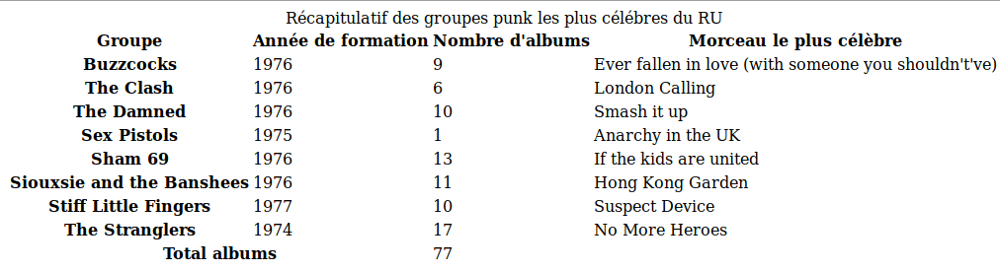
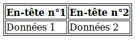
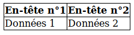

{{LearnSidebar}}{{PreviousMenuNext("Learn/CSS/Styling_boxes/Borders", "Learn/CSS/Styling_boxes/Advanced_box_effects", "Learn/CSS/Styling_boxes")}}

Styliser un tableau HTML n'est pas le travail le plus passionnant au monde, mais ... quelquefois nous devons le faire. Cet article est un guide pour donner un bel aspect aux tableaux HTML à l'aide des fonctionnalités détaillées dans les articles précédents.

<table class="standard-table">
  <tbody>
    <tr>
      <th scope="row">Prérequis:</th>
      <td>
        Notions de HTML (voir
        <a href="/fr/docs/Learn/HTML/Introduction_to_HTML"
          >Introduction à HTML</a
        >), tableaux en HTML (voir le module sur les tableaux HTML (TBD)) et une
        idée du fonctionnement des CSS (voir
        <a href="/fr/docs/Learn/CSS/Introduction_to_CSS">Introduction aux CSS</a
        >.)
      </td>
    </tr>
    <tr>
      <th scope="row">Objectif&nbsp;:</th>
      <td>Apprendre à donner effectivement un style aux tableaux HTML.</td>
    </tr>
  </tbody>
</table>

## Un tableau HTML typique

Commençons par un tableau HTML typique. Bien, je dis typique — la plupart des exemples de tableaux HTML concernent des chaussures, ou le temps, ou des employés ... nous avons décidé de faire quelque chose de plus intéressant et notre tableau se rapportera aux célèbres groupes punk du Royaume Uni. Le balisage ressemble à quelque chose comme ceci :

```html
<table>
  <caption>Récapitulatif des groupes punk les plus célébres du RU</caption>
  <thead>
    <tr>
      <th scope="col">Groupe</th>
      <th scope="col">Année de formation</th>
      <th scope="col">Nombre d'albums</th>
      <th scope="col">Morceau le plus célèbre</th>
    </tr>
  </thead>
  <tbody>
    <tr>
      <th scope="row">Buzzcocks</th>
      <td>1976</td>
      <td>9</td>
      <td>Ever fallen in love (with someone you shouldn't've)</td>
    </tr>
    <tr>
      <th scope="row">The Clash</th>
      <td>1976</td>
      <td>6</td>
      <td>London Calling</td>
    </tr>

      ... quelques lignes supprimées pour condenser le texte

    <tr>
      <th scope="row">The Stranglers</th>
      <td>1974</td>
      <td>17</td>
      <td>No More Heroes</td>
    </tr>
  </tbody>
  <tfoot>
    <tr>
      <th scope="row" colspan="2">Total albums</th>
      <td colspan="2">77</td>
    </tr>
  </tfoot>
</table>
```

Le tableau est bien balisé, facile à disposer et accessible, remercions les fonctionnalités {{htmlattrxref("scope","th")}}, {{htmlelement("caption")}}, {{htmlelement("thead")}}, {{htmlelement("tbody")}}, etc. Malheureusement, il n'a pas un rendu bien terrible à l'écran (voyez‑le directement ici [punk-bands-unstyled.html](http://mdn.github.io/learning-area/css/styling-boxes/styling-tables/punk-bands-unstyled.html)) :



Il est d'aspect resserré, difficile à lire et austère. Utilisons une règle CSS pour corriger cela.

## Mettre en forme notre tableau

Dans cette section d'apprentissage actif, nous allons travailler le style de l'exemple de tableau ci-dessus.

1.  Pour débuter, faites une copie locale de l'[exemple de balisage](https://github.com/mdn/learning-area/blob/master/css/styling-boxes/styling-tables/punk-bands-unstyled.html), téléchargez les images ([noise.png](https://github.com/mdn/learning-area/blob/master/css/styling-boxes/styling-tables/noise.png) et [leopardskin.jpg](https://github.com/mdn/learning-area/blob/master/css/styling-boxes/styling-tables/leopardskin.jpg)) et placez les trois fichiers dans un répertoire de travail quelque part sur votre ordinateur.
2.  Ensuite, créez un nouveau fichier nommé `style.css` et enregistrez‑le dans le même répertoire que les autres fichiers.
3.  Liez le CSS au HTML en mettant la ligne suivante dans l'élément {{htmlelement("head")}} :

    ```html
    <link href="style.css" rel="stylesheet" type="text/css">
    ```

### Espacement et disposition

La première chose à faire est de modifier l'espacement et la disposition — le style par défaut du tableau est tellement resserré ! Pour ce faire, ajoutez la règle CSS suivante au fichier `style.css` :

```css
/* espacement */

table {
  table-layout: fixed;
  width: 100%;
  border-collapse: collapse;
  border: 3px solid purple;
}

thead th:nth-child(1) {
  width: 30%;
}

thead th:nth-child(2) {
  width: 20%;
}

thead th:nth-child(3) {
  width: 15%;
}

thead th:nth-child(4) {
  width: 35%;
}

th, td {
  padding: 20px;
}
```

Voici les choses les plus importantes à noter :

Nous mettons un cadre ({{cssxref("border")}}) tout autour du tableau, cadre nécessaire car nous voulons encadrer l'en-tête et le pied de page du tableau plus tard — si vous n'avez pas d'encadrement général du tableau et terminez avec un espacement, l'apparence est insolite et peu cohérente.

- Définir pour le tableau la valeur `fixed` pour {{cssxref("table-layout")}} est généralement une bonne idée, car cela rend le comportement par défaut du tableau un peu plus prévisible. Normalement, les colonnes des tableaux sont dimensionnées en fonction de leur contenu, ce qui produit des résultats étranges. Avec `table-layout: fixed`, vous pouvez dimensionner les colonnes selon la largeur de leurs en-têtes, puis traiter leur contenu comme il convient. C'est pourquoi nous sélectionnons les quatre en-têtes distinctement avec le sélecteur `thead th:nth-child(n)` ({{cssxref(":nth-child")}}) (« sélectionner le nième élément enfant {{htmlelement("th")}} dans la liste à l'intérieur de l'élément {{htmlelement("thead")}} ») et leur donnons un pourcentage de largeur défini. Chaque colonne prend la largeur de son en‑tête, ce qui permet de bien dimensionner les colonnes du tableau. Chris Coyier expose cette technique de façon détaillée dans [Fixed Table Layouts](https://css-tricks.com/fixing-tables-long-strings/).

  Ceci est couplé avec une largeur {{cssxref("width")}} de 100%, ce qui signifie que le tableau remplira complétement tout conteneur dans lequel il sera placé et sera bien adaptable (même s'il aura besoin de quelques aménagements complémentaires pour avoir bel aspect avec les largeurs d'écran étroites).

- La valeur `collapse` pour {{cssxref("border-collapse")}} est une bonne pratique courante pour toute mise en page de tableau. Par défaut, quand vous définissez des encadrements pour les éléments d'un tableau, il y a un espace entre eux, comme le montre cette illustration :  Cela n'a pas l'air très joli (même si c'est peut-être le look que vous voulez, qui sait ?) Avec `border-collapse : collapse;`, les bordures se condensent en une seule, ce qui est beaucoup mieux :
- Nous avons mis un cadre ({{cssxref("border")}}) tout autour du tableau, cadre nécessaire car nous encadrerons plus tard l'intitulé et le pied de page — si vous n'avez pas d'encadrement général du tableau, terminer par un espacement donne un aspect insolite et peu net.
- Nous avons défini une valeur pour le remplissage ({{cssxref("padding")}}) des éléments {{htmlelement("th")}} et {{htmlelement("td")}} — cela donne un peu d'air aux données et facilite la lecture de la table.

À ce stade, le tableau a déjà meilleure mine :


### Simple typographie

Maintenant, différencions un peu nos polices de caractère.

Tout d'abord, nous avons trouvé une police sur [Google Fonts](https://www.google.com/fonts) convenant aux tableaux concernant les groupes punk. Vous pouvez visiter le site vous‑même et en choisir une autre si vous le souhaitez ; il vous suffit de remplacer l'élément {{htmlelement("link")}} fourni et la déclaration {{cssxref("font-family")}} personnalisée par celles données par Google Fonts.

D'abord, ajoutons l'élément {{htmlelement("link")}} suivant dans l'élément HTML `head`, juste au‑dessus de l'élément `<link>` déjà présent :

```html
<link href='https://fonts.googleapis.com/css?family=Rock+Salt' rel='stylesheet' type='text/css'>
```

Puis ajoutons le CSS suivant dans le fichier `style.css` :

```css
/* typographie */

html {
  font-family: 'helvetica neue', helvetica, arial, sans-serif;
}

thead th, tfoot th {
  font-family: 'Rock Salt', cursive;
}

th {
  letter-spacing: 2px;
}

td {
  letter-spacing: 1px;
}

tbody td {
  text-align: center;
}

tfoot th {
  text-align: right;
}
```

Rien de propre aux tableaux ici ; nous modifions simplement le style de la police pour faciliter la lecture.

- Nous avons mis en place un empilement global de polices sans-serif ; c'est un choix purement stylistique. Nous avons également défini une valeur de police personnalisée pour en-têtes dans les éléments {{htmlelement("thead")}} et {{htmlelement("tfoot")}} pour un look accrocheur et « punky ».
- Nous avons aussi défini une valeur particulière de {{cssxref("letter-spacing")}} pour les en‑têtes et les cellules pour améliorer la lisibilité. C'est encore un choix purement subjectif.
- Nous avons choisi un alignement centré pour le texte des cellules dans l'élément {{htmlelement("tbody")}} pour qu'il soit bien aligné avec les têtes de colonnes. Par défaut, les cellules ont une valeur {{cssxref("text-align")}} égale à `left` et les en–têtes à `center`, mais généralement on obtient un meilleur aspect en prenant le même alignement pour les deux. L'éppaisseur par défaut sur les polices de l'en‑tête est suffisante pour différencier ces dernières du contenu des cellules.
- Nous avons aligné à droite le titre à l'intérieur de l'élément {{htmlelement("tfoot")}}} pour qu'il soit mieux associé visuellement au résultat des données.

Cela fait un peu plus propre :


### Graphisme et couleurs

Maintenant, graphisme et couleurs ! Comme ce tableau est plein de postures punk, nous allons lui donner un style assez clinquant qui devrait lui convenir. Pas de problème, vous n'avez pas à rendre vos tableaux autant tape à l'œil — vous pouvez opter pour quelque chose de plus subtil et de bon goût.

Commençons par ajouter le CSS suivant à la fin du fichier `style.css` :

    thead, tfoot {
      background: url(leopardskin.jpg);
      color: white;
      text-shadow: 1px 1px 1px black;
    }

    thead th, tfoot th, tfoot td {
      background: linear-gradient(to bottom, rgba(0,0,0,0.1), rgba(0,0,0,0.5));
      border: 3px solid purple;
    }

Encore une fois, il n'y a rien de propre aux tableaux ici, mais cela vaut la peine de noter certaines choses.

Nous avons ajouté un élément {{cssxref("background-image")}} aux éléments {{htmlelement("thead")}} et {{htmlelement("tfoot")}} et changé la valeur de  {{cssxref("color")}} du texte dans l'en-tête et le pied de page en blanc (nous l'avons aussi ombré avec {{cssxref("text-shadow")}}) pour qu'il soit bien lisible. Assurez‑vous que le texte contraste bien avec l'arrière-plan pour qu'il soit bien lisible.

Nous avons également ajouté un gradient linéaire aux éléments {{htmlelement("th")}}} et {{htmlelement("td")}}} à l'intérieur de l'en-tête et du pied de page pour donner un peu de texture ainsi qu'un cadre mauve brillant. Il est utile d'avoir plusieurs éléments imbriqués disponibles pour pouvoir superposer les styles. Oui, nous aurions pu mettre image de fond et gradient linéaire sur les éléments {{htmlelement("thead")}} et {{htmlelement("tfoot")}}} en utilisant plusieurs images de fond, mais nous avons décidé de le faire séparément pour le bénéfice des navigateurs plus anciens qui ne prennent pas en charge plusieurs images de fond ou gradients linéaires.

#### Zébrures

Nous avons souhaité dédier un paragraphe séparé à la mise en place de **zèbrures** — une alternance de coloris des lignes faisant ressortir les données des tableaux, facilitant leur lecture et leur analyse. Ajoutez le CSS suivant au bas de votre fichier `style.css` :

```css
tbody tr:nth-child(odd) {
  background-color: #ff33cc;
}

tbody tr:nth-child(even) {
  background-color: #e495e4;
}

tbody tr {
  background-image: url(noise.png);
}

table {
  background-color: #ff33cc;
}
```

- Plus haut, nous avons vu comment on utilisait le sélecteur {{cssxref(":nth-child")}} pour sélectionner un élément enfant. Il est aussi possible de donner une formule en paramètre afin qu'il sélectionne une suite d'éléments. La formule 2n-1 sélectionne tous les enfants impairs (1, 3, 5, etc.) et la formule 2n sélectionne tous les enfants pairs (2, 4, 6, etc.). Nous avons utilisé les mots-clés `odd` (impair) et `even` (pair) dans notre code ; ils font exactement la même chose que les formules susmentionnées. Dans ce cas, nous donnons aux lignes paires et impaires des couleurs différentes (clinquantes)
- Nous avons également ajouté un motif d'arrière-plan répétitif sur toutes les lignes ; il donne un peu de bruit (un `.png` semi-transparent avec un peu de distorsion visuelle) pour donner une certaine texture.
- Finalement, nous avons donné à toute la table une couleur de fond unie de façon à ce que les navigateurs qui ne prennent pas en charge le sélecteur `:nth-child` disposent encore d'une teinte de fond pour les lignes du corps de tableau.

Et voici l'explosion de couleurs résultante :


Maintenant, peut-être trouverez‑vous que nous avons forcé la dose et que ce n'est pas à votre goût, mais ce que nous avons essayé de montrer ici est que les tableaux ne sont pas forcément ennuyeux ou académiques.

### Styliser l'intitulé

Il nous reste une dernière chose à faire avec ce tableau — styliser l'intitulé. Pour ce faire, ajoutez ce qui suit en fin de fichier `style.css`  :

```css
caption {
  font-family: 'Rock Salt', cursive;
  padding: 20px;
  font-style: italic;
  caption-side: bottom;
  color: #666;
  text-align: right;
  letter-spacing: 1px;
}
```

Rien de remarquable ici, sauf pour la propriété {{cssxref("caption-side")}} à laquelle on a donné la valeur `bottom`. Elle a pour effet de positionner la légende au bas du tableau, ce qui, avec les autres déclarations, nous donne ce look final (voir en direct sur [punk-bands-complete.html](http://mdn.github.io/learning-area/css/styling-boxes/styling-tables/punk-bands-complete.html)) :


## Apprentissage actif : mettez en page votre propre tableau

Maintenant, prenez cet exemple de tableau HTML (en tout ou en partie !) et stylisez‑le pour faire quelque chose de beaucoup mieux conçu et moins voyant que le tableau ci‑dessus.

## Quelques conseils rapides

Avant de poursuivre, voici une liste rapide des points les plus utiles illustrés ci-dessus :

- Faites un balisage du tableau aussi simple que possible et gardez les choses souples, par exemple en utilisant des pourcentages, afin que le design soit adaptable.
- Utilisez {{cssxref("table-layout")}}`: fixed` pour créer une disposition de tableau prévisible qui vous permet de fixer les largeurs de colonnes en définissant la valeur de {{cssxref("width")}} sur l'élément d'en‑tête ({{htmlelement("th")}}).
- Utilisez {{cssxref("border-collapse")}}`: collapse` pour faire en sorte que les éléments du tableau fusionnent, produisant un aspect plus net et plus facile à contrôler.
- Utilisez {{htmlelement("thead")}}, {{htmlelement("tbody")}} et {{htmlelement("tfoot")}} pour diviser le tableau en unités logiques et disposer d'entités supplémentaires pour l'application du CSS, de sorte qu'il soit plus facile d'empiler les styles si nécessaire.
- Utilisez les zébrures pour distinguer chaque ligne et en faciliter la lecture.
- Utilisez {{cssxref("text-align")}} pour aligner le texte des éléments {{htmlelement("th")}} et {{htmlelement("td")}} pour rendre les choses plus nettes et plus faciles à suivre.

## Résumé

Maintenant que nous avons franchi les hauteurs vertigineusement passionnantes des mises en page de tableaux, à quoi allons‑nous occuper notre temps ? N'ayez crainte — le chapitre qui suit donne un aperçu de certains effets avancés avec les boîtes ; certains de ces effets ne sont apparus que très récemment dans les navigateurs (comme les modes `blend` et les filtres), d'autres sont établis depuis plus longtemps (comme les ombrages).

{{PreviousMenuNext("Learn/CSS/Styling_boxes/Borders", "Learn/CSS/Styling_boxes/Advanced_box_effects", "Learn/CSS/Styling_boxes")}}

## Dans ce module

- [Le modèle de boîte&nbsp;: récapitulatif](/fr/Apprendre/CSS/styliser_boites/Box_model_recap)
- [Arrière-plans](/fr/Apprendre/CSS/styliser_boites/Backgrounds)
- [Encadrements](/fr/docs/Apprendre/CSS/styliser_boites/Borders)
- [Mise en page des tableaux](/fr/Apprendre/CSS/styliser_boites/Styling_tables)
- [Effets de boîte avancés](/fr/Apprendre/CSS/styliser_boites/Advanced_box_effects)
- [Création d'un en-tête de papier à lettre élégant](/fr/docs/Learn/CSS/Styling_boxes/Creating_fancy_letterheaded_paper)
- [Une boîte d'aspect rafraîchissant](/fr/Apprendre/CSS/styliser_boites/A_cool_looking_box)
