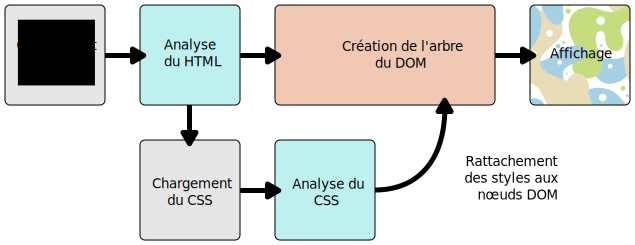

{{LearnSidebar}}
{{PreviousMenuNext("Learn/CSS/First_steps/How_CSS_is_structured", "Learn/CSS/First_steps/Using_your_new_knowledge", "Learn/CSS/First_steps")}}

Jusqu'ici, nous avons appris les bases du CCS, ses objectifs et comment écrire des feuilles de style élémentaires. Dans cette leçon, nous allons voir comment un navigateur prend du HTML et du CSS pour les transformer en une page web.

<table class="standard-table">
  <tbody>
    <tr>
      <th scope="row">Prérequis :</th>
      <td>
        Notions de base en l'informatique,
        <a
          href="/fr/docs/Learn/Getting_started_with_the_web/Installing_basic_software"
          >logiciels de base installés</a
        >,
        <a href="/fr/docs/Learn/Getting_started_with_the_web/Dealing_with_files"
          >savoir manipuler des fichiers</a
        >, connaissance de base de HTML (cf. <a
          href="/fr/docs/Learn/HTML/Introduction_to_HTML"
          >Introduction à HTML</a
        >.)
      </td>
    </tr>
    <tr>
      <th scope="row">Objectif :</th>
      <td>
        Comprendre, à un niveau élémentaire, comment un navigateur traite les
        codes CSS et HTML et ce qui se passe quand le navigateur rencontre du
        CSS qu'il ne sait pas interpréter.
      </td>
    </tr>
  </tbody>
</table>

## CSS comment ça marche, en  fait ?

Pour afficher un document, un navigateur doit combiner le contenu du document et les informations de mise en forme. Le traitement se fait en plusieurs phases que nous détaillons ci-dessous. Gardez à l'esprit que cette description est simplifiée, selon le modèle du navigateur, les étapes pourraient changer. Mais dans les grandes lignes, voilà ce qui se passe :

1.  Le navigateur charge le HTML (par ex. il le reçoit à travers le réseau).
2.  Il traduit le {{Glossary("HTML")}} en un {{Glossary("DOM")}} (_Document Object Model_) : une représentation du document HTML stockable en mémoire sur votre ordinateur. Nous expliquons le DOM plus en détails dans la prochaine section.
3.  Le navigateur récupère ensuite la plupart des ressources attachées au document HTML, telles les images, les vidéos ajoutées à la page... et  la feuille CSS externe ! JavaScript est traité un peu plus tard et nous n'en parlerons pas ici pour simplifier la présentation.
4.  Le navigateur *parse* le CSS, classe les différentes règles par types de sélecteur (par ex. élément, class, ID, etc...) dans des "buckets". En fonction des sélecteurs trouvés, le navigateur calcule quelle règle s'applique à quel nœud du DOM. Chaque nœud du DOM ciblé par CSS est étiqueté par sa règle de style. L'arbre ainsi obtenu s'appelle l'_arbre de rendu_ (render tree).
5.  Pour chaque nœud de l'arbre de rendu, le navigateur calcule l'effet visuel de la règle CSS associée.
6.  Le visuel ainsi produit est affiché à l'écran (cette étape s'appelle _painting_).

Le diagramme suivant propose une vue synthétique de ce traitement.



## À propos du DOM

Tout DOM a une structure d'arbre. Chaque élément, attribut, bout de texte du langage de balises est traduit en un {{Glossary("Node/DOM","nœud du DOM")}} dans la structure en arbre. Les nœuds sont définis par leurs relations à d'autres nœuds du DOM. Certains éléments sont les _parents_ de _nœuds enfants_ (child nodes) et les nœuds enfants peuvent avoir des *frères et sœurs* (siblings).

Comprendre le DOM vous aidera à concevoir, débugguer et maintenir votre CSS car le DOM est le point de jonction entre CSS et le contenu HTML du document.

Avec les DevTools  de votre navigateur vous pourrez naviguer à travers le DOM en sélectionnant les items pour les inspecter et voir quelles règles s'appliquent sur eux.

## Une représentation concrète du DOM

Plutôt qu'une explication longue et ennuyeuse, regardons comment un fragment de code HTML est converti en un DOM.

Partons du code ci-dessous :

```html
<p>
  Let's use:
  <span>Cascading</span>
  <span>Style</span>
  <span>Sheets</span>
</p>
```

Dans le DOM, le nœud correspondant à l'élément `<p>` est un parent. Ses enfants sont le nœud texte et trois nœuds associés aux éléments `<span>`. Les nœuds `SPAN` sont eux-mêmes parents, avec pour enfant le nœud associé à leur texte :

    P
    ├─ "Let's use:"
    ├─ SPAN
    |  └─ "Cascading"
    ├─ SPAN
    |  └─ "Style"
    └─ SPAN
       └─ "Sheets"

C'est ainsi que le navigateur interprète notre fragment HTML—il transforme ce DOM en arbre de rendu puis affiche le résultat comme suit :

{{EmbedLiveSample('Une_représentation_concrète_du_DOM', '100%', 55)}}

```css hidden
p {margin:0;}
```

## Appliquer CSS au DOM

Supposons maintenant que nous avons ajouté du CSS à notre document pour le mettre en forme. Le HTML n'a pas changé :

```html
<p>
  Let's use:
  <span>Cascading</span>
  <span>Style</span>
  <span>Sheets</span>
</p>
```

On lui applique le CSS suivant :

```css
span {
  border: 1px solid black;
  background-color: lime;
}
```

Le navigateur parse le HTML, calcule son DOM, puis parse le CSS. Notre CSS a une unique règle avec un unique sélecteur `span`, ça va être rapide à trier ! La règle est attachée à chaque nœud SPAN du DOM pour obtenir l'arbre de rendu. Reste à calculer les rendus puis à *peindre* la représentation visuelle finale à l'écran.

Voilà le résultat après mise à jour :

{{EmbedLiveSample('Appliquer_CSS_au_DOM', '100%', 55)}}

Dans le prochain module, dans l'article [Debugging CSS](/fr/docs/Learn/CSS/Building_blocks/Debugging_CSS), nous utiliserons les DevTools du navigateur pour débuguer des erreurs CSS. Ce sera aussi l'occasion de mieux comprendre comment le navigateur interprète CSS.

## Que se passe-t-il quand un navigateur rencontre du CSS qu'il ne comprend pas ?

Les navigateurs n'implémentent pas tous en même temps une fonctionnalité CSS nouvelle, j'avais mentionné ce fait [dans une leçon précédente](/fr/docs/Learn/CSS/First_steps/What_is_CSS#prise_en_charge_par_les_navigateurs). Rajoutez à cela le fait que trop de gens n'utilisent pas une version à jour de leur navigateur. CSS, lui, est en développement constant et donc toujours en avance par rapport à ce que les navigateurs peuvent implémenter. On doit donc se demander ce qui se passe quand un navigateur tombe sur un sélecteur ou une déclaration qu'il ne sait pas interpréter.

La réponse : ne rien faire et passer à la suite !

Quand un navigateur parse vos règles et rencontre une propriété ou une valeur qu'il ne comprend pas, il l'ignore et passe à la déclaration suivante. Cela se produit si vous avez mal orthographié le nom de la propriété ou de la valeur, ou s'ils sont trop nouveaux et pas encore pris en charge par le navigateur.

De même quand le navigateur rencontre un sélecteur qu'il ne sait pas interpréter, il ignore la règle correspondante et passe à la suivante.

Dans l'exemple ci-dessous, j'ai utilisé l'orthographe anglaise `colour` pour le mot *couleur.* Cela contredit la convention CSS et rend ce code incompréhensible pour le navigateur. En conséquence, le paragraphe n'a pas été colorié en bleu. Par contre, tout le reste du CSS est appliqué, seule la ligne invalide est ignorée.

```html
<p> Je veux que ce texte soit grand, gras et bleu.</p>
```

```css
p {
  font-weight: bold;
  colour: blue; /* incorrect spelling of the color property */
  font-size: 200%;
}
```

{{EmbedLiveSample('Que_se_passe-t-il_quand_un_navigateur_rencontre_du_CSS_quil_ne_comprend_pas', '100%', 200)}}

Le comportement décrit ci-dessus est très utile : vous pouvez utiliser du CSS récent pour perfectionner la mise en forme de vos pages, sachant qu'aucune erreur ne se produira quand votre code n'est pas compris — le navigateur interprète la règle... ou ne fait rien. Rappelez vous maintenant la _cascade_ : entre deux règles de même spécificité, le navigateur choisira la dernière rencontrée. La cascade permet d'offrir une alternative pour les navigateurs qui ne prennent pas en charge le CSS le plus récent.

Cela fonctionne particulièrement bien quand on désire utiliser une valeur CSS introduite récemment, pas encore prise en charge partout. Par exemple, quelques vieux navigateurs ne savent pas interpréter `calc()` pour les valeurs. Je peux donc donner une valeur en pixels pour la largeur de ma boîte, puis proposer une déclaration où la valeur de `width` est calculée par ` calc(``) `. Un vieux navigateur interprète la première déclaration, il ne comprend pas la seconde, il l'ignore — il utilisera donc la version pixels. Les navigateurs récents interprètent la déclaration en pixels, puis celle avec  `calc()` qui, par cascade, écrase la déclaration précédente.

Dans les leçons à venir, nous rencontrerons d'autres méthodes pour adapter le code aux différents navigateurs.

## Et enfin

Ce cours est presque achevé ; il nous reste un seul point à voir. Dans la prochaine leçon, vous allez [mettre en œuvre vos nouvelles connaissances](/fr/docs/Learn/CSS/First_steps/Using_your_new_knowledge) : vous allez remettre en forme un exemple, une occasion d'appliquer tout ce que vous avez appris de CSS.

{{PreviousMenuNext("Learn/CSS/First_steps/How_CSS_is_structured", "Learn/CSS/First_steps/Using_your_new_knowledge", "Learn/CSS/First_steps")}}

## Dans ce cour

1.  [CSS, c'est quoi ?](/fr/docs/Learn/CSS/First_steps/What_is_CSS)
2.  [Démarrer avec CSS](/fr/docs/Learn/CSS/First_steps/Getting_started)
3.  [Comment CSS est structuré](/fr/docs/Learn/CSS/First_steps/How_CSS_is_structured)
4.  [CSS ça marche comment ?](/fr/docs/Learn/CSS/First_steps/How_CSS_works)
5.  [Mettre en œuvre vos nouvelles connaissances](/fr/docs/Learn/CSS/First_steps/Using_your_new_knowledge)
