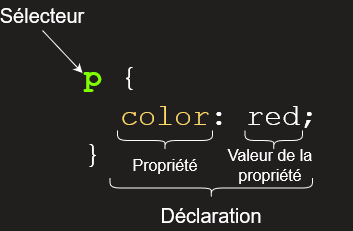

{{LearnSidebar}}
{{PreviousMenuNext("Apprendre/Commencer_avec_le_web/Les_bases_HTML", "Apprendre/Commencer_avec_le_web/Les_bases_JavaScript","Apprendre/Commencer_avec_le_web")}}

Les CSS (_Cascading Style Sheets_ en anglais, ou « feuilles de style en cascade ») sont le code utilisé pour mettre en forme une page web. _Les bases des CSS_ présentent ce qu'il faut savoir pour commencer. Nous répondrons à des questions comme : Comment rendre mon texte rouge ou noir ? Comment faire apparaître mon contenu à tel endroit de l'écran ? Comment décorer ma page web avec une image ou une couleur d'arrière-plan ?

## Donc, que sont les CSS, réellement ?

De la même façon que HTML, CSS n'est pas vraiment un langage de programmation. C'est un _langage de feuille de style_, c'est-à-dire qu'il permet d'appliquer des styles sur différents éléments sélectionnés dans un document HTML. Par exemple, on peut sélectionner **tous** les éléments d'une page HTML qui sont paragraphes et afficher leurs textes en rouge avec ce code CSS :

```css
p {
  color: red;
}
```

Faisons un essai : copiez ces trois lignes de code CSS dans un nouveau fichier dans votre éditeur de texte, puis sauvegardez le fichier sous le nom `style.css` dans votre répertoire `styles`.

Pour que cela fonctionne, il faut appliquer le CSS au document HTML, sinon la mise en forme décrite dans le fichier CSS n'affectera pas l'affichage de la page HTML dans la navigateur (si vous n'avez pas suivi toutes les étapes pour arriver ici, vous pouvez lire l'article [Gérer les fichiers](/fr/Apprendre/Commencer_avec_le_web/Gérer_les_fichiers) et [Les bases du HTML](/fr/Apprendre/Commencer_avec_le_web/Les_bases_HTML) pour savoir par où commencer).

1.  Ouvrez votre fichier `index.html` et copiez la ligne suivante quelque part au sein de l'élément `head` (c'est-à-dire entre les balises `<head>` et `</head>`) :

    ```html
    <link href="styles/style.css" rel="stylesheet" type="text/css">
    ```

2.  Sauvegardez `index.html` puis chargez-le dans votre navigateur. Vous devriez obtenir quelque chose comme :

Si le texte de votre paragraphe s'affiche en rouge, félicitations ! Vous venez d'écrire votre premier CSS fonctionnel !

### Anatomie d'une règle CSS

Regardons un peu plus en détails ce que nous avons écrit en CSS :



Cette structure s'appelle **un ensemble de règles** (ou seulement « une règle »). Les différentes parties se nomment :

- Sélecteur
  - : C'est le nom de l'élément HTML situé au début de l'ensemble de règles. Il permet de sélectionner les éléments sur lesquels appliquer le style souhaité (en l'occurence, les éléments `p`). Pour mettre en forme un élément différent, il suffit de changer le sélecteur.
- Déclaration
  - : C'est une règle simple comme `color: red;` qui détermine les **propriétés** de l'élément que l'on veut mettre en forme.
- Propriétés
  - : Les différentes façons dont on peut mettre en forme un élément HTML (dans ce cas, `color` est une propriété des éléments `p`). En CSS, vous choisissez les différentes propriétés que vous voulez utiliser dans une règle CSS.
- Valeur de la propriété
  - : À droite de la propriété, après les deux points, on a **la valeur de la propriété**. Celle-ci permet de choisir une mise en forme parmi d'autres pour une propriété donnée (par exemple, il y a d'autres couleurs que `red` pour la propriété `color`).

Les autres éléments importants de la syntaxe sont :

- chaque ensemble de règles, à l'exception du sélecteur, doit être entre accolades (`{}`).
- pour chaque déclaration, il faut utiliser deux points (`:`) pour séparer la propriété de ses valeurs.
- pour chaque ensemble de règles, il faut utiliser un point-virgule (`;`) pour séparer les déclarations entre elles.

Ainsi, si on veut modifier plusieurs propriétés d'un coup, on peut utiliser plusieurs déclarations dans une seule règle en les séparant par des points-virgules :

```css
p {
  color: red;
  width: 500px;
  border: 1px solid black;
}
```

### Sélectionner plusieurs éléments

Il est aussi possible de sélectionner plusieurs types d'éléments pour appliquer à tous une même règle. Il suffit de placer plusieurs sélecteurs, séparés par des virgules. Par exemple :

```css
p,li,h1 {
  color: red;
}
```

### Les différents types de sélecteurs

Il y a différents types de sélecteurs. Dans les exemples précédents, nous n'avons vu que **les sélecteurs d'élément** qui permettent de sélectionner les éléments HTML d'un type donné dans un document HTML. Mais ce n'est pas tout, il est possible de faire des sélections plus spécifiques. Voici quelques-uns des types de sélecteur les plus fréquents :

| Nom du sélecteur                                                                      | Ce qu'il sélectionne                                                                                                                                   | Exemple                                                                                           |
| ------------------------------------------------------------------------------------- | ------------------------------------------------------------------------------------------------------------------------------------------------------ | ------------------------------------------------------------------------------------------------- |
| Sélecteur d'élément (parfois appelé « sélecteur de balise » ou « sélecteur de type ») | Tous les éléments HTML d'un type donné.                                                                                                                | `p` sélectionne tous les `<p>`                                                                    |
| Sélecteur d'ID                                                                        | L'élément d'une page qui possède l'ID fourni (pour une page HTML donné, on ne peut avoir qu'un seul élément pour un ID donné).                         | `#my-id` sélectionne `<p id="my-id">` ou `<a id="my-id">`                                         |
| Sélecteur de classe                                                                   | Les éléments d'une page qui sont de la classe donnée (pour une page donnée, il est possible d'avoir plusieurs éléments qui partagent une même classe). | `.my-class` sélectionne `<p class="my-class">` et `<a class="my-class!">`                         |
| Sélecteur d'attribut                                                                  | Les éléments de la page qui possèdent l'attribut donné.                                                                                                | `img[src]` sélectionne `` mais pas ``                                |
| Sélecteur de pseudo-classe                                                            | Les éléments donnés mais uniquement dans un certain état (par exemple quand on passe la souris dessus).                                                | `a:hover` sélectionne `<a>` mais uniquement quand le pointeur de la souris est au-dessus du lien. |

Il existe plein d'autres sélecteurs, pour tous les découvrir, vous pouvez lire notre [guide sur les sélecteurs](/fr/docs/CSS/Premiers_pas/Les_sélecteurs).

## Les polices (fontes) et le texte

Maintenant que nous avons vu quelques bases de CSS, ajoutons quelques règles et informations à notre fichier `style.css` pour que notre exemple soit réussi. Tout d'abord, améliorons les polices et le texte.

1.  Pour commencer, revenez quelques étapes en arrière et récupérez le [résultat de Google Fonts](/fr/Learn/Getting_started_with_the_web/What_should_your_web_site_be_like#Font) enregistré quelque part. Ensuite, ajoutez l'élément `<link ... >` quelque part au sein de `head` dans le fichier `index.html` (c'est-à-dire quelque part entre les balises `<head>` et `</head>`). Ça devrait ressembler à :

    ```html
    <link href='http://fonts.googleapis.com/css?family=Open+Sans' rel='stylesheet' type='text/css'>
    ```

2.  Ensuite, supprimez la règle existante dans votre fichier `style.css`. Cette règle était pratique pour tester mais afficher du texte en rouge n'est pas la meilleure des mises en forme.
3.  Ajoutez les lignes suivantes à leur place, en remplaçant la ligne avec `modèle` avec la ligne fournie par Google Fonts qui contient `font-family` (`font-family` représente la (ou les) police(s) qu'on veut utiliser pour le texte). Ce premier ensemble de règles définit une police de base et sa taille pour toute la page (`<html>` est l'élément parent de tous les éléments de la page, tous les éléments contenus dans la page hériteront donc de la même `font-size` et `font-family`) :

    ```css
    html {
      font-size: 10px; /* px signifie 'pixels': la taille de base pour la police est désormais 10 pixels de haut  */
      font-family: 'Open Sans', sans-serif; /* cela devrait être le reste du résultat obtenu à partir de Google fonts */
    }
    ```

    > **Note :** Tout ce qui est entre `/*` et `*/` dans un document CSS est un **commentaire**  **de CSS.**  Le navigateur l'ignorera dans le rendu du code. C'est un endroit commode pour écrire des notes à propos de ce que vous faites.

4.  Ensuite, fixons les tailles des différents textes contenus dans le corps du HTML ({{htmlelement("h1")}}, {{htmlelement("li")}}, et {{htmlelement("p")}}). Nous allons également centrer le texte du titre et donner une taille de ligne et un espacement de caractère entre les lettres pour que le contenu du corps (_body_) du document soit plus lisible :

    ```css
    h1 {
      font-size: 60px;
      text-align: center;
    }

    p, li {
      font-size: 16px;
      line-height: 2;
      letter-spacing: 1px;
    }
    ```

Vous pouvez ajuster ces valeurs en `px` comme vous voulez pour que le style obtenu soit celui que vous souhaitez. Vous devriez obtenir quelque chose comme ça :


## Boîtes, boîtes, encore et toujours des boîtes

Vous verrez rapidement qu'avec les CSS, tout tourne autour de boîtes : définir leurs tailles, leurs couleurs, leurs positions, etc. Les éléments HTML d'une page peuvent, pour la plupart, être vus comme des boîtes placées les unes sur les autres.


C'est pour cette raison que l'architecture de CSS est principalement basée sur un _modèle de boîtes_. Chacun de ces blocs prend un certain espace sur la page, de cette façon :

- `padding`, l'espace autour, proche du contenu (par exemple, l'espace autour du texte d'un paragraphe) (en français, on pourrait traduire cela par du « remplissage » mais le terme _padding_ étant communément utilisé lorsqu'on parle de CSS, on continuera à utiliser ce terme)
- `border`, la ligne qui est juste autour du _padding_ (en français cela correspond à la bordure)
- `margin`, l'espace extérieur, autour de l'élément (en français cela correspond à la marge)


Dans cette section, nous utilisons aussi :

- `width` (la largeur de l'élément)
- `background-color`, la couleur derrière le contenu de l'élément et son _padding_
- `color`, la couleur du contenu de l'élément (généralement du texte)
- `text-shadow`, affiche une ombre portée sur le texte à l'intérieur de l'élément
- `display`, définit le mode d'affichage d'un élément (on ne s'occupera pas de cette propriété pour le moment)

Allons-y : ajoutons un peu plus de CSS à notre page ! Continuez d'ajouter ces nouvelles règles à la suite des autres. N'ayez pas peur d'expérimenter et de tester différentes valeurs pour voir ce qu'elles font.

### Changer la couleur de la page

```css
html {
  background-color: #00539F;
}
```

Cette règle permet de définir la couleur utilisée en arrière-plan pour toute la page. Vous pouvez ici utiliser la valeur que vous aviez choisie [lors de la conception de votre site](/fr/Apprendre/Commencer_avec_le_web/Quel_aspect_pour_votre_site#Couleur_du_th%C3%A8me).

### Mettre en forme le corps de page

```css
body {
  width: 600px;
  margin: 0 auto;
  background-color: #FF9500;
  padding: 0 20px 20px 20px;
  border: 5px solid black;
}
```

Occupons-nous de l'élément `body`. Cet ensemble de règles contient plusieurs déclarations, étudions les, une par une :

- `width: 600px;` — cette déclaration impose une largeur de 600 pixels pour le corps de la page.
- `margin: 0 auto;` — Ici on a deux valeurs pour la propriété. Lorsqu'on utilise deux valeurs sur une propriété comme `margin` ou `padding`, la première valeur est utilisée pour le haut **et** le bas de l'élément (dans ce cas : `0`) et la seconde valeur est utilisée pour les côtés gauche **et** droit (la valeur `auto` qu'on utilise ici est une valeur spéciale qui divise l'espace horizontal disponible en parts égales entre la gauche et la droite. Il est aussi possible d'utiliser une, trois ou quatre valeurs, pour plus d'informations, voir [cet article](/fr/docs/Web/CSS/margin#Valeurs) qui explique comment cela fonctionne.
- `background-color: #FF9500;` — comme on l'a vu auparavant, cela permet de définir la couleur utilisée en arrière-plan. Ce code couleur correspond à un rouge orangé qui sera utilisé pour le corps de la page, cela permettra d'avoir un contraste avec le bleu foncé utilisé pour l'élément `html`. N'hésitez pas à modifier cette valeur pour voir ce que ça donne, vous pouvez utiliser `white` ou une autre valeur si vous préférez.
- `padding: 0 20px 20px 20px;` — ici on a quatre valeurs pour le _padding_ afin de créer un peu d'espace autour du contenu. On n'a donc aucun espace pour le _padding_ en haut du corps de la page, on a 20 pixels à gauche, en bas et à droite. Dans l'ordre, les valeurs correspondent au haut, à la droite, au bas et à la gauche.
- `border: 5px solid black;` — cette déclaration permet d'utiliser une bordure pleine, large de 5 pixels pour entourer tout le corps de la page.

### Positionner le titre et le mettre en forme

```css
h1 {
  margin: 0;
  padding: 20px 0;
  color: #00539F;
  text-shadow: 3px 3px 1px black;
}
```

Vous avez du remarquer qu'il y a un espace horrible en haut du corps de la page. Cela est dû au fait que les navigateurs appliquent un **style par défaut** à l'élément {{htmlelement("h1")}} (entre autres), même quand vous n'avez défini aucune règle CSS ! À première vue, on pourrait penser que c'est une mauvaise idée et que ce n'est pas au navigateur de décider de la mise en forme. Toutefois, il est préférable que n'importe quelle page, même celles qui n'utilisent pas de CSS, puissent être lisibles et que le lecteur puisse distinguer un titre d'un paragraphe. Pour se débarrasser de cet espace, on « surcharge » le style par défaut avec une marge nulle grâce à `margin: 0;`.

Ensuite, nous ajoutons 20 pixels de padding en haut et en bas du titre et on prend la même couleur pour la police que celle utilisée pour l'arrière-plan de `html`.

Une propriété intéressante qu'on a utilisé ici est `text-shadow`. Cette propriété permet d'applique une ombre au contenu de l'élément. La déclaration utilise quatre valeurs :

- La première correspond au **décalage horizontal**, exprimé en pixels, de l'ombre par rapport au texte. Autrement dit, plus la valeur est élevée, plus l'ombre porte loin. Une valeur négative déplace l'ombre vers la gauche.
- La deuxième valeur correspond au **décalage vertical** entre l'ombre et le texte. Autrement dit, plus la valeur est élevée, plus l'ombre va vers le bas. Une valeur négative déplace l'ombre vers le haut.
- La troisième valeur correspond au **rayon de flou** pour l'ombre, exprimé en pixel. Autrement dit, plus la valeur est élevée, plus l'ombre sera floue.
- La quatrième valeur définit la couleur utilisée pour l'ombre.

Là aussi, n'hésitez pas à expérimenter et à essayer différentes valeurs pour voir ce que ça donne.

### Centrer l'image

```css
img {
  display: block;
  margin: 0 auto;
}
```

Dernière chose : on va centrer l'image pour que ce soit plus joli. On pourrait utiliser `margin: 0 auto`, comme on l'a fait avant, mais on a besoin d'autre chose. L'élément `body` est un **élément de bloc**, cela signifie qu'il prend de l'espace et qu'on peut lui appliquer des marges et d'autres valeur pour l'espacement. En revanche, les images sont des éléments **_inline_** (ce qu'on pourrait traduire par « en ligne »), ce qui signifie qu'on ne peut pas leur appliquer ces valeurs d'espacement. Pour pouvoir appliquer des marges sur l'image comme pour un bloc, on utilise `display: block;` pour que l'image se comporte comme un élément de bloc.

> **Note :** C'est tout à fait normal si vous ne comprenez pas complètement `display: block;` et les différences entre bloc et inline. Ça viendra plus tard, une fois que vous aurez plus utilisé CSS. Les différentes valeurs qu'on peut utiliser pour `display` sont expliquées sur [la page de référence de la propriété `display`](/fr/docs/Web/CSS/display).

## Conclusion

Si vous avez suivi les différentes étapes de cet article, vous devriez obtenir une page qui ressemble à celle-ci (vous pouvez aussi voir [notre version finale ici](http://mdn.github.io/beginner-html-site-styled/)) :


Si vous êtes bloqué·e quelque part, vous pouvez toujours comparer votre travail avec [le code final de cet exemple disponible sur GitHub](https://github.com/mdn/beginner-html-site-styled/blob/gh-pages/styles/style.css).

Dans cet article, nous n'avons fait qu'effleurer les bases de CSS. Pour continuer et en apprendre plus, vous pouvez vous rendre sur la page [Apprendre CSS](/fr/Apprendre/CSS).

{{PreviousMenuNext("Apprendre/Commencer_avec_le_web/Les_bases_HTML", "Apprendre/Commencer_avec_le_web/Les_bases_JavaScript","Apprendre/Commencer_avec_le_web")}}

## Dans ce module

- [Installer les logiciels de base](/fr/Apprendre/Commencer_avec_le_web/Installation_outils_de_base)
- [Quel aspect pour votre site Web&nbsp;?](/fr/Apprendre/Commencer_avec_le_web/Quel_aspect_pour_votre_site)
- [Gérer les fichiers](/fr/Apprendre/Commencer_avec_le_web/Gérer_les_fichiers)
- [Bases du HTML](/fr/docs/Apprendre/Commencer_avec_le_web/Les_bases_HTML)
- [Bases des CSS](/fr/docs/Apprendre/Commencer_avec_le_web/Les_bases_CSS)
- [Bases du JavaScript](/fr/docs/Apprendre/Commencer_avec_le_web/Les_bases_JavaScript)
- [Publier votre site Web](/fr/Apprendre/Commencer_avec_le_web/Publier_votre_site_web)
- [Comment fonctionne le Web](/fr/Apprendre/Commencer_avec_le_web/Le_fonctionnement_du_Web)
