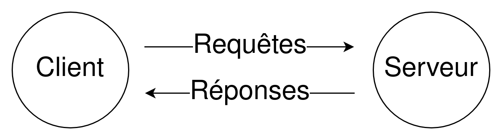

{{LearnSidebar}}{{PreviousMenu("Learn/Getting_started_with_the_web/Publishing_your_website", "Learn/Getting_started_with_the_web")}}

Cet article illustre, de façon simplifiée, ce qui se passe quand une page web s'affiche dans un navigateur, sur votre ordinateur ou votre téléphone.

Ces éléments théoriques ne sont pas strictement nécessaires pour commencer à faire du développement web dans un premier temps. Cependant, ils seront plus qu'utiles pour mieux comprendre comment le Web fonctionne en arrière-plan.

## Des clients et des serveurs

Les ordinateurs connectés à Internet sont appelés des **clients** et des **serveurs**. Voici un diagramme simplifié qui illustre leur interaction&nbsp;:

- Les clients correspondent aux appareils connectés sur Internet par les personnes (par exemple, votre ordinateur connecté par Wi-Fi ou votre téléphone connecté sur le réseau mobile) et aux logiciels d'accès au Web (par exemple, les navigateurs comme Firefox ou Chrome).
- Les serveurs sont des ordinateurs qui stockent des pages web, des sites ou des applications. Lorsqu'un appareil client souhaite accéder à une page web, une copie de la page est téléchargée depuis le serveur vers le client, la machine utilisée affiche alors le contenu dans le navigateur web de l'utilisatrice ou de l'utilisateur.

## Les autres composants du Web

Le client et le serveur ne sont pas les seuls éléments qui interviennent. Il y a beaucoup d'autres composants que nous allons décrire dans la suite de cet article.

Faisons un parallèle entre le Web et une rue. D'un côté de la rue, il y a une maison qui correspond au client. De l'autre côté, un magasin correspondant au serveur, et dans lequel vous souhaitez acheter quelque chose.

En plus du client et du serveur, nous devons aussi mentionner&nbsp;:

- La connexion Internet
  - : Elle permet l'envoi et la réception de données sur le Web. Dans notre métaphore, elle correspond à la rue entre la maison et le magasin.
- TCP/IP
  - : <i lang="en">**T**ransmission **C**ontrol **P**rotocol</i> / <i lang="en">**I**nternet **P**rotocol</i> (en français&nbsp;: protocole de contrôle de transmission d'une part et protocole Internet d'autre part) sont des protocoles définissant comment les données voyagent sur le Web. On peut les comparer aux mécanismes de transport qui vous permettent de passer une commande, d'aller au magasin et d'acheter des marchandises. Dans notre métaphore, il pourrait par exemple s'agir d'un vélo ou d'une voiture.
- DNS
  - : <i lang="en">**D**omain **N**ame **S**ystem</i> (système de nom de domaine) est une sorte d'annuaire pour sites web. Lorsque vous saisissez une adresse dans le navigateur, ce dernier consulte le DNS pour trouver l'adresse réelle du site web avant de récupérer son contenu. Le navigateur a besoin de connaître le serveur sur lequel le site web est situé afin de pouvoir envoyer des requêtes HTTP au bon endroit (voir ci-après). Cela correspond à la recherche de l'adresse du magasin pour s'y rendre.
- HTTP
  - : <i lang="en">**H**yper**T**ext **T**ransfer **P**rotocol</i> (protocole de transfert hypertexte) est un [protocole](/fr/docs/Glossary/Protocol) d'application définissant le langage de communication entre les clients et les serveurs. Pour notre métaphore, il s'agirait de la langue utilisée pour commander les produits.
- Les fichiers composants
  - : Un site web est constitué de divers fichiers. Ils peuvent être vus comme diverses parties des produits qu'on achète au magasin. Ces fichiers peuvent être rangés dans deux catégories&nbsp;:
    - Les fichiers de code
      - : Les sites web sont constitués essentiellement de HTML, de CSS et de JavaScript (nous découvrirons d'autres technologies plus tard).
    - Les ressources
      - : Ce vocable recouvre tous les autres matériaux utilisés pour construire un site web&nbsp;: les images, les musiques, les vidéos, les documents Word et PDF.

## Que se passe-t-il exactement&nbsp;?

Lorsque vous saisissez une adresse web dans votre navigateur (dans notre analogie, cela correspond à aller jusqu'au magasin)&nbsp;:

1. Le navigateur demande au serveur DNS l'adresse réelle du serveur contenant le site web (vous trouvez l'adresse du magasin).
2. Le navigateur envoie une requête HTTP au serveur pour lui demander d'envoyer une copie du site web au client (vous allez au magasin et vous passez commande). Ce message, et les autres données envoyées entre le client et le serveur, sont échangés par l'intermédiaire de la connexion internet en utilisant TCP/IP.
3. Si le serveur accepte la requête émise par le client, le serveur répond par un message «&nbsp;200 OK&nbsp;» au client, qui signifie&nbsp;: «&nbsp;Pas de problème, tu peux consulter ce site web, le voici.&nbsp;». Ensuite le serveur commence à envoyer les fichiers du site web au navigateur sous forme d'une série de petits morceaux qu'on appelle des «&nbsp;paquets de données&nbsp;» (le magasin vous fournit les produits et vous les ramenez chez vous).
4. Le navigateur assemble les différents morceaux pour recomposer le site web en entier puis l'affiche sur votre écran (les produits sont à votre porte).

## Ordre d'analyse des fichiers composants

Lorsque les navigateurs envoient des requêtes aux serveurs pour recevoir des fichiers HTML, ceux-ci contiennent souvent des éléments [`<link>`](/fr/docs/Web/HTML/Element/link) qui référencent des feuilles de style [CSS](/fr/docs/Learn/CSS) externes et des éléments [`<script>`](/fr/docs/Web/HTML/Element/script) qui référencent des scripts [JavaScript](/fr/docs/Learn/JavaScript) externes. Il est important de connaître l'ordre selon lequel ces fichiers sont [analysés par le navigateur](/fr/docs/Web/Performance/How_browsers_work#parsing) lorsqu'il charge la page&nbsp;:

- Le navigateur commence par l'analyse du fichier HTML, ce qui lui permet de reconnaître les éventuels éléments `<link>` (pour les feuilles de style CSS externes) et `<script>` (pour les scripts).
- Pendant l'analyse du fichier HTML, le navigateur envoie des requêtes au serveur pour les différents fichiers CSS indiqués par les éléments `<link>` et pour les fichiers JavaScript indiqués par les éléments `<script>`. Lorsque le navigateur a reçu ces fichiers, il analyse alors leur contenu CSS et JavaScript.
- En mémoire vive, le navigateur génère une structure à partir du document HTML analysé&nbsp;: un arbre, qu'on appelle le [DOM](/fr/docs/Web/API/Document_Object_Model). Pour le CSS, il génère en mémoire une structure qu'on appelle le [CSSOM](/fr/docs/Glossary/CSSOM). Le code JavaScript analysé est [compilé et exécuté](/fr/docs/Web/Performance/How_browsers_work#compilation_javascript).
- Quand le navigateur construit l'arbre du DOM, lui applique les styles à partir de l'arbre du CSSOM et exécute le JavaScript, une représentation visuelle de la page est affichée à l'écran&nbsp;: l'utilisatrice ou l'utilisateur peut alors voir le contenu de la page et commencer à interagir avec.

## Des explications sur le DNS

Les vraies adresses web ne sont pas les chaînes pratiques et mémorisables que vous tapez dans votre barre d'adresse pour trouver vos sites web favoris. Il s'agit en réalité de suites de chiffres. Ces suites de chiffre sont des nombres spéciaux qui ressemblent à ceci&nbsp;: 203.0.113.133 ou 2001:db8:f6cb:01b3:a199:edb5:07c7:45ee.

Ce sont des [adresses IP](/fr/docs/Glossary/IP_Address). Elles représentent un endroit unique sur le Web. Elles ne sont en revanche pas très faciles à retenir. C'est pour cela que le système de nom de domaine (DNS) a été conçu. Les serveurs DNS sont des serveurs spéciaux qui font correspondre le domaine d'une adresse web saisie dans le navigateur (par exemple «&nbsp;mozilla.org&nbsp;») avec l'adresse réelle (IP) du serveur du site.

Il est possible d'atteindre directement les sites web en utilisant leur adresse IP. Vous pouvez utiliser [un outil de recherche DNS](https://www.nslookup.io/website-to-ip-lookup/) pour trouver l'adresse IP d'un site web.

## Explications sur les paquets

Un peu plus haut dans l'article, nous avons utilisé le terme «&nbsp;paquet&nbsp;» pour décrire le format avec lequel les données étaient envoyées depuis le serveur vers le client. Qu'est-ce que cela signifie&nbsp;? Pour simplifier, lorsque des données sont envoyées sur le Web, elles sont envoyées en milliers de petits morceaux. Il y a plusieurs raisons à cela. Tout d'abord, il peut arriver que des paquets soient perdus ou qu'ils soient corrompus et il est alors plus facile de remplacer ces petits morceaux. De plus, les paquets peuvent être dirigés selon différentes routes, ce qui permet un échange plus rapide et qui permet à plusieurs personnes de télécharger un même site web au même moment. Si chaque site web était envoyé sous la forme d'un seul gros paquet, il n'y aurait que peu de personnes qui pourraient le télécharger à la fois, ce qui rendrait le Web beaucoup moins efficace et pratique à utiliser.

## Voir aussi

- [Le fonctionnement d'Internet](/fr/docs/Learn/Common_questions/Web_mechanics/How_does_the_Internet_work)
- [Le fonctionnement du DNS, une présentation de Stéphane Bortzmeyer](https://data.iletaitunefoisinternet.fr/dns-bortzmeyer/dns_bortzmeyer_slides.pdf)
- [<i lang="en">HTTP — an Application-Level Protocol</i> (en anglais)](https://dev.opera.com/articles/http-basic-introduction/)
- [<i lang="en">HTTP: Let's GET It On!</i> (en anglais)](https://dev.opera.com/articles/http-lets-get-it-on/)
- [<i lang="en">HTTP: Response Codes</i> (en anglais)](https://dev.opera.com/articles/http-response-codes/)

## Crédit

Photo de rue&nbsp;: [<i lang="en">Street composing</i>](https://www.pinterest.com/pin/400538960580676851/), par [Kevin Digga](https://www.pinterest.com/kevindigga/).

{{PreviousMenu("Learn/Getting_started_with_the_web/Publishing_your_website", "Learn/Getting_started_with_the_web")}}
