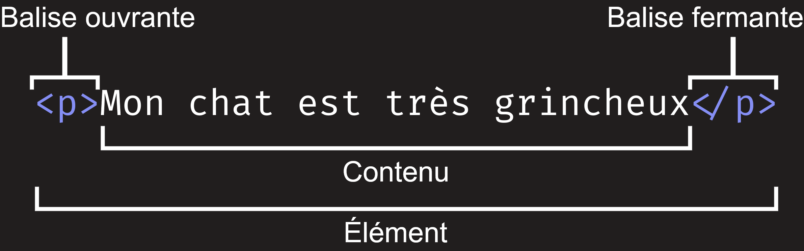
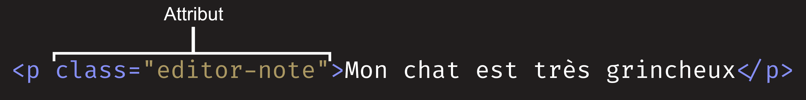
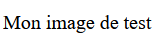

{{LearnSidebar}}{{PreviousMenuNext("Learn/Getting_started_with_the_web/Dealing_with_files", "Learn/Getting_started_with_the_web/CSS_basics", "Learn/Getting_started_with_the_web")}}

HTML (pour <i lang="en">HyperText Markup Language</i>, qu'on peut traduire en «&nbsp;langage de balisage hypertexte&nbsp;») est le langage utilisé pour structurer une page web et son contenu. On peut par exemple organiser le contenu en un ensemble de paragraphes, une liste d'éléments, utiliser des images ou des tableaux de données. Dans cet article, nous verrons les notions de base pour comprendre HTML et ses fonctionnalités.

## Qu'est-ce que HTML&nbsp;?

HTML est _un langage de balisage_ qui définit la structure du contenu. Un document HTML est une suite d'[éléments](/fr/docs/Glossary/Element) utilisés pour encadrer différentes parties du contenu afin de les faire apparaître ou se comporter d'une certaine façon. Les [balises](/fr/docs/Glossary/Tag) autour du contenu permettent de transformer une image ou un texte pour obtenir un lien vers une autre page, de créer des titres, etc. Prenons comme exemple le contenu qui suit&nbsp;:

```text
Mon chat est très grincheux.
```

Si on veut que la ligne ait son propre paragraphe, on peut utiliser les balises correspondantes (`<p>`) pour encadrer le contenu&nbsp;:

```html
<p>Mon chat est très grincheux.</p>
```

### Anatomie d'un élément HTML

Voyons cet élément de paragraphe plus en détails.



Les parties principales de notre élément sont&nbsp;:

1. **La balise ouvrante**&nbsp;: celle-ci se compose du nom de l'élément (ici `p`), entre deux **chevrons** (le premier ouvrant `<` et le second fermant `>`). Cela indique le début de l'élément, ici cela indique où le paragraphe commence.
2. **La balise fermante**&nbsp;: à la différence de la balise ouvrante, une _barre oblique_ (<i lang="en">slash</i>) est ajoutée avant le nom de l'élément. Cela indique la fin de l'élément. Dans notre exemple, c'est l'endroit où le paragraphe s'arrête. Oublier cette balise fermante est une erreur qu'on fait souvent au début et qui peut déclencher des effets étranges et indésirables.
3. **Le contenu**&nbsp;: le contenu de l'élément. Pour cet exemple, il s'agit uniquement de texte.
4. **L'élément**&nbsp;: l'ensemble formé par la balise ouvrante, la balise fermante et le contenu constitue l'élément.

Les éléments peuvent aussi avoir des attributs comme ceci&nbsp;:



Les attributs contiennent des informations supplémentaires à propos de l'élément et qui ne sont pas affichées avec le contenu. Ici, `class` correspond au _nom_ de l'attribut et `editor-note` correspond à la _valeur_ de l'attribut. L'attribut `class` permet de donner un identifiant non unique qui peut être utilisé pour cibler l'élément (et tous les autres éléments qui partagent la même valeur d'attribut pour `class`), notamment pour la mise en forme ou la manipulation avec des scripts.

Certains attributs n'ont pas de valeur, comme [`required`](/fr/docs/Web/HTML/Attributes/required).

Les attributs qui ont une valeur observent ces règles&nbsp;:

1. Il y a un espace entre le nom de l'attribut et le nom de l'élément (ou le précédent attribut si l'élément a déjà un ou plusieurs attributs).
2. Le nom de l'attribut est suivi par un signe égal (`=`).
3. La valeur de l'attribut est délimitée par des doubles (`"`) ou simples (`'`) quotes.

> **Note :** Les valeurs d'attribut qui ne contiennent pas de blancs ASCII (ou l'un des caractères parmi `"` `'` `` ` `` `=` `<` `>`) peuvent ne pas être encadrées de quotes. Malgré tout, il est recommandé d'utiliser des quotes pour toutes les valeurs d'attribut afin que le code soit cohérent et compréhensible.

### Imbrication d'éléments

On peut également placer des éléments à l'intérieur d'autres éléments&nbsp;: c'est ce qu'on appelle **l'imbrication**. Si on souhaitait indiquer que le chat était **très** grincheux, on pourrait placer le mot «&nbsp;très&nbsp;» dans un élément [`<strong>`](/fr/docs/Web/HTML/Element/strong), indiquant l'accentuation sur ce mot&nbsp;:

```html
<p>Mon chat est <strong>très</strong> grincheux.</p>
```

Il faut en revanche s'assurer que les éléments sont correctement imbriqués. Dans l'exemple précédent, on commence par ouvrir l'élément [`<p>`](/fr/docs/Web/HTML/Element/p), puis l'élément [`<strong>`](/fr/docs/Web/HTML/Element/strong). Il faut donc commencer par fermer l'élément `<strong>`, puis l'élément `<p>`. Ce qui suit est incorrect&nbsp;:

```html-nolint example-bad
<p>Mon chat est <strong>très grincheux.</p></strong>
```

Les éléments doivent être ouverts et fermés correctement pour contenir ou être contenu. S'ils se chevauchent l'un sur l'autre, votre navigateur web essaiera au mieux de deviner l'intention, mais cela pourra entraîner des résultats inattendus&nbsp;: mieux vaut éviter&nbsp;!

### Éléments vides

Certains éléments n'ont pas de contenu, on les qualifie d'[éléments vides](/fr/docs/Glossary/Void_element). Prenons l'exemple de l'élément [``](/fr/docs/Web/HTML/Element/img) que nous avons sur notre page HTML&nbsp;:

```html

```

Cet élément contient deux attributs (`src` et `alt`) mais n'a pas de contenu et il n'y a pas de balise fermante. En effet, un élément d'image n'encadre pas du contenu pour avoir un effet sur celui-ci. Son but est d'intégrer une image dans un document HTML à l'endroit où il est placé.

### Anatomie d'un document HTML

Voilà ce qu'on peut dire individuellement sur les éléments HTML. En revanche, un élément HTML seul n'a pas vraiment d'intérêt. Nous allons donc voir comment sont assemblés les éléments pour former une page HTML complète. Reprenons le code que nous avions mis dans le fichier d'exemple `index.html` (voir l'article [Manipuler les fichiers](/fr/docs/Learn/Getting_started_with_the_web/Dealing_with_files))&nbsp;:

```html
<!doctype html>
<html lang="fr">
  <head>
    <meta charset="utf-8" />
    <meta name="viewport" content="width=device-width" />
    <title>Ma page de test</title>
  </head>
  <body>
    
  </body>
</html>
```

Voici ce qu'on y trouve&nbsp;:

- `<!DOCTYPE html>`
  - : [Le «&nbsp;<i lang="en">doctype</i>&nbsp;»](/fr/docs/Glossary/Doctype). Il s'agit d'un préambule obligatoire. Aux débuts de HTML (en 1991/1992), les <i lang="en">doctypes</i> servaient de liens vers des ensembles de règles qu'une page HTML devait suivre pour être considérée valides (avec des fonctionnalités de vérifications d'erreur et autres). Aujourd'hui, ils ne sont plus utilisés ainsi et ce marqueur sert uniquement au bon comportement du document. C'est tout ce qu'il y a à savoir là-dessus pour le moment.
- `<html></html>`
  - : L'élément [`<html>`](/fr/docs/Web/HTML/Element/html) est celui qui contient tout le reste de la page. On l'appelle aussi l'élément racine. Il contient ici l'attribut `lang` qui indique la langue principale du contenu du document.
- `<head></head>`
  - : L'élément [`<head>`](/fr/docs/Web/HTML/Element/head) sert de conteneur pour tout ce qu'on veut inclure dans une page HTML qui n'est _pas_ du contenu à afficher à l'écran. Cela inclut [les mots-clés](/fr/docs/Glossary/Keyword) et une description de la page destinée aux moteurs de recherches, les liens vers le CSS qui mettra en forme notre contenu, les déclarations pour les jeux de caractères utilisés, etc.
- `<meta charset="utf-8">`
  - : Cet élément définit le jeu de caractères utilisé pour le document, ici UTF-8 (qui inclut la plupart des caractères pour un grand nombre de langues écrites). Ce jeu de caractères permettra de gérer n'importe quel contenu textuel placé dans le document. Inclure cette information ne coûte rien et permet d'éviter des problèmes d'encodage par la suite.
- `<meta name="viewport" content="width=device-width">`
  - : Cet [élément `viewport`](/fr/docs/Web/CSS/Viewport_concepts#zones_daffichage_sur_mobiles) permet que la page soit affichée avec la bonne largeur par rapport à la zone d'affichage, empêchant les navigateurs sur mobile d'afficher la page plus largement que la zone d'affichage avant de la réduire.
- `<title></title>`
  - : L'élément [`<title>`](/fr/docs/Web/HTML/Element/title) définit le titre de la page, qui apparaîtra dans l'onglet sur lequel la page est chargée. Il sert aussi à décrire la page lorsqu'on l'ajoute aux favoris ou qu'elle est listée dans les résultats d'un moteur de recherche.
- `<body></body>`
  - : L'élément [`<body>`](/fr/docs/Web/HTML/Element/body) contient _tout_ le contenu qu'on veut afficher aux utilisatrices et utilisateurs web lorsqu'ils visitent la page, que ce soit du texte, des vidéos, des jeux, des pistes audio, etc.

## Images

Revenons sur l'élément [``](/fr/docs/Web/HTML/Element/img)&nbsp;:

```html

```

Comment mentionné auparavant, cet élément permet d'intégrer une image dans la page là où l'élément est placé. L'image à afficher est désignée par l'attribut `src` (source) qui contient le chemin vers le fichier image.

Nous avons également inclus un attribut `alt` (pour texte alternatif). [L'attribut `alt`](/fr/docs/Web/HTML/Element/img#écrire_des_descriptions_alternatives_significatives), permet d'indiquer un texte descriptif pour les personnes qui ne peuvent pas voir l'image&nbsp;:

1. À cause d'un handicap visuel. Les personnes avec un handicap visuel utilisent généralement des logiciels appelés lecteurs d'écran qui lisent le texte alternatif à haute voix.
2. Un problème a empêché le chargement de l'image. Vous pouvez voir ce cas en modifiant le chemin de l'attribut `src` pour le rendre incorrect. Si vous sauvegardez le document HTML et rechargez la page, vous pourrez voir un résultat comme ceci&nbsp;:



Les mots-clés utilisés pour le texte alternatif forment un texte descriptif. Le texte alternatif devrait fournir suffisamment d'informations à la lectrice ou au lecteur pour avoir une bonne idée de ce que l'image contient. Dans cet exemple, notre texte est «&nbsp;Mon image de test&nbsp;». Ce texte n'est vraiment pas idéal, il ne renseigne en rien sur ce que contient l'image. Une bien meilleure alternative décrivant le logo serait «&nbsp;Le logo de Firefox&nbsp;: un renard enflammé entourant la Terre&nbsp;».

Essayez maintenant d'utiliser un meilleur texte alternatif pour votre image.

> **Note :** Pour en savoir plus sur l'accessibilité, n'hésitez pas à consulter [notre module d'apprentissage sur l'accessibilité](/fr/docs/Learn/Accessibility).

## Baliser du texte

Cette section décrira certains des éléments HTML essentiels pour baliser et structurer le texte d'un document.

### Titres

Les éléments de titre permettent d'indiquer les parties du contenu qui sont des titres ou des sous-titres. De la même façon qu'un livre peut avoir un titre principal, des titres de chapitre, des sous-titres, un document HTML peut en avoir également. HTML contient 6 niveaux de titre [`<h1> - <h6>`](/fr/docs/Web/HTML/Element/Heading_Elements), même si on en utilisera généralement 3 à 4 au plus&nbsp;:

```html
<!-- 4 niveaux de titres : -->
<h1>Mon titre principal</h1>
<h2>Mon titre de deuxième niveau</h2>
<h3>Mon sous-titre</h3>
<h4>Mon sous-sous-titre</h4>
```

> **Note :** En HTML, tout ce qui est écrit entre `<!--` et `-->` est un **commentaire HTML**. Le navigateur ignore les commentaires lorsqu'il affiche le document. Autrement dit, ce qui est écrit en commentaire est uniquement visible dans le code et pas sur la page. Les commentaires permettent d'ajouter des notes utiles à propos du code ou de la logique.

Essayez maintenant d'ajouter un titre pertinent à votre page HTML avant l'élément [``](/fr/docs/Web/HTML/Element/img).

> **Note :** Vous pourrez voir que le titre de niveau 1 possède une mise en forme implicite, mais il ne faut pas utiliser ces éléments pour uniquement afficher du texte en gras ou plus grand. En effet, les éléments ont un sens, utilisé pour [l'accessibilité](/fr/docs/Learn/Accessibility/HTML#contenus_textuels) et [le référencement](/fr/docs/Learn/HTML/Introduction_to_HTML/HTML_text_fundamentals#pourquoi_faut-il_structurer_un_document). Essayez de créer une structure de titres pertinente pour vos pages, sans sauter de niveaux intermédiaires.

### Paragraphes

Comme expliqué plus tôt, les éléments [`<p>`](/fr/docs/Web/HTML/Element/p) forment des paragraphes de texte. Cet élément est souvent utilisé pour baliser du texte normal du contenu d'une page&nbsp;:

```html
<p>Voici un paragraphe simple</p>
```

Ajoutez votre texte d'échantillon (celui créé à la lecture de [_À quoi ressemblera votre site web&nbsp;?_](/fr/docs/Learn/Getting_started_with_the_web/What_will_your_website_look_like)) dans un ou plusieurs paragraphes, juste après l'élément [``](/fr/docs/Web/HTML/Element/img).

### Listes

Une bonne partie du contenu web prend la forme de listes. HTML possède des éléments dédiés. Baliser une liste se fait toujours avec au moins deux éléments. Les types de liste les plus fréquemment utilisés sont les listes ordonnées et les listes non-ordonnées&nbsp;:

- Les listes non-ordonnées
  - : Utilisées pour les listes où l'ordre des éléments n'a pas d'importance, comme une liste de courses. Pour celles-ci, on utilise un élément [`<ul>`](/fr/docs/Web/HTML/Element/ul).
- Les listes ordonnées
  - : Utilisées pour les listes où l'ordre des éléments est important, comme une recette de cuisine. Pour celles-ci, on utilise un élément [`<ol>`](/fr/docs/Web/HTML/Element/ol).

Chaque élément d'une liste est placé dans un élément [`<li>`](/fr/docs/Web/HTML/Element/li).

Ainsi, si on veut qu'une partie de notre paragraphe devienne une liste, à la place de&nbsp;:

```html
<p>
  À Mozilla, nous formons une communauté de bidouilleuses, concepteurs,
  constructrices qui travaillent ensemble…
</p>
```

On pourra écrire&nbsp;:

```html
<p>À Mozilla, nous formons une communauté de</p>

<ul>
  <li>Bidouilleuses</li>
  <li>Concepteurs</li>
  <li>Constructrices</li>
</ul>

<p>qui travaillent ensemble…</p>
```

Essayez d'ajouter une liste ordonnée ou non-ordonnée à votre page d'exemple.

## Liens

Les liens sont importants, ce sont eux qui forment la toile qu'est le Web&nbsp;! Pour ajouter un lien, on utilisera un élément [`<a>`](/fr/docs/Web/HTML/Element/a) («&nbsp;a&nbsp;» correspondant à «&nbsp;ancre&nbsp;»). Pour placer un lien dans votre paragraphe, suivez les étapes suivantes&nbsp;:

1. Identifiez le texte voulu (ici nous prendrons le texte «&nbsp;Manifeste Mozilla&nbsp;»).
2. Entourez-le avec les balises ouvrantes et fermantes d'un élément [`<a>`](/fr/docs/Web/HTML/Element/a) comme suit&nbsp;:

   ```html
   <a>Manifeste Mozilla</a>
   ```

3. Ajoutez un attribut `href` à l'élément [`<a>`](/fr/docs/Web/HTML/Element/a)&nbsp;:

   ```html
   <a href="">Manifeste Mozilla</a>
   ```

4. Renseignez la valeur de cet attribut avec l'adresse web vers laquelle vous voulez créer le lien&nbsp;:

   ```html
   <a href="https://www.mozilla.org/fr/about/manifesto/">Manifeste Mozilla</a>
   ```

Attention, vous pourriez obtenir des résultats inattendus si vous omettez la partie `https://` ou `http://`, qui indique le _protocole_, au début de l'adresse. Après avoir créé un lien, cliquez dessus pour vous assurer qu'il pointe à l'endroit voulu.

> **Note :** `href` peut sembler un peu obscure comme nom d'attribut&nbsp;: il signifie <i lang="en">hypertext reference</i> soit «**réf**érence **h**ypertexte ».

Ajoutez un lien à votre page si ça n'est pas déjà fait.

## Conclusion

Si vous avez suivi l'ensemble des instructions de cet article, vous devriez obtenir une page qui ressemble à celle-ci (vous pouvez aussi [la voir ici (en anglais)](https://mdn.github.io/beginner-html-site/))&nbsp;:


Si vous coincez, vous pouvez toujours comparer votre travail avec [le code de notre exemple finalisé sur GitHub](https://github.com/mdn/beginner-html-site/blob/gh-pages/index.html).

Nous n'avons fait qu'effleurer la surface de HTML. Pour approfondir, n'hésitez pas à consulter la thématique [Apprendre HTML](/fr/docs/Learn/HTML).

{{PreviousMenuNext("Learn/Getting_started_with_the_web/Dealing_with_files", "Learn/Getting_started_with_the_web/CSS_basics", "Learn/Getting_started_with_the_web")}}
