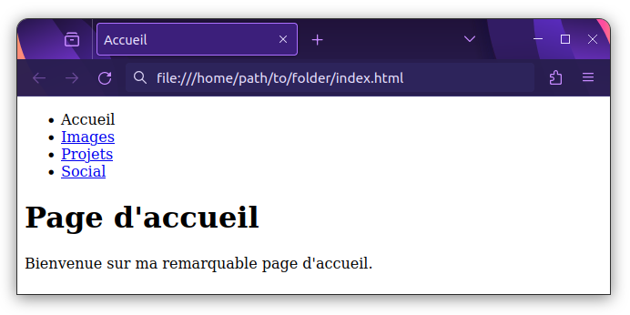

{{LearnSidebar}}
{{PreviousMenuNext("Apprendre/HTML/Introduction_à_HTML/HTML_text_fundamentals", "Apprendre/HTML/Introduction_à_HTML/Advanced_text_formatting", "Apprendre/HTML/Introduction_à_HTML")}}

Les Hyperliens sont vraiment importants, ils sont ce qui fait du Web _une toile_. Cet article montre la syntaxe requise pour faire un lien et discute des bonnes pratiques pour les liens.

<table class="standard-table">
  <tbody>
    <tr>
      <th scope="row">Prérequis :</th>
      <td>
        Être familiarisé avec les bases du HTML, traitées à la page
        <a
          href="/fr/docs/Apprendre/HTML/Introduction_à_HTML/Getting_started"
          >Commencer avec le HTML</a
        >
        et du formatage de texte HTML, décrit dans les
        <a
          href="/fr/docs/Learn/HTML/Introduction_to_HTML/HTML_text_fundamentals"
          >Fondamentaux du texte HTML</a
        >.
      </td>
    </tr>
    <tr>
      <th scope="row">Objectif :</th>
      <td>
        Apprendre à implémenter un hyperlien efficacement, et à relier de
        multiples fichiers ensemble.
      </td>
    </tr>
  </tbody>
</table>

## Qu'est-ce un hyperlien ?

Les hyperliens sont l'une des plus passionnantes innovations que le web a à offrir. De fait, ils ont été une fonctionnalité du Web depuis le tout début, mais ils sont ce qui fait du Web _une toile_ — ils nous permettent de lier nos documents à n'importe quel autre document (ou autre ressource) voulu ; nous pouvons faire des liens vers des parties précises de documents et rendre des applications disponibles à une simple adresse web (contrairement aux applications natives, qui doivent être installées et tout le travail). À peu près tout contenu web peut être converti en lien, de sorte que cliqué (ou activé autrement), il dirigera le navigateur vers une autre adresse web ({{glossary("URL")}}).

> **Note :** Une URL peut pointer vers des fichiers HTML, des fichiers textes, des images, des documents textuels, des fichiers vidéo ou audio et tout ce qui peut exister sur le Web. Si le navigateur Web ne sait pas comment afficher ou gérer un fichier, il vous demande si vous voulez ouvrir le fichier (dans ce cas, la responsabilité de l'ouverture et de la gestion du fichier incombe à l'application native adéquate sur l'appareil) ou bien télécharger le fichier (auquel cas, vous pouvez essayer de vous en occuper plus tard).

La page d'accueil de la BBC, par exemple, contient un nombre important de liens pour pointer, non seulement vers de multiples articles d'actualité, mais encore vers d'autres zones du site (fonctionnalité de navigation) , des pages d'inscription/de connexion (outils utilisateur) et plus encore.


## Anatomie d'un lien

Un lien élémentaire se crée en intégrant le texte (ou tout autre contenu, cf. [Liens de niveau bloc](#liens_de_niveau_bloc)) que vous voulez transformer en lien dans un élément {{htmlelement("a")}} et en lui affectant un attribut [`href`](/fr/docs/Web/HTML/Element/a#href) (également connu comme étant une **Hypertext Reference**) contenant l'adresse web vers laquelle vous voulez que le lien pointe.

```html
<p>
  Je suis en train de créer un lien à
  <a href="https://www.mozilla.org/fr/">la page d'accueil Mozilla</a>.
</p>
```

qui donne le résultat suivant :

Je suis en train de créer un lien à [la page d'accueil de Mozilla](https://www.mozilla.org/fr/).

### Ajouter des informations d'assistance avec l'attribut title

L'autre attribut qu'il est possible d'ajouter à un lien est `title` ; il est destiné à contenir des informations utiles supplémentaires à propos du lien, comme le type d'informations contenues dans la page ou ce qu'il faut savoir. Par exemple :

```html
<p>
  Je suis en train de créer un lien à
  <a
    href="https://www.mozilla.org/fr/"
    title="Le meilleur endroit pour trouver plus d'informations sur la
  mission de Mozilla et la manière de contribuer"
    >la page d'accueil Mozilla</a
  >.
</p>
```

Voici le résultat (le contenu de `title` apparaît dans une info-bulle quand le pointeur de souris passe sur le lien) :

Je suis en train de créer un lien vers [la page d'accueil de Mozilla](https://www.mozilla.org/fr/)

> **Note :** le `title` d'un lien n'est révélé que lors du survol de la souris, ce qui signifie que les personnes utilisant les commandes clavier pour naviguer dans les pages web auront des difficultés à accéder aux informations de `title`. Si une information de `title` est vraiment importante pour l'utilisation d'une page, alors vous devez la présenter de manière accessible à tout utilisateur, par exemple, en la mettant dans le texte normal.

### Apprentissage actif : création de votre propre exemple de lien

C'est l'heure de l'apprentissage actif : veuillez créer un document HTML avec un éditeur de code local (notre [fichier modèle index.html](https://github.com/mdn/learning-area/blob/master/html/introduction-to-html/getting-started/index.html) fera parfaitement l'affaire).

- Dans le corps de l'HTML, essayez d'ajouter un ou plusieurs paragraphes ou d'autres types de contenu pour lesquels vous avez déjà des connaissances.
- Changez certaines parties du contenu en liens.
- Insérez les attributs `title`.

### Liens de niveau bloc

Comme mentionné précédemment, vous pouvez transformer à peu près tout contenu en un lien, même des [éléments bloc](/fr/docs/Learn/HTML/Introduction_to_HTML/Getting_started#éléments_bloc_ou_en_ligne). Si vous avez une image que vous voulez transformer en lien, vous avez juste à mettre l'image entre les balises `<a></a>`.

```html
<a href="https://www.mozilla.org/fr/">
  
</a>
```

> **Note :** Nous vous donnerons beaucoup plus de détails sur l'utilisation d'images sur le Web dans un futur article.

## Une brève présentation des URL et des chemins

Pour bien maîtriser les cibles des liens, vous avez besoin d'avoir compris ce que sont les URL et les chemins. Cette section vous donne les informations voulues pour y parvenir.

Une URL, ou **U**niform **R**esource **L**ocator, est simplement une chaîne textuelle qui définit où se situe quelque chose sur le Web. Par exemple, la page d'accueil en anglais de Mozilla est située à l'adresse `https://www.mozilla.org/en-US/`.

Les URL utilisent des chemins pour trouver des fichiers. Les chemins indiquent où dans le système de fichiers, se trouve celui qui vous intéresse. Regardons un exemple simple de structure de répertoires (voir le dossier [creating-hyperlinks](https://github.com/mdn/learning-area/tree/master/html/introduction-to-html/creating-hyperlinks)).


La **racine** de cette structure de répertoires s'appelle `creating-hyperlinks`. Quand vous travaillez localement sur un site web, vous avez un dossier contenant l'intégralité du site. Dans la racine, nous avons un fichier `index.html` et un `contacts.html`. Sur un site réel, `index.html` serait notre page d'accueil ou portail (page web servant de point d'entrée à un site web ou à une section particulière d'un site web).

Il y a aussi deux répertoires dans la racine — `pdfs` et `projects`. Chacun d'eux comporte un seul fichier — respectivement un PDF (`project-brief.pdf)` et un fichier `index.html`. Notez que vous pouvez heureusement avoir deux fichiers `index.html` dans un projet, pour autant qu'ils se trouvent dans deux emplacements différents dans le système de fichiers. De nombreux sites web le font. Le second `index.html` peut être le portail des informations relatives au projet.

- **Dans un même dossier** : si vous voulez inclure un hyperlien dans `index.html` (celui de plus haut niveau) pointant vers `contacts.html`, il suffit d'indiquer uniquement le nom du fichier auquel vous voulez le lier, car il est dans le même répertoire que le fichier actuel. Ainsi, l'URL à utiliser est `contacts.html` :

  ```html
  <p>
    Voulez‑vous rencontrer un membre du personnel en particulier ? Voyez comment
    faire sur notre page <a href="contacts.html">Contacts</a>.
  </p>
  ```

- **Descendre dans les sous-répertoires** : si vous désirez inclure un hyperlien dans `index.html` (`celui` de plus haut niveau) pointant vers `projects/index.html`, vous avez besoin de descendre dans le dossier `projects` avant d'indiquer le fichier auquel vous voulez vous lier. Cela se fait en indiquant le nom du dossier, suivi d'une barre oblique normale, puis le nom du fichier. Donc l'URL à utiliser sera `projects/index.html` :

  ```html
  <p>
    Visitez la <a href="projects/index.html">page d'accueil</a> de mon projet.
  </p>
  ```

- **Monter dans les dossiers parents** : si vous voulez inclure un hyperlien dans `projects/index.html` qui pointe vers `pdfs/projects-brief.pdf`, vous aurez besoin de monter dans le répertoire au niveau au‑dessus, puis de descendre dans le dossier `pdfs`. « Monter dans le répertoire au niveau au‑dessus » est indiqué avec deux points — `..` —, de sorte que l'URL à utiliser sera `../pdfs/project‑brief.pdf` :

  ```html
  <p>
    Voici un lien vers mon
    <a href="../pdfs/project-brief.pdf">sommaire de projet</a>.
  </p>
  ```

> **Note :** Vous pouvez combiner plusieurs instances de ces fonctionnalités dans des URL complexes si nécessaire, par ex. `../../../complexe/path/to/my/file.html`.

### Fragments de documents

Il est possible de faire un lien vers une partie donnée d'un document HTML (désignée du terme **fragment de document**), plutôt que juste le haut du document. Pour ce faire, vous devrez d'abord assigner un attribut [`id`](/fr/docs/Web/HTML/Global_attributes#id) à l'élément sur lequel vous voulez pointer. Il est généralement logique d'établir un lien vers une rubrique précise, ainsi cela ressemble à quelque chose comme :

```html
<h2 id="Adresse_mailing">Adresse de mailing</h2>
```

Puis, pour faire un lien vers cet `id` précisément, il convient de l'indiquer à la fin de l'URL, précédé d'un croisillon (#) :

```html
<p>
  Vous voulez nous écrire une lettre ? Utilisez notre
  <a href="contacts.html#Adresse_mailing">adresse de contact</a>.
</p>
```

Vous pouvez même utiliser une référence au fragment de document seul pour faire un lien vers _une autre partie du même document_ :

```html
<p>
  Vous trouverez n l'<a href="#Adresse_mailing">adresse de mailing</a> de notre
  société au bas de cette page.
</p>
```

### URL absolue vs. URL relative

Deux termes que vous rencontrerez sur le Web sont **URL absolue** et **URL relative** :

**URL absolue** : pointe sur un emplacement défini de manière absolue sur le web, y compris en précisant le {{glossary("protocol","protocole")}} et le {{glossary("domain name","nom de domaine")}}. Ainsi par exemple, si une page `index.html` est téléversée dans le dossier nommé `projects` à la racine du serveur web, et que le domaine du site est `http://www.example.com`, la page sera accessible à l'adresse `http://www.example.com/projects/index.html` (ou même seulement `http://www.example.com/projects/`, du fait que la plupart des serveurs web cherchent pour le chargement une page d'accueil comme `index.htm`, si ce n'est pas précisé dans l'URL).

Une URL absolue pointera toujours vers le même emplacement, quel que soit l'endroit où elle est utilisée.

**URL** **relative :** pointe vers un emplacement qui est _relatif_ au fichier à partir duquel vous établissez le lien, tout comme ce que nous avons vu précédemment. Donc, si nous voulons créer un lien depuis notre fichier d'exemple en `http://www.example.com/projects/index.html` vers un fichier PDF dans le même dossier, l'URL sera seulement le nom du fichier — càd., `project-brief.pdf` — pas besoin d'information supplémentaire. Si le PDF est disponible dans un sous-dossier de `projects` appelé `pdfs`, le lien relatif serait `pdfs/project-brief.pdf` (l'URL absolue équivalente serait `http://www.example.com/projects/pdfs/project-brief.pdf`.)

Une URL relative pointera vers des emplacements différents en fonction de l'endroit où se situe le fichier qui est utilisé ; par exemple, si nous déplacions notre `index.html` du dossier `projects` vers la racine du site web (au niveau le plus élevé, dans aucun dossier), le lien de l'URL relative `pdfs/project-brief.pdf` qui s'y trouve pointerait alors vers un fichier situé en `http://www.example.com/pdfs/project-brief.pdf`, et non vers un fichier situé en `http://www.example.com/projects/pdfs/project-brief.pdf`.

Bien sûr, l'emplacement du fichier `project-brief.pdf` et du dossier `pdfs` ne changera pas subitement du fait que vous avez déplacé le fichier `index.html` : cela aura pour effet que votre lien pointera vers un mauvais emplacement, de sorte que cela ne fonctionnera pas si on clique dessus. Vous devez être prudent !

## Meilleures pratiques de liens

Il y a quelques bonnes pratiques à suivre pour l'écriture de liens. Jetons-y un coup d'œil.

### Utilisez une formulation claire des liens

Il est facile de mettre des liens sur une page. Mais ce n'est pas suffisant. Nous devons rendre nos liens _accessibles_ à tous les lecteurs, indépendamment de leur contexte d'installation et des outils qu'ils préfèrent. Par exemple :

- les utilisateurs de lecteurs d'écran aiment à sauter de lien en lien sur la page, et à les lire hors contexte.
- les moteurs de recherche utilisent le texte des liens pour indexer les fichiers cibles, c'est donc une bonne idée que d'inclure des mots-clés dans le texte du lien pour décrire effectivement à quoi il est lié.
- les utilisateurs visuels survolent la page plutôt que d'en lire chaque mot, et leurs yeux seront forcément attirés par les particularités qui se détachent de la page, comme les liens. Ils trouveront utile le texte descriptif du lien.

Regardons un exemple particulier :

**Bon** texte de lien&nbsp;: [Télécharger Firefox](https://firefox.com)

```html
<p><a href="https://firefox.com/"> Télécharger Firefox </a></p>
```

**Mauvais** texte de lien&nbsp;: [Cliquer ici](https://firefox.com/) pour télécharger Firefox

```html
<p><a href="https://firefox.com/"> Cliquer ici </a> pour télécharger Firefox</p>
```

Autres conseils :

- Ne répétez pas l'URL dans le texte du lien — les URL sont moches, et elles le sont encore plus à entendre quand un lecteur d'écran les épèle.
- Ne dites pas « lien » ou « liens vers... » dans le texte du lien, ce n'est que du rabâchage. Les lecteurs d'écran indiquent aux gens qu'il y a un lien. Les utilisateurs visuels verront aussi qu'il y a un lien, du fait que les liens sont généralement de couleur différente et soulignés (de façon générale, cette convention tacite ne devrait pas être trahie, car les utilisateurs y sont très habitués).
- Faites que vos étiquettes de lien soient aussi courtes que possible : les liens longs agacent particulièrement les utilisateurs de lecteurs d'écran, qui doivent en écouter la lecture entière.
- Minimiser les cas où plusieurs copies d'un même texte pointent vers des emplacements différents. Afficher une liste de liens hors contexte peut poser problème aux utilisateurs de lecteurs d'écran&nbsp;: ainsi plusieurs liens tous étiquetés « cliquez ici », « cliquez ici », « cliquez ici » seront source de confusion.

### Utilisez des liens relatifs partout où c'est possible

Compte tenu de la description ci-dessus, vous pourriez penser qu'utliser des liens absolus tout le temps est une bonne idée ; après tout, ils ne sont pas brisés si une page est déplacée, comme c'est le cas avec les liens relatifs. Mais, vous devez utiliser des liens relatifs partout où c'est possible pour pointer vers d'autres emplacements à l'intérieur d'un _même site web_. (pour les liens vers un _autre site web_, vous aurez besoin d'utiliser un lien absolu) :

- Pour commencer, il sera plus facile de parcourir votre code — les URL relatives sont généralement nettement plus courtes que les URL absolues, ce qui rend la lecture de votre code beaucoup plus facile.
- Ensuite, il est plus efficace d'utiliser des URL relatives partout où c'est possible. Quand vous utilisez une URL absolue, votre navigateur commence par rechercher l'emplacement réel du serveur dans le « Domain Name System » ({{glossary("DNS")}} ; voir [Fonctionnement du web](/fr/docs/Learn/Getting_started_with_the_web/How_the_Web_works) pour plus d'informations), puis il se rend sur ce serveur et trouve le fichier demandé. Avec une URL relative par contre, le navigateur recherche le fichier demandé uniquement sur le même serveur. Donc, si vous utilisez des URL absolues là où des URL relatives auraient été suffisantes, vous obligez constamment le navigateur à faire du travail supplémentaire, ce qui signifie qu'il fonctionnera moins efficacement.

### Liaison vers des ressources non-HTML : signalez‑les clairement

Quand faites un lien vers une ressource à télécharger (comme un PDF ou un document Word ) ou lue en flux (comme une video ou de l'audio) ou qui a un autre effet potentiellement inattendu (qui ouvre d'une fenêtre pop-up ou qui charge une vidéo Flash), vous devez le signaler clairement pour réduire toute confusion. Cela peut être parfaitement ennuyeux, par exemple :

- si vous êtes sur une connexion à faible bande passante, cliquer sur un lien et initier un téléchargement de plusieurs mégaoctets de façon inattendue.
- si vous n'avez pas Flash player installé, cliquer sur un lien et être soudain redirigé vers une page qui nécessite Flash.

Voici quelques exemples suggérant les genres de texte pouvant être employé :

```html
<p>
  <a href="http://www.exemple.com/rapport-volumineux.pdf">
    Télécharger le rapport des ventes (PDF, 10Mo)
  </a>
</p>

<p>
  <a href="http://www.exemple.com/flux-video/" target="_blank">
    Regarder la vidéo (le flux s'ouvre dans un nouvel onglet, qualité HD)
  </a>
</p>

<p>
  <a href="http://www.exemple.com/jeu-de-voiture">
    Jouer au jeu de voiture (nécessite Flash)
  </a>
</p>
```

### Utilisez l'attribut `download` pour faire un lien vers un téléchargement

Quand vous faites un lien avec une ressource qui doit être téléchargée plutôt qu'ouverte dans le navigateur, vous pouvez utiliser l'attribut `download` pour fournir un nom d'enregistrement par défaut. Voici un exemple avec un lien de téléchargement vers la version Windows la plus récente de Firefox :

```html
<a
  href="https://download.mozilla.org/?product=firefox-latest-ssl&os=win64&lang=fr-FR"
  download="firefox-latest-64bit-installer.exe">
  Télécharger la version de Firefox pour Windows la plus récente
  (64-bit)(français, France)
</a>
```

## Apprentissage actif : création d'un menu de navigation

Pour cet exercice, nous aimerions que vous reliiez ensemble quelques pages par un menu de navigation pour créer un web site multi-page. C'est une manière courante de créer un site web, la même structure de page est utilisée sur chaque page, y compris le même menu de navigation, de sorte que quand les liens sont cliqués, cela vous donne l'impression de rester au même endroit, tandis qu'un contenu différent est présenté.

Vous aurez besoin de faire des copies locales des quatre pages suivantes, toutes dans le même dossier (voyez aussi le dossier [navigation-menu-start](https://github.com/mdn/learning-area/tree/master/html/introduction-to-html/navigation-menu-start) pour une liste complète des fichiers).

- [index.html](https://github.com/mdn/learning-area/blob/master/html/introduction-to-html/navigation-menu-start/index.html)
- [projects.html](https://github.com/mdn/learning-area/blob/master/html/introduction-to-html/navigation-menu-start/projects.html)
- [pictures.html](https://github.com/mdn/learning-area/blob/master/html/introduction-to-html/navigation-menu-start/pictures.html)
- [social.html](https://github.com/mdn/learning-area/blob/master/html/introduction-to-html/navigation-menu-start/social.html)

Vous devez :

1. Ajouter une liste non-ordonnée à l'endroit indiqué sur une page, qui contiendra les noms des pages à relier. Un menu de navigation n'est habituellement qu'une liste de liens, donc c'est ok sur le plan sémantique.
2. Changer chaque nom de page en un lien vers cette page.
3. Copier le menu de navigation dans chaque page.
4. Sur chaque page, enlever seulement le lien vers cette page, c'est source de confusion et sans objet pour une page que d'inclure un lien vers elle-même, et l'absence d'un lien constitue un bon rappel visuel pour se souvenir sur quelle page vous êtes actuellement.

L'exemple terminé devrait finir par ressembler à quelque chose comme ce qui suit :



> **Note :** si vous êtes bloqué, ou n'êtes pas sûr d'avoir bien compris, vous pouvez vérifier le dossier [navigation-menu-marked-up](https://github.com/mdn/learning-area/tree/master/html/introduction-to-html/navigation-menu-marked-up) pour voir la réponse correcte.

## Liens de courriel

Il est possible de créer des liens ou des boutons qui, lorsqu'ils sont cliqués, ouvrent un nouveau message de courriel sortant plutôt que de faire un lien vers une ressource ou une page. C'est fait en utilisant l'élément {{HTMLElement("a")}} et le schéma d'URL `mailto:`.

Sous sa forme la plus basique et la plus communément utilisée, un lien `mailto:` indique simplement l'adresse du destinataire voulu. Par exemple :

```html
<a href="mailto:nullepart@mozilla.org">Envoyer un courriel à nullepart</a>
```

Ceci donne un résultat qui ressemble à ceci : [Envoyer un courriel à nullepart](mailto:nowhere@mozilla.org).

En fait, l'adresse de courriel est même optionnelle. Si vous l'omettez (c'est-à-dire, si votre [`href`](/fr/docs/Web/HTML/Element/a#href) est simplement "mailto:"), une nouvelle fenêtre de courriel sortant sera ouverte par le client de courriel de l'utilisateur, sans adresse de destination encore spécifiée. C'est souvent utile comme pour les liens "Partager" que lesquels les utilisateurs peuvent cliquer pour envoyer un e-mail à l'adresse de leur choix.

### Spécification des détails

En plus de l'adresse mail, vous pouvez fournir d'autres informations. En fait, tous les champs d'en-tête standards peuvent être ajoutés à l'URL `mailto` que vous fournissez. Les plus couramment utilisés parmi ceux-ci sont `subject`, `cc` et `body` (qui n'est pas à proprement parler un champ d'en-tête, mais qui vous permet d'indiquer un court message de contenu pour le nouveau courriel). Chaque champ est indiqué en termes de requête.

Voici un exemple incluant cc (carbon copy), bcc (blind cc), subject (sujet) et body :

```html
<a
  href="mailto:nullepart@mozilla.org?cc=nom2@rapidtables.com&bcc=nom3@rapidtables.com&subject=L%27objet%20du%20courriel&body=Le%20corps%20du%20courriel">
  Envoyer un e-mail avec copie, copie cachée, sujet et corps de message
</a>
```

> **Note :** La valeur de chaque champ doit être codée à la façon d'une URL, c'est-à-dire que les caractères non-imprimables (les caractères "invisibles" tels que les tabulations, les retours chariot et les sauts de page) et les espaces doivent être [percent-escaped](http://en.wikipedia.org/wiki/Percent-encoding). Notez également l'utilisation du point d'interrogation (`?`) pour séparer l'URL principale des valeurs de champ et de l'esperluette (&) pour séparer chaque champ dans l'URL `mailto:`. C'est la notation standard des requêtes URL. Lire [La méthode GET](/fr/docs/Web/Guide/HTML/Formulaires/Envoyer_et_extraire_les_données_des_formulaires#La_méthode_GET) pour comprendre ce pourquoi la notation de requête URL est habituellement le plus souvent utilisée.

Voici quelques autres exemples d'URL `mailto` :

- <mailto:>
- <mailto:nullepart@mozilla.org>
- <mailto:nullepart@mozilla.org,personne@mozilla.org>
- [mailto:nullepart@mozilla.org?cc=personne@mozilla.org](mailto:nullepart@mozilla.org)
- [mailto:nullepart@mozilla.org?cc=personne@mozilla.org\&subject=Ceci%20est%20l%27objet](mailto:nullepart@mozilla.org?subject=Ceci%20est%20l'objet)

## Résumé

C'est tout pour les liens, du moins pour l'instant ! Vous reviendrez aux liens plus loin dans le cours quand vous en serez arrivé à les mettre en forme. Pour la prochaine étape HTML, nous reviendrons à l'analyse sémantique du texte et verrons quelques fonctionnalités plus avancées ou inhabituelles que vous trouverez utiles : le formatage avancé de texte est votre prochain arrêt.

{{PreviousMenuNext("Apprendre/HTML/Introduction_à_HTML/HTML_text_fundamentals", "Apprendre/HTML/Introduction_à_HTML/Advanced_text_formatting", "Apprendre/HTML/Introduction_à_HTML")}}
