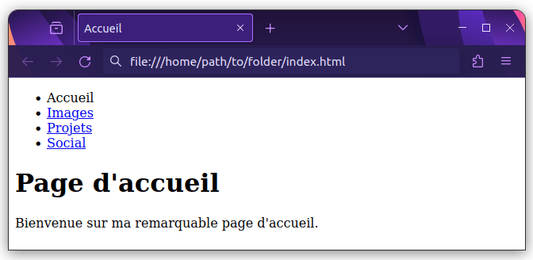

{{LearnSidebar}}{{PreviousMenuNext("Learn/HTML/Introduction_to_HTML/HTML_text_fundamentals", "Learn/HTML/Introduction_to_HTML/Advanced_text_formatting", "Learn/HTML/Introduction_to_HTML")}}

Les hyperliens sont vraiment importants, ils sont ce qui fait du Web _une toile_. Cet article montre la syntaxe requise pour construire un lien et discute des bonnes pratiques associées.

<table class="standard-table">
  <tbody>
    <tr>
      <th scope="row">Prérequis&nbsp;:</th>
      <td>
        Connaissance générale des bases de HTML (voir <a href="/fr/docs/Learn/HTML/Introduction_to_HTML/Getting_started">Commencer avec le HTML</a>), savoir mettre en forme le texte HTML (voir <a href="/fr/docs/Learn/HTML/Introduction_to_HTML/HTML_text_fundamentals">Fondamentaux du texte HTML</a>.).
      </td>
    </tr>
    <tr>
      <th scope="row">Objectifs&nbsp;:</th>
      <td>
        Apprendre à implémenter un hyperlien efficacement, et à relier plusieurs fichiers ensemble.
      </td>
    </tr>
  </tbody>
</table>

## Qu'est-ce un hyperlien&nbsp;?

Les hyperliens sont l'une des plus passionnantes innovations que le Web a à offrir. De fait, ils ont été une fonctionnalité du Web depuis le tout début, mais ils sont ce qui fait du Web _une toile_. Les hyperliens permettent de relier des documents à d'autres documents ou ressources, de renvoyer à des parties spécifiques de documents ou de rendre des applications disponibles à une adresse web. À peu près tout contenu web peut être converti en lien, de sorte que cliqué (ou activé autrement), il dirigera le navigateur vers une autre adresse web ([URL](/fr/docs/Glossary/URL)).

> [!NOTE]
> Une URL peut pointer vers des fichiers HTML, des fichiers textes, des images, des documents texte, des fichiers vidéo ou audio et tout ce qui peut exister sur le Web. Si le navigateur web ne sait pas comment afficher ou gérer un fichier, il vous demande si vous voulez ouvrir le fichier (dans ce cas, la responsabilité de l'ouverture et de la gestion du fichier incombe à l'application native adéquate sur l'appareil) ou bien télécharger le fichier (auquel cas, vous pouvez essayer de vous en occuper plus tard).

La page d'accueil de la BBC, par exemple, contient un nombre important de liens pour pointer, non seulement vers de multiples articles d'actualité, mais encore vers d'autres zones du site (fonctionnalité de navigation), des pages d'inscription/de connexion (outils utilisateur·ice) et plus encore.


## Anatomie d'un lien

Un lien élémentaire se crée en intégrant le texte ou tout autre contenu que vous voulez transformer en lien dans un élément [`<a>`](/fr/docs/Web/HTML/Element/a) et en lui affectant un attribut [`href`](/fr/docs/Web/HTML/Element/a#href) (qui sera la **référence hypertexte**) contenant l'adresse web vers laquelle vous voulez que le lien pointe.

### Exemple simple

```html
<p>
  Je suis en train de créer un lien vers
  <a href="https://www.mozilla.org/fr/">la page d'accueil Mozilla</a>.
</p>
```

Qui donne le résultat suivant&nbsp;:

{{EmbedLiveSample("","100%",100)}}

### Liens avec les éléments de bloc

Comme indiqué précédemment, presque tout contenu peut être transformé en lien, même les [éléments de bloc](/fr/docs/Glossary/Block/CSS). Si vous voulez qu'un titre devienne un lien, enveloppez-le dans un élément d'ancrage (`<a>`), comme le montre l'extrait de code suivant&nbsp;:

```html
<a href="https://developer.mozilla.org/fr/">
  <h1>MDN Web Docs</h1>
</a>
<p>
  Documente les technologies web, y compris CSS, HTML et JavaScript, depuis
  2005.
</p>
```

Le titre devient ainsi un lien&nbsp;:

{{EmbedLiveSample('', '100%', 120)}}

### Liens avec les images

Si vous voulez transformer une image en lien, utilisez l'élément [`<a>`](/fr/docs/Web/HTML/Element/a) pour envelopper le fichier image référencé par l'élément [``](/fr/docs/Web/HTML/Element/img). L'exemple ci-dessous utilise un chemin relatif pour référencer un fichier image SVG stocké localement.

```css hidden
img {
  height: 100px;
  width: 150px;
  border: 1px solid gray;
}
```

```html
<a href="https://developer.mozilla.org/fr/">
  
</a>
```

Le logo du MDN devient donc un lien&nbsp;:

{{EmbedLiveSample('', '100%', 150)}}

> [!NOTE]
> Vous en saurez plus sur l'utilisation des images sur le Web dans [un prochain article](/fr/docs/Learn/HTML/Multimedia_and_embedding/Images_in_HTML).

### Ajouter des informations avec l'attribut `title`

`title` est l'autre attribut qu'on peut ajouter à un lien. Le titre est destiné à contenir des informations utiles supplémentaires à propos du lien, comme le type d'informations contenues dans la page ou ce qu'il faut savoir. Par exemple&nbsp;:

```html-nolint
<p>
  Je suis en train de créer un lien à
  <a
    href="https://www.mozilla.org/fr/"
    title="Le meilleur endroit pour trouver plus d'informations sur la mission de Mozilla et la manière de contribuer"
    >la page d'accueil Mozilla</a
  >.
</p>
```

Nous obtenons le résultat suivant et le survol du lien affiche le titre sous forme d'infobulle&nbsp;:

{{EmbedLiveSample("", "100%", 150)}}

> [!NOTE]
> Le `title` d'un lien n'est révélé que lors du survol de la souris, ce qui signifie que les personnes utilisant les commandes clavier pour naviguer dans les pages web auront des difficultés à accéder aux informations de `title`. Si une information de `title` est vraiment importante pour l'utilisation d'une page, alors vous devez la présenter de manière plus accessible, par exemple, en la mettant dans le texte normal.

### Apprentissage actif&nbsp;: créez votre propre lien

Créez un document HTML avec un éditeur de code local (vous pouvez télécharger et repartir de [notre fichier modèle `index.html`](https://github.com/mdn/learning-area/blob/main/html/introduction-to-html/getting-started/index.html) pour avoir un point de départ).

1. Dans le corps de l'HTML, essayez d'ajouter un ou plusieurs paragraphes ou d'autres éléments que vous connaissez déjà.
2. Changez certaines parties du contenu en liens.
3. Insérez les attributs `title`.

## Une brève présentation des URL et des chemins

Pour comprendre les cibles des liens, il faut avoir compris ce que sont les URL et les chemins. Cette section détaille ces deux notions.

Une URL, ou <i lang="en">**U**niform **R**esource **L**ocator</i> en anglais (qu'on peut traduire en «&nbsp;localisateur uniforme de ressource&nbsp;»), est simplement une chaîne de caractères qui définit où se situe quelque chose sur le Web. Par exemple, la page d'accueil française de Mozilla est située à l'adresse `https://www.mozilla.org/fr/`.

Les URL utilisent des chemins pour trouver des fichiers. Les chemins indiquent où, dans le système de fichiers, se trouve celui qui vous intéresse. Regardons un exemple simple de structure de répertoires (voir le dossier [`creating-hyperlinks`](https://github.com/mdn/learning-area/tree/main/html/introduction-to-html/creating-hyperlinks)).


La **racine** de cette structure de répertoires s'appelle `creating-hyperlinks`. Quand vous travaillez localement sur un site web, vous avez un dossier contenant l'intégralité du site. Dans la racine, nous avons un fichier `index.html` et un `contacts.html`. Sur un site réel, `index.html` serait notre page d'accueil ou portail (page web servant de point d'entrée à un site web ou à une section particulière d'un site web).

Il y a aussi deux répertoires dans la racine — `pdfs` et `projects`. Chacun d'eux comporte un seul fichier — respectivement un PDF (`project-brief.pdf`) et un fichier `index.html`. Notez que vous pouvez heureusement avoir deux fichiers `index.html` dans un projet, pour autant qu'ils se trouvent dans deux emplacements différents dans le système de fichiers. De nombreux sites web le font. Le second `index.html` peut être le portail des informations relatives au projet.

- **Dans un même dossier**&nbsp;: si vous voulez inclure un hyperlien dans `index.html` (celui de plus haut niveau) pointant vers `contacts.html`, il suffit d'indiquer uniquement le nom du fichier auquel vous voulez le lier, car il est dans le même répertoire que le fichier actuel. Ainsi, l'URL à utiliser est `contacts.html`&nbsp;:

  ```html
  <p>
    Voulez‑vous rencontrer un membre du personnel en particulier ? Voyez comment
    faire sur notre page <a href="contacts.html">Contacts</a>.
  </p>
  ```

- **Descendre dans les sous-répertoires**&nbsp;: si vous désirez inclure un hyperlien dans `index.html` (`celui` de plus haut niveau) pointant vers `projects/index.html`, vous avez besoin de descendre dans le dossier `projects` avant d'indiquer le fichier auquel vous voulez vous lier. Cela se fait en indiquant le nom du dossier, suivi d'une barre oblique normale, puis le nom du fichier. Donc l'URL à utiliser sera `projects/index.html`&nbsp;:

  ```html
  <p>
    Visitez la <a href="projects/index.html">page d'accueil</a> de mon projet.
  </p>
  ```

- **Monter dans les dossiers parents**&nbsp;: si vous voulez inclure un hyperlien dans `projects/index.html` qui pointe vers `pdfs/projects-brief.pdf`, vous aurez besoin de monter dans le répertoire au niveau au‑dessus, puis de descendre dans le dossier `pdfs`. «&nbsp;Monter dans le répertoire au niveau au‑dessus&nbsp;» est indiqué avec deux points — `..`, de sorte que l'URL à utiliser sera `../pdfs/project‑brief.pdf`&nbsp;:

  ```html
  <p>
    Voici un lien vers mon
    <a href="../pdfs/project-brief.pdf">sommaire de projet</a>.
  </p>
  ```

> [!NOTE]
> Vous pouvez combiner plusieurs instances de ces fonctionnalités dans des URL complexes si nécessaire, par ex. `../../../chemin/complexe/vers/mon/fichier.html`.

### Fragments de documents

Il est possible de faire un lien vers une partie donnée d'un document HTML, qu'on appelle un **fragment de document**, plutôt que vers le haut du document. Pour ce faire, vous devrez d'abord assigner un attribut [`id`](/fr/docs/Web/HTML/Global_attributes#id) à l'élément vers lequel vous voulez pointer. Il est généralement logique d'établir un lien vers une rubrique précise, ainsi cela ressemble à quelque chose comme&nbsp;:

```html
<h2 id="Contact">Adresse de contact</h2>
```

Puis, pour faire un lien vers cet `id` précisément, il convient de l'indiquer à la fin de l'URL, précédé d'un croisillon (`#`)&nbsp;:

```html
<p>
  Vous voulez nous écrire une lettre ? Utilisez notre
  <a href="contacts.html#Contact">adresse de contact</a>.
</p>
```

Vous pouvez même utiliser une référence au fragment de document seul pour faire un lien vers _une autre partie du même document_&nbsp;:

```html
<p>Vous trouverez <a href="#Contact">notre adresse</a> au bas de cette page.</p>
```

### URL absolue et URL relative

Sur le Web, vous pourrez voir deux expressions&nbsp;: **URL absolue** et **URL relative**&nbsp;:

Une **URL absolue** pointe sur un emplacement défini de manière absolue sur le Web, y compris en précisant [le protocole](/fr/docs/Glossary/Protocol) et [le nom de domaine](/fr/docs/Glossary/Domain_name). Ainsi, si une page `index.html` est téléversée dans le dossier nommé `projects` à la racine du serveur web, et que le domaine du site est `https://www.example.com`, la page sera accessible à l'adresse `https://www.example.com/projects/index.html` (ou même seulement `https://www.example.com/projects/`, du fait que la plupart des serveurs web cherchent pour le chargement une page d'accueil comme `index.htm`, si ce n'est pas précisé dans l'URL).

Une URL absolue pointera toujours vers le même emplacement, quel que soit l'endroit où elle est utilisée.

Une **URL relative** pointe vers un emplacement qui est _relatif_ au fichier à partir duquel vous établissez le lien, tout comme ce que nous avons vu précédemment. Donc, si nous voulons créer un lien depuis notre fichier d'exemple en `https://www.example.com/projects/index.html` vers un fichier PDF dans le même dossier, l'URL sera seulement le nom du fichier — c'est-à-dire, `project-brief.pdf` — pas besoin d'information supplémentaire. Si le PDF est disponible dans un sous-dossier de `projects` appelé `pdfs`, le lien relatif serait `pdfs/project-brief.pdf` (l'URL absolue équivalente serait `https://www.example.com/projects/pdfs/project-brief.pdf`).

Une URL relative pointera vers des emplacements différents en fonction de l'endroit où se situe le fichier qui est utilisé&nbsp;; par exemple, si nous déplacions notre `index.html` du dossier `projects` vers la **racine** du site web (au niveau le plus élevé, dans aucun dossier), le lien de l'URL relative `pdfs/project-brief.pdf` qui s'y trouve pointerait alors vers un fichier situé en `https://www.example.com/pdfs/project-brief.pdf`, et non vers un fichier situé en `https://www.example.com/projects/pdfs/project-brief.pdf`.

Bien sûr, l'emplacement du fichier `project-brief.pdf` et du dossier `pdfs` ne changera pas subitement du fait que vous avez déplacé le fichier `index.html`&nbsp;: cela aura pour effet que votre lien pointera vers un mauvais emplacement, de sorte que cela ne fonctionnera pas si on clique dessus. Vous devez être prudent&nbsp;!

## Bonnes pratiques pour les liens

Il y a quelques bonnes pratiques à suivre pour l'écriture de liens. Voyons en quoi elles consistent.

### Utilisez une formulation claire des liens

Il est facile de mettre des liens sur une page. Mais ce n'est pas suffisant. Nous devons rendre nos liens _accessibles_ à toutes et tous, indépendamment de leur contexte d'installation et des outils utilisés. Par exemple&nbsp;:

- Les utilisateur·ice·s de lecteurs d'écran passent d'un lien à un autre sur une page, et les lisent hors contexte.
- Les moteurs de recherche utilisent le texte des liens pour indexer les fichiers cibles, c'est donc une bonne idée que d'inclure des mots-clés dans le texte du lien pour décrire effectivement à quoi il est lié.
- Les utilisateur·ice·s visuels survolent la page plutôt que d'en lire chaque mot, et leurs yeux seront forcément attirés par les particularités qui se détachent de la page, comme les liens. Ils trouveront utile le texte descriptif du lien.

Regardons un premier exemple correct&nbsp;:

```html example-good
<p>
  <a href="https://www.mozilla.org/fr/firefox/new/">Télécharger Firefox</a>
</p>
```

Puis un deuxième exemple incorrect&nbsp;:

```html example-bad
<p>
  <a href="https://www.mozilla.org/firefox/">Cliquer ici</a> pour télécharger
  Firefox
</p>
```

Autres conseils&nbsp;:

- Ne répétez pas l'URL dans le texte du lien. Les URL ne sont pas particulièrement lisibles par une personne, et c'est encore pire à entendre quand un lecteur d'écran les épèle.
- Ne dites pas «&nbsp;lien&nbsp;» ou «&nbsp;liens vers…&nbsp;» dans le texte du lien, ce n'est que du rabâchage. Les lecteurs d'écran indiquent aux gens qu'il y a un lien. Les personnes navigant visuellement verront aussi qu'il y a un lien, du fait que les liens sont généralement de couleur différente et soulignés (de façon générale, cette convention tacite ne devrait pas être trahie, car les personnes y sont habituées).
- Faites que vos libellés de lien soient aussi courts que possible&nbsp;: les liens longs agacent particulièrement les utilisateur·ice·s de lecteurs d'écran, qui doivent en écouter la lecture entière.
- Minimiser les cas où plusieurs copies d'un même texte pointent vers des emplacements différents. Afficher une liste de liens hors contexte peut poser problème aux utilisateur·ice·s de lecteurs d'écran&nbsp;: ainsi plusieurs liens tous étiquetés «&nbsp;cliquez ici&nbsp;», «&nbsp;cliquez ici&nbsp;», «&nbsp;cliquez ici&nbsp;» seront source de confusion.

### Indiquer clairement les liens vers des ressources qui ne sont pas HTML

Lorsque vous créez un lien vers une ressource qui sera téléchargée (comme un document PDF ou Word), diffusée (comme une vidéo ou un fichier audio) ou qui a un autre effet potentiellement inattendu (ouverture d'une fenêtre contextuelle), vous devez ajouter une formulation claire pour éviter toute confusion.

Si vous êtes sur une connexion à faible bande passante, cliquer sur un lien et initier un téléchargement de plusieurs mégaoctets de façon inattendue pourrait poser problème, autant indiquer ces informations dans le texte du lien.

Voici quelques exemples suggérant les genres de texte pouvant être employé&nbsp;:

```html
<p>
  <a href="https://www.exemple.com/rapport-volumineux.pdf">
    Télécharger le rapport des ventes (PDF, 10Mo)
  </a>
</p>

<p>
  <a href="https://www.exemple.com/flux-video/" target="_blank">
    Regarder la vidéo (le flux s'ouvre dans un nouvel onglet, qualité HD)
  </a>
</p>
```

### Utilisez l'attribut `download` pour faire un lien vers un téléchargement

Quand vous faites un lien avec une ressource qui doit être téléchargée plutôt qu'ouverte dans le navigateur, vous pouvez utiliser l'attribut `download` pour fournir un nom d'enregistrement par défaut. Voici un exemple avec un lien de téléchargement vers la version Windows la plus récente de Firefox&nbsp;:

```html
<a
  href="https://download.mozilla.org/?product=firefox-latest-ssl&os=win64&lang=fr-FR"
  download="firefox-latest-64bit-installer.exe">
  Télécharger la version de Firefox pour Windows la plus récente
  (64-bit)(français, France)
</a>
```

## Apprentissage actif&nbsp;: création d'un menu de navigation

Pour cet exercice, reliez ensemble quelques pages par un menu de navigation pour créer un web site sur plusieurs pages. C'est une manière courante de créer un site web, la même structure de page est utilisée sur chaque page, y compris le même menu de navigation, de sorte que quand les liens sont cliqués, cela vous donne l'impression de rester au même endroit, tandis qu'un contenu différent est présenté.

Vous aurez besoin de faire des copies locales des quatre pages suivantes, toutes dans le même dossier. Voir [le répertoire `navigation-menu-start`](https://github.com/mdn/learning-area/tree/main/html/introduction-to-html/navigation-menu-start) pour une liste complète des fichiers.

- [`index.html`](https://github.com/mdn/learning-area/blob/main/html/introduction-to-html/navigation-menu-start/index.html)
- [`projects.html`](https://github.com/mdn/learning-area/blob/main/html/introduction-to-html/navigation-menu-start/projects.html)
- [`pictures.html`](https://github.com/mdn/learning-area/blob/main/html/introduction-to-html/navigation-menu-start/pictures.html)
- [`social.html`](https://github.com/mdn/learning-area/blob/main/html/introduction-to-html/navigation-menu-start/social.html)

Pour cet exercice&nbsp;:

1. Ajoutez une liste non-ordonnée à l'endroit indiqué sur une page, qui contiendra les noms des pages à relier. Un menu de navigation n'est habituellement qu'une liste de liens, la sémantique HTML utilisée est correcte ici.
2. Changez chaque nom de page en un lien vers cette page.
3. Copiez le menu de navigation dans chaque page.
4. Sur chaque page, enlevez seulement le lien vers cette page&nbsp;: il s'agirait d'une source de confusion et sans objet pour une page que d'inclure un lien vers elle-même, et l'absence d'un lien constitue un bon rappel visuel pour se souvenir sur quelle page vous êtes actuellement.

L'exemple terminé devrait finir par ressembler à quelque chose comme ce qui suit&nbsp;:



> [!NOTE]
> Si vous coincez, ou n'êtes pas sûr·e d'avoir bien compris, vous pouvez vérifier le dossier [`navigation-menu-marked-up`](https://github.com/mdn/learning-area/tree/main/html/introduction-to-html/navigation-menu-marked-up) pour voir la réponse correcte.

## Liens de courriel

Il est possible de créer des liens ou des boutons qui, lorsqu'ils sont cliqués, ouvrent un nouveau courriel sortant plutôt que de faire un lien vers une ressource ou une page. Pour cela, on utilise un élément [`<a>`](/fr/docs/Web/HTML/Element/a) dont l'attribut `href` contient une URL avec le schéma `mailto:`.

Sous sa forme la plus basique et la plus communément utilisée, un lien `mailto:` indique simplement l'adresse du destinataire voulu.

En fait, l'adresse de courriel est même optionnelle. Si vous l'omettez (c'est-à-dire, si votre [`href`](/fr/docs/Web/HTML/Element/a#href) est simplement `mailto:`), une nouvelle fenêtre de courriel sortant sera ouverte par le client de courriel sur l'appareil, sans adresse de destination renseignée. Cette méthode est souvent utile pour les liens «&nbsp;Partager&nbsp;» sur lesquels on peut cliquer pour envoyer un e-mail à l'adresse de son choix.

### Exemple simple

```html
<a href="mailto:nullepart@mozilla.org">Envoyer un courriel à nullepart</a>
```

donnera le résultat suivant&nbsp;:

{{EmbedLiveSample("")}}

### Fournir d'autres informations

En plus de l'adresse électronique, vous pouvez fournir d'autres informations. En fait, tous les champs d'en-tête standards peuvent être ajoutés à l'URL `mailto` fournie. Les champs les plus couramment utilisés sont `subject`, `cc` et `body` (qui n'est pas à proprement parler un champ d'en-tête, mais qui vous permet d'indiquer un court message de contenu pour le nouveau courriel). La valeur de chaque champ est encodée comme un paramètre de requête.

Voici un exemple incluant `cc` (<i lang="en">carbon copy</i>, pour les destinataires en copie), `bcc` (<i lang="en">blind cc</i>, pour les destinataires en copie cachée), `subject` (sujet) et `body`&nbsp;:

```html
<a
  href="mailto:nullepart@mozilla.org?cc=nom2@rapidtables.com&bcc=nom3@rapidtables.com&subject=L%27objet%20du%20courriel&body=Le%20corps%20du%20courriel">
  Envoyer un e-mail avec copie, copie cachée, sujet et corps de message
</a>
```

> [!NOTE]
> La valeur de chaque champ doit être codée à la façon d'une URL, c'est-à-dire que les caractères non-imprimables (les caractères invisibles tels que les tabulations, les retours chariot et les sauts de page) et les espaces doivent être échappés avec un [encodage-pourcent](https://fr.wikipedia.org/wiki/Encodage-pourcent). Notez également l'utilisation du point d'interrogation (`?`) pour séparer l'URL principale des valeurs de champ et de l'esperluette (&) pour séparer chaque champ dans l'URL `mailto:`. C'est la notation standard des requêtes URL. Voir [la documentation de la méthode HTTP `GET`](/fr/docs/Learn/Forms/Sending_and_retrieving_form_data#la_méthode_get) pour comprendre pourquoi la notation de requête URL est habituellement utilisée.

Voici quelques autres exemples d'URL `mailto`&nbsp;:

- `mailto:`
- `mailto:nullepart@mozilla.org`
- `mailto:nullepart@mozilla.org,personne@mozilla.org`
- `mailto:nullepart@mozilla.org?cc=personne@mozilla.org`
- `mailto:nullepart@mozilla.org?cc=personne@mozilla.org\&subject=Ceci%20est%20l%27objet`

## Testez vos compétences&nbsp;!

Vous voici à la fin de cet article, mais pouvez-vous vous souvenir des informations les plus importantes&nbsp;? Vous pouvez trouver d'autres tests pour vérifier que vous avez bien retenu ces informations avant de continuer sur [Testez vos compétences&nbsp;: Liens](/fr/docs/Learn/HTML/Introduction_to_HTML/Test_your_skills:_Links).

## Résumé

C'est tout pour les liens, du moins pour l'instant&nbsp;! Nous reverrons aux liens plus loin dans le cours pour les mettre en forme. Pour la prochaine étape de ce cours, nous reviendrons sur la sémantique HTML, et verrons quelques fonctionnalités plus avancées ou inhabituelles pour [le formatage avancé de texte](/fr/docs/Learn/HTML/Introduction_to_HTML/Advanced_text_formatting).

{{PreviousMenuNext("Learn/HTML/Introduction_to_HTML/HTML_text_fundamentals", "Learn/HTML/Introduction_to_HTML/Advanced_text_formatting", "Learn/HTML/Introduction_to_HTML")}}
