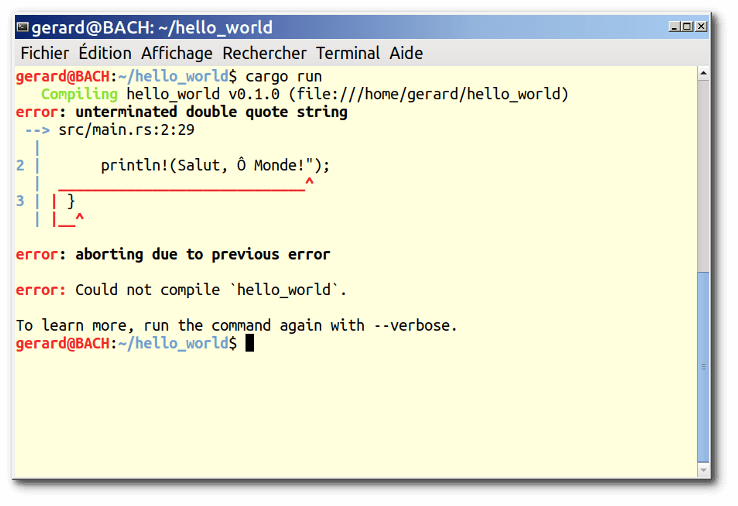
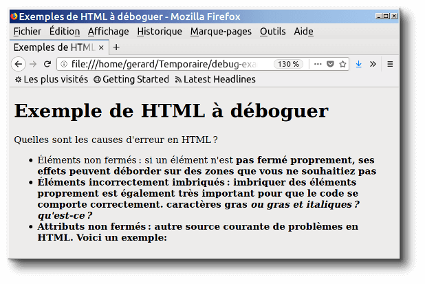
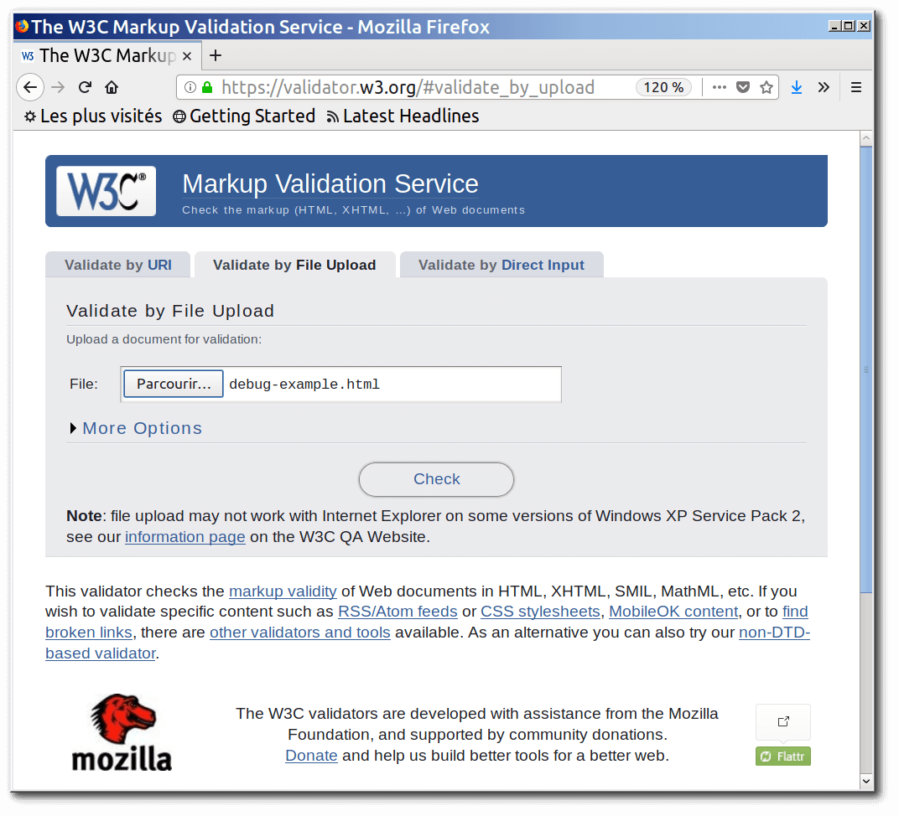
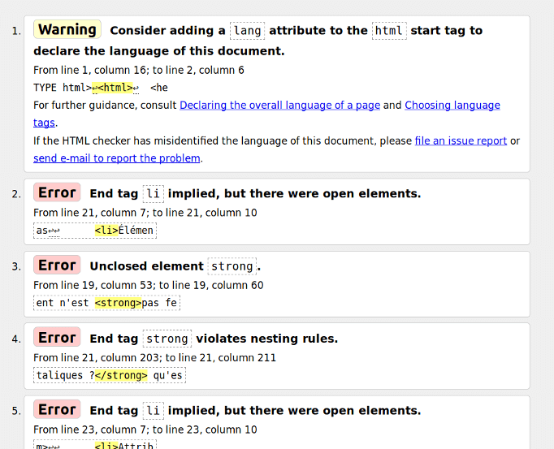

{{LearnSidebar}}{{PreviousMenuNext("Apprendre/HTML/Introduction_à_HTML/Document_and_website_structure", "Apprendre/HTML/Introduction_à_HTML/Marking_up_a_letter", "Apprendre/HTML/Introduction_à_HTML")}}

Écrire du code HTML, c'est bien, mais si quelque chose se passe mal, que faire pour trouver où est l'erreur dans le code ? Cet article vous indique divers outils pour vous aider à trouver et corriger les erreurs en HTML.

<table class="standard-table">
  <tbody>
    <tr>
      <th scope="row">Prérequis&nbsp;:</th>
      <td>
        Être familiarisé avec les bases du HTML, traitées aux pages
        <a
          href="/fr/docs/Apprendre/HTML/Introduction_%C3%A0_HTML/Getting_started"
          >Commencer avec le HTML,</a
        >
        <a
          href="/fr/docs/Learn/HTML/Introduction_to_HTML/HTML_text_fundamentals"
          >Fondamentaux du texte HTML </a
        >et
        <a
          href="/fr/docs/Apprendre/HTML/Introduction_%C3%A0_HTML/Creating_hyperlinks"
          >Création d'hyperliens</a
        >.
      </td>
    </tr>
    <tr>
      <th scope="row">Objectif&nbsp;:</th>
      <td>
        Apprendre les bases de l'utilisation des outils de débogage pour
        détecter des problèmes en HTML.
      </td>
    </tr>
  </tbody>
</table>

## Déboguer n'est pas un problème

Quand on écrit du code , tout va généralement bien, jusqu'au moment redouté où une erreur se produit — vous avez fait quelque chose d'incorrect, donc votre code ne fonctionne pas — soit pas du tout, soit pas tout à fait comme vous l'aviez souhaité. Par exemple, ce qui suit montre une erreur signalée lors d'une tentative de {{glossary("compile","compilation")}} d'un programme simple écrit en Rust.

Ici, le message d'erreur est relativement facile à comprendre — «&nbsp;unterminated double quote string&nbsp;» : il manque un guillemet double ouvrant ou fermant pour envelopper la chaîne. Si vous regardez le listage, vous verrez `println!(Salut, Ô Monde!");` il manque un guillemet double. Cependant, des messages d'erreur peuvent devenir plus complexes et plus abscons au fur et à mesure que le programme grossit et, même dans des cas simples devenir intimidants à quelqu'un qui ne connaît rien du Rust.

Déboguer ne doit toutefois pas devenir un problème — la clé pour être à l'aise lors de l'écriture et du débogage d'un programme réside dans une bonne connaissance à la fois du langage et des outils.

## HTML et le débogage

HTML n'est pas aussi compliqué à comprendre que le Rust. HTML n'est pas compilé sous une forme différente avant que le navigateur n'ait fait son analyse et affiche le résultat (il est _interprété_, pas _compilé_). Et la syntaxe des {{glossary("element","éléments")}} HTML est sans doute beaucoup plus facile à comprendre qu'un «&nbsp;vrai langage de programmation&nbsp;» tel le Rust, le {{glossary("JavaScript")}} ou le {{glossary("Python")}}. La façon dont les navigateurs analysent le HTML est beaucoup plus **permissive** que celle des langages de programmation, ce qui est à la fois une bonne et une mauvaise chose.

### Code permissif

Que voulons‑nous dire par permissif&nbsp;? Et bien, quand vous faites une erreur dans du code, vous rencontrerez deux types principaux d'erreurs&nbsp;:

- **Erreurs de syntaxe**&nbsp;: ce sont des «&nbsp;fautes d'orthographe&nbsp;» dans le code qui font que le programme ne fonctionne vraiment pas, comme l'erreur du Rust ci‑dessus. Elles sont généralement faciles à corriger pour autant que vous soyez à l'aise avec la syntaxe du langage et que vous sachiez ce que signifie le message d'erreur.
- **Erreurs de logique**&nbsp;: ce sont des erreurs dans lesquelles la syntaxe est réellement correcte, mais pour lesquelles le code ne correspond pas à vos souhaits, ce qui veut dire que le programme ne s'exécute pas correctement. Elles sont généralement plus difficiles à corriger que les erreurs de syntaxe, car il n'y a pas de message d'erreur pour vous guider à la source de l'erreur.

HTML ne craint pas les erreurs de syntaxe, car les navigateurs l'analysent de manière permissive&nbsp;: la page s'affiche toujours même s'il y a des erreurs de syntaxe. Les navigateurs intègrent des règles indiquant comment interpréter un balisage incorrectement écrit, de sorte que vous obtiendrez toujours quelque chose à l'exécution, même si ce n'est pas ce que vous attendiez. Mais cela reste, bien sûr, toujours un problème !

> **Note :** HTML est analysé de façon permissive parce que, lorsque le Web a été créé pour la première fois, on a décidé qu'il était plus important de permettre aux gens de publier leur contenu que de s'assurer d'une syntaxe absolument correcte. Le web ne serait probablement pas aussi populaire qu'il l'est aujourd'hui, s'il avait été plus strict dans ses débuts.

### Apprentissage actif&nbsp;: étude avec un code permissif

Voici le moment venu d'étudier le caractère permissif du code HTML.

1.  Primo, télécharchez notre démo [debug-example](https://github.com/mdn/learning-area/blob/master/html/introduction-to-html/debugging-html/debug-example.html) et enregistrez‑le localement. Cette démo est délibérement écrite avec des erreurs pour que nous puissions les examiner (le balisage HTML est dit **malformé**, par opposition à **bien-formé**).
2.  Ensuite, ouvrez‑le dans un navigateur. Vous verrez quelque chose comme ceci&nbsp;:
3.  Constatons que ce n'est pas terrible&nbsp;; examinons le code source pour voir ce que nous pouvons en faire (seul le contenu de l'élément `body` est affiché)&nbsp;:

            <h1>Exemple de HTML à déboguer</h1>

            <p>Quelles sont les causes d'erreur en HTML ?

            <ul>
              <li>Éléments non fermés : si un élément n'est <strong>pas
                  fermé proprement, ses effets peuvent déborder sur des
                  zones que vous ne souhaitiez pas.

              <li>Éléments incorrectement imbriqués : imbriquer des
                  éléments proprement est également très important pour
                  que le code se comporte correctement.
                  <strong>caractères gras <em>ou gras et italiques ?</strong>
                  qu'est‑ce ?</em>

              <li>Attributs non fermés : autre source courante de problèmes
                  en HTML. Voici un exemple: <a href="https://www.mozilla.org/>
                  lien à la page d'accueil de Mozilla</a>
            </ul>

4.  Revoyons les problèmes&nbsp;:

    - Les élements {{htmlelement("p")}} (paragraphe) et {{htmlelement("li")}} (élément de liste) n'ont pas de balise de fermeture. En voyant l'image ci‑dessus, cela ne semble pas avoir trop sévèrement affecté le rendu, car on voit bien où un élément se termine et où le suivant commence.
    - Le premier élément {{htmlelement("strong")}} n'a pas de balise de fermeture. C'est un peu plus problématique, car il n'est pas possible de dire où l'élément est supposé se terminer. En fait, tout le reste du texte est en gras.
    - Cette partie est mal imbriquée&nbsp;: `<strong>caractères gras <em>ou gras et italiques ?</strong> qu'est ce ?</em>`. Pas facile de dire comment il faut interpréter cela en raison du problème précédent.
    - La valeur de l'attribut {{htmlattrxref("href","a")}} n'a pas de guillemet double fermant. C'est ce qui semble avoir posé le plus gros problème — le lien n'a pas été mentionné du tout.

5.  Revoyons maintenant comment le navigateur a vu le balisage, par comparaison au balisage du code source. Pour ce faire, utilisons les outils de développement du navigateur. Si vous n'êtes pas un familier de l'utilisation des outils de développement du navigateur, prenez quelques minutes pour revoir [Découverte des outils de développement du navigateur](/fr/docs/Apprendre/D%C3%A9couvrir_outils_d%C3%A9veloppement_navigateurs).
6.  Dans l'«&nbsp;Inspecteur&nbsp;», vous pouvez voir ce à quoi le balisage du rendu ressemble&nbsp;: 
7.  Avec l'«&nbsp;Inspecteur&nbsp;», explorons le code en détail pour voir comment le navigateur a essayé de corriger nos erreurs HTML (nous avons fait la revue dans Firefox&nbsp;; d'autres navigateurs modernes _devraient_ donner le même résultat)&nbsp;:

    - Les éléments `p` et `li` ont été pourvus de balises fermantes.
    - L'endroit où le premier élément `<strong>` doit être fermé n'est pas clair, donc le navigateur a enveloppé séparément chaque bloc de texte avec ses propres balises `strong`, jusqu'à la fin du document&nbsp;!
    - L'imbrication incorrecte a été corrigée ainsi&nbsp;:

      ```html
      <strong>caractères gras
        <em>ou caractères gras et italiques&nbsp;?</em>
      </strong>
      <em> qu'est ce&nbsp;?</em>
      ```

    - Le lien avec les guillemets manquants a été illico détruit. Le dernier élément `li` ressemble à ceci&nbsp;:

      ```html
      <li>
        <strong>Attributs non fermés : autre source courante de problèmes
      en HTML. Voici un exemple&nbsp;:</strong>
      </li>
      ```

### Validation d'un HTML

Comme vous pouvez le voir dans l'exemple ci-dessus, il faut s'assurer que votre HTML est bien formé ! Mais comment ? Dans un petit fichier comme celui qui précède, il est facile de chercher dans les lignes et de trouver les erreurs, mais qu'en est-il d'un document HTML énorme et complexe ?

La meilleure stratégie consiste à faire passer votre page HTML par le [Markup Validation Service (](https://validator.w3.org/)Service de validation de balisage) — créé et maintenu par le W3C, l'organisation s'occupant des normes définissant le HTML, les CSS et autres technologies web. Cet outil Web accepte un document HTML en entrée, le parcourt et fait le rapport de ce qui ne va pas dans le HTML soumis.



Pour définir le HTML à valider, vous pouvez donner une adresse web (_Validate by URI_) , téléverser un fichier HTML (_Validate by File Upload_) ou entrer directement du code HTML (_Validate by Direct Input_).

### Apprentissage actif : validation d'un document HTML

Essayons cet outil avec notre [document exemple](https://github.com/mdn/learning-area/blob/master/html/introduction-to-html/debugging-html/debug-example.html).

1.  D'abord, chargez le [Markup Validation Service](https://validator.w3.org/) dans un des onglets du navigateur, si ce n'est déjà fait.
2.  Basculez sur l'onglet [Validate by Direct Input](https://validator.w3.org/#validate_by_input).
3.  Copiez la totalité du code du document (pas uniquement l'élément `body`) et collez-le dans la grande zone de texte affichée dans Markup Validation Service.
4.  Pressez le bouton _Check_.

Cela vous donnera une liste d'erreurs et autres informations.



#### Interprétation des messages d'erreur

Les messages d'erreur sont généralement utiles, mais parfois non ; avec un peu de pratique, vous trouverez comment les interpréter pour corriger votre code. Passons en revue les messages d'erreur et voyons leur signification. Chaque message est accompagné d'un numéro de ligne et de colonne pour faciliter la localisation de l'erreur.

- «&nbsp;End tag `li` implied, but there were open elements&nbsp;» (2 instances)&nbsp;: ces messages indiquent qu'un élément ouvert devrait être fermé. La balise de fermeture est implicite, mais pas réellement mise. L'information ligne/colonne pointe sur la première ligne après laquelle la balise de fermeture devrait réellement se situer, mais c'est un bon indice pour voir ce qui ne va pas.
- «&nbsp;Unclosed element `strong`&nbsp;»&nbsp;: C'est facile à comprendre — un élément {{htmlelement("strong")}} n'est pas fermé ; l'information ligne/colonne pointe directement dessus.
- «&nbsp;End tag `strong` violates nesting rules&nbsp;»&nbsp;: signale des éléments incorrectement imbriqués et l'information ligne/colonne signale là où cela se trouve.
- «&nbsp;End of file reached when inside an attribute value. Ignoring tag&nbsp;»&nbsp;: c'est peu clair&nbsp;; la remarque se rapporte au fait qu'il y a une valeur d'attribut improprement formée quelque part, peut-être près de la fin du fichier car la fin du fichier apparaît dans la valeur de l'attribut. Le fait que le navigateur ne rende pas le lien est un bon indice pour dire que cet élément est en faute.
- «&nbsp;End of file seen and there were open elements&nbsp;»&nbsp;: c'est un peu ambigu, mais se réfère au fait qu'à la base des éléments ouverts n'ont pas été proprement fermés. Les numéros de ligne pointent sur les dernières lignes du fichier et ce message d'erreur vient avec une ligne de code qui désigne un exemple d'élément ouvert&nbsp;:

      exemple: <a href="https://www.mozilla.org/>lien à la page d'accueil de Mozilla</a> ↩ </ul>↩ </body>↩</html>

  > **Note :** un attribut sans guillemet fermant peut entraîner un élément ouvert car le reste du document est interprété comme le contenu de l'attribut.

- «&nbsp;Unclosed element `ul`&nbsp;»&nbsp;: n'est pas vraiment utile, car l'élément {{htmlelement("ul")}} _est_ correctement fermé. Cette erreur ressort car l'élément {{htmlelement("a")}} n'est pas fermé en raison de l'absence de guillemet fermant.

Si vous ne comprenez pas ce que signifie chaque message d'erreur, ne vous inquiétez pas — une bonne idée consiste à corriger quelques erreurs à la fois. Puis essayez de revalider le HTML pour voir les erreurs restantes. Parfois, la correction d'une erreur en amont permet aussi d'éliminer d'autres messages d'erreur — plusieurs erreurs sont souvent causées par un même problème, avec une sorte d'effet domino.

Vous saurez que toutes vos erreurs sont corrigées quand vous verrez la bannière suivante dans la sortie :


## Résumé

Voilà donc une introduction au débogage HTML, qui devrait vous donner des compétences utiles sur lesquelles compter lorsque vous commencerez à déboguer des CSS, du JavaScript ou d'autres types de code plus tard dans votre carrière. Ceci marque également la fin des articles d'apprentissage du module Introduction au HTML — maintenant vous pouvez faire un auto‑test avec nos évaluations : le lien ci‑dessous vous dirige sur la première.

{{PreviousMenuNext("Apprendre/HTML/Introduction_à_HTML/Document_and_website_structure", "Apprendre/HTML/Introduction_à_HTML/Marking_up_a_letter", "Apprendre/HTML/Introduction_à_HTML")}}

## Dans ce module

- [Commencer avec le HTML](/fr/docs/Learn/HTML/Introduction_to_HTML/Getting_started)
- [Qu'y-a-t-il dans l'en-tête ? Métadonnées en HTML](/fr/docs/Learn/HTML/Introduction_to_HTML/The_head_metadata_in_HTML)
- [Fondamentaux du texte HTML](/fr/docs/Apprendre/HTML/Introduction_%C3%A0_HTML/HTML_text_fundamentals)
- [Creation d'hyperliens](/fr/docs/Learn/HTML/Introduction_to_HTML/Creating_hyperlinks)
- [Formatage avancé du texte](/fr/docs/Learn/HTML/Introduction_to_HTML/Advanced_text_formatting)
- [Structure de Site Web et de document](/fr/docs/Learn/HTML/Introduction_to_HTML/Document_and_website_structure)
- Déboguer de l'HTML
- [Faire une Lettre](/fr/docs/Learn/HTML/Introduction_to_HTML/Marking_up_a_letter)
- [Structurer une page de contenu](/fr/docs/Learn/HTML/Introduction_to_HTML/Structuring_a_page_of_content)
