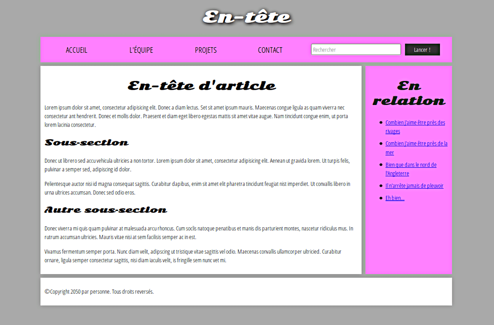
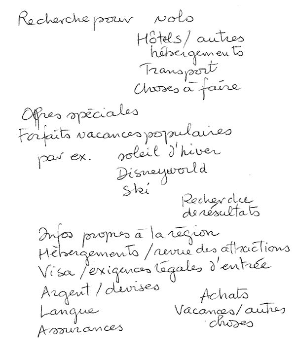
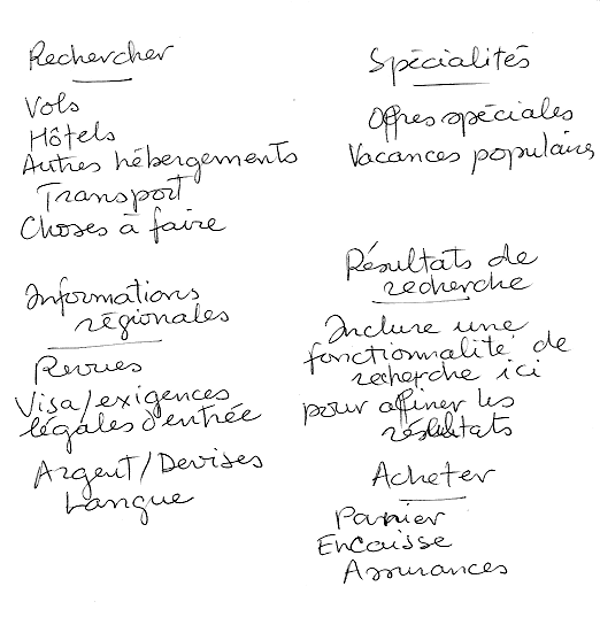
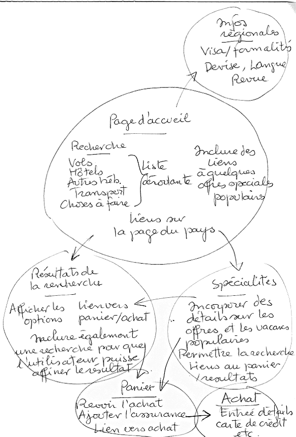

{{LearnSidebar}}
{{PreviousMenuNext("Apprendre/HTML/Introduction_à_HTML/Advanced_text_formatting", "Apprendre/HTML/Introduction_à_HTML/Debugging_HTML","Apprendre/HTML/Introduction_à_HTML")}}

De même que HTML est utilisé pour définir les diverses parties indépendantes d'une page (comme un « paragraphe » ou une « image »), HTML l'est pour définir des zones de votre site web (comme l'« en‑tête », le « menu de navigation », le « contenu principal », etc.). Cet article détaille la structure d'un site simple et l'écriture du HTML correspondant.

<table class="standard-table">
  <tbody>
    <tr>
      <th scope="row">Prérequis&nbsp;:</th>
      <td>
        Être familiarisé avec les bases du HTML, traitées à la page
        <a
          href="/fr/docs/Apprendre/HTML/Introduction_à_HTML/Getting_started"
          >Commencer avec le HTML</a
        >
        et du formatage de texte HTML, décrit dans les
        <a
          href="/fr/docs/Learn/HTML/Introduction_to_HTML/HTML_text_fundamentals"
          >Fondamentaux du texte HTML</a
        >. Comment fonctionnent les liens hyperlinks , comme décrit dans
        <a
          href="/fr/docs/Apprendre/HTML/Introduction_à_HTML/Creating_hyperlinks"
          >Création d'hyperliens</a
        >.
      </td>
    </tr>
    <tr>
      <th scope="row">Objectif&nbsp;:</th>
      <td>
        <p>
          Apprendre comment structurer votre document en utilisant des balises
          sémantiques et comment élaborer la structure d'un site web simple.
        </p>
      </td>
    </tr>
  </tbody>
</table>

## Principales parties d'un document

Les pages web peuvent sembler assez différentes les unes des autres, mais elles ont toutes tendance à partager des composantes standard similaires, sauf si la page affiche une vidéo ou un jeu en plein écran, relève d'une sorte de projet artistique ou... est simplement mal structurée :

- En‑tête (header)
  - : Généralement une grande bande placée en travers au haut de la page avec un titre ou un logo. C'est là où les principales informations du site restent d'une page à l'autre.
- Barre de navigation
  - : Elle fait le lien vers les principales parties du site&nbsp;; d'habitude, elle est présentée sous forme de boutons de menu, de liens ou d'onglets. Comme l'en‑tête, la barre de navigation reste souvent cohérente d'une page à l'autre — avoir une navigation destructurée ne peut conduire qu'à de la confusion et la frustation pour le lecteur. Beaucoup de créateurs de site considèrent la barre de navigation partie de l'en‑tête et non comme un composant individuel, mais ce n'est pas une exigence. En fait certains soutiennent également que le fait d'avoir les deux séparés est préférable pour l'accessibilité, car les lecteurs d'écran lisent mieux les deux éléments s'ils sont séparés.
- Contenu principal
  - : Une grande zone au centre contenant la majeure partie du contenu unique de la dite page web, par ex. la vidéo à regarder, ou le corps de l'article à parcourir, ou la carte à lire, ou les dernières nouvelles etc. C'est la partie du site variable de page en page.
- Barre latérale
  - : Quelques informations autour du sujet, liens, citations, annonces, etc. Habituellement c'est contextuel au contenu principal (par exemple sur une page d'informations, la barre latérale peut contenir la biographie de l'auteur, ou des liens vers des articles connexes) mais il y a aussi des cas où vous trouverez des éléments récurrents comme un système de navigation secondaire.
- Pied de page

  - : Une bande au bas de la page qui contient généralement, en petits caractères, des avis de droit d'auteur ou des coordonnées de contact. C'est un endroit pour mettre de l'information commune (comme l'en-tête), mais il s'agit dans ce cas d'informations non‑critiques, voire secondaires par rapport au site Web lui-même. Le pied de page est aussi parfois utilisé à des fins de {{Glossary("SEO")}}, en fournissant des liens pour un accès rapide à des contenus prisés.

    Un «&nbsp;site web typique&nbsp;» pourrait ressembler à quelque chose comme ceci&nbsp;:



## HTML pour structurer un contenu

L'exemple simple affiché ci-dessus n'est pas très beau, mais il est parfaitement correct pour illustrer un exemple typique de mise en page d'un site web. Certains sites Web ont plus de colonnes, d'autres sont beaucoup plus complexes, mais vous voyez l'idée. Avec le bon CSS, vous pouvez utiliser à peu près n'importe quel élément pour envelopper les différentes sections et obtenir l'apparence que vous voulez, mais comme nous l'avons déjà dit, nous devons respecter la sémantique et **utiliser le bon élément pour le bon travail**.

C'est parce que le visuel ne raconte pas toute l'histoire. Nous utilisons la couleur et la taille des caractères pour attirer l'attention des utilisateurs malvoyants sur les parties les plus utiles du contenu, comme le menu de navigation et les liens connexes, mais qu'en est-il des personnes malvoyantes par exemple, qui pourraient ne pas trouver très utiles des concepts tels que le «&nbsp;rose&nbsp;» et la «&nbsp;grande police&nbsp;» ?

> **Note :** Les daltoniens représentent environ [8% de la population mondiale](http://www.color-blindness.com/2006/04/28/colorblind-population/) ou, en d'autres termes, environ 1 homme sur 12 et 1 femme sur 200 sont daltoniens. Les personnes aveugles et malvoyantes représentent environ 4 à 5 % de la population mondiale (en 2012, il y avait [285 millions de personnes aveugles et malvoyantes](https://fr.wikipedia.org/wiki/Déficience_visuelle) dans le monde, alors que la population totale était [d'environ 7 milliards](https://fr.wikipedia.org/wiki/Population_mondiale) d'habitants).

Dans votre code HTML, vous pouvez marquer des sections de contenu selon leur fonction — vous pouvez utiliser des éléments qui représentent sans ambiguïté les sections de contenu décrites ci-dessus, et les technologies d'assistance comme les lecteurs d'écran peuvent reconnaître ces éléments et vous aider avec des tâches comme «&nbsp;trouver la navigation principale&nbsp;» ou «&nbsp;trouver le contenu principal ». Comme nous l'avons mentionné plus tôt dans le cours, le fait de [ne pas utiliser la bonne structure d'éléments et la bonne sémantique pour le bon travail a un certain nombre de conséquences](/fr/docs/Learn/HTML/Introduction_to_HTML/HTML_text_fundamentals#why_do_we_need_structure).

Pour mettre en œuvre le marquage sémantique, HTML fournit des balises dédiées que vous pourrez utiliser pour représenter ces parties, par exemple&nbsp;:

- **header&nbsp;:** {{htmlelement("header")}}.
- **barre de navigation&nbsp;:** {{htmlelement("nav")}}.
- **contenu principal&nbsp;:** {{htmlelement("main")}}, avec diverses sous‑sections de contenu représentées à l'aide de des éléments {{HTMLElement("article")}}, {{htmlelement("section")}} et {{htmlelement("div")}}.
- **barre latérale&nbsp;:** {{htmlelement("aside")}}&nbsp;; souvent mise à l'intérieur de l'élément {{htmlelement("main")}}.
- **pied de page&nbsp;:** {{htmlelement("footer")}}.

### Apprentissage actif&nbsp;: exploration du code de l'exemple

Notre exemple affiché plus haut est représenté par le code ci‑après (vous le trouverez également [dans le dépôt Github](https://github.com/mdn/learning-area/blob/master/html/introduction-to-html/document_and_website_structure/index.html)). Nous aimerions que vous regardiez cet exemple et que vous recherchiez dans le listing suivant les sections constituant les diverses parties du visuel.

```html
<!doctype html>
<html>
  <head>
    <meta charset="utf-8" />

    <title>Intitulé de ma page</title>
    <link
      href="https://fonts.googleapis.com/css?family=Open+Sans+Condensed:300|Sonsie+One"
      rel="stylesheet"
      type="text/css" />
    <link rel="stylesheet" href="style.css" />

    <!-- Les trois lignes ci‑dessous sont un correctif pour que la sémantique
          HTML5 fonctionne correctement avec les anciennes versions de
          Internet Explorer-->
    <!--[if lt IE 9]>
      <script src="https://cdnjs.cloudflare.com/ajax/libs/html5shiv/3.7.3/html5shiv.js"></script>
    <![endif]-->
  </head>

  <body>
    <!-- Voici notre en‑tête principale utilisée dans toutes les pages
          de notre site web -->
    <header>
      <h1>En-tête</h1>
    </header>

    <nav>
      <ul>
        <li><a href="#">Accueil</a></li>
        <li><a href="#">L'équipe</a></li>
        <li><a href="#">Projets</a></li>
        <li><a href="#">Contact</a></li>
      </ul>

      <!-- Un formulaire de recherche est une autre façon de naviguer de
            façon non‑linéaire dans un site. -->

      <form>
        <input type="search" name="q" placeholder="Rechercher" />
        <input type="submit" value="Lancer !" />
      </form>
    </nav>

    <!-- Ici nous mettons le contenu de la page -->
    <main>
      <!-- Il contient un article -->
      <article>
        <h2>En-tête d'article</h2>
        <p>
          Lorem ipsum dolor sit amet, consectetur adipisicing elit. Donec a diam
          lectus. Set sit amet ipsum mauris. Maecenas congue ligula as quam
          viverra nec consectetur ant hendrerit. Donec et mollis dolor. Praesent
          et diam eget libero egestas mattis sit amet vitae augue. Nam tincidunt
          congue enim, ut porta lorem lacinia consectetur.
        </p>

        <h3>Sous‑section</h3>
        <p>
          Donec ut librero sed accu vehicula ultricies a non tortor. Lorem ipsum
          dolor sit amet, consectetur adipisicing elit. Aenean ut gravida lorem.
          Ut turpis felis, pulvinar a semper sed, adipiscing id dolor.
        </p>
        <p>
          Pelientesque auctor nisi id magna consequat sagittis. Curabitur
          dapibus, enim sit amet elit pharetra tincidunt feugiat nist imperdiet.
          Ut convallis libero in urna ultrices accumsan. Donec sed odio eros.
        </p>

        <h3>Autre sous‑section</h3>
        <p>
          Donec viverra mi quis quam pulvinar at malesuada arcu rhoncus. Cum
          soclis natoque penatibus et manis dis parturient montes, nascetur
          ridiculus mus. In rutrum accumsan ultricies. Mauris vitae nisi at sem
          facilisis semper ac in est.
        </p>
        <p>
          Vivamus fermentum semper porta. Nunc diam velit, adipscing ut
          tristique vitae sagittis vel odio. Maecenas convallis ullamcorper
          ultricied. Curabitur ornare, ligula semper consectetur sagittis, nisi
          diam iaculis velit, is fringille sem nunc vet mi.
        </p>
      </article>

      <!-- Le contenu « à côté » peut aussi être intégré dans le contenu
            principal -->
      <aside>
        <h2>En relation</h2>
        <ul>
          <li><a href="#">Combien j'aime être près des rivages</a></li>
          <li><a href="#">Combien j'aime être près de la mer</a></li>
          <li><a href="#">Bien que dans le nord de l'Angleterre</a></li>
          <li><a href="#">Il n'arrête jamais de pleuvoir</a></li>
          <li><a href="#">Eh bien…</a></li>
        </ul>
      </aside>
    </main>

    <!-- Et voici notre pied de page utilisé sur toutes les pages du site -->
    <footer>
      <p>©Copyright 2050 par personne. Tous droits reversés.</p>
    </footer>
  </body>
</html>
```

Prenez le temps voulu pour regarder ce code et le comprendre — les commentaires inclus doivent également vous aider à comprendre. Il n'y a pas grand-chose d'autre à faire dans cet article, car la clé pour comprendre une mise en page de document est d'écrire une bonne structure HTML, puis de la mettre en page avec les CSS. Nous attendrons donc que vous ayez commencé à étudier la mise en page avec les CSS.

## Plus de détails à propos des éléments de mise en page

La compréhension détaillée de la signification globale de tous les éléments de la mise en page HTML est importante — vous l'acquerrez au fur et à mesure avec l'expérience dans le développement web. Vous pouvez trouver beaucoup de détails en parcourant la [référence aux éléments HTML](/fr/docs/Web/HTML/Element). Pour l'instant, il convient de bien comprendre les principales définitions :

- {{HTMLElement('main')}} est relatif au contenu _unique de la page_. N'utilisez `<main>` que une seule fois par page et placez-le directement à l'intérieur de l'élement {{HTMLElement('body')}}. Idéalement, il ne devrait pas être imbriqué dans d'autres éléments.
- {{HTMLElement('article')}} entoure un bloc de contenu en relation constituant en soi une unité de sens pris isolément par rapport au reste de la page (par ex. un unique billet de blog.)
- {{HTMLElement('section')}} ressemble à `<article>`, mais sert plutôt à contenir une partie isolée de la page constituant un élément de fonctionnalité en soi (par ex. une petite carte ou un ensemble d'intitulés d'article ou de résumés). Il est considéré de bonne pratique de commencer chaque section par un [`heading`](/fr/docs/Learn/HTML/Introduction_to_HTML/HTML_text_fundamentals) ; notez également que vous pouvez fractionner un `<article>` en plusieurs `<section>` ou bien des `<section>` en divers `<article>`, selon le contexte.
- {{HTMLElement('aside')}} contient les composantes non directement liées au contenu principal mais pouvant fournir des informations supplémentaires indirectement en relation avec ce dernier (entrées de glossaire, biographie de l'auteur, liens connexes, etc).
- {{HTMLElement('header')}} représente un groupe de contenus introductoires. Enfant de {{HTMLElement('body')}}, il définit l'en-tête général de la page web, mais enfant de {{HTMLElement('article')}} ou {{HTMLElement('section')}} il définit un en‑tête propre à cette section (ne confondez pas [titles et headings](/fr/docs/Learn/HTML/Introduction_to_HTML/The_head_metadata_in_HTML#ajouter%20un%20titre)).
- {{HTMLElement('nav')}} contient les éléments principaux de navigation pour la page. Les liens secondaires, etc., n'entrent pas dans la navigation.
- {{HTMLElement('footer')}} représente un groupe de contenu de fin pour une page.

### Enveloppes non‑sémantiques

Parfois, vous êtes dans la situation où vous ne trouvez pas l'élément sémantique idéal pour regrouper certaines entités ou envelopper certains contenus. D'autres fois, vous souhaitez simplement regrouper un ensemble d'éléments pour en faire une entité unique pour des {{glossary("CSS")}} ou des {{glossary("JavaScript")}}. Pour de tels cas, HTML met à votre disposition les éléments {{HTMLElement("div")}} et {{HTMLElement("span")}}}. Utilisez‑les de préférence avec un attribut [`class`](/fr/docs/Web/HTML/Global_attributes#class) approprié, en quelque sorte étiquetez‑les pour pouvoir les cibler plus facilement.

{{HTMLElement("span")}} est un élément en ligne non-semantique&nbsp;; vous l'utiliserez seulement si vous ne trouvez pas de meilleur élément de sémantique textuelle pour envelopper votre contenu, ou bien si vous ne voulez pas ajouter de signification particulière. Par exemple&nbsp;:

```html
<p>
  Le Roi retourna ivre à sa chambre à une heure, la bière ne l'aidant en rien
  alors qu'il titubait en travers de la porte
  <span class="editor-note">
    [Note du rédacteur : Pour cette scène, la lumière doit être faible].</span
  >
</p>
```

Dans ce cas, la note du rédacteur est simplement supposée fournir une indication supplémentaire pour le metteur en scène de la pièce ; elle n'est pas censée avoir une signification sémantique supplémentaire. Pour les utilisateurs malvoyants, les CSS seraient peut-être utilisés pour distancer légèrement la note du texte principal.

{{HTMLElement("div")}} est un élément de niveau bloc non-semantique ; vous l'utiliserez seulement si vous ne trouvez pas de meilleur bloc de sémantique à utiliser, ou bien si vous ne voulez pas ajouter de signification particulière. Par exemple, imaginez un widget de panier d'achat que vous pourriez choisir d'afficher à n'importe quel moment sur un site de commerce électronique :

```html
<div class="panier">
  <h2>Panier d'achat</h2>
  <ul>
    <li>
      <p>
        <a href=""><b>Boucles d'oreilles en argent</b></a
        >: €99,95.
      </p>
      
    </li>
    <li>...</li>
  </ul>
  <p>Total des achats&nbsp;: €237,89</p>
</div>
```

Ce n'est pas vraiment un élément `<aside>` et il n'a pas forcément de relation avec l'essentiel du contenu de la page (vous le souhaitez visible de partout). Il ne justifie pas particulièrement l'utilisation d'une `<section>`, car il ne fait pas partie du contenu principal de la page. Donc un `<div>` est bien dans ce cas. Nous avons incorporé un panneau indicateur que les lecteurs d'écran puissent le signaler.

> **Attention :** les `div` sont si pratiques à utiliser qu'on est tenté de les utiliser à l'excès. Comme ils ne portent aucune valeur sémantique, ils encombrent votre code HTML. Prenez soin de ne les utiliser que s'il n'y a pas de meilleure solution sémantique et essayez de réduire leur utilisation au minimum sinon vous aurez du mal à mettre à jour et à maintenir vos documents.

### Sauts de ligne et traits horizontaux

Les éléments {{htmlelement("br")}} et {{htmlelement("hr")}} sont utilisés à l'occasion et il convient de les connaître&nbsp;:

`<br>` crée un saut de ligne dans un paragraphe&nbsp;; c'est le seul moyen de forcer une structure rigide quand vous voulez obtenir une suite de lignes courtes fixes, comme dans une adresse postale ou un poème. Par exemple&nbsp;:

```html
<p>
  Il y avait une fois une fille nommée Nell<br />
  Qui aimait écrire du HTML<br />
  Mais ses structures et sémantiques affligeantes<br />
  rendaient de ses marquages la lecture inélégante.
</p>
```

Sans éléments `<br>`, le paragraphe serait rendu par une seule longue ligne (comme précisé plus haut dans ce cours, [HTML ignore la plupart des blancs](/fr/docs/Learn/HTML/Introduction_to_HTML/Getting_started#whitespace_in_html))&nbsp;; avec des \<br> dans le code, voici le rendu de ce qui précède&nbsp;:

Il y avait une fois une fille nommée Nell
Qui aimait écrire du HTML
Mais ses structures et sémantiques affligeantes
rendaient de ses marquages la lecture inélégante.

`Les éléments <hr>` créent un trait horizontal dans le document marquant un changement thématique dans le texte (comme un changement de sujet ou de scène). Visuallement, c'est juste un trait horizontal, comme dans cet exemple&nbsp;:

### Exemple avec hr

```html
<p>
  Ron était acculé dans un angle par des Netherbeasts en maraude. Effrayé, mais
  déterminé à protéger ses amis, il a levé sa baguette et s'est préparé à se
  battre, espérant que son appel de détresse serait entendu.
</p>
<hr />
<p>
  Pendant ce temps, Harry était assis à la maison, regardant sa déclaration de
  redevances et réfléchissant à la sortie du prochaine épisode de la fiction,
  quand une lettre de détresse enchantée passa par sa fenêtre et atterrit sur
  ses genoux. Il la lut à la hâte et, se dressant brusquement, « mieux vaut
  retourner au travail alors » se dit-il.
</p>
```

sera rendu ainsi&nbsp;:

{{EmbedLiveSample("Exemple_avec_hr")}}

## Planification d'un site web simple

Une fois planifié le contenu d'une simple page Web, l'étape logique suivante est d'essayer de déterminer le contenu que vous voulez mettre sur le site Web en entier, les pages dont vous avez besoin et la façon dont elles doivent être organisées et les liens les unes vers les autres pour la meilleure expérience utilisateur possible. C'est ce qu'on appelle {{glossary("Information architecture")}} (architecture de l'information). Dans un grand site web complexe, beaucoup de planification peut entrer dans ce processus, mais pour un simple site Web de quelques pages, cela peut être assez simple et amusant !

1. Gardez à l'esprit que vous aurez quelques éléments communs à la plupart des pages (sinon à toutes) — comme le menu de navigation et le contenu du pied de page. Si votre site est destiné à une entreprise, par exemple, c'est une bonne idée d'avoir les informations de contact dans le pied de page de chaque page. Notez ce que vous voulez avoir en commun dans chaque page. 
2. Ensuite, dessinez une esquisse de ce à quoi vous voudriez que la structure de chaque page ressemble (elle pourrait ressembler à notre simple site Web ci-dessus.) Notez ce que chaque bloc va être. 
3. Maintenant, faites un remue-méninges sur tous les autres contenus (qui ne sont pas communs à toutes les pages) que vous voulez avoir sur votre site Web - écrivez une grande liste. 
4. Ensuite, essayez de trier tous ces éléments de contenu par groupes, pour vous donner une idée des parties qui pourraient aller ensemble sur diverses pages. C'est très similaire à une technique appelée {{glossary("Card sorting","Tri de cartes")}}.
5. Essayez maintenant d'esquisser un plan de site grossier — entourez d'un cercle chaque page de votre site et tracez des flèches pour montrer les flux de travail typiques entre pages. La page d'accueil sera probablement au centre et en lien vers la plupart sinon la totalité des autres ; la plupart des pages d'un petit site devraient être disponibles à partir de la navigation principale, bien qu'il y ait des exceptions. Vous voudrez peut-être aussi ajouter des notes sur la présentation des choses. 

### Apprentissage actif&nbsp;: créez la cartographie de votre propre site

Essayez d'effectuer l'exercice ci-dessus pour un site web de votre propre création. Sur quel sujet aimeriez-vous faire un site ?

> **Note :** Enregistrez votre travail quelque part ; vous pourriez en avoir besoin plus tard.

## Résumé

Vous devriez avoir maintenant une meilleure idée de la façon de structurer une page web ou un site web. Dans le dernier article de ce module, nous étudierons comment déboguer le HTML.

## Voir aussi

- [Using HTML sections and outlines](/fr/docs/Web/HTML/Element/Heading_Elements)&nbsp;: Guide avancé des éléments de la sémantique et des algorithmes descriptifs du HTML5.

{{PreviousMenuNext("Apprendre/HTML/Introduction_à_HTML/Advanced_text_formatting", "Apprendre/HTML/Introduction_à_HTML/Debugging_HTML", "Apprendre/HTML/Introduction_à_HTML")}}
