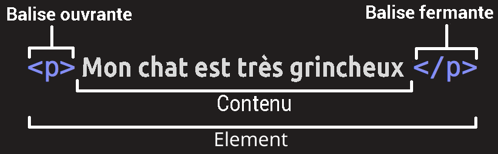
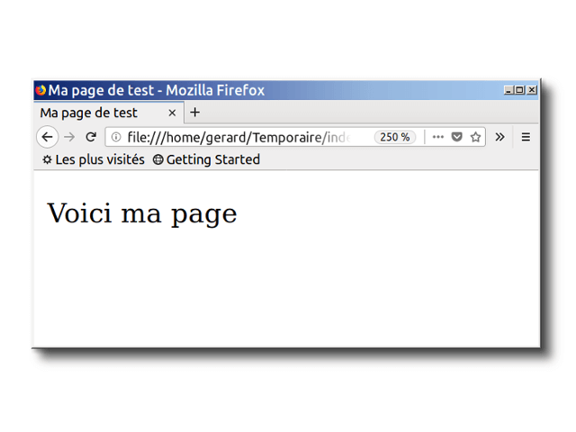

{{LearnSidebar}}{{NextMenu("Apprendre/HTML/Introduction_à_HTML/The_head_metadata_in_HTML", "Apprendre/HTML/Introduction_à_HTML")}}

Cet article porte sur les fondements du HTML, pour prendre un bon départ — nous définissons les éléments, les attributs et tout autre terme important que vous avez peut‑être entendu, ainsi que leur emplacement adéquat dans le langage. Nous montrons comment un élément HTML est structuré, comment une page HTML classique est structurée et expliquons les autres importants traits de base du langage. Dans ce parcours, nous jouons avec certains HTML pour exciter votre intérêt.

<table class="standard-table">
  <tbody>
    <tr>
      <th scope="row">Prérequis :</th>
      <td>
        Notions sur le fonctionnement d'un ordinateur, avoir installé les
        <a
          href="/fr/docs/Learn/Getting_started_with_the_web/Installing_basic_software"
          >logiciels de base</a
        >
        et savoir
        <a href="/fr/Apprendre/Commencer_avec_le_web/Gérer_les_fichiers"
          >gérer les fichiers</a
        >.
      </td>
    </tr>
    <tr>
      <th scope="row">Objectif :</th>
      <td>
        Se familiariser avec le langage HTML et acquérir de la pratique en
        écrivant quelques éléments HTML.
      </td>
    </tr>
  </tbody>
</table>

## Qu'est-ce que le HTML ?

{{Glossary("HTML")}} (**H**yper**T**ext **M**arkup **L**anguage) n'est pas un langage de programmation : c'est un _langage de balisage_ qui sert à indiquer au navigateur comment structurer les pages web visitées. Il peut être aussi compliqué ou aussi simple que le développeur web souhaite qu'il soit. Le HTML se compose d'une série d'{{Glossary("Element", "éléments")}} avec lesquels vous pouvez encadrer, envelopper ou _baliser_ différentes parties du contenu pour les faire apparaître ou agir d'une certaine manière. Des {{Glossary("Tag", "balises")}} encadrantes peuvent transformer une petite partie de contenu en un lien vers une autre page sur le Web, mettre des mots en italique, etc. Par exemple, prenons la phrase suivante :

```
Mon chat est très grincheux
```

Si nous voulons que cette ligne reste en l'état, nous pouvons dire qu'il s'agit d'un paragraphe en l'enveloppant d'un élément paragraphe ({{htmlelement("p")}}) :

```html
<p>Mon chat est très grincheux</p>
```

> **Note :** Les éléments en HTML ne sont pas sensibles à la casse, c'est-à-dire qu'ils peuvent être écrits en majuscules ou en minuscules. Par exemple, un élément {{htmlelement("title")}} peut être écrit `<title>`, `<TITLE>`, `<Title>`, `<TiTlE>`, etc. et il fonctionnera parfaitement. La meilleure pratique, cependant, est d'écrire tous les éléments en minuscules pour des raisons de cohérence, de lisibilité et autres.

## Anatomie d'un élément HTML

Regardons notre élément paragraphe d'un peu plus près :



Les principales parties de notre élément sont :

- **La balise ouvrante :** il s'agit du nom de l'élément (dans ce cas, _p_), encadré par un **chevron ouvrant (<)** et un **chevron fermant (>)**. Elle indique où l'élément commence ou commence à prendre effet — dans ce cas où commence le paragraphe.
- **Le contenu :** il s'agit du contenu de l'élément. Dans notre cas, c'est simplement du texte.
- **La balise fermante :** c'est la même que la balise ouvrante, sauf qu'elle comprend une **barre oblique (/)** avant le nom de l'élément. Elle indique la fin de l'élément — dans ce cas, la fin du paragraphe. Ne pas inclure une balise de fermeture est une erreur fréquente chez les débutants, et peut amener des résultats étranges.

La balise ouvrante, suivie par le contenu puis par la balise fermante, composent ensemble l'élément.

### Apprentissage actif : créer votre premier élément HTML

Modifiez la ligne ci-dessous dans la _Zone de saisie_ en la mettant entre les balises `<em>` et `</em>` (mettez `<em>` avant pour _ouvrir l'élément_ et `</em>` après pour _fermer l'élément_) — cette opération doit mettre en relief la ligne en l'écrivant en italiques. Vous devriez constater la mise à jour de la modification directement dans la _Zone de rendu_.

Si vous faites une erreur, vous pouvez toujours réinitialiser avec le bouton _Réinitialiser_. Si vous êtes vraiment coincé, appuyez sur le bouton _Voir la solution_ pour la réponse.

```html hidden
<h2>Zone de rendu</h2>
<div class="output" style="min-height: 50px;"></div>

<h2>Code modifiable</h2>
<p class="a11y-label">
  Pressez Esc pour sortir le focus de la Zone de saisie (Tab insère une
  tabulation).
</p>

<textarea id="code" class="playable-code" style="min-height: 100px;width: 95%">
  Ceci est mon texte.
</textarea>

<div class="controls">
  <input id="reset" type="button" value="Réinitialiser" />
  <input id="solution" type="button" value="Voir la solution" />
</div>
```

```css hidden
html {
  font-family: "Open Sans Light", Helvetica, Arial, sans-serif;
}

h2 {
  font-size: 16px;
}

.a11y-label {
  margin: 0;
  text-align: right;
  font-size: 0.7rem;
  width: 98%;
}

body {
  margin: 10px;
  background: #f5f9fa;
}
```

```js hidden
var textarea = document.getElementById("code");
var reset = document.getElementById("reset");
var solution = document.getElementById("solution");
var output = document.querySelector(".output");
var code = textarea.value;
var userEntry = textarea.value;

function updateCode() {
  output.innerHTML = textarea.value;
}

reset.addEventListener("click", function () {
  textarea.value = code;
  userEntry = textarea.value;
  solutionEntry = htmlSolution;
  solution.value = "Voir la solution";
  updateCode();
});

solution.addEventListener("click", function () {
  if (solution.value === "Voir la solution") {
    textarea.value = solutionEntry;
    solution.value = "Cacher la solution";
  } else {
    textarea.value = userEntry;
    solution.value = "Voir la solution";
  }
  updateCode();
});

var htmlSolution = "<em>Ceci est mon texte.</em>";
var solutionEntry = htmlSolution;

textarea.addEventListener("input", updateCode);
window.addEventListener("load", updateCode);

// stop tab key tabbing out of textarea and
// make it write a tab at the caret position instead

textarea.onkeydown = function (e) {
  if (e.keyCode === 9) {
    e.preventDefault();
    insertAtCaret("\t");
  }

  if (e.keyCode === 27) {
    textarea.blur();
  }
};

function insertAtCaret(text) {
  var scrollPos = textarea.scrollTop;
  var caretPos = textarea.selectionStart;

  var front = textarea.value.substring(0, caretPos);
  var back = textarea.value.substring(
    textarea.selectionEnd,
    textarea.value.length,
  );
  textarea.value = front + text + back;
  caretPos = caretPos + text.length;
  textarea.selectionStart = caretPos;
  textarea.selectionEnd = caretPos;
  textarea.focus();
  textarea.scrollTop = scrollPos;
}

// Update the saved userCode every time the user updates the text area code

textarea.onkeyup = function () {
  // We only want to save the state when the user code is being shown,
  // not the solution, so that solution is not saved over the user code
  if (solution.value === "Voir la solution") {
    userEntry = textarea.value;
  } else {
    solutionEntry = textarea.value;
  }

  updateCode();
};
```

{{ EmbedLiveSample('Apprentissage_actif_créer_votre_premier_élément_HTML', 700, 400)}}

### Éléments imbriqués

Vous pouvez mettre des éléments à l'intérieur d'autres éléments — cela s'appelle l'**imbrication**. Si vous voulez affirmer que votre chat est **très** grincheux, vous pouvez mettre le mot « très » dans l'élément {{htmlelement("strong")}}, pour qu'il soit fortement mis en valeur :

```html
<p>Mon chat est <strong>très</strong> grincheux.</p>
```

Vous devez toutefois vous assurer que vos éléments sont correctement imbriqués : dans l'exemple ci-dessus, nous avons ouvert l'élément `p` en premier, puis l'élément `strong`, donc nous devons fermer l'élément `strong` d'abord, puis l'élément `p`. Ce qui suit est _incorrect_ :

```html example-bad
<p>Mon chat est <strong>très grincheux.</p></strong>
```

Les **éléments doivent être ouverts et fermés correctement afin d'être clairement à l'intérieur ou à l'extérieur l'un de l'autre**. Si les balises se chevauchent comme dans l'exemple ci-dessus, votre navigateur web essaiera de deviner ce que vous vouliez dire, et vous pourrez obtenir des résultats inattendus. Autant éviter !

### Éléments bloc vs en ligne

Il existe deux catégories importantes d'éléments en HTML que vous devez connaître : les éléments de niveau bloc et les éléments en ligne.

- Les éléments de niveau **bloc** forment **un bloc visible sur une page** — ils apparaissent sur une nouvelle ligne quel que soit le contenu précédant et tout contenu qui les suit apparaît également sur une nouvelle ligne. Les éléments de niveau bloc sont souvent des éléments structurels de la page et représentent, par exemple, des paragraphes, des listes, des menus de navigation, des pieds de page, etc. Un élément de niveau bloc ne peut pas être imbriqué dans un élément en ligne, mais il peut être imbriqué dans un autre élément de niveau bloc.
- Les éléments en **ligne** sont contenus **dans des éléments de niveau bloc**. Ils entourent seulement des petites parties du contenu du document, ni des paragraphes entiers, ni des regroupements de contenu. Un élément en ligne ne fait pas apparaître une nouvelle ligne dans le document. Il apparaît généralement dans un paragraphe de texte, par exemple un élément {{htmlelement ("a")}} (hyperlien) ou des éléments de mise en évidence tels que {{htmlelement("em")}} ou {{htmlelement("strong")}}.

Prenez l'exemple suivant :

```html
<em>premier</em><em>deuxième</em><em>troisième</em>

<p>quatrième</p>
<p>cinquième</p>
<p>sixième</p>
```

{{htmlelement("em")}} est un élément en ligne et, comme vous pouvez le voir ci-dessous, les trois premiers éléments s'affichent sur la même ligne sans qu'il n'y ait d'espace entre eux. Par contre, {{htmlelement("p")}} est un élément de niveau bloc, donc chaque élément apparaît sur une nouvelle ligne et un espace apparaît au-dessus et au-dessous de chacun d'eux (l'espacement est dû au [style CSS](/fr/docs/Learn/CSS/First_steps) par défaut du navigateur qui s'applique aux paragraphes).

{{ EmbedLiveSample('Éléments_bloc_vs_en_ligne', 700, 200) }}

> **Note :** HTML5 a redéfini les catégories d'éléments dans HTML5 : voir [catégories de contenu d'éléments](https://html.spec.whatwg.org/multipage/indices.html#element-content-categories). Bien que ces définitions soient plus précises et moins ambiguës que celles qui précèdent, elles sont beaucoup plus compliquées à comprendre que « block » et « inline ». Nous nous en tiendrons donc à ces dernières tout au long de ce sujet.

> **Note :** Les termes « block » et « inline », tels qu'utilisés dans cet article, ne doivent pas être confondus avec [les types de boîtes des CSS](/fr/docs/Learn/CSS/Building_blocks/The_box_model) portant les mêmes noms. Alors qu'ils sont corrélés par défaut, modifier le type d'affichage des CSS ne modifie pas la catégorie d'un élément et n'affecte pas les éléments qu'il pourrait contenir ni ceux dans lequel il pourrait être contenu. Une des raisons pour lesquelles HTML5 a abandonné ces termes était d'éviter cette confusion assez courante.

> **Note :** Vous trouverez des pages de référence utiles incluant des listes d'[éléments de niveau bloc](/fr/docs/Web/HTML/Block-level_elements) et d'[éléments en ligne](/fr/docs/Web/HTML/Inline_elements).

### Éléments vides

Tous les éléments ne suivent pas le modèle ci-dessus d'ouverture de balise, puis contenu, puis fermeture de balise. Certains éléments ne sont composés que d'une balise. Ils servent généralement à insérer / incorporer quelque chose dans le document à l'endroit où ils sont mis. Par exemple, l'élément `` ou {{htmlelement("img")}} insère une image dans une page à l'endroit où il est placé (la balise auto-fermante `` est à privilégier) :

```html

```

Cela affichera l'élément suivant sur votre page :

{{ EmbedLiveSample('Éléments_vides', 700, 300) }}

## Attributs

Les éléments peuvent aussi avoir des attributs, qui comme suit:


Les attributs contiennent des informations supplémentaires sur l'élément sans qu'elles n'apparaissent dans le contenu réel. Dans ce cas, l'attribut **`class`** vous permet de donner à l'élément un nom d'identification qui peut ensuite être utilisé pour cibler l'élément afin de lui attribuer un [style CSS](/fr/docs/Web/CSS) ou un comportement particulier, par exemple.

Pour créer un attribut, il faut :

- Insérer un espace entre cet attribut et le nom de l'élément (ou l'attribut précédent, si l'élément possède déjà un ou plusieurs attributs) ;
- Donner un nom à l'attribut, puis ajouter un signe égal ;
- Donner une valeur à l'attribut, entourée par des guillemets d'ouverture et de fermeture.

### Apprentissage actif : ajouter des attributs à un élément

Un autre exemple d'un élément est {{htmlelement("a")}}. Il représente une ancre et permet de transformer en lien l'élément qu'il enveloppe. Il peut recevoir un certain nombre d'attributs, mais voici les deux principaux :

- `href`
  - : cet attribut spécifie l'adresse web vers laquelle vous souhaitez que le lien pointe, c'est-à-dire l'adresse vers laquelle le navigateur redirigera lorsqu'on cliquera sur le lien. Par exemple, `href="https://www.mozilla.org/"`.
- `title`
  - : l'attribut `title` apporte des informations supplémentaires sur le lien, comme le nom de la page vers laquelle le lien pointe. Par exemple, `title="Page d'Accueil Mozilla"`, qui apparaîtra comme une info-bulle lorsque le curseur passera sur le lien.
- `target`
  - : l'attribut `target` définit le contexte de navigation utilisé pour afficher le lien. Par exemple, `target="_blank"` affichera le lien dans un nouvel onglet. Si vous voulez afficher le lien dans l'onglet courant, il suffit de ne pas mettre cet attribut.

Modifiez la ligne ci-dessous dans la _Zone de saisie_ pour la transformer en lien vers votre site web préféré.

1. Ajoutez l'élément `<a>`.
2. Ajoutez l'attribut `href`, puis l'attribut `title`.
3. Définissez l'attribut `target` afin d'ouvrir le lien dans un nouvel onglet.

Vous pourrez voir la mise à jour de vos modifications en direct dans la _Zone de rendu_. Vous devriez voir un lien qui, lorsque vous passez votre pointeur de souris dessus, affiche le contenu de l'attribut `title` et, lorsque vous cliquez dessus, va à l'adresse web indiquée dans l'élément `href`. N'oubliez pas d'inclure un espace entre le nom de l'élément et chacun des attributs.

Si vous faites une erreur, vous pouvez toujours réinitialiser la _zone de saisie_ en cliquant sur le bouton _Réinitialiser_. Si vous êtes vraiment coincé, cliquez sur le bouton _Voir la solution_ pour afficher la réponse.

```html hidden
<h2>Zone de rendu</h2>

<div class="output" style="min-height: 50px;"></div>

<h2>Code modifiable</h2>
<p class="a11y-label">
  Pressez Esc pour sortir le focus de la Zone de saisie (Tab insère une
  tabulation).
</p>

<textarea id="code" class="input" style="min-height: 100px;width: 95%">
  &lt;p&gt;Un lien vers mon site Web préféré.&lt;/p&gt;
</textarea>

<div class="playable-buttons">
  <input id="reset" type="button" value="Réinitialiser" />
  <input id="solution" type="button" value="Voir la solution" />
</div>
```

```css hidden
html {
  font-family: sans-serif;
}

h2 {
  font-size: 16px;
}

.a11y-label {
  margin: 0;
  text-align: right;
  font-size: 0.7rem;
  width: 98%;
}

body {
  margin: 10px;
  background: #f5f9fa;
}
```

```js hidden
var textarea = document.getElementById("code");
var reset = document.getElementById("reset");
var solution = document.getElementById("solution");
var output = document.querySelector(".output");
var code = textarea.value;
var userEntry = textarea.value;

function updateCode() {
  output.innerHTML = textarea.value;
}

reset.addEventListener("click", function () {
  textarea.value = code;
  userEntry = textarea.value;
  solutionEntry = htmlSolution;
  solution.value = "Voir la solution";
  updateCode();
});

solution.addEventListener("click", function () {
  if (solution.value === "Voir la solution") {
    textarea.value = solutionEntry;
    solution.value = "Cacher la solution";
  } else {
    textarea.value = userEntry;
    solution.value = "Voir la solution";
  }
  updateCode();
});

var htmlSolution =
  '<p>Un lien vers mon <a href="https://www.mozilla.org/" title="Page d\'accueil de Mozilla" target="_blank">site Web préféré</a>.</p>';
var solutionEntry = htmlSolution;

textarea.addEventListener("input", updateCode);
window.addEventListener("load", updateCode);

// stop tab key tabbing out of textarea and
// make it write a tab at the caret position instead

textarea.onkeydown = function (e) {
  if (e.keyCode === 9) {
    e.preventDefault();
    insertAtCaret("\t");
  }

  if (e.keyCode === 27) {
    textarea.blur();
  }
};

function insertAtCaret(text) {
  var scrollPos = textarea.scrollTop;
  var caretPos = textarea.selectionStart;

  var front = textarea.value.substring(0, caretPos);
  var back = textarea.value.substring(
    textarea.selectionEnd,
    textarea.value.length,
  );
  textarea.value = front + text + back;
  caretPos = caretPos + text.length;
  textarea.selectionStart = caretPos;
  textarea.selectionEnd = caretPos;
  textarea.focus();
  textarea.scrollTop = scrollPos;
}

// Update the saved userCode every time the user updates the text area code

textarea.onkeyup = function () {
  // We only want to save the state when the user code is being shown,
  // not the solution, so that solution is not saved over the user code
  if (solution.value === "Voir la solution") {
    userEntry = textarea.value;
  } else {
    solutionEntry = textarea.value;
  }

  updateCode();
};
```

{{ EmbedLiveSample('Apprentissage_actif_ajouter_des_attributs_à_un_élément', 700, 400) }}

### Les attributs booléens

Vous verrez parfois des attributs sans valeur définie : c'est tout à fait autorisé. Ils sont appelés attributs booléens ; ils ne peuvent avoir qu'une seule valeur, généralement la même que le nom de l'attribut. Par exemple, prenez l'attribut [`disabled`](/fr/docs/Web/HTML/Element/input#disabled), que vous pouvez affecter aux éléments `input` (éléments de saisie d'un formulaire) si vous voulez les _désactiver_ (ils seront alors grisés) afin que l'utilisateur ne puisse pas y saisir de données.

```html
<input type="text" disabled="disabled" />
```

Pour aller plus vite, il est parfaitement possible d'écrire cette même ligne de la façon suivante (nous avons également inclus un élément `input` non-désactivé pour référence, pour que vous puissiez vous faire une meilleure idée de ce qui se passe) :

```html
<!-- la présence de l'attribut disabled empêche l'utilisateur final d'entrer du texte dans le champ de saisie -->
<input type="text" disabled />

<!-- la saisie de texte est autorisée puisque l'attribut disabled est omis -->
<input type="text" />
```

Ces deux exemples vous donneront le résultat suivant :

{{ EmbedLiveSample('Les_attributs_booléens', 700, 100) }}

### Omettre des guillemets autour des valeurs d'attribut

Si vous regardez ce qui se passe sur le Web, vous rencontrerez tous types de styles de balises étranges, y compris des valeurs d'attribut sans guillemets. C'est permis dans certaines circonstances, mais cela va briser votre balisage dans d'autres. Par exemple, si nous revisitons notre exemple de lien ci-dessus, nous pourrons écrire une version de base avec _seulement_ l'attribut `href`, comme ceci :

```html
<a href=https://www.mozilla.org>mon site web favori</a>
```

Cependant, si nous ajoutons l'attribut `title` dans ce même style, cela devient incorrect :

```html example-bad
<a href=https://www.mozilla.org/ title=La page d'accueil Mozilla>mon site web favori</a>
```

En effet, le navigateur interprétera mal la balise, pensant que l'attribut `title` est en fait quatre attributs — un attribut `title` avec la valeur « La » et trois attributs booléens, « `page` », « `d'accueil` » et « `Mozilla` ». Ce n'est évidemment pas ce qui était prévu et cela provoquera des erreurs ou un comportement inattendu dans le code, comme on le voit dans l'exemple en direct ci-dessous. Essayez de passer la souris sur le lien pour voir ce que le texte de `title` donne.

{{ EmbedLiveSample("Omettre_des_guillemets_autour_des_valeurs_dattribut", 700, 100) }}

Nous vous recommandons de toujours inclure les guillemets afin d'éviter ce type de problèmes, mais aussi pour que le code soit plus lisible.

### Guillemets simples ou doubles ?

Dans cet article, vous remarquerez que les valeurs des attributs sont toutes entre des guillemets doubles ("&nbsp;"). Vous pouvez cependant voir des guillemets simples ('&nbsp;') dans le code HTML de certaines personnes. C'est purement une question de style, et vous êtes libre de choisir la solution que vous préférez. Les deux lignes suivantes sont équivalentes :

```html
<a href="http://www.exemple.com">Un lien vers mon exemple.</a>

<a href="http://www.example.com">Un lien vers mon exemple</a>
```

Vous devez cependant vous assurer de ne pas les mélanger. Ce qui suit n'est pas correct :

```html example-bad
<a href="http://www.exemple.com'>Un lien vers mon exemple.</a>
```

Si vous avez utilisé un type de guillemets dans votre code HTML, vous pouvez imbriquer l'autre type :

```html
<a href="http://www.exemple.com" title="N'est-ce pas drôle ?"
  >Un lien vers mon exemple.</a
>
```

Si vous souhaitez imbriquer le même type de guillemets, vous devez utiliser [une entité HTML](/fr/docs/Glossary/Entity) pour représenter ce caractère spécial. Sinon, le code ne fonctionnera pas :

```html example-bad
<a href='http://www.exemple.com' title='N'est-ce pas drôle ?'>Un lien vers mon exemple.</a>
```

Faites plutôt ceci :

```html
<a href="http://www.exemple.com" title="N'est-ce pas drôle ?"
  >Un lien vers mon exemple.</a
>
```

## Anatomie d'un document HTML

Les éléments HTML basiques ne sont pas très utiles si on les prend séparément. Nous allons voir comment combiner des éléments individuels pour former une page HTML entière :

```html
<!doctype html>
<html>
  <head>
    <meta charset="utf-8" />
    <title>Ma page test</title>
  </head>
  <body>
    <p>Voici ma page web</p>
  </body>
</html>
```

Ici, nous avons :

1. `<!DOCTYPE html>` : le type de document. Quand HTML était jeune (vers 1991/2), les `doctypes` étaient censés agir comme des liens vers un ensemble de règles que la page HTML devait suivre pour être considérée comme un bon HTML, ce qui pouvait signifier la vérification automatique des erreurs et d'autres choses utiles. Habituellement, ils ressemblaient à ceci :

   ```html
   <!DOCTYPE html PUBLIC "-//W3C//DTD XHTML 1.0 Transitional//EN" "http://www.w3.org/TR/xhtml1/DTD/xhtml1-transitional.dtd">
   ```

   Cependant, de nos jours personne ne se soucie vraiment d'eux, et ils sont juste un artefact historique qui doit être inclus pour que tout fonctionne bien. `<!DOCTYPE html>` est la chaîne de caractères la plus courte qui soit un `doctype` valide. C'est tout ce que vous avez vraiment besoin de savoir.

2. `<html></html>` : l'élément {{htmlelement("html")}}. Cet élément est le contenant de tout le code de la page et est parfois connu comme l'élément racine.
3. `<head></head>` : l'élément {{htmlelement("head")}}. Cet élément a le rôle de conteneur pour toute chose que vous souhaitez inclure dans la page HTML **qui ne soit pas du contenu** à afficher aux visiteurs de la page : mots clés, description de page que vous souhaitez voir apparaître dans les résultats de recherche, style CSS, déclarations de jeu de caractères et plus encore. Nous vous en dirons plus à ce sujet dans l'article suivant de la série.
4. `<meta charset="utf-8">` : cet élément définit que le jeu de caractères à utiliser pour votre document est UTF-8. Ce jeu comporte la quasi‑totalité des caractères de toutes les écritures de langues humaines connues. Actuellement, il peut pour l'essentiel gérer tout contenu textuel que vous y pourriez mettre. Il n'y a aucune raison de ne pas définir cela et il peut permettre d'éviter certains problèmes plus tard.
5. `<title></title>` : l'élément {{htmlelement("title")}}. Il définit le titre de la page, celui qui s'affiche dans l'onglet du navigateur dans lequel la page est chargée et qui est utilisé pour décrire la page lorsque vous la marquez ou l'ajoutez aux favoris.
6. `<body></body>` : l'élément {{htmlelement("body")}}. Il contient _tout_ le contenu que vous souhaitez afficher aux internautes lorsqu'ils visitent votre page, que ce soit du texte, des images, des vidéos, des jeux, des pistes audio jouables ou autre.

### Apprentissage actif : ajouter certaines fonctionnalités à un document HTML

Si vous voulez essayer d'écrire du HTML sur votre ordinateur en local, vous pouvez :

1. Copier l'exemple de page HTML ci-dessus.
2. Créer un nouveau fichier dans votre éditeur de texte.
3. Coller le code dans le nouveau fichier texte.
4. Enregistrer le fichier sous `index.html`.

> **Note :** Vous pouvez également trouver ce modèle HTML dans le [dépôt GitHub MDN Learning Area](https://github.com/mdn/learning-area/blob/master/html/introduction-to-html/getting-started/index.html).

Vous pouvez maintenant ouvrir ce fichier dans un navigateur Web pour voir à quoi ressemble le rendu, puis modifier le code et actualiser le navigateur pour voir le résultat. Initialement, il ressemblera à ceci:

Dans cet exercice, vous pouvez modifier le code sur votre ordinateur, comme indiqué ci-dessus, ou directement dans la fenêtre d'exemple modifiable ci-dessous (la fenêtre d'exemple modifiable représente uniquement le contenu de l'élément \<body>. ) Nous aimerions que vous le fassiez en suivant les étapes suivantes :

- Au début du document, juste après la balise d'ouverture `<body>`, ajoutez un titre principal pour le document. Il doit être entre une balise ouvrante `<h1>` et la balise fermante `</h1>` ;
- Modifiez le contenu du paragraphe pour ajouter un texte sur quelque chose qui vous intéresse ;
- Mettez les mots importants en gras en les mettant entre la balise ouvrante `<strong>` et la balise fermante `</strong>` ;
- Ajoutez un lien à votre paragraphe, comme [expliqué plus haut dans cet article](#apprentissage_actif_ajout_d'attributs_à_un_élément) ;
- Ajoutez une image à votre document, en dessous du paragraphe, comme [expliqué plus haut dans cet article](#éléments_vides). Vous obtiendrez des points bonus si vous parvenez à lier une image différente (localement sur votre ordinateur ou ailleurs sur le Web).

Si vous faites une erreur, vous pouvez toujours recommencer en utilisant le bouton _Réinitialiser_. Si vous êtes vraiment coincé, appuyez sur le bouton _Voir la solution_ pour l'afficher.

```html hidden
<h2>Zone de rendu</h2>

<div class="output" style="min-height: 50px;"></div>

<h2>Code modifiable</h2>
<p class="a11y-label">
  Pressez Esc pour sortir le focus de la Zone de saisie (Tab insère une
  tabulation).
</p>

<textarea id="code" class="input" style="min-height: 100px;width: 95%">
  &lt;p&gt;Voici ma page&lt;/p&gt;
</textarea>

<div class="playable-buttons">
  <input id="reset" type="button" value="Réinitialiser" />
  <input id="solution" type="button" value="Voir la solution" />
</div>
```

```css hidden
html {
  font-family: sans-serif;
}

h2 {
  font-size: 16px;
}

.a11y-label {
  margin: 0;
  text-align: right;
  font-size: 0.7rem;
  width: 98%;
}

img {
  max-width: 100%;
}

body {
  margin: 10px;
  background: #f5f9fa;
}
```

```js hidden
var textarea = document.getElementById("code");
var reset = document.getElementById("reset");
var solution = document.getElementById("solution");
var output = document.querySelector(".output");
var code = textarea.value;
var userEntry = textarea.value;

function updateCode() {
  output.innerHTML = textarea.value;
}

reset.addEventListener("click", function () {
  textarea.value = code;
  userEntry = textarea.value;
  solutionEntry = htmlSolution;
  solution.value = "Voir la solution";
  updateCode();
});

solution.addEventListener("click", function () {
  if (solution.value === "Voir la solution") {
    textarea.value = solutionEntry;
    solution.value = "Cacher la solution";
  } else {
    textarea.value = userEntry;
    solution.value = "Voir la solution";
  }
  updateCode();
});

var htmlSolution =
  '<h1>Un peu de musique</h1><p>J\'aime vraiment beaucoup <strong>jouer de la batterie</strong>. Un de mes batteurs préférés est Neal Peart, qui joue dans le groupe <a href="https://fr.wikipedia.org/wiki/Rush_%28groupe%29" title="Article Wikipédia sur Rush">Rush</a>.Actuellement, mon album Rush de prédilection est <a href="http://www.deezer.com/album/942295">Moving Pictures</a>.</p> ';
var solutionEntry = htmlSolution;

textarea.addEventListener("input", updateCode);
window.addEventListener("load", updateCode);

// stop tab key tabbing out of textarea and
// make it write a tab at the caret position instead

textarea.onkeydown = function (e) {
  if (e.keyCode === 9) {
    e.preventDefault();
    insertAtCaret("\t");
  }

  if (e.keyCode === 27) {
    textarea.blur();
  }
};

function insertAtCaret(text) {
  var scrollPos = textarea.scrollTop;
  var caretPos = textarea.selectionStart;

  var front = textarea.value.substring(0, caretPos);
  var back = textarea.value.substring(
    textarea.selectionEnd,
    textarea.value.length,
  );
  textarea.value = front + text + back;
  caretPos = caretPos + text.length;
  textarea.selectionStart = caretPos;
  textarea.selectionEnd = caretPos;
  textarea.focus();
  textarea.scrollTop = scrollPos;
}

// Update the saved userCode every time the user updates the text area code

textarea.onkeyup = function () {
  // We only want to save the state when the user code is being shown,
  // not the solution, so that solution is not saved over the user code
  if (solution.value === "Voir la solution") {
    userEntry = textarea.value;
  } else {
    solutionEntry = textarea.value;
  }

  updateCode();
};
```

{{ EmbedLiveSample('Apprentissage_actif_ajouter_certaines_fonctionnalités_à_un_document_HTML', 700, 600) }}

### Espace vide en HTML

Dans les exemples ci-dessus, vous avez peut-être remarqué que beaucoup d'espaces sont inclus dans le code — ce n'est pas nécessaire du tout. Les deux extraits de code suivants sont équivalents:

```html-nolint
<p>Les chiens sont idiots.</p>

<p>Les chiens        sont
           idiots.</p>
```

Peu importe la quantité d'espace que vous utilisez (cela peut inclure des espaces, ou aussi des sauts de ligne), l'analyseur HTML réduit chacun à un seul espace lors du rendu du code. Alors, pourquoi utiliser autant d'espace blanc? La réponse est la lisibilité — car il est tellement plus facile de comprendre ce qui se passe dans votre code si vous l'avez bien formaté, et non pas simplement l'écrire dans un grand désordre.

Dans notre HTML, nous avons chaque élément imbriqué indenté par deux espaces plus que celui qui le contient. C'est à vous de choisir le style de formatage que vous utilisez (combien d'espaces pour chaque niveau d'indentation, par exemple), mais vous devriez envisager d'utiliser une sorte de formatage.

## Références d'entités : inclure les caractères spéciaux en HTML

En HTML, les caractères `<`, `>`,`"`,`'` et `&` sont des caractères spéciaux. Ils font partie de la syntaxe HTML elle-même, alors comment inclure un de ces caractères dans du texte, par exemple si vous voulez vraiment utiliser une esperluette (&) ou un signe inférieur (<), qui ne soit pas interprété en tant que code comme les navigateurs pourraient le faire ?

Nous devons utiliser les références des caractères — des codes spéciaux qui représentent des caractères et peuvent être utilisés dans ces circonstances exactes. Chaque référence de caractère est démarrée avec une esperluette (&), et se termine par un point-virgule (;).

| Le caractère | Référence équivalent |
| ------------ | -------------------- |
| <            | `&lt;`               |
| >            | `&gt;`               |
| "            | `&quot;`             |
| '            | `&apos;`             |
| &            | `&amp;`              |

> **Note :** Un graphique de toutes les références d'entité de caractères HTML est disponible sur Wikipédia : [Liste des entités caractère de XML et HTML](https://fr.wikipedia.org/wiki/Liste_des_entités_caractère_de_XML_et_HTML).

Dans l'exemple ci-dessous, voici deux paragraphes parlant de techniques Web :

```html
<p>En HTML, un paragraphe se définit avec l'élément.</p>

<p>En HTML, un paragraphe se définit avec l'élément &lt;p&gt;.</p>
```

Dans la zone de rendu en direct ci-dessous, vous pouvez voir que le premier paragraphe n'est pas correctement affiché : le navigateur interprète le second `<p>` comme le début d'un nouveau paragraphe ! Le deuxième paragraphe est bien affiché, car nous avons remplacé les signes inférieur (<) et supérieur (>) par leurs références de caractère.

{{ EmbedLiveSample("Références_d\'entités_inclure_les_caractères_spéciaux_en_HTML", 700, 200) }}

> **Note :** Vous n'avez pas besoin d'utiliser des références d'entité de caractères pour d'autres symboles — les navigateurs modernes les restitueront sans problème à condition que [vous définissiez votre encodage de caractères en UTF-8](/fr/docs/Learn/HTML/Introduction_to_HTML/The_head_metadata_in_HTML#définition_de_lencodage_des_caractères_du_document).

## Commentaires en HTML

En HTML, comme pour la plupart des langages de programmation, il existe un mécanisme permettant d'écrire des commentaires dans le code. Les commentaires sont ignorés par le navigateur et invisibles à l'utilisateur. Leur but est de permettre d'inclure des notes dans le code pour dire comment il fonctionne, que font les diverses parties du code, etc. Cela peut s'avérer très utile si vous revenez à un codage que vous n'avez pas travaillé depuis 6 mois et que vous ne pouvez pas vous rappeler ce que vous avez fait — ou si vous donnez votre code à quelqu'un d'autre pour qu'il y travaille.

Pour transformer une section de contenu dans votre fichier HTML en commentaire, vous devez la mettre dans les marqueurs spéciaux `<!--` et `-->`, par exemple :

```html
<p>Je ne suis pas dans un commentaire</p>

<!-- <p>Je suis dans un commmentaire!</p> -->
```

Comme vous pouvez le voir ci-dessous, le premier paragraphe apparaît dans le rendu de l'éditeur en ligne, mais le second n'apparaît pas.

{{ EmbedLiveSample('Commentaires_en_HTML', 700, 100) }}

## Résumé

Vous avez atteint la fin de l'article — nous espérons que vous avez apprécié de faire le tour des bases du HTML !

À ce stade, vous devez comprendre à quoi ce langage ressemble, comment il fonctionne à un niveau de base, et être en mesure d'écrire quelques éléments et attributs. C'est parfait pour le moment, car dans les articles suivants, nous allons approfondir certaines des choses que vous venez de voir, et introduire de nouveaux aspects du langage. Restez à l'écoute !

> **Note :** À ce stade, lorsque vous commencez à en apprendre davantage sur le langage HTML, vous pouvez également commencer à explorer les bases des feuilles de style [CSS](/fr/docs/Learn/CSS). CSS est le langage utilisé pour composer vos pages Web (par exemple, changer la police ou les couleurs, ou modifier la mise en page). HTML et CSS vont très bien ensemble, comme vous allez bientôt le découvrir.

## Voir aussi

- [Appliquer une couleur aux éléments HTML avec les CSS](/fr/docs/Web/HTML/Applying_color)

{{NextMenu("Apprendre/HTML/Introduction_à_HTML/The_head_metadata_in_HTML", "Apprendre/HTML/Introduction_à_HTML")}}
