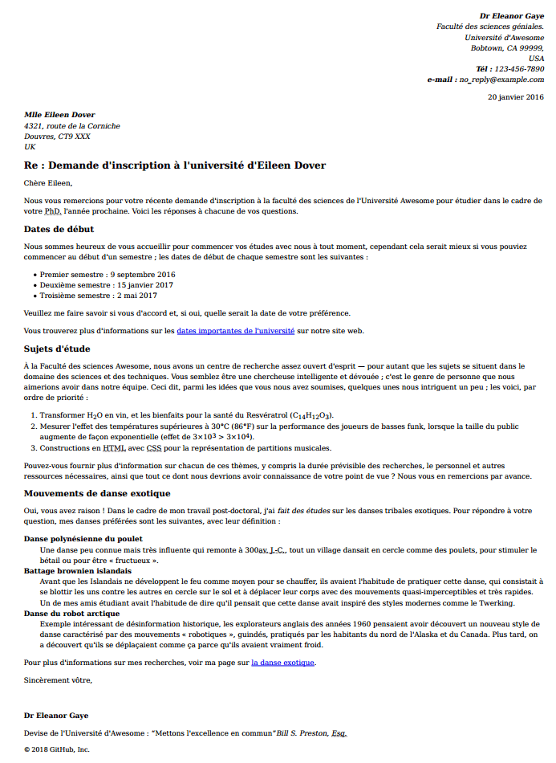

{{LearnSidebar}}{{PreviousMenuNext("Apprendre/HTML/Introduction_à_HTML/Debugging_HTML", "Apprendre/HTML/Introduction_%C3%A0_HTML/Structuring_a_page_of_content", "Apprendre/HTML/Introduction_à_HTML")}}

Tôt ou tard nous apprenons tous à écrire une lettre ; c'est aussi un exemple utile pour tester nos compétences en matière de mise en forme ! Dans cet exercice, vous devrez opérer le balisage d'une lettre en utilisant les fonctionnalités textes élémentaires et avancées, y compris les hyperliens, et en plus nous testerons vos connaissances avec certains contenus de `<head>` en HTML.

<table class="standard-table">
  <tbody>
    <tr>
      <th scope="row">Prérequis :</th>
      <td>
        Avant de se lancer dans cet exercice, vous devez déja avoir travaillé
        <a href="/fr/docs/Learn/HTML/Introduction_to_HTML/Getting_started"
          >Commencer avec le HTML, </a
        ><a
          href="/fr/docs/Learn/HTML/Introduction_to_HTML/The_head_metadata_in_HTML"
          >Qu'y-a-t-il dans l'en-tête ? Métadonnées en HTML, </a
        ><a
          href="/fr/docs/Learn/HTML/Introduction_to_HTML/HTML_text_fundamentals"
          >Fondamentaux du texte HTML, </a
        ><a href="/fr/docs/Learn/HTML/Introduction_to_HTML/Creating_hyperlinks"
          >Création d'hyperliens</a
        >
        et
        <a
          href="/fr/docs/Learn/HTML/Introduction_to_HTML/Advanced_text_formatting"
          >Formatage avancé du texte</a
        >.
      </td>
    </tr>
    <tr>
      <th scope="row">Objectif :</th>
      <td>
        Tester vos connaissances en balisage HTML simple et avancé de texte,
        d'hyperliens et de ce qu'il convient de mettre dans l'élément
        &#x3C;head>.
      </td>
    </tr>
  </tbody>
</table>

## Point de départ

Pour commencer cet exercice, vous devez récupérer le [texte brut que vous allez baliser](https://github.com/mdn/learning-area/blob/master/html/introduction-to-html/marking-up-a-letter-start/letter-text.txt) et les CSS [à inclure](https://github.com/mdn/learning-area/blob/master/html/introduction-to-html/marking-up-a-letter-start/css.txt) dans l'HTML. Créez un nouveau fichier `.html` avec l'éditeur de texte dans lequel vous allez travailler (ou bien utilisez un site comme [JSBin](http://jsbin.com/) ou [Thimble](https://thimble.mozilla.org/) pour faire l'exercice.)

## Projet « lettre »

Pour ce projet, votre tâche consiste à baliser une lettre destinée à être hébergée dans l'intranet d'une université. La lettre est une réponse d'une chercheuse en poste à une doctorante éventuelle à propos de sa candidature pour travailler à l'université.

Sémantique de blocs/structures :

- Il convient que vous donniez à la totalité du document une structure appropriée comprenant le type de document et les éléments {{htmlelement("html")}}, {{htmlelement("head")}} et {{htmlelement("body")}}.
- La lettre doit être marquée avec une structure de paragraphes et d'en‑têtes, en prenant en considération les points suivants : un en‑tête de haut niveau (la ligne « Re : ») et trois en-têtes de deuxième niveau.
- Les dates de début des semestres, les sujets d'étude et les danses exotiques seront balisées avec les types de listes appropriés.
- Mettez les deux adresses dans l'élement {{htmlelement("address")}}. En plus, chaque ligne des adresses doit être mise sur une nouvelle ligne sans que ce soit un nouveau paragraphe.

Sémantique en ligne :

- Les noms de l'expéditeur et du destinataire (et « Tél » et « e‑mail ») doivent être marqués comme étant de grande importance.
- Les quatre dates du document doivent être indiquées dans des éléments appropriés contenant des dates lisibles par la machine.
- La première adresse et la première date de la lettre doivent recevoir une valeur d'attribut de classe « sender-column » ; le CSS que vous ajouterez plus tard les alignera à droite, comme c'est le cas dans une mise en page de lettre classique.
- Les cinq acronymes/abréviations dans le corps du texte de la lettre seront marqués pour permettre leur développement.
- Les six indices/exposants seront balisés de manière appropriée.
- Les symboles « degré », « plus grand que » , « multiplier » seront marqués avec les références d'entités voulues.
- Essayez de marquer au moins deux mots importants en gras/italique.
- Deux emplacements nécessitent un hyperlien ; ajoutez les liens appropriés avec des intitulés. Pour l'emplacement sur lequel le lien pointe, utilisez simplement http\://example.com.
- La citation et la devise de l'université doivent être marquées avec les éléments appropriés.

Dans l'en‑tête du document :

- Le jeu de caractères sera précisé comme étant utf-8 avec la balise `meta` appropriée.
- L'auteur de la lettre sera indiqué dans une balise `meta` adéquate.
- Les CSS fournies seront incorporées avec le marquage approprié.

## Conseils et astuces

- Utilisez le [validateur HTML W3C](https://validator.w3.org/) pour valider votre HTML ; Vous aurez des points supplémentaires s'il est valide.
- Il n'est pas nécessaire de connaître les CSS pour faire cet exercice ; vous avez juste besoin de le mettre dans un élément HTML.

## Exemple

La capture d'écran suivante montre ce à quoi la lettre devrait ressembler après le balisage.

## Évaluation

Si cette évaluation fait partie d'un cours organisé, vous devez pouvoir donner votre travail à votre professeur/formateur pour notation. Si vous faites de l'auto‑formation vous pouvez obtenir un guide d'auto‑évaluation en le demandant sur le [Learning Area Discourse thread](https://discourse.mozilla-community.org/t/learning-web-development-marking-guides-and-questions/16294) ou sur le canal IRC [#mdn](irc://irc.mozilla.org/mdn) sur [Mozilla IRC](https://wiki.mozilla.org/IRC). Essayez l'exercice d'abord — il n'y a rien à gagner à tricher !

{{PreviousMenuNext("Apprendre/HTML/Introduction_to_HTML/Debugging_HTML", "Apprendre/HTML/Introduction_%C3%A0_HTML/Structuring_a_page_of_content", "Apprendre/HTML/Introduction_to_HTML")}}

## Dans ce module

- [Commencer avec le HTML](/fr/docs/Learn/HTML/Introduction_to_HTML/Getting_started)
- [Qu'y-a-t-il dans l'en-tête ? Métadonnées en HTML](/fr/docs/Learn/HTML/Introduction_to_HTML/The_head_metadata_in_HTML)
- [Fondamentaux du texte HTML](/fr/docs/Learn/HTML/Introduction_to_HTML/HTML_text_fundamentals)
- [Creation d'hyperliens](/fr/docs/Learn/HTML/Introduction_to_HTML/Creating_hyperlinks)
- [Formatage avancé du texte](/fr/docs/Learn/HTML/Introduction_to_HTML/Advanced_text_formatting)
- [Structure de Site Web et de document](/fr/docs/Learn/HTML/Introduction_to_HTML/Document_and_website_structure)
- [Déboguer de l'HTML](/fr/docs/Learn/HTML/Introduction_to_HTML/Debugging_HTML)
- Faire une Lettre
- [Structurer une page de contenu](/fr/docs/Learn/HTML/Introduction_to_HTML/Structuring_a_page_of_content)
