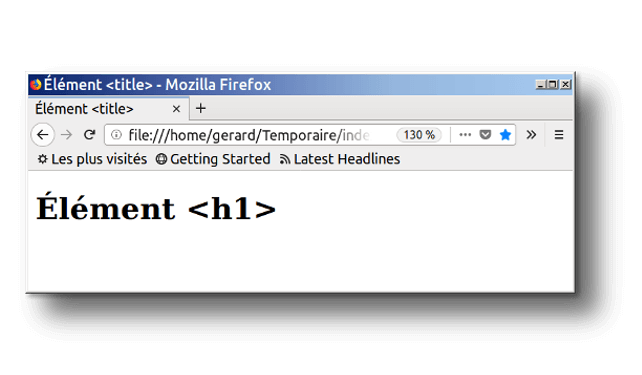
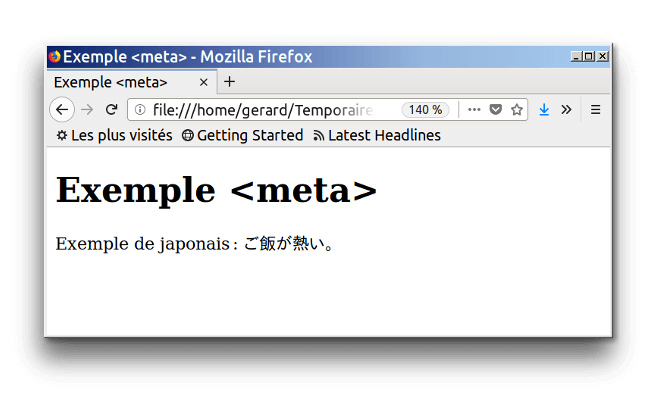
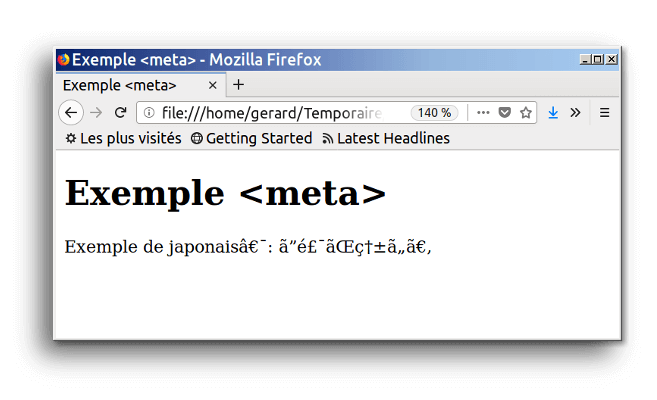
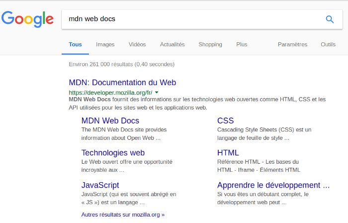
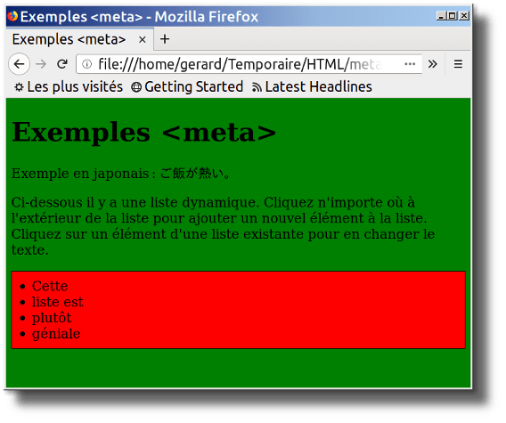

{{LearnSidebar}}{{PreviousMenuNext("Apprendre/HTML/Introduction_à_HTML/Getting_started", "Learn/HTML/Introduction_to_HTML/HTML_text_fundamentals", "Apprendre/HTML/Introduction_à_HTML")}}

L'en-tête {{glossary("Head", "head")}} dans un document HTML est une partie du document qui n'est pas affichée par le navigateur au chargement de la page. Elle contient des informations comme le titre ({{htmlelement("title")}}) de la page, des liens aux {{glossary("CSS")}} (si vous souhaitez composer le contenu HTML avec des CSS), des liens aux favicons personnalisés et d'autres méta-données (auteur du document, mots-clés décrivant le document, etc.). Cet article porte sur tout ceci et plus, pour vous donner de bonnes bases pour gérer les balises et le code qui devraient figurer dans l'en-tête.

<table class="standard-table">
  <tbody>
    <tr>
      <th scope="row">Prérequis:</th>
      <td>
        Connaître les bases du HTML, telles qu'elles sont exposées dans
        l'article
        <a href="/fr/docs/Learn/HTML/Introduction_to_HTML/Getting_started"
          >Commencer avec le HTML</a
        >
      </td>
    </tr>
    <tr>
      <th scope="row">Objectifs:</th>
      <td>
        En savoir plus sur la balise &#x3C;head> du HTML, son objet, les
        éléments les plus importants qu'elle peut contenir et l'effet qu'elle
        peut avoir sur le document HTML.
      </td>
    </tr>
  </tbody>
</table>

## Qu'est-ce que l'en-tête de HTML ?

Revoyons le document HTML de base de l' [article précédent](/fr/docs/Learn/HTML/Introduction_to_HTML/Getting_started#anatomy_of_an_html_document):

```html
<!DOCTYPE html>
<html>
  <head>
    <meta charset="utf-8">
    <title>Ma page test</title>
  </head>
  <body>
    <p>Voici ma page</p>
  </body>
</html>
```

Le contenu de l'en-tête HTML {{htmlelement("head")}} — à la difference du contenu de l'élément {{htmlelement("body")}} (affiché quand la page est chargée par le navigateur) — n'est pas affiché dans la page du navigateur. Le travail de la balise \<head> est de contenir les {{glossary("Metadata", "métadonnées")}} à propos du document. Dans l'exemple ci-dessus, l'en-tête est plutôt petit :

```html
<head>
  <meta charset="utf-8">
  <title>Ma page test</title>
</head>
```

Toutefois dans les pages plus importantes, l'en-tête peut contenir un grand nombre d'éléments — essayez d'aller sur certains de vos sites web préférés et utilisez les [outils de développement](/fr/docs/Learn/Common_questions/What_are_browser_developer_tools) pour vérifier le contenu de l'en-tête. Notre objectif ici n'est pas de vous montrer comment utiliser tout ce qui peut être mis dans l'élément \<head>, mais plutôt de vous apprendre à utiliser les outils les plus évidents, que vous souhaiterez inclure dans l'en-tête, et vous les rendre plus familiers. Commençons.

## Ajouter un titre

Nous avons déjà vu l'élément {{htmlelement ("title")}} — qui peut être utilisé pour ajouter un intitulé au document. Il peut toutefois être confondu avec l'élément {{htmlelement ("h1")}}, pour ajouter un en‑tête de haut nieau au contenu de votre page dans l'élément {{htmlelement("body")}} — quelquefois désigné comme étant le « titre de la page ». Mais ce sont des choses différentes !

- L'élément {{htmlelement("h1")}} apparaît dans la page quand elle est chargée dans le navigateur — généralement, il devrait être utilisé une fois par page, pour marquer le titre du contenu de votre page (le titre d'une histoire, ou d'une actualité, ou tout ce qui vous paraît approprié).
- L'élément {{htmlelement("title")}} est une métadonnée qui représente l'intitulé du document HTML global (non le contenu du document).

### Apprentissage actif : inspection d'un exemple simple

1.  Pour commencer cet apprentissage actif, nous vous invitons à télécharger une copie de notre [page-titre-exemple](https://github.com/mdn/learning-area/blob/master/html/introduction-to-html/the-html-head/title-example.html) sur le dépôt Github. Pour ce faire, soit :

    1.  copiez et collez le code hors de la page dans un nouveau fichier texte dans votre éditeur de code, puis sauvegardez-le dans un endroit raisonnable.
    2.  pressez le bouton « Raw » de la page : le texte brut apparaît dans un nouvel onglet du navigateur. Ensuite, choisissez _Fichier> Enregistrer la page sous ..._ dans le menu du navigateur, puis choisissez un endroit pour enregistrer le fichier.

2.  Maintenant, ouvrez le fichier dans votre navigateur. Vous devriez voir quelque chose comme ça :

    Il devrait désormais être évident de situer où le contenu de \<h1> apparaît et où celui de `<title>` apparaît !

3.  Vous devriez aussi essayer d'ouvrir ce code dans votre éditeur, modifier le contenu de ces éléments, puis rafraîchir la page dans votre navigateur. Amusez-vous avec ces fonctions.

Le contenu de l'élément `<title>` est aussi utilisé de manières différentes . Par exemple, si vous tentez de marquer cette page dans vos Marques-pages ( _Marques-pages > Marquer cette page_ ou bien l'étoile dans la barre d'outils de Firefox), vous verrez que le contenu de `<title>` est suggéré comme nom pour le marque-page.


Le contenu de `<title>` est aussi utilisé dans les résultats de recherches, comme vous le verrez ci‑dessous.

## Métadonnées : l'élément \<meta>

Les métadonnées sont des données qui décrivent des données, et le langage HTML a une manière « officielle » d'ajouter des métadonnées à un document — l'élément {{htmlelement("meta")}}. Bien sûr, d'autres choses, dont nous parlons dans cet article, pourraient aussi être considérées comme des métadonnées. Il y a une panoplie d'autres éléments de type `<meta>` qui auraient pu figurer dans l'en-tête de votre page, mais nous n'en parlerons pas pour l'instant, car ce serait trop déroutant. À la place, nous expliquerons quelques éléments que vous pourriez voir, juste pour vous donner une idée.

### Définition de l'encodage des caractères du document

Dans l'exemple que nous avons vu au-dessus, cette ligne était présente :

```html
<meta charset="utf-8">
```

Cet élément définit l'encodage des caractères du document - le jeu de caractères qu'il est autorisé à utiliser. `utf-8` est un jeu de caractères universel qui inclut à peu près tous les caractères des langues humaines. Cela signifie que votre page web sera capable de gérer l'affichage de n'importe quelle langue ; c'est donc une bonne idée de le définir dans chaque page web que vous créez ! Par exemple, votre page peut gérer l'anglais et le japonais sans aucun souci :

Si vous définissez votre encodage de caractères en `ISO-8859-1` , par exemple (le jeu de caractères de l'alphabet latin), le rendu de votre page sera totalement perturbé :



> **Note :** Certains navigateurs (par ex. Chrome) corrigent automatiquement les encodages incorrects, ainsi selon le navigateur utilisé, ce problème pourrait vous passer totalement inaperçu. Vous devriez quand même définir un encodage `utf-8` sur votre page de toutes façons pour éviter tout problème potentiel avec d'autres navigateurs.

### Apprentissage actif : expérience avec l'encodage des caractères

Pour cela, reportez-vous au modèle HTML simple que vous avez obtenu dans la section précédente sur `<title>` (la page [title-example.html](https://github.com/mdn/learning-area/blob/master/html/introduction-to-html/the-html-head/title-example.html)), faites un essai de modification de la valeur de la métadonnée `charset` en ISO-8859-1 et ajoutez le japonais à votre page. Voici le code que nous avons utilisé :

```html
<p>Japanese example: ご飯が熱い。</p>
```

### Ajouter le nom de l'auteur et une description

De nombreux éléments `<meta>` icontiennent les attributs `name` et `content` :

- `name` définit le type de méta élément ; le type d'informations contenu.
- `content` définit le contenu réel de la métadonnée.

Il est utile d'inclure ces deux méta-éléments dans votre page pour définir son auteur et donner une courte description de son contenu. Voyons un exemple :

```html
<meta name="author" content="Chris Mills">
<meta name="description" content="La Zone Apprentissage des documents web
du MDN a pour but de donner aux débutants du Web tout ce qu'ils doivent
savoir pour commencer le développement de pages webs et d'applications.">
```

Préciser l'auteur peut être intéressant dans certains cas : il est utile de savoir qui a écrit la page pour le contacter et lui poser des questions à propos du contenu. Certains systèmes de gestion de contenu procèdent à l'extraction automatique des informations sur l'auteur de la page et les rendent disponibles à cette fin.

Définir une description qui incorpore des mots-clés relatifs au contenu de la page est utile ; votre page pourra ainsi apparaître plus haut dans la liste de recherches par pertinence créée par un moteur de recherche (ce processus se nomme [Search Engine Optimization](/fr/docs/Glossary/SEO) ou {{glossary("SEO")}} — optimisation du moteur de recherche.)

### Apprentissage actif : utilisation des descriptions dans les moteurs de recherche.

La description est aussi utilisée dans le résultat des moteurs de recherche. Faisons un exercice pour mieux comprendre.

1.  Allez sur la page d'accueil de [Mozilla Developer Network](/fr/).
2.  Regardez le source de la page (Clic droit/

    <kbd>Ctrl</kbd>

    , choissisez « _Code source de la page_ » dans le menu contextuel.)

3.  Trouvez la balise méta `description`. Elle ressemble à ceci :

        <meta name="description" content="MDN Web Docs fournit
         des informations sur les technologies web ouvertes comme HTML,
         CSS et les API utilisées pour les sites web et les applications
         web. On y trouve également de la documentation destinées aux
         développeurs à propos des produits Mozilla tels que les
         outils de développement de Firefox.">

4.  Maintenant, cherchez « Mozilla Developer Network » sur votre moteur de recherche favori (nous avons utilisé Google). Vous remarquerez que le contenu de la `<meta>` description et de l'élément `<title>` sont utilisés dans les résultats de recherche. Cela vaut vraiment la peine !

    

> **Note :** Avec Google, vous verrez quelques sous-pages pertinentes de MDN listées sous le lien de la page d'accueil — ce sont des liens du site ; ils sont configurables dans les outils de [Google's webmaster tools](https://www.google.com/webmasters/tools/) - ces outils sont donc un moyen de rendre les résultats de recherche de votre site meilleurs avec le moteur de recherche de Google.

> **Note :** Plusieurs fonctions `<meta>` ne sont plus utilisées. Par exemple, l'élément `<meta>` `keyword` (`<meta name= "keywords" content="mettez, vos, mot-clés, ici">`) — qui est censé fournir des mots-clés pour les moteurs de recherche, afin de déterminer la pertinence de la page pour différents termes de recherche — est ignoré par les moteurs de recherche, car les polluposteurs remplissaient simplement la liste avec des centaines de mots-clés, biaisant les résultats.

### Autres types de métadonnées

En parcourant le web, vous trouverez d'autres types de métadonnées. Beaucoup de fonctionnalités que vous verrez sur les sites webs sont des créations propriétaires, conçues pour être utilisées sur certains sites ( comme les réseaux sociaux ) avec des informations spécifiques qu'ils peuvent utiliser ;

Par exemple, [Open Graph Data](https://ogp.me/) est un protocole de métadonnées que Facebook a inventé pour fournir des métadonnées plus riches pour les sites webs. Dans le code source de MDN vous trouverez ceci :

```html
<meta property="og:image" content="https://developer.mozilla.org/static/img/opengraph-logo.png">
<meta property="og:description" content="MDN Web Docs fournit des
informations sur les technologies web ouvertes comme HTML, CSS et les API
utilisées pour les sites web et les applications web. On y trouve également
de la documentation destinées aux développeurs à propos des produits
Mozilla tels que les outils de développement de Firefox.">
<meta property="og:title" content="Mozilla Developer Network">
```

En conséquence, lorsque vous faites un lien à MDN sur Facebook, le lien apparaît avec une image et une description : une expérience plus riche pour les utilisateurs.

Twitter a aussi une métadonnée propriétaire, qui a un effet similaire quand l'URL du site est affichée sur twitter.com. Par exemple:

```html
<meta name="twitter:title" content="Mozilla Developer Network">
```

## Ajouter des icônes personnalisées à un site

Pour enrichir davantage le design de votre site, vous pouvez ajouter des références à des icônes personnalisées dans vos métadonnées et celles-ci seront affichées dans certains contextes.

La petite favicône, qui existe depuis de nombreuses années, a été la première icône de ce type, une icône de 16 x 16 pixels utilisée dans de multiples endroits. Vous verrez des favicônes affichés dans chaque onglet du navigateur pour chaque page ouverte et à côté des pages marquées dans le panneau des signets.

Une favicône peut être ajoutée à votre page de la façon suivante :

1.  Enregistrez-la dans le même répertoire que la page d'index du site, sous le format `.ico` (la plupart des navigateurs prendront en charge les favicônes dans des formats plus communs comme `.gif` ou `.png`, mais utiliser le format ICO assurera son fonctionnement depuis Internet Explorer 6.)
2.  Ajoutez la ligne suivante dans votre `<head>` du HTML pour la référencer :

    ```html
    <link rel="shortcut icon" href="favicon.ico" type="image/x-icon">
    ```

Voici un exemple de favicône dans un panneau de favoris :


Il existe de nombreux autres types d'icônes à considérer aussi actuellement. Par exemple, vous trouverez ceci dans le code source de la page d'accueil MDN :

```html
<!-- troisième-génération iPad avec haute-résolution Retina display: -->
<link rel="apple-touch-icon-precomposed" sizes="144x144" href="https://developer.mozilla.org/static/img/favicon144.png">
<!-- iPhone avec haute-résolution Retina display: -->
<link rel="apple-touch-icon-precomposed" sizes="114x114" href="https://developer.mozilla.org/static/img/favicon114.png">
<!-- iPad de première et deuxième génération : -->
<link rel="apple-touch-icon-precomposed" sizes="72x72" href="https://developer.mozilla.org/static/img/favicon72.png">
<!-- iPhone non-Retina, iPod Touch et appareils Android 2.1+: -->
<link rel="apple-touch-icon-precomposed" href="https://developer.mozilla.org/static/img/favicon57.png">
<!-- favicône de base -->
<link rel="shortcut icon" href="https://developer.mozilla.org/static/img/favicon32.png">
```

Les commentaires expliquent ce à quoi chaque icône est utilisée — ces éléments incluent des fonctionnalités telles que la fourniture d'une icône haute résolution à utiliser lorsque le site Web est enregistré sur l'écran d'accueil d'un iPad.

Ne vous préoccupez pas de la mise en œuvre de tous ces types d'icônes maintenant — il s'agit d'une fonctionnalité assez avancée ; vous n'avez pas besoin de la connaître pour avancer dans le cours. Le but principal ici est de vous faire savoir à quoi elles ressemblent si vous les rencontriez en parcourant le code source d'autres sites web.

## Application des CSS et JavaScript au HTML

À peu près tous les sites web que vous rencontrerez actuellement utiliseront des {{glossary("CSS")}} pour agrémenter leur aspect, et {{glossary("JavaScript")}} pour assurer les fonctionnalités interactives, telles que lecteurs vidéo, cartes géographiques, jeux et plus encore. Ceux-ci sont le plus souvent appliqués à une page web en utilisant respectivement les éléments {{htmlelement("link")}} et {{htmlelement("script")}}.

- L'élément {{htmlelement("link")}} se situe toujours dans l'en-tête du document. Il comporte deux attributs, `rel="stylesheet"` indiquant qu'il s'agit de la feuille de style du document, et `href` indiquant le chemin d'accès au fichier la contenant :

  ```html
  <link rel="stylesheet" href="mon_fichier_css.css">
  ```

- L'élément {{htmlelement("script")}} ne doit pas aller dans l'en-tête ; en fait, il est souvent préférable de le placer au bas du corps du document (juste avant la balise de clôture `</body>`), pour s'assurer que tout le contenu HTML a été lu par le navigateur avant de lui appliquer le JavaScript (si JavaScript essaie d'accéder à un élément qui n'existe pas encore, le navigateur déclenchera une erreur).

  ```html
  <script src="mon-fichier-js.js"></script>
  ```

  > **Note :** L'élément `<script>` peut ressembler à un élément vide, mais ce n'est pas le cas : il faut donc une balise de fermeture. Au lieu de pointer vers un fichier de script externe, vous pouvez également choisir de mettre le code du script dans le HTML à l'intérieur d'un élément `<script>`.

### Apprentissage actif : appliquer des CSS et du JavaScript à une page

1.  Pour commencer cet apprentissage actif, prenez une copie de nos fichiers [meta-example.html](https://github.com/mdn/learning-area/blob/master/html/introduction-to-html/the-html-head/meta-example.html), [script.js](https://github.com/mdn/learning-area/blob/master/html/introduction-to-html/the-html-head/script.js) et [style.css](https://github.com/mdn/learning-area/blob/master/html/introduction-to-html/the-html-head/style.css) , et enregistrez-les sur votre ordinateur dans un même répertoire. Assurez-vous qu'ils sont enregistrés avec les noms et les extensions de fichier corrects.
2.  Ouvrez le fichier HTML à la fois dans votre navigateur et votre éditeur de texte.
3.  En suivant les informations fournies ci-dessus, ajoutez les éléments {{htmlelement("link")}} et {{htmlelement("script")}} à votre HTML, afin que les CSS et le JavaScript soient appliqués au HTML.

Si a été fait correctement, après avoir enregistré le HTML, puis actualisé la page, vous verrez que les choses ont changé :



- Le JavaScript a ajouté une liste vide à la page. Maintenant, lorsque vous cliquez n'importe où sur la liste, une boîte de dialogue s'ouvre pour vous permettre de saisir un texte. Lorsque vous appuyez sur le bouton OK, un nouvel élément de la liste est ajouté contenant le texte saisi. Lorsque vous cliquez sur un élément de liste existant, la boîte de dialogue affiche son contenu pour vous permettre de le modifier.
- Le CSS a rendu l'arrière-plan vert et le texte plus grand. Il a également décrit le contenu que le JavaScript a ajouté à la page (la barre rouge avec la bordure noire est le style que le CSS a ajouté à la liste générée par JS).

> **Note :** Si vous êtes coincé dans cet exercice et que vous ne pouvez pas obtenir le CSS / JS à appliquer, essayez de vérifier notre exemple de page [css-and-js.html](https://github.com/mdn/learning-area/blob/master/html/introduction-to-html/the-html-head/css-and-js.html) .

## Définition de la langue principale du document

Enfin, il convient de mentionner que vous pouvez (et devrez vraiment) définir la langue de votre page. Cela peut être fait en ajoutant l'[attribut `lang`](/fr/docs/Web/HTML/Global_attributes/lang) à la balise ouvrante HTML (voir [meta-example.html](https://github.com/mdn/learning-area/blob/master/html/introduction-to-html/the-html-head/meta-example.html).)

```html
<html lang="fr">
```

Ceci est utile de plusieurs façons. Votre document sera indexé plus efficacement par les moteurs de recherche si son langage est défini (ce qui lui permet d'apparaître correctement dans les résultats spécifiques à la langue, par exemple) et il est utile pour les personnes visuellement déficientes utilisant un lecteur d'écran (par exemple, le mot « six » existe en français et en anglais, mais se prononce différemment.)

Vous pouvez également définir des sous-sections de votre document pour qu'elles soient reconnues comme étant en différentes langues. Par exemple, nous pourrions définir la partie en langue japonaise pour qu'elle soit reconnue comme telle, de la manière suivante :

```html
<p>Exemple en japonais : <span lang="jp">ご飯が熱い。</span>.</p>
```

Ces codes sont définis par la norme [ISO 639-1](https://en.wikipedia.org/wiki/ISO_639-1). Vous en trouverez plus sur [Etiquettes langues en HTML et XML (en)](https://www.w3.org/International/articles/language-tags/).

## Résumé

Cela marque la fin de notre tour rapide de l'en-tête HTML — il y a beaucoup plus de possibilités ici, mais un panorama exhaustif serait ennuyeux et susceptible de vous embrouiller à ce stade, nous voulions simplement vous donner une idée des éléments les plus courants. Dans l'article suivant, nous allons étudier les fondamentaux du texte HTML.

{{PreviousMenuNext("Apprendre/HTML/Introduction_à_HTML/Getting_started", "Apprendre/HTML/Introduction_à_HTML/HTML_text_fundamentals", "Apprendre/HTML/Introduction_à_HTML")}}

## Dans ce module

- [Commencer avec le HTML](/fr/docs/Learn/HTML/Introduction_to_HTML/Getting_started)
- Qu'y-a-t-il dans l'en-tête ? Métadonnées en HTML
- [Fondamentaux du texte HTML](/fr/docs/Learn/HTML/Introduction_to_HTML/HTML_text_fundamentals)
- [Création d'hyperliens](/fr/docs/Learn/HTML/Introduction_to_HTML/Creating_hyperlinks)
- [Formatage avancé du texte](/fr/docs/Learn/HTML/Introduction_to_HTML/Advanced_text_formatting)
- [Structure de Site Web et de document](/fr/docs/Learn/HTML/Introduction_to_HTML/Document_and_website_structure)
- [Déboguer de l'HTML](/fr/docs/Learn/HTML/Introduction_to_HTML/Debugging_HTML)
- [Faire une lettre](/fr/docs/Learn/HTML/Introduction_to_HTML/Marking_up_a_letter)
- [Structurer une page de contenu](/fr/docs/Learn/HTML/Introduction_to_HTML/Structuring_a_page_of_content)
