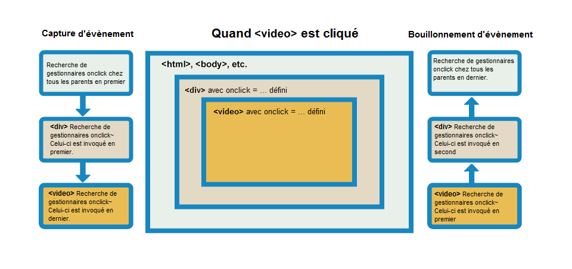

{{LearnSidebar}}{{PreviousMenuNext("Learn/JavaScript/Building_blocks/Return_values","Learn/JavaScript/Building_blocks/Image_gallery", "Learn/JavaScript/Building_blocks")}}

Les événements sont des actions ou des occurrences qui se produisent dans le système que vous programmez et dont le système vous informe afin que vous puissiez y répondre d'une manière ou d'une autre si vous le souhaitez. Par exemple, si l'utilisateur clique sur un bouton d'une page Web, vous pouvez répondre à cette action en affichant une boîte d'information. Dans cet article, nous allons discuter de quelques concepts importants concernant les événements, et regarder comment ils fonctionnent dans les navigateurs. Ce ne sera pas une étude exhaustive; mais seulement ce que vous devez savoir à ce stade.

<table class="standard-table">
  <tbody>
    <tr>
      <th scope="row">Prérequis:</th>
      <td>
        Connaissances de base en informatique, une compréhension de base de HTML
        et CSS,
        <a href="/fr/docs/Learn/JavaScript/First_steps"
          >Premiers pas en JavaScript</a
        >.
      </td>
    </tr>
    <tr>
      <th scope="row">Objectif:</th>
      <td>
        Comprendre la théorie fondamentale des événements, comment ils
        fonctionnent dans les navigateurs et comment les événements peuvent
        différer dans différents environnements de programmation.
      </td>
    </tr>
  </tbody>
</table>

## Une série d'événements heureux

Comme mentionné ci-dessus, les événements sont des actions ou des occurrences qui se produisent dans le système que vous programmez — le système déclenche un signal quelconque lorsqu'un événement se produit, et fournit également un mécanisme par lequel une action est exécutée automatiquement (p.ex. un code en cours d'exécution) lorsque l'événement se produit. Par exemple, dans un aéroport, lorsque la piste est libre pour qu'un avion décolle, un signal est communiqué au pilote et, par conséquent, il commence à piloter l'avion.


Dans le cas du Web, les événements sont déclenchés à l'intérieur de la fenêtre du navigateur et tendent à être rattachés à un élément spécifique qui s'y trouve - il peut s'agir d'un élément unique, d'un ensemble d'éléments, du document HTML chargé dans l'onglet en cours ou toute la fenêtre du navigateur. Il y a beaucoup de types différents d'événements qui peuvent se produire, par exemple :

- L'utilisateur clique avec la souris sur un certain élément ou en place le curseur sur un certain élément.
- L'utilisateur appuie sur une touche du clavier.
- L'utilisateur redimensionne ou ferme la fenêtre du navigateur.
- Une page web finissant de se charger.
- Un formulaire en cours de soumission
- Une vidéo en cours de lecture, en pause ou en fin de lecture.
- Une erreur qui survient.

Vous vous en rendrez compte (notamment en jetant un coup d'œil à la section MDN [Référence des événements](/fr/docs/Web/Events) ), il y a **beaucoup** d'événements auxquels vous pouvez répondre.

Chaque événement disponible a un **gestionnaire d'événement**, qui est un bloc de code (généralement une fonction JavaScript définie par l'utilisateur) qui sera exécuté lorsque l'événement se déclenchera. Lorsqu'un tel bloc de code est défini pour être exécuté en réponse à un déclenchement d'événement, nous disons que nous **enregistrons un gestionnaire d'événements**. Notez que les gestionnaires d'événements sont parfois appelés **écouteurs d'événements** - ils sont à peu près interchangeables pour ce qui nous concerne, même si à la rigueur, ils fonctionnent ensemble. L'écouteur écoute l'événement qui se produit et le gestionnaire est le code qui est exécuté en réponse à ce qui se passe.

> **Note :** il est important de noter que les événements web ne font pas partie du langage du noyau JavaScript — ils sont définis comme faisant partie des APIs JavaScript intégrées du navigateur

### Un exemple simple

Regardons un exemple simple pour expliquer ce que nous entendons ici. Vous avez déjà utilisé des événements et des gestionnaires d'événements dans de nombreux exemples de ce cours, mais récapitulons simplement pour consolider nos connaissances. Dans l'exemple suivant, nous avons un {{htmlelement ("button")}} unique, qui, lorsqu'il est pressé, fera passer l'arrière-plan à une couleur aléatoire:

```html
<button>Change color</button>
```

```css hidden
button {
  margin: 10px;
}
```

Le JavaScript ressemblera à ça :

```js
var btn = document.querySelector("button");

function random(number) {
  return Math.floor(Math.random() * (number + 1));
}

btn.onclick = function () {
  var rndCol =
    "rgb(" + random(255) + "," + random(255) + "," + random(255) + ")";
  document.body.style.backgroundColor = rndCol;
};
```

Dans ce code, nous stockons une référence au bouton dans une variable appelée `btn`, en utilisant la fonction [`Document.querySelector()`](/fr/docs/Web/API/Document/querySelector). Nous définissons également une fonction qui renvoie un nombre aléatoire. La troisième partie du code est le gestionnaire d'événement. La variable `btn` pointe sur un élément `<button>` , et ce type d'objet a un certain nombre d'événements qui peuvent être déclenchés, et par conséquent, des gestionnaires d'événements sont disponibles. Nous sommes à l'écoute du déclenchement de l'événement click, en définissant la propriété `onclick` du gestionnaire d'événements comme une fonction anonyme contenant du code qui génère une couleur RVB aléatoire et lui affecte la couleur d'arrière-plan `<body>` .

Ce code sera maintenant exécuté chaque fois que l'événement "click" se déclenchera sur l'élément `<button>`, c'est-à-dire chaque fois qu'un utilisateur cliquera dessus.

Vous pourrez voir cet exemple s'afficher sur toute la page en cliquant sur [ce lien.](https://mdn.github.io/learning-area/javascript/building-blocks/events/random-color-eventhandlerattributes.html)

### Ce ne sont pas que des pages web

Une autre chose qui mérite d'être mentionnée à ce stade est que les événements ne sont pas particuliers à JavaScript - la plupart des langages de programmation ont un certain type de modèle d'événement, et la façon dont cela fonctionne diffère souvent de celle de JavaScript. En fait, le modèle d'événement en JavaScript pour les pages Web diffère du modèle d'événement pour JavaScript tel qu'il est utilisé dans d'autres environnements.

Par exemple, [Node.js](/fr/docs/Learn/Server-side/Express_Nodejs) est un runtime JavaScript très populaire qui permet aux développeurs d'utiliser JavaScript pour créer des applications réseau et serveur. Le modèle [Node.js event model](https://nodejs.org/docs/latest-v5.x/api/events.html) s'appuie sur des écouteurs pour écouter les événements et des émetteurs pour générer des événements périodiquement — bien qu'il ne le semble pas à première vue, le code est très différent, en particulier lorsqu'il utilise des fonctions comme `on()` pour enregistrer un écouteur d'événement, et `once()` pour enregistrer un écouteur d'événement qui s'efface après sa première exécution. le document [HTTP connect event docs](https://nodejs.org/docs/latest-v8.x/api/http.html#http_event_connect) propose un bon exemple d'utilisation.

Comme autre exemple, vous pouvez désormais utiliser JavaScript pour créer des extensions inter-navigateurs — comme améliorations de la fonctionnalité du navigateur — à l'aide d'une technologie appelée [WebExtensions](/fr/docs/Mozilla/Add-ons/WebExtensions). Le modèle d'événement est similaire au modèle d'événements Web, mais un peu différent — les écouteurs d'événements sont sensibles à la casse (p.ex. `onMessage` plutôt que `onmessage`), et doivent êtres combinés à la fonction `addListener`. Jetez un oeil à la page [runtime.onMessage page](/fr/docs/Mozilla/Add-ons/WebExtensions/API/runtime/onMessage) pour voir un exemple.

Vous n'avez pas besoin de comprendre quoi que ce soit à propos d'autres environnements de ce type à ce stade de votre apprentissage; nous voulions juste préciser que les événements peuvent différer selon les environnements de programmation.

## De quelle manière utiliser les événements Web ?

Il existe plusieurs façons d'ajouter un code d'écouteur d'événement aux pages Web afin qu'il soit exécuté lorsque l'événement associé se déclenche. Dans cette section, nous allons passer en revue les différents mécanismes et discuter de ceux que vous devriez utiliser.

### Les propriétés du gestionnaire d'événement

Voici les propriétés qui existent pour contenir le code du gestionnaire d'événement que nous avons vu le plus fréquemment pendant le cours. Revenons à l'exemple ci-dessus :

```js
var btn = document.querySelector("button");

btn.onclick = function () {
  var rndCol =
    "rgb(" + random(255) + "," + random(255) + "," + random(255) + ")";
  document.body.style.backgroundColor = rndCol;
};
```

La propriété [`onclick`](/fr/docs/Web/API/GlobalEventHandlers/onclick) est la propriété du gestionnaire d'événement utilisée dans cette situation. C'est essentiellement une propriété comme les autres disponibles sur le bouton (p.ex. [`btn.textContent`](/fr/docs/Web/API/Node/textContent), ou [`btn.style`](/fr/docs/orphaned/Web/API/ElementCSSInlineStyle/style)), mais d'un type spécial — lorsque vous la définissez comme étant égale à du code, ce code est exécuté lorsque l'événement se déclenche sur le bouton.

Vous pouvez également définir la propriété du gestionnaire d'événement comme étant égale au nom d'une fonction définie (comme nous l'avons vu dans [Construire votre propre fonction](/fr/docs/Learn/JavaScript/Building_blocks/Build_your_own_function)). Le code suivant fonctionnera tout pareil&nbsp;:

```js
var btn = document.querySelector("button");

function bgChange() {
  var rndCol =
    "rgb(" + random(255) + "," + random(255) + "," + random(255) + ")";
  document.body.style.backgroundColor = rndCol;
}

btn.onclick = bgChange;
```

De nombreuses propriétés de gestionnaire d'événement sont disponibles. Faisons une expérience.

Tout d'abord, faites une copie locale de [random-color-eventhandlerproperty.html](https://github.com/mdn/learning-area/blob/master/javascript/building-blocks/events/random-color-eventhandlerproperty.html), et ouvrez-le dans votre navigateur. C'est juste une copie de l'exemple simple de couleur aléatoire avec lequel nous avons déjà joué dans cet article. Maintenant, changez `btn.onclick` pour lui attribuer, tour à tour, les différentes valeurs qui suivent, et observez le résultat:

- [`btn.onfocus`](/fr/docs/Web/API/GlobalEventHandlers/onfocus) et [`btn.onblur`](/fr/docs/Web/API/GlobalEventHandlers/onblur) — La couleur change lorsque le bouton est net ou grisé (essayez d'appuyer sur la touche Tab pour l'activer et l'éteindre à nouveau). Ceux-ci sont souvent utilisés pour afficher des informations sur la façon de remplir les champs de formulaire lorsqu'ils sont sélectionnés, ou afficher un message d'erreur si un champ de formulaire vient d'être rempli avec une valeur incorrecte.
- [`btn.ondblclick`](/fr/docs/Web/API/GlobalEventHandlers/ondblclick) — La couleur change seulement si l'élément est double-cliqué.
- [`window.onkeypress`](/fr/docs/Web/API/GlobalEventHandlers/onkeypress), [`window.onkeydown`](/fr/docs/Web/API/GlobalEventHandlers/onkeydown), [`window.onkeyup`](/fr/docs/Web/API/GlobalEventHandlers/onkeyup) — La couleur change si l'on appuie sur une touche du clavier. `keypress` se réfère à un appui normal sur la touche (bouton appuyé puis relâché), alors que `keydown` et `keyup` se réfèrent respectivement à l'appui et au relâchement sur la touche. Notez que cela ne fonctionne pas si vous essayez d'enregistrer ce gestionnaire d'événement sur le bouton lui-même - nous avons dû l'enregistrer sur l'objet [window](/fr/docs/Web/API/Window), qui représente la fenêtre entière du navigateur.
- [`btn.onmouseover`](/fr/docs/Web/API/GlobalEventHandlers/onmouseover) et [`btn.onmouseout`](/fr/docs/Web/API/GlobalEventHandlers/onmouseout) — La couleur changera respectivement lorsque le pointeur de la souris survolera le bouton, ou lorsque le curseur arrêtera le survol du bouton pour s'éloigner de ce dernier.

Certains événements sont très généraux et disponibles presque partout (par exemple un gestionnaire `onclick` peut être enregistré sur presque n'importe quel élément), alors que certains sont plus spécifiques et seulement utiles dans certaines situations (par exemple, il est logique d'utiliser [onplay](/fr/docs/Web/API/GlobalEventHandlers/GlobalEventHandlers.onplay) seulement sur des éléments spécifiques, comme des {{htmlelement("video")}}).

### Les gestionnaires d'événements en ligne : ne les utilisez pas !

Vous pourriez également voir un motif comme celui-ci dans votre code:

```html
<button onclick="bgChange()">Press me</button>
```

```js
function bgChange() {
  var rndCol =
    "rgb(" + random(255) + "," + random(255) + "," + random(255) + ")";
  document.body.style.backgroundColor = rndCol;
}
```

> **Note :** Vous trouverez le [code source complet](https://github.com/mdn/learning-area/blob/master/javascript/building-blocks/events/random-color-eventhandlerattributes.html) de cet exemple sur GitHub (également [le voir s'exécuter](https://mdn.github.io/learning-area/javascript/building-blocks/events/random-color-eventhandlerattributes.html)).

La première méthode d'enregistrement des gestionnaires d'événements trouvés sur le Web impliquait des **attributs HTML du gestionnaire d'événement** (c'est-à-dire **les gestionnaires d'événements en ligne**) comme celui présenté ci-dessus — la valeur de l'attribut est littéralement le code JavaScript que vous souhaitez exécuter lorsque l'événement survient. L'exemple ci-dessus appelle une fonction définie dans un élément {{htmlelement("script")}} sur la même page, mais vous pouvez également insérer du JavaScript directement dans l'attribut comme par exemple :

```html
<button onclick="alert('Hello, this is my old-fashioned event handler!');">
  Press me
</button>
```

Vous trouverez des équivalents d'attributs HTML pour la plupart des propriétés du gestionnaire d'événement; cependant, vous ne devriez pas les utiliser — ils sont considérés comme une mauvaise pratique. Il peut sembler facile d'utiliser un attribut de gestionnaire d'événement si vous voulez avancer rapidement, mais ils deviennent rapidement ingérables et inefficaces.

Pour commencer, ce n'est pas une bonne idée de mélanger votre HTML et votre JavaScript, car il deviennent difficile à analyser — garder votre JavaScript au même endroit est préférable; s'il se trouve dans un fichier séparé, vous pourrez l'appliquer à plusieurs documents HTML.

Même dans un fichier unique, les gestionnaires d'événement en ligne ne sont pas une bonne idée. Un bouton ça va, mais que faire si vous avez 100 boutons ? Vous devez ajouter 100 attributs au fichier; la maintenance se transformerait très vite en un cauchemar. Avec JavaScript, vous pouvez facilement ajouter une fonction de gestionnaire d'événement à tous les boutons de la page, peu importe leur nombre, en utilisant quelque chose comme ceci :

```js
var buttons = document.querySelectorAll("button");

for (var i = 0; i < buttons.length; i++) {
  buttons[i].onclick = bgChange;
}
```

> **Note :** Séparer votre logique de programmation de votre contenu rend également votre site plus convivial pour les moteurs de recherche.

### addEventListener() et removeEventListener()

Le dernier type de mécanisme d'événement est défini dans le [Document Object Model (DOM) Level 2 Events](https://www.w3.org/TR/DOM-Level-2-Events/) , qui fournit aux navigateurs une nouvelle fonction: [`addEventListener()`](/fr/docs/Web/API/EventTarget/addEventListener). Cela fonctionne de la même manière que les propriétés du gestionnaire d'événement, mais la syntaxe est évidemment différente. Nous pourrions réécrire notre exemple de couleur aléatoire comme ceci:

```js
var btn = document.querySelector("button");

function bgChange() {
  var rndCol =
    "rgb(" + random(255) + "," + random(255) + "," + random(255) + ")";
  document.body.style.backgroundColor = rndCol;
}

btn.addEventListener("click", bgChange);
```

> **Note :** Vous trouverez le [code source complet](https://github.com/mdn/learning-area/blob/master/javascript/building-blocks/events/random-color-addeventlistener.html) de cet exemple sur GitHub (également [le voir s'exécuter](https://mdn.github.io/learning-area/javascript/building-blocks/events/random-color-addeventlistener.html)).

Dans la fonction [`addEventListener()`](/fr/docs/Web/API/EventTarget/addEventListener) , nous spécifions deux paramètres - le nom de l'événement pour lequel nous voulons enregistrer ce gestionnaire, et le code qui comprend la fonction du gestionnaire que nous voulons exécuter en réponse. Notez qu'il est parfaitement approprié de placer tout le code dans la fonction [`addEventListener()`](/fr/docs/Web/API/EventTarget/addEventListener), dans une fonction anonyme, comme ceci:

```js
btn.addEventListener("click", function () {
  var rndCol =
    "rgb(" + random(255) + "," + random(255) + "," + random(255) + ")";
  document.body.style.backgroundColor = rndCol;
});
```

Ce mécanisme a certains avantages par rapport aux mécanismes plus anciens discutés précédemment. Pour commencer, il existe une fonction réciproque, [`removeEventListener()`](/fr/docs/Web/API/EventTarget/removeEventListener), qui supprime un écouteur ajouté précédemment. Par exemple, cela supprimerait l'écouteur du premier bloc de code de cette section:

```js
btn.removeEventListener("click", bgChange);
```

Ceci n'a pas beaucoup de sens pour les programmes simples et de petite taille, mais pour les programmes plus grands et plus complexes, cela peut améliorer l'efficacité, de nettoyer les anciens gestionnaires d'événements inutilisés. De plus, par exemple, cela vous permet d'avoir un même bouton qui effectue différentes actions dans des circonstances différentes - tout ce que vous avez à faire est d'ajouter / supprimer des gestionnaires d'événements convenablement.

D'autre part, vous pouvez également enregistrer plusieurs gestionnaires pour le même écouteur. Les deux gestionnaires suivants ne seraient pas appliqués:

```js
myElement.onclick = functionA;
myElement.onclick = functionB;
```

Comme la deuxième ligne remplacerait la valeur de `onclick` définie par le premier. Cependant, ceci fonctionnerait:

```js
myElement.addEventListener("click", functionA);
myElement.addEventListener("click", functionB);
```

Les deux fonctions seraient maintenant exécutées lorsque l'élément est cliqué.

En outre, il existe un certain nombre d'autres fonctionnalités et options puissantes disponibles avec ce mécanisme d'événement. Celles-ci sont un peu hors de propos pour cet article, mais si vous voulez en savoir plus sur elles, jetez un oeil aux pages de référence de [`addEventListener()`](/fr/docs/Web/API/EventTarget/addEventListener) et [`removeEventListener()`](/fr/docs/Web/API/EventTarget/removeEventListener).

### Quel mécanisme devrais-je utiliser ?

Parmi les trois mécanismes, vous ne devriez certainement pas utiliser les attributs du gestionnaire d'événement HTML - ceux-ci sont obsolètes et constituent une mauvaise pratique, comme mentionné ci-dessus.

Les deux autres sont relativement interchangeables, au moins pour des utilisations simples:

- Les propriétés du gestionnaire d'événement ont moins de puissance et d'options, mais une meilleure compatibilité entre les navigateurs (prise en charge depuis Internet Explorer 8). Vous devriez probablement commencer par ceux-ci pendant votre apprentissage.
- Les événements du DOM Niveau 2 (`addEventListener()`, etc.) sont plus puissants, mais peuvent aussi devenir plus complexes et moins bien supportés (supportés depuis Internet Explorer 9). Vous devriez également vous entraîner avec, et tenter de les utiliser si possible.

Les principaux avantages du troisième mécanisme : vous pouvez supprimer le code du gestionnaire d'événement si nécessaire en utilisant `removeEventListener()`, et vous pouvez ajouter plusieurs écouteurs du même type aux éléments si nécessaire. Par exemple, vous pouvez appeler `addEventListener('click', function() { ... })` sur un élément plusieurs fois, avec différentes fonctions spécifiées dans le deuxième argument. Cela est impossible avec les propriétés du gestionnaire d'événement car toute tentative ultérieure de définition d'une propriété remplacera les propriétés précédentes, par exemple:

```js
element.onclick = function1;
element.onclick = function2;
etc.
```

> **Note :** Si vous êtes appelé à prendre en charge des navigateurs plus anciens qu'Internet Explorer 8 dans votre travail, vous risquez de rencontrer des difficultés, car ces anciens navigateurs utilisent des modèles d'événements différents des nouveaux navigateurs. Mais n'ayez crainte, la plupart des bibliothèques JavaScript (par exemple `jQuery`) ont des fonctions intégrées qui permettent d'éliminer les différences entre navigateurs. Ne vous en faites pas trop à ce stade de votre parcours d'apprentissage.

## D'autres concepts liés aux événements

Dans cette section, nous aborderons brièvement quelques concepts avancés relatifs aux événements. Il n'est pas important de les comprendre entièrement à ce stade, mais cela pourra servir à expliquer certains modèles de code que vous rencontrerez probablement de temps en temps.

### L'objet événement

Parfois, dans une fonction de gestionnaire d'événement, vous pouvez voir un paramètre spécifié avec un nom tel que `event`, `evt`, ou simplement `e` . C'est ce qu'on appelle l'objet événement, qui est automatiquement transmis aux gestionnaires d'événements pour fournir des fonctionnalités et des informations supplémentaires. Par exemple, réécrivons légèrement notre exemple de couleur aléatoire:

```js
function bgChange(e) {
  var rndCol =
    "rgb(" + random(255) + "," + random(255) + "," + random(255) + ")";
  e.target.style.backgroundColor = rndCol;
  console.log(e);
}

btn.addEventListener("click", bgChange);
```

> **Note :** Vous trouverez le [code source complet](https://github.com/mdn/learning-area/blob/master/javascript/building-blocks/events/random-color-eventobject.html) de cet exemple sur GitHub (également [le voir s'exécuter](https://mdn.github.io/learning-area/javascript/building-blocks/events/random-color-eventobject.html)).

Ici, vous pouvez voir que nous incluons un objet événement, **e**, dans la fonction, et dans la fonction définissant un style de couleur d'arrière-plan sur `e.target` - qui est le bouton lui-même. La propriété `target` de l'objet événement est toujours une référence à l'élément sur lequel l'événement vient de se produire. Donc, dans cet exemple, nous définissons une couleur d'arrière-plan aléatoire sur le bouton, pas sur la page.

> **Note :** Vous pouvez utiliser n'importe quel nom pour l'objet d'événement - il vous suffit de choisir un nom que vous pouvez ensuite utiliser pour le référencer dans la fonction du gestionnaire d'événements. `e`/`evt`/`event` sont les plus couramment utilisés par les développeurs car ils sont courts et faciles à retenir. C'est toujours bon de s'en tenir à une norme.

`e.target`est incroyablement utile lorsque vous voulez définir le même gestionnaire d'événements sur plusieurs éléments et affecter une action à chacun d'entre eux quand un événement se produit sur eux. Vous pourriez, par exemple, avoir un ensemble de 16 tuiles qui disparaissent quand on clique dessus. Il est utile de toujours pouvoir affecter une action à `e.target`, plutôt que de devoir la sélectionner de manière plus difficile. Dans l'exemple suivant (voir [useful-eventtarget.html](https://github.com/mdn/learning-area/blob/master/javascript/building-blocks/events/useful-eventtarget.html) pour le code source ; et ici pour le voir [s'exécuter](https://mdn.github.io/learning-area/javascript/building-blocks/events/useful-eventtarget.html)), nous avons créé 16 éléments {{htmlelement("div")}} avec JavaScript. Quand nous les sélectionnons tous en utilisant {{domxref("document.querySelectorAll()")}}, puis que nous faisons une boucle sur chacun d'eux, en ajoutant un gestionnaire `onclick` à chacun de sorte qu'une couleur aléatoire est appliquée lorsque l'élément est cliqué&nbsp;:

```js
var divs = document.querySelectorAll("div");

for (var i = 0; i < divs.length; i++) {
  divs[i].onclick = function (e) {
    e.target.style.backgroundColor = bgChange();
  };
}
```

#### Résultat

Le résultat est le suivant (essayez de cliquer dessus - amusez-vous)&nbsp;:

```html hidden
<!doctype html>
<html>
  <head>
    <meta charset="utf-8" />
    <title>Useful event target example</title>
    <style>
      div {
        background-color: red;
        height: 100px;
        width: 25%;
        float: left;
      }
    </style>
  </head>
  <body>
    <script>
      for (var i = 1; i <= 16; i++) {
        var myDiv = document.createElement("div");
        document.body.appendChild(myDiv);
      }

      function random(number) {
        return Math.floor(Math.random() * number);
      }

      function bgChange() {
        var rndCol =
          "rgb(" + random(255) + "," + random(255) + "," + random(255) + ")";
        return rndCol;
      }

      var divs = document.querySelectorAll("div");

      for (var i = 0; i < divs.length; i++) {
        divs[i].onclick = function (e) {
          e.target.style.backgroundColor = bgChange();
        };
      }
    </script>
  </body>
</html>
```

{{ EmbedLiveSample('', '100%', 430) }}

La plupart des gestionnaires d'événements que vous rencontrerez ne disposent que d'un ensemble standard de propriétés et de fonctions (méthodes) disponibles sur l'objet événement (voir la liste complète sur {{domxref("Event")}} ). Cependant, certains gestionnaires plus avancés ajoutent des propriétés spécialisées contenant des données supplémentaires dont ils ont besoin pour fonctionner. Le [Media Recorder API](/fr/docs/Web/API/MediaRecorder_API), par exemple, a un événement `dataavailable` , qui se déclenche quand un fichier audio ou vidéo a été enregistré et est disponible pour être utilisé (par exemple, pour l'enregistrer ou le lire). L'objet événement du gestionnaire [ondataavailable](/fr/docs/Web/API/MediaRecorder/ondataavailable) correspondant dispose d'une propriété `data` contenant les données audio ou vidéo enregistrées pour vous permettre d'y accéder et de l'utiliser.

### Éviter le comportement par défaut

Parfois, vous rencontrerez une situation où vous voudrez arrêter un événement qui adopte son comportement par défaut. L'exemple le plus courant est celui d'un formulaire Web, par exemple un formulaire d'inscription personnalisé. Lorsque vous remplissez les détails et appuyez sur le bouton "Soumettre", le comportement naturel consiste à soumettre les données à une page spécifiée sur le serveur pour traitement, et le navigateur redirige vers une page de "message de réussite" quelconque (ou la même page, si une autre n'est pas spécifiée.).

Le problème survient lorsque l'utilisateur n'a pas soumis les données correctement. En tant que développeur, vous devez arrêter la soumission au serveur et lui envoyer un message d'erreur indiquant ce qui ne va pas et ce qui doit être fait pour corriger les erreurs. Certains navigateurs prennent en charge les fonctions de validation automatique des données de formulaire, mais comme beaucoup ne le font pas, il est conseillé de ne pas vous y fier et d'implémenter vos propres contrôles de validation. Regardons un exemple simple.

Tout d'abord, un simple formulaire HTML qui vous oblige à entrer votre nom et votre prénom:

```html
<form>
  <div>
    <label for="fname">First name: </label>
    <input id="fname" type="text" />
  </div>
  <div>
    <label for="lname">Last name: </label>
    <input id="lname" type="text" />
  </div>
  <div>
    <input id="submit" type="submit" />
  </div>
</form>
<p></p>
```

```css hidden
div {
  margin-bottom: 10px;
}
```

Maintenant un peu de JavaScript - ici nous implémentons une vérification très simple dans un gestionnaire d'événement [onsubmit](/fr/docs/Web/API/GlobalEventHandlers/onsubmit) (l'événement submit est renvoyé sur un formulaire quand il est soumis) qui vérifie si les champs de texte sont vides. Si c'est le cas, nous appelons la fonction [`preventDefault()`](/fr/docs/Web/API/Event/preventDefault) sur l'objet événement - ce qui stoppe la soumission du formulaire - puis nous affichons un message d'erreur dans le paragraphe sous notre formulaire pour indiquer à l'utilisateur ce qui ne va pas :

```js
var form = document.querySelector("form");
var fname = document.getElementById("fname");
var lname = document.getElementById("lname");
var submit = document.getElementById("submit");
var para = document.querySelector("p");

form.onsubmit = function (e) {
  if (fname.value === "" || lname.value === "") {
    e.preventDefault();
    para.textContent = "You need to fill in both names!";
  }
};
```

Évidemment, cette validation est assez faible - cela n'empêcherait pas l'utilisateur de valider le formulaire avec des espaces ou des nombres entrés dans les champs, par exemple - mais cela est acceptable. Le résultat est le suivant :

{{ EmbedLiveSample('Éviter_le_comportement_par_défaut', '100%', 140) }}

> **Note :** pour le code source, voir [preventdefault-validation.html](https://github.com/mdn/learning-area/blob/master/javascript/building-blocks/events/preventdefault-validation.html) (et le voir s'exécuter [ici](https://mdn.github.io/learning-area/javascript/building-blocks/events/preventdefault-validation.html).)

### Le bouillonnement et la capture

Le dernier sujet à aborder ici est quelque chose que vous ne rencontrerez pas souvent, mais cela peut être une vraie difficulté si vous ne le comprenez pas. Le bouillonnement et la capture d'événements sont deux mécanismes qui décrivent ce qui se passe lorsque deux gestionnaires du même type d'événement sont activés sur un même élément. Regardons un exemple pour faciliter cela - ouvrez l'exemple [show-video-box.html](https://mdn.github.io/learning-area/javascript/building-blocks/events/show-video-box.html) dans un nouvel onglet (et le [code source](https://github.com/mdn/learning-area/blob/master/javascript/building-blocks/events/show-video-box.html) dans un autre). C'est également disponible en live ci-dessous.

```html hidden
<!doctype html>
<html>
  <head>
    <meta charset="utf-8" />
    <title>Show video box example</title>
    <style>
      div {
        position: absolute;
        top: 50%;
        transform: translate(-50%, -50%);
        width: 480px;
        height: 380px;
        border-radius: 10px;
        background-color: #eee;
        background-image: linear-gradient(
          to bottom,
          rgba(0, 0, 0, 0),
          rgba(0, 0, 0, 0.1)
        );
      }

      .hidden {
        left: -50%;
      }

      .showing {
        left: 50%;
      }

      div video {
        display: block;
        width: 400px;
        margin: 40px auto;
      }
    </style>
  </head>
  <body>
    <button>Display video</button>

    <div class="hidden">
      <video>
        <source
          src="https://raw.githubusercontent.com/mdn/learning-area/master/javascript/building-blocks/events/rabbit320.mp4"
          type="video/mp4" />
        <source
          src="https://raw.githubusercontent.com/mdn/learning-area/master/javascript/building-blocks/events/rabbit320.webm"
          type="video/webm" />
        <p>
          Your browser doesn't support HTML5 video. Here is a
          <a href="rabbit320.mp4">link to the video</a> instead.
        </p>
      </video>
    </div>

    <script>
      var btn = document.querySelector("button");
      var videoBox = document.querySelector("div");
      var video = document.querySelector("video");

      btn.onclick = function () {
        displayVideo();
      };

      function displayVideo() {
        if (videoBox.getAttribute("class") === "hidden") {
          videoBox.setAttribute("class", "showing");
        }
      }

      videoBox.addEventListener("click", function () {
        videoBox.setAttribute("class", "hidden");
      });

      video.addEventListener("click", function () {
        video.play();
      });
    </script>
  </body>
</html>
```

{{ EmbedLiveSample('Le_bouillonnement_et_la_capture', '100%', 500) }}

Ceci est un exemple assez simple qui montre et cache une balise {{htmlelement("div")}} avec une balise {{htmlelement("video")}} à l'intérieur:

```html
<button>Display video</button>

<div class="hidden">
  <video>
    <source src="rabbit320.mp4" type="video/mp4" />
    <source src="rabbit320.webm" type="video/webm" />
    <p>
      Your browser doesn't support HTML5 video. Here is a
      <a href="rabbit320.mp4">link to the video</a> instead.
    </p>
  </video>
</div>
```

Quand le {{htmlelement("button")}} est cliqué, la vidéo est affichée, en changeant l'attribut de classe sur la balise `<div>` de `hidden` à `showing` ( le CSS de l'exemple contient ces deux classes, qui positionnent respectivement la boîte hors de l'écran et sur l'écran.) :

```js
btn.onclick = function () {
  videoBox.setAttribute("class", "showing");
};
```

Nous ajoutons ensuite quelques gestionnaires d'événements `onclick` supplémentaires - le premier à `<div>` et le second à `<video>`. L'idée est que lorsque l'on clique sur la zone du `<div>` en dehors de la vidéo, la boîte doit être masquée à nouveau; Lorsque la vidéo elle-même est cliquée, la vidéo devrait commencer à jouer.

```js
videoBox.onclick = function () {
  videoBox.setAttribute("class", "hidden");
};

video.onclick = function () {
  video.play();
};
```

Mais il y a un problème - actuellement, lorsque vous cliquez sur la vidéo, elle commence à jouer, mais cela entraîne le fait que `<div>` est également caché en même temps. C'est parce que la vidéo est dans le `<div>` - elle en fait partie - alors que cliquer sur la vidéo lance les _deux_ gestionnaires d'événements ci-dessus.

#### Explication du bouillonnement et de la capture

Quand un événement se déclenche sur un élément qui a des éléments parents (p.ex. l'élément {{htmlelement("video")}} dans notre cas), les navigateurs modernes utilisent deux phases différentes: la phase de **capture** et la phase de **bouillonnement**.

Dans la phase de capture:

- Le navigateur vérifie si l'ancêtre le plus éloigné de l'élément ({{htmlelement("html")}}) dispose d'un gestionnaire d'événement `onclick` enregistré pendant la phase de capture et le lance si c'est le cas.
- Ensuite, il passe à l'élément suivant à l'intérieur de `<html>` et fait la même chose, puis la suivante, et ainsi de suite jusqu'à ce qu'il atteigne l'élément sur lequel on a cliqué.

Dans la phase de bouillonnement, l'opposé exact se produit&nbsp;:

Le navigateur vérifie si l'élément qui a été cliqué a un gestionnaire d'événement `onclick` enregistré dans la phase de bouillonnement et l'exécute si c'est le cas.

Ensuite, il passe à l'élément ancêtre immédiat et fait la même chose, puis le suivant, et ainsi de suite jusqu'à ce qu'il atteigne l'élément `<html>`.



Dans les navigateurs modernes, par défaut, tous les gestionnaires d'événements sont enregistrés dans la phase de bouillonnement. Ainsi, dans notre exemple actuel, lorsque vous cliquez sur la vidéo, l'événement click fait un bouillonnement de l'élément `<video>` vers l'élément `<html>`. Comme ceci :

- Il trouve d'abord le gestionnaire `video.onclick...` et le lance, de manière à ce que la vidéo soit jouée en premier.
- Ensuite il trouve le gestionnaire `videoBox.onclick...` et le lance, de sorte que la vidéo est cachée.

#### Régler le problème avec stopPropagation()

C'est un comportement ennuyeux, mais il y a un moyen de l'éviter ! L'objet événement standard dispose d'une fonction appelée [`stopPropagation()`](/fr/docs/Web/API/Event/stopPropagation), qui, lorsqu'il est invoqué sur l'objet événement d'un gestionnaire, fait en sorte que le gestionnaire soit exécuté, mais l'événement ne remonte pas plus haut dans la chaîne, et donc plus aucun autre gestionnaire ne sera exécuté.

Nous pouvons donc résoudre notre problème actuel en changeant la fonction du deuxième gestionnaire dans le bloc de code précédent comme ceci:

```js
video.onclick = function (e) {
  e.stopPropagation();
  video.play();
};
```

Vous pouvez faire une copie locale du [code source show-video-box.html](https://github.com/mdn/learning-area/blob/master/javascript/building-blocks/events/show-video-box.html) et le modifier vous-même ou regarder le résultat ici : [show-video-box-fixed.html](https://mdn.github.io/learning-area/javascript/building-blocks/events/show-video-box-fixed.html) (ou voir le [code source](https://github.com/mdn/learning-area/blob/master/javascript/building-blocks/events/show-video-box-fixed.html)).

> **Note :** Pourquoi s'embêter à capturer et bouillonner ? Eh bien, aux heures sombres où les navigateurs étaien peu compatibles entre eux qu'ils ne le sont aujourd'hui, Netscape n'utilisait que la capture d'événements, et Internet Explorer n'utilisait que les bouillonnements. Quand le W3C a décidé d'essayer de normaliser le comportement et de parvenir à un consensus, ils en sont arrivés à ce système qui inclue les deux, qui est celui implémenté dans les navigateurs modernes.

> **Note :** Comme mentionné ci-dessus, par défaut, tous les gestionnaires d'événements sont enregistrés dans la phase de bouillonnement, ce qui est plus logique la plupart du temps. Si vous voulez vraiment enregistrer un événement dans la phase de capture, vous pouvez le faire en enregistrant votre gestionnaire avec [`addEventListener()`](/fr/docs/Web/API/EventTarget/addEventListener), et en positionnant la troisième propriété, qui est optionnelle, sur `true`.

#### Délégation d'événement

Le bouillonnement nous permet également de tirer parti de la délégation d'événements - ce concept repose sur le fait que si vous voulez exécuter du code lorsque vous cliquez sur l'un des nombreux éléments enfants, vous pouvez définir l'écouteur d'événement sur leur parent et ainsi leur répercuter les événement, plutôt que de devoir définir l'écouteur d'événement sur chaque enfant individuellement.

Un bon exemple est une série d'éléments de liste - si vous voulez que chacun d'eux fasse apparaître un message lorsque vous cliquez dessus, vous pouvez définir l'écouteur d'événement `click` sur la balise parente `<ul>`, et il apparaîtra sur les éléments de la liste.

Ce concept est expliqué plus loin sur le blog de David Walsh, avec de multiples exemples - voir [How JavaScript Event Delegation Works](https://davidwalsh.name/event-delegate).

## Conclusion

Vous devriez maintenant maîtriser tout ce que vous devez savoir sur les événements Web à ce stade de votre apprentissage. Comme mentionné ci-dessus, les événements ne font pas vraiment partie du langage du noyau JavaScript principal - ils sont définis dans les API Web du navigateur.

En outre, il est important de comprendre que les différents contextes dans lesquels JavaScript est utilisé tendent à avoir des modèles d'événements différents - des API Web à d'autres domaines tels que WebExtensions du navigateur et Node.js (JavaScript côté serveur). Nous ne nous attendons pas à ce que vous compreniez tous ces domaines maintenant, mais cela aide certainement à comprendre les bases des événements à mesure que vous avancez dans l'apprentissage du développement Web.

S'il y a quelque chose que vous n'avez pas compris, n'hésitez pas à relire l'article, ou [contactez-nous](/fr/docs/Learn#nous_contacter) pour demander de l'aide.

## Voir aussi

- [Event order](https://www.quirksmode.org/js/events_order.html) (discussion sur la capture et le bouillonnement) — une pièce superbement détaillée de Peter-Paul Koch.
- [Event accessing](https://www.quirksmode.org/js/events_access.html) (discussion sur l'objet événement) — une autre pièce superbement détaillée de Peter-Paul Koch.
- [Event reference](/fr/docs/Web/Events)

{{PreviousMenuNext("Learn/JavaScript/Building_blocks/Return_values","Learn/JavaScript/Building_blocks/Image_gallery", "Learn/JavaScript/Building_blocks")}}
