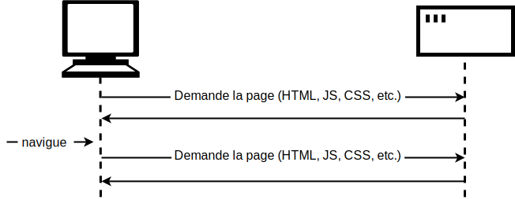
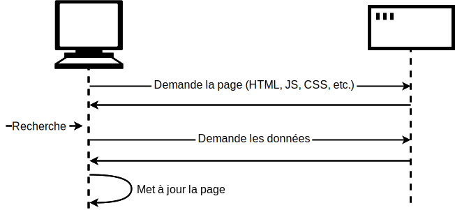

{{LearnSidebar}}{{PreviousMenuNext("Learn/JavaScript/Client-side_web_APIs/Manipulating_documents", "Learn/JavaScript/Client-side_web_APIs/Third_party_APIs", "Learn/JavaScript/Client-side_web_APIs")}}

Les sites et applications web modernes récupèrent fréquemment des données du serveur afin de mettre à jour des sections d'une page sans qu'il soit nécessaire de charger une toute nouvelle page. Ce qui peut paraître comme un léger détail a en réalité un impact important sur les performances et le comportement des sites web. Dans cet article, nous verrons les concepts et technologies qui permettent cela, notamment [l'API <i lang="en">Fetch</i>](/fr/docs/Web/API/Fetch_API) (note de traduction&nbsp;: le verbe anglais <i lang="en">fetch</i> signifie récupérer).

<table>
  <tbody>
    <tr>
      <th scope="row">Prérequis&nbsp;:</th>
      <td>
        Notions fondamentales de JavaScript (voir <a href="/fr/docs/Learn/JavaScript/First_steps">Premiers pas en JavaScript</a>, <a href="/fr/docs/Learn/JavaScript/Building_blocks">Blocs de construction en JavaScript</a>, <a href="/fr/docs/Learn/JavaScript/Objects">Les objets JavaScript</a>), <a href="/fr/docs/Learn/JavaScript/Client-side_web_APIs/Introduction">les bases des API côté client</a>
      </td>
    </tr>
    <tr>
      <th scope="row">Objectifs&nbsp;:</th>
      <td>
        Apprendre comment récupérer des données depuis le serveur et s'en servir pour mettre à jour le contenu d'une page web.
      </td>
    </tr>
  </tbody>
</table>

## Quel est le problème&nbsp;?

Une page web se compose d'un fichier HTML et généralement d'autres fichiers, comme les feuilles de style, les scripts, les images, etc. Pour charger une page web, le navigateur envoie une ou plusieurs requêtes HTTP au serveur afin de récupérer les fichiers nécessaires à l'affichage de la page. Le serveur répond ensuite en envoyant les fichiers demandés. Si vous visitez une autre page, le navigateur demande les nouveaux fichiers correspondants et le serveur répond en les envoyant.



Ce modèle fonctionne parfaitement pour de nombreux sites. En revanche, ce ne sera pas le cas pour un site web utilisant beaucoup de données. Prenons par exemple le site de la [bibliothèque publique de Vancouver](https://www.vpl.ca/). On peut imaginer qu'un tel site permet de rechercher des livres selon des critères, d'afficher des recommandations en fonction des emprunts passés, etc. Pour cela, le site doit mettre à jour la page avec une nouvelle liste de livres. Mais pour chacune de ces listes, l'en-tête de la page, la barre de navigation et le pied de page resteront les mêmes.

Avec le modèle classique, il faudrait récupérer puis charger l'intégralité de la page, alors que nous avons seulement besoin d'en mettre à jour une partie. Cela n'est pas optimal et peut détériorer l'ergonomie.

C'est pourquoi de nombreux sites web utilisent plutôt des API JavaScript afin de demander les données au serveur pour mettre à jour le contenu de la page sans passer par un rechargement complet. Ainsi, lorsqu'une personne recherche par exemple un nouveau produit, le navigateur demande uniquement les données nécessaires à la mise à jour de la page (pour notre exemple de bibliothèque, ce serait la nouvelle liste de livres).



Pour cela, on utilise principalement l'API [<i lang="en">Fetch</i>](/fr/docs/Web/API/Fetch_API). Elle permet d'utiliser JavaScript depuis une page pour construire et envoyer une requête [HTTP](/fr/docs/Web/HTTP) à un serveur afin de récupérer des données. Lorsque le serveur répond en fournissant les données, le code JavaScript peut les utiliser afin de mettre à jour la page, généralement en utilisant [les API de manipulation du DOM](/fr/docs/Learn/JavaScript/Client-side_web_APIs/Manipulating_documents). Les données sont généralement demandées au format [JSON](/fr/docs/Learn/JavaScript/Objects/JSON) (un bon format d'échange de données), mais il peut tout aussi bien s'agir de HTML ou de texte.

Cette méthode est employée largement par les sites utilisant de nombreuses données tels que Amazon, YouTube, eBay, etc. Avec ce modèle&nbsp;:

- Les mises à jour des pages sont plus rapides et il n'est plus nécessaire d'attendre un rechargement de la page&nbsp;: le site apparaît alors comme plus rapide et réactif.
- Il y a moins de données téléchargées pour chaque mise à jour, ce qui signifie une consommation moindre de la bande passante. Si cela n'était pas vraiment un problème sur un ordinateur de bureau avec une connexion à très haut débit, cela pouvait vite freiner la navigation sur les appareils mobiles et/ou aux endroits où l'accès à Internet est moins rapide.

> **Note :** Au début, cette technique était intitulée [AJAX](/fr/docs/Glossary/AJAX), un acronyme anglais pour <i lang="en">[Asynchronous](/fr/docs/Glossary/Asynchronous) JavaScript and XML</i> (soit JavaScript et XML asynchrones), car c'était le format XML qui était utilisé pour l'échange de données. On rencontre aujourd'hui plutôt des données au format JSON, mais le raisonnement reste le même et vous pourrez donc voir le terme AJAX toujours utilisé pour décrire cette technique.

Pour aller encore plus vite, certains sites enregistrent les ressources et les données sur l'ordinateur lorsqu'elles sont demandées pour la première fois. Lors des visites suivantes, ce sont les versions locales qui seront utilisées plutôt que d'avoir à télécharger de nouveaux exemplaires à chaque chargement. Le contenu est rechargé depuis le serveur uniquement lorsqu'il a été mis à jour.

## L'API <i lang="en">Fetch</i>

Voyons quelques exemples d'utilisation de l'API <i lang="en">Fetch</i>.

### Récupérer du contenu texte

Dans cet exemple, nous récupèrerons des données à partir de différents fichiers texte et nous en servirons pour renseigner une zone de contenu.

Cet ensemble de fichiers sera utilisé comme une fausse base de données. Dans une application réelle, il serait plus raisonnable d'utiliser un langage serveur comme PHP, Python, ou Node.js afin de récupérer les données depuis une base de données. Pour cet article, nous garderons les choses simples pour nous concentrer sur la partie client.

Pour utiliser cet exemple, faites une copie locale de [`fetch-start.html`](https://github.com/mdn/learning-area/blob/main/javascript/apis/fetching-data/fetch-start.html) et des quatre fichiers texte&nbsp;

- [`verse1.txt`](https://github.com/mdn/learning-area/blob/main/javascript/apis/fetching-data/verse1.txt)
- [`verse2.txt`](https://github.com/mdn/learning-area/blob/main/javascript/apis/fetching-data/verse2.txt)
- [`verse3.txt`](https://github.com/mdn/learning-area/blob/main/javascript/apis/fetching-data/verse3.txt)
- [`verse4.txt`](https://github.com/mdn/learning-area/blob/main/javascript/apis/fetching-data/verse4.txt)

Enregistrez ces fichiers dans un nouveau répertoire sur votre ordinateur.

Dans cet exemple, nous récupèrerons différents vers d'un poème en les sélectionnant depuis une liste déroulante.

À l'intérieur de l'élément [`<script>`](/fr/docs/Web/HTML/Element/script), ajoutez le code qui suit. Ce code enregistre des références aux éléments [`<select>`](/fr/docs/Web/HTML/Element/select) et [`<pre>`](/fr/docs/Web/HTML/Element/pre) et ajoute un gestionnaire d'évènement sur l'élément `<select>` afin d'appeler une fonction `updateDisplay()` lorsqu'une nouvelle valeur est sélectionnée dans la liste (la valeur étant alors passée en paramètre de la fonction).

```js
const verseChoose = document.querySelector("select");
const poemDisplay = document.querySelector("pre");

verseChoose.addEventListener("change", () => {
  const verse = verseChoose.value;
  updateDisplay(verse);
});
```

Ensuite, il faut définir la fonction `updateDisplay()`. Commençons par placer le squelette vide de la fonction après le bloc de code précédent.

```js-nolint
function updateDisplay(verse) {

}
```

Au début de notre fonction, nous allons construire une URL relative qui pointe vers le fichier texte que nous voulons charger, car nous en aurons besoin ensuite. La valeur choisie avec l'élément [`<select>`](/fr/docs/Web/HTML/Element/select) correspond au texte de l'élément [`<option>`](/fr/docs/Web/HTML/Element/option) (à moins que l'attribut [`value`](/fr/docs/Web/HTML/Element/option#value) indique une autre valeur). La valeur sera par exemple `Verse 1`, qui correspond au fichier `verse1.txt` situé dans le même répertoire que le fichier HTML. On a donc une correspondance pratique entre les valeurs à sélectionner et les noms de nos fichiers texte.

Toutefois, les serveurs web sont généralement sensibles à la casse et le nom du fichier ne contient pas d'espace. Il faut donc convertir `Verse 1` en `verse1.txt`. Pour cela, nous passerons le V majuscule en minuscule, retirerons l'espace et rajouterons l'extension `.txt` à la fin. On peut y arriver à l'aide des fonctions [`replace()`](/fr/docs/Web/JavaScript/Reference/Global_Objects/String/replace), [`toLowerCase()`](/fr/docs/Web/JavaScript/Reference/Global_Objects/String/replace), et des [littéraux de gabarit](/fr/docs/Web/JavaScript/Reference/Template_literals). Ajoutez les lignes suivantes à l'intérieur de la fonction `updateDisplay()`&nbsp;:

```js
verse = verse.replace(" ", "").toLowerCase();
const url = `${verse}.txt`;
```

Nous voilà prêts à utiliser l'API <i lang="en">Fetch</i>&nbsp;:

```js
// On appelle `fetch()` en lui passant l'URL.
fetch(url)
  // fetch() renvoie une promesse. Lorsque nous aurons reçu
  // une réponse du serveur, le gestionnaire then() de la
  // promesse sera appelé avec la réponse
  .then((response) => {
    // Le gestionnaire lève une erreur si la requête a échoué.
    if (!response.ok) {
      throw new Error(`Erreur HTTP : ${response.status}`);
    }
    // Sinon, si la requête a réussi, le gestionnaire récupère
    // la réponse sous forme de texte en appelant response.text(),
    // Et renvoie immédiatement la promesse renvoyée par response.text().
    return response.text();
  })
  // Quand response.text() a réussi, son gestionnaire `then()` est
  // appelé avec le texte et nous copions celui-ci dans la boîte
  // poemDisplay.
  .then((text) => {
    poemDisplay.textContent = text;
  })
  // On intercepte les éventuelles erreurs et on affiche un message
  // dans la boîte `poemDisplay`.
  .catch((error) => {
    poemDisplay.textContent = `Erreur lors de la récupération du vers : ${error}`;
  });
```

Récapitulons ce que fait ce fragment de script.

Pour commencer, on utilise la fonction globale [`fetch()`](/fr/docs/Web/API/fetch) qui est le point d'entrée de l'API <i lang="en">Fetch</i>. Cette fonction prend l'URL comme paramètre (elle peut aussi utiliser un autre paramètre optionnel, mais nous ne l'utilisons pas ici).

Ensuite, `fetch()` est une API asynchrone qui renvoie [une promesse](/fr/docs/Web/JavaScript/Reference/Global_Objects/Promise). Si vous ne savez pas ce qu'est une promesse, lisez le module [JavaScript asynchrone](/fr/docs/Learn/JavaScript/Asynchronous), et notamment [l'article sur les promesses](/fr/docs/Learn/JavaScript/Asynchronous/Promises) (qui parle aussi de `fetch()`) avant de revenir à cet article.

Comme `fetch()` renvoie une promesse, nous passons une fonction à la méthode [`then()`](/fr/docs/Web/JavaScript/Reference/Global_Objects/Promise/then) de la promesse renvoyée. Cette méthode sera appelée lorsque le navigateur aura reçu une réponse du serveur pour la requête HTTP. Dans le code du gestionnaire, on vérifie que la requête a réussi et on déclenche une erreur sinon. S'il n'y a pas eu d'rreur, on appelle [`response.text()`](/fr/docs/Web/API/Response/text) pour interpréter le corps de la réponse sous forme de texte.

`response.text()` est _également_ asynchrone et on renvoie la promesse qu'elle renvoie. On passe une fonction à la méthode `then()` de cette nouvelle promesse. Cette fonction sera appelée lorsque le texte de la réponse sera prêt. Dans cette fonction, nous mettons à jour le bloc `<pre>` avec le texte reçu.

Enfin, on chaîne un gestionnaire [`catch()`](/fr/docs/Web/JavaScript/Reference/Global_Objects/Promise/catch) pour intercepter toute erreur qui serait déclenchée dans l'une des fonctions asynchrones ou des gestionnaires associés.

Il y a un problème avec cette version du code, aucun vers n'est affiché lors du premier chargement. Pour corriger cela, on ajoute les deux lignes qui suivent à la fin du code, avant la balise fermante `</script>`. Cela permet de charger le premier vers par défaut et de s'assurer que la valeur affichée par l'élément [`<select>`](/fr/docs/Web/HTML/Element/select) correspond bien&nbsp;:

```js
updateDisplay("Verse 1");
verseChoose.value = "Verse 1";
```

#### Servir l'exemple grâce à un serveur

Les navigateurs récents ne permettent pas d'envoyer des requêtes HTTP en ouvrant simplement un fichier local pour des raisons de sécurité (voir [la sécurité des sites web](/fr/docs/Learn/Server-side/First_steps/Website_security) pour plus d'informations).

Pour que l'exemple fonctionne correctement, nous devons le tester avec un serveur web local. Pour savoir comment faire, suivez [notre guide pour mettre en place un serveur local de test](/fr/docs/Learn/Common_questions/Tools_and_setup/set_up_a_local_testing_server).

### Le magasin de conserves

Dans l'exemple qui suit, nous avons créé un site d'exemple appelé «&nbsp;<i lang="en">The Can Store</i>&nbsp;», un supermarché en ligne qui vend des produits en conserve. Vous pouvez trouver [la démonstration sur GitHub](https://mdn.github.io/learning-area/javascript/apis/fetching-data/can-store/), et [le code source sur GitHub](https://github.com/mdn/learning-area/tree/main/javascript/apis/fetching-data/can-store).


Par défaut, le site affiche tous les produits, et on peut utiliser les contrôles fournis par le formulaire affiché à gauche pour les filtrer par catégorie, les rechercher par mot-clé, voire les deux.

Il y a une bonne quantité de code qui sert au filtrage des produits par catégorie ou avec les termes d'une recherche, pour manipuler des chaînes de caractères afin que les données soient correctement affichées, etc. Nous ne détaillerons pas cette partie dans cet article, mais vous pouvez vous référer aux commentaires explicatifs dans le code (voir [`can-script.js`](https://github.com/mdn/learning-area/blob/main/javascript/apis/fetching-data/can-store/can-script.js)).

Ce que nous allons détailler, c'est le code qui utilise l'API <i lang="en">Fetch</i>.

Le premier bloc qui utilise cette API se situe au début du code JavaScript&nbsp;:

```js
fetch("products.json")
  .then((response) => {
    if (!response.ok) {
      throw new Error(`Erreur HTTP : ${response.status}`);
    }
    return response.json();
  })
  .then((json) => initialize(json))
  .catch((err) => console.error(`Problème avec Fetch : ${err.message}`));
```

La fonction `fetch()` renvoie une promesse. Si celle-ci réussit, la fonction passée au premier bloc `.then()` contiendra la réponse renvoyée par le serveur.

Dans cette fonction&nbsp;:

- On vérifie que le serveur n'a pas renvoyé d'erreur (comme [`404 Not Found`](/fr/docs/Web/HTTP/Status/404)). Si c'est le cas, on lève l'erreur.
- On appelle [`json()`](/fr/docs/Web/API/Response/json) sur la réponse. Les données de la réponse seront alors interprétées comme [un objet JSON](/fr/docs/Learn/JavaScript/Objects/JSON). On renvoie la promesse renvoyée par `response.json()`.

Ensuite, on passe une fonction à la méthode `then()` de la promesse ainsi renvoyée. Cette fonction reçoit un objet (qui contient les données de la réponse en JSON), qu'on passe à la fonction `initialize()`. Cette dernière initie l'affichage de tous les produits sur l'interface utilisateur.

Pour gérer les erreurs, on chaîne un appel à `.catch()` à la fin de la chaîne des promesses. Cela sera exécuté si la promesse échoue pour quelque raison que ce soit. Dans ce gestionnaire d'erreur, on a une fonction qui reçoit un objet `err` comme paramètre et qui pourra servir à indiquer la nature de l'erreur qui s'est produite. Dans notre exemple, nous utilisons un simple appel à `console.error()`.

On notera toutefois qu'un site réel gèrerait cette erreur plus élégamment en affichant un message compréhensible à l'écran et en proposant des options pour pallier ce problème. Dans notre cas, un simple `console.error()` est suffisant.

Vous pouvez tester ce qui se passe en cas d'erreur de la façon suivante&nbsp;:

1. Réalisez une copie locale des fichiers d'exemple.
2. Mettez en place un serveur web local pour lancer le code (voir la section précédente [Servir l'exemple grâce à un serveur](#servir_lexemple_grâce_à_un_serveur)).
3. Modifiez le chemin du fichier récupéré avec `fetch()` en introduisant une faute de frappe, par exemple 'produc.json'.
4. Chargez la page d'index dans votre navigateur (à l'adresse `localhost:8000`) et ouvrez la console des outils de développement de votre navigateur. Vous verrez alors un message semblable à `Problème avec Fetch : HTTP error: 404`.

Le second bloc utilisant <i lang="en">Fetch</i> se trouve à l'intérieur de la fonction `fetchBlob()`&nbsp;:

```js
fetch(url)
  .then((response) => {
    if (!response.ok) {
      throw new Error(`Erreur HTTP : ${response.status}`);
    }
    return response.blob();
  })
  .then((blob) => showProduct(blob, product))
  .catch((err) => console.error(`Problème avec Fetch : ${err.message}`));
```

Ce bloc est analogue au précédent, mais au lieu d'utiliser [`json()`](/fr/docs/Web/API/Response/json), nous utilisons [`blob()`](/fr/docs/Web/API/Response/blob), car ici la réponse est un fichier image et les données sont représentées en [blob](/fr/docs/Web/API/Blob) (un acronyme anglais pour <i lang="en">binary large object</i>, qu'on peut traduire en grand objet binaire), un format binaire générique pour les images, les vidéos, etc.

Une fois le blob reçu, nous le passons à la fonction `showProduct()` qui l'affiche.

## L'API `XMLHttpRequest`

Vous pourriez rencontrer, notamment dans des bases de code historiques, une autre API, intitulée [`XMLHttpRequest`](/fr/docs/Web/API/XMLHttpRequest) (souvent abrégée en "XHR"), utilisée pour envoyer des requêtes HTTP. Cette API existait avant <i lang="en">Fetch</i> et fut la première API permettant d'implémenter AJAX. Nous vous conseillons d'utiliser <i lang="en">Fetch</i> si possible&nbsp;: c'est une API plus simple et qui a plus de fonctionnalités que `XMLHttpRequest`. Nous ne présenterons pas un autre exemple avec `XMLHttpRequest`, mais verrons à quoi pourrait ressembler la première version de notre magasin de conserves&nbsp;:

```js
const request = new XMLHttpRequest();

try {
  request.open("GET", "products.json");

  request.responseType = "json";

  request.addEventListener("load", () => initialize(request.response));
  request.addEventListener("error", () => console.error("Erreur XHR"));

  request.send();
} catch (error) {
  console.error(`Erreur XHR ${request.status}`);
}
```

Cinq étapes s'enchaînent ici&nbsp;:

1. On crée un nouvel objet `XMLHttpRequest`.
2. On appelle sa méthode [`open()`](/fr/docs/Web/API/XMLHttpRequest/open) afin de l'initialiser.
3. On ajoute un gestionnaire d'évènement pour son évènement [`load`](/fr/docs/Web/API/XMLHttpRequest/load_event), qui se déclenchera lorsque la réponse sera reçue sans erreur. Dans ce gestionnaire, on appelle la méthode `initialize()` avec les données.
4. On ajoute un gestionnaire d'évènement pour son évènement [`error`](/fr/docs/Web/API/XMLHttpRequest/error_event), qui se déclenchera s'il y a une erreur avec la requête.
5. On envoie la requête.

On enveloppe tout ce code dans un bloc [`try…catch`](/fr/docs/Web/JavaScript/Reference/Statements/try...catch), afin de gérer les éventuelles erreurs déclenchées par `open()` ou `send()`.

Avec cet exemple, vous pouvez voir comment l'API <i lang="en">Fetch</i> améliore les choses. Ici, nous devons gérer les erreurs à deux endroits différents.

## Résumé

Cet article illustre comment débuter avec l'API <i lang="en">Fetch</i> afin de récupérer des données depuis le serveur.

## Voir aussi

De nombreux sujets sont abordés dans cet article et nous n'en avons qu'effleurée la surface. Pour plus de détails sur chacun de ces thèmes, n'hésitez pas à parcourir les articles suivants&nbsp;:

- [AJAX](/fr/docs/Web/Guide/AJAX)
- [Utiliser l'API <i lang="en">Fetch</i>](/fr/docs/Web/API/Fetch_API/Using_Fetch)
- [Les promesses JavaScript](/fr/docs/Web/JavaScript/Reference/Global_Objects/Promise)
- [Manipuler des données en JSON](/fr/docs/Learn/JavaScript/Objects/JSON)
- [Un aperçu de HTTP](/fr/docs/Web/HTTP/Overview)
- [La programmation web côté serveur](/fr/docs/Learn/Server-side)

{{PreviousMenuNext("Learn/JavaScript/Client-side_web_APIs/Manipulating_documents", "Learn/JavaScript/Client-side_web_APIs/Third_party_APIs", "Learn/JavaScript/Client-side_web_APIs")}}
