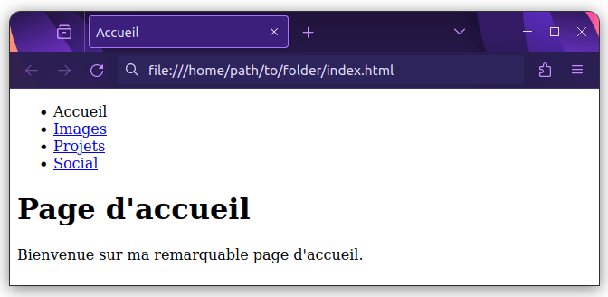

{{PreviousMenuNext("Learn_web_development/Core/Structuring_content/Structuring_documents", "Learn_web_development/Core/Structuring_content/Test_your_skills/Links", "Learn_web_development/Core/Structuring_content")}}

Les hyperliens (également appelés liens) sont vraiment importants — ils sont ce qui fait du Web _une toile_.
Cet article montre la syntaxe requise pour créer un lien et discute des bonnes pratiques en matière de liens.

<table>
  <tbody>
    <tr>
      <th scope="row">Prérequis&nbsp;:</th>
      <td>
        Être familier avec les bases du HTML, comme couvert dans
        <a href="/fr/docs/Learn_web_development/Core/Structuring_content/Basic_HTML_syntax"
          >Syntaxe de base du HTML</a
        >. Les sémantiques au niveau du texte telles que <a href="/fr/docs/Learn_web_development/Core/Structuring_content/Headings_and_paragraphs"
          >les titres et les paragraphes</a
        > et <a href="/fr/docs/Learn_web_development/Core/Structuring_content/Lists"
          >les listes</a
        >.
      </td>
    </tr>
    <tr>
      <th scope="row">Objectifs d'apprentissage&nbsp;:</th>
      <td>
        <ul>
          <li>Comprendre pourquoi les liens sont la fonctionnalité fondamentale du web. Il n'y a pas de web sans liens.</li>
          <li>L'attribut <code>href</code>.</li>
          <li>Les chemins absolus et relatifs, et quand les utiliser.</li>
          <li>La syntaxe des chemins en détail — barres obliques, point unique et double point.</li>
          <li>Les états des liens et pourquoi ils sont importants — <code>:hover</code>, <code>:focus</code>, <code>:visited</code>, et <code>:active</code>.</li>
          <li>Les liens en ligne et les liens de niveau bloc.</li>
          <li>Comprendre les avantages de rédiger un bon texte de lien, tels qu'une meilleure accessibilité pour les utilisateurs de lecteurs d'écran et des effets SEO potentiellement positifs.</li>
        </ul>
      </td>
    </tr>
  </tbody>
</table>

## Qu'est-ce qu'un hyperlien ?

Les hyperliens sont des fonctionnalités d'un document HTML qui, lorsqu'ils sont cliqués ou activés d'une autre manière, font en sorte que le navigateur navigue vers d'autres documents ou ressources, parfois des parties spécifiques de documents.
Les hyperliens sont l'une des innovations les plus passionnantes que le Web ait à offrir.
Ils sont présents sur le Web depuis le début et sont ce qui fait du Web _une toile_.
Chaque ressource sur le Web a une adresse, connue sous le nom de {{Glossary("URL")}} (<i lang="en">Uniform Resource Locator</i> en anglais), vers laquelle les hyperliens pointent.

> [!NOTE]
> Une URL peut pointer vers des fichiers HTML, des fichiers textes, des images, des documents texte, des fichiers vidéo ou audio et tout ce qui peut exister sur le Web.
> Si le navigateur web ne sait pas comment afficher ou gérer un fichier, il vous demande si vous voulez ouvrir le fichier (dans ce cas, la responsabilité de l'ouverture et de la gestion du fichier incombe à l'application native adéquate sur l'appareil) ou bien télécharger le fichier (auquel cas, vous pouvez essayer de vous en occuper plus tard).

La page d'accueil de la BBC, par exemple, contient un nombre important de liens pour pointer, non seulement vers de multiples articles d'actualité, mais encore vers d'autres zones du site (fonctionnalité de navigation), des pages d'inscription/de connexion (outils utilisateur·ice) et plus encore.


## Anatomie d'un lien

Un lien élémentaire se crée en intégrant le texte ou tout autre contenu que vous voulez transformer en lien dans un élément {{HTMLElement("a")}} et en lui affectant un attribut [`href`](/fr/docs/Web/HTML/Reference/Elements/a#href) (qui sera la **référence hypertexte**) contenant l'adresse web vers laquelle vous voulez que le lien pointe.

```html
<p>
  Je suis en train de créer un lien vers
  <a href="https://www.mozilla.org/fr/">la page d'accueil Mozilla</a>.
</p>
```

Qui donne le résultat suivant&nbsp;:

Je suis en train de créer un lien vers [la page d'accueil Mozilla](https://www.mozilla.org/fr/).

> [!NOTE]
> [Balises d'ancre <sup>(angl.)</sup>](https://scrimba.com/learn-html-and-css-c0p/~0a?via=mdn) Scrimba <sup>[_Partenaire d'apprentissage MDN_](/fr/docs/MDN/Writing_guidelines/Learning_content#liens_partenaires_et_intégrations)</sup> fournit une démonstration interactive de la création de liens en utilisant HTML, ainsi qu'un défi pour vous permettre de créer vos propres liens.

### é

Comme indiqué précédemment, presque tout contenu peut être transformé en lien, même les {{Glossary("Block/CSS", "éléments de niveau bloc")}}. Si vous voulez qu'un titre devienne un lien, enveloppez-le dans un élément d'ancrage (`<a>`), comme le montre l'extrait de code suivant&nbsp;:

```html
<a href="https://developer.mozilla.org/fr/">
  <h1>MDN Web Docs</h1>
</a>
<p>
  Documente les technologies web, y compris CSS, HTML et JavaScript, depuis
  2005.
</p>
```

Le titre devient ainsi un lien&nbsp;:
{{EmbedLiveSample("Liens avec les éléments de bloc", "100%", 120)}}

### Liens avec les images

Pour transformer une image en lien, enveloppez l'élément {{HTMLElement("img")}} avec un élément {{HTMLElement("a")}}. L'exemple ci-dessous utilise un chemin relatif pour référencer un fichier image SVG stocké localement.

```css hidden
img {
  height: 100px;
  width: 150px;
  border: 1px solid gray;
}
```

```html
<a href="https://developer.mozilla.org/fr/">
  
</a>
```

Le logo du MDN devient donc un lien&nbsp;:
{{EmbedLiveSample("Liens avec les images", "100%", 150)}}

> [!NOTE]
> Vous en saurez plus sur l'utilisation des images sur le Web dans un futur article.

### Ajouter des informations avec l'attribut `title`

Vous pouvez également ajouter un attribut `title` à vos liens.
Le titre contient des informations supplémentaires sur le lien, telles que le type d'informations contenues dans la page ou les éléments à prendre en compte sur le site web.

```html
<p>
  Je suis en train de créer un lien à
  <a
    href="https://www.mozilla.org/fr/"
    title="Le meilleur endroit pour trouver plus d'informations sur la mission de Mozilla et la manière de contribuer"
    >la page d'accueil Mozilla</a
  >.
</p>
```

Nous obtenons le résultat suivant et le survol du lien affiche le titre sous forme d'infobulle&nbsp;:

{{EmbedLiveSample("Ajouter des informations avec l'attribut `title`", "100%", 150)}}

> [!NOTE]
> Le titre d'un lien n'est révélé que lors du survol de la souris, ce qui signifie que les personnes utilisant les commandes clavier ou les écrans tactiles pour naviguer dans les pages web auront des difficultés à accéder aux informations du titre.
> Si une information de titre est vraiment importante pour l'utilisation d'une page, alors vous devez la présenter de manière plus accessible, par exemple en la mettant dans le texte normal.

### Créer vos propres exemples de liens

OK, maintenant c'est à vous de jouer&nbsp;!

1. Cliquez sur **«&nbsp;Exécuter&nbsp;»** dans le bloc de code ci-dessous pour éditer l'exemple dans le MDN Playground, ou faites une copie de notre [modèle de démarrage <sup>(angl.)</sup>](https://github.com/mdn/learning-area/blob/main/html/introduction-to-html/getting-started/index.html) et copiez le code ci-dessous dedans.
2. Liez le texte «&nbsp;Écureuil roux&nbsp;» et «&nbsp;Écureuil gris de l'Est&nbsp;» aux pages Wikipédia qui décrivent les espèces correspondantes. Donnez à chaque lien un attribut `title` égal au nom scientifique de l'espèce.
3. Liez le texte «&nbsp;Page Wikipédia sur les écureuils&nbsp;» à la page principale de Wikipédia sur les écureuils.

Si vous faites une erreur, vous pouvez effacer votre travail en utilisant le bouton _Réinitialiser_ dans le MDN Playground. Si vous êtes vraiment bloqué, vous pouvez consulter la solution sous le bloc de code.

```html live-sample___links-1
<h1>Les écureuils</h1>

<p>
  Les écureuils sont généralement considérés comme des mammifères arboricoles,
  mais la famille des écureuils s'étend bien au-delà pour inclure des rongeurs
  terrestres tels que les tamias et les chiens de prairie, ainsi que les
  écureuils volants.
</p>

<p>
  Deux des espèces d'écureuils les plus communes et les mieux connues
  sont&nbsp;:
</p>

<ul>
  <li>Écureuil roux</li>
  <li>Écureuil gris de l'Est</li>
</ul>

<p>
  Pour un bon point de départ sur les informations concernant les écureuils,
  consultez la page Wikipédia sur les écureuils.
</p>
```

{{EmbedLiveSample('links-1', "100%", 280)}}

<details>
<summary>Cliquez ici pour afficher la solution</summary>

Votre HTML final devrait ressembler à ceci&nbsp;:

```html
<h1>Les écureuils</h1>

<p>
  Les écureuils sont généralement considérés comme des mammifères arboricoles,
  mais la famille des écureuils s'étend bien au-delà pour inclure des rongeurs
  terrestres tels que les tamias et les chiens de prairie, ainsi que les
  écureuils volants.
</p>

<p>
  Deux des espèces d'écureuils les plus communes et les mieux connues
  sont&nbsp;:
</p>

<ul>
  <li>
    <a
      href="https://fr.wikipedia.org/wiki/%C3%89cureuil_roux"
      title="Sciurus vulgaris">
      Écureuil roux
    </a>
  </li>
  <li>
    <a
      href="https://fr.wikipedia.org/wiki/%C3%89cureuil_gris"
      title="Sciurus carolinensis">
      Écureuil gris de l'Est
    </a>
  </li>
</ul>

<p>
  Pour un bon point de départ sur les informations concernant les écureuils,
  consultez la
  <a href="https://fr.wikipedia.org/wiki/Sciuridae">
    page Wikipédia sur les écureuils </a
  >.
</p>
```

</details>

## Une brève présentation des URL et des chemins

Les cibles des liens sont des URL. Une URL, ou Uniform Resource Locator, est une chaîne de texte qui définit où se trouve quelque chose sur le Web. Par exemple, la page d'accueil anglaise de Mozilla se trouve à l'adresse `https://www.mozilla.org/fr/`.

Un [serveur web](/fr/docs/Learn_web_development/Howto/Web_mechanics/What_is_a_web_server) reçoit des requêtes pour des URL et répond avec la ressource appropriée. La plupart des ressources sont stockées sous forme de fichiers dans le système de fichiers du serveur, donc les URL de ces ressources ressemblent souvent à des chemins de fichiers.

> [!NOTE]
> Les chemins de fichiers et les URL ne sont pas la même chose, mais pour l'instant, nous allons en parler comme si c'était le cas pour faciliter la compréhension. Nous discuterons plus en détail des différences dans la section [comment les URL se traduisent-elles en chemins de fichiers ?](#how_do_urls_translate_into_file_paths).

Regardons un exemple de structure de répertoires sur un serveur&nbsp;:


La **racine** de cette structure de répertoires s'appelle `creating-hyperlinks`. Quand vous travaillez localement sur un site web, vous avez un dossier contenant l'intégralité du site. Dans la **racine**, nous avons un fichier `index.html` et un `contacts.html`. Sur un site réel, `index.html` serait notre page d'accueil ou portail (page web servant de point d'entrée à un site web ou à une section particulière d'un site web).

Il y a aussi deux répertoires dans la racine — `pdfs` et `projects`. Chacun d'eux comporte un seul fichier — respectivement un PDF (`project-brief.pdf`) et un fichier `index.html`. Notez que vous pouvez avoir plusieurs fichiers `index.html` dans un projet, tant qu'ils se trouvent dans des emplacements différents du système de fichiers. Le second `index.html` serait peut-être la page d'accueil principale pour les informations relatives au projet.

Regardons quelques exemples de liens entre différents fichiers dans cette structure de répertoires pour démontrer différents types de chemins.

### Même répertoire

Si vous voulez inclure un hyperlien dans `index.html` (celui de plus haut niveau) pointant vers `contacts.html`, il suffit d'indiquer uniquement le nom du fichier auquel vous voulez le lier, car il est dans le même répertoire que le fichier actuel. Ainsi, l'URL à utiliser est `contacts.html`&nbsp;:

```html
<p>
  Voulez‑vous rencontrer un membre du personnel en particulier ? Voyez comment
  faire sur notre page <a href="contacts.html">Contacts</a>.
</p>
```

Vous pouvez également commencer un chemin vers un fichier dans le même répertoire en utilisant un point suivi d'une barre oblique&nbsp;: `./`. L'exemple suivant est équivalent au précédent, mais certaines personnes aiment inclure le `./` de toute façon, car elles estiment que cela apporte plus de clarté&nbsp;:

```html
<p>
  Voulez‑vous contacter un membre du personnel en particulier&nbsp;? Voyez
  comment faire sur notre page
  <a href="./contacts.html">Contacts</a>.
</p>
```

> [!NOTE]
> Il existe certaines situations où inclure `./` dans votre chemin fera une différence, par exemple lors de la spécification des chemins pour les [modules JavaScript](/fr/docs/Web/JavaScript/Guide/Modules), mais vous n'avez pas besoin de vous en préoccuper pour les liens HTML et CSS statiques.

### Descendre dans les sous-répertoires

Si vous désirez inclure un hyperlien dans `index.html` (`celui` de plus haut niveau) pointant vers `projects/index.html`, vous avez besoin de descendre dans le dossier `projects` avant d'indiquer le fichier auquel vous voulez vous lier. Cela se fait en indiquant le nom du dossier, suivi d'une barre oblique normale, puis le nom du fichier. Donc l'URL à utiliser sera `projects/index.html`&nbsp;:

```html
<p>
  Visitez la <a href="projects/index.html">page d'accueil</a> de mon projet.
</p>
```

### Remonter dans les dossiers parents

Si vous voulez inclure un hyperlien dans `projects/index.html` qui pointe vers `pdfs/projects-brief.pdf`, vous aurez besoin de monter dans le répertoire au niveau au‑dessus, puis de descendre dans le dossier `pdfs`. «&nbsp;Monter dans le répertoire au niveau au‑dessus&nbsp;» est indiqué avec deux points — `..` — de sorte que l'URL à utiliser sera `../pdfs/project‑brief.pdf`&nbsp;:

```html
<p>
  Voici un lien vers mon
  <a href="../pdfs/project-brief.pdf">sommaire de projet</a>.
</p>
```

> [!NOTE]
> Vous pouvez combiner plusieurs instances de ces fonctionnalités dans des URL complexes si nécessaire, par exemple `../../../chemin/complexe/vers/mon/fichier.html`.

### Lien relatif au document racine

Les URL ci-dessus fonctionnent, mais gardez à l'esprit que si vous déplacez le fichier de lien ou le fichier lié à un autre emplacement, vous romprez le lien.

Si vous souhaitez créer un lien vers un emplacement spécifique qui ne se rompra pas si vous déplacez le fichier de lien, vous pouvez le faire en mettant une seule barre oblique au début du chemin — cela indique que le chemin commence dans le répertoire racine du site. Par exemple, le lien précédent à l'intérieur de `projects/index.html` pourrait être réécrit comme suit&nbsp;:

```html
<p>
  Voici un lien vers mon
  <a href="/pdfs/project-brief.pdf">sommaire de projet</a>.
</p>
```

Maintenant, le chemin commencera toujours à partir du répertoire racine (`creating-hyperlinks`), se déplacera vers le répertoire `pdfs` et trouvera le fichier `project-brief.pdf`. Cela fonctionnera toujours si vous déplacez le fichier de lien à un autre emplacement, par exemple `a/b/c/d/e/index.html`.

Si vous déplacez le fichier lié `project-brief.pdf` à un autre emplacement, vous romperez toujours le lien.

Deux termes que vous rencontrerez sur le web sont **chemin absolu** et **chemin relatif**.

- Chemin absolu&nbsp;: Pointe vers un emplacement défini par son emplacement absolu dans votre site (ou ailleurs sur le web). Par exemple, vous pouvez créer un lien absolu qui pointe toujours vers le même emplacement par rapport au répertoire racine du site en utilisant la barre oblique unique au début du chemin, comme nous l'avons vu précédemment&nbsp;: `/pdfs/project-brief.pdf`.
- Chemin relatif&nbsp;: Pointe vers un emplacement qui est _relatif_ au fichier à partir duquel vous créez le lien. Dans notre exemple précédent, nous avons utilisé `projects/index.html` pour créer un lien relatif entre le fichier actuel et un fichier appelé `index.html` qui se trouve dans un sous-répertoire `projects`. Si vous déplaciez le fichier actuel à un autre emplacement, le chemin serait toujours relatif à ce fichier, mais il pointerait vers un emplacement absolu différent.

Ces termes ne sont pas toujours utilisés de manière cohérente. Par exemple, `/pdfs/project-brief.pdf` est absolu par rapport à l'emplacement du fichier actuel, mais relatif au [nom de domaine](/fr/docs/Learn_web_development/Howto/Web_mechanics/What_is_a_domain_name). Une URL qui inclut le nom de domaine complet, comme `https://exemple.com/pdfs/project-brief.pdf`, est absolue par rapport à l'ensemble du web.

### Lien avec des URL complètes

Vous pouvez définir une URL complète comme chemin, ce qui pointera toujours vers le même emplacement sur le web, peu importe où elle est utilisée. Par exemple&nbsp;:

```html
<a href="https://www.exemple.com/projects/">projets</a>
```

Ce lien pointera toujours vers `https://www.exemple.com/projects/`, même si votre site est déplacé vers un autre domaine.

### Liens internes et externes

Lorsqu'un lien pointe vers une ressource sur _votre_ site, il est appelé **lien interne**. Lorsqu'un lien pointe vers une ressource sur un site _différent_, il est appelé **lien externe**.

Lors de la spécification d'un lien externe, vous devez toujours inclure l'URL complète comme chemin, par exemple&nbsp;:

```html
<a href="https://www.sun-autre-site.com">projets</a>
```

Vous ne pouvez pas référencer un emplacement sur un site différent avec un chemin comme `/pdfs/project-brief.pdf` ou `projects/index.html`, car ils sont tous deux relatifs à un emplacement sur votre propre site, et le navigateur a besoin du nom de domaine du site Web pour pouvoir le trouver.

Lors de la spécification d'un lien interne, vous pouvez utiliser un chemin relatif ou absolu, ou une URL complète. Dans notre exemple, ces liens sont équivalents&nbsp;:

```html
<a href="https://www.exemple.com/projects/">projets</a>

<a href="projects">projets</a>
```

Nous recommandons la seconde option sans le nom de domaine complet, pour des raisons de portabilité. Comme nous l'avons dit précédemment, si vous définissez `https://www.exemple.com/projects/`, cela pointera toujours vers `https://www.exemple.com/projects/`. Si vous déplacez ensuite votre site vers un autre domaine, par exemple `autre-exemple.com`, tous vos liens avec l'URL complète devront être modifiés. Si vous définissez des chemins tels que `/projects`, ils fonctionneront toujours, car ils sont toujours relatifs à la structure des répertoires.

### Fragments de documents

Il est possible de faire un lien vers une partie donnée d'un document HTML, qu'on appelle un **fragment de document**, plutôt que vers le haut du document.
Pour ce faire, vous devrez d'abord assigner un attribut [`id`](/fr/docs/Web/HTML/Reference/Global_attributes/id) à l'élément vers lequel vous voulez pointer.

Il est généralement logique d'établir un lien vers une rubrique précise, ainsi cela ressemble à quelque chose comme&nbsp;:

```html
<h2 id="contact_mail">Adresse de contact</h2>
```

Puis, pour faire un lien vers cet `id` précisément, il convient de l'indiquer à la fin de l'URL, précédé d'un croisillon (`#`)&nbsp;:

```html
<p>
  Vous voulez nous écrire une lettre ? Utilisez notre
  <a href="contacts.html#contact_mail">adresse de contact</a>.
</p>
```

Vous pouvez même utiliser une référence au fragment de document seul pour faire un lien vers _une autre partie du même document_&nbsp;:

```html
<p>
  Vous trouverez <a href="#contact_mail">notre adresse</a> au bas de cette page.
</p>
```

### Comment les URL sont-elles traduites en chemins de fichiers ?

Toutes les cibles de liens que nous avons vues jusqu'à présent sont des _URL_, qui sont traitées par un serveur web pour trouver la ressource concernée.
**Aucun contenu web ne peut voir directement le système de fichiers du serveur.**

L'exemple de serveur que nous avons vu jusqu'à présent crée un [site web statique](/fr/docs/Glossary/SSG).
Le serveur prend simplement la partie {{DOMxRef("URL/pathname", "pathname")}} de l'URL et recherche directement le fichier correspondant dans son système de fichiers.

> [!NOTE]
> De nombreux serveurs génèrent du contenu pour une URL à la volée plutôt que de le récupérer à partir d'un fichier statique. Si vous utilisez un [cadre web](/fr/docs/Learn_web_development/Core/Frameworks_libraries), votre répertoire de code source peut également être très différent de ce qui est déployé sur le serveur. Lorsque vous travaillez avec votre propre site web, vous devez comprendre vos outils de construction et la configuration de votre serveur pour savoir comment les URL sont associées à vos fichiers sources.

Si nous démarrons un serveur web (voir [Comment configurer un serveur de test local&nbsp;?](/fr/docs/Learn_web_development/Howto/Tools_and_setup/set_up_a_local_testing_server)) en utilisant notre dossier d'exemple comme racine, et que le {{Glossary("domain name", "nom de domaine")}} du site est défini sur `exemple.com`, notre fichier `pdfs/project-brief.pdf` serait disponible à l'adresse `https://www.exemple.com/pdfs/project-brief.pdf`.

Tous les liens sont résolus par rapport à l'URL du document courant, donc&nbsp;:

- Pour toutes les pages du domaine `https://exemple.com`, un lien vers `/pdfs/project-brief.pdf` crée toujours un lien vers `https://www.exemple.com/pdfs/project-brief.pdf`, dont le chemin est `/pdfs/project-brief.pdf`. Le serveur recherche le dossier `pdfs` dans le répertoire racine, puis recherche le fichier `project-brief.pdf` à l'intérieur de ce dossier.
- Un lien vers `projects/index.html` créerait un lien vers `https://www.exemple.com/projects/index.html`, mais seulement lorsqu'il est inclus dans un fichier situé dans le répertoire racine, comme le fichier `index.html` de niveau supérieur, ou `contacts.html`. Si vous l'incluiez, par exemple, dans un fichier HTML à `pdfs/index.html`, il pointerait vers `https://www.exemple.com/pdfs/projects/index.html`, dont le chemin est `/pdfs/projects/index.html`, qui n'existe pas, donc vous obtiendriez un lien brisé.

#### La page `index.html` par défaut

Lorsque vous faites référence à un fichier `index.html`, vous n'avez généralement pas besoin d'inclure `index.html` dans l'URL/chemin, car les serveurs web recherchent une page d'accueil par défaut appelée `index.html` lorsqu'aucun nom de fichier n'est précisé.

En reprenant notre exemple de chemin `projects/index.html`, nous pourrions simplement écrire le chemin comme `projects`, et cela créerait un lien vers `https://www.exemple.com/projects/index.html`. Lors de la navigation vers la page, nous pourrions écrire l'URL comme `https://www.exemple.com/projects/` et cela nous amènerait toujours au bon endroit.

> [!NOTE]
> La barre oblique finale (`/`) à la fin de l'URL est importante. Avec elle, un lien relatif vers `contacts.html` à l'intérieur de `projects/index.html` se résoudrait en `https://www.exemple.com/projects/contacts.html` (qui se trouve dans le même dossier). Sans elle, l'URL serait traitée comme un fichier, et le lien relatif se résoudrait en `https://www.exemple.com/contacts.html` (qui est un dossier au-dessus).
>
> [Différents serveurs web gèrent une URL comme `https://www.exemple.com/projects` différemment <sup>(angl.)</sup>](https://github.com/slorber/trailing-slash-guide) — certains redirigent automatiquement vers l'URL avec une barre oblique finale, tandis que d'autres servent le même `index.html` sans redirection. Ce dernier comportement peut casser les liens relatifs.

## Bonnes pratiques pour les liens

Il y a quelques bonnes pratiques à suivre pour l'écriture de liens. Voyons en quoi elles consistent.

### Utilisez une formulation claire des liens

Il est facile de mettre des liens sur une page. Mais ce n'est pas suffisant. Nous devons rendre nos liens _accessibles_ à toutes et tous, indépendamment de leur contexte d'installation et des outils utilisés. Par exemple&nbsp;:

- Les utilisateur·ice·s de lecteurs d'écran passent d'un lien à un autre sur une page, et les lisent hors contexte.
- Les moteurs de recherche utilisent le texte des liens pour indexer les fichiers cibles, c'est donc une bonne idée que d'inclure des mots-clés dans le texte du lien pour décrire effectivement à quoi il est lié.
- Les utilisateur·ice·s visuels survolent la page plutôt que d'en lire chaque mot, et leurs yeux seront forcément attirés par les particularités qui se détachent de la page, comme les liens. Ils trouveront utile le texte descriptif du lien.

Regardons un premier exemple correct&nbsp;:

**Bonne pratique** de lien textuel&nbsp;: [Télécharger Firefox](https://www.firefox.com/fr/?redirect_source=firefox-fr)

```html example-good
<p>
  <a href="https://www.firefox.com/fr/">Télécharger Firefox</a>
</p>
```

**Mauvaise pratique** de lien textuel&nbsp;: [Cliquer ici](https://www.firefox.com/fr/) pour télécharger Firefox

```html example-bad
<p>
  <a href="https://www.firefox.com/fr/">Cliquer ici</a> pour télécharger Firefox
</p>
```

Autres conseils&nbsp;:

- Ne répétez pas l'URL dans le texte du lien — les URL ne sont pas particulièrement lisibles par une personne, et c'est encore pire à entendre quand un lecteur d'écran les épèle.
- Ne dites pas «&nbsp;lien&nbsp;» ou «&nbsp;liens vers…&nbsp;» dans le texte du lien — ce n'est que du rabâchage. Les lecteurs d'écran indiquent aux gens qu'il y a un lien. Les personnes navigant visuellement verront aussi qu'il y a un lien, du fait que les liens sont généralement de couleur différente et soulignés (de façon générale, cette convention tacite ne devrait pas être trahie, car les personnes y sont habituées).
- Faites que vos libellés de lien soient aussi courts que possible — les liens longs agacent particulièrement les utilisateur·ice·s de lecteurs d'écran, qui doivent en écouter la lecture entière.
- Minimiser les cas où plusieurs copies d'un même texte pointent vers des emplacements différents. Afficher une liste de liens hors contexte peut poser problème aux utilisateur·ice·s de lecteurs d'écran&nbsp;: ainsi plusieurs liens tous étiquetés «&nbsp;cliquez ici&nbsp;», «&nbsp;cliquez ici&nbsp;», «&nbsp;cliquez ici&nbsp;» seront source de confusion.

### Indiquer clairement les liens vers des ressources qui ne sont pas HTML

Lorsque vous créez un lien vers une ressource qui sera téléchargée (comme un document PDF ou Word), diffusée (comme une vidéo ou un fichier audio) ou qui a un autre effet potentiellement inattendu (ouverture d'une fenêtre contextuelle), vous devez ajouter une formulation claire pour éviter toute confusion. Si vous êtes sur une connexion à faible bande passante, cliquer sur un lien et initier un téléchargement de plusieurs mégaoctets de façon inattendue pourrait poser problème, autant indiquer ces informations dans le texte du lien.

Voici quelques exemples suggérant les genres de texte pouvant être employé&nbsp;:

```html
<p>
  <a href="rapport-volumineux.pdf" download>
    Télécharger le rapport des ventes (PDF, 10Mo)
  </a>
</p>

<p>
  <a href="https://www.exemple.com/flux-video/" target="_blank">
    Regarder la vidéo (le flux s'ouvre dans un nouvel onglet, qualité HD)
  </a>
</p>
```

### Utilisez l'attribut `download` pour faire un lien vers un téléchargement

Quand vous faites un lien avec une ressource qui doit être téléchargée plutôt qu'ouverte dans le navigateur, vous pouvez utiliser l'attribut `download` pour fournir un nom d'enregistrement par défaut. Voici un exemple avec un lien de téléchargement vers la version Windows la plus récente de Firefox&nbsp;:

```html
<a
  href="https://download.mozilla.org/?product=firefox-latest-ssl&os=win64&lang=fr-FR"
  download="firefox-latest-64bit-installer.exe">
  Télécharger la version de Firefox pour Windows la plus récente
  (64-bit)(français, France)
</a>
```

### Quand ouvrir les liens dans un nouvel onglet

Par défaut, les liens s'ouvrent dans le même onglet que la page sur laquelle ils se trouvent, ce qui permet à l'utilisateur·ice de revenir à la page précédente en utilisant le bouton de retour du navigateur. Cependant, de nombreux sites (y compris MDN) choisissent d'ouvrir certains liens, en particulier les liens externes, dans un nouvel onglet. Cela se fait en définissant l'attribut [`target`](/fr/docs/Web/HTML/Reference/Elements/a#target) sur `"_blank"`.

```html
Firefox is developed by the
<a href="https://www.mozilla.org/fr/" target="_blank">Mozilla Foundation</a>.
```

Le choix d'ouvrir ou non les liens dans un nouvel onglet doit être une décision réfléchie, basée sur des considérations de conception de l'expérience utilisateur. Voici quelques éléments à prendre en compte&nbsp;:

- Ouvrir des liens dans un nouvel onglet présente les deux documents simultanément, ce qui est utile pour une navigation «&nbsp;parallèle&nbsp;». En revanche, les liens qui s'ouvrent dans le même onglet sont davantage une continuité de la page actuelle.
- Ouvrir des liens dans un nouvel onglet peut désorienter les utilisateur·ice·s habitué·e·s à utiliser le bouton de retour.
- Même lorsque les liens s'ouvrent par défaut dans le même onglet, les utilisateur·ice·s peuvent toujours choisir de les ouvrir dans un nouvel onglet, à l'aide de raccourcis clavier ou des options du menu contextuel. En revanche, les liens qui s'ouvrent dans un nouvel onglet sont difficiles à ouvrir dans le même onglet.
- Les utilisateur·ice·s de lecteurs d'écran peuvent être dérouté·e·s par les liens qui s'ouvrent dans un nouvel onglet, car ils·elles peuvent ne pas se rendre compte qu'un nouvel onglet a été ouvert, et perdre le contexte de leur emplacement sur la page.

Une approche courante consiste à ouvrir les liens externes dans de nouveaux onglets et les liens internes dans le même onglet.
Certain·e·s concepteur·ice·s préfèrent ouvrir tous les liens dans le même onglet.
Si vous ouvrez des liens dans de nouveaux onglets, il est alors recommandé de fournir des indices pour ces liens, comme une icône à côté du texte du lien.

## Créer un menu de navigation

Pour cet exercice, nous vous proposons de relier quelques pages entre elles à l'aide d'un menu de navigation pour créer un site web multi-pages. C'est une manière courante de créer un site web — la même structure de page est utilisée sur chaque page, y compris le même menu de navigation, donc lorsque les liens sont cliqués cela donne l'impression que vous restez au même endroit, et qu'un contenu différent est affiché.

Vous devrez faire des copies locales des quatre pages suivantes, toutes dans le même dossier. Pour une liste complète des fichiers, consultez le répertoire [navigation-menu-start <sup>(angl.)</sup>](https://github.com/mdn/learning-area/tree/main/html/introduction-to-html/navigation-menu-start)&nbsp;:

- [`index.html` <sup>(angl.)</sup>](https://github.com/mdn/learning-area/blob/main/html/introduction-to-html/navigation-menu-start/index.html)
- [`projects.html` <sup>(angl.)</sup>](https://github.com/mdn/learning-area/blob/main/html/introduction-to-html/navigation-menu-start/projects.html)
- [`pictures.html` <sup>(angl.)</sup>](https://github.com/mdn/learning-area/blob/main/html/introduction-to-html/navigation-menu-start/pictures.html)
- [`social.html` <sup>(angl.)</sup>](https://github.com/mdn/learning-area/blob/main/html/introduction-to-html/navigation-menu-start/social.html)

Pour cet exercice&nbsp;:

1. Ajoutez une liste non ordonnée à l'endroit indiqué sur une page, qui inclut les noms des pages à relier.
   Un menu de navigation est généralement juste une liste de liens, donc c'est sémantiquement correct.
2. Transformez chaque nom de page en un lien vers cette page.
3. Copiez le menu de navigation sur chaque page.
4. Sur chaque page, retirez uniquement le lien vers cette même page — il est déroutant et inutile pour une page d'inclure un lien vers elle-même.
   Et, l'absence de lien constitue un bon rappel visuel de la page sur laquelle vous vous trouvez actuellement.

L'exemple terminé devrait finir par ressembler à quelque chose comme ce qui suit&nbsp;:



> [!NOTE]
> Si vous coincez, ou n'êtes pas sûr·e d'avoir bien compris, vous pouvez vérifier le dossier [`navigation-menu-marked-up` <sup>(angl.)</sup>](https://github.com/mdn/learning-area/tree/main/html/introduction-to-html/navigation-menu-marked-up) pour voir la réponse correcte.

## Liens de courriel

Il est possible de créer des liens ou des boutons qui, lorsqu'ils sont cliqués, ouvrent un nouveau courriel sortant plutôt que de faire un lien vers une ressource ou une page.
Pour cela, on utilise un élément {{HTMLElement("a")}} dont l'attribut `href` contient une URL avec le schéma `mailto:`.

Sous sa forme la plus basique et la plus communément utilisée, un lien `mailto:` indique simplement l'adresse du destinataire voulu. Par exemple&nbsp;:

```html
<a href="mailto:nullepart@mozilla.org">Envoyer un courriel à nullepart</a>
```

Cela donne un lien qui ressemble à ceci&nbsp;: [Envoyer un courriel à nullepart](mailto:nullepart@mozilla.org).

En fait, l'adresse de courriel est optionnelle. Si vous l'omettez et que votre [`href`](/fr/docs/Web/HTML/Reference/Elements/a#href) est `"mailto:"`, une nouvelle fenêtre de courriel sortant sera ouverte par le client de courriel de l'utilisateur·ice sans adresse de destination.
C'est souvent utile pour des liens «&nbsp;Partager&nbsp;» sur lesquels les utilisateur·ice·s peuvent cliquer pour envoyer un courriel à l'adresse de leur choix.

### Fournir d'autres informations

En plus de l'adresse électronique, vous pouvez fournir d'autres informations. En fait, tous les champs d'en-tête standards peuvent être ajoutés à l'URL `mailto` fournie. Les champs les plus couramment utilisés sont `subject`, `cc` et `body` (qui n'est pas à proprement parler un champ d'en-tête, mais qui vous permet d'indiquer un court message de contenu pour le nouveau courriel). La valeur de chaque champ est encodée comme un paramètre de requête.

Voici un exemple incluant `cc` (<i lang="en">carbon copy</i>, pour les destinataires en copie), `bcc` (<i lang="en">blind cc</i>, pour les destinataires en copie cachée), `subject` (sujet) et `body`&nbsp;:

```html
<a
  href="mailto:nullepart@mozilla.org?cc=nom2@rapidtables.com&bcc=nom3@rapidtables.com&subject=L%27objet%20du%20courriel&body=Le%20corps%20du%20courriel">
  Envoyer un e-mail avec copie, copie cachée, sujet et corps de message
</a>
```

> [!NOTE]
> La valeur de chaque champ doit être encodée au format URL avec les caractères non imprimables (caractères invisibles comme les tabulations, retours chariot et sauts de page) et les espaces {{Glossary("Percent-encoding", "encodés en pourcentage")}}.
> Notez également l'utilisation du point d'interrogation (`?`) pour séparer l'URL principale des valeurs de champ, et de l'esperluette (&) pour séparer chaque champ dans l'URL `mailto:`.
> C'est la notation standard des requêtes URL.
> Voir [la documentation de la méthode HTTP `GET`](/fr/docs/Learn_web_development/Extensions/Forms/Sending_and_retrieving_form_data#la_méthode_get) pour comprendre pourquoi la notation de requête URL est habituellement utilisée.

Voici quelques autres exemples d'URL `mailto`&nbsp;:

- <mailto:>
- <mailto:nullepart@mozilla.org>
- <mailto:nullepart@mozilla.org,personne@mozilla.org>
- <mailto:nullepart@mozilla.org?cc=personne@mozilla.org>
- <mailto:nullepart@mozilla.org?cc=personne@mozilla.org\&subject=Ceci%20est%20l%27objet>

## Résumé

C'est tout pour les liens, du moins pour l'instant&nbsp;! Vous reviendrez sur les liens plus loin dans le cours lorsque vous commencerez à voir comment les mettre en forme. Ensuite, nous vous proposerons quelques tests pour vérifier à quel point vous avez compris et retenu les informations que nous avons fournies sur les liens.

{{PreviousMenuNext("Learn_web_development/Core/Structuring_content/Headings_and_paragraphs", "Learn_web_development/Core/Structuring_content/Advanced_text_features", "Learn_web_development/Core/Structuring_content")}}
