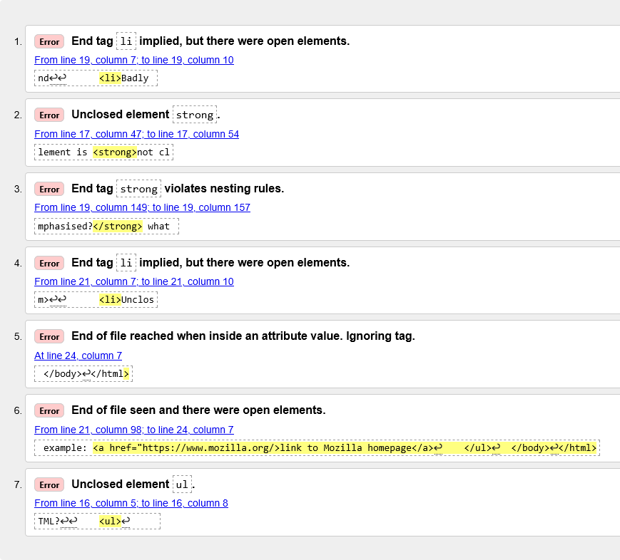

{{PreviousMenuNext("Learn_web_development/Core/Structuring_content/Forms_challenge", "Learn_web_development/Core/Styling_basics", "Learn_web_development/Core/Structuring_content")}}

Écrire du code HTML, c'est bien, mais si quelque chose se passe mal, que faire pour trouver où est l'erreur dans le code ? Cet article vous indique divers outils pour vous aider à trouver et corriger les erreurs en HTML.

<table>
  <tbody>
    <tr>
      <th scope="row">Prérequis&nbsp;:</th>
      <td>
        Connaissances de base en HTML, comme abordé dans
        <a href="/fr/docs/Learn_web_development/Core/Structuring_content/Basic_HTML_syntax"
          >Syntaxe HTML de base</a
        >. Sémantique au niveau du texte comme les <a href="/fr/docs/Learn_web_development/Core/Structuring_content/Headings_and_paragraphs"
          >titres et paragraphes</a
        > et les <a href="/fr/docs/Learn_web_development/Core/Structuring_content/Lists"
          >listes</a
        >. <a href="/fr/docs/Learn_web_development/Core/Structuring_content/Structuring_documents"
          >HTML structurel</a>.
      </td>
    </tr>
    <tr>
      <th scope="row">Objectifs d'apprentissage&nbsp;:</th>
      <td>
        <ul>
          <li>Les notions clés autour du débogage HTML</li>
          <li>Utiliser l'inspecteur DOM dans les outils de développement de votre navigateur pour explorer plus en profondeur votre code HTML.</li>
          <li>Explorer les types d'erreurs HTML courants.</li>
          <li>Utiliser le <a href="https://validator.w3.org/">validateur HTML <sup>(angl.)</sup></a> pour détecter les erreurs HTML.</li>
        </ul>
      </td>
    </tr>
  </tbody>
</table>

## Déboguer n'est pas un problème

Quand on écrit du code , tout va généralement bien, jusqu'au moment redouté où une erreur se produit — vous avez fait quelque chose d'incorrect, donc votre code ne fonctionne pas — soit pas du tout, soit pas tout à fait comme vous l'aviez souhaité. Par exemple, ce qui suit montre une erreur signalée lors d'une tentative de {{Glossary("compile", "compilation")}} d'un programme simple écrit en [Rust <sup>(angl.)</sup>](https://rust-lang.org/).


Ici, le message d'erreur est relativement facile à comprendre — «&nbsp;unterminated double quote string&nbsp;» : il manque un guillemet double ouvrant ou fermant pour envelopper la chaîne. Si vous regardez le listage, vous verrez `println!(Salut, Ô Monde!");` il manque un guillemet double. Cependant, des messages d'erreur peuvent devenir plus complexes et plus abscons au fur et à mesure que le programme grossit et, même dans des cas simples devenir intimidants à quelqu'un qui ne connaît rien du Rust.

Déboguer ne doit toutefois pas devenir un problème — la clé pour être à l'aise lors de l'écriture et du débogage d'un programme réside dans une bonne connaissance à la fois du langage et des outils.

## HTML et le débogage

HTML n'est pas aussi compliqué à comprendre que le Rust. HTML n'est pas compilé sous une forme différente avant que le navigateur n'ait fait son analyse et affiche le résultat (il est _interprété_, pas _compilé_). Et la syntaxe des {{Glossary("element", "éléments")}} HTML est sans doute beaucoup plus facile à comprendre qu'un «&nbsp;vrai langage de programmation&nbsp;» tel le Rust, le {{Glossary("JavaScript")}} ou le {{Glossary("Python")}}.

La façon dont les navigateurs analysent le HTML est beaucoup plus **permissive** que celle des langages de programmation, ce qui est à la fois une bonne et une mauvaise chose.

Que voulons‑nous dire par permissif&nbsp;? Et bien, quand vous faites une erreur dans du code, vous rencontrerez deux types principaux d'erreurs&nbsp;:

- **Erreurs de syntaxe**&nbsp;: ce sont des «&nbsp;fautes d'orthographe&nbsp;» dans le code qui font que le programme ne fonctionne vraiment pas, comme l'erreur du Rust ci‑dessus. Elles sont généralement faciles à corriger pour autant que vous soyez à l'aise avec la syntaxe du langage et que vous sachiez ce que signifie le message d'erreur.
- **Erreurs de logique**&nbsp;: ce sont des erreurs dans lesquelles la syntaxe est réellement correcte, mais pour lesquelles le code ne correspond pas à vos souhaits, ce qui veut dire que le programme ne s'exécute pas correctement. Elles sont généralement plus difficiles à corriger que les erreurs de syntaxe, car il n'y a pas de message d'erreur pour vous guider à la source de l'erreur.

Le HTML lui-même ne souffre pas d'erreurs de syntaxe, car les navigateurs l'analysent de manière permissive, ce qui signifie que la page s'affiche même s'il y a des erreurs de syntaxe dans le code source. Les navigateurs possèdent des règles intégrées pour indiquer comment interpréter un balisage HTML mal écrit (souvent appelé balisage **invalide** ou **mal formé**), le transformant automatiquement en un balisage valide.

Par exemple, l'extrait HTML suivant contient des éléments mal imbriqués&nbsp;:

```html example-bad
<p>
  Je ne m'attendais pas à trouver le <em>chat du voisin
  <strong>d'à côté</em></strong> ici&nbsp;!
</p>
```

La balise de fermeture `</strong>` devrait se trouver avant la balise de fermeture `</em>`, mais ce n'est pas le cas — elle est placée après.

Si vous chargez ce HTML dans un navigateur puis regardez le [rendu DOM](/fr/docs/Learn_web_development/Getting_started/Web_standards/How_browsers_load_websites#traitement_du_html), vous verrez que l'imbrication a été corrigée par le navigateur&nbsp;:

```html example-good
<p>
  Je ne m'attendais pas à trouver le
  <em>chat du voisin <strong>d'à côté</strong></em> ici&nbsp;!
</p>
```

Alors pourquoi est-ce à la fois une bonne et une mauvaise chose&nbsp;? Eh bien, dans ce cas, le navigateur a produit le résultat attendu, mais comme vous le verrez [plus loin](#à_votre_tour_étudier_le_html_avec_linspecteur_dom), ce n'est pas toujours le cas. Vous obtiendrez toujours _quelque chose_ qui fonctionne, mais le navigateur ne fait pas toujours ce qu'il faut, ce qui peut causer des problèmes. Il vaut mieux écrire un balisage correct dès le départ.

> [!NOTE]
> HTML est analysé de façon permissive parce que, lorsque le Web a été créé pour la première fois, on a décidé qu'il était plus important de permettre aux gens de publier leur contenu que de s'assurer d'une syntaxe absolument correcte. Le web ne serait probablement pas aussi populaire qu'il l'est aujourd'hui, s'il avait été plus strict dans ses débuts.

Alors, comment trouver les erreurs de balisage&nbsp;? Plus loin, nous vous montrerons comment trouver des erreurs dans le HTML à l'aide d'un outil appelé le [validateur HTML](#validation_dun_html), mais d'abord nous vous montrerons comment inspecter manuellement votre HTML à l'aide d'un **inspecteur DOM**, puis nous explorerons les types d'erreurs de balisage que vous pourriez rechercher, et comment le navigateur pourrait les interpréter.

## Utiliser l'inspecteur DOM

Tous les navigateurs modernes disposent d'un ensemble [d'outils de développement](/fr/docs/Learn_web_development/Howto/Tools_and_setup/What_are_browser_developer_tools) (devtools) intégrés, qui fournissent des fonctionnalités pour examiner la page web chargée dans l'onglet courant. Ceux-ci peuvent vous montrer quel HTML est rendu dans la page, quel CSS est appliqué à chaque nœud du DOM, quel JavaScript s'exécute dans la page, et plus encore. Ils vous permettent également de modifier le code en cours d'exécution et d'en voir l'effet en direct sur la page.

Vous pouvez ouvrir les outils de développement de façon similaire dans chaque navigateur — consultez [Comment ouvrir les outils de développement dans votre navigateur](/fr/docs/Learn_web_development/Howto/Tools_and_setup/What_are_browser_developer_tools#comment_ouvrir_les_outils_de_développement_dun_navigateur) pour savoir comment faire.

Pour cet article, la seule fonctionnalité pertinente des outils de développement est **l'inspecteur DOM**, qui affiche le DOM HTML actuellement rendu et vous permet de le modifier. Voyons cela maintenant&nbsp;:

1. Ouvrez les outils de développement dans votre navigateur.
2. Ouvrez l'inspecteur DOM. Il se trouve au même endroit dans chaque navigateur — le premier onglet des outils de développement, au début de la rangée. Dans Firefox, il est intitulé _Inspecteur_, tandis que dans Safari, Edge et Chrome, il est intitulé _Éléments_. Il s'agit généralement de l'onglet sélectionné par défaut lorsque vous ouvrez les outils de développement, mais sélectionnez-le si ce n'est pas le cas.
3. Examinez la structure de l'arbre DOM affichée dans l'onglet, et notez que vous pouvez cliquer sur les petites flèches d'expansion au début de chaque nœud DOM pour les développer et les réduire, et révéler leurs nœuds descendants. Vous pouvez également utiliser les touches fléchées haut et bas pour monter et descendre dans les nœuds, et les touches fléchées droite et gauche pour développer et réduire les nœuds.
4. Essayez également de survoler les nœuds (ou de les sélectionner avec les touches fléchées) et notez comment l'élément actuellement survolé (ou sélectionné) est mis en surbrillance dans la zone d'affichage.
5. Vous pouvez aussi modifier le DOM rendu. Nous n'utiliserons pas la fonctionnalité d'édition dans cet article, mais prenez le temps de chercher comment faire si cela vous intéresse.

### À votre tour : Étudier le HTML avec l'inspecteur DOM

Voici le moment venu d'étudier le caractère permissif du code HTML.

1. Tout d'abord, enregistrez le fichier HTML suivant sous le nom `debug-example.html`, quelque part sur votre machine locale. Cette démonstration est délibérément écrite avec quelques erreurs intégrées pour que nous puissions les explorer.

   ```html-nolint
   <!doctype html>
   <html lang="fr">
     <head>
       <meta charset="utf-8">
       <title>Exemple de HTML à déboguer</title>
     </head>

     <body>
       <h1>Exemple de HTML à déboguer</h1>
       <p>Quelles sont les causes d'erreur en HTML ?
       <ul>
         <li>>Éléments non fermés : si un élément n'est <strong>pas fermé proprement, ses effets peuvent déborder sur des zones que vous ne souhaitiez pas.
         <li>Éléments incorrectement imbriqués : imbriquer des éléments proprement est également très important pour que le code se comporte correctement. <strong>caractères gras <em>ou gras et italiques ?</strong> qu'est‑ce ?</em>
         <li>Attributs non fermés : autre source courante de problèmes en HTML. Voici un exemple: <a href="https://www.mozilla.org"> lien à la page d'accueil de Mozilla</a>
       </ul>
     </body>
   </html>
   ```

2. Ensuite, ouvrez‑le dans un navigateur. Vous verrez quelque chose comme ceci&nbsp;:

   

3. Constatons que ce n'est pas terrible&nbsp;; examinons le code source pour voir ce que nous pouvons en faire (seul le contenu de l'élément `body` est affiché)&nbsp;:

   ```html
   <h1>Exemple de HTML à déboguer</h1>

   <p>Quelles sont les causes d'erreur en HTML ?

   <ul>
     <li>Éléments non fermés : si un élément n'est <strong>pas
         fermé proprement, ses effets peuvent déborder sur des
         zones que vous ne souhaitiez pas.

     <li>Éléments incorrectement imbriqués : imbriquer des
         éléments proprement est également très important pour
         que le code se comporte correctement.
         <strong>caractères gras <em>ou gras et italiques ?</strong>
         qu'est‑ce ?</em>

     <li>Attributs non fermés : autre source courante de problèmes
         en HTML. Voici un exemple: <a href="https://www.mozilla.org">
         lien à la page d'accueil de Mozilla</a>
   </ul>
   ```

4. Revoyons les problèmes&nbsp;:
   - Les élements de {{HTMLElement("p", "paragraphes")}} et {{HTMLElement("li", "d'éléments de liste")}} n'ont pas de balise de fermeture. En voyant l'image ci‑dessus, cela ne semble pas avoir trop sévèrement affecté le rendu, car on voit bien où un élément se termine et où le suivant commence.
   - Le premier élément {{HTMLElement("strong")}} n'a pas de balise de fermeture. C'est un peu plus problématique, car il n'est pas possible de dire où l'élément est supposé se terminer. En fait, tout le reste du texte est en gras.
   - Cette partie est mal imbriquée&nbsp;: `<strong>caractères gras <em>ou gras et italiques ?</strong> qu'est ce ?</em>`. Pas facile de dire comment il faut interpréter cela en raison du problème précédent.
   - La valeur de l'attribut [`href`](/fr/docs/Web/HTML/Reference/Elements/a#href) n'a pas de guillemet double fermant. C'est ce qui semble avoir posé le plus gros problème — le lien n'a pas été mentionné du tout.

5. Revoyons maintenant comment le navigateur a vu le balisage, par comparaison au balisage du code source. Pour ce faire, utilisons les outils de développement du navigateur. Dans «&nbsp;l'Inspecteur&nbsp;», vous pouvez voir ce à quoi le balisage du rendu ressemble&nbsp;:
   
6. Regardez comment le navigateur a tenté de corriger nos erreurs HTML (nous avons fait la revue dans Firefox&nbsp;; les autres navigateurs modernes _devraient_ donner le même résultat)&nbsp;:
   - Les paragraphes et les éléments de liste ont été pourvus de balises fermantes.
   - L'endroit où le premier élément `<strong>` doit être fermé n'est pas clair, donc le navigateur a enveloppé séparément chaque bloc de texte avec ses propres balises `strong`, jusqu'à la fin du document&nbsp;!
   - L'imbrication incorrecte a été corrigée ainsi&nbsp;:

     ```html
     <strong
       >caractères gras
       <em>ou caractères gras et italiques&nbsp;?</em>
     </strong>
     <em> qu'est ce&nbsp;?</em>
     ```

   - Le lien avec les guillemets manquants a été illico détruit. Le dernier élément `li` ressemble à ceci&nbsp;:

     ```html
     <li>
       <strong
         >Attributs non fermés : autre source courante de problèmes en HTML.
         Voici un exemple&nbsp;:</strong
       >
     </li>
     ```

### Validation d'un HTML

Vous pouvez voir d'après l'exemple ci-dessus qu'il est vraiment important de s'assurer que votre HTML est bien formé&nbsp;! Mais comment faire&nbsp;? Dans un petit exemple comme celui vu ci-dessus, il est facile de parcourir les lignes et de trouver les erreurs, mais qu'en est-il d'un document HTML énorme et complexe&nbsp;?

L'outil adapté à cette tâche est le [Markup Validation Service <sup>(angl.)</sup>](https://validator.w3.org/) (ou **validateur HTML**), qui est créé et maintenu par le W3C (dont vous avez entendu parler dans [Le modèle des standards du web](/fr/docs/Learn_web_development/Getting_started/Web_standards/The_web_standards_model)). Le validateur prend un document HTML en entrée, le parcourt et vous fournit un rapport pour vous indiquer ce qui ne va pas dans votre HTML.


Pour indiquer le HTML à valider, vous pouvez fournir une adresse web, téléverser un fichier HTML ou saisir directement du code HTML.

### Valider un document HTML

Dans cette tâche, nous allons vous faire essayer le validateur HTML. Vous allez valider notre [document d'exemple <sup>(angl.)</sup>](https://github.com/mdn/learning-area/blob/main/html/introduction-to-html/debugging-html/debug-example.html) et voir quels résultats sont retournés. Cet exemple contient le même HTML que vous avez étudié précédemment avec l'inspecteur DOM.

1. D'abord, chargez le [Markup Validation Service <sup>(angl.)</sup>](https://validator.w3.org/) dans un nouvel onglet du navigateur, si ce n'est pas déjà fait.
2. Passez à l'onglet [Validate by Direct Input <sup>(angl.)</sup>](https://validator.w3.org/#validate_by_input).
3. Copiez tout le code du document d'exemple (pas seulement le `body`) et collez-le dans la grande zone de texte affichée dans le Markup Validation Service.
4. Appuyez sur le bouton _Check_.

Cela devrait vous donner une liste d'erreurs et d'autres informations.



#### Interprétation des messages d'erreur

Les messages d'erreur sont généralement utiles, mais parfois non ; avec un peu de pratique, vous trouverez comment les interpréter pour corriger votre code. Passons en revue les messages d'erreur et voyons leur signification. Chaque message est accompagné d'un numéro de ligne et de colonne pour faciliter la localisation de l'erreur.

- «&nbsp;End tag `li` implied, but there were open elements&nbsp;» (2 instances)&nbsp;: ces messages indiquent qu'un élément ouvert devrait être fermé. La balise de fermeture est implicite, mais pas réellement mise. L'information ligne/colonne pointe sur la première ligne après laquelle la balise de fermeture devrait réellement se situer, mais c'est un bon indice pour voir ce qui ne va pas.
- «&nbsp;Unclosed element `strong`&nbsp;»&nbsp;: C'est facile à comprendre — un élément {{HTMLElement("strong")}} n'est pas fermé ; l'information ligne/colonne pointe directement dessus.
- «&nbsp;End tag `strong` violates nesting rules&nbsp;»&nbsp;: signale des éléments incorrectement imbriqués et l'information ligne/colonne signale là où cela se trouve.
- «&nbsp;End of file reached when inside an attribute value. Ignoring tag&nbsp;»&nbsp;: c'est peu clair&nbsp;; la remarque se rapporte au fait qu'il y a une valeur d'attribut improprement formée quelque part, peut-être près de la fin du fichier car la fin du fichier apparaît dans la valeur de l'attribut. Le fait que le navigateur ne rende pas le lien est un bon indice pour dire que cet élément est en faute.
- «&nbsp;End of file seen and there were open elements&nbsp;»&nbsp;: c'est un peu ambigu, mais se réfère au fait qu'à la base des éléments ouverts n'ont pas été proprement fermés. Les numéros de ligne pointent sur les dernières lignes du fichier et ce message d'erreur vient avec une ligne de code qui désigne un exemple d'élément ouvert&nbsp;:

  ```
  exemple : <a href="https://www.mozilla.org/>lien à la page d'accueil de Mozilla</a> ↩ </ul>↩ </body>↩</html>
  ```

  > [!NOTE]
  > Un attribut sans guillemet fermant peut entraîner un élément ouvert car le reste du document est interprété comme le contenu de l'attribut.

- «&nbsp;Unclosed element `ul`&nbsp;»&nbsp;: n'est pas vraiment utile, car l'élément {{HTMLElement("ul")}} _est_ correctement fermé. Cette erreur ressort car l'élément {{HTMLElement("a")}} n'est pas fermé en raison de l'absence de guillemet fermant.

Si vous ne comprenez pas ce que signifie chaque message d'erreur, ne vous inquiétez pas — une bonne idée consiste à corriger quelques erreurs à la fois. Puis essayez de revalider le HTML pour voir les erreurs restantes. Parfois, la correction d'une erreur en amont permet aussi d'éliminer d'autres messages d'erreur — plusieurs erreurs sont souvent causées par un même problème, avec une sorte d'effet domino.

Vous saurez que toutes vos erreurs sont corrigées lorsque vous verrez une petite bannière verte indiquant qu'il n'y a aucune erreur à signaler. Au moment de la rédaction, elle affichait «&nbsp;Vérification du document terminée. Aucune erreur ou avertissement à afficher.&nbsp;»

## Résumé

Voilà, une introduction au débogage HTML, qui devrait vous donner des compétences utiles sur lesquelles vous appuyer lors du débogage HTML, mais aussi du code CSS et JavaScript plus tard dans le cours. Cela marque également la fin du module _Structurer le contenu avec HTML_.

{{PreviousMenuNext("Learn_web_development/Core/Structuring_content/Forms_challenge", "Learn_web_development/Core/Styling_basics", "Learn_web_development/Core/Structuring_content")}}
