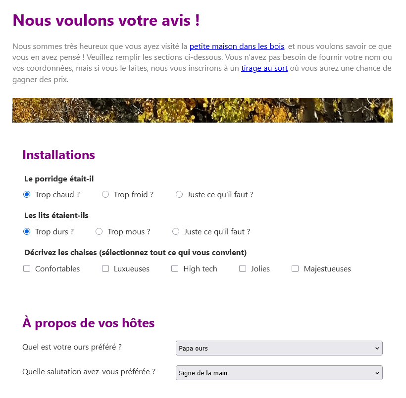

{{PreviousMenuNext("Learn_web_development/Core/Structuring_content/Test_your_skills/Forms_and_buttons", "Learn_web_development/Core/Structuring_content/Debugging_HTML", "Learn_web_development/Core/Structuring_content")}}

Dans ce défi, nous allons tester votre capacité à créer et structurer un formulaire, ainsi qu'à ajouter certaines autres fonctionnalités HTML.

## Point de départ

Pour résoudre ce défi, nous attendons de vous que vous créiez un projet de site web de base, soit dans un dossier sur le disque dur de votre ordinateur, soit en utilisant un éditeur en ligne tel que [CodePen <sup>(angl.)</sup>](https://codepen.io/) ou [JSFiddle <sup>(angl.)</sup>](https://jsfiddle.net/). Une grande partie du code dont vous avez besoin est déjà fournie sur cette page.

1. Créez un nouveau dossier à un emplacement approprié sur votre ordinateur appelé `forms-challenge` (ou ouvrez un éditeur en ligne et effectuez les étapes nécessaires pour créer un nouveau projet).
2. Enregistrez le listing HTML suivant dans un fichier à l'intérieur de votre dossier appelé `index.html` (ou collez-le dans le volet HTML de votre éditeur en ligne).

   ```html-nolint
   <!doctype html>
   <html lang="fr">
     <head>
       <meta charset="utf-8" />
       <title>Formulaire du défi</title>
       <link href="style.css" rel="stylesheet" />
       <script defer src="index.js"></script>
     </head>
     <body>
       Nous voulons votre avis&nbsp;!

       Nous sommes très heureux que vous ayez visité la petite maison
       dans les bois, et nous voulons savoir ce que vous en avez
       pensé&nbsp;! Veuillez remplir les sections ci-dessous. Vous n'avez
       pas besoin de fournir votre nom ou vos coordonnées, mais si vous
       le faites, nous vous inscrirons à un tirage au sort où vous aurez
       la chance de gagner des prix.

       --

       Installations

       Le porridge était-il
       Trop chaud&nbsp;?
       Trop froid&nbsp;?
       Juste ce qu'il faut&nbsp;?

       Les lits étaient-ils
       Trop durs&nbsp;?
       Trop mous&nbsp;?
       Juste ce qu'il faut&nbsp;?

       Décrivez les chaises (sélectionnez tout ce qui vous convient)
       Confortables
       Luxueuses
       High tech
       Jolies
       Majestueuses

       --

       À propos de vos hôtes

       Quel est votre ours préféré&nbsp;?
       Papa ours
       Maman ours
       Junior
       Dozer

       Quelle salutation avez-vous préférée&nbsp;?
       Signe de la main
       Salutation amicale
       Grognement
       Marques de griffes sur la porte

       --

       D'autres commentaires&nbsp;?

       Donnez-nous vos commentaires

       --

       Vos coordonnées

       Nom
       Courriel
       Téléphone

       --

       Envoyer

       --
     </body>
   </html>
   ```

3. Sauvegardez la feuille de style CSS suivante dans un fichier à l'intérieur de votre dossier appelé `style.css` (ou collez-la dans le volet CSS de votre éditeur en ligne).

   ```css
   /* Mise en forme de base des polices */

   body {
     background-color: white;
     color: #333333;
     font: 1em / 1.4 system-ui;
     padding: 1em;
     width: 800px;
     margin: 0 auto;
   }

   h1 {
     font-size: 2rem;
   }

   h2 {
     font-size: 1.6rem;
   }

   h1,
   h2 {
     margin: 0 0 20px;
     color: purple;
   }

   * {
     box-sizing: border-box;
   }

   p {
     color: gray;
     margin: 0.5em 0;
   }

   /* Structure du formulaire */

   fieldset {
     border: 0;
     padding: 0;
   }

   legend {
     padding-bottom: 10px;
     font-weight: bold;
   }

   fieldset,
   .separator {
     margin-bottom: 20px;
   }

   .form-section {
     margin-bottom: 20px;
     padding: 20px;
   }

   img {
     max-width: 100%;
     height: 50px;
     margin: 20px 0;
   }

   /* Éléments individuels du formulaire */

   fieldset input {
     margin: 0 10px 0 0;
   }

   label {
     margin-right: 40px;
   }

   textarea {
     margin-top: 10px;
     padding: 5px;
     width: 100%;
     height: 200px;
   }

   .separator {
     display: flex;
   }

   .separator label {
     flex: 2;
   }

   .separator input,
   .separator select {
     flex: 3;
     padding: 5px;
   }

   button {
     padding: 10px 20px;
     border-radius: 10px;
     border: 1px solid grey;
     background-color: #dddddd;
     width: 50%;
     margin: 0 auto;
     display: block;
   }

   button:hover,
   button:focus {
     background-color: #eeeeee;
     cursor: pointer;
   }
   ```

## Cahier des charges du projet

Nous vous demandons d'imaginer que vous venez de séjourner dans un hôtel appelé la petite maison dans les bois (enfin, du moins vous pensiez que c'était un hôtel). Nous souhaitons que vous nous aidiez à créer un formulaire de retour d'expérience fictif pour cet hôtel. En plus de baliser les fonctionnalités requises et de structurer le formulaire, il y a quelques fonctionnalités HTML supplémentaires que nous voulons que vous mettiez en œuvre.

### Implémenter les contrôles de formulaire

1. Dans la section «&nbsp;Installations&nbsp;», transformez les deux premiers groupes de lignes en groupes de boutons radio avec un libellé pour décrire chacun et une légende décrivant l'ensemble du groupe. Ajoutez un attribut pour que le premier bouton radio de chaque groupe soit sélectionné par défaut.
2. Dans la section «&nbsp;Installations&nbsp;», transformez le troisième groupe de lignes en un groupe de cases à cocher, avec un libellé pour chacune et une légende décrivant l'ensemble du groupe.
3. Dans la section «&nbsp;À propos de vos hôtes&nbsp;», transformez les deux groupes de lignes en menus déroulants d'options, avec un libellé pour chacun.
4. Dans la section «&nbsp;Autres commentaires&nbsp;?&nbsp;», ajoutez une zone de saisie de texte multiligne et transformez la ligne existante en son libellé descriptif.
5. Dans la section «&nbsp;Vos coordonnées&nbsp;», ajoutez un type de champ de saisie adapté pour recueillir chacune des trois valeurs listées. Transformez les lignes existantes en leurs libellés.
6. Transformez «&nbsp;Envoyer&nbsp;» en un bouton d'envoi pour le formulaire.

### Structurer le formulaire

1. Enveloppez le formulaire dans un élément conteneur approprié pour définir l'ensemble comme un formulaire.
2. Ajoutez des éléments structurels répétitifs à l'intérieur du formulaire, pour envelopper chaque section du formulaire. Donnez à chaque élément de section de formulaire une `class` de `form-section`. Pour faciliter les choses, chaque section de formulaire est entourée de deux ensembles de doubles tirets (`--`). Vous pouvez supprimer les doubles tirets une fois que vous avez ajouté vos éléments structurels.
3. Vous devrez inclure des éléments structurels supplémentaires autour de certaines paires contrôle/libellé pour les faire tenir sur leurs propres lignes séparées. Ajoutez-les maintenant, en leur donnant une `class` de `separator`.
4. Ajoutez un élément de saut de ligne entre la zone de saisie de texte multiligne et son libellé pour les séparer.

### Fonctionnalités HTML supplémentaires

1. Le texte comporte plusieurs titres qui doivent être balisés à l'aide d'éléments appropriés&nbsp;:
   1. Le titre de niveau supérieur : «&nbsp;Nous voulons connaître votre avis&nbsp;!&nbsp;».
   2. Les titres de niveau secondaire : «&nbsp;Installations&nbsp;», «&nbsp;À propos de vos hôtes&nbsp;», «&nbsp;D'autres commentaires ?&nbsp;» et «&nbsp;Vos coordonnées&nbsp;».
2. Le paragraphe d'ouverture sous le titre de niveau supérieur doit être balisé de manière appropriée.
3. Dans le paragraphe d'ouverture, transformez également le texte «&nbsp;petite maison dans les bois&nbsp;» et «&nbsp;tirage au sort&nbsp;» en liens. Nous n'avons pas encore de pages vers lesquelles les lier, donc pour l'instant, définissez l'URL cible sur `#` comme espace réservé.
4. Nous voulons que vous placiez une image large et plate sous le paragraphe d'ouverture à des fins décoratives. Le chemin de l'image est `https://mdn.github.io/shared-assets/images/examples/learn/woodland-strip.jpg`, et nous souhaitons que vous définissiez le texte alternatif sur une valeur vide, étant donné qu'elle est uniquement décorative.
5. Dans la continuité du point précédent, en tant qu'objectif supplémentaire, recherchez une meilleure façon d'intégrer l'image décorative à la page, et essayez de le faire (cela implique une technologie différente du HTML, que nous n'avons pas abordée dans ce module).

## Conseils et astuces

- Utilisez le [validateur HTML du W3C <sup>(angl.)</sup>](https://validator.w3.org/) pour détecter les erreurs involontaires dans votre HTML — afin de pouvoir les corriger.
- Si vous êtes bloqué et que vous ne pouvez pas envisager quels éléments mettre où, dessinez un simple diagramme de blocs de la mise en page de la page, et notez sur les éléments que vous pensez devoir envelopper chaque bloc. Cela est extrêmement utile.

## Exemple

La capture d'écran suivante montre un exemple de ce à quoi le formulaire pourrait ressembler après avoir été balisé. Si vous êtes bloqué sur la façon de réaliser certaines parties, consultez la solution ci-dessous l'exemple en direct.



<details>
<summary>Cliquez ici pour afficher la solution</summary>

Votre HTML final devrait ressembler à ceci&nbsp;:

```html
<!doctype html>
<html lang="fr">
  <head>
    <meta charset="utf-8" />
    <title>Formulaire du défi</title>
    <link href="style.css" rel="stylesheet" />
    <script defer src="index.js"></script>
  </head>
  <body>
    <h1>Nous voulons votre avis&nbsp;!</h1>

    <p>
      Nous sommes très heureux que vous ayez visité la
      <a href="#">petite maison dans les bois</a>, et nous voulons savoir ce que
      vous en avez pensé&nbsp;! Veuillez remplir les sections ci-dessous. Vous
      n'avez pas besoin de fournir votre nom ou vos coordonnées, mais si vous le
      faites, nous vous inscrirons à un <a href="#">tirage au sort</a> où vous
      aurez une chance de gagner des prix.
    </p>

    

    <form>
      <div class="form-section">
        <h2>Installations</h2>

        <fieldset>
          <legend>Le porridge était-il</legend>
          <input
            type="radio"
            id="porridge-1"
            name="porridge"
            value="hot"
            checked /><label for="porridge-1">Trop chaud&nbsp;?</label>
          <input
            type="radio"
            id="porridge-2"
            name="porridge"
            value="cold" /><label for="porridge-2">Trop froid&nbsp;?</label>
          <input
            type="radio"
            id="porridge-3"
            name="porridge"
            value="right" /><label for="porridge-3"
            >Juste ce qu'il faut&nbsp;?</label
          >
        </fieldset>

        <fieldset>
          <legend>Les lits étaient-ils</legend>
          <input
            type="radio"
            id="beds-1"
            name="beds"
            value="hard"
            checked /><label for="beds-1">Trop durs&nbsp;?</label>
          <input type="radio" id="beds-2" name="beds" value="soft" /><label
            for="beds-2"
            >Trop mous&nbsp;?</label
          >
          <input type="radio" id="beds-3" name="beds" value="right" /><label
            for="beds-3"
            >Juste ce qu'il faut&nbsp;?</label
          >
        </fieldset>

        <fieldset>
          <legend>
            Décrivez les chaises (sélectionnez tout ce qui vous convient)
          </legend>
          <input type="checkbox" id="comfy" name="comfy" /><label for="comfy"
            >Confortables</label
          >
          <input type="checkbox" id="luxurious" name="luxurious" /><label
            for="luxurious"
            >Luxueuses</label
          >
          <input type="checkbox" id="hi-tech" name="hi-tech" /><label
            for="hi-tech"
            >High tech</label
          >
          <input type="checkbox" id="pretty" name="pretty" /><label for="pretty"
            >Jolies</label
          >
          <input type="checkbox" id="majestic" name="majestic" /><label
            for="majestic"
            >Majestueuses</label
          >
        </fieldset>
      </div>

      <div class="form-section">
        <h2>À propos de vos hôtes</h2>

        <div class="separator">
          <label for="favorite">Quel est votre ours préféré&nbsp;?</label>
          <select name="favorite" id="favorite">
            <option value="papa">Papa ours</option>
            <option value="mama">Maman ours</option>
            <option value="junior">Junior</option>
            <option value="randy">Cousin Randy</option>
          </select>
        </div>

        <div class="separator">
          <label for="greeting"
            >Quelle salutation avez-vous préférée&nbsp;?</label
          >
          <select name="greeting" id="greeting">
            <option value="papa">Signe de la main</option>
            <option value="mama">Salutation amicale</option>
            <option value="junior">Grognement</option>
            <option value="randy">Marques de griffes sur la porte</option>
          </select>
        </div>
      </div>

      <div class="form-section">
        <h2>D'autres commentaires&nbsp;?</h2>

        <label for="comments">Donnez-nous vos commentaires</label>
        <br />
        <textarea id="comments" name="comments"></textarea>
      </div>

      <div class="form-section">
        <h2>Vos coordonnées</h2>

        <div class="separator">
          <label for="name">Nom</label>
          <input type="text" id="name" name="name" />
        </div>

        <div class="separator">
          <label for="email">Courriel</label>
          <input type="email" id="email" name="email" />
        </div>

        <div class="separator">
          <label for="phone">Téléphone</label>
          <input type="tel" id="phone" name="phone" />
        </div>
      </div>

      <div class="form-section">
        <button>Envoyer</button>
      </div>
    </form>
  </body>
</html>
```

Pour l'objectif supplémentaire, une meilleure façon d'ajouter des images décoratives à une page web consiste à utiliser les [images d'arrière-plan CSS](/fr/docs/Learn_web_development/Core/Styling_basics/Backgrounds_and_borders#images_darrière-plan). Supprimez l'élément `` et utilisez la propriété CSS {{CSSxRef("background")}} pour placer l'image sur la page. Un bon élément pour placer l'image d'arrière-plan serait l'élément `<form>`, et vous devez indiquer au navigateur de ne pas répéter l'image. Vous devez également fournir un peu de {{CSSxRef("margin")}} et de {{CSSxRef("padding")}} pour espacer l'image d'arrière-plan afin qu'elle ne chevauche pas le texte.

```css
form {
  background: url("https://mdn.github.io/shared-assets/images/examples/learn/woodland-strip.jpg")
    no-repeat;
  margin-top: 20px;
  padding-top: 50px;
}
```

</details>

{{PreviousMenuNext("Learn_web_development/Core/Structuring_content/Test_your_skills/Forms_and_buttons", "Learn_web_development/Core/Structuring_content/Debugging_HTML", "Learn_web_development/Core/Structuring_content")}}
