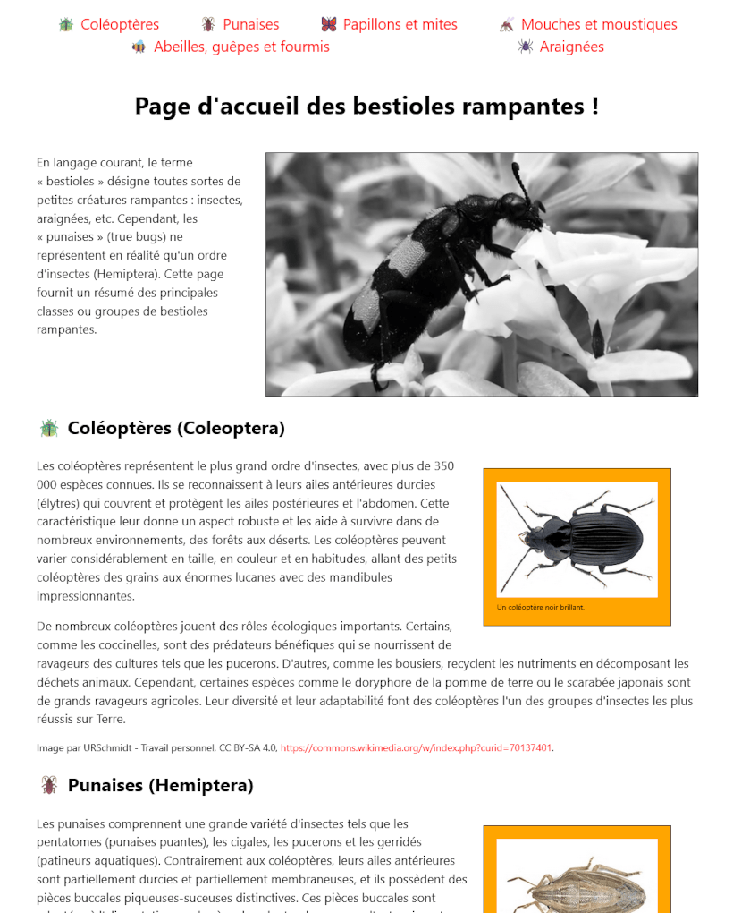

{{PreviousMenuNext("Learn_web_development/Core/Structuring_content/Test_your_skills/Audio_and_video", "Learn_web_development/Core/Structuring_content/HTML_table_basics", "Learn_web_development/Core/Structuring_content")}}

Dans ce défi, nous allons tester vos connaissances sur certaines des techniques abordées dans les dernières leçons, en vous demandant d'ajouter des images et une vidéo à une page d'accueil consacrée aux insectes et autres petites créatures rampantes.

## Point de départ

Pour résoudre ce défi, nous nous attendons à ce que vous créiez un projet de site web simple, soit dans un dossier sur le disque dur de votre ordinateur, soit en utilisant un éditeur en ligne tel que [CodePen <sup>(angl.)</sup>](https://codepen.io/) ou [JSFiddle <sup>(angl.)</sup>](https://jsfiddle.net/). Une grande partie du code dont vous avez besoin est déjà fournie.

1. Créez un nouveau dossier à un emplacement approprié sur votre ordinateur appelé `defi-page-accueil` (ou ouvrez un éditeur en ligne et effectuez les étapes nécessaires pour créer un nouveau projet).
2. Enregistrez la liste HTML suivante dans un fichier à l'intérieur de votre dossier appelé `index.html` (ou collez-la dans le volet HTML de votre éditeur en ligne).

   ```html
   <!doctype html>
   <html lang="fr">
     <head>
       <meta charset="utf-8" />
       <title>Les bestioles rampantes !</title>
       <link href="style.css" rel="stylesheet" />
     </head>
     <body>
       <header>
         <nav>
           <ul>
             <li><a href="#beetles">Coléoptères</a></li>
             <li><a href="#true_bugs">Punaises</a></li>
             <li><a href="#butterflies_moths">Papillons et mites</a></li>
             <li><a href="#flies_mosquitos">Mouches et moustiques</a></li>
             <li><a href="#bees_wasps_ants">Abeilles, guêpes et fourmis</a></li>
             <li><a href="#spiders">Araignées</a></li>
           </ul>
         </nav>
         <section>
           <h1>Page d'accueil des bestioles rampantes&nbsp;!</h1>

           <p>
             En langage courant, le terme «&nbsp;bestioles&nbsp;» désigne toutes
             sortes de petites créatures rampantes&nbsp;: insectes, araignées,
             etc. Cependant, les «&nbsp;punaises&nbsp;» (true bugs) ne
             représentent en réalité qu'un ordre d'insectes (Hemiptera). Cette
             page fournit un résumé des principales classes ou groupes de
             bestioles rampantes.
           </p>
         </section>
       </header>
       <main>
         <section id="beetles">
           <h2>Coléoptères (Coleoptera)</h2>

           <p>
             Les coléoptères représentent le plus grand ordre d'insectes, avec
             plus de 350 000 espèces connues. Ils se reconnaissent à leurs ailes
             antérieures durcies (élytres) qui couvrent et protègent les ailes
             postérieures et l'abdomen. Cette caractéristique leur donne un
             aspect robuste et les aide à survivre dans de nombreux
             environnements, des forêts aux déserts. Les coléoptères peuvent
             varier considérablement en taille, en couleur et en habitudes,
             allant des petits coléoptères des grains aux énormes lucanes avec
             des mandibules impressionnantes.
           </p>
           <p>
             De nombreux coléoptères jouent des rôles écologiques importants.
             Certains, comme les coccinelles, sont des prédateurs bénéfiques qui
             se nourrissent de ravageurs des cultures tels que les pucerons.
             D'autres, comme les bousiers, recyclent les nutriments en
             décomposant les déchets animaux. Cependant, certaines espèces comme
             le doryphore de la pomme de terre ou le scarabée japonais sont de
             grands ravageurs agricoles. Leur diversité et leur adaptabilité
             font des coléoptères l'un des groupes d'insectes les plus réussis
             sur Terre.
           </p>

           <p class="copyright">
             Image par URSchmidt - Travail personnel, CC BY-SA 4.0,
             <a href="https://commons.wikimedia.org/w/index.php?curid=70137401"
               >https://commons.wikimedia.org/w/index.php?curid=70137401</a
             >.
           </p>
         </section>
         <section id="true_bugs">
           <h2>Punaises (Hemiptera)</h2>

           <p>
             Les punaises comprennent une grande variété d'insectes tels que les
             pentatomes (punaises puantes), les cigales, les pucerons et les
             gerridés (patineurs aquatiques). Contrairement aux coléoptères,
             leurs ailes antérieures sont partiellement durcies et partiellement
             membraneuses, et ils possèdent des pièces buccales
             piqueuses-suceuses distinctives. Ces pièces buccales sont adaptées
             à l'alimentation par la sève des plantes, le sang ou d'autres
             insectes. De nombreuses punaises possèdent des glandes à odeur qui
             dégagent des effluves puissants à des fins de défense, d'où le nom
             de «&nbsp;punaises puantes&nbsp;».
           </p>

           <p>
             Les punaises se rencontrent dans le monde entier et occupent une
             grande diversité d'habitats, notamment les plantes, le sol et les
             milieux aquatiques. Si certaines espèces sont inoffensives ou même
             des prédateurs utiles, d'autres sont des ravageurs agricoles
             destructeurs qui affaiblissent les plantes en aspirant leur sève.
             Certaines punaises, telles que les punaises de lit et les
             triatomines, peuvent également affecter directement les humains en
             piquant ou en transmettant des maladies.
           </p>

           <p class="copyright">
             Image créée par l'utilisateur B. Schoenmakers sur Waarneming.nl,
             une source d'observations naturalistes aux Pays-Bas. — Cette image
             est téléversée en tant que numéro 29046158 sur Waarneming.nl. Cette
             étiquette n'indique pas le statut du droit d'auteur de l'œuvre
             jointe. Une étiquette de droit d'auteur normale est toujours
             nécessaire. Voir Commons:Licensing pour plus d'informations. Ce
             site requiert maintenant une authentification, toutefois la même
             image et les mêmes informations de droits d'auteur sont également
             disponibles par le biais de
             <a href="https://world.observation.org/foto/view/29046158"
               >https://world.observation.org/foto/view/29046158</a
             >
             puisqu'il utilise les mêmes données, CC BY 3.0,
             <a href="https://commons.wikimedia.org/w/index.php?curid=92410673"
               >https://commons.wikimedia.org/w/index.php?curid=92410673</a
             >.
           </p>
         </section>
         <section id="butterflies_moths">
           <h2>Papillons et mites (Lepidoptera)</h2>

           <p>
             Les papillons et les mites sont parmi les insectes les plus
             reconnaissables grâce à leurs grandes ailes souvent colorées,
             recouvertes de minuscules écailles. Ces écailles donnent à leurs
             ailes un aspect chatoyant et orné de motifs, et constituent l'un
             des traits caractéristiques de ce groupe. Les papillons sont
             généralement actifs le jour, tandis que les mites sont surtout
             nocturnes, bien qu'il existe des exceptions. Les deux subissent une
             métamorphose complète, avec une transformation spectaculaire de la
             chenille à l'adulte ailé.
           </p>

           <p>
             À l'état de chenille, ils se nourrissent principalement de
             feuilles, provoquant parfois des dégâts aux cultures et aux
             plantes. À l'état adulte, les papillons et de nombreuses mites sont
             des pollinisateurs importants, transportant le pollen en butinant
             le nectar des fleurs. Ils sont également essentiels sur le plan
             écologique en tant que source de nourriture pour les oiseaux, les
             chauves-souris et d'autres animaux. Leur beauté et leur importance
             écologique en font un groupe apprécié des passionné·e·s de nature
             et des scientifiques.
           </p>

           <p class="copyright">
             Image par Didier Descouens - Travail personnel, CC BY-SA 4.0,
             <a href="https://commons.wikimedia.org/w/index.php?curid=19303857"
               >https://commons.wikimedia.org/w/index.php?curid=19303857</a
             >.
           </p>
         </section>
         <section id="flies_mosquitos">
           <h2>Mouches et moustiques (Diptera)</h2>

           <p>
             Les mouches et les moustiques appartiennent à l'ordre des Diptera,
             ce qui signifie «&nbsp;deux ailes&nbsp;». Contrairement à la
             plupart des autres insectes, ils ne disposent que d'une paire
             d'ailes fonctionnelle&nbsp;; la paire postérieure s'est transformée
             en petits organes d'équilibre appelés haltères. Cette adaptation
             leur confère une grande agilité en vol. Leurs pièces buccales
             varient fortement&nbsp;: certaines espèces ont des pièces buccales
             éponges (comme les mouches domestiques), tandis que d'autres ont
             des pièces piqueuses-suceuses (comme les moustiques).
           </p>

           <p>
             Ces insectes comptent parmi les plus importants sur le plan
             écologique et sanitaire. De nombreuses mouches sont des
             décomposeurs, aidant à dégrader les déchets et à recycler les
             nutriments. Les moustiques, en revanche, sont tristement célèbres
             comme vecteurs de maladies, transmettant le paludisme, la dengue et
             d'autres infections. Malgré leur mauvaise réputation, les mouches
             et les moustiques sont essentiels aux écosystèmes, servant de
             pollinisateurs et constituant une importante source de nourriture
             pour de nombreux animaux.
           </p>

           <p class="copyright">
             Image créée par l'utilisateur Dick Belgers sur Waarneming.nl, une
             source d'observations naturalistes aux Pays-Bas. — Cette image est
             téléversée en tant que numéro 5105758 sur Waarneming.nl. Cette
             étiquette n'indique pas le statut du droit d'auteur de l'œuvre
             jointe. Une étiquette de droit d'auteur normale est toujours
             nécessaire. Voir Commons:Licensing pour plus d'informations. CC BY
             3.0,
             <a href="https://commons.wikimedia.org/w/index.php?curid=27659589"
               >https://commons.wikimedia.org/w/index.php?curid=27659589</a
             >.
           </p>
         </section>
         <section id="bees_wasps_ants">
           <h2>Abeilles, guêpes et fourmis (Hymenoptera)</h2>

           <p>
             Les abeilles, les guêpes et les fourmis forment un groupe
             diversifié connu pour leurs comportements complexes et leurs
             structures sociales. De nombreuses espèces vivent en colonies avec
             des rôles distincts pour les ouvrières, les reines et les mâles.
             Les abeilles sont particulièrement célèbres pour la pollinisation,
             la production de miel et la communication entre individus par des
             danses. Les guêpes sont souvent des prédateurs ou des parasitoïdes,
             tandis que les fourmis sont des constructrices habiles et des
             chercheuses coopératives.
           </p>

           <p>
             Ce groupe a un impact écologique considérable. Les abeilles et les
             guêpes contribuent à la pollinisation, soutenant les cultures
             alimentaires et les plantes sauvages. Certaines guêpes aident à
             contrôler les populations de ravageurs en prélevant ou en
             parasitant d'autres insectes. Les fourmis sont des ingénieur·e·s du
             sol essentiels, aérant le sol et recyclant les nutriments. Bien que
             les piqûres et les comportements agressifs fassent craindre
             certaines espèces, elles sont des acteurs vitaux dans les systèmes
             naturels et agricoles.
           </p>

           <p class="copyright">
             Image par Trounce - Travail personnel, CC BY-SA 2.5,
             <a href="https://commons.wikimedia.org/w/index.php?curid=1997709"
               >https://commons.wikimedia.org/w/index.php?curid=1997709</a
             >.
           </p>
         </section>
         <section id="spiders">
           <h2>Araignées (Araneae)</h2>

           <p>
             Les araignées sont des arachnides, pas des insectes, et se
             distinguent facilement par leurs huit pattes et l'absence
             d'antennes. Presque toutes les araignées sont des prédateurs,
             utilisant du venin et de la soie pour capturer leurs proies.
             Beaucoup construisent des toiles complexes pour piéger les
             insectes, tandis que d'autres sont des chasseuses actives qui
             poursuivent ou embusquent leur nourriture. Leur soie est un
             matériau incroyablement solide et polyvalent, utilisé pour les
             toiles, les cocons d'œufs ou les lignes de sécurité.
           </p>

           <p>
             Les araignées se rencontrent dans presque tous les habitats sur
             Terre, des déserts aux grottes en passant par les habitations. Si
             certaines personnes les craignent, très peu d'espèces représentent
             un danger pour les humains. En réalité, les araignées sont très
             utiles car elles contribuent au contrôle des populations
             d'insectes, y compris des ravageurs. Elles jouent un rôle crucial
             dans l'équilibre des écosystèmes, faisant d'elles l'un des
             «&nbsp;bestioles&nbsp;» non insectes les plus couramment rencontrés
             par les gens.
           </p>

           <p class="copyright">
             Image par AJC ajcann.wordpress.com du Royaume-Uni, CC BY-SA 2.0
             <a href="https://creativecommons.org/licenses/by-sa/2.0"
               >https://creativecommons.org/licenses/by-sa/2.0</a
             >, sur Wikimedia Commons.
           </p>
         </section>
       </main>
     </body>
   </html>
   ```

3. Sauvegardez la liste CSS suivante dans un fichier appelé `style.css` dans votre dossier (ou collez-la dans le volet CSS de votre éditeur en ligne).

   ```css
   /* type */

   body {
     font: 1.2em / 1.5 system-ui;
     margin: 0 auto;
     width: 90%;
     min-width: 800px;
     max-width: 1200px;
   }

   h1 {
     text-align: center;
   }

   .copyright {
     font-size: 0.8em;
   }

   /* menu de navigation */

   ul {
     padding: 0;
     list-style-type: none;
     text-align: center;
     display: flex;
     flex-flow: row wrap;
     justify-content: center;
     align-items: center;
   }

   li {
     flex: auto;
   }

   nav a {
     font-size: 1.2em;
     padding: 0 20px;
   }

   /* styles généraux des liens */

   a {
     text-decoration: none;
     color: red;
   }

   a:hover,
   a:focus {
     text-decoration: underline;
   }

   /* mise en page de la section d'en-tête */

   header section {
     display: grid;
     grid-template-areas:
       "heading heading"
       "text video"
       "text video";
     grid-template-columns: 1fr 2fr;
     gap: 20px;
   }

   h1 {
     grid-area: heading;
   }

   header p {
     grid-area: text;
     margin: 0;
   }

   video {
     grid-area: video;
     width: 100%;
     border: 1px solid black;
   }

   /* image flottante */

   figure {
     float: right;
     margin-left: 20px;
     padding: 20px;
     background: orange;
     border: 1px solid black;
   }

   figcaption {
     font-size: 0.6em;
   }
   ```

Plus tard, vous devrez inclure les URL suivantes dans votre page.

- `bee.jpg`: [Image pour la section "Abeilles, guêpes, fourmis (Hyménoptères)"](https://mdn.github.io/shared-assets/images/examples/learn/crawlies/bee.jpg).
- `beetle.png`: [Image pour la section "Coléoptères (Coleoptera)"](https://mdn.github.io/shared-assets/images/examples/learn/crawlies/beetle.png).
- `butterfly.jpg`: [Image pour la section "Papillons & mites (Lepidoptera)"](https://mdn.github.io/shared-assets/images/examples/learn/crawlies/butterfly.jpg).
- `mosquito.jpg`: [Image pour la section "Mouches & moustiques (Diptera)"](https://mdn.github.io/shared-assets/images/examples/learn/crawlies/mosquito.jpg).
- `spider.jpg`: [Image pour la section "Araignées (Araneae)"](https://mdn.github.io/shared-assets/images/examples/learn/crawlies/spider.jpg).
- `true_bug.jpg`: [Image pour la section "Punaises (Hemiptera)"](https://mdn.github.io/shared-assets/images/examples/learn/crawlies/true_bug.jpg).
- `bug_video_640.mp4`: [vidéo d'en-tête](https://mdn.github.io/shared-assets/videos/learn/bug_video_640.mp4).

## Brief du projet

Dans cette évaluation, nous vous présentons une page d'accueil presque terminée sur différents insectes et arachnides. Malheureusement, aucune image ou vidéo n'a encore été ajoutée — c'est votre travail&nbsp;! Vous devez ajouter des médias pour rendre la page plus intéressante. Les sous-sections suivantes détaillent ce que vous devez faire.

### Ajouter une vidéo à l'en-tête

Juste en dessous du `<h1>`, ajoutez un élément `<video>` qui intègre notre vidéo d'en-tête dans la page. Nous aimerions qu'elle fasse ce qui suit&nbsp;:

- Lire automatiquement la vidéo au chargement (pour que cela fonctionne dans au moins certains navigateurs, vous devrez également spécifier que la vidéo doit être muette).
- Boucler indéfiniment plutôt que de jouer une seule fois.
- Précharger le contenu de la vidéo.
- Ne pas afficher de contrôles.

### Ajouter des images aux sections

Dans les sections d'information étendues sur chaque type d'insecte, sous chaque `<h2>`, nous aimerions que vous ajoutiez un élément image qui intègre l'image appropriée pour chaque section. Donnez à chaque image un texte alternatif approprié pour le bénéfice des utilisateur·ice·s de lecteurs d'écran (et au cas où l'image ne se chargerait pas), et contraignez chaque image à des dimensions de 250 x 180.

De plus, nous aimerions que vous ajoutiez une légende pour chaque image&nbsp;; réfléchissez à l'élément conteneur nécessaire pour les associer sémantiquement. Ne vous contentez pas de répéter le texte alternatif dans la légende&nbsp;; elle doit fonctionner en complément du texte alternatif et de l'image.

### Ajouter des emojis ou des icônes d'insectes au menu de navigation et aux `<h2>`

Pour vous amuser un peu, nous aimerions que vous ajoutiez des icônes au début de chaque élément de liste de navigation, et la même icône au début de chaque `<h2>` correspondant. Vous pouvez le faire en utilisant des images intégrées, mais il est plus facile de simplement trouver des emojis appropriés et de les ajouter directement dans le texte HTML.

## Conseils et astuces

- Vous pouvez utiliser le [validateur HTML du W3C <sup>(angl.)</sup>](https://validator.w3.org/) pour détecter les erreurs dans votre HTML.
- Vous n'avez pas besoin de connaître le CSS pour cette évaluation&nbsp;; vous devez simplement modifier le fichier HTML fourni. La partie CSS est déjà faite pour vous.

## Exemple

La capture d'écran suivante montre à quoi devrait ressembler la page d'accueil. Si vous êtes bloqué sur la façon de réaliser certaines parties, consultez la solution ci-dessous l'exemple en direct.



<details>
<summary>Cliquez ici pour afficher la solution</summary>

Votre HTML final devrait ressembler à ceci&nbsp;:

```html
<!doctype html>
<html lang="fr">
  <head>
    <meta charset="utf-8" />
    <title>Les bestioles rampantes !</title>
    <link href="style.css" rel="stylesheet" />
  </head>
  <body>
    <header>
      <nav>
        <ul>
          <li><a href="#beetles">🪲 Coléoptères</a></li>
          <li><a href="#true_bugs">🪳 Punaises</a></li>
          <li><a href="#butterflies_moths">🦋 Papillons et mites</a></li>
          <li><a href="#flies_mosquitos">🦟 Mouches et moustiques</a></li>
          <li><a href="#bees_wasps_ants">🐝 Abeilles, guêpes et fourmis</a></li>
          <li><a href="#spiders">🕷️ Araignées</a></li>
        </ul>
      </nav>
      <section>
        <h1>Page d'accueil des bestioles rampantes&nbsp;!</h1>

        <video
          src="https://mdn.github.io/shared-assets/videos/learn/bug_video_640.mp4"
          autoplay
          loop
          muted
          preload="auto"></video>

        <p>
          En langage courant, le terme «&nbsp;bestioles&nbsp;» désigne toutes
          sortes de petites créatures rampantes&nbsp;: insectes, araignées, etc.
          Cependant, les «&nbsp;punaises&nbsp;» (true bugs) ne représentent en
          réalité qu'un ordre d'insectes (Hemiptera). Cette page fournit un
          résumé des principales classes ou groupes de bestioles rampantes.
        </p>
      </section>
    </header>
    <main>
      <section id="beetles">
        <h2>🪲 Coléoptères (Coleoptera)</h2>

        <figure>
          
          <figcaption>Un coléoptère noir brillant.</figcaption>
        </figure>

        <p>
          Les coléoptères représentent le plus grand ordre d'insectes, avec plus
          de 350 000 espèces connues. Ils se reconnaissent à leurs ailes
          antérieures durcies (élytres) qui couvrent et protègent les ailes
          postérieures et l'abdomen. Cette caractéristique leur donne un aspect
          robuste et les aide à survivre dans de nombreux environnements, des
          forêts aux déserts. Les coléoptères peuvent varier considérablement en
          taille, en couleur et en habitudes, allant des petits coléoptères des
          grains aux énormes lucanes avec des mandibules impressionnantes.
        </p>
        <p>
          De nombreux coléoptères jouent des rôles écologiques importants.
          Certains, comme les coccinelles, sont des prédateurs bénéfiques qui se
          nourrissent de ravageurs des cultures tels que les pucerons. D'autres,
          comme les bousiers, recyclent les nutriments en décomposant les
          déchets animaux. Cependant, certaines espèces comme le doryphore de la
          pomme de terre ou le scarabée japonais sont de grands ravageurs
          agricoles. Leur diversité et leur adaptabilité font des coléoptères
          l'un des groupes d'insectes les plus réussis sur Terre.
        </p>

        <p class="copyright">
          Image par URSchmidt - Travail personnel, CC BY-SA 4.0,
          <a href="https://commons.wikimedia.org/w/index.php?curid=70137401"
            >https://commons.wikimedia.org/w/index.php?curid=70137401</a
          >.
        </p>
      </section>
      <section id="true_bugs">
        <h2>🪳 Punaises (Hemiptera)</h2>

        <figure>
          
          <figcaption>Une punaise verte rayée.</figcaption>
        </figure>

        <p>
          Les punaises comprennent une grande variété d'insectes tels que les
          pentatomes (punaises puantes), les cigales, les pucerons et les
          gerridés (patineurs aquatiques). Contrairement aux coléoptères, leurs
          ailes antérieures sont partiellement durcies et partiellement
          membraneuses, et ils possèdent des pièces buccales piqueuses-suceuses
          distinctives. Ces pièces buccales sont adaptées à l'alimentation par
          la sève des plantes, le sang ou d'autres insectes. De nombreuses
          punaises possèdent des glandes à odeur qui dégagent des effluves
          puissants à des fins de défense, d'où le nom de «&nbsp;punaises
          puantes&nbsp;».
        </p>

        <p>
          Les punaises se rencontrent dans le monde entier et occupent une
          grande diversité d'habitats, notamment les plantes, le sol et les
          milieux aquatiques. Si certaines espèces sont inoffensives ou même des
          prédateurs utiles, d'autres sont des ravageurs agricoles destructeurs
          qui affaiblissent les plantes en aspirant leur sève. Certaines
          punaises, telles que les punaises de lit et les triatomines, peuvent
          également affecter directement les humains en piquant ou en
          transmettant des maladies.
        </p>

        <p class="copyright">
          Image créée par l'utilisateur B. Schoenmakers sur Waarneming.nl, une
          source d'observations naturalistes aux Pays-Bas. — Cette image est
          téléversée en tant que numéro 29046158 sur Waarneming.nl. Cette
          étiquette n'indique pas le statut du droit d'auteur de l'œuvre jointe.
          Une étiquette de droit d'auteur normale est toujours nécessaire. Voir
          Commons:Licensing pour plus d'informations. Ce site requiert
          maintenant une authentification, toutefois la même image et les mêmes
          informations de droits d'auteur sont également disponibles par le
          biais de
          <a href="https://world.observation.org/foto/view/29046158"
            >https://world.observation.org/foto/view/29046158</a
          >
          puisqu'il utilise les mêmes données, CC BY 3.0,
          <a href="https://commons.wikimedia.org/w/index.php?curid=92410673"
            >https://commons.wikimedia.org/w/index.php?curid=92410673</a
          >.
        </p>
      </section>
      <section id="butterflies_moths">
        <h2>🦋 Papillons et mites (Lepidoptera)</h2>

        <figure>
          
          <figcaption>Un papillon typique.</figcaption>
        </figure>

        <p>
          Les papillons et les mites sont parmi les insectes les plus
          reconnaissables grâce à leurs grandes ailes souvent colorées,
          recouvertes de minuscules écailles. Ces écailles donnent à leurs ailes
          un aspect chatoyant et orné de motifs, et constituent l'un des traits
          caractéristiques de ce groupe. Les papillons sont généralement actifs
          le jour, tandis que les mites sont surtout nocturnes, bien qu'il
          existe des exceptions. Les deux subissent une métamorphose complète,
          avec une transformation spectaculaire de la chenille à l'adulte ailé.
        </p>

        <p>
          À l'état de chenille, ils se nourrissent principalement de feuilles,
          provoquant parfois des dégâts aux cultures et aux plantes. À l'état
          adulte, les papillons et de nombreuses mites sont des pollinisateurs
          importants, transportant le pollen en butinant le nectar des fleurs.
          Ils sont également essentiels sur le plan écologique en tant que
          source de nourriture pour les oiseaux, les chauves-souris et d'autres
          animaux. Leur beauté et leur importance écologique en font un groupe
          apprécié des passionné·e·s de nature et des scientifiques.
        </p>

        <p class="copyright">
          Image par Didier Descouens - Travail personnel, CC BY-SA 4.0,
          <a href="https://commons.wikimedia.org/w/index.php?curid=19303857"
            >https://commons.wikimedia.org/w/index.php?curid=19303857</a
          >.
        </p>
      </section>
      <section id="flies_mosquitos">
        <h2>🦟 Mouches et moustiques (Diptera)</h2>

        <figure>
          
          <figcaption>A mosquito.</figcaption>
        </figure>

        <p>
          Les mouches et les moustiques appartiennent à l'ordre des Diptera, ce
          qui signifie «&nbsp;deux ailes&nbsp;». Contrairement à la plupart des
          autres insectes, ils ne disposent que d'une paire d'ailes
          fonctionnelle&nbsp;; la paire postérieure s'est transformée en petits
          organes d'équilibre appelés haltères. Cette adaptation leur confère
          une grande agilité en vol. Leurs pièces buccales varient
          fortement&nbsp;: certaines espèces ont des pièces buccales éponges
          (comme les mouches domestiques), tandis que d'autres ont des pièces
          piqueuses-suceuses (comme les moustiques).
        </p>

        <p>
          Ces insectes comptent parmi les plus importants sur le plan écologique
          et sanitaire. De nombreuses mouches sont des décomposeurs, aidant à
          dégrader les déchets et à recycler les nutriments. Les moustiques, en
          revanche, sont tristement célèbres comme vecteurs de maladies,
          transmettant le paludisme, la dengue et d'autres infections. Malgré
          leur mauvaise réputation, les mouches et les moustiques sont
          essentiels aux écosystèmes, servant de pollinisateurs et constituant
          une importante source de nourriture pour de nombreux animaux.
        </p>

        <p class="copyright">
          Image créée par l'utilisateur Dick Belgers sur Waarneming.nl, une
          source d'observations naturalistes aux Pays-Bas. — Cette image est
          téléversée en tant que numéro 5105758 sur Waarneming.nl. Cette
          étiquette n'indique pas le statut du droit d'auteur de l'œuvre jointe.
          Une étiquette de droit d'auteur normale est toujours nécessaire. Voir
          Commons:Licensing pour plus d'informations. CC BY 3.0,
          <a href="https://commons.wikimedia.org/w/index.php?curid=27659589"
            >https://commons.wikimedia.org/w/index.php?curid=27659589</a
          >.
        </p>
      </section>
      <section id="bees_wasps_ants">
        <h2>🐝 Abeilles, guêpes et fourmis (Hymenoptera)</h2>

        <figure>
          
          <figcaption>Un bourdon.</figcaption>
        </figure>

        <p>
          Les abeilles, les guêpes et les fourmis forment un groupe diversifié
          connu pour leurs comportements complexes et leurs structures sociales.
          De nombreuses espèces vivent en colonies avec des rôles distincts pour
          les ouvrières, les reines et les mâles. Les abeilles sont
          particulièrement célèbres pour la pollinisation, la production de miel
          et la communication entre individus par des danses. Les guêpes sont
          souvent des prédateurs ou des parasitoïdes, tandis que les fourmis
          sont des constructrices habiles et des chercheuses coopératives.
        </p>

        <p>
          Ce groupe a un impact écologique considérable. Les abeilles et les
          guêpes contribuent à la pollinisation, soutenant les cultures
          alimentaires et les plantes sauvages. Certaines guêpes aident à
          contrôler les populations de ravageurs en prélevant ou en parasitant
          d'autres insectes. Les fourmis sont des ingénieur·e·s du sol
          essentiels, aérant le sol et recyclant les nutriments. Bien que les
          piqûres et les comportements agressifs fassent craindre certaines
          espèces, elles sont des acteurs vitaux dans les systèmes naturels et
          agricoles.
        </p>

        <p class="copyright">
          Image par Trounce - Travail personnel, CC BY-SA 2.5,
          <a href="https://commons.wikimedia.org/w/index.php?curid=1997709"
            >https://commons.wikimedia.org/w/index.php?curid=1997709</a
          >.
        </p>
      </section>
      <section id="spiders">
        <h2>🕷️ Araignées (Araneae)</h2>

        <figure>
          
          <figcaption>Une araignée.</figcaption>
        </figure>

        <p>
          Les araignées sont des arachnides, pas des insectes, et se distinguent
          facilement par leurs huit pattes et l'absence d'antennes. Presque
          toutes les araignées sont des prédateurs, utilisant du venin et de la
          soie pour capturer leurs proies. Beaucoup construisent des toiles
          complexes pour piéger les insectes, tandis que d'autres sont des
          chasseuses actives qui poursuivent ou embusquent leur nourriture. Leur
          soie est un matériau incroyablement solide et polyvalent, utilisé pour
          les toiles, les cocons d'œufs ou les lignes de sécurité.
        </p>

        <p>
          Les araignées se rencontrent dans presque tous les habitats sur Terre,
          des déserts aux grottes en passant par les habitations. Si certaines
          personnes les craignent, très peu d'espèces représentent un danger
          pour les humains. En réalité, les araignées sont très utiles car elles
          contribuent au contrôle des populations d'insectes, y compris des
          ravageurs. Elles jouent un rôle crucial dans l'équilibre des
          écosystèmes, faisant d'elles l'un des «&nbsp;bestioles&nbsp;» non
          insectes les plus couramment rencontrés par les gens.
        </p>

        <p class="copyright">
          Image par AJC ajcann.wordpress.com du Royaume-Uni, CC BY-SA 2.0
          <a href="https://creativecommons.org/licenses/by-sa/2.0"
            >https://creativecommons.org/licenses/by-sa/2.0</a
          >, sur Wikimedia Commons.
        </p>
      </section>
    </main>
  </body>
</html>
```

</details>

{{PreviousMenuNext("Learn_web_development/Core/Structuring_content/Test_your_skills/Audio_and_video", "Learn_web_development/Core/Structuring_content/HTML_table_basics", "Learn_web_development/Core/Structuring_content")}}
