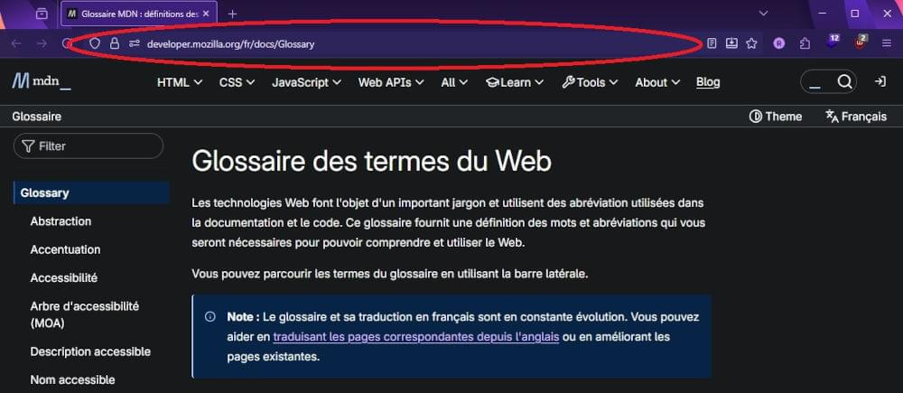

{{PreviousMenuNext("Learn_web_development/Getting_started/Environment_setup/Installing_software", "Learn_web_development/Getting_started/Environment_setup/Code_editors", "Learn_web_development/Getting_started/Environment_setup")}}

À ce stade du module, vous devriez avoir installé plusieurs navigateurs web modernes sur votre ordinateur ou d'autres appareils disponibles. Cet article va plus loin sur l'utilisation des navigateurs, en expliquant comment fonctionne un navigateur web, la différence entre certains éléments courants avec lesquels vous interagirez, et comment rechercher des informations.

> [!NOTE]
> Si vous n'avez pas installé d'autres navigateurs que ceux fournis par défaut avec vos appareils, installez-en d'autres. Regardez la liste des [navigateurs web modernes](/fr/docs/Learn_web_development/Getting_started/Environment_setup/Installing_software#navigateurs_web_modernes) pour plus d'informations.

Comme dans tout domaine, le web comporte beaucoup de jargon et de termes techniques. Pas d'inquiétude&nbsp;: nous n'allons pas tout vous présenter d'un coup (vous pouvez consulter le [glossaire](/fr/docs/Glossary) si vous êtes curieux·se). Cependant, il y a quelques termes de base à comprendre dès le début, car vous les entendrez souvent. Nous en présentons quelques-uns ci-dessous.

<table>
  <tbody>
    <tr>
      <th scope="row">Prérequis&nbsp;:</th>
      <td>
        Connaissance de base de votre système d'exploitation.
      </td>
    </tr>
    <tr>
      <th scope="row">Objectifs d'apprentissage&nbsp;:</th>
      <td>
        <ul>
          <li>Différencier un navigateur web, un site web et un moteur de recherche.</li>
          <li>Comprendre le fonctionnement de base d'un navigateur web.</li>
          <li>Rechercher des informations.</li>
        </ul>
      </td>
    </tr>
  </tbody>
</table>

## Différence entre page web, site web, serveur web et moteur de recherche

Nous allons commencer par décrire différents concepts liés au Web&nbsp;: pages web, sites web, serveurs web et moteurs de recherche. Ces termes sont souvent confondus par les débutant·e·s ou mal utilisés. Assurons-nous que vous sachiez ce qu'ils signifient&nbsp;!

- **Page web**
  - : Un document affichable dans un {{Glossary("browser", "navigateur")}}. On parle aussi simplement de «&nbsp;page&nbsp;». Ces documents sont écrits en {{Glossary("HTML")}} (que nous verrons plus en détail plus loin).
- **Site web**
  - : Un ensemble de pages web regroupées en une seule ressource, reliées entre elles par des liens. On parle aussi de «&nbsp;site&nbsp;».
- **Serveur web**
  - : Un ordinateur qui héberge un site web sur Internet.
- **Service web**
  - : Un logiciel qui répond à des requêtes sur Internet pour effectuer une fonction ou fournir des données. Un service web s'appuie généralement sur un serveur web et peut fournir des pages web pour l'interaction utilisateur. Beaucoup de sites web sont aussi des services web, mais certains (comme MDN) ne proposent que du contenu statique. Exemples&nbsp;: un service qui redimensionne des images, fournit la météo ou gère la connexion utilisateur.
- **Moteur de recherche**
  - : Un service web qui aide à trouver d'autres pages web, comme Google, Bing, Yahoo ou DuckDuckGo. Les moteurs de recherche sont généralement accessibles via un navigateur web (par exemple, vous pouvez effectuer des recherches directement dans la barre d'adresse de Firefox, Chrome, etc.) ou via une page web (par exemple, [bing.com](https://www.bing.com/) ou [duckduckgo.com](https://duckduckgo.com/)).

Prenons une analogie — une bibliothèque publique. Voici ce que vous feriez généralement en la visitant&nbsp;:

1. Trouver un index de recherche et chercher le titre du livre voulu.
2. Noter le numéro de catalogue du livre.
3. Aller dans la section correspondante, trouver le bon numéro et prendre le livre.

Comparons une bibliothèque au web&nbsp;:

- La bibliothèque est comme un serveur web. Elle a plusieurs sections, comme un serveur hébergeant plusieurs sites web.
- Les différentes sections (sciences, maths, histoire, etc.) sont comme des sites web. Chaque section est un site unique (deux sections n'ont pas les mêmes livres).
- Les livres de chaque section sont comme des pages web. Un site peut avoir plusieurs pages, par exemple la section Sciences (le site) aura des livres sur la chaleur, le son, la biologie, etc.
- L'index de recherche est comme le moteur de recherche. Chaque livre a un emplacement unique (deux livres ne peuvent pas être au même endroit), défini par le numéro de catalogue.

Voyons maintenant chaque terme plus en détail.

### Page web

Une **page web** est un document simple affichable par un navigateur. Elle peut intégrer différents types de ressources&nbsp;:

- _Informations de style_ — pour contrôler l'apparence de la page.
- _Scripts_ — pour ajouter de l'interactivité.
- _Médias_ — images, sons, vidéos.

> [!NOTE]
> Les navigateurs peuvent aussi afficher d'autres documents comme des fichiers {{Glossary("PDF")}} ou des images/vidéos, mais le terme **page web** désigne spécifiquement les documents HTML.

Chaque page web possède une adresse unique (adresse web, aussi appelée {{Glossary("URL")}}). Pour y accéder, tapez son adresse dans la barre d'adresse de votre navigateur&nbsp;:

Essayez de charger l'un de vos sites préférés dans un navigateur, en gardant cela à l'esprit. Avez-vous tapé l'adresse vous-même ou l'avez-vous trouvée via un moteur de recherche&nbsp;?

### Site web

Un _site web_ est un ensemble de pages web liées (et leurs ressources associées) partageant un [nom de domaine](/fr/docs/Learn_web_development/Howto/Web_mechanics/What_is_a_domain_name) unique. Chaque page d'un site propose des liens explicites — souvent sous forme de texte cliquable — permettant de naviguer d'une page à l'autre.

Quand vous chargez votre site préféré, la page principale (ou _page d'accueil_) s'affiche d'abord&nbsp;:

Cliquez sur quelques menus ou liens pour explorer différentes pages de votre site favori. Notez comment l'adresse affichée change à chaque navigation.

> [!NOTE]
> Il existe aussi des {{Glossary("SPA", "<em>applications monopage</em>")}}&nbsp;: un site constitué d'une seule page HTML, mise à jour dynamiquement. Dans ce cas, l'adresse web peut ne pas changer lors de la navigation.

### Serveur web

Un _serveur web_ est un ordinateur hébergeant un ou plusieurs _sites web_. «&nbsp;Héberger&nbsp;» signifie que toutes les _pages web_ et leurs fichiers associés sont disponibles sur cet ordinateur. Le _serveur web_ envoie les fichiers au navigateur de l'utilisateur·rice qui tente de les charger.

Ne confondez pas _sites web_ et _serveurs web_. Si quelqu'un dit «&nbsp;Mon site ne répond plus&nbsp;», cela signifie probablement que le _serveur web_ ne répond plus, donc le _site web_ n'est pas accessible.

Plus important encore, un serveur web peut héberger plusieurs sites. Le terme _serveur web_ ne désigne donc plus un site, pour éviter la confusion. Si quelqu'un dit «&nbsp;Mon serveur web ne répond plus&nbsp;», cela peut concerner plusieurs sites hébergés.

### Moteur de recherche

Il est courant de confondre moteurs de recherche et sites web. Un moteur de recherche est un service web spécial qui aide à trouver des pages web ou des contenus spécifiques (images, vidéos, actualités, etc.).

Les moteurs de recherche ont leur propre site pour accéder au service&nbsp;: [Google](https://www.google.com/), [Bing](https://www.bing.com/), [Yandex](https://yandex.com/), [DuckDuckGo](https://duckduckgo.com/), etc. Certains sont généralistes, d'autres spécialisés.

Beaucoup de débutant·e·s confondent moteurs de recherche et navigateurs. Clarifions&nbsp;:

- Un _navigateur_ est un logiciel qui affiche les pages web.
- Un _moteur de recherche_ est un service web (et souvent un site) qui aide à trouver des pages sur d'autres sites.

La confusion vient du fait que, lors du premier lancement d'un navigateur, il affiche souvent la page d'accueil d'un moteur de recherche ou une barre de recherche. La plupart des navigateurs permettent aussi d'utiliser un moteur de recherche directement depuis la barre d'adresse.

C'est logique, car la première chose que l'on veut faire avec un navigateur est souvent de trouver une page à afficher. Ne confondez pas le logiciel (navigateur) et le service (moteur de recherche).

Voici Firefox affichant une page Google personnalisée au démarrage&nbsp;:

Essayez d'utiliser un moteur de recherche pour trouver des informations sur un sujet qui vous intéresse&nbsp;:

1. Rendez-vous sur la page d'accueil d'un moteur de recherche et saisissez un terme.
2. Saisissez un terme directement dans la barre d'adresse du navigateur.

## Comment fonctionne le web : les bases

Dans de nombreuses régions du monde, le web est devenu aussi essentiel que les couverts, le vélo, la voiture ou la brosse à dents. Si cela vous semble exagéré, pensez à la fréquence à laquelle vous utilisez un site ou une appli chaque jour&nbsp;! Même sans taper d'adresse web, il y a de fortes chances qu'une appli utilise le web en arrière-plan pour récupérer des données.

Quand vous accédez au web, beaucoup de choses se passent entre votre action (par exemple, taper une adresse dans le navigateur et appuyer sur <kbd>Entrée</kbd>/<kbd>Retour</kbd>) et l'affichage du résultat (le site qui apparaît)&nbsp;:

1. Le navigateur demande la ressource voulue (page, donnée, image, vidéo, etc.) au serveur web qui la stocke. Ces requêtes (et les réponses) utilisent le protocole [HTTP](/fr/docs/Glossary/HTTP) (<i lang="en">HyperText Transfer Protocol</i> en anglais), un protocole qui décrit les actions à effectuer (comme **GET**).
2. Si la requête réussit, le serveur web renvoie une réponse HTTP contenant la ressource demandée.
3. Parfois, la ressource demandée déclenche d'autres requêtes HTTP&nbsp;:
   1. Lors du chargement d'un site, le fichier HTML principal est d'abord demandé.
   2. Quand ce fichier est reçu, le navigateur le lit et trouve souvent des instructions pour charger d'autres fichiers (images, styles, scripts, etc.).
4. Quand toutes les ressources sont chargées, le navigateur les analyse et les affiche à l'utilisateur·rice.

Cette description est très simplifiée, mais c'est suffisant pour l'instant. Vous trouverez une explication plus détaillée du fonctionnement du navigateur dans notre module [Standards du web](/fr/docs/Learn_web_development/Getting_started/Web_standards).

## Rechercher des informations

En tant que développeur·euse web, vous passerez beaucoup de temps à chercher des informations, que ce soit une syntaxe oubliée ou une solution à un problème précis. Il est donc utile d'apprendre à bien chercher sur le web.

Si vous connaissez un site spécialisé dans le sujet qui vous intéresse, commencez par là.

Par exemple, pour une information sur une fonctionnalité web, tapez son nom dans la recherche MDN. Essayez par exemple `box model`, `fetch()`, ou `élément video`. Si vous ne trouvez pas, élargissez la recherche à un moteur généraliste.

Pour une solution à un problème précis, comme «&nbsp;comment afficher la suite de Fibonacci en JavaScript&nbsp;» ou «&nbsp;comment savoir si un nombre est premier en JavaScript&nbsp;», cherchez sur un site comme [StackOverflow](https://stackoverflow.com/), une communauté dédiée à l'entraide en programmation. Là encore, essayez un moteur généraliste si besoin.

Avant d'aller plus loin, essayez de chercher quelques sujets qui vous intéressent. Testez des recherches plus ou moins précises et différents termes pour voir ce qui fonctionne le mieux. Consultez nos [astuces de recherche](#astuces_de_recherche) pour d'autres conseils.

### Utiliser l'IA

Les résultats de recherche générés par l'IA sont très populaires. Ils offrent une recherche «&nbsp;améliorée&nbsp;»&nbsp;: ils effectuent de nombreuses recherches en arrière-plan, puis compilent les résultats en une réponse unique et digeste. Les plus connus sont [ChatGPT](https://chatgpt.com/), [Google Gemini](https://gemini.google.com/app) et [Microsoft Copilot](https://copilot.microsoft.com/), accessibles en chat ou via des aides intégrées.

Pour apprendre à coder, les IA peuvent être utiles de plusieurs façons&nbsp;:

- Effectuer des recherches classiques, comme ci-dessus.
- Trouver des bugs dans un bloc de code. Si votre code ne fonctionne pas, collez-le dans une IA avec une question du type «&nbsp;Où est l'erreur dans ce code&nbsp;?&nbsp;»
- Générer une version optimisée d'un code. Pratique si vous voulez une version plus efficace ou plus robuste.
- Conseiller sur une stratégie. Par exemple, demander non seulement où est le bug, mais aussi comment le corriger.

Testez quelques outils d'IA pour faire des recherches.

### À garder en tête

L'IA est puissante, mais il reste essentiel de comprendre ce que vous faites, ce que fait le code, et où chaque morceau doit être utilisé. Sinon, vous ne serez pas efficace pour résoudre de vrais problèmes. Il faut donc continuer à apprendre à coder. L'IA est un outil précieux pour trouver des réponses plus vite, mais si vous tapez chaque question dans une IA, vous ne comprendrez rien au fonctionnement général.

De plus&nbsp;:

- Les IA donnent des réponses sûres d'elles, mais elles peuvent se tromper ou induire en erreur. Certaines erreurs sont subtiles. Elles n'ont pas d'intelligence propre — ce sont des outils d'appariement de modèles. Elles compilent des réponses à partir de sources variées, donc peuvent intégrer des erreurs. Même deux sources correctes peuvent donner une réponse fausse.
- Les informations récentes peuvent manquer, ou les réponses être biaisées vers de la documentation ancienne, donc «&nbsp;comment faire X en JS&nbsp;» peut donner des conseils dépassés.

Il faut donc toujours vérifier les réponses et ne pas tout croire sans recul.

**Quand vous apprenez, essayez de résoudre le problème vous-même avant de chercher une réponse, que ce soit avec une IA ou un moteur classique. Cela fera de vous un·e meilleur·e développeur·euse.**

### Astuces de recherche

- Ajoutez le langage utilisé dans la recherche, comme dans les exemples ci-dessus. Si vous tapez juste «&nbsp;comment afficher la suite de Fibonacci&nbsp;», vous aurez des solutions en Python, C++, Java, Ruby, etc. — pas très utile si vous apprenez JavaScript&nbsp;!
- Quand vous trouvez une réponse utile, mettez-la en favori ou copiez-la pour la retrouver plus tard. Vous serez surpris·e de rencontrer plusieurs fois le même problème.
- Si votre code affiche un message d'erreur, essayez de le chercher tel quel. D'autres auront sûrement déjà rencontré ce problème et partagé la solution.
- Privilégiez les sites recommandés comme MDN ou [StackOverflow](https://stackoverflow.com/).
- Il existe de nombreuses techniques avancées pour améliorer vos recherches. Taper simplement `fourmis poisson fromage` retournera des résultats contenant n'importe lequel de ces mots. Mais la plupart des moteurs acceptent des syntaxes comme&nbsp;:
  - `"fourmis poisson fromage"` (avec les guillemets) ne retourne que les résultats contenant exactement cette phrase.
  - `fourmis fromage -poisson` retourne les résultats contenant «&nbsp;fourmis&nbsp;» et/ou «&nbsp;fromage&nbsp;» mais pas «&nbsp;poisson&nbsp;».
  - `fourmis OR fromage` ne retourne que les résultats contenant l'un ou l'autre, pas les deux. (Cela fonctionne surtout sur Google.)
  - `intitle:fromage` ne retourne que les résultats ayant «&nbsp;fromage&nbsp;» dans le titre principal.

  > [!NOTE]
  > Il existe bien d'autres techniques selon les moteurs. Essayez d'en trouver d'autres — quelques ressources utiles&nbsp;: [Affiner les recherches Google](https://support.google.com/websearch/answer/2466433?hl=fr), [Syntaxe avancée sur DuckDuckGo](https://duckduckgo.com/duckduckgo-help-pages/results/syntax) et [Microsoft&nbsp;: options de recherche avancée](https://support.microsoft.com/fr-fr/topic/advanced-search-options-b92e25f1-0085-4271-bdf9-14aaea720930).

{{PreviousMenuNext("Learn_web_development/Getting_started/Environment_setup/Installing_software", "Learn_web_development/Getting_started/Environment_setup/Code_editors", "Learn_web_development/Getting_started/Environment_setup")}}
