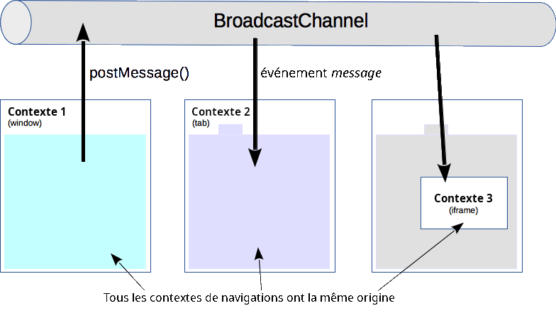

{{DefaultAPISidebar("Broadcast Channel API")}}

L'**API <i lang="en">Broadcast Channel</i>** permet la communication entre des [contextes de navigation](/fr/docs/Glossary/Browsing_context) (c'est-à-dire des _fenêtres_, _onglets_, _cadres_, ou _iframes_) et <i lang="en">workers</i> d'une même [origine](/fr/docs/Glossary/Origin).

{{AvailableInWorkers}}

En créant un objet [`BroadcastChannel`](/fr/docs/Web/API/BroadcastChannel), vous pouvez y recevoir n'importe quel message qui lui a été envoyé. Vous n'avez pas à maintenir de référence aux cadres ou <i lang="en">workers</i> avec lesquels vous souhaitez communiquer, car ils «&nbsp;s'abonnent&nbsp;» à un canal dédié en construisant leur propre objet [`BroadcastChannel`](/fr/docs/Web/API/BroadcastChannel) avec le même nom, et obtiennent un canal de communication bi-directionnel avec chacun d'eux.



## L'interface <i lang="en">Broadcast Channel</i>

### Créer ou rejoindre un canal

Un client rejoint un canal de diffusion en créant un objet [`BroadcastChannel`](/fr/docs/Web/API/BroadcastChannel). Son [constructeur](/fr/docs/Web/API/BroadcastChannel/BroadcastChannel) prend un unique paramètre&nbsp;: le _nom_ du canal. S'il est le premier à se connecter à ce nom de canal de diffusion, alors le canal sous-jacent est créé.

```js
// Connexion au canal de diffusion
const bc = new BroadcastChannel("canal_test");
```

### Envoi d'un message

Il suffit d'appeler la méthode [`postMessage()`](/fr/docs/Web/API/BroadcastChannel/postMessage) sur l'objet `BroadcastChannel` créé, qui prend n'importe quel objet comme argument. Un exemple de message&nbsp;:

```js
// Exemple d'envoi d'un message très simple
bc.postMessage("Ceci est un message test.");
```

Les données envoyées sur le canal sont sérialisées via l'[algorithme de clonage de structure](/fr/docs/Web/API/Web_Workers_API/Structured_clone_algorithm). Ceci implique que vous pouvez envoyer un large spectre de type de données de manière sure sans avoir à les sérialiser par vous-même.

Cette API n'associe aucune sémantique particulière aux messages, c'est donc au code de savoir à quelle sorte de message s'attendre et quel usage il peut en tirer.

### Réception d'un message

Lorsqu'un message est posté, un évènement [`message`](/fr/docs/Web/API/BroadcastChannel/message_event) est distribué sur chaque objet [`BroadcastChannel`](/fr/docs/Web/API/BroadcastChannel) connecté à ce canal. Une fonction peut être exécutée pour le traitement de cet évènement en utilisant le gestionnaire d'évènements [`onmessage`](/fr/docs/Web/API/BroadcastChannel/message_event)&nbsp;:

```js
// Un gestionnaire affichant simplement les messages sur la console :
bc.onmessage = (event) => {
  console.log(event);
};
```

### Déconnexion d'un canal

Pour quitter un canal, appelez la méthode [`close()`](/fr/docs/Web/API/BroadcastChannel/close) de l'objet. Cet appel déconnectera l'objet du canal sous-jacent permettant au ramasse-miettes de s'exécuter.

```js
// Déconnexion du canal
bc.close();
```

## Conclusion

L'interface intégrée de l'API <i lang="en">Broadcast Channel</i> permet une communication inter-contexte. Il peut être utilisé pour détecter des actions utilisateurs dans d'autre onglets d'une même origine, telle qu'une connexion ou déconnexion d'utilisateur du site.

Le protocole ne définit pas le contenu des messages ni leurs significations. Il sera à la charge de la développeuse ou du développeur d'implanter leur propre jeu de messages et traitements associés.

## Spécifications

{{Specifications}}

## Compatibilité des navigateurs

{{Compat}}

## Voir aussi

[`BroadcastChannel`](/fr/docs/Web/API/BroadcastChannel), l'interface qui porte cette API.
