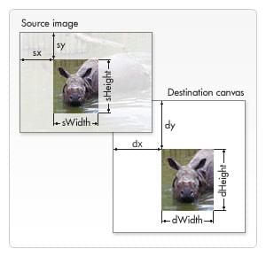

{{DefaultAPISidebar("Canvas API")}}{{PreviousNext("Web/API/Canvas_API/Tutorial/Drawing_text", "Web/API/Canvas_API/Tutorial/Transformations")}}

Jusqu'à présent, nous avons créé nos propres [formes](/fr/docs/Web/API/Canvas_API/Tutorial/Drawing_shapes) et [styles appliqués](/fr/docs/Web/API/Canvas_API/Tutorial/Applying_styles_and_colors). L'une des fonctionnalités les plus intéressantes de [`<canvas>`](/fr/docs/Web/HTML/Element/canvas) est la possibilité d'utiliser des images. Celles-ci peuvent être utilisées pour faire de la composition dynamique de photos ou comme décors de graphes, pour des _sprites_ dans des jeux, et ainsi de suite. Les images externes peuvent être utilisées dans n'importe quel format pris en charge par le navigateur, comme PNG, GIF ou JPEG. Vous pouvez même utiliser l'image produite par d'autres éléments du canevas sur la même page comme source !

L'importation d'images dans un canevas se déroule en deux étapes :

1. L'obtention d'une référence à un objet [`HTMLImageElement`](/fr/docs/Web/API/HTMLImageElement) ou à un autre élément canvas en tant que source. Il est également possible d'utiliser des images en fournissant une URL.
2. Le dessin de l'image à l'aide de la fonction `drawImage()` .

Voyons comment faire.

## Obtenir des images à dessiner

L'API Canvas peut utiliser l'un des types de données suivants comme source d'image :

- [`HTMLImageElement`](/fr/docs/Web/API/HTMLImageElement)
  - : Il s'agit d'images créées à l'aide du constructeur `Image()`, ainsi que de tout élément HTML [``](/fr/docs/Web/HTML/Element/Img).
- [`SVGImageElement`](/fr/docs/Web/API/SVGImageElement)
  - : Ce sont des images incorporées en utilisant l'élément SVG [`<image>`](/fr/docs/Web/SVG/Element/image).
- [`HTMLVideoElement`](/fr/docs/Web/API/HTMLVideoElement)
  - : L'utilisation d'un élément HTML [`<video>`](/fr/docs/Web/HTML/Element/video) comme source d'image capture l'image actuelle de la vidéo et l'utilise comme une image.
- [`HTMLCanvasElement`](/fr/docs/Web/API/HTMLCanvasElement)
  - : Vous pouvez utiliser un autre élément [`<canvas>`](/fr/docs/Web/HTML/Element/canvas) comme source d'image.

Ces sources sont collectivement référencées par le type [`CanvasImageSource`](/fr/docs/Web/API/CanvasImageSource).

Il existe plusieurs façons d'obtenir des images pour une utilisation sur un canevas.

### Utilisation d'images présentes sur la même page

Nous pouvons obtenir une référence aux images sur la même page que le canevas en utilisant l'un des éléments suivants :

- La collection [`document.images`](/fr/docs/Web/API/Document/images) ;
- La méthode [`document.getElementsByTagName()`](/fr/docs/Web/API/Document/getElementsByTagName) ;
- Si vous connaissez l'identifiant de l'image spécifique que vous souhaitez utiliser, vous pouvez utiliser [`document.getElementById()`](/fr/docs/Web/API/Document/getElementById) pour retrouver cette image.

### Utilisation d'images d'un autre domaine

En utilisant l'attribut [`crossorigin`](/fr/docs/Web/HTML/Element/Img#attr-crossorigin) d'un élément [``](/fr/docs/Web/HTML/Element/Img) (reflété par la propriété [`HTMLImageElement.crossOrigin`](/fr/docs/Web/API/HTMLImageElement/crossOrigin)), vous pouvez demander la permission de charger une image d'un autre domaine pour l'utiliser dans votre appel à `drawImage()`. Si le domaine d'hébergement permet un accès interdomaine à l'image, l'image peut être utilisée dans votre canevas sans l'altérer; sinon utiliser l'image va [corrompre le canevas](/fr/docs/Web/HTML/CORS_enabled_image#what_is_a_.22tainted.22_canvas.3f).

### Utilisation d'autres éléments canvas

Comme pour les images normales, nous accédons aux autres éléments `<canvas>` en utilisant la méthode [`document.getElementsByTagName()`](/fr/docs/Web/API/Document/getElementsByTagName) ou [`document.getElementById()`](/fr/docs/Web/API/Document/getElementById). Assurez-vous d'avoir dessiné quelque chose sur le canevas source avant de l'utiliser dans votre canevas cible.

Une des utilisations les plus pratiques de cette fonctionnalité serait d'utiliser un second élément canvas comme aperçu de taille réduite d'un canevas de grande taille.

### Création d'une image à partir de rien

Une autre option est de créer de nouveaux objets [`HTMLImageElement`](/fr/docs/Web/API/HTMLImageElement) dans le script même. Pour ce faire, vous pouvez utiliser le constructeur `Image()`.

```js
let img = new Image(); // Crée un nouvel élément Image
img.src = "myImage.png"; // Définit le chemin vers sa source
```

Lorsque ce script est exécuté, l'image commence à être chargée.

Si vous essayez d'appeler `drawImage()` avant le chargement de l'image, il ne fera rien (ou, dans les anciens navigateurs, cela pourra même déclencher une exception). Utilisez donc l'événement `load` pour ne pas dessiner avant que l'image ne soit chargée :

```js
let img = new Image(); // Crée un nouvel élément img
img.addEventListener(
  "load",
  function () {
    //  exécute les instructions drawImage ici
  },
  false,
);
img.src = "myImage.png"; // définit le chemin de la source
```

Si vous n'utilisez qu'une image externe, cela peut être une bonne approche, mais une fois que vous avez besoin de gérer plus d'une image, vous devrez recourir à quelque chose de plus astucieux. Nous ne verrons pas les stratégies de préchargement dans ce tutoriel, toutefois, gardez à l'esprit l'éventuelle nécessité de ces techniques.

### Intégration d'une image via une URL de données

Un autre moyen possible d'inclure des images consiste à utiliser les [URL de données (`data: url`)](/fr/docs/Web/HTTP/Basics_of_HTTP/Data_URIs). Les URL de données vous permettent de définir complètement une image en tant que chaîne de caractères codée en Base64 directement dans votre code.

```js
let img = new Image(); // Crée un nouvel élément img
img.src =
  "data:image/gif;base64,R0lGODlhCwALAIAAAAAA3pn/ZiH5BAEAAAEALAAAAAALAAsAAAIUhA+hkcuO4lmNVindo7qyrIXiGBYAOw==";
```

L'un des avantages des URL de données est que l'image résultante est disponible immédiatement, sans autre aller-retour au serveur. Cela permet également d'encapsuler dans un fichier tous vos [CSS](/fr/docs/Web/CSS), [JavaScript](/fr/docs/Web/JavaScript), [HTML](/fr/docs/Web/HTML) et images, ce qui les rend plus portables vers d'autres endroits.

Certains inconvénients de cette méthode sont que votre image n'est pas mise en cache, et que, pour les grandes images, l'URL encodée peut devenir assez longue.

### Utilisation des images d'une vidéo

Vous pouvez également utiliser les images d'une vidéo présentée par un élément [`<video>`](/fr/docs/Web/HTML/Element/video) (même si la vidéo n'est pas visible). Par exemple, si vous avez un élément [`<video>`](/fr/docs/Web/HTML/Element/video) avec l'identifiant `myvideo`, vous pouvez faire :

```js
function getMyVideo() {
  let canvas = document.getElementById("canvas");
  if (canvas.getContext) {
    let ctx = canvas.getContext("2d");

    return document.getElementById("myvideo");
  }
}
```

Cela renvoie l'objet [`HTMLVideoElement`](/fr/docs/Web/API/HTMLVideoElement) pour la vidéo, qui, comme décrit précédemment, est l'un des objets pouvant être utilisé comme `CanvasImageSource`.

## Dessin d'images

Une fois la référence à l'objet image source obtenue, on peut utiliser la méthode `drawImage()` pour l'afficher sur le canevas. Comme nous le verrons plus tard, la méthode `drawImage()` est surchargée et possède trois variantes différentes. Dans sa forme la plus basique, elle ressemble à ceci :

- [`drawImage(image, x, y)`](/fr/docs/Web/API/CanvasRenderingContext2D/drawImage)
  - : Dessine le `CanvasImageSource` spécifié par le paramètre `image` aux coordonnées (`x`, `y`).

> **Note :** Les images SVG doivent spécifier une largeur et une hauteur dans l'élément racine `<svg>`.

### Exemple : un graphique linéaire simple

Dans l'exemple suivant, nous utiliserons une image externe comme fond pour un petit graphique linéaire. L'utilisation d'images de fond peut rendre vos scripts considérablement plus légers puisqu'il n'est alors pas nécessaire de dessiner des arrières-plans élaborés. Une seule image est utilisée ici, on utilise donc le gestionnaire d'évènement `load` de l'objet image pour lancer les instructions de dessin. La méthode `drawImage()` place l'image de fond aux coordonnées (0,0), soit le coin supérieur gauche du canevas.

```html hidden
<html>
  <body onload="draw();">
    <canvas id="canvas" width="180" height="150"></canvas>
  </body>
</html>
```

```js
function draw() {
  console.log("tt");
  let ctx = document.getElementById("canvas").getContext("2d");
  let img = new Image();
  img.onload = function () {
    ctx.drawImage(img, 0, 0);
    ctx.beginPath();
    ctx.moveTo(30, 96);
    ctx.lineTo(70, 66);
    ctx.lineTo(103, 76);
    ctx.lineTo(170, 15);
    ctx.stroke();
  };
  img.src = "backdrop.png";
}
```

Le graphique résultant ressemble à ceci :

{{EmbedLiveSample("Exemple_un_graphique_linéaire_simple", 220, 160, "canvas_backdrop.png")}}

## Mise à l'échelle

La seconde variante de la méthode `drawImage()` ajoute deux paramètres supplémentaires et permet de placer des images redimensionnées sur le canevas.

- [`drawImage(image, x, y, width, height)`](/fr/docs/Web/API/CanvasRenderingContext2D/drawImage)
  - : Cette variante ajoute les paramètres `width` et `height` qui indiquent la taille à laquelle mettre à l'échelle l'image lorsqu'elle est dessinée sur le canevas.

### Exemple : mosaïque à partir d'une image

Dans cet exemple, nous utiliserons une image comme fond d'écran en la répétant plusieurs fois sur le canevas. Cette opération est réalisée simplement en faisant une boucle qui place l'image redimensionnée à différentes positions. Dans le code ci-dessous, la première boucle `for` s'occupe des lignes alors que la seconde gère les colonnes. L'image est redimensionnée à un tiers de sa taille originale, ce qui fait 50×38 pixels.

> **Note :** Les images peuvent devenir floues lorsqu'elles sont agrandies ou granuleuses si elles sont réduites. Il vaut mieux ne pas redimensionner une image contenant du texte devant rester lisible.

```html hidden
<html>
  <body onload="draw();">
    <canvas id="canvas" width="150" height="150"></canvas>
  </body>
</html>
```

```js
function draw() {
  let ctx = document.getElementById("canvas").getContext("2d");
  let img = new Image();
  img.onload = function () {
    for (let i = 0; i < 4; i++) {
      for (let j = 0; j < 3; j++) {
        ctx.drawImage(img, j * 50, i * 38, 50, 38);
      }
    }
  };
  img.src = "rhino.jpg";
}
```

Le canevas résultant ressemble à ceci :

{{EmbedLiveSample("Exemple_mosaïque_à_partir_d\'une_image", 160, 160, "canvas_scale_image.png")}}

## Découpage

La troisième et dernière variante de la méthode `drawImage()` possède huit nouveaux paramètres. On peut l'utiliser pour découper des parties d'une image source et les afficher sur le canevas.

- [`drawImage(image, sx, sy, sWidth, sHeight, dx, dy, dWidth, dHeight)`](/fr/docs/Web/API/CanvasRenderingContext2D/drawImage)
  - : Cette fonction prend la zone de l'`image` source spécifiée par le rectangle dont le coin en haut à gauche est (`sx`, `sy`) et dont la largeur et la hauteur sont `sWidth` et `sHeight` puis dessine cette portion de l'image dans le canevas en le plaçant sur le canevas (aux coordonnées `dx`, `dy`) et le redimensionne à la taille spécifiée par `dWidth` et `dHeight`.

Pour vraiment comprendre ce que cela fait, il peut être utile de regarder l'image qui suit. Les quatre premiers paramètres définissent l'emplacement et la taille du morceau de l'image source. Les quatre derniers paramètres définissent le rectangle dans lequel dessiner l'image sur le canevas de destination.



Le découpage peut être un outil utile pour réaliser des compositions. Vous pouvez disposer tous les éléments dans un seul fichier image et utiliser cette méthode pour composer un dessin complet. Par exemple, si vous voulez réaliser un graphique, vous pouvez utiliser une image PNG contenant tout le texte nécessaire dans un seul fichier et, selon vos données, changer l'échelle de votre graphique sans trop de difficultés. Un autre avantage est qu'il n'est pas nécessaire de charger chaque image individuellement.

### Exemple : encadrer une image

Dans cet exemple, nous utiliserons le même rhinocéros que plus haut, mais sa tête sera coupée et composée avec un cadre. L'image du cadre fournit une ombre portée qui a été enregistrée dans une image PNG 24 bits. Comme les images PNG 24 bits comportent un canal alpha complet de 8 bits, contrairement aux images GIF et PNG 8 bits, elle peut être placée sur n'importe quel fond sans avoir à se préoccuper de la couleur de transition.

```html
<html>
  <body onload="draw();">
    <canvas id="canvas" width="150" height="150"></canvas>
    <div style="display:none;">
      
      
    </div>
  </body>
</html>
```

```js
function draw() {
  let canvas = document.getElementById("canvas");
  let ctx = canvas.getContext("2d");

  // On dessine la portion d'image
  ctx.drawImage(
    document.getElementById("source"),
    33,
    71,
    104,
    124,
    21,
    20,
    87,
    104,
  );

  // On dessine le cadre
  ctx.drawImage(document.getElementById("frame"), 0, 0);
}
```

Nous avons pris une approche différente pour charger les images cette fois. Au lieu de les charger en créant de nouveaux objets [`HTMLImageElement`](/fr/docs/Web/API/HTMLImageElement), nous les avons incluses comme balises [``](/fr/docs/Web/HTML/Element/Img) directement dans notre source HTML et avons récupéré les images depuis ceux-ci. Les images sont masquées via la propriété CSS [`display`](/fr/docs/Web/CSS/display) qui vaut `none`.

{{EmbedLiveSample("Exemple_encadrer_une_image", 160, 160, "canvas_drawimage2.jpg")}}

Chaque [``](/fr/docs/Web/HTML/Element/Img) se voit attribuer un attribut `id`, ce qui facilite leur sélection en utilisant [`document.getElementById()`](/fr/docs/Web/API/Document/getElementById). Nous utilisons `drawImage()` pour découper le rhinocéros de la première image et le mettre à l'échelle sur le canevas, puis dessiner le cadre par-dessus en utilisant un deuxième appel `drawImage()`.

## Exemple d'une galerie d'art

Dans le dernier exemple de ce chapitre, nous présenterons une petite galerie d'art. Cette galerie est constituée d'un tableau contenant plusieurs images. Lorsque la page est chargée, un élément [`<canvas>`](/fr/docs/Web/HTML/Element/canvas) est inséré pour chaque image et un cadre est dessiné autour.

Dans notre cas, toutes les images ont une largeur et une hauteur fixes, ainsi que le cadre qui sera dessiné autour. Le script pourrait être amélioré afin d'utiliser la largeur et la hauteur de l'image pour que le cadre s'adapte parfaitement à ses dimensions.

Dans le code qui suit, nous parcourons le conteneur [`document.images`](/fr/docs/Web/API/Document/images) et nous ajoutons de nouveaux éléments canvas. La seule chose notable est probablement l'utilisation de la méthode [`Node.insertBefore`](/fr/docs/Web/API/Node/insertBefore). `insertBefore()` est une méthode du nœud parent (une cellule de tableau) de l'élément (l'image) avant lequel on désire insérer le nouveau nœud (l'élément `canvas`).

```html
<html>
  <body onload="draw();">
    <table>
      <tr>
        <td></td>
        <td></td>
        <td></td>
        <td></td>
      </tr>
      <tr>
        <td></td>
        <td></td>
        <td></td>
        <td></td>
      </tr>
    </table>
    
  </body>
</html>
```

Voici la feuille de style CSS pour mettre en forme :

```css
body {
  background: 0 -100px repeat-x url(bg_gallery.png) #4f191a;
  margin: 10px;
}

img {
  display: none;
}

table {
  margin: 0 auto;
}

td {
  padding: 15px;
}
```

Relions l'ensemble avec du JavaScript qui permettra de dessiner les images encadrées :

```js
function draw() {
  // Boucle à travers toutes les images
  for (let i = 0; i < document.images.length; i++) {
    // N'ajoute pas de canevas pour l'image du cadre
    if (document.images[i].getAttribute("id") != "frame") {
      // Crée un élément canvas
      canvas = document.createElement("canvas");
      canvas.setAttribute("width", 132);
      canvas.setAttribute("height", 150);

      // Insère avant l'image
      document.images[i].parentNode.insertBefore(canvas, document.images[i]);

      ctx = canvas.getContext("2d");

      // Dessine l'image sur le canevas
      ctx.drawImage(document.images[i], 15, 20);

      // Ajoute un cadre
      ctx.drawImage(document.getElementById("frame"), 0, 0);
    }
  }
}
```

{{EmbedLiveSample("Exemple_d\'une_galerie_d'art", 725, 400)}}

## Contrôler la mise à l'échelle de l'image

Comme mentionné précédemment, la mise à l'échelle des images peut entraîner des objets flous ou granuleux en raison du processus de redimensionnement. Vous pouvez utiliser la propriété [`imageSmoothingEnabled`](/fr/docs/Web/API/CanvasRenderingContext2D/imageSmoothingEnabled) du contexte de dessin pour contrôler l'utilisation des algorithmes de lissage d'image lors du redimensionnement des images dans votre contexte. Par défaut, cette propriété vaut `true`, ce qui signifie que les images seront lissées lors du redimensionnement. Cette fonctionnalité peut être désactivée ainsi :

```js
ctx.mozImageSmoothingEnabled = false;
ctx.webkitImageSmoothingEnabled = false;
ctx.msImageSmoothingEnabled = false;
ctx.imageSmoothingEnabled = false;
```

{{PreviousNext("Web/API/Canvas_API/Tutorial/Drawing_text", "Web/API/Canvas_API/Tutorial/Transformations")}}
