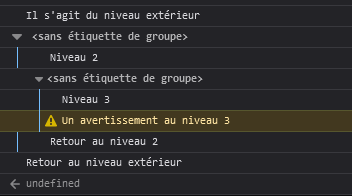

{{APIRef("Console API")}}

La méthode **`console.group()`** crée un nouveau groupe dans le journal affiché dans la console. Les messages affichés ensuite seront indentés d'un niveau jusqu'à ce que [`console.groupEnd()`](/fr/docs/Web/API/console/groupEnd_static) soit appelée.

{{AvailableInWorkers}}

## Syntaxe

```js-nolint
group()
group(libelle)
```

### Paramètres

- `libelle` {{optional_inline}}
  - : Un libellé pour identifier le groupe.

### Valeur de retour

Aucune ([`undefined`](/fr/docs/Web/JavaScript/Reference/Global_Objects/undefined)).

## Exemples

Vous pouvez utiliser des groupes imbriqués pour organiser l'affichage dans la console et regrouper les messages associés. Pour créer un nouveau bloc imbriqué, on appellera `console.group()`. La méthode [`console.groupCollapsed()`](/fr/docs/Web/API/console/groupCollapsed_static) est similaire, mais produit un groupe replié par défaut (il faut cliquer sur le symbole de dépliage pour voir les messages).

Pour clôturer le groupe courant, on appellera [`console.groupEnd()`](/fr/docs/Web/API/console/groupEnd_static). Par exemple, si on a écrit&nbsp;:

```js
console.log("Il s'agit du niveau extérieur");
console.group();
console.log("Niveau 2");
console.group();
console.log("Niveau 3");
console.warn("Un avertissement au niveau 3");
console.groupEnd();
console.log("Retour au niveau 2");
console.groupEnd();
console.log("Retour au niveau extérieur");
```

L'affichage dans la console ressemblera à ceci&nbsp;:



Voir [Utiliser les groupes dans la console](/fr/docs/Web/API/console#utiliser_des_groupes_dans_la_console) pour plus de détails.

## Spécifications

{{Specifications}}

## Compatibilité des navigateurs

{{Compat}}

## Voir aussi

- [`console.groupEnd()`](/fr/docs/Web/API/console/groupEnd_static)
- [`console.groupCollapsed()`](/fr/docs/Web/API/console/groupCollapsed_static)
