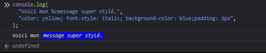
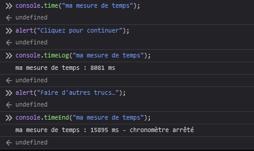
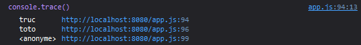

{{APIRef("Console API")}}

L'objet **`console`** donne accès à la console de débogage du navigateur (par exemple, la [Console Web](/fr/docs/Tools/Web_Console) dans Firefox). Les spécificités de fonctionnement varient d'un navigateur à l'autre, mais il y a tout de même un ensemble de fonctionnalités qui sont fournies de base.

La `console` est accessible de n'importe quel objet global, {{domxref("Window")}} du cadre de navigation, {{domxref("WorkerGlobalScope")}} et ses variantes spécifiques pour les workers. Elle est exposée comme {{domxref ("Window.console")}} et peut être référencée simplement comme console. Par exemple :

```js
console.log("Failed to open the specified link")
```

Cette page documente les {{anch("Methods", "méthodes")}} disponibles pour l'objet `console` et donne quelques {{anch("Usage", "exemples d'utilisation")}}.

{{AvailableInWorkers}}

## Méthodes

- {{domxref("Console.assert()")}}
  - : Affiche un message et une trace d'appels dans la console si l'assertion en argument est à `false`.
- {{domxref("Console.clear()")}}
  - : Vide la console.
- {{domxref("Console.count()")}}
  - : Affiche le nombre de fois que la ligne a été appelée avec un label donné.
- {{domxref("Console.debug()")}}
  - : Un alias de `log().`

> **Note :** À partir de Chromium 58, cette méthode n'apparaît que dans les consoles de navigateur Chromium lorsque le niveau "Verbose" est sélectionné.

- {{domxref("Console.dir()")}} {{Non-standard_inline}}
  - : Affiche une liste interactive des propriétés d'un objet JavaScript donné. Cette liste vous permet d'examiner le contenu des enfants de l'objet en ouvrant les détails (petits triangles).
- {{domxref("Console.dirxml()")}} {{Non-standard_inline}}
  - : Affiche si possible une représentation d'éléments XML/HTML d'un objet spécifié. Sinon, c'est une vue de l'objet JavaScript.
- {{domxref("Console.error()")}}
  - : Affiche un message d'erreur. Vous pouvez utiliser les [caractères de substitution](/fr/docs/Web/API/console#Utiliser_les_caractères_de_substitution) et des arguments supplémentaires avec cette méthode.
- {{domxref("Console._exception()")}} {{Non-standard_inline}} {{deprecated_inline}}
  - : Un alias d'`error();`
- {{domxref("Console.group()")}}
  - : Crée un nouveau [groupe](/fr/docs/Web/API/console#Using_groups_in_the_console) en ligne, correspondant à un nouveau niveau d'indentation. Contrairement à `group()`. Pour revenir au niveau précédent, appeler `groupEnd()`.
- {{domxref("Console.groupCollapsed()")}}
  - : Crée un nouveau [groupe](/fr/docs/Web/API/console#Using_groups_in_the_console) en ligne, correspondant à un nouveau niveau d'indentation. Contrairement à `group()` , cela commence avec le groupe en ligne effondré, nécessitant l'utilisation d'un bouton de divulgation pour l'agrandir. Pour revenir au niveau précédent, appeler `groupEnd()`.
- {{domxref("Console.groupEnd()")}}
  - : Quitte le [groupe](/fr/docs/Web/API/console#Using_groups_in_the_console) d'indentation courant.
- {{domxref("Console.info()")}}
  - : Affiche un message d'information. Vous pouvez utiliser les [caractères de substitution](/fr/docs/Web/API/console#Utiliser_les_caractères_de_substitution) et des arguments supplémentaires avec cette méthode.
- {{domxref("Console.log()")}}
  - : Permet d'afficher des messages dans la console. Vous pouvez utiliser les [caractères de substitution](/fr/docs/Web/API/console#Utiliser_les_caractères_de_substitution) et des arguments supplémentaires avec cette méthode.
- {{domxref("Console.profile()")}} {{Non-standard_inline}}
  - : démarre le profilage du navigateur (par exemple, l'[outil performances de Firefox](/fr/docs/Outils/Performance)). Vous pouvez spécifier un nom en option pour ce profil.
- {{domxref("Console.profileEnd()")}} {{Non-standard_inline}}
  - : Arrête le profilage. Vous pouvez voir le résultat de ce dernier dans l'outil « performance » du navigateur (par exemple, l'[outil performance Firefox](/fr/docs/Outils/Performance)).
- {{domxref("Console.table()")}}
  - : Affiche des données tabulaires comme un tableau.
- {{domxref("Console.time()")}}
  - : Démarre un [chronomètre](/fr/docs/Web/API/console#Timers) que l'on peut nommer en le spécifiant en tant que paramètre. Jusqu'à 10 000 chronomètres simultanés peuvent tourner sur une page.
- {{domxref("Console.timeEnd()")}}
  - : Arrête le [chronomètre](/fr/docs/Web/API/console#Timers) spécifié et affiche le temps écoulé en millisecondes depuis son démarrage.
- {{domxref("Console.timeStamp()")}} {{Non-standard_inline}}
  - : Ajoute un marqueur dans la [Timeline](https://developer.chrome.com/devtools/docs/timeline) du navigateur ou l'outil [Waterfall](/fr/docs/Outils/Performance/Waterfall).
- {{domxref("Console.trace()")}}
  - : Affiche une [trace d'appels](/fr/docs/Web/API/console#Traces_d%27appel).
- {{domxref("Console.warn()")}}
  - : Affiche un message d'avertissement. Vous pouvez utiliser les [caractères de substitution](/fr/docs/Web/API/console#Utiliser_les_caractères_de_substitution) et des arguments supplémentaires avec cette méthode.

## Exemples d'utilisation

### Afficher du texte dans la console

La fonction la plus utilisée de la console est d'afficher du texte ou autres données. Il y a quatre sortes d'affichages que vous pouvez générer, en utilisant les méthodes {{domxref("console.log()")}}, {{domxref("console.info()")}}, {{domxref("console.warn()")}}, et {{domxref("console.error()")}}. Chacune de ces méthodes génére un affichage différent dans la console, et vous pouvez utiliser les fonctions de filtrage du navigateur pour voir uniquement les types de sortie qui vous intéressent.

Il y a deux manières d'utiliser chacune de ces méthodes de sortie ; Vous pouvez passer une liste d'objets dont leur représentation sera concaténée dans une seule chaine et s'affichera dans la console, ou vous pouvez passer une chaîne de caractères contenant zéro et plus de caractères de substitution suivis d'une liste d'objets avec lesquels les remplacer.

#### Afficher un seul objet

La manière la plus simple d'utiliser les méthodes de « log » est d'afficher un seul objet :

```js
var someObject = { str: "Some text", id: 5 };
console.log(someObject);
```

L'affichage ressemblera à ceci :

    [09:27:13.475] ({str:"Some text", id:5})

#### Afficher plusieurs objets

Vous pouvez aussi afficher plusieurs objets, en les séparant par une virgule, comme ceci :

```js
var car = "Dodge Charger";
var someObject = {str:"Some text", id:5};
console.info("My first car was a", car, ". The object is: ", someObject);
```

L'affichage ressemblera à ceci :

    [09:28:22.711] My first car was a Dodge Charger . The object is:  ({str:"Some text", id:5})

#### Utiliser les caractères de substitution

Gecko 9.0 {{geckoRelease("9.0")}} a amené le support des caractères de substitution. Lorsque l'on passe en argument une chaîne à l'une des méthodes qui acceptent des chaînes de caractère, on peut utiliser ces caractères de substitution :

<table class="standard-table">
  <tbody>
    <tr>
      <td class="header">caractère de substitution</td>
      <td class="header">description</td>
    </tr>
    <tr>
      <td>%o or %O</td>
      <td>
        Affiche un lien hypertexte sur un objet JavaScript. Cliquer le lien
        ouvre l'inspecteur.
      </td>
    </tr>
    <tr>
      <td>%d or %i</td>
      <td>
        Affiche un entier. Le formatage des nombres est supporté, par exemple
        console.log ("Foo% .2d", 1.1) affichera le nombre sous forme de deux
        chiffres significatifs avec un 0 : Foo 01
      </td>
    </tr>
    <tr>
      <td>%s</td>
      <td>Affiche une chaîne de caractères.</td>
    </tr>
    <tr>
      <td>%f</td>
      <td>
        Affiche un nombre réél. Le formatage est supporté, par exemple,
        <code>console.log("Foo %.2f", 1.1)</code> affichera un nombre avec 2
        décimales : <code>Foo 1.10</code> .
      </td>
    </tr>
  </tbody>
</table>

Chacun de ceux-ci ira chercher l'argument qui suit la chaîne à formater. Par exemple :

    for (var i=0; i<5; i++) {
      console.log("Hello, %s. You've called me %d times.", "Bob", i+1);
    }

L'affichage ressemblera à ceci :

    [13:14:13.481] Hello, Bob. You've called me 1 times.
    [13:14:13.483] Hello, Bob. You've called me 2 times.
    [13:14:13.485] Hello, Bob. You've called me 3 times.
    [13:14:13.487] Hello, Bob. You've called me 4 times.
    [13:14:13.488] Hello, Bob. You've called me 5 times.

#### Donner un style à l'affichage de la console

Vous pouvez utiliser l'instruction `"%c"` pour appliquer du style CSS à l'affichage de la console :

```js
console.log("This is %cMy stylish message", "color: yellow; font-style: italic; background-color: blue;padding: 2px");
```



> **Note :** Un certain nombre de propriétés CSS sont supportées par ce style; vous devriez expérimenter et voir lesquels s'avèrent utiles.

{{h3_gecko_minversion("Using groups in the console", "9.0")}}

Vous pouvez utiliser des groupes imbriqués pour vous aider à vous repérer dans l'affichage. Pour créer un nouveau bloc, appelez `console.group()`. La méthode `console.groupCollapsed()` est similaire, mais elle crée un bloc qui sera réduit.

> **Note :** "Collapsed groups" ne sont pas supportés pour l'instant dans Gecko; La méthode `groupCollapsed()` est la même que `group()` en ce moment.

Pour quitter le groupe dans lequel on est, appeler `console.groupEnd()`. Par exemple, examinez ce code :

```js
console.log("This is the outer level");
console.group();
console.log("Level 2");
console.group();
console.log("Level 3");
console.warn("More of level 3");
console.groupEnd();
console.log("Back to level 2");
console.groupEnd();
console.debug("Back to the outer level");
```

L'affichage ressemblera à ceci :


{{h3_gecko_minversion("Timers", "10.0")}}

Pour calculer la durée d'une opération spécifique, Gecko 10 a amené le supports des chronomètres dans l'objet `console`.  pour démarrer un chronomètre, appelez la méthode ` console.time``() ` en lui donnant un seul paramètre, son nom. Pour arrêter le chronomètre et obtenir le temps écoulé en millisecondes, utilisez la méthode `console.timeEnd()`, en passant à nouveau le nom du chronomètre comme paramètre. Une seule page peut faire tourner un maximum de 10.000 chronomètres.

Par exemple, voici ce code :

```js
console.time("answer time");
alert("Click to continue");
console.timeEnd("answer time");
```

affichera le temps pour l'utilisateur dont il a eu besoin pour faire disparaitre la fenêtre d'alerte :



Notez que le nom du chronomètre est affiché deux fois, à son départ et quand il se termine.

> **Note :** Il est important de noter que si vous vous servez de ceci pour enregistrer les durées du traffic réseau, le chronomètre renverra le temps total d'échanges, alors que les durées affichées dans l'onglet network représente seulement la durée à la réception du header. Si vous avez activer l'enregistrement de réponse du body, le temps listé pour la réponse du header et du body devrait correspondre à ce qu'affiche la sortie de la console.

### Traces d'appel

L'objet console supporte aussi l'affichage d'une trace d'appels ; cela montre le chemin pris pour atteindre l'endroit auquel vous avez fait appel à la fonction {{domxref("console.trace()")}}. Ce qui donne avec ce code :

    foo();

    function foo() {
      function bar() {
        console.trace();
      }
      bar();
    }

L'affichage dans la console ressemblera à ceci :



## Spécification

| Specification                        | Status                           | Comment              |
| ------------------------------------ | -------------------------------- | -------------------- |
| {{SpecName('Console API')}} | {{Spec2('Console API')}} | Définition initiale. |

## Notes

- Au moins dans Firefox, si une page définit un objet console, cet objet remplace celui créé dans Firefox.
- Antérieur à {{Gecko ("12.0")}}, les méthodes de l'objet console ne fonctionnent que lorsque la console Web est ouverte. À partir de {{Gecko ("12.0")}}, la sortie est mise en cache jusqu'à ce que la console Web soit ouverte, puis affichée à ce moment-là.
- Il est à noter que l'objet de console intégré de Firefox est compatible avec celui fourni par [Firebug](http://getfirebug.com/).

## Voir aussi

- [Outils de développement](/fr/docs/Outils)
- [Console web](/fr/docs/Outils/Console_Web) - comment la console Web de Firefox gère les appels d'API de console
- [Débogage distant](/fr/docs/Outils/D%C3%A9bogage_distant) - comment afficher la sortie de la console lorsque la cible de débogage est un périphérique mobile
- [Journalisation console sur l'appareil](/fr/docs/Archive/B2G_OS/Debugging/Journalisation_console) - comment se connecter sur les appareils Firefox OS

### Autres implémentations

- [Google Chrome DevTools](https://developers.google.com/chrome-developer-tools/docs/console-api)
- [Firebug](http://getfirebug.com/wiki/index.php/Console_API)
- [Internet Explorer](<http://msdn.microsoft.com/en-us/library/hh772173(v=vs.85).aspx>)
- [Safari](https://developer.apple.com/library/safari/documentation/AppleApplications/Conceptual/Safari_Developer_Guide/Console/Console.html)
