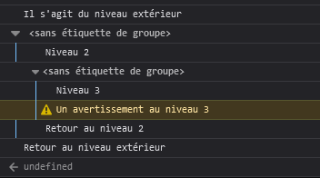

{{APIRef("Console API")}}

L'objet **`console`** permet d'accéder à la console de débogage de l'environnement JavaScript (par exemple [la console web](https://firefox-source-docs.mozilla.org/devtools-user/web_console/index.html) de Firefox). Son fonctionnement varie d'un navigateur à l'autre, mais certaines fonctionnalités sont standardisées et généralement fournies.

On peut accéder à l'objet `console` depuis n'importe quel objet global, [`Window`](/fr/docs/Web/API/Window) pour les contextes de navigation classiques et [`WorkerGlobalScope`](/fr/docs/Web/API/WorkerGlobalScope) dans les <i lang="en">workers</i>, grâce à la propriété `console`. Exposé via [`Windows.console`](/fr/docs/conflicting/Web/API/console), on peut y faire référence avec `console`. Par exemple&nbsp;:

```js
console.log("Erreur à l'ouverture du lien indiqué.");
```

Dans cette page, nous verrons [les méthodes](#méthodes) disponibles sur l'objet `console` et donnerons quelques [cas d'utilisation](#cas_dutilisation).

{{AvailableInWorkers}}

> [!NOTE]
> Certains IDE et éditeurs peuvent implémenter l'API Console différemment. Cela se traduit par un comportement différent ou une absence de certaines fonctionnalités de l'API. Par exemple, les méthodes liées aux chronomètres pourraient ne pas afficher les durées en sortie. En cas de doute, utilisez la console des outils de développement de votre navigateur pour observer le fonctionnement décrit dans cette documentation.

## Méthodes statiques

- [`console.assert()`](/fr/docs/Web/API/console/assert_static)
  - : Affiche un message dans la console si l'assertion passée comme premier argument est fausse.
- [`console.clear()`](/fr/docs/Web/API/console/clear_static)
  - : Vide le contenu de la console.
- [`console.count()`](/fr/docs/Web/API/console/count_static)
  - : Affiche le nombre de fois que le compteur avec le libellé correspondant a été appelé.
- [`console.countReset()`](/fr/docs/Web/API/console/countReset_static)
  - : Réinitialise la valeur du compteur avec le libellé corredpondant.
- [`console.debug()`](/fr/docs/Web/API/console/debug_static)
  - : Affiche un message de débogage dans la console.
- [`console.dir()`](/fr/docs/Web/API/console/dir_static)
  - : Affiche une représentation hiérarchique d'un objet JavaScript. L'interface utilisateur permet de déplier l'arborescence pour examiner le contenu des objets enfants.
- [`console.dirxml()`](/fr/docs/Web/API/console/dirxml_static)
  - : Affiche une représentation d'un objet XML/HTML fourni (ou la vue JavaScript équivalente de `console.dir()` par défaut).
- [`console.error()`](/fr/docs/Web/API/console/error_static)
  - : Affiche un message d'erreur. Ce message peut contenir des [chaînes de caractères de substitution](#utiliser_des_chaînes_de_substitution) et d'autres valeurs fournies comme arguments complémentaires.
- `console.exception()` {{Non-standard_inline}} {{deprecated_inline}}
  - : Un synonyme pour `console.error()`.
- [`console.group()`](/fr/docs/Web/API/console/group_static)
  - : Crée un nouveau [groupe](#utiliser_des_groupes_dans_la_console), indentant l'affichage des messages suivants. Pour revenir au niveau courant, on appellera `console.groupEnd()`.
- [`console.groupCollapsed()`](/fr/docs/Web/API/console/groupCollapsed_static)
  - : Crée un nouveau [groupe](#utiliser_des_groupes_dans_la_console), indentant l'affichage des messages suivants. Toutefois, contrairement à `console.group()`, les messages du groupe sont repliés. Pour revenir au niveau courant, on appellera `console.groupEnd()`.
- [`console.groupEnd()`](/fr/docs/Web/API/console/groupEnd_static)
  - : Ferme le [groupe](#utiliser_des_groupes_dans_la_console) courant.
- [`console.info()`](/fr/docs/Web/API/console/info_static)
  - : Affiche des informations dans la console. Ce message peut contenir des [chaînes de caractères de substitution](#utiliser_des_chaînes_de_substitution) et d'autres valeurs fournies comme arguments complémentaires.
- [`console.log()`](/fr/docs/Web/API/console/log_static)
  - : Affiche des messages généraux dans la console. Ce message peut contenir des [chaînes de caractères de substitution](#utiliser_des_chaînes_de_substitution) et d'autres valeurs fournies comme arguments complémentaires.
- [`console.profile()`](/fr/docs/Web/API/console/profile_static) {{Non-standard_inline}}
  - : Démarre l'enregistrement d'un profil de performance. Un nom peut être fourni en argument et associé au profil ainsi créé.
- [`console.profileEnd()`](/fr/docs/Web/API/console/profileEnd_static) {{Non-standard_inline}}
  - : Arrête l'enregistrement du profil de performance.
- [`console.table()`](/fr/docs/Web/API/console/table_static)
  - : Affiche des données tabulaires sous forme d'un tableau.
- [`console.time()`](/fr/docs/Web/API/console/time_static)
  - : Démarre un [chronomètre](#chronomètres) avec un nom fourni en paramètre.
- [`console.timeEnd()`](/fr/docs/Web/API/console/timeEnd_static)
  - : Arrête le [chronomètre](#chronomètres) indiqué et affiche la durée écoulée (exprimée en millisecondes) depuis le début de la mesure.
- [`console.timeLog()`](/fr/docs/Web/API/console/timeLog_static)
  - : Affiche la valeur du [chronomètre](#chronomètres) indiqué dans la console.
- [`console.timeStamp()`](/fr/docs/Web/API/console/timeStamp_static) {{Non-standard_inline}}
  - : Ajoute un marqueur de performance pour l'outil de mesure des performances du navigateur ([Firefox](https://profiler.firefox.com/docs/#/), [Chrome](https://developer.chrome.com/docs/devtools/performance/reference)).
- [`console.trace()`](/fr/docs/Web/API/console/trace_static)
  - : Affiche la [trace de la pile d'appels](#trace_de_piles_dappels).
- [`console.warn()`](/fr/docs/Web/API/console/warn_static)
  - : Affiche un message d'avertissement dans la console. Ce message peut contenir des [chaînes de caractères de substitution](#utiliser_des_chaînes_de_substitution) et d'autres valeurs fournies comme arguments complémentaires.

## Exemples

### Afficher du texte dans la console

On utilise la plupart du temps la console pour journaliser du texte et d'autres données. Il existe plusieurs catégories de messages qu'on peut afficher grâce aux méthodes [`console.log()`](/fr/docs/Web/API/console/log_static), [`console.info()`](/fr/docs/Web/API/console/info_static), [`console.warn()`](/fr/docs/Web/API/console/warn_static), [`console.error()`](/fr/docs/Web/API/console/error_static), et [`console.debug()`](/fr/docs/Web/API/console/debug_static). Les messages de chacune de ces méthodes seront affichés différemment et l'interface du navigateur vous permettra de les filtrer en fonction du niveau qui vous intéresse.

Chacune de ces méthodes peut être utilisée de deux façons&nbsp;: soit en passant une liste d'objet dont les représentations en texte seront concaténées sur une seule chaîne de caractères puis affichées, soit en passant une chaîne de caractères contenant plusieurs chaînes de substitution, suivie d'une liste d'objet pour ces substitutions.

#### Afficher un objet

Un usage simple consiste à afficher les informations d'un objet&nbsp;:

```js
const unObjet = { str: "Du texte", id: 5 };
console.log(unObjet);
```

Le résultat dans la console ressemblera à&nbsp;:

```plain
{str:"Du texte", id:5}
```

#### Afficher plusieurs objets

On peut aussi afficher les données de plusieurs objets&nbsp;:

```js
const voiture = "Peugeot 404";
const unObjet = { str: "Du texte", id: 5 };
console.info(
  "Ma première voiture était une ",
  voiture,
  ". L'objet est :",
  unObjet,
);
```

Dans la console, on verra le message suivant&nbsp;:

```plain
Ma première voiture était une Peugeot 404. L'objet est : {str:"Du texte", id:5}
```

#### Utiliser des chaînes de substitution

Lorsqu'on passe une chaîne de caractères à l'une des méthodes d'affichage de `console` (telle que `log()`), on peut utiliser des chaînes de substitution&nbsp;:

- `%o` ou `%O`
  - : Permettra d'afficher un objet JavaScript. L'interface permettra de cliquer sur le nom de l'objet pour consulter plus d'informations dans l'inspecteur.
- `%d` ou `%i`
  - : Permettra d'afficher un entier. Le formatage numérique est pris en charge et on pourra par exemple écrire `console.log("Toto %.2d", 1.1)` qui indiquera qu'il faut écrire le nombre avec deux chiffres significatifs et un 0 devant&nbsp;: `Toto 01`.
- `%s`
  - : Permettra d'afficher une chaîne de caractères.
- `%f`
  - : Permettra d'afficher une valeur décimale. Le formatage numérique est pris en charge et on pourra par exemple écrire `console.log("Toto %.2f", 1.1)` pour avoir deux chiffres décimaux&nbsp;: `Toto 1.10`.

> [!WARNING]
> Ce formatage pour la précision numérique ne fonctionne pas dans Chrome.

Chaque chaîne de substitution est associé au paramètre correspondant dans la liste (la première chaîne avec le deuxième paramètre, la deuxième chaîne avec le troisième paramètre, et ainsi de suite).

```js
for (let i = 0; i < 5; i++) {
  console.log("Coucou, %s. Vous m'avez appelé %d fois.", "Olivier", i + 1);
}
```

Avec le fragment de code précédent, le résultat sera&nbsp;:

```plain
Coucou, Olivier. Vous m'avez appelé 1 fois.
Coucou, Olivier. Vous m'avez appelé 2 fois.
Coucou, Olivier. Vous m'avez appelé 3 fois.
Coucou, Olivier. Vous m'avez appelé 4 fois.
Coucou, Olivier. Vous m'avez appelé 5 fois.
```

#### Mettre en forme la sortie de la console

La directive `%c` permet d'appliquer une règle CSS pour mettre en forme le message dans la console&nbsp;:

```js
console.log(
  "Voici mon %cmessage super stylé.",
  "color: yellow; font-style: italic; background-color: blue;padding: 2px",
);
```

Le texte situé avant la directive n'est pas modifié. Le texte situé après sera mis en forme à l'aide des déclarations CSS du deuxième paramètre.


La directive `%c` peut être utilisée plusieurs fois&nbsp;:

```js
console.log(
  "Utilisation de plusieurs styles : %cred %corange",
  "color: red",
  "color: orange",
  "Un message non mis en forme",
);
```

Les propriétés qui peuvent être utilisées avec cette syntaxe sont (au moins pour Firefox)&nbsp;:

- [`background`](/fr/docs/Web/CSS/background) et les propriétés détaillées correspondantes
- [`border`](/fr/docs/Web/CSS/border) et les propriétés détaillées correspondantes
- [`border-radius`](/fr/docs/Web/CSS/border-radius)
- [`box-decoration-break`](/fr/docs/Web/CSS/box-decoration-break)
- [`box-shadow`](/fr/docs/Web/CSS/box-shadow)
- [`clear`](/fr/docs/Web/CSS/clear) et [`float`](/fr/docs/Web/CSS/float)
- [`color`](/fr/docs/Web/CSS/color)
- [`cursor`](/fr/docs/Web/CSS/cursor)
- [`display`](/fr/docs/Web/CSS/display)
- [`font`](/fr/docs/Web/CSS/font) et les propriétés détaillées correspondantes
- [`line-height`](/fr/docs/Web/CSS/line-height)
- [`margin`](/fr/docs/Web/CSS/margin)
- [`outline`](/fr/docs/Web/CSS/outline) et les propriétés détaillées correspondantes
- [`padding`](/fr/docs/Web/CSS/padding)
- Les propriétés `text-*` comme [`text-transform`](/fr/docs/Web/CSS/text-transform)
- [`white-space`](/fr/docs/Web/CSS/white-space)
- [`word-spacing`](/fr/docs/Web/CSS/word-spacing) et [`word-break`](/fr/docs/Web/CSS/word-break)
- [`writing-mode`](/fr/docs/Web/CSS/writing-mode)

> [!NOTE]
> Le message de la console se comporte par défaut comme un élément en ligne. Pour observer des effets avec `padding`, `margin` ou autre, il faut modifier son affichage, par exemple avec `display: inline-block`.

### Utiliser des groupes dans la console

On peut utiliser des groupes imbriqués pour organiser le contenu affiché dans la console. Pour créer un nouveau groupe, on utilisera la méthode `console.group()`. La méthode `console.groupCollapsed()` permettra également de créer un groupe, mais qui sera automatiquement replié (et qu'il faudra déplier via l'interface pour en consulter les informations).

Pour clôturer le groupe courant, on appellera `console.groupEnd()`. Ainsi, si on écrit&nbsp;:

```js
console.log("Il s'agit du niveau extérieur");
console.group();
console.log("Niveau 2");
console.group();
console.log("Niveau 3");
console.warn("Un avertissement au niveau 3");
console.groupEnd();
console.log("Retour au niveau 2");
console.groupEnd();
console.log("Retour au niveau extérieur");
```

L'affichage dans la console ressemblera à ceci&nbsp;:



### Chronomètres

On peut démarrer un chronomètre pour mesurer la durée d'une opération donnée. Pour lancer un chronomètre, on appellera la méthode `console.time()`, à laquelle on pourra passer un nom comme paramètre. Pour arrêter le chronomètre et obtenir la durée écoulée, on appellera la méthode `console.timeEnd()` (à laquelle on pourra aussi passer un nom en argument pour arrêter un chronomètre donné). Pour une page web donnée, on peut exécuter jusqu'à 10&nbsp;000 chronomètres simultanément.

Si on écrit cela, par exemple&nbsp;:

```js
console.time("ma mesure de temps");
alert("Cliquez pour continuer");
console.timeLog("ma mesure de temps");
alert("Faire d'autres trucs…");
console.timeEnd("ma mesure de temps");
```

Avec le fragment de code ci-avant, on affichera le temps écoulé après que la personne a fermé la première fenêtre modale, puis le temps total pris pour fermer les deux fenêtres&nbsp;:


On peut voir que le nom du chronomètre est affiché au démarrage et à l'arrêt de celui-ci.

### Traces de piles d'appels

L'objet `console` permet également d'afficher une trace de pile d'appels. Cela permet de connaître la pile d'appels suivie pour atteindre le point où la méthode [`console.trace()`](/fr/docs/Web/API/console/trace_static) a été appelée&nbsp;:

```js
function toto() {
  function truc() {
    console.trace();
  }
  truc();
}

toto();
```

Avec le fragment de code précédent, on aura la trace suivante dans la console&nbsp;:


## Spécifications

{{Specifications}}

## Compatibilité des navigateurs

{{Compat}}

> [!NOTE]
> Dans Firefox, si une page définit un objet `console`, cet objet surchargera l'objet natif exposé par Firefox.

## Voir aussi

- [Google Chrome](https://developer.chrome.com/docs/devtools/console/api/)
- [Microsoft Edge](https://learn.microsoft.com/en-us/microsoft-edge/devtools-guide-chromium/console/)
- [Apple Safari](https://developer.apple.com/library/archive/documentation/AppleApplications/Conceptual/Safari_Developer_Guide/Console/Console.html)
- [Mozilla Firefox](https://firefox-source-docs.mozilla.org/devtools-user/web_console/index.html)
