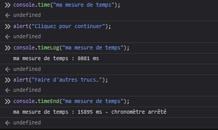

{{APIRef("Console API")}}

La méthode **`console.timeEnd()`** arrête un chronomètre qui avait été démarré à l'aide de [`console.time()`](/fr/docs/Web/API/console/time_static).

Voir [la section sur les chronomètres de la documentation de `console`](/fr/docs/Web/API/console#chronomètres) pour plus de détails et d'exemples.

{{AvailableInWorkers}}

## Syntaxe

```js-nolint
timeEnd()
timeEnd(libelle)
```

### Paramètres

- `libelle` {{optional_inline}}
  - : Une chaîne de caractères qui représente le nom à donner au chronomètre. Lorsque le chronomètre associé est arrêté, la durée écoulée (exprimée en millisecondes) est affichée dans la console avec une indication que la mesure est terminée. Si cet argument est omis, le libellé `"default"` sera utilisé.

### Valeur de retour

Aucune ([`undefined`](/fr/docs/Web/JavaScript/Reference/Global_Objects/undefined)).

## Exemples

```js
console.time("ma mesure de temps");
alert("Cliquez pour continuer");
console.timeLog("ma mesure de temps");
alert("Faire d'autres trucs…");
console.timeEnd("ma mesure de temps");
```

Avec le fragment de code ci-avant, on affichera le temps écoulé après que la personne a fermé la première fenêtre modale, puis le temps total pris pour fermer les deux fenêtres&nbsp;:



On notera que le nom du chronomètre est affiché avec la durée lors de l'appel à `timeLog()`, puis lors de l'arrêt. Quand on appelle `timeEnd()`, on a en plus le message «&nbsp;chronomètre arrêté&nbsp;» qui précise que le chronomètre est terminé.

## Spécifications

{{Specifications}}

## Compatibilité des navigateurs

{{Compat}}

## Voir aussi

- [`console.time()`](/fr/docs/Web/API/console/time_static)
- [`console.timeLog()`](/fr/docs/Web/API/console/timeLog_static)
