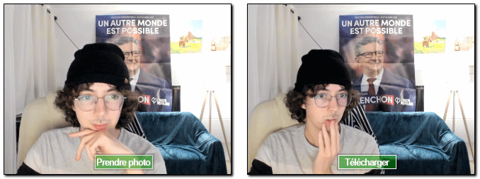

{{DefaultAPISidebar("Media Capture and Streams")}}

Dans cet article, nous verrons comment utiliser [`navigator.mediaDevices.getUserMedia()`](/fr/docs/Web/API/MediaDevices/getUserMedia) pour accéder à la caméra de votre ordinateur ou de votre téléphone afin de prendre des photos avec.



Vous pouvez directement aller voir [la démo](#démonstration) si vous préférez.

## Le balisage HTML

[Notre interface HTML](#html) possède deux sections utiles&nbsp;: la première qui affiche le flux vidéo où on peut faire la capture et la seconde qui présente le résultat de la photo. Ces deux régions sont affichées côte à côte, chacune dans un élément [`<div>`](/fr/docs/Web/HTML/Element/div) (ce qui simplifie la mise en forme et le contrôle).

Le premier panneau à gauche possède deux composants&nbsp;:

- Un élément [`<video>`](/fr/docs/Web/HTML/Element/video) qui reçoit le flux vidéo provenant de `navigator.mediaDevices.getUserMedia()`
- Un élément [`<button>`](/fr/docs/Web/HTML/Element/Button) sur lequel la personne pourra cliquer pour capturer une image de la vidéo.

```html
<div class="camera">
  <video id="video">Le flux vidéo n'est pas disponible.</video>
  <button id="startbutton">Prendre une photo</button>
</div>
```

Ces éléments sont plutôt basiques, nous verrons comment ils sont reliés avec le code JavaScript.

Pour le second panneau, nous avons un élément [`<canvas>`](/fr/docs/Web/HTML/Element/canvas) qui contient les images capturées (éventuellement traitées) et qui sont converties en fichiers image. Le canevas est masqué en utilisant [`display: none`](/fr/docs/Web/CSS/display) pour éviter d'encombrer l'écran. Son contenu ne représente qu'une étape qui n'a pas nécessairement à être montrée.

Nous avons également un élément [``](/fr/docs/Web/HTML/Element/Img) sur lequel nous afficherons l'image, dans sa version finale.

```html
<canvas id="canvas"> </canvas>
<div class="output">
  
</div>
```

Et voici pour ce qui concerne la partie intéressante du HTML. Le reste correspond à des éléments de mise en page et à un lien vers cette même page.

## Le code JavaScript

Voyons maintenant [le code JavaScript](#javascript). Nous décomposerons en différents fragments pour faciliter l'explication.

### Initialisation

On commence par envelopper l'ensemble du script dans une fonction anonyme afin d'éviter de propager des variables globales. On définit ensuite différentes variables que nous utiliserons.

```js
(() => {
  const width = 320;    // On redimensionnera la photo pour avoir cette largeur
  const height = 0;     // Cela sera calculé à partir du flux d'entrée

  const streaming = false;

  let video = null;
  let canvas = null;
  let photo = null;
  let startbutton = null;
```

Les variables seront utilisées ainsi&nbsp;:

- `width`
  - : Quelle que soit la taille de la vidéo entrante, on mettra à l'échelle l'image résultante afin qu'elle ait une largeur de 320 pixels.
- `height`
  - : La hauteur de l'image résultante sera calculée selon la largeur (`width`) et les proportions du flux.
- `streaming`
  - : Indique s'il y a actuellement un flux vidéo actif.
- `video`
  - : Contiendra une référence à l'élément [`<video>`](/fr/docs/Web/HTML/Element/video) lorsque le chargement de la page aura été effectué.
- `canvas`
  - : Contiendra une référence à l'élément [`<canvas>`](/fr/docs/Web/HTML/Element/canvas) lorsque le chargement de la page aura été effectué.
- `photo`
  - : Contiendra une référence à l'élément [``](/fr/docs/Web/HTML/Element/Img) lorsque le chargement de la page aura été effectué.
- `startbutton`
  - : Contiendra une référence à l'élément [`<button>`](/fr/docs/Web/HTML/Element/Button) utilisé pour déclencher la capture. Elle sera obtenue lorsque la page aura été chargée.

### La fonction `startup()`

La fonction `startup()` est exécutée lorsque le chargement de la page est terminé, grâce à [`EventTarget.addEventListener()`](/fr/docs/Web/API/EventTarget/addEventListener). Le rôle de cette fonction consiste à demander l'accès à la webcam de la personne, à initialiser l'élément [``](/fr/docs/Web/HTML/Element/Img) de sortie dans un état par défaut, puis à mettre en place les gestionnaires d'évènement nécessaires pour recevoir chaque image de la vidéo provenant de la caméra et pour réagir au clic sur le bouton pour capturer une image.

#### Obtenir des références aux éléments

Au début de cette fonction, on récupère des références aux éléments principaux qu'il faudra manipuler.

```js
  function startup() {
    video = document.getElementById('video');
    canvas = document.getElementById('canvas');
    photo = document.getElementById('photo');
    startbutton = document.getElementById('startbutton');
```

#### Obtenir le flux vidéo

La prochaine tâche consiste à obtenir le flux vidéo&nbsp;:

```js
navigator.mediaDevices
  .getUserMedia({ video: true, audio: false })
  .then((stream) => {
    video.srcObject = stream;
    video.play();
  })
  .catch((err) => {
    console.error(`Une erreur est survenue : ${err}`);
  });
```

C'est ici qu'on appelle [`MediaDevices.getUserMedia()`](/fr/docs/Web/API/MediaDevices/getUserMedia) et qu'on demande un flux vidéo (sans audio). Cette fonction renvoie une promesse à laquelle nous attachons des fonctions de rappel pour les cas de réussite ou d'échec.

La fonction de rappel utilisée lorsque ça fonctionne correctement reçoit un objet `stream` en entrée. Cet objet sera utilisé comme source pour l'élément [`<video>`](/fr/docs/Web/HTML/Element/video).

Lorsque le flux est relié à l'élément `<video>`, on lance la lecture à l'aide de [`HTMLMediaElement.play()`](/fr/docs/Web/API/HTMLMediaElement#play).

La fonction de rappel pour la gestion des erreurs intervient si l'ouverture du flux ne fonctionne pas. Cela se produit par exemple s'il n'y a pas de caméra compatible ou si la personne a refusé l'accès à la webcam.

#### Gérer le début de lecture de la vidéo

Après avoir appelé [`HTMLMediaElement.play()`](/fr/docs/Web/API/HTMLMediaElement#play) sur `video`, on a un délai (a priori court) qui s'écoule avant que le flux de la vidéo arrive effectivement. Pour éviter de bloquer pendant ce délai, on ajoute un gestionnaire pour l'évènement [`canplay`](/fr/docs/Web/API/HTMLMediaElement/canplay_event), qui se produit lorsque la lecture commence effectivement. À ce moment, on sait alors que les propriétés de l'objet `video` ont été configurées à partir du format du flux vidéo.

```js
video.addEventListener(
  "canplay",
  (ev) => {
    if (!streaming) {
      height = (video.videoHeight / video.videoWidth) * width;

      video.setAttribute("width", width);
      video.setAttribute("height", height);
      canvas.setAttribute("width", width);
      canvas.setAttribute("height", height);
      streaming = true;
    }
  },
  false,
);
```

Cette fonction de rappel ne fait rien à moins qu'elle soit appelée pour la première fois (lorsqu'on teste `streaming`, il vaut `false` la première fois).

S'il s'agit en effet du premier appel, on définit la hauteur de la vidéo en respectant les proportions du flux original et en appliquant le rapport des largeurs (entre celles du flux vidéo `video.videoWidth` et celle du cadre dans laquelle on affiche la vidéo, `width`).

On applique cette largeur (`width`) et cette hauteur (`height`) à la vidéo et au canevas à l'aide de [`Element.setAttribute()`](/fr/docs/Web/API/Element/setAttribute) sur les propriétés correspondantes de chaque élément. Enfin, on passe la variable `streaming` à `true` pour éviter d'exécuter à nouveau ce code.

#### Gérer les clics sur le bouton

Pour capturer une photo lorsque la personne clique sur le bouton `startbutton`, il faut ajouter un gestionnaire d'évènement au bouton, qui sera appelé lorsque l'évènement [`click`](/fr/docs/Web/API/Element/click_event) aura lieu&nbsp;:

```js
startbutton.addEventListener(
  "click",
  (ev) => {
    takepicture();
    ev.preventDefault();
  },
  false,
);
```

Cette fonction se veut simple&nbsp;: on y appelle la fonction `takepicture()` (qu'on verra ci-après dans la section [Capturer une image à partir du flux](#capturer_une_image_à_partir_du_flux)), puis on appelle [`Event.preventDefault()`](/fr/docs/Web/API/Event/preventDefault) sur l'évènement afin d'éviter que le clic soit géré plus d'une fois.

#### Fin de la fonction `startup()`

Il reste ensuite deux lignes de code dans la fonction `startup()`&nbsp;:

```js
    clearphoto();
  }
```

On appelle ici la fonction `clearphoto()` que nous allons décrire dans la section suivante [Réinitialiser le cadre contenant la photo](#réinitialiser_le_cadre_contenant_la_photo).

### Réinitialiser le cadre contenant la photo

Pour réinitialiser le contenu du cadre contenant la photo, on crée une image puis on la convertit dans un format utilisable pour un élément [``](/fr/docs/Web/HTML/Element/Img). Voici le code&nbsp;:

```js
function clearphoto() {
  const context = canvas.getContext("2d");
  context.fillStyle = "#AAA";
  context.fillRect(0, 0, canvas.width, canvas.height);

  const data = canvas.toDataURL("image/png");
  photo.setAttribute("src", data);
}
```

On commence par récupérer une référence à l'élément [`<canvas>`](/fr/docs/Web/HTML/Element/canvas) qu'on utilise pour le rendu en dehors de l'écran. Ensuite, on définit la propriété `fillStyle` avec la couleur `#AAA` (ce qui correspond à un gris clair), et on remplit l'ensemble du canevas avec cette couleur à l'aide de la méthode [`fillRect()`](/fr/docs/Web/API/CanvasRenderingContext2D/fillRect).

Enfin, on convertit le canevas en image PNG puis on appelle [`photo.setAttribute()`](/fr/docs/Web/API/Element/setAttribute) afin d'afficher ce rectangle gris dans le cadre visible.

### Capturer une image à partir du flux

Il nous reste une fonction à définir, et c'est la plus intéressante de cette démonstration&nbsp; la fonction `takepicture()`. Son rôle est de capturer l'image actuellement affichée dans le flux vidéo, de la convertir en fichier PNG, puis de l'afficher dans le cadre de résultat. Voici son code&nbsp;:

```js
function takepicture() {
  const context = canvas.getContext("2d");
  if (width && height) {
    canvas.width = width;
    canvas.height = height;
    context.drawImage(video, 0, 0, width, height);

    const data = canvas.toDataURL("image/png");
    photo.setAttribute("src", data);
  } else {
    clearphoto();
  }
}
```

Comme pour chaque fois où il faut manipuler le contenu d'un canevas, on commence par récupérer [un contexte de dessin 2D](/fr/docs/Web/API/CanvasRenderingContext2D) pour le canevas caché.

Ensuite, si la hauteur et la largeur ne sont pas nulles (indiquant par là qu'il y a potentiellement des données d'image valides), on définit la largeur et la hauteur du canevas pour correspondre à celles de l'image capturée. Ensuite, on appelle [`drawImage()`](/fr/docs/Web/API/CanvasRenderingContext2D/drawImage) afin de dessiner l'image courante de la vidéo dans ce contexte, remplissant ainsi tous le canevas avec l'image.

> **Note :** On tire parti de la ressemblance entre l'interface [`HTMLVideoElement`](/fr/docs/Web/API/HTMLVideoElement) et l'interface [`HTMLImageElement`](/fr/docs/Web/API/HTMLImageElement) lorsqu'on fournit `video` à `drawImage()`.

Lorsque le canevas contient l'image capturée, on la convertit au format PNG à l'aide de [`HTMLCanvasElement.toDataURL()`](/fr/docs/Web/API/HTMLCanvasElement/toDataURL). Enfin, on appelle [`photo.setAttribute()`](/fr/docs/Web/API/Element/setAttribute) pour afficher l'image ainsi formée dans la boîte affichée à l'écran.

S'il n'y a pas d'image valide disponible (autrement dit si `width` et `height` valent tous deux 0), on réinitialise le contenu du cadre en appelant `clearphoto()`.

## Démonstration

### HTML

```html
<div class="contentarea">
  <h1>
    MDN - navigator.mediaDevices.getUserMedia() : illustrer comment capturer une
    image
  </h1>
  <p>
    Dans cet exemple, on illustre comment utiliser un flux média provenant de la
    webcam, en récupérer une image et créer un PNG à partir de celle-ci pour
    l'afficher sur la page.
  </p>
  <div class="camera">
    <video id="video">Le flux vidéo n'est pas disponible.</video>
    <button id="startbutton">Prendre une photo</button>
  </div>
  <canvas id="canvas"> </canvas>
  <div class="output">
    
  </div>
  <p>
    Consultez l'article
    <a
      href="https://developer.mozilla.org/fr/docs/Web/API/WebRTC_API/Taking_still_photos"
      >Prendre des photos avec <code>getUserMedia()</code></a
    >
    pour en savoir plus sur les technologies utilisées ici.
  </p>
</div>
```

### CSS

```css
#video {
  border: 1px solid black;
  box-shadow: 2px 2px 3px black;
  width: 320px;
  height: 240px;
}

#photo {
  border: 1px solid black;
  box-shadow: 2px 2px 3px black;
  width: 320px;
  height: 240px;
}

#canvas {
  display: none;
}

.camera {
  width: 340px;
  display: inline-block;
}

.output {
  width: 340px;
  display: inline-block;
  vertical-align: top;
}

#startbutton {
  display: block;
  position: relative;
  margin-left: auto;
  margin-right: auto;
  bottom: 32px;
  background-color: rgba(0, 150, 0, 0.5);
  border: 1px solid rgba(255, 255, 255, 0.7);
  box-shadow: 0px 0px 1px 2px rgba(0, 0, 0, 0.2);
  font-size: 14px;
  font-family: "Lucida Grande", "Arial", sans-serif;
  color: rgba(255, 255, 255, 1);
}

.contentarea {
  font-size: 16px;
  font-family: "Lucida Grande", "Arial", sans-serif;
  width: 760px;
}
```

### JavaScript

```js
(() => {
  // La largeur et la hauteur de la photo capturée. On utilisera
  // une largeur fixe et on calculera la hauteur pour correspondre
  // aux proportions du flux vidéo d'entrée.

  const width = 320; // On met à l'échelle la photo pour avoir cette largeur
  let height = 0; // On calcule cette valeur ensuite selon le flux d'entrée

  // |streaming| indique si le flux vidéo est en cours
  // Lorsqu'on commence, ce n'est pas le cas (false).

  let streaming = false;

  // On référence les éléments HTML qu'il faudra configurer ou contrôler.
  // Ils seront définis lors de la fonction startup().

  let video = null;
  let canvas = null;
  let photo = null;
  let startbutton = null;

  function showViewLiveResultButton() {
    if (window.self !== window.top) {
      // On s'assure que si notre document est dans une iframe,
      // on invite la personne à ouvrir l'exemple dans un onglet
      // ou une fenêtre séparée. Sinon, le navigateur n'envoie
      // pas la demande d'accès à la caméra.
      document.querySelector(".contentarea").remove();
      const button = document.createElement("button");
      button.textContent =
        "Voir le résultat de l'exemple dont le code est présenté avant";
      document.body.append(button);
      button.addEventListener("click", () => window.open(location.href));
      return true;
    }
    return false;
  }

  function startup() {
    if (showViewLiveResultButton()) {
      return;
    }
    video = document.getElementById("video");
    canvas = document.getElementById("canvas");
    photo = document.getElementById("photo");
    startbutton = document.getElementById("startbutton");

    navigator.mediaDevices
      .getUserMedia({ video: true, audio: false })
      .then((stream) => {
        video.srcObject = stream;
        video.play();
      })
      .catch((err) => {
        console.error(`Une erreur est survenue : ${err}`);
      });

    video.addEventListener(
      "canplay",
      (ev) => {
        if (!streaming) {
          height = video.videoHeight / (video.videoWidth / width);

          // Firefox a un bug où la hauteur ne peut pas être lue
          // à partir de la vidéo. On prend des précautions.

          if (isNaN(height)) {
            height = width / (4 / 3);
          }

          video.setAttribute("width", width);
          video.setAttribute("height", height);
          canvas.setAttribute("width", width);
          canvas.setAttribute("height", height);
          streaming = true;
        }
      },
      false,
    );

    startbutton.addEventListener(
      "click",
      (ev) => {
        takepicture();
        ev.preventDefault();
      },
      false,
    );

    clearphoto();
  }

  // On remplit le cadre de la photo pour indiquer l'absence
  // d'image capturée.

  function clearphoto() {
    const context = canvas.getContext("2d");
    context.fillStyle = "#AAA";
    context.fillRect(0, 0, canvas.width, canvas.height);

    const data = canvas.toDataURL("image/png");
    photo.setAttribute("src", data);
  }

  // On capture une photo en récupérant le contenu courant de la
  // vidéo, qu'on dessine dans un canevas puis qu'on convertit
  // en une URL de données contenant l'image au format PNG.
  // En utilisant un canevas en dehors de l'écran, on peut
  // modifier sa taille et/ou appliquer d'autres modifications
  // avant de l'afficher à l'écran.

  function takepicture() {
    const context = canvas.getContext("2d");
    if (width && height) {
      canvas.width = width;
      canvas.height = height;
      context.drawImage(video, 0, 0, width, height);

      const data = canvas.toDataURL("image/png");
      photo.setAttribute("src", data);
    } else {
      clearphoto();
    }
  }

  // On met en place un gestionnaire d'évènement pour exécuter
  // le code lorsque le chargement du document est terminé.
  window.addEventListener("load", startup, false);
})();
```

### Résultat

{{EmbedLiveSample('', '100%', 30)}}

## S'amuser avec les filtres

Comme on capture les images à partir d'un élément [`<video>`](/fr/docs/Web/HTML/Element/video), on peut facilement appliquer des filtres et d'autres effets à la vidéo. En fait, tout filtre CSS appliqué à l'élément à l'aide de la propriété [`filter`](/fr/docs/Web/CSS/filter) aura un effet sur l'image capturée. Les filtres en question peuvent être simples (convertir l'image en noir et blanc) ou complexe (appliquer des flous gaussiens ou des rotations de teinte).

## Utiliser une caméra en particulier

Si besoin, il est possible de restreindre les sources vidéos possibles à un appareil ou à un ensemble d'appareils donné. Pour ce faire, on appellera [`MediaDevices.enumerateDevices`](/fr/docs/Web/API/MediaDevices/enumerateDevices). Cette dernière renverra une promesse qui, lorsqu'elle sera tenue, contiendra un tableau d'objets [`MediaDeviceInfo`](/fr/docs/Web/API/MediaDeviceInfo) qui décrivent les appareils disponibles. Déterminez alors ceux que vous souhaitez autoriser et passer la ou les valeurs [`deviceId`](/fr/docs/Web/API/MediaTrackConstraints/deviceId) à l'objet [`MediaTrackConstraints`](/fr/docs/Web/API/MediaTrackConstraints) qui sera passé à [`getUserMedia()`](/fr/docs/Web/API/MediaDevices/getUserMedia).

## Voir aussi

- [Le code de l'exemple (commenté en anglais) sur GitHub](https://github.com/mdn/samples-server/tree/master/s/webrtc-capturestill)
- [`MediaDevices.getUserMedia()`](/fr/docs/Web/API/MediaDevices/getUserMedia)
- [Utilisation des images d'une vidéo](/fr/docs/Web/API/Canvas_API/Tutorial/Using_images#utilisation_des_images_dune_vidéo) sur l'article [Utiliser les images d'un canevas](/fr/docs/Web/API/Canvas_API/Tutorial/Using_images)
- [`CanvasRenderingContext2D.drawImage()`](/fr/docs/Web/API/CanvasRenderingContext2D/drawImage)
- [Un autre exemple de `getUserMedia()` sur JSFiddle](https://jsfiddle.net/BaguetteSeeker/jchezp01/)
