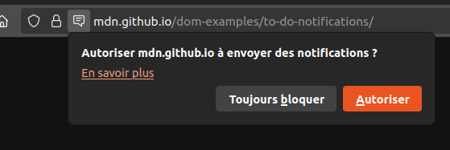

{{DefaultAPISidebar("Web Notifications")}}{{securecontext_header}} {{AvailableInWorkers}}

L'API Notifications permet aux pages web de contrôler l'affichage des notifications système. Celles-ci sont affichées en dehors de la fenêtre du contexte de navigation de plus haut niveau et peuvent donc être affichées, même lorsque la personne a changé d'onglet voire d'application. L'API est conçue pour être compatible avec les systèmes de notification existants sur les différentes plateformes.

## Concepts et utilisation

Sur les plateformes prises en charge, l'affichage d'une notification système implique généralement deux choses.

### Autoriser les notifications

Tout d'abord, il faut que [l'origine](/fr/docs/Glossary/Origin) actuelle soit autorisée à afficher des notifications système. Cela se fait généralement à l'initialisation du site ou de l'application à l'aide de la méthode [`Notification.requestPermission()`](/fr/docs/Web/API/Notification/requestPermission_static). Cette demande d'autorisation doit faire suite à une action explicite de la personne, par exemple le clic sur un bouton&nbsp;:

```js
btn.addEventListener("click", () => {
  let promise = Notification.requestPermission();
  // attendre l'autorisation
});
```

Il ne s'agit pas seulement d'une bonne pratique&nbsp;: il est nécessaire de respecter le consentement des personnes avant de leur envoyer des notifications. Les navigateurs interdiront explicitement les notifications qui ne sont pas déclenchées suite à une action explicite (c'est le cas de Firefox depuis la version 72 par exemple).

Lors de la demande d'autorisation, une boîte de dialogue apparaît dans le navigateur



Ainsi, on peut choisir d'autoriser les notifications d'une origine donnée ou les bloquer. Une fois le choix effectué, le paramètre persistera généralement pour la session en cours.

> [!NOTE]
> Pour Firefox, à partir de Firefox 44, les permissions pour les notifications et [l'API Push](/fr/docs/Web/API/Push_API) ont été fusionnées. Ainsi, si on autorise les notifications, les messages et notifications <i lang="en">push</i> seront également autorisées.

### Création de la notification

Ensuite, on peut créer une nouvelle notification à l'aide du constructeur [`Notification()`](/fr/docs/Web/API/Notification/Notification) auquel on passera un titre en argument et éventuellement un objet d'options afin de personnaliser la notification (la direction du texte, le corps du texte, l'icône à afficher, le son de notification à lire, etc).

En outre, la spécification de l'API Notifications spécifie un certain nombre d'ajouts à l'[API ServiceWorker](/fr/docs/Web/API/Service_Worker_API), qui permettent aux <i lang="en">service worker</i> de déclencher des notifications.

> [!NOTE]
> Pour mieux savoir comment utiliser les notifications au sein de votre propre application, lisez [Utiliser l'API Notifications](/fr/docs/Web/API/Notifications_API/Using_the_Notifications_API).

## Interfaces

- [`Notification`](/fr/docs/Web/API/Notification)
  - : Définit un objet représentant une notification.
- [`NotificationEvent`](/fr/docs/Web/API/NotificationEvent)
  - : Représente un évènement de notification diffusé sur la portée [`ServiceWorkerGlobalScope`](/fr/docs/Web/API/ServiceWorkerGlobalScope) d'un [`ServiceWorker`](/fr/docs/Web/API/ServiceWorker).

### Ajouts aux autres interfaces

- Évènement [`notificationclick`](/fr/docs/Web/API/ServiceWorkerGlobalScope/notificationclick_event)
  - : Se produit lors d'un clic sur une notification affichée.
- Évènement [`notificationclose`](/fr/docs/Web/API/ServiceWorkerGlobalScope/notificationclose_event)
  - : Se produit lorsqu'une personne ferme une notification affichée.
- [`ServiceWorkerRegistration.getNotifications()`](/fr/docs/Web/API/ServiceWorkerRegistration/getNotifications)
  - : Renvoie une liste de notifications dans l'ordre selon lequel elles ont été créées pour l'origine courante et pour la portée courante du <i lang="en">service worker</i>.
- [`ServiceWorkerRegistration.showNotification()`](/fr/docs/Web/API/ServiceWorkerRegistration/showNotification)
  - : Affiche la notification avec le titre indiqué.

## Spécifications

{{Specifications}}

## Compatibilité des navigateurs

{{Compat}}

## Voir aussi

- [Utiliser l'API Notifications](/fr/docs/Web/API/Notifications_API/Using_the_Notifications_API)
