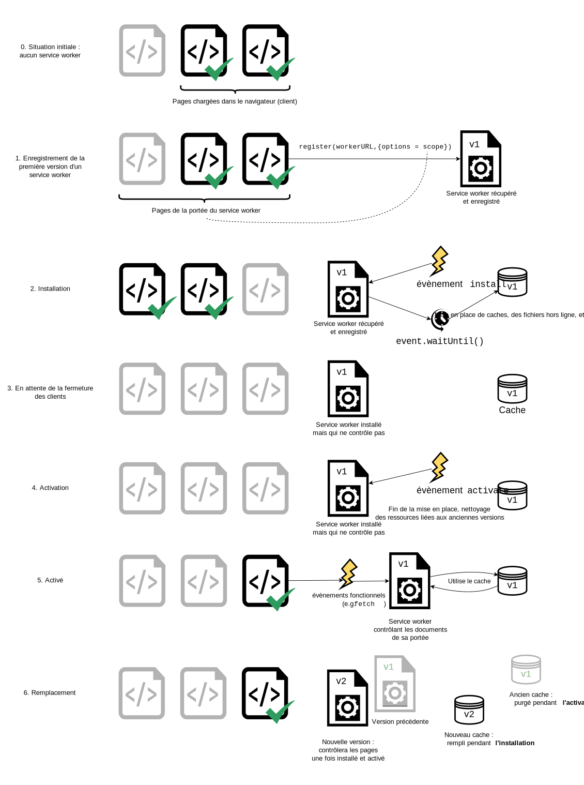
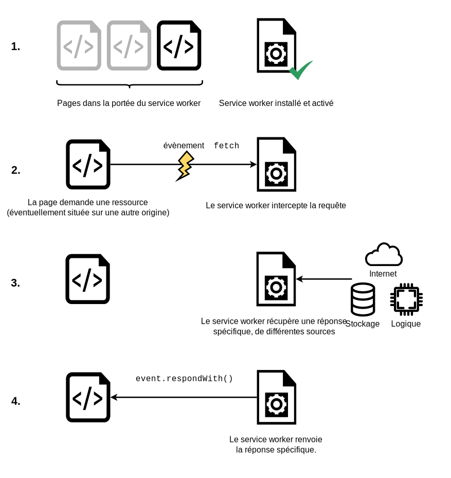

{{DefaultAPISidebar("Service Workers API")}}

Dans cet article, nous aborderons les notions pour vous permettre de démarrer avec les <i lang="en">service workers</i> comme l'architecture associée, l'enregistrement d'un <i lang="en">service worker</i>, les processus d'installation et d'activation pour un nouveau <i lang="en">service worker</i>, la mise à jour d'un <i lang="en">service worker</i>, le contrôle du cache associé et les réponses personnalisées en appliquant ceci à une application d'exemple simple ayant des fonctionnalités hors-ligne.

## Le point de départ des <i lang="en">service workers</i>

Un problème qui se pose depuis plusieurs années sur le Web est la perte de connexion au réseau. Une application web, si performante soit elle, fournira un service déplorable si on ne peut pas la télécharger. Plusieurs tentatives ont eu lieu pour résoudre ce problème et certains aspects ont été réglés. Toutefois, il était encore difficile de bien contrôler la mise en cache de données et de gérer l'interception de requêtes.

Les <i lang="en">service workers</i> aident à résoudre ces problèmes. En utilisant un <i lang="en">service worker</i>, on peut mettre en place une application qui utilise des fichiers en cache et ainsi fournir des fonctionnalités, même hors ligne, avant d'obtenir des données depuis le réseau. Ce qui est possible avec les applications natives devient possible avec les applications web.

Un <i lang="en">service worker</i> fonctionne comme un serveur intermédiaire («&nbsp;proxy&nbsp;»), permettant de modifier les requêtes et les réponses en utilisant les éléments qu'il a en cache.

## Mise en place pour manipuler les <i lang="en">service workers</i>

Les <i lang="en">service workers</i> sont présents par défaut dans les navigateurs. Pour exécuter du code dans des <i lang="en">service workers</i>, il faut qu'il soit servi avec HTTPS (pour des raisons de sécurité). Il est donc nécessaire d'avoir un serveur web prenant en charge HTTPS (ça peut être grâce à un service comme GitHub, Netlify, Vercel, etc.). Afin de simplifier le développement local, `localhost` est également considéré par les navigateurs comme une origine sécurisée.

## Architecture de base

Lors de la mise en place d'un <i lang="en">service worker</i>, on a généralement les étapes suivantes&nbsp;:

1. Le code du <i lang="en">service worker</i> est récupérée et enregistrée grâce à [`serviceWorkerContainer.register()`](/fr/docs/Web/API/ServiceWorkerContainer/register). Si cela fonctionne, le <i lang="en">service worker</i> est exécuté dans une portée [`ServiceWorkerGlobalScope`](/fr/docs/Web/API/ServiceWorkerGlobalScope)&nbsp;: il s'agit d'un type de contexte de <i lang="en">worker</i> particulier, qui s'exécute en dehors du <i lang="en">thread</i> principal, sans accès au DOM. Le <i lang="en">service worker</i> est alors prêt à traiter des évènements.
2. L'installation se déroule alors. Un évènement `install` est toujours le premier évènement envoyé à un <i lang="en">service worker</i> (et peut être utilisé pour remplir une base de données IndexedDB, et mettre en cache des fichiers). Pendant cette étape, l'application prépare ce qui doit l'être pour fonctionner hors ligne.
3. Lorsque le gestionnaire d'évènements `oninstall` a terminé, on considère que le <i lang="en">service worker</i> est installé. À cet instant, une version précédente du <i lang="en">service worker</i> peut toujours être active et contrôler les pages ouvertes. Comme on ne veut pas que deux versions différentes du même <i lang="en">service worker</i> s'exécutent au même moment, la nouvelle version n'est pas encore active.
4. Une fois que toutes les pages contrôlées par l'ancienne version du <i lang="en">service worker</i> sont fermées, on peut alors enlever l'ancienne version. Le nouveau <i lang="en">service worker</i> installé reçoit un évènement `activate`. On utilise principalement `activate` pour nettoyer les ressources utilisées par les versions précédentes d'un <i lang="en">service worker</i>. Le nouveau <i lang="en">service worker</i> peut appeler [`skipWaiting()`](/fr/docs/Web/API/ServiceWorkerGlobalScope/skipWaiting) pour demander l'activation immédiate, sans attendre la fermeture des pages ouvertes. Le nouveau <i lang="en">service worker</i> recevra alors l'évènement `activate` immédiatement, et prendra le contrôle des pages ouvertes concernées.
5. Le <i lang="en">service worker</i> contrôlera alors les pages qui ont été ouvertes après que la fonction `register()` a fini son exécution. Autrement dit, les documents devront être rechargés afin d'être contrôlé, car l'état de contrôle d'un document avec ou sans <i lang="en">service worker</i> est déterminé à son chargement et reste ainsi pendant sa durée de vie. Pour surcharger ce comportement par défaut et contrôler les pages ouvertes, un <i lang="en">service worker</i> peut appeler [`clients.claim()`](/fr/docs/Web/API/Clients/claim).
6. À chaque fois qu'une nouvelle version d'un <i lang="en">service worker</i> est récupérée, ce cycle se répète et les données de la version précédente sont nettoyées pendant l'activation de la nouvelle version.



Voici les évènements disponibles pour un <i lang="en">service worker</i>&nbsp;:

- [`install`](/fr/docs/Web/API/ServiceWorkerGlobalScope/install_event)
- [`activate`](/fr/docs/Web/API/ServiceWorkerGlobalScope/activate_event)
- [`message`](/fr/docs/Web/API/ServiceWorkerGlobalScope/message_event)
- Évènements fonctionnels
  - [`fetch`](/fr/docs/Web/API/ServiceWorkerGlobalScope/fetch_event)
  - [`sync`](/fr/docs/Web/API/ServiceWorkerGlobalScope/sync_event)
  - [`push`](/fr/docs/Web/API/ServiceWorkerGlobalScope/push_event)

## Démonstration

Pour illustrer les bases de l'enregistrement et de l'installation d'un <i lang="en">service worker</i>, nous avons créé une application d'exemple intitulée [simple-service-worker](https://github.com/mdn/dom-examples/tree/main/service-worker/simple-service-worker), qui est une galerie d'images de Lego Star Wars. Elle utilise une fonction à base de promesses pour lire les données des images depuis un objet JSON et charger les images avec [`fetch()`](/fr/docs/Web/API/Fetch_API/Using_Fetch) avant de les afficher sur une ligne dans la page. L'exemple n'utilise que des ressources statiques. Nous verrons aussi l'enregistrement, l'installation et l'activation d'un <i lang="en">service worker</i>.


Vous pouvez voir [le code source sur GitHub](https://github.com/mdn/dom-examples/tree/main/service-worker/simple-service-worker), et [la démo](https://bncb2v.csb.app/).

### Enregistrement

Le premier bloc de code du fichier JavaScript `app.js` sert de point d'entrée pour l'utilisation des <i lang="en">service workers</i>.

```js
const registerServiceWorker = async () => {
  if ("serviceWorker" in navigator) {
    try {
      const registration = await navigator.serviceWorker.register("/sw.js", {
        scope: "/",
      });
      if (registration.installing) {
        console.log("Installation du service worker en cours");
      } else if (registration.waiting) {
        console.log("Service worker installé");
      } else if (registration.active) {
        console.log("Service worker actif");
      }
    } catch (error) {
      console.error(`L'enregistrement a échoué : ${error}`);
    }
  }
};

// …

registerServiceWorker();
```

1. Le bloc `if` teste la présence de la fonctionnalité pour s'assurer que les <i lang="en">service workers</i> sont bien pris en charge avant de tenter l'enregistrement.
2. Ensuite, on utilise la fonction [`ServiceWorkerContainer.register()`](/fr/docs/Web/API/ServiceWorkerContainer/register) pour enregistrer le <i lang="en">service worker</i> pour ce site. Il s'agit ici d'un fichier JavaScript. Attention, l'URL du fichier ciblé est relative à l'origine de la page et pas à l'URL du fichier JavaScript qui la référence.
3. Le paramètre `scope` est optionnel et peut être utilisé afin d'indiquer le sous-ensemble du contenu qu'on veut contrôler avec le <i lang="en">service worker</i>. Ici, nous avons indiqué `'/'`, ce qui représente tout le contenu situé sous l'origine de l'application. Si ce paramètre est absent, la valeur par défaut qui sera utilisée sera également `'/'` (nous l'avons inclus ici à des fins d'explication).

Cela permet d'enregistrer un <i lang="en">service worker</i> qui s'exécute dans un contexte de <i lang="en">worker</i> et n'a donc pas accès au DOM.

Un seul <i lang="en">service worker</i> peut contrôler de nombreuses pages. Chaque fois qu'une page concernée par la portée du <i lang="en">service worker</i> est chargée, le <i lang="en">service worker</i> est installé pour cette page et s'en occupe. Il faut donc faire attention aux variables globales dans le script d'un <i lang="en">service worker</i>, car chaque page ne récupère un exemplaire séparé distinct.

> **Note :** En utilisant la détection de fonctionnalité comme nous l'avons fait plus haut, cela permet aux navigateurs qui ne prennent pas en charge ces fonctionnalités de servir l'application en ligne normalement.

#### Pourquoi est-ce l'enregistrement de mon <i lang="en">service worker</i> échoue&nbsp;?

Il peut y avoir plusieurs raisons&nbsp;:

- L'application n'est pas servie via HTTPS.
- Le chemin vers le fichier du <i lang="en">service worker</i> n'est pas écrit correctement&nbsp;: il doit être relatif à l'origine et pas à la racine du répertoire de l'application. Pour notre exemple, le script du <i lang="en">worker</i> est situé à `https://bncb2v.csb.app/sw.js`, et la racine de l'application est `https://bncb2v.csb.app/`, mais il faut écrire le chemin ainsi&nbsp;: `/sw.js`.
- Il est interdit de pointer vers un <i lang="en">service worker</i> dont l'origine est différente de celle de l'application.
- La page concernée ne fait pas partie de la portée du <i lang="en">service worker</i>.
- La portée maximale d'un <i lang="en">service worker</i> correspond par défaut à l'emplacement du <i lang="en">worker</i>. Il est possible d'indiquer une liste de portées maximales plus larges avec l'en-tête HTTP [`Service-Worker-Allowed`](/fr/docs/Web/HTTP/Header/Service-Worker-Allowed).
- Pour Firefox, les API <i lang="en">Service Worker</i> sont inaccessibles [en navigation privée](https://bugzilla.mozilla.org/show_bug.cgi?id=1320796), lorsque l'historique est désactivé ou que les données de navigation (dont les cookies) sont supprimés à la fermeture de Firefox.
- Pour Chrome, l'enregistrement échoue si l'option «&nbsp;Bloquer tous les cookies (non recommandé)&nbsp;» est activée.

### Installation et activation&nbsp;: remplir le cache

Une fois le <i lang="en">service worker</i> enregistré, le navigateur essaiera d'installer le <i lang="en">service worker</i> sur la page/le site.

L'évènement `install` est déclenché lorsque l'installation s'est déroulée correctement. Il est généralement utilisé pour remplir les caches qui seront utilisés hors ligne. Pour cela, on utilise l'API de stockage des <i lang="en">service worker</i>, [`cache`](/fr/docs/Web/API/Cache)&nbsp;: un objet global du <i lang="en">service worker</i> qui permet de stocker les fichiers fournis par les réponses et de les référencées par des clés formées par les requêtes. Cette API fonctionne de façon semblable au cache standard du navigateur, mais est spécifique au domaine. Le cache persiste jusqu'à nouvel ordre.

Voici comme nous gérons l'évènement `install` dans notre exemple&nbsp;:

```js
const addResourcesToCache = async (resources) => {
  const cache = await caches.open("v1");
  await cache.addAll(resources);
};

self.addEventListener("install", (event) => {
  event.waitUntil(
    addResourcesToCache([
      "/",
      "/index.html",
      "/style.css",
      "/app.js",
      "/image-list.js",
      "/star-wars-logo.jpg",
      "/gallery/bountyHunters.jpg",
      "/gallery/myLittleVader.jpg",
      "/gallery/snowTroopers.jpg",
    ]),
  );
});
```

1. On ajoute un gestionnaire d'évènement pour `install` sur le <i lang="en">service worker</i> (représenté par `self`) et on chaîne un appel à la méthode [`ExtendableEvent.waitUntil()`](/fr/docs/Web/API/ExtendableEvent/waitUntil) lors de la réception de l'évènement, pour s'assurer que l'installation du <i lang="en">service worker</i> ne commencera pas avant que le code contenu dans `waitUntil()` ait été exécuté.
2. Dans la fonction `addResourcesToCache()`, on utilise la méthode [`caches.open()`](/fr/docs/Web/API/CacheStorage/open) afin de créer un nouveau cache intitulé `v1`, qui sera la première version de notre cache pour les ressources de notre site. On appelle ensuite une fonction `addAll()` sur le cache ainsi créé et qui prend en paramètre un tableau d'URL pour les différentes ressources qu'on souhaite mettre en cache. Les URL sont relatives à [l'emplacement](/fr/docs/Web/API/WorkerGlobalScope/location) du <i lang="en">worker</i>.
3. Si la promesse échoue, l'installation échoue et le <i lang="en">service worker</i> ne fera rien. Il est toujours possible de corriger le code et de réessayer lors du prochain enregistrement.
4. Après une installation réussie, on passe à l'activation du <i lang="en">service worker</i>. Lors d'une première installation, cela peut ne pas avoir beaucoup d'intérêt, mais cela s'avèrera utile lors des mises à jour du <i lang="en">service worker</i> (voir la section [Mettre à jour le <i lang="en">service worker</i>](#mettre_à_jour_le_service_worker) ci-après).

> **Note :** [L'API <i lang="en">Web Storage</i> (`localStorage`)](/fr/docs/Web/API/Web_Storage_API) fonctionne de façon semblable au cache d'un <i lang="en">service worker</i> mais est synchrone et son utilisation n'est donc pas autorisée dans les <i lang="en">services workers</i>.

> **Note :** Si besoin, [l'API IndexedDB](/fr/docs/Web/API/IndexedDB_API) peut être utilisée dans un <i lang="en">service worker</i> pour stocker des données.

### Créer des réponses sur mesure pour les requêtes

Maintenant que les fichiers sont mis en cache, il faut indiquer au <i lang="en">service worker</i> quoi faire de ce contenu. Pour cela, on utilise l'évènement `fetch`.

1. Un évènement `fetch` est déclenché à chaque fois qu'une ressource doit être récupérée depuis une page contrôlée par un <i lang="en">service worker</i>. Cela inclut les documents situés dans la portée du <i lang="en">worker</i> et les ressources référencées depuis ces documents (ainsi, si `index.html` effectue une requête vers une origine différente pour charger une image, la requête passera quand même par le <i lang="en">service worker</i>).

2. On peut attacher un gestionnaire d'évènement pour `fetch` au <i lang="en">service worker</i>, puis appeler la méthode `respondWith()` sur l'évènement afin d'intercepter les réponses HTTP et les remplacer par le contenu voulu.

   ```js
   self.addEventListener("fetch", (event) => {
     event
       .respondWith
       // contenu spécifique
       ();
   });
   ```

3. On peut ainsi répondre avec les ressources dont l'URL correspond à la requête interceptée&nbsp;:

   ```js
   self.addEventListener("fetch", (event) => {
     event.respondWith(caches.match(event.request));
   });
   ```

   `caches.match(event.request)` permet de cibler les ressources demandées sur le réseau avec les ressources équivalentes et qui sont disponibles dans le cache (si une telle ressource est disponible). La correspondance est effectuée avec l'URL et différents en-têtes, comme pour une requête HTTP normale.



## Gérer les requêtes qui échouent

`caches.match(event.request)` fonctionne à merveille s'il y a une ressource correspondante dans le cache du <i lang="en">service worker</i>, mais que se passe-t-il si ce n'est pas le cas&nbsp;? Si on ne fournit pas de gestion d'erreur, la promesse est résolue avec `undefined` et rien ne sera renvoyé.

Dans ce cas, on peut tester la réponse du cache et, si besoin, utiliser une requête réseau classique&nbsp;:

```js
const cacheFirst = async (request) => {
  const responseFromCache = await caches.match(request);
  if (responseFromCache) {
    return responseFromCache;
  }
  return fetch(request);
};

self.addEventListener("fetch", (event) => {
  event.respondWith(cacheFirst(event.request));
});
```

Ainsi, si les ressources ne sont pas dans le cache, on les récupère depuis le réseau.

Une stratégie plus raffinée serait de mettre en cache les ressources que nous récupérons depuis le réseau afin qu'elles puissent être réutilisées hors ligne par la suite. Dans notre exemple, cela signifie que si nous ajoutons de nouvelles images à la galerie, notre application pourrait automatiquement les récupérer la première fois et les mettre en cache. Voici un fragment de code qui implémente cette méthode&nbsp;:

```js
const putInCache = async (request, response) => {
  const cache = await caches.open("v1");
  await cache.put(request, response);
};

const cacheFirst = async (request) => {
  const responseFromCache = await caches.match(request);
  if (responseFromCache) {
    return responseFromCache;
  }
  const responseFromNetwork = await fetch(request);
  putInCache(request, responseFromNetwork.clone());
  return responseFromNetwork;
};

self.addEventListener("fetch", (event) => {
  event.respondWith(cacheFirst(event.request));
});
```

Si la ressource de la requête n'est pas disponible dans le cache, on la demande depuis le réseau avec `await fetch(request)`. Ensuite, on clone la réponse dans le cache. La fonction `putInCache()` utilise `caches.open('v1')` et `cache.put()` afin d'ajouter les ressources au cache. La réponse originale est transmise au navigateur pour la page qui a demandé la ressource.

Cloner la réponse est nécessaire, car les flux de requête et de réponse ne peuvent être lus qu'une seule fois. Afin de fournir la réponse au navigateur et la mettre en cache, il faut la cloner. La version originale est fournie au navigateur et le clone est mis en cache. Chaque réponse est lue une seule fois.

Il peut sembler étrange qu'on n'attende pas le retour de la promesse dans `putInCache()`. En réalité, on ne veut pas attendre que le clone de la réponse ait été ajouté au cache avant de renvoyer la réponse.

Le problème restant est que si la requête ne correspond à rien en cache et que le réseau n'est pas disponible, la requête échouera. Voyons comment fournir un contenu par défaut dans ce cas-là&nbsp;:

```js
const putInCache = async (request, response) => {
  const cache = await caches.open("v1");
  await cache.put(request, response);
};

const cacheFirst = async ({ request, preloadResponsePromise, fallbackUrl }) => {
  // Pour commencer on essaie d'obtenir la ressource depuis le cache
  const responseFromCache = await caches.match(request);
  if (responseFromCache) {
    return responseFromCache;
  }

  // Ensuite, on tente de l'obtenir du réseau
  try {
    const responseFromNetwork = await fetch(request);
    // Une réponse ne peut être utilisée qu'une fois
    // On la clone pour en mettre une copie en cache
    // et servir l'originale au navigateur
    putInCache(request, responseFromNetwork.clone());
    return responseFromNetwork;
  } catch (error) {
    const fallbackResponse = await caches.match(fallbackUrl);
    if (fallbackResponse) {
      return fallbackResponse;
    }
    // Quand il n'y a même pas de contenu par défaut associé
    // on doit tout de même renvoyer un objet Response
    return new Response("Une erreur réseau s'est produite", {
      status: 408,
      headers: { "Content-Type": "text/plain" },
    });
  }
};

self.addEventListener("fetch", (event) => {
  event.respondWith(
    cacheFirst({
      request: event.request,
      fallbackUrl: "/gallery/myLittleVader.jpg",
    }),
  );
});
```

Ici, on utilise l'image comme contenu par défaut, car les seules mises à jour qui risquent d'échouer portent sur les nouvelles images. Tout le reste dépend de la phase d'installation que nous avons vue plus haut.

## Préchargement du <i lang="en">worker</i> lors de la navigation

S'il est activé, [le préchargement à la navigation](/fr/docs/Web/API/NavigationPreloadManager) commence le téléchargement des ressources dès que la requête de récupération est émise, en parallèle de l'activation du <i lang="en">service worker</i>. Cela permet que le téléchargement démarre immédiatement lors de la navigation vers une page plutôt que d'avoir à d'abord attendre l'activation du <i lang="en">service worker</i>. Ce délai se produit rarement mais reste inévitable et, lorsqu'il survient, peut être significatif.

Pour commencer, la fonctionnalité doit être activée lors de l'activation du <i lang="en">service worker</i> en utilisant [`registration.navigationPreload.enable()`](/fr/docs/Web/API/NavigationPreloadManager/enable)&nbsp;:

```js
self.addEventListener("activate", (event) => {
  event.waitUntil(self.registration?.navigationPreload.enable());
});
```

Ensuie, on utilisera [`event.preloadResponse`](/fr/docs/Web/API/FetchEvent/preloadResponse) pour attendre que le téléchargement de la ressource préchargée soit terminée dans le gestionnaire d'évènement `fetch`.

Reprenons le code des sections précédentes et insérons la gestion du préchargement après la vérification du cache et avant la récupération depuis le réseau.

Voici l'algorithme mis à jour&nbsp;:

1. On vérifie le cache.
2. On attend `event.preloadResponse`, qui est passé sous la forme `preloadResponsePromise` à la fonction `cacheFirst`. On met en cache le résultat s'il y en a un.
3. S'il n'y a toujours aucune ressource récupérée, on tente de la récupérer depuis le réseau.

```js
const addResourcesToCache = async (resources) => {
  const cache = await caches.open("v1");
  await cache.addAll(resources);
};

const putInCache = async (request, response) => {
  const cache = await caches.open("v1");
  await cache.put(request, response);
};

const cacheFirst = async ({ request, preloadResponsePromise, fallbackUrl }) => {
  // Pour commencer on essaie d'obtenir la ressource depuis le cache
  const responseFromCache = await caches.match(request);
  if (responseFromCache) {
    return responseFromCache;
  }

  // Ensuite, on tente d'utiliser et de mettre en cache
  // la réponse préchargée si elle existe
  const preloadResponse = await preloadResponsePromise;
  if (preloadResponse) {
    console.info("using preload response", preloadResponse);
    putInCache(request, preloadResponse.clone());
    return preloadResponse;
  }

  // Ensuite, on tente de l'obtenir du réseau
  try {
    const responseFromNetwork = await fetch(request);
    // Une réponse ne peut être utilisée qu'une fois
    // On la clone pour en mettre une copie en cache
    // et servir l'originale au navigateur
    putInCache(request, responseFromNetwork.clone());
    return responseFromNetwork;
  } catch (error) {
    const fallbackResponse = await caches.match(fallbackUrl);
    if (fallbackResponse) {
      return fallbackResponse;
    }
    // Quand il n'y a même pas de contenu par défaut associé
    // on doit tout de même renvoyer un objet Response
    return new Response("Network error happened", {
      status: 408,
      headers: { "Content-Type": "text/plain" },
    });
  }
};

// On active le préchargement à la navigation
const enableNavigationPreload = async () => {
  if (self.registration.navigationPreload) {
    await self.registration.navigationPreload.enable();
  }
};

self.addEventListener("activate", (event) => {
  event.waitUntil(enableNavigationPreload());
});

self.addEventListener("install", (event) => {
  event.waitUntil(
    addResourcesToCache([
      "/",
      "/index.html",
      "/style.css",
      "/app.js",
      "/image-list.js",
      "/star-wars-logo.jpg",
      "/gallery/bountyHunters.jpg",
      "/gallery/myLittleVader.jpg",
      "/gallery/snowTroopers.jpg",
    ]),
  );
});

self.addEventListener("fetch", (event) => {
  event.respondWith(
    cacheFirst({
      request: event.request,
      preloadResponsePromise: event.preloadResponse,
      fallbackUrl: "/gallery/myLittleVader.jpg",
    }),
  );
});
```

On notera dans cet exemple qu'on télécharge et met en cache les mêmes données pour la ressource qu'elle soit téléchargée normalement ou préchargée. On pourrait aussi choisir de télécharger et de mettre en cache une ressource différente lors du préchargement. Pour plus d'informations, voir [`NavigationPreloadManager` > réponses personnalisées](/fr/docs/Web/API/NavigationPreloadManager#réponses_personnalisées).

## Mettre à jour le <i lang="en">service worker</i>

Si le <i lang="en">service worker</i> a précédemment été installé et qu'une nouvelle version est disponible lors du rafraîchissement ou du chargement de la page, la nouvelle version est installée en arrière-plan, mais n'est pas activée. Elle est uniquement activée lorsqu'il n'y a plus de pages chargées qui utilisent l'ancien <i lang="en">service worker</i>. Dès qu'il n'y a plus de page chargée, le nouveau <i lang="en">service worker</i> s'active.

> **Note :** Il est possible de contourner ce comportement en utilisant [`Clients.claim()`](/fr/docs/Web/API/Clients/claim).

Il faut alors mettre à jour le gestionnaire d'évènement pour `install` dans le nouveau <i lang="en">service worker</i> (notez le nouveau numéro de version)&nbsp;:

```js
const addResourcesToCache = async (resources) => {
  const cache = await caches.open("v2");
  await cache.addAll(resources);
};

self.addEventListener("install", (event) => {
  event.waitUntil(
    addResourcesToCache([
      "/",
      "/index.html",
      "/style.css",
      "/app.js",
      "/image-list.js",

      // …

      // inclure les nouvelles ressources associées
      // à la nouvelle version…
    ]),
  );
});
```

Lorsque cette installation se produit, la version précédente est toujours utilisée pour les interceptions/récupérations de ressources. La nouvelle version est installée en arrière-plan. En appelant notre nouveau cache `v2`, le cache précédent (`v1`) n'est pas perturbé.

Lorsqu'aucune page n'utilise la version précédente, c'est le nouveau <i lang="en">service worker</i> qui est activé et qui devient alors responsable des interceptions/récupérations.

### Supprimer les anciens caches

Comme nous l'avons vu dans la section précédente, lorsqu'on met à jour un <i lang="en">service worker</i> avec une nouvelle version, on pourra créer un nouveau cache avec le gestionnaire d'évènement `install`. Tant qu'il y a des pages ouvertes qui sont contrôlées par l'ancienne version, il faut conserver les deux caches, car la version précédente utilise cette version précédente du cache. L'évènement `activate` peut ensuite être utilisé pour retirer des données des caches précédents.

Les promesses passées à `waitUntil()` bloqueront les autres évènements tant qu'elles ne seront pas terminées. Cela permet de s'assurer que les étapes de nettoyage auront été réalisées lorsque le premier évènement `fetch` parviendra au nouveau <i lang="en">service worker</i>.

```js
const deleteCache = async (key) => {
  await caches.delete(key);
};

const deleteOldCaches = async () => {
  const cacheKeepList = ["v2"];
  const keyList = await caches.keys();
  const cachesToDelete = keyList.filter((key) => !cacheKeepList.includes(key));
  await Promise.all(cachesToDelete.map(deleteCache));
};

self.addEventListener("activate", (event) => {
  event.waitUntil(deleteOldCaches());
});
```

## Outils de développement

- [Chrome](https://www.chromium.org/blink/serviceworker/service-worker-faq/)
- [Firefox](https://firefox-source-docs.mozilla.org/devtools-user/application/service_workers/index.html)
  - Il est possible de réinitialiser les <i lang="en">service workers</i> et leurs caches pour un site en utilisant le menu «&nbsp;Oublier ce site&nbsp;» dans l'historique, le bouton Gérer les données&nbsp;» dans les préférences ou le bouton «&nbsp;Effacer des données&nbsp;» qu'il est possible d'ajouter à [la barre d'outils en la personnalisant](https://support.mozilla.org/fr/kb/personnaliser-boutons-barres-outils-firefox).
- [Edge](https://learn.microsoft.com/en-us/microsoft-edge/devtools-guide-chromium/service-workers/)

## Voir aussi

- [Les promesses en JavaScript](/fr/docs/Web/JavaScript/Reference/Global_Objects/Promise)
- [Utiliser les <i lang="en">web workers</i>](/fr/docs/Web/API/Web_Workers_API/Using_web_workers)
