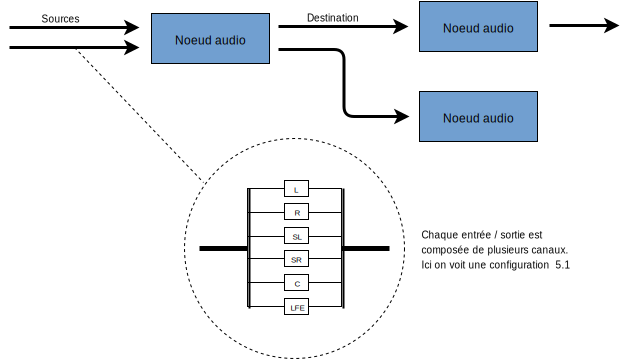
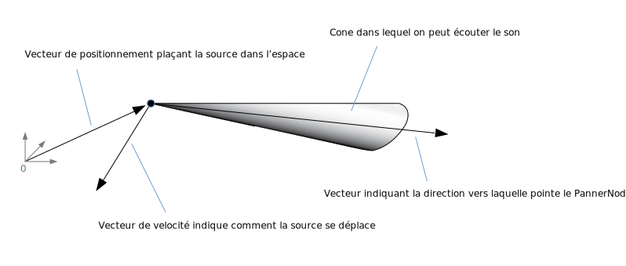
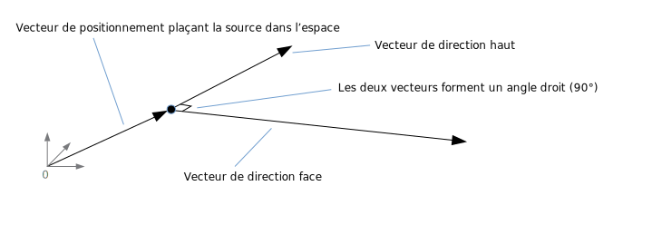

Cet article explique une partie de la théorie sur laquelle s'appuient les fonctionnalités de la Web Audio API. Il ne fera pas de vous un ingénieur du son, mais vous donnera les bases nécessaires pour comprendre pourquoi la Web Audio API fonctionne de cette manière, et vous permettre de mieux l'utiliser.

## Graphes audio

La Web Audio API implique d'effectuer le traitement du son dans un **contexte** **audio**; elle a été conçue sur le principe de **routage modulaire**. Les opérations basiques sont effectuées dans **noeuds audio**, qui sont liés entre eux pour former un **graphe de routage audio**. Un seul contexte peut supporter plusieurs sources — avec différentes configurations de canaux. Cette architecture modulaire assure la flexibilité nécessaire pour créer des fonctions audio complexes avec des effets dynamiques.

Les noeuds audio sont liés au niveau de leur entrée et leur sortie, formant une chaîne qui commence avec une ou plusieurs sources, traverse un ou plusieurs noeuds, et se termine avec une sortie spécifique (bien qu'il ne soit pas nécessaire de spécifier une sortie si, par exemple, vous souhaitez seulement visualiser des données audio). Un scénario simple, représentatif de la Web Audio API, pourrait ressembler à ceci&nbsp;:

1. Création d'un contexte audio
2. Dans ce contexte, création des sources — telles que `<audio>`, oscillateur, flux
3. Création des noeuds d'effets, tels que réverb, filtres biquad, balance, compresseur
4. Choix final de la sortie audio, par exemple les enceintes du système
5. Connection des sources aux effets, et des effets à la sortie.


Chaque entrée ou sortie est composée de plusieurs **canaux,** chacun correspondant à une configuration audio spécifique. Tout type de canal discret est supporté, y compris _mono_, _stereo_, _quad_, _5.1_, etc.



Les sources audio peuvent être de provenance variée&nbsp;:

- générées directement en JavaScript avec un noeud audio (tel qu'un oscillateur)
- créées à partir de données PCM brutes (le contexte audio a des méthodes pour décoder les formats audio supportés)
- fournies par une balise HTML media (telle que {{HTMLElement("video")}} ou {{HTMLElement("audio")}})
- récupérées directement avec [WebRTC](/fr/docs/WebRTC) {{domxref("MediaStream")}} (une webcam ou un microphone)

## Données audio: ce qu'on trouve dans un échantillon

Lors du traitement d'un signal audio, **l'échantillonage** désigne la conversion d'un [signal continu](http://en.wikipedia.org/wiki/Continuous_signal) en [signal discret](http://en.wikipedia.org/wiki/Discrete_signal); formulé autrement, une onde de son continue, comme un groupe qui joue en live, est convertie en une séquence d'échantillons (un signal temporel discret) qui permet à l'ordinateur de traiter le son en blocs distincts.

On peut trouver davantage de détails sur la page Wikipédia [Echantillonage (signal)](<https://fr.wikipedia.org/wiki/Échantillonnage_(signal)>).

## Mémoire tampon&nbsp;: trames, échantillons et canaux

Un {{ domxref("AudioBuffer") }} prend comme paramètres un nombre de canaux (1 pour mono, 2 pour stéréo, etc), une longueur, qui correspond au nombre de trames d'échantillon dans la mémoire tampon, et un taux d'échantillonage, qui indique le nombre de trames d'échantillons lues par seconde.

Un échantillon est une valeur float32 unique, qui correspond à la valeur du flux audio à un point précis dans le temps, sur un canal spécifique (gauche ou droit dans le cas de la stéréo). Une trame, ou trame d'échantillon est l'ensemble de toutes les valeurs pour tous les canaux (deux pour la stéréo, six pour le 5.1, etc.) à un point précis dans le temps.

Le taux d'échantillonage est le nombre d'échantillons (ou de trames, puisque tous les échantillons d'une trame jouent en même temps) qui sont joués en une seconde, exprimés en Hz. Plus le taux d'échantillonage est élevé, meilleure est la qualité du son.

Prenons deux {{ domxref("AudioBuffer") }}, l'un en mono et l'autre en stéréo, chacun d'une durée de 1 seconde et d'une fréquence de 44100Hz:

- le mono aura 44100 échantillons, et 44100 trames. Sa propriété `length` vaudra 44100.
- le stéréo aura 88200 échantillons, et 44100 trames. Sa propriété `length` vaudra aussi 44100, puisqu'elle correspond au nombre de trames.


Lorsqu'un noeud de mémoire tampon est lu, on entend d'abord la trame la trame la plus à gauche, puis celle qui la suit à droite, etc. Dans le cas de la stéréo, on entend les deux canaux en même temps. Les trames d'échantillon sont très utiles, car elles représentent le temps indépendamment du nombre de canaux.

> **Note :** Pour obtenir le temps en secondes à partir du nombre de trames, diviser le nombre de trames par le taux d'échantillonage. Pour obtenir le nombre de trames à partir du nombre d'échantillons, diviser le nombre d'échantillons par le nombre de canaux.

Voici quelques exemples simples:

```js
var contexte = new AudioContext();
var memoireTampon = contexte.createBuffer(2, 22050, 44100);
```

> **Note :** **44,100 [Hz](https://en.wikipedia.org/wiki/Hertz)** (que l'on peut aussi écrire **44.1 kHz**) est un [taux d'échantillonage](https://en.wikipedia.org/wiki/Sampling_frequency) couramment utilisé. Pourquoi 44.1kHz ?
>
> D'abord, parce ce que le [champ auditif](https://en.wikipedia.org/wiki/Hearing_range) qui peut être perçu par des oreilles humaines se situe à peu près entre 20 Hz et 20,000 Hz, et que selon le [théorème d'échantillonage de Nyquist–Shannon](https://en.wikipedia.org/wiki/Nyquist%E2%80%93Shannon_sampling_theorem) la fréquence d'échantillonage doit être supérieure à deux fois la fréquence maximum que l'on souhaite reproduire; le taux d'échantillonage doit donc être supérieur à 40 kHz.
>
> De plus, le signal doit être traité par un [filtre passe-bas](https://en.wikipedia.org/wiki/Low-pass_filter) avant d'être échantilloné, afin d'éviter le phénomène d'[aliasing](https://en.wikipedia.org/wiki/Aliasing), et, si en théorie un filtre passe-bas idéal devrait être capable de laisser passer les fréquences inférieures à 20 kHz (sans les atténuer) et de couper parfaitement les fréquences supérieures à 20 kHz, en pratique une [bande de transition](https://en.wikipedia.org/wiki/Transition_band) dans laquelle les fréquences sont partiellement atténuées est nécessaire. Plus la bande de transition est large, plus il est facile et économique de faire un [filtre anti-aliasing](https://en.wikipedia.org/wiki/Anti-aliasing_filter). Le taux d'échantillonage 44.1 kHz laisse une bande de transition de 2.05 kHz.

Ce code génère une mémoire tampon stéréo (deux canaux) qui, lorsqu'elle est lue dans un AudioContext à 44100Hz (configuration répandue, la plupart des cartes sons tournant à cette fréquence), dure 0.5 secondes: 22050 trames / 44100Hz = 0.5 secondes.

```js
var contexte = new AudioContext();
var memoireTampon = context.createBuffer(1, 22050, 22050);
```

Ce code génère une mémoire tampon mono (un seul canal) qui, lorsqu'elle est lue dans un AudioContext à 44100Hzz, est automatiquement \*rééchantillonnée\* à 44100Hz (et par conséquent produit 44100 trames), et dure 1.0 seconde: 44100 frames / 44100Hz = 1 seconde.

> **Note :** le rééchantillonnage audio est très similaire à la redimension d'une image&nbsp;: imaginons que vous ayiez une image de 16 x 16, mais que vous vouliez remplir une surface de 32x32: vous la redimensionnez (rééchantillonnez). Le résultat est de qualité inférieure (il peut être flou ou crénelé, en fonction de l'algorithme de redimensionnement), mais cela fonctionne, et l'image redimensionnée prend moins de place que l'originale. C'est la même chose pour le rééchantillonnage audio — vous gagnez de la place, mais en pratique il sera difficle de reproduire correctement des contenus de haute fréquence (c'est-à-dire des sons aigus).

### Mémoire tampon linéaire ou entrelacée

La Web Audio API utilise un format de mémoire tampon linéaire : les canaux gauche et droite sont stockés de la façon suivante :

```
LLLLLLLLLLLLLLLLRRRRRRRRRRRRRRRR (pour un buffer de 16 trames)
```

C'est assez courant dans le traitement audio, car cela permet de traiter facilement chaque canal de façon indépendante.

L'alternative est d'utiliser un format entrelacé:

```
LRLRLRLRLRLRLRLRLRLRLRLRLRLRLRLR (pour un buffer de 16 trames)
```

Ce format est communément utilisé pour stocker et lire du son avec très peu de traitement, comme par exemple pour un flux de MP3 décodé.

La Web Audio API expose \*uniquement\* des buffer linéaires, car elle est faite pour le traitement du son. Elle fonctionne en linéaire, mais convertit les données au format entrelacé au moment de les envoyer à la carte son pour qu'elles soient jouées. A l'inverse, lorsqu'un MP3 est décodé, le format d'origine entrelacé est converti en linéaire pour le traitement.

## Canaux audio

Une mémoire tampon audio peut contenir différents nombres de canaux, depuis les configurations simple mono (un seul canal) ou stéréo (canal gauche et canal droit) en allant jusquà des configurations plus complexe comme le quad ou le 5.1, pour lesquels chaque canal contient plusieurs échantillons de sons, ce qui permet une expérience sonore plus riche. Les canaux sont généralement représentés par les abbréviations standard détaillées dans le tableau ci-après :

<table class="standard-table">
  <tbody>
    <tr>
      <td><em>Mono</em></td>
      <td><code>0: M: mono</code></td>
    </tr>
    <tr>
      <td><em>Stereo</em></td>
      <td>
        <code>0: L: gauche<br />1: R: droit</code>
      </td>
    </tr>
    <tr>
      <td><em>Quad</em></td>
      <td>
        <code
          >0: L: gauche<br />1: R: droit<br />2: SL: surround gauche<br />3: SR:
          surround droit</code
        >
      </td>
    </tr>
    <tr>
      <td><em>5.1</em></td>
      <td>
        <code
          >0: L: gauche<br />1: R: droit<br />2: C: centre<br />3: LFE:
          subwoofer<br />4: SL: surround gauche<br />5: SR: surround droit</code
        >
      </td>
    </tr>
  </tbody>
</table>

### Conversion ascendante et descendante

Lorsque le nombre de canaux n'est pas le même en entrée et en sortie, on effectue une conversion ascendante ou descendante selon les règles suivantes. Cela peut être plus ou moins controllé en assignant la valeur `speakers` ou `discrete` à la propriété {{domxref("AudioNode.channelInterpretation")}} .

<table class="standard-table">
  <thead>
    <tr>
      <th scope="row">Interprétation</th>
      <th scope="col">Canaux d'entrée</th>
      <th scope="col">Canaux de sortie</th>
      <th scope="col">Règles de conversion</th>
    </tr>
  </thead>
  <tbody>
    <tr>
      <th colspan="1" rowspan="13" scope="row"><code>speakers</code></th>
      <td><code>1</code> <em>(Mono)</em></td>
      <td><code>2</code> <em>(Stéréo)</em></td>
      <td>
        <em>Conversion ascendante de mono vers stéréo</em>.<br />Le canal
        d'entrée <code>M</code> est utilisé pour les deux canaux de sortie
        (<code>L</code> et <code>R</code>).<br /><code
          >output.L = input.M<br />output.R = input.M</code
        >
      </td>
    </tr>
    <tr>
      <td><code>1</code> <em>(Mono)</em></td>
      <td><code>4</code> <em>(Quad)</em></td>
      <td>
        <em>Conversion ascendante de mono vers quad.</em><br />Le canal d'entrée
        <code>M</code> est utilisé pour les canaux de sortie autres que surround
        (<code>L</code> et <code>R</code>). Les canaux de sortie surround (<code
          >SL</code
        >
        et <code>SR</code>) sont silencieux.<br /><code
          >output.L = input.M<br />output.R = input.M<br />output.SL = 0<br />output.SR
          = 0</code
        >
      </td>
    </tr>
    <tr>
      <td><code>1</code> <em>(Mono)</em></td>
      <td><code>6</code> <em>(5.1)</em></td>
      <td>
        <em>Conversion ascendante de mono vers 5.1.</em><br />Le canal d'entrée
        <code>M</code> est utilisé pour le canal de sortie central
        (<code>C</code>). Tous les autres canaux (<code>L</code>,
        <code>R</code>, <code>LFE</code>, <code>SL</code>, et <code>SR</code>)
        sont silencieux.<br /><code>output.L = 0<br />output.R = 0</code
        ><br /><code
          >output.C = input.M<br />output.LFE = 0<br />output.SL = 0<br />output.SR
          = 0</code
        >
      </td>
    </tr>
    <tr>
      <td><code>2</code> <em>(Stéréo)</em></td>
      <td><code>1</code> <em>(Mono)</em></td>
      <td>
        <em>Conversion descendante de stéréo vers mono</em>.<br />Les deux
        canaux d'entrée (<code>L</code> et <code>R</code>) sont combinées pour
        produire l'unique canal de sortie (<code>M</code>).<br /><code
          >output.M = 0.5 * (input.L + input.R)</code
        >
      </td>
    </tr>
    <tr>
      <td><code>2</code> <em>(Stéréo)</em></td>
      <td><code>4</code> <em>(Quad)</em></td>
      <td>
        <em>Conversion ascendante de stéréo vers quad.</em><br />Les canaux
        d'entrée <code>L</code> et <code>R </code>input sont utilisés pour leurs
        équivalents respectifs non-surround en sortie (<code>L</code> et
        <code>R</code>). Les canaux de sortie surround (<code>SL</code> et
        <code>SR</code>) sont silencieux.<br /><code
          >output.L = input.L<br />output.R = input.R<br />output.SL = 0<br />output.SR
          = 0</code
        >
      </td>
    </tr>
    <tr>
      <td><code>2</code> <em>(Stéréo)</em></td>
      <td><code>6</code> <em>(5.1)</em></td>
      <td>
        <em>Conversion ascendante de stéréo vers 5.1.</em><br />Les canaux
        d'entrée <code>L</code> et <code>R </code>sont utilisés pour leurs
        équivalents respectifs non-surround en sortie (<code>L</code> et
        <code>R</code>). Les canaux de sortie surround (<code>SL</code> et
        <code>SR</code>), ainsi que le canal central (<code>C</code>) et le
        canal subwoofer (<code>LFE</code>) restent silencieux.<br /><code
          >output.L = input.L<br />output.R = input.R<br />output.C = 0<br />output.LFE
          = 0<br />output.SL = 0<br />output.SR = 0</code
        >
      </td>
    </tr>
    <tr>
      <td><code>4</code> <em>(Quad)</em></td>
      <td><code>1</code> <em>(Mono)</em></td>
      <td>
        <em>Conversion descendante de quad vers mono</em>.<br />Les quatre
        canaux de sortie (<code>L</code>, <code>R</code>, <code>SL</code>, et
        <code>SR</code>) sont combinés pour produire l'unique canal de sortie
        (<code>M</code>).<br /><code
          >output.M = 0.25 * (input.L + input.R + </code
        ><code>input.SL + input.SR</code><code>)</code>
      </td>
    </tr>
    <tr>
      <td><code>4</code> <em>(Quad)</em></td>
      <td><code>2</code> <em>(Stéréo)</em></td>
      <td>
        <em>Conversion descendante de quad vers stéréo</em>.<br />Les deux
        canaux d'entrée à gauche (<code>L</code> and <code>SL</code>) sont
        combinés pour produire l'unique canal de sortie à gauche
        (<code>L</code>). De la même façon, les deux canaux d'entrée à droite
        (<code>R</code> et <code>SR</code>) sont combinés pour produire l'unique
        canal de sortie à droite (<code>R</code>).<br /><code
          >output.L = 0.5 * (input.L + input.SL</code
        ><code>)</code><br /><code>output.R = 0.5 * (input.R + input.SR</code
        ><code>)</code>
      </td>
    </tr>
    <tr>
      <td><code>4</code> <em>(Quad)</em></td>
      <td><code>6</code> <em>(5.1)</em></td>
      <td>
        <em>Conversion ascendante de quad vers 5.1.</em><br />Les canaux
        d'entrée <code>L</code>, <code>R</code>, <code>SL</code>, et
        <code>SR</code> sont utilisés pour leur canaux de sortie équivalents
        respectifs (<code>L</code> and <code>R</code>). Le canal central
        (<code>C</code>) et le canal subwoofer (<code>LFE</code>) restent
        silencieux.<br /><code
          >output.L = input.L<br />output.R = input.R<br />output.C = 0<br />output.LFE
          = 0<br />output.SL = input.SL<br />output.SR = input.SR</code
        >
      </td>
    </tr>
    <tr>
      <td><code>6</code> <em>(5.1)</em></td>
      <td><code>1</code> <em>(Mono)</em></td>
      <td>
        <em>Conversion descendante de 5.1 vers mono.</em><br />Les canaux de
        gauche (<code>L</code> et <code>SL</code>), de droite (<code>R</code> et
        <code>SR</code>) et central sont tous mixés ensemble. Les canaux
        surround sont légèrement atténués et la puissance des canaux latéraux
        est compensée pour la faire compter comme un seul canal en la
        multipliant par <code>√2/2</code>. Le canal subwoofer (<code>LFE</code>)
        est perdu.<br /><code
          >output.M = 0.7071 * (input.L + input.R) + input.C + 0.5 * (input.SL +
          input.SR)</code
        >
      </td>
    </tr>
    <tr>
      <td><code>6</code> <em>(5.1)</em></td>
      <td><code>2</code> <em>(Stéréo)</em></td>
      <td>
        <em>Conversion descendante de 5.1 vers stéréo.</em><br />Le canal
        central (<code>C</code>) est additionné avec chacun des canaux latéraux
        (<code>SL</code> et <code>SR</code>) puis combiné avec chacun des canaux
        latéraux (L et R). Comme il est converti en deux canaux, il est mixé à
        une puissance inférieure : multiplié par <code>√2/2</code>. Le canal
        subwoofer (<code>LFE</code>) est perdu.<br /><code
          >output.L = input.L + 0.7071 * (input.C + input.SL)<br />output.R =
          input.R </code
        ><code>+ 0.7071 * (input.C + input.SR)</code>
      </td>
    </tr>
    <tr>
      <td><code>6</code> <em>(5.1)</em></td>
      <td><code>4</code> <em>(Quad)</em></td>
      <td>
        <em>Conversion descendante de 5.1 vers quad.</em><br />Le canal central
        (<code>C</code>) est combiné avec les canaux latéraux non-surround
        (<code>L</code> et <code>R</code>). Comme il est converti en deux
        canaux, il est mixé à une puissance inférieure : multiplié par
        <code>√2/2</code>. Les canaux surround restent inchangés. Le canal
        subwoofer (<code>LFE</code>) est perdu.<br /><code
          >output.L = input.L + 0.7071 * input.C<br />output.R = input.R +
          0.7071 * input.C<br /><code
            >output.SL = input.SL<br />output.SR = input.SR</code
          ></code
        >
      </td>
    </tr>
    <tr>
      <td colspan="2" rowspan="1">Autres configurations non-standard</td>
      <td>
        Les configurations non-standard sont traitées comme si la propriété
        <code>channelInterpretation</code> avait la valeur
        <code>discrete</code>.<br />La spécification autorise explicitement la
        définition à venir de nouvelles configurations de sortie pour les
        enceintes. Ce cas de figure n'est par conséquent pas garanti dans le
        futur, car le comportement des navigateurs pour un nombre spécifique de
        canaux pourrait être amené à changer.
      </td>
    </tr>
    <tr>
      <th colspan="1" rowspan="2" scope="row"><code>discrete</code></th>
      <td rowspan="1">tout (<code>x</code>)</td>
      <td rowspan="1">
        tout (<code>y</code>) pour lequel <code>x&#x3C;y</code>
      </td>
      <td>
        <em>Conversion ascendante de canaux discrets.</em><br />Remplit chaque
        canal de sortie avec son équivalent en entrée, c'est-à-dire le canal qui
        a le même index. Les canaux de sortie qui n'ont pas d'équivalent en
        entrée restent silencieux.
      </td>
    </tr>
    <tr>
      <td rowspan="1">tout (<code>x</code>)</td>
      <td rowspan="1">tout (<code>y</code>) pour lequel <code>x>y</code></td>
      <td>
        <em>Conversion descendante de canaux discrets.</em><br />Remplit chaque
        canal de sortie avec son équivalent en entrée, c'est-à-dire le canal qui
        a le même index. Les canaux d'entrée qui n'ont pas d'équivalent en
        sortie sont perdus.
      </td>
    </tr>
  </tbody>
</table>

## Visualisations

Une visualisation audio consiste en général à utiliser un flux de données audio dans le temps (souvent des informations de gain ou de fréquence) pour générer un affichage graphique (comme un graphe). La Web Audio API possède un {{domxref("AnalyserNode")}} qui n'altère pas le signal audio qui le traverse, permettant de générer des données qui peuvent être utilisées par une technologie de visualisation telle que {{htmlelement("canvas")}}.


On peut accéder aux données en utilisant les méthodes suivantes:

- {{domxref("AnalyserNode.getFloatFrequencyData()")}}
  - : Copie les données de fréquence dans le tableau {{domxref("Float32Array")}} passé en argument.

<!---->

- {{domxref("AnalyserNode.getByteFrequencyData()")}}
  - : Copies les données de fréquence dans le tableau d'octets non signés {{domxref("Uint8Array")}} passé en argument.

<!---->

- {{domxref("AnalyserNode.getFloatTimeDomainData()")}}
  - : Copie les données de l'onde de forme, ou domaine temporel, dans le {{domxref("Float32Array")}} passé en argument.
- {{domxref("AnalyserNode.getByteTimeDomainData()")}}
  - : Copie les données de l'onde de forme, ou domaine temporel, dans le tableau d'octets non signés {{domxref("Uint8Array")}} passé en argument.

> **Note :** Pour plus d'informations, voir notre article [Visualizations with Web Audio API](/fr/docs/Web/API/Web_Audio_API/Visualizations_with_Web_Audio_API).

## Spatialisations

Une spatialisation audio (gérée par les noeuds {{domxref("PannerNode")}} et {{domxref("AudioListener")}} dans la Web Audio API) permet de modéliser la position et le comportement d'un signal audio situé dans l'espace, ainsi que l'auditeur qui perçoit ce signal.

La position du panoramique est décrite avec des coodonnées cartésiennes selon la règle de la main droite, son mouvement à l'aide d'un vecteur de vélocité (nécessaire pour la création d'effets Doppler) et sa direction avec un cone de direction. Le cone peut être très large, par exemple dans le cas de sources omnidirectionnelles.



La position de l'auditeur est décrite avec des coodonnées cartésiennes selon la règle de la main droite, son mouvement à l'aide d'un vecteur de vélocité et la direction vers laquelle elle pointe en utilisant deux vecteurs de direction : haut et face. Ceux-ci définissent respectivement la direction vers laquelle pointent le haut de la tête et le bout du nez de l'auditeur, et forment un angle droit entre eux.



> **Note :** For more information, see our [Web audio spatialization basics](/fr/docs/Web/API/Web_Audio_API/Web_audio_spatialization_basics) article.

## Fan-in et Fan-out

En audio, **fan-in** désigne le processus par lequel un {{domxref("ChannelMergerNode")}} prend une série d'entrées mono entrée et restitue un seul signal multi-canaux :


**Fan-out** désigne le processus opposé, par lequel un {{domxref("ChannelSplitterNode")}} prend une source multi-canaux en entrée et restitue plusieurs signaux mono en sortie:


