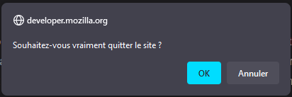

{{ApiRef("Window")}}

`window.confirm()` indique au navigateur d'afficher une boîte de dialogue avec un message optionnel et d'attendre que la personne confirme ou annule la boîte de dialogue.

Sous certaines conditions, par exemple au changement d'onglet, le navigateur pourra ne pas afficher la boîte de dialogue ou ne pas attendre la confirmation ou l'annulation.

## Syntaxe

```js
confirm(message);
```

### Paramètres

- `message`
  - : Une chaîne de caractères qu'on souhaite afficher dans la boîte de dialogue de confirmation.

### Valeur de retour

Un booléen qui indique si l'option «&nbsp;OK&nbsp;» (`true`) ou «&nbsp;Annuler&nbsp;» (`false`) a été sélectionnée. Si le navigateur ignore les boîtes de dialogue, la valeur renvoyée est toujours `false`.

## Exemples

```js
if (window.confirm("Do you really want to leave?")) {
  window.open("exit.html", "Thanks for Visiting!");
}
```

Créera le résultat suivant&nbsp;:



## Notes

Ces boîtes de dialogue sont des fenêtres modales qui empêchent d'accéder au reste de l'interface utilisateur du programme, à moins que la boîte de dialogue soit fermée. Aussi, il ne faut pas abuser de cette fonction.

Il y a également d'autres raisons [d'éviter les boîtes de dialogue pour demander une confirmation](https://alistapart.com/article/neveruseawarning/).

Une autre méthode consiste à utiliser l'élément [`<dialog>`](/fr/docs/Web/HTML/Element/dialog) afin d'afficher des demandes de confirmation.

## Spécifications

{{Specifications}}

## Compatibilité des navigateurs

{{Compat}}

## Voir aussi

- L'élément [`<dialog>`](/fr/docs/Web/HTML/Element/dialog)
- [`window.alert()`](/fr/docs/Web/API/Window/alert)
- [`window.prompt()`](/fr/docs/Web/API/Window/prompt)
