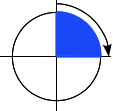
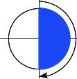
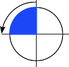
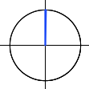

{{CSSRef}}

Le type de données CSS **`<angle>`** permet de représenter des angles exprimés en degrés, radians, grades ou tours. Les angles positifs sont des angles allant dans le sens horaire et les valeurs négatives sont des angles allant dans le sens anti-horaire. Les angles sont par exemples utilisés pour les transformations CSS ({{cssxref("transform")}}) ou les dégradés ({{cssxref("&lt;gradient&gt;")}}).

{{EmbedInteractiveExample("pages/css/type-angle.html")}}

## Syntaxe

Pour exprimer une valeur de ce type, on utilisera une valeur de type {{cssxref("&lt;number&gt;")}} (un nombre), immédiatement suivie d'une unité `deg`, `grad`, `rad` ou `turn`. Comme pour les autres dimensions présentes en CSS, il n'y a pas d'espace entre le littéral réservé à l'unité et le nombre qui indique la mesure de l'angle. L'unité est facultative pour la valeur `0` (bien qu'il soit recommandé d'écrire une unité pour des raisons de lisibilité et de cohérence). Il est possible d'utiliser un signe `+` ou `-` en préfixe.

Pour les propriétés statiques et pour une unité donnée, un même angle pourra être représenté par plusieurs valeurs, ainsi `90deg`, `-270deg`, `1turn` et `4turn` représentent le même angle. En revanche, pour les propriétés dynamiques (par exemple {{cssxref("transition")}} sur {{cssxref("transform")}}), l'effet obtenu sera différent.

### Unités

Pour représenter une valeur dans le type `<angle>`, on pourra utiliser les unités suivantes :

- `deg`
  - : Cette unité permet de représenter un angle exprimé en [degrés](<https://fr.wikipedia.org/wiki/Degr%C3%A9_(angle)>). Un cercle complet correspondra à `360deg`. Voici des valeurs pour l'exemple : `0deg`, `90deg`, `360deg`.
- `grad`
  - : Cette unité permet de représenter un angle exprimé en [grades](<https://fr.wikipedia.org/wiki/Grade_(angle)>). Un cercle complet correspondra à `400grad`. Voici des valeurs pour l'exemple : `0grad`, `100grad`, `400grad`.
- `rad`
  - : Cette unité permet de représenter un angle exprimé en [radians](https://fr.wikipedia.org/wiki/Radian). Un cercle complet correspondra à 2π radians (soit environ `6.2832rad`). Un radian correspond à 180/π degrés. Voici des valeurs pour l'exemple : `0rad`, `1.0708rad`, `6.2832rad`.
- `turn`
  - : Cette unité représente le nombre de tours qu'effectue l'angle. Un cercle complet correspondra à `1turn`. Voici des valeurs pour l'exemple : `0turn`, `0.25turn`, `1turn`.

Même si toutes les unités exprimeront une valeur nulle identique, l'unité **doit** **être indiquée** afin de lever l'ambiguïté entre un angle et une valeur de longueur (type {{cssxref("&lt;length&gt;")}}).

## Exemples

<table>
  <tbody>
    <tr>
      <td></td>
      <td>
        

          Un angle droit orienté dans le sens horaire :
          <code>90deg = 100grad = 0.25turn ≈ 1.5708rad</code>
        

      </td>
    </tr>
    <tr>
      <td></td>
      <td>
        Un angle plat orienté dans le sens horaire :
        <code>180deg = 200grad = 0.5turn ≈ 3.1416rad</code>
      </td>
    </tr>
    <tr>
      <td></td>
      <td>
        Un angle droit orienté dans le sens anti-horaire :
        <code>-90deg = -100grad = -0.25turn ≈ -1.5708rad</code>
      </td>
    </tr>
    <tr>
      <td></td>
      <td>
        
Un angle nul : <code>0 = 0deg = 0grad = 0turn = 0rad</code>

        

          

            <strong>Note :</strong>Si, dans l'absolu, on peut exprimer la valeur
            nulle sans unité, il est fortement recommandé d'indiquer l'unité
            afin de lever toute ambiguïté possible entre les angles et les
            longueurs.
          

        

      </td>
    </tr>
  </tbody>
</table>

## Spécifications

| Spécification                                                            | État                             | Commentaires         |
| ------------------------------------------------------------------------ | -------------------------------- | -------------------- |
| {{SpecName('CSS4 Values', '#angles', '&lt;angle&gt;')}} | {{Spec2('CSS4 Values')}} |                      |
| {{SpecName('CSS3 Values', '#angles', '&lt;angle&gt;')}} | {{Spec2('CSS3 Values')}} | Définition initiale. |

## Compatibilité des navigateurs

{{Compat("css.types.angle")}}
