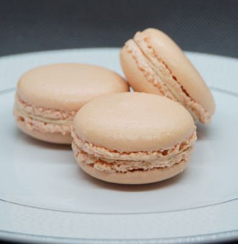

{{CSSRef}}{{Deprecated_Header}}

> **Attention :** Cette propriété est dépréciée, on utilisera [`clip-path`](/fr/docs/Web/CSS/clip-path) à la place.

La propriété [CSS](/fr/docs/Web/CSS) **`clip`** définit la portion visible d'un élément. La propriété `clip` s'applique uniquement aux éléments positionnés de façon absolue (c'est-à-dire qui ont [`position:absolute`](/fr/docs/Web/CSS/position) ou [`position:fixed`](/fr/docs/Web/CSS/position)).

```css
/* Valeur avec un mot-clé */
clip: auto;

/* Valeur de type <shape> */
clip: rect(1px, 10em, 3rem, 2ch);

/* Valeurs globales */
clip: inherit;
clip: initial;
clip: revert;
clip: revert-layer;
clip: unset;
```

## Syntaxe

### Valeurs

- [`<shape>`](/fr/docs/Web/CSS/shape)

  - : Une forme (type [`<shape>`](/fr/docs/Web/CSS/shape)) rectangulaire avec la structure `rect(<haut>, <droit>, <bas>, <gauche>)`. Les valeurs `<haut>` et `<bas>` sont des décalages à partir du _bord intérieur haut de la bordure_ de la boîte, tandis que `<droit>` et `<gauche>` sont des décalages à partir du _bord intérieur gauche de la bordure_ de la boîte, c'est-à-dire la délimitation de la zone de remplissage (<i lang="en">padding</i>).

    Les valeurs `<haut>`, `<droit>`, `<bas>`, et `<gauche>` peuvent être exprimées avec une longueur (valeur de type [`<length>`](/fr/docs/Web/CSS/length)) ou `auto`. Si l'une des valeurs est `auto`, l'élément est rogné sur _le bord intérieur de la bordure_ du côté correspondant.

- `auto`
  - : L'élément n'est pas rogné (par défaut). Attention, le comportement est différent de celui obtenu avec `rect(auto, auto, auto, auto)`, qui rogne l'élément aux bords intérieurs de la bordure.

## Définition formelle

{{cssinfo}}

## Syntaxe formelle

{{csssyntax}}

## Exemples

### Rogner une image

#### CSS

```css
.dotted-border {
  border: dotted;
  position: relative;
  width: 390px;
  height: 400px;
}

#top-left,
#middle,
#bottom-right {
  position: absolute;
  top: 0;
}

#top-left {
  left: 400px;
  clip: rect(0, 130px, 90px, 0);
}

#middle {
  left: 270px;
  clip: rect(100px, 260px, 190px, 130px);
}

#bottom-right {
  left: 140px;
  clip: rect(200px, 390px, 290px, 260px);
}
```

#### HTML

```html
<p class="dotted-border">
  
  
  
  
</p>
```

#### Résultat

{{EmbedLiveSample('','','500px')}}

## Spécifications

{{Specifications}}

## Compatibilité des navigateurs

{{Compat}}

## Voir aussi

- Cette propriété est dépréciée, on utilisera [`clip-path`](/fr/docs/Web/CSS/clip-path) à la place.
- Les propriétés CSS connexes&nbsp;:
  - [`text-overflow`](/fr/docs/Web/CSS/text-overflow)
  - [`white-space`](/fr/docs/Web/CSS/white-space)
  - [`overflow-x`](/fr/docs/Web/CSS/overflow-x)
  - [`overflow-y`](/fr/docs/Web/CSS/overflow-y)
  - [`overflow`](/fr/docs/Web/CSS/overflow)
  - [`display`](/fr/docs/Web/CSS/display)
  - [`position`](/fr/docs/Web/CSS/position)
