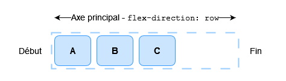
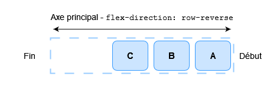
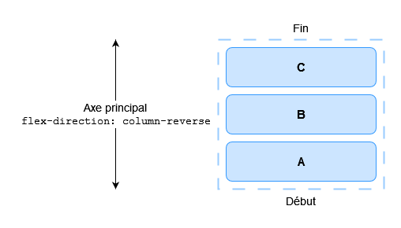

{{CSSRef}}

Une des raisons qui ont poussé à l'adoption des boîtes flexibles est la présence d'outils d'alignement enfin corrects pour le Web. On pouvait ainsi enfin centrer une boîte sur un axe vertical. Dans ce guide, nous verrons dans le détail comment fonctionnent les propriétés d'alignement et de justification relatives aux boîtes flexibles.

Afin de centrer notre boîte, nous allons utiliser la propriété `align-items` afin d'aligner l'objet sur l'axe secondaire (_cross axis_ en anglais). Dans notre exemple, cet axe est l'axe de bloc et est orienté verticalement. La propriété `justify-content` est quant à elle utilisée pour aligner l'objet sur l'axe principal (_main axis_ en anglais) (ici l'axe principal est l'axe en ligne qui s'étend horizontalement).

Vous pouvez étudier le code de l'exemple suivant et modifier la taille du conteneur ou d'un élément imbriqué : l'élément imbriqué sera toujours centré.

{{EmbedGHLiveSample("css-examples/flexbox/alignment/intro.html", '100%', 700)}}

## Les propriétés responsables de l'alignement

Voici les propriétés que nous étudierons dans ce guide :

- {{cssxref("justify-content")}} — contrôle l'alignement de tous les objets sur l'axe principal.
- {{cssxref("align-items")}} — contrôle l'alignement de tous les objets sur l'axe secondaire.
- {{cssxref("align-self")}} — contrôle l'alignement d'un objet flexible donné le long de l'axe secondaire.
- {{cssxref("align-content")}} — contrôle l'espace entre les lignes flexibles sur l'axe secondaire.

Nous verrons également comment les marges automatiques peuvent être utilisées dans l'alignement des boîtes flexibles.

> **Note :** Les propriétés d'alignement du module de spécification CSS Flexbox ont été placés dans leur propre spécification : [CSS Box Alignment Level 3](https://www.w3.org/TR/css-align-3/). Cette dernière remplacera à terme les propriétés définies dans le module Flexbox de niveau 1.

## L'axe secondaire (_cross axis_)

Les propriétés `align-items` et `align-self` permettent de gérer l'alignement des éléments flexibles sur l'axe secondaire.

Prenons un exemple simple : nous ajoutons `display: flex` à un conteneur qui contient trois objets. Tous s'étirent afin d'être aussi grands que le plus grand des éléments car celui-ci définit la taille du conteneur sur l'axe secondaire. Si le conteneur flexible possède une hauteur définie, les objets qu'il contient s'étireront pour atteindre cette taille, quel que soit le contenu dont ils disposent.

Les éléments obtiennent la même hauteur à cause de la valeur initiale de `align-items` qui contrôle l'alignement sur l'axe secondaire. Cette valeur initiale est `stretch` (qui indique que les objets du conteneur doivent être étirés sur l'axe).

Voici les valeurs disponibles pour aligner les objets :

- `align-items: flex-start`
- `align-items: flex-end`
- `align-items: center`
- `align-items: stretch`
- `align-items: baseline`

Dans l'exemple qui suit, la valeur d'`align-items` est `stretch`. Vous pouvez essayer les autres valeurs afin de voir comment les objets s'alignent dans le conteneur.

{{EmbedGHLiveSample("css-examples/flexbox/alignment/align-items.html", '100%', 520)}}

### Aligner un objet avec `align-self`

La propriété `align-items` définit la valeur de la propriété `align-self` pour l'ensemble des objets flexibles. Cela signifie qu'on peut utiliser la propriété `align-self` de façon explicite, sur un élément donné, afin de préciser son alignement. La propriété `align-self` prend en charge les mêmes valeurs que `align-items` ainsi qu'un mot-clé `auto` qui reprendra la valeur définie sur le conteneur flexible.

Dans le prochain exemple, le conteneur flexible a `align-items: flex-start`, ce qui signifie que les éléments sont tous alignés au début de l'axe secondaire. On utilise le sélecteur `first-child` afin de cibler le premier élément fils pour lequel on indique `align-self: stretch` ; un autre élément a été sélectionné via la classe `selected` et est paramétré avec `align-self: center`. Vous pouvez modifier la valeur de `align-items` ou changer les valeurs d'`align-self` sur les éléments afin d'observer le fonctionnement.

{{EmbedGHLiveSample("css-examples/flexbox/alignment/align-self.html", '100%', 650)}}

### Changer d'axe principal

Jusqu'à présent, les exemples fonctionnaient avec `flex-direction` valant `row` et avec un langage dont les lignes progressent du haut vers le bas. Cela signifie que l'axe principal est une ligne horizontale et que l'axe secondaire est une ligne verticale dirigée vers le bas.

Si on passe `flex-direction` à `column`, `align-items` et `align-self` aligneront les éléments à gauche et à droite.

Vous pouvez manipuler cet exemple qui reprend le même code que l'exemple précédent avec la seule exception que `flex-direction` vaut ici `column`.

{{EmbedGHLiveSample("css-examples/flexbox/alignment/align-self-column.html", '100%', 730)}}

## Aligner le contenu sur l'axe secondaire : `align-content`

Jusqu'à présent, nous avons aligné les éléments ou un élément donné dans la zone définie par le conteneur flexible. Si on a un conteneur qui s'étend / se divise sur plusieurs lignes, on pourra utiliser la propriété `align-content` afin de contrôler la distribution de l'espace entre les lignes. La spécification décrit cela comme [le groupement des lignes flexibles](https://drafts.csswg.org/css-flexbox/#align-content-property).

Afin qu'`align-content` puisse fonctionner, il faut un conteneur dont la hauteur est supérieure à celle qui est nécessaire à l'affichage des éléments. Le moteur applique alors les règles sur l'ensemble des éléments et régit l'utilisation de l'espace restant et l'alignement de l'ensemble dans cet espace.

La propriété `align-content` prend les valeurs suivantes :

- `align-content: flex-start`
- `align-content: flex-end`
- `align-content: center`
- `align-content: space-between`
- `align-content: space-around`
- `align-content: stretch`
- `align-content: space-evenly` (cette valeur n'est pas définie dans le module de spécification Flexbox)

Dans l'exemple suivant, le conteneur flexible a une hauteur de 400 pixels, ce qui est supérieur à ce qui est nécessaire pour afficher le contenu. `align-content` vaut `space-between` ce qui signifie que l'espace disponible sera réparti _entre_ les lignes flexibles dont la première commence en étant adjacente à la ligne de début et dont la dernière est adjacente à la ligne de fin de l'axe secondaire.

Vous pouvez modifier la valeur de `align-content` afin d'observer comment cette propriété fonctionne.

{{EmbedGHLiveSample("css-examples/flexbox/alignment/align-content.html", '100%', 850)}}

Là encore, on peut passer avec `flex-direction: column` afin de voir comment les propriétés se comportent sur les colonnes. Là aussi, il faut suffisamment d'espace le long de l'axe secondaire afin qu'il y ait de l'espace libre à répartir.

{{EmbedGHLiveSample("css-examples/flexbox/alignment/align-content-column.html", '100%', 860)}}

> **Note :** La valeur `space-evenly` n'est pas définie dans la spécification relative aux boîtes flexibles et a été dernièrement ajoutée à la spécification sur l'alignement des boîtes. Cette valeur est donc moins prise en charge par les navigateurs que les autres mots-clés.

Vous pouvez consulter la documentation sur {{cssxref("align-content")}} pour en savoir plus, notamment sur la compatibilité des navigateurs.

## Aligner le contenu sur l'axe principal

Nous avons pu voir comment fonctionne l'alignement sur l'axe secondaire. Concentrons-nous désormais sur l'alignement relatif à l'axe principal. Ici, une seule propriété est disponible : `justify-content`. En effet, sur cet axe, les éléments sont gérés comme un seul groupe. Avec, `justify-content` on contrôle comment l'espace disponible est réparti s'il y a plus d'espace que nécessaire pour afficher les objets.

Dans l'exemple initial avec `display: flex` appliqué au conteneur, les éléments formaient une ligne qui commençait au début du conteneur. Cela provient de la valeur initiale de `justify-content` qui est `flex-start`. Avec cette valeur, tout l'espace disponible est placé à la fin, après les éléments.

La propriété `justify-content` prend en charge les mêmes valeurs que `align-content`.

- `justify-content: flex-start`
- `justify-content: flex-end`
- `justify-content: center`
- `justify-content: space-between`
- `justify-content: space-around`
- `justify-content: stretch`
- `justify-content: space-evenly` (ce mot-clé n'est pas défini dans la spécification CSS sur les boîtes flexibles)

Dans le prochain exemple, `justify-content` vaut `space-between`. L'espace disponible après l'affichage des éléments est alors distribué entre les éléments et le premier élément est adjacent à la ligne de début et le dernier est adjacent à la ligne de fin.

{{EmbedGHLiveSample("css-examples/flexbox/alignment/justify-content.html", '100%', 480)}}

Si l'axe principal suit la direction de bloc (orthogonale au sens d'écriture) car `flex-direction` est paramétré avec la valeur `column`, `justify-content` distribuera l'espace selon cet axe tant que l'espace du conteneur flexible est suffisant.

{{EmbedGHLiveSample("css-examples/flexbox/alignment/justify-content-column.html", '100%', 880)}}

### L'alignement et les modes d'écriture

Rappelons ici qu'avec ces méthodes d'alignement, `flex-start` et `flex-end` respectent le mode d'écriture utilisé. Si on utilise `justify-content` avec la valeur `start` pour un contenu écrit en anglais (un mode d'écriture de la gauche vers la droite), les éléments commenceront à gauche du conteneur.

Mais si le contenu est écrit en arabe (un mode d'écriture de la droite vers la gauche), les éléments démarreront à la droite du conteneur.

Dans l'exemple qui suit, on indique explicitement la valeur `rtl` pour la propriété `display` afin de forcer un mode d'écriture de droite à gauche. Vous pouvez retirer cette déclaration ou modifier la valeur de `justify-content` afin de voir comment les boîtes flexibles s'organisent lorsque le début de la ligne est à droite.

{{EmbedGHLiveSample("css-examples/flexbox/alignment/justify-content-writing-mode.html", '100%', 440)}}

## L'alignement et la propriété `flex-direction`

La ligne de début sera également modifiée si on change la valeur de la propriété `flex-direction`, par exemple en utilisant `row-reverse` à la place de `row`.

Dans le prochain exemple, on utilise `flex-direction: row-reverse` et `justify-content: flex-end`. Pour une langue écrite de gauche à droite, les éléments seront regroupés à gauche. Si vous modifiez les valeurs et passez de `flex-direction: row-reverse` à `flex-direction: row`. Vous verrez que les éléments sont désormais groupés à droite.

{{EmbedGHLiveSample("css-examples/flexbox/alignment/justify-content-reverse.html", '100%', 440)}}

Si cela peut paraître déroutant, la règle principale à mémoriser est que, par défaut, si on ne change rien, les éléments flexibles sont organisés dans la direction naturelle de la langue dans laquelle le document est écrit. `flex-start` correspondra donc à la ligne de début depuis laquelle une phrase démarrerait.

On peut changer l'axe avec `flex-direction: column`. Dans ce cas, `flex-start` correspondra à l'emplacement du début du premier paragraphe d'un texte.

Si on utilise `flex-direction` avec une des valeurs inversée, les éléments seront organisés dans l'ordre inverse (à l'opposé de la disposition naturelle de la langue utilisée pour le document). `flex-start` correspondra alors à la « fin » usuelle d'une ligne de texte sur une disposition en ligne et au dernier paragraphe sur une disposition organisée sur un axe principal vertical.

## Utiliser les marges automatiques pour aligner sur l'axe principal

Il n'existe pas de propriété `justify-items` ou `justify-self` qui permettent d'aligner un élément donné parmi le groupe d'éléments flexibles organisés sur l'axe principal. Toutefois, on peut obtenir un alignement individuel pour séparer un élément ou un groupe d'éléments grâce aux marges automatiques et aux boîtes flexibles.

Un motif fréquent est l'organisation d'une barre de navigation où certains éléments clés sont situés à droite alors qu'un groupe principal est présent à gauche. On pourrait alors penser qu'il s'agit d'un cas d'utilisation pour une propriété comme `justify-self`… Cependant, si on regarde l'image qui suit et qu'on était capable de modifier `justify-self` sur l'élément _d_, cela changerait également l'alignement de l'élément _e_ qui suit, ce qui pourrait ou non être voulu.

Plutôt que cela, on peut cibler le quatrième élément et le séparer des trois premiers en utilisant `margin-left: auto`. Une marge automatique consommera tout l'espace disponible sur l'axe correspondant.

Dans l'exemple qui suit, on a plusieurs éléments flexibles organisés sur une ligne avec les valeurs de base pour les propriétés liées aux boîtes flexibles. La classe `push` possède la déclaration `margin-left: auto`. Vous pouvez observer l'effet obtenu en retirant cette classe ou en l'appliquant à un autre élément.

{{EmbedGHLiveSample("css-examples/flexbox/alignment/auto-margins.html", '100%', 470)}}

## Les prochaines fonctionnalités pour l'alignement et les boîtes flexibles

Au début de cet article, nous avons vu que les propriétés d'alignement actuellement définies dans le module de spécification CSS de niveau 1 pour les boîtes flexibles étaient également définies dans le module de spécification de niveau 3 pour l'alignement des boîtes. Ce module pourrait voir l'apparition de nouvelles valeurs pour ces propriétés comme le montre d'ailleurs l'introduction de la valeur `space-evenly` pour les propriétés `align-content` et `justify-content`.

Le module de spécification sur l'alignement des boîtes inclut également d'autres méthodes pour créer des espaces entre les objets telles que les propriétés `column-gap` et `row-gap` décrites dans [le module de grille CSS (_CSS Grid_)](/fr/docs/Web/CSS/CSS_Grid_Layout). L'inclusion de ces propriétés dans le module d'alignement des boîtes signifie que nous pourrons plus tard les utiliser dans les dispositions avec les boîtes flexibles. Cela signifie qu'il ne sera plus nécessaire d'utiliser des marges afin d'espacer des éléments flexibles. Firefox 63 devrait implémenter les propriétés `gap` pour les dispositions flexibles.

Lorsque vous explorez les différentes méthodes d'alignement relatives aux boîtes flexibles, n'hésitez pas à étudier ce qui est disponible avec une disposition en grille (_CSS Grid Layout_). En effet, ces deux spécifications utilisent les propriétés d'alignement qui sont désormais détaillées dans la spécification sur l'alignement des boîtes. Vous pouvez en savoir plus sur le fonctionnement de ces propriétés sur une grille [grâce à cet article](/fr/docs/Web/CSS/CSS_Grid_Layout/Box_Alignment_in_CSS_Grid_Layout). Une page récapitulative (en anglais) est également disponible pour comparer le fonctionnement de l'alignement par rapport à ces différentes spécifications : _[Box Alignment Cheatsheet](https://rachelandrew.co.uk/css/cheatsheets/box-alignment)_.

## Voir aussi

- [Le module*CSS Box Alignment*](/fr/docs/Web/CSS/CSS_Box_Alignment)
- [L'alignement des boîtes avec Flexbox](/fr/docs/Web/CSS/CSS_Box_Alignment/Box_Alignment_in_Flexbox)
- [L'alignement des boîtes avec une grille CSS](/fr/docs/Web/CSS/CSS_Box_Alignment/Box_Alignment_In_Grid_Layout)
