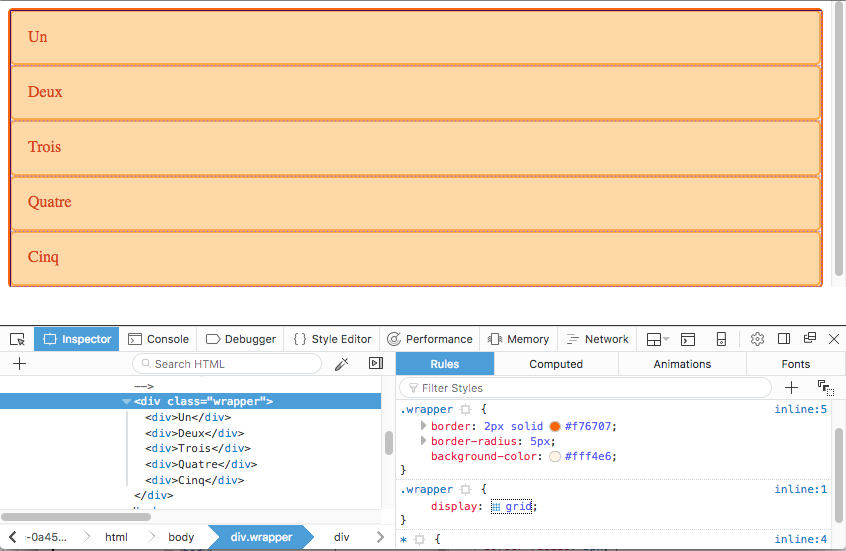
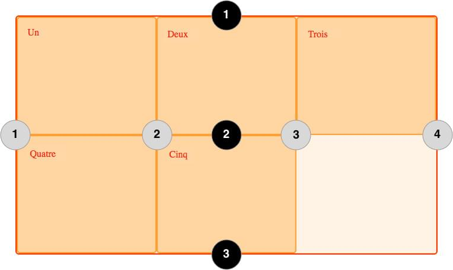
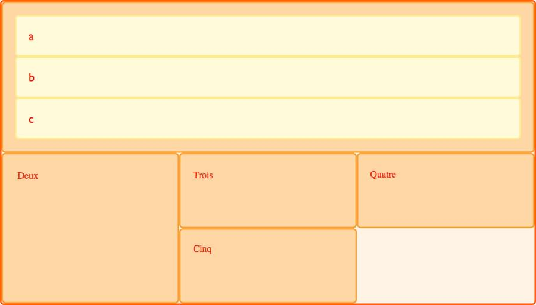

{{CSSRef}}

{{PreviousMenuNext("", "Web/CSS/CSS_Grid_Layout/Placer_les_éléments_sur_les_lignes_d_une_grille_CSS","Web/CSS/CSS_Grid_Layout")}}

Le module [CSS Grid Layout](/fr/docs/Web/CSS/CSS_Grid_Layout) ajoute à CSS une grille à deux dimensions. Les grilles peuvent être utilisées pour agencer des pages entières ou de petits éléments d'interface. Cet article introduit CSS Grid Layout, et la terminologie de la spécification CSS Grid Layout Level 1. Les fonctionnalités évoquées seront expliquées plus en détail dans le reste du guide.

## Qu'est-ce qu'une grille ?

Une grille est un ensemble de lignes horizontales et verticales qui se croisent – les premières définissant les rangées, et les secondes les colonnes. Les éléments sont placés sur la grille en fonction de ces rangées et colonnes. Les fonctionnalités sont les suivantes :

### Pistes à taille fixe ou variable

On peut créer une grille avec des pistes à taille fixes en utilisant une unité comme le pixel. Pour les pistes à taille variable on peut utiliser le pourcentage ou la nouvelle unité `fr` créée à cet effet.

### Placement des éléments

Pour placer les éléments sur la grille, on peut utiliser le numéro ou le nom d'une ligne, ou cibler une zone particulière. La grille contient aussi un algorithme pour placer les éléments qui n'ont pas été placés explicitement.

### Création de pistes supplémentaires pour du contenu

Lorsqu'une grille explicite n'est pas définie, la spécification prend en charge le contenu défini en dehors d'une grille en ajoutant des colonnes et des rangées. Cela comprend des fonctionnalités telles qu'« ajouter autant de colonnes que possible dans le conteneur ».

### Contrôle de l'alignement

On peut contrôler l'alignement des éléments dans une zone de la grille, ainsi que celui de l'ensemble de la grille.

### Contrôle des contenus qui se chevauchent

Il peut arriver que l'on place plusieurs éléments dans une même cellule, ou que des zones se chevauchent. La superposition peut être contrôlée à l'aide de la propriété {{cssxref("z-index")}}.

La grille est une spécification puissante qui peut être combinée avec d'autres modules CSS tels que [flexbox](/fr/docs/Web/CSS/CSS_Flexible_Box_Layout). Le point de départ est le **conteneur**.

## Le conteneur

À partir du moment où on crée un _conteneur_ en déclarant la propriété `display: grid` ou `display: inline-grid` sur un élément, tous les _enfants directs_ de cet élément deviennet des _éléments de grille_.

Cet exemple montre une div avec une classe `.wrapper`, avec cinq éléments enfants.

```html
<div class="wrapper">
  <div>Un</div>
  <div>Deux</div>
  <div>Trois</div>
  <div>Quatre</div>
  <div>Cinq</div>
</div>
```

On transforme `.wrapper` en conteneur.

```css
.wrapper {
  display: grid;
}
```

```css hidden
* {box-sizing: border-box;}
.wrapper {
  border: 2px solid #f76707;
  border-radius: 5px;
  background-color: #fff4e6;
}
.wrapper > div {
  border: 2px solid #ffa94d;
  border-radius: 5px;
  background-color: #ffd8a8;
  padding: 1em;
  color: #d9480f;
}
```

{{ EmbedLiveSample('Le_conteneur', '200', '330') }}

Tous les enfants directs sont maintenant des éléments de grille. On ne voit pas la différence dans un navigateur, car la grille n'a qu'une seule colonne. Vous trouverez sans doute utile de travailler avec Firefox, qui propose un [inspecteur de grille](/fr/docs/Tools/Page_Inspector/How_to/Examine_grid_layouts) dans les outils de développement. En inspectant la grille dans Firefox, vous pouvez voir une petite icône à côté de la valeur `grid`. Un clic dessus permet d'afficher la grille correspondante dans le navigateur.



Cet outil vous permettra de mieux comprendre le fonctionnement de CSS Grid Layout.

Pour que notre exemple ressemble vraiment à une grille nous devons ajouter des colonnes.

## Les pistes

Les propriétés {{cssxref("grid-template-columns")}} et {{cssxref("grid-template-rows")}} permettent de définir des colonnes et des rangées. Celles-ci définissent les pistes. Une _piste_ est l'espace entre deux lignes d'une grille. L'image ci-dessous colore une piste de la grille – correspondant à la première rangée de la grille.


On peut ajouter la propriété `grid-template-columns` à notre exemple précédent, pour définir la taille des colonnes.

Nous avons créé une grille avec trois pistes de 200 pixels de large. Chaque élément sera disposé dans l'une des cellules de la grille.

```html
<div class="wrapper">
  <div>Un</div>
  <div>Deux</div>
  <div>Trois</div>
  <div>Quatre</div>
  <div>Cinq</div>
</div>
```

```css
.wrapper {
  display: grid;
  grid-template-columns: 200px 200px 200px;
}
```

```css hidden
* {box-sizing: border-box;}
.wrapper {
  border: 2px solid #f76707;
  border-radius: 5px;
  background-color: #fff4e6;
}
.wrapper > div {
  border: 2px solid #ffa94d;
  border-radius: 5px;
  background-color: #ffd8a8;
  padding: 1em;
  color: #d9480f;
}
```

{{ EmbedLiveSample('Les_pistes', '610', '140') }}

### L'unité fr

Les pistes peuvent être définies à l'aide de n'importe quelle unité de mesure. Les grilles proposent aussi une nouvelle unité de mesure pour aider à la création de pistes flexibles. Cette unité, `fr`, représente une fraction de l'espace disponible dans le conteneur de la grille. Le code suivant crée trois colonnes égales qui se redimensionnent en fonction de l'espace disponible.

```html
<div class="wrapper">
  <div>Un</div>
  <div>Deux</div>
  <div>Trois</div>
  <div>Quatre</div>
  <div>Cinq</div>
</div>
```

```css
.wrapper {
  display: grid;
  grid-template-columns: 1fr 1fr 1fr;
}
```

```css hidden
* {box-sizing: border-box;}
.wrapper {
  border: 2px solid #f76707;
  border-radius: 5px;
  background-color: #fff4e6;
}
.wrapper > div {
  border: 2px solid #ffa94d;
  border-radius: 5px;
  background-color: #ffd8a8;
  padding: 1em;
  color: #d9480f;
}
```

{{ EmbedLiveSample("L'unité_fr", '220', '140') }}

L'exemple suivant crée une grille avec une colonne de `2fr`, et deux colonnes de `1fr`. L'espace disponible est divisé en quatre. Les deux premières fractions sont allouées à la première colonne, et chacune des colonnes suivante dispose d'une fraction.

```css
.wrapper {
  display: grid;
  grid-template-columns: 2fr 1fr 1fr;
}
```

Dans ce dernier exemple nous utilisons à la fois des dimensions absolues et des relatives. La première colonne faisant 500px, cette valeur est soustraite de l'espace disponible. L'espace restant est divisé en trois et alloué proportionnellement aux deux colonnes spécifiées avec l'unité relative `fr`.

```css
.wrapper {
  display: grid;
  grid-template-columns: 500px 1fr 2fr;
}
```

### Utiliser la notation `repeat()` pour définir les pistes

Pour les grilles comprenant de nombreuses pistes on peut utiliser la notation `repeat()` pour répéter toute ou une partie des pistes définies. Par exemple la définition de grille :

```css
.wrapper {
  display: grid;
  grid-template-columns: 1fr 1fr 1fr;
}
```

peut également s'écrire :

```css
.wrapper {
  display: grid;
  grid-template-columns: repeat(3, 1fr);
}
```

Dans l'exemple suivant on crée une grille avec une première colonne de 20px de large, puis une section répétant 6 fois une piste de 1fr, et enfin on termine par une colonne de 20px de large.

```css
.wrapper {
  display: grid;
  grid-template-columns: 20px repeat(6, 1fr) 20px;
}
```

Cette notation accepte une liste de pistes, on peut donc l'utiliser pour répéter un motif. Dans l'exemple qui suit la grille aura 10 colonnes : une colonne de 1fr suivie d'une colonne de 2fr, ceci répété 5 fois.

```css
.wrapper {
  display: grid;
  grid-template-columns: repeat(5, 1fr 2fr);
}
```

### Grille implicite et grille explicite

Dans ces exemples nous avons défini nos colonnes à l'aide de la propriété {{cssxref("grid-template-columns")}}, et nous avons laissé la grille créer les rangées. Ces rangées font partie de la grille implicite.La grille explicite est constituée des pistes définies par les propriétés {{cssxref("grid-template-columns")}} et {{cssxref("grid-template-rows")}}. Si un élément est placé en dehors de la grille ainsi définie, ou que la quantité de contenu nécessite d'étendre la grille, alors la grille ajoute implicitement des colonnes et rangées. Les dimensions de ces pistes auront par défaut la valeur auto, c'est-à dire qu'elles s'ajusteront à leur contenu.

On peut définir une taille pour les pistes de la grille implicite grâce aux propriéts {{cssxref("grid-auto-rows")}} et {{cssxref("grid-auto-columns")}}.

Dans l'exemple ci-après nous utilisons `grid-auto-rows` pour que les rangées de la grille implicite fassent 200 pixels de haut.

```html
<div class="wrapper">
  <div>Un</div>
  <div>Deux</div>
  <div>Trois</div>
  <div>Quatre</div>
  <div>Cinq</div>
</div>
```

```css
.wrapper {
  display: grid;
  grid-template-columns: repeat(3, 1fr);
  grid-auto-rows: 200px;
}
```

```css hidden
* {box-sizing: border-box;}
.wrapper {
    border: 2px solid #f76707;
    border-radius: 5px;
    background-color: #fff4e6;
}
.wrapper > div {
    border: 2px solid #ffa94d;
    border-radius: 5px;
    background-color: #ffd8a8;
    padding: 1em;
    color: #d9480f;
}
```

{{ EmbedLiveSample('Grille_implicite_et_grille_explicite', '230', '420') }}

### Dimensionner une piste avec `minmax`

Que l'on crée une grille explicite, ou que l'on définisse la taille des pistes créées implicitement, il peut être utile d'assigner une taille minimum, qui s'agrandit pour s'adapter au contenu. Par exemple on peut souhaiter que les rangées ne soient jamais moins hautes que 100 pixels, mais qu'elles aillent jusqu'à 300 pixels de haut si le contenu le nécessite.

La fonction {{cssxref("minmax()", "minmax()")}} permet ce comportement. Dans l'exemple suivant nous utilisons `minmax()` comme valeur de la propriété {{cssxref("grid-auto-rows")}}. Les rangées créées automatiquement feront un minimum de 100 pixels, et un maximum de `auto`, ce qui signifie que la taille s'adaptera à la hauteur du contenu.

```css
.wrapper {
  display: grid;
  grid-template-columns: repeat(3, 1fr);
  grid-auto-rows: minmax(100px, auto);
}
```

```css hidden
* {box-sizing: border-box;}
.wrapper {
    border: 2px solid #f76707;
    border-radius: 5px;
    background-color: #fff4e6;
}
.wrapper > div {
    border: 2px solid #ffa94d;
    border-radius: 5px;
    background-color: #ffd8a8;
    padding: 1em;
    color: #d9480f;
}
```

```html
<div class="wrapper">
   <div>Un</div>
   <div>Deux
     <p>Davantage de contenu.</p>
     <p>On dépasse les 100 pixels.</p>
   </div>
   <div>Trois</div>
   <div>Quatre</div>
   <div>Cinq</div>
</div>
```

{{ EmbedLiveSample('Dimensionner_une_piste_avec_minmax', '240', '470') }}

## Lignes de grille

Il faut noter que l'on définit les pistes d'une grille, et pas les lignes qui en résultent. La grille génère des lignes numérotées que l'on utilise pour positionner les éléments. Dans notre grille de trois colonnes et deux rangées, nous avons quatre lignes de colonnes.



Les lignes sont numérotées selon le sens de lecture du document. Dans un langage qui se lit de gauche à droite, la ligne 1 est située à gauche, dans un langage qui se lit de droite à gauche elle est située à droite. Les lignes peuvent aussi être nommées, comme nous le verrons plus loin dans ces pages.

### Positionnement des éléments sur les lignes

Nous explorerons le placement sur les lignes plus en détail dans un prochain article, l'exemple qui suit montre comment l'utiliser de façon simple.

Lorsque nous plaçons un élément nous ciblons une ligne plutôt qu'une piste. Nous plaçons ici les deux premiers éléments en utilisant les propriétés {{cssxref("grid-column-start")}}, {{cssxref("grid-column-end")}}, {{cssxref("grid-row-start")}} et {{cssxref("grid-row-end")}}. En allant de gauche à droite, le premier élément est placé sur la ligne de colonne 1, et va jusqu'à la ligne de colonne 4, qui dans ce cas est la dernière. Il est placé sur la ligne de rangée 1, et va jusqu'à la ligne 3, s'étendant ainsi sur deux rangées.

Le second élément commence sur la ligne de colonne 1 et s'étend sur une seule piste. C'est la largeur par défaut, donc il n'est pas nécessaire de spécifier la ligne de fin. Il s'étend aussi sur deux rangées de la ligne 3 à la ligne 5. Les autres éléments se placeront dans les espaces vides de la grille.

```html
<div class="wrapper">
  <div class="box1">Un</div>
  <div class="box2">Deux</div>
  <div class="box3">Trois</div>
  <div class="box4">Quatre</div>
  <div class="box5">Cinq</div>
</div>
```

```css
.wrapper {
  display: grid;
  grid-template-columns: repeat(3, 1fr);
  grid-auto-rows: 100px;
}
.box1 {
  grid-column-start: 1;
  grid-column-end: 4;
  grid-row-start: 1;
  grid-row-end: 3;
}
.box2 {
  grid-column-start: 1;
  grid-row-start: 3;
  grid-row-end: 5;
}
```

```css hidden
* {box-sizing: border-box;}
.wrapper {
    border: 2px solid #f76707;
    border-radius: 5px;
    background-color: #fff4e6;
}
.wrapper > div {
    border: 2px solid #ffa94d;
    border-radius: 5px;
    background-color: #ffd8a8;
    padding: 1em;
    color: #d9480f;
}
```

{{ EmbedLiveSample('Positionnement_des_éléments_sur_les_lignes', '230', '420') }}

Pensez à utiliser l'[Inspecteur de grille](/fr/docs/Tools/Page_Inspector/How_to/Examine_grid_layouts) dans les outils de développement pour voir comment les éléments se placent sur les lignes d'une grille items.

## Les cellules

Une _cellule_ est la plus petite unité sur une grille, conceptuellement similaire à une cellule de tableau. Comme nous l'avons vu lorsqu'une grille est définie sur un élément ses enfants viennent se positionner chacun dans l'une des cellules de la grille. Dans l'image ci-dessous la première cellule est colorée.


## Les zones

Un élément peut s'étendre sur plusieurs cellules d'une rangée ou d'une colonne, et cela crée une _zone_. Les zones doivent être rectangulaires - on ne peut pas créer de forme en L par exemple. La zone colorée ci-dessous s'étend sur deux rangées et deux colonnes.


## Les gouttières

Les _gouttières_ entre les cellules sont définies à l'aide des propriétés {{cssxref("grid-column-gap")}} et {{cssxref("row-gap")}}, ou de la propriété raccourcie {{cssxref("gap")}}. Dans l'exemple ci-dessous nous créons une gouttière de dix pixels de large entre les colonnes, et une gouttière de 1em de hauteur entre les rangées.

```css
.wrapper {
  display: grid;
  grid-template-columns: repeat(3, 1fr);
  grid-column-gap: 10px;
  grid-row-gap: 1em;
}
```

> **Note :** Les anciens navigateurs utilisent {{cssxref("column-gap")}}, {{cssxref("row-gap")}}, {{cssxref("gap")}} avec le préfixe `grid-` soit : {{cssxref("grid-column-gap")}}, {{cssxref("row-gap")}} et {{cssxref("gap")}}.
>
> Les navigateurs actuels retirent progressivement ce préfixe (la version préfixée sera maintenue sous forme d'alias). À l'heure actuelle, certains navigateurs ne prennent pas encore la version sans préfixe et c'est pourquoi certains exemples de ce guide continuent d'utiliser les versions préfixées avec `grid-`.

```html
<div class="wrapper">
  <div>Un</div>
  <div>Deux</div>
  <div>Trois</div>
  <div>Quatre</div>
  <div>Cinq</div>
</div>
```

```css hidden
* {box-sizing: border-box;}
.wrapper {
    border: 2px solid #f76707;
    border-radius: 5px;
    background-color: #fff4e6;
}
.wrapper > div {
    border: 2px solid #ffa94d;
    border-radius: 5px;
    background-color: #ffd8a8;
    padding: 1em;
    color: #d9480f;
}
```

{{ EmbedLiveSample('Les_gouttières') }}

L'espace utilisé par les gouttières sera pris en compte avant l'assignation de la place restante aux pistes définies avec l'unité `fr`. La taille des gouttières est calculée comme celle des pistes, mais on ne peut pas placer d'élément dans une gouttière. Au niveau du positionnement des éléments sur les lignes, la gouttière se comporte comme une ligne épaisse.

## Grilles imbriquées

Un élément placé dans une grille peut aussi être le conteneur d'une autre grille. Dans l'exemple suivant nous retrouvons la grille de trois colonnes créée plus haut, avec deux éléments explicitement positionnés. Le premier élément contient lui-même des éléments. Comme ils ne sont pas des enfants directs de la grille principale, ils se positionnent normalement dans le flux.

```html
<div class="wrapper">
  <div class="box box1">
    <div class="nested">a</div>
    <div class="nested">b</div>
    <div class="nested">c</div>
  </div>
  <div class="box box2">Deux</div>
  <div class="box box3">Trois</div>
  <div class="box box4">Quatre</div>
  <div class="box box5">Cinq</div>
</div>
```



En définissant la propriété `display:grid` sur l'élément `box1`, il devient lui-même une grille et ses enfants se positionnent sur cette grille.

```css
.box1 {
  grid-column-start: 1;
  grid-column-end: 4;
  grid-row-start: 1;
  grid-row-end: 3;
  display: grid;
  grid-template-columns: repeat(3, 1fr);
}
```

```css hidden
* {box-sizing: border-box;}
.wrapper {
    border: 2px solid #f76707;
    border-radius: 5px;
    background-color: #fff4e6;
}
.box {
    border: 2px solid #ffa94d;
    border-radius: 5px;
    background-color: #ffd8a8;
    padding: 1em;
    color: #d9480f;
}
.nested {
    border: 2px solid #ffec99;
    border-radius: 5px;
    background-color: #fff9db;
    padding: 1em;
}
```

{{ EmbedLiveSample('Grilles_imbriquées', '600', '340') }}

Dans ce cas la grille imbriquée n'est pas liée à la grille qui la contient. Elle n'hérite pas des {{cssxref("gap")}}, et ses lignes ne s'alignent pas avec celles de la grille parent.

### Sous-grille

Dans le brouillon de travaille pour la spécification de niveau 2 pour CSS Grid, il existe une fonctionnalité nommée _sous-grille_ qui permet de créer des grilles imbriquées qui utilisent la définition de la grille parent. _Ceci n'est implémenté dans aucun navigateur pour le moment, et la spécification peut encore changer._ Pour l'utiliser telle qu'elle est définie actuellement il faudrait modifier l'exemple suivant et remplacer `display: grid` par `display: subgrid`, et supprimer la définition des pistes. La piste imbriquée utiliserait les pistes de la grille parent pour positionner ses éléments.

Selon la version actuelle de la spécifiction, il faudrait éditer l'exemple de grille imbriquée précédent et remplacer `grid-template-columns: repeat(3, 1fr)` en `grid-template-columns: subgrid`. La grille imbriquée utilisera alors la grille parente pour inscrire ses éléments dans le document.

```css
.box1 {
  grid-column-start: 1;
  grid-column-end: 4;
  grid-row-start: 1;
  grid-row-end: 3;
  display: grid;
  grid-template-columns: subgrid;
}
```

## Superposer les éléments avec `z-index`

Plusieurs éléments peuvent être placés dans la même cellule. Si nous retournons à notre exemple avec les items positionnés par numéros de ligne, nous pouvons modifier cela pour que deux items se chevauchent.

```html
<div class="wrapper">
  <div class="box box1">Un</div>
  <div class="box box2">Deux</div>
  <div class="box box3">Trois</div>
  <div class="box box4">Quatre</div>
  <div class="box box5">Cinq</div>
</div>
```

```css
.wrapper {
  display: grid;
  grid-template-columns: repeat(3, 1fr);
  grid-auto-rows: 100px;
}
.box1 {
  grid-column-start: 1;
  grid-column-end: 4;
  grid-row-start: 1;
  grid-row-end: 3;
}
.box2 {
  grid-column-start: 1;
  grid-row-start: 2;
  grid-row-end: 4;
}
```

```css hidden
* {box-sizing: border-box;}
.wrapper {
  border: 2px solid #f76707;
  border-radius: 5px;
  background-color: #fff4e6;
}
.box {
  border: 2px solid #ffa94d;
  border-radius: 5px;
  background-color: #ffd8a8;
  padding: 1em;
  color: #d9480f;
}
```

{{ EmbedLiveSample('Superposer_les_éléments_avec_z-index', '230', '420') }}

L'élément `box2` est maintenant superposé avec `box1`, et comme il arrive après dans le code source il s'affiche par-dessus.

### Contrôler l’ordre de superposition

On peut contrôler l'ordre dans lequel les éléments s'empilent en utilisant la propriété `z-index`. Si nous donnons à `box2` un `z-index` inférieur à celui de `box1`, l'élément `box2` s'affichera sous `box1` dans la pile.

```css
.wrapper {
  display: grid;
  grid-template-columns: repeat(3, 1fr);
  grid-auto-rows: 100px;
}
.box1 {
  grid-column-start: 1;
  grid-column-end: 4;
  grid-row-start: 1;
  grid-row-end: 3;
  z-index: 2;
}
.box2 {
  grid-column-start: 1;
  grid-row-start: 2;
  grid-row-end: 4;
  z-index: 1;
}
```

```html hidden
<div class="wrapper">
    <div class="box box1">Un</div>
    <div class="box box2">Deux</div>
   <div class="box box3">Trois</div>
   <div class="box box4">Quatre</div>
   <div class="box box5">Cinq</div>
</div>
```

```css hidden
* {box-sizing: border-box;}
.wrapper {
    border: 2px solid #f76707;
    border-radius: 5px;
    background-color: #fff4e6;
}
.box {
    border: 2px solid #ffa94d;
    border-radius: 5px;
    background-color: #ffd8a8;
    padding: 1em;
    color: #d9480f;
}
```

{{ EmbedLiveSample("Contrôler_l’ordre_de_superposition", '230', '420') }}

## La suite

Dans cet article nous avons parcouru rapidement la spécification CSS Grid Layout. Essayez de jouer avec les exemples, avant de passer aux parties suivantes de ce guide pour commencer à vraiment plonger dans le détail de la CSS Grid Layout.

{{PreviousMenuNext("", "Web/CSS/CSS_Grid_Layout/Placer_les_éléments_sur_les_lignes_d_une_grille_CSS","Web/CSS/CSS_Grid_Layout")}}
