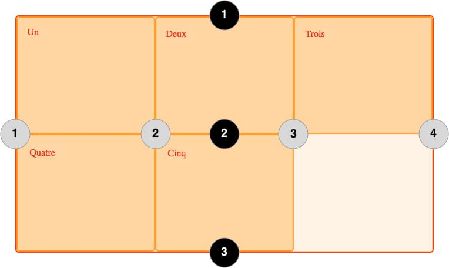

{{CSSRef}}

[Le module de spécification CSS pour les dispositions en grilles (<i lang="en">Grid Layout</i> en anglais)](/fr/docs/Web/CSS/CSS_Grid_Layout) ajoute un système de grille en deux dimensions à CSS. Les grilles peuvent être utilisées pour agencer des pages entières ou de petits éléments d'interface. Cet article présente ce module de grille, et introduit la terminologie de la spécification de niveau 1 des grilles CSS. Les fonctionnalités évoquées dans cet aperçu seront expliquées plus en détails dans le reste du guide.

## Qu'est-ce qu'une grille&nbsp;?

Une grille est un ensemble de lignes horizontales et verticales qui se croisent&nbsp;: les premières définissant les rangées, et les secondes les colonnes. Les éléments sont placés sur la grille en fonction de ces rangées et colonnes. Nous allons voir les fonctionnalités offertes par les dispositions en grille.

### Pistes à taille fixe ou variable

On peut créer une grille avec des pistes à taille fixes en utilisant une unité comme le pixel. Pour les pistes à taille variable on peut utiliser le pourcentage ou l'unité `fr` créée à cet effet.

### Placement des éléments

Pour placer les éléments sur la grille, on peut utiliser le numéro ou le nom d'une ligne, ou cibler une zone particulière. La grille contient aussi un algorithme pour placer les éléments qui n'ont pas été placés explicitement.

### Création de pistes supplémentaires pour du contenu

Lorsqu'une grille explicite n'est pas définie, la spécification prend en charge le contenu défini en dehors d'une grille en ajoutant des colonnes et des rangées. Cela comprend des fonctionnalités telles que «&nbsp;l'ajout d'autant de colonnes que possible dans le conteneur&nbsp;».

### Contrôle de l'alignement

On peut contrôler l'alignement des éléments dans une zone de la grille, ainsi que celui de l'ensemble de la grille.

### Contrôle des contenus qui se chevauchent

Il peut arriver que l'on place plusieurs éléments dans une même cellule, ou que des zones se chevauchent. La superposition peut être contrôlée à l'aide de la propriété [`z-index`](/fr/docs/Web/CSS/z-index).

La grille est un module de spécification puissant qui peut être combinée avec d'autres modules CSS tels que [les boîtes flexibles (<i lang="en">flexbox</i>)](/fr/docs/Web/CSS/CSS_Flexible_Box_Layout). Pour concevoir une disposition en grille, on commencera par créer **le conteneur de la grille**.

## Conteneur

À partir du moment où on crée un _conteneur_ en déclarant la propriété `display: grid` ou `display: inline-grid` sur un élément, tous les _enfants directs_ de cet élément deviennent des _éléments de grille_.

Cet exemple montre un élément [`<div>`](/fr/docs/Web/HTML/Element/div) avec une classe `.wrapper`, avec cinq éléments enfants.

```html
<div class="wrapper">
  <div>Un</div>
  <div>Deux</div>
  <div>Trois</div>
  <div>Quatre</div>
  <div>Cinq</div>
</div>
```

On transforme `.wrapper` en conteneur.

```css
.wrapper {
  display: grid;
}
```

```css hidden
* {
  box-sizing: border-box;
}

.wrapper {
  border: 2px solid #f76707;
  border-radius: 5px;
  background-color: #fff4e6;
}

.wrapper > div {
  border: 2px solid #ffa94d;
  border-radius: 5px;
  background-color: #ffd8a8;
  padding: 1em;
  color: #d9480f;
}
```

{{EmbedLiveSample('', '200', '330')}}

Tous les enfants directs sont maintenant des éléments de grille. On ne voit pas la différence dans un navigateur, car la grille n'a qu'une seule colonne. Vous trouverez sans doute utile de travailler avec Firefox, qui propose un [inspecteur de grille](https://firefox-source-docs.mozilla.org/devtools-user/page_inspector/how_to/examine_grid_layouts/index.html) dans les outils de développement. En inspectant la grille dans Firefox, vous pouvez voir une petite icône à côté de la valeur `grid`. Un clic dessus permet d'afficher la grille correspondante dans le navigateur.


Grâce aux indications visuelles, cet outil vous permettra de mieux comprendre le fonctionnement des grilles CSS, tout au long de votre apprentissage.

Pour que notre exemple ressemble vraiment à une grille nous devons ajouter des pistes pour les colonnes.

## Pistes

Les propriétés [`grid-template-columns`](/fr/docs/Web/CSS/grid-template-columns) et [`grid-template-rows`](/fr/docs/Web/CSS/grid-template-rows) permettent de définir des colonnes et des rangées. Celles-ci définissent les pistes. Une _piste_ est l'espace entre deux lignes adjacentes d'une grille. L'image ci-dessous colore une piste de la grille, correspondant à la première rangée de la grille.


Les pistes sont définies dans la grille explicite à l'aide des propriétés `grid-template-columns` et `grid-template-rows`, ou des propriétés raccourcies `grid` ou `grid-template`. Les pistes sont aussi créées dans la grille implicite en positionnant un élément de grille en dehors des pistes créées dans la grille explicite.

### Exemple simple

On peut ajouter la propriété `grid-template-columns` à notre exemple précédent, pour définir la taille des colonnes.

Nous avons ici créé une grille avec trois pistes de 200 pixels de large. Chaque élément sera disposé dans l'une des cellules de la grille.

```html
<div class="wrapper">
  <div>Un</div>
  <div>Deux</div>
  <div>Trois</div>
  <div>Quatre</div>
  <div>Cinq</div>
</div>
```

```css
.wrapper {
  display: grid;
  grid-template-columns: 200px 200px 200px;
}
```

```css hidden
* {
  box-sizing: border-box;
}

.wrapper {
  border: 2px solid #f76707;
  border-radius: 5px;
  background-color: #fff4e6;
}

.wrapper > div {
  border: 2px solid #ffa94d;
  border-radius: 5px;
  background-color: #ffd8a8;
  padding: 1em;
  color: #d9480f;
}
```

{{EmbedLiveSample('', '2610', '140')}}

### L'unité `fr`

Les pistes peuvent être définies à l'aide de n'importe quelle unité de mesure. Les grilles proposent aussi une nouvelle unité de mesure pour aider à la création de pistes flexibles. Cette unité, `fr`, représente une fraction de l'espace disponible dans le conteneur de la grille. Le code suivant crée trois colonnes égales qui se redimensionnent en fonction de l'espace disponible.

```html
<div class="wrapper">
  <div>Un</div>
  <div>Deux</div>
  <div>Trois</div>
  <div>Quatre</div>
  <div>Cinq</div>
</div>
```

```css
.wrapper {
  display: grid;
  grid-template-columns: 1fr 1fr 1fr;
}
```

```css hidden
* {
  box-sizing: border-box;
}

.wrapper {
  border: 2px solid #f76707;
  border-radius: 5px;
  background-color: #fff4e6;
}

.wrapper > div {
  border: 2px solid #ffa94d;
  border-radius: 5px;
  background-color: #ffd8a8;
  padding: 1em;
  color: #d9480f;
}
```

{{EmbedLiveSample('', '220', '140') }}

### Tailles différentes

L'exemple suivant crée une grille avec une colonne de `2fr`, et deux colonnes de `1fr`. L'espace disponible est divisé en quatre. Les deux premières fractions sont allouées à la première colonne, et chacune des colonnes suivante dispose d'une fraction.

```html
<div class="wrapper">
  <div>Un</div>
  <div>Deux</div>
  <div>Trois</div>
  <div>Quatre</div>
  <div>Cinq</div>
</div>
```

```css
.wrapper {
  display: grid;
  grid-template-columns: 2fr 1fr 1fr;
}
```

```css hidden
* {
  box-sizing: border-box;
}

.wrapper {
  border: 2px solid #f76707;
  border-radius: 5px;
  background-color: #fff4e6;
}

.wrapper > div {
  border: 2px solid #ffa94d;
  border-radius: 5px;
  background-color: #ffd8a8;
  padding: 1em;
  color: #d9480f;
}
```

{{EmbedLiveSample('', '220', '140')}}

### Mélanger des tailles flexibles et absolues

Dans ce dernier exemple, nous utilisons à la fois des dimensions absolues et relatives pour les pistes. La première piste faisant 500px, cette valeur est soustraite de l'espace disponible. L'espace restant est divisé en trois et alloué proportionnellement aux deux colonnes spécifiées avec l'unité relative `fr`.

```html
<div class="wrapper">
  <div>Un</div>
  <div>Deux</div>
  <div>Trois</div>
  <div>Quatre</div>
  <div>Cinq</div>
</div>
```

```css
.wrapper {
  display: grid;
  grid-template-columns: 500px 1fr 2fr;
}
```

```css hidden
* {
  box-sizing: border-box;
}

.wrapper {
  border: 2px solid #f76707;
  border-radius: 5px;
  background-color: #fff4e6;
}

.wrapper > div {
  border: 2px solid #ffa94d;
  border-radius: 5px;
  background-color: #ffd8a8;
  padding: 1em;
  color: #d9480f;
}
```

{{EmbedLiveSample('', '220', '140')}}

### Utiliser la notation `repeat()` pour définir les pistes

Pour les grilles comprenant de nombreuses pistes, on peut utiliser la notation `repeat()` pour répéter toute ou une partie des pistes définies. Par exemple la définition de grille&nbsp;:

```css
.wrapper {
  display: grid;
  grid-template-columns: 1fr 1fr 1fr;
}
```

Peut également s'écrire&nbsp;:

```css
.wrapper {
  display: grid;
  grid-template-columns: repeat(3, 1fr);
}
```

Dans l'exemple suivant on crée une grille avec une première colonne de |`20px` de large, puis une section répétant 6 fois une piste de `1fr`, et enfin on termine par une colonne de `20px` de large.

```css
.wrapper {
  display: grid;
  grid-template-columns: 20px repeat(6, 1fr) 20px;
}
```

Cette notation accepte une liste de pistes, on peut donc l'utiliser pour répéter un motif. Dans l'exemple qui suit la grille aura 10 colonnes&nbsp;: une colonne de `1fr` suivie d'une colonne de `2fr`, ceci répété 5 fois.

```css
.wrapper {
  display: grid;
  grid-template-columns: repeat(5, 1fr 2fr);
}
```

### Grille implicite et grille explicite

Dans ces exemples, nous avons défini nos colonnes à l'aide de la propriété [`grid-template-columns`](/fr/docs/Web/CSS/grid-template-columns), et nous avons laissé la grille créer les rangées. Ces rangées font partie de la grille implicite. La grille explicite est constituée des pistes définies par les propriétés [`grid-template-columns`](/fr/docs/Web/CSS/grid-template-columns) et [`grid-template-rows`](/fr/docs/Web/CSS/grid-template-rows).

Si un élément est placé en dehors de la grille ainsi définie, ou que la quantité de contenu nécessite d'étendre la grille, alors la grille ajoute implicitement des colonnes et rangées. Les dimensions de ces pistes auront par défaut la valeur `auto`, c'est-à dire qu'elles s'ajusteront à leur contenu.

On peut définir une taille pour les pistes de la grille implicite grâce aux propriétés [`grid-auto-rows`](/fr/docs/Web/CSS/grid-auto-rows) et [`grid-auto-columns`](/fr/docs/Web/CSS/grid-auto-columns).

Dans l'exemple ci-après nous utilisons `grid-auto-rows` pour que les rangées de la grille implicite aient une hauteur de 200 pixels.

```html
<div class="wrapper">
  <div>Un</div>
  <div>Deux</div>
  <div>Trois</div>
  <div>Quatre</div>
  <div>Cinq</div>
</div>
```

```css
.wrapper {
  display: grid;
  grid-template-columns: repeat(3, 1fr);
  grid-auto-rows: 200px;
}
```

```css hidden
* {
  box-sizing: border-box;
}

.wrapper {
  border: 2px solid #f76707;
  border-radius: 5px;
  background-color: #fff4e6;
}

.wrapper > div {
  border: 2px solid #ffa94d;
  border-radius: 5px;
  background-color: #ffd8a8;
  padding: 1em;
  color: #d9480f;
}
```

{{EmbedLiveSample('', '230', '450')}}

### Dimensionner une piste avec `minmax`

Que l'on crée une grille explicite, ou que l'on définisse la taille des pistes créées implicitement, il peut être utile d'assigner une taille minimum, qui s'agrandit pour s'adapter au contenu. Par exemple on peut souhaiter que les rangées ne soient jamais moins hautes que 100 pixels, mais qu'elles aillent jusqu'à 300 pixels de haut si le contenu le nécessite.

La fonction [`minmax()`](/fr/docs/Web/CSS/minmax) permet ce comportement. Dans l'exemple suivant nous utilisons `minmax()` comme valeur de la propriété [`grid-auto-rows`](/fr/docs/Web/CSS/grid-auto-rows). Les rangées créées automatiquement feront un minimum de 100 pixels, et un maximum de `auto`, ce qui signifie que la taille s'adaptera à la hauteur du contenu.

```css
.wrapper {
  display: grid;
  grid-template-columns: repeat(3, 1fr);
  grid-auto-rows: minmax(100px, auto);
}
```

```css hidden
* {
  box-sizing: border-box;
}

.wrapper {
  border: 2px solid #f76707;
  border-radius: 5px;
  background-color: #fff4e6;
}

.wrapper > div {
  border: 2px solid #ffa94d;
  border-radius: 5px;
  background-color: #ffd8a8;
  padding: 1em;
  color: #d9480f;
}
```

```html
<div class="wrapper">
  <div>Un</div>
  <div>
    Deux
    <p>Davantage de contenu.</p>
    <p>On dépasse les 100 pixels.</p>
  </div>
  <div>Trois</div>
  <div>Quatre</div>
  <div>Cinq</div>
</div>
```

{{EmbedLiveSample('', '240', '470')}}

## Lignes de grille

Il faut noter que l'on définit les pistes d'une grille, et pas les lignes qui en résultent. La grille génère des lignes numérotées que l'on utilise pour positionner les éléments. Dans notre grille de trois colonnes et deux rangées, nous avons quatre lignes de colonnes.



Les lignes sont numérotées selon le sens de lecture du document. Dans un langage qui se lit de gauche à droite, la ligne 1 est située à gauche, dans un langage qui se lit de droite à gauche elle est située à droite. Les lignes peuvent aussi être nommées, comme nous le verrons plus loin dans ces pages.

### Positionnement des éléments sur les lignes

Nous explorerons le placement sur les lignes de manière détaillée dans un prochain article. L'exemple qui suit montre comment l'utiliser de façon simple. Ici, lorsque nous plaçons un élément nous ciblons une ligne plutôt qu'une piste.

Nous plaçons ici les deux premiers éléments en utilisant les propriétés [`grid-column-start`](/fr/docs/Web/CSS/grid-column-start), [`grid-column-end`](/fr/docs/Web/CSS/grid-column-end), [`grid-row-start`](/fr/docs/Web/CSS/grid-row-start) et [`grid-row-end`](/fr/docs/Web/CSS/grid-row-end). En allant de gauche à droite, le premier élément est placé sur la ligne de colonne 1, et va jusqu'à la ligne de colonne 4, qui dans ce cas est la dernière. Il est placé sur la ligne de rangée 1, et va jusqu'à la ligne 3, s'étendant ainsi sur deux rangées.

Le second élément commence sur la ligne de colonne 1 et s'étend sur une seule piste. C'est la largeur par défaut, donc il n'est pas nécessaire de spécifier la ligne de fin. Il s'étend aussi sur deux rangées de la ligne 3 à la ligne 5. Les autres éléments se placeront dans les espaces vides de la grille.

```html
<div class="wrapper">
  <div class="box1">Un</div>
  <div class="box2">Deux</div>
  <div class="box3">Trois</div>
  <div class="box4">Quatre</div>
  <div class="box5">Cinq</div>
</div>
```

```css
.wrapper {
  display: grid;
  grid-template-columns: repeat(3, 1fr);
  grid-auto-rows: 100px;
}

.box1 {
  grid-column-start: 1;
  grid-column-end: 4;
  grid-row-start: 1;
  grid-row-end: 3;
}

.box2 {
  grid-column-start: 1;
  grid-row-start: 3;
  grid-row-end: 5;
}
```

```css hidden
* {
  box-sizing: border-box;
}

.wrapper {
  border: 2px solid #f76707;
  border-radius: 5px;
  background-color: #fff4e6;
}

.wrapper > div {
  border: 2px solid #ffa94d;
  border-radius: 5px;
  background-color: #ffd8a8;
  padding: 1em;
  color: #d9480f;
}
```

{{EmbedLiveSample('', '230', '450')}}

> **Note :** Pensez à utiliser [l'inspecteur de grille](https://firefox-source-docs.mozilla.org/devtools-user/page_inspector/how_to/examine_grid_layouts/index.html) dans les outils de développement de Firefox pour voir comment les éléments se placent sur les lignes d'une grille.

### Raccourcis de positionnement sur ligne

Les valeurs détaillées utilisées plus haut peuvent être abrégées en une ligne pour les colonnes avec [`grid-column`](/fr/docs/Web/CSS/grid-column) et une ligne pour les rangées avec [`grid-row`](/fr/docs/Web/CSS/grid-row). L'exemple suivant donne le même positionnement que le code précédent, mais avec beaucoup moins de CSS. La valeur avant la barre oblique (`/`) représente la ligne de début, celle d'après représente la ligne de fin.

Vous pouvez omettre la valeur de la ligne de fin si la zone ne recouvre qu'une piste.

```css
.wrapper {
  display: grid;
  grid-template-columns: repeat(3, 1fr);
  grid-auto-rows: 100px;
}

.box1 {
  grid-column: 1 / 4;
  grid-row: 1 / 3;
}

.box2 {
  grid-column: 1;
  grid-row: 3 / 5;
}
```

## Les cellules

Une _cellule_ est la plus petite unité sur une grille, conceptuellement similaire à une cellule de tableau. Comme nous l'avons vu lorsqu'une grille est définie sur un élément ses enfants viennent se positionner chacun dans l'une des cellules de la grille. Dans l'image ci-dessous la première cellule est colorée.


## Les zones

Un élément peut s'étendre sur plusieurs cellules d'une rangée ou d'une colonne, et cela crée une _zone_. Les zones doivent être rectangulaires — on ne peut pas créer de forme en L par exemple. La zone colorée ci-dessous s'étend sur deux rangées et deux colonnes.


## Les gouttières

Les _gouttières_ entre les cellules sont définies à l'aide des propriétés [`column-gap`](/fr/docs/Web/CSS/column-gap) et [`row-gap`](/fr/docs/Web/CSS/row-gap), ou de la propriété raccourcie [`gap`](/fr/docs/Web/CSS/gap). Dans l'exemple ci-dessous, nous créons une gouttière de dix pixels de large entre les colonnes, et une gouttière de `1em` de hauteur entre les rangées.

```css
.wrapper {
  display: grid;
  grid-template-columns: repeat(3, 1fr);
  grid-column-gap: 10px;
  grid-row-gap: 1em;
}
```

> **Note :** Aux débuts de la grille CSS dans les navigateurs, les propriétés [`column-gap`](/fr/docs/Web/CSS/column-gap), [`row-gap`](/fr/docs/Web/CSS/row-gap) et [`gap`](/fr/docs/Web/CSS/gap) étaient préfixées avec `grid-` et s'écrivaient respectivement `grid-column-gap`, `grid-row-gap` et `grid-gap`.
>
> Les navigateurs prennent désormais en charge les valeurs sans préfixe. Toutefois, les versions préfixées sont conservées comme synonymes à des fins de compatibilité.

```html
<div class="wrapper">
  <div>Un</div>
  <div>Deux</div>
  <div>Trois</div>
  <div>Quatre</div>
  <div>Cinq</div>
</div>
```

```css hidden
* {
  box-sizing: border-box;
}

.wrapper {
  column-gap: 10px;
  row-gap: 1em;
  border: 2px solid #f76707;
  border-radius: 5px;
  background-color: #fff4e6;
}

.wrapper > div {
  border: 2px solid #ffa94d;
  border-radius: 5px;
  background-color: #ffd8a8;
  padding: 1em;
  color: #d9480f;
}
```

{{EmbedLiveSample('')}}

L'espace utilisé par les gouttières sera pris en compte avant l'assignation de la place restante aux pistes définies avec l'unité `fr`. La taille des gouttières est calculée comme celle des pistes, mais on ne peut pas placer d'élément dans une gouttière. Au niveau du positionnement des éléments sur les lignes, la gouttière se comporte comme une ligne épaisse.

## Grilles imbriquées

Un élément placé dans une grille peut aussi être le conteneur d'une autre grille. Dans l'exemple suivant nous retrouvons la grille de trois colonnes créée plus haut, avec deux éléments explicitement positionnés. Le premier élément contient lui-même des éléments. Comme ils ne sont pas des enfants directs de la grille principale, ils se positionnent normalement dans le flux.


### Imbrication sans sous-grille

En définissant la propriété `display: grid` sur l'élément `box1`, il devient lui-même une grille et ses enfants se positionnent sur cette grille.

```css
.box1 {
  grid-column-start: 1;
  grid-column-end: 4;
  grid-row-start: 1;
  grid-row-end: 3;
  display: grid;
  grid-template-columns: repeat(3, 1fr);
}
```

```html hidden
<div class="wrapper">
  <div class="box box1">
    <div class="nested">a</div>
    <div class="nested">b</div>
    <div class="nested">c</div>
  </div>
  <div class="box box2">Deux</div>
  <div class="box box3">Trois</div>
  <div class="box box4">Quatre</div>
  <div class="box box5">Cinq</div>
</div>
```

```css
* {
  box-sizing: border-box;
}

.wrapper {
  border: 2px solid #f76707;
  border-radius: 5px;
  gap: 3px;
  background-color: #fff4e6;
  display: grid;
  grid-template-columns: repeat(3, 1fr);
}

.box {
  border: 2px solid #ffa94d;
  border-radius: 5px;
  background-color: #ffd8a8;
  padding: 1em;
  color: #d9480f;
}

.box1 {
  grid-column: 1 / 4;
}

.nested {
  border: 2px solid #ffec99;
  border-radius: 5px;
  background-color: #fff9db;
  padding: 1em;
}
```

{{EmbedLiveSample('', '600', '340')}}

Dans ce cas, la grille imbriquée n'est pas liée à la grille qui la contient. Elle n'hérite pas des gouttières paramétrées avec [`gap`](/fr/docs/Web/CSS/gap), et ses lignes ne s'alignent pas avec celles de la grille parent.

### Sous-grille

En complément des grilles classiques, _les sous-grilles_ permettent de créer des grilles imbriquées qui utilisent la définition des pistes de la grille parente.

Pour utiliser les sous-grilles, nous allons adapter notre exemple précédent pour changer la définition des pistes et la passer de `grid-template-columns: repeat(3, 1fr)`, à `grid-template-columns: subgrid`. La grille imbriquée utilise alors les pistes de la grille parente pour disposer ses éléments.

```css
.box1 {
  grid-column-start: 1;
  grid-column-end: 4;
  grid-row-start: 1;
  grid-row-end: 3;
  display: grid;
  grid-template-columns: subgrid;
}
```

## Superposer les éléments avec `z-index`

Plusieurs éléments peuvent être placés dans la même cellule d'une grille. Dans ce cas, il faut utiliser la propriété [`z-index`](/fr/docs/Web/CSS/z-index) pour contrôler l'ordre dans lequel les éléments se chevauchent.

### Chevauchement sans `z-index`

Si nous reprenons notre exemple avec les éléments positionnés par numéros de ligne, nous pouvons modifier cela pour que deux éléments se chevauchent.

```html
<div class="wrapper">
  <div class="box box1">Un</div>
  <div class="box box2">Deux</div>
  <div class="box box3">Trois</div>
  <div class="box box4">Quatre</div>
  <div class="box box5">Cinq</div>
</div>
```

```css
.wrapper {
  display: grid;
  grid-template-columns: repeat(3, 1fr);
  grid-auto-rows: 100px;
}

.box1 {
  grid-column-start: 1;
  grid-column-end: 4;
  grid-row-start: 1;
  grid-row-end: 3;
}

.box2 {
  grid-column-start: 1;
  grid-row-start: 2;
  grid-row-end: 4;
}
```

```css hidden
* {
  box-sizing: border-box;
}

.wrapper {
  border: 2px solid #f76707;
  border-radius: 5px;
  background-color: #fff4e6;
}

.box {
  border: 2px solid #ffa94d;
  border-radius: 5px;
  background-color: #ffd8a8;
  padding: 1em;
  color: #d9480f;
}
```

{{EmbedLiveSample('', '230', '460')}}

L'élément `box2` chevauche maintenant `box1`&nbsp;; il s'affiche par-dessus parce qu'il arrive après dans le code source.

### Contrôler l'ordre de superposition

On peut contrôler l'ordre dans lequel les éléments s'empilent en utilisant la propriété `z-index`. Si nous donnons à `box2` un `z-index` inférieur à celui de `box1`, l'élément `box2` s'affichera sous `box1` dans la pile.

```css
.wrapper {
  display: grid;
  grid-template-columns: repeat(3, 1fr);
  grid-auto-rows: 100px;
}

.box1 {
  grid-column-start: 1;
  grid-column-end: 4;
  grid-row-start: 1;
  grid-row-end: 3;
  z-index: 2;
}

.box2 {
  grid-column-start: 1;
  grid-row-start: 2;
  grid-row-end: 4;
  z-index: 1;
}
```

```html hidden
<div class="wrapper">
  <div class="box box1">Un</div>
  <div class="box box2">Deux</div>
  <div class="box box3">Trois</div>
  <div class="box box4">Quatre</div>
  <div class="box box5">Cinq</div>
</div>
```

```css hidden
* {
  box-sizing: border-box;
}

.wrapper {
  border: 2px solid #f76707;
  border-radius: 5px;
  background-color: #fff4e6;
}

.box {
  border: 2px solid #ffa94d;
  border-radius: 5px;
  background-color: #ffd8a8;
  padding: 1em;
  color: #d9480f;
}
```

{{EmbedLiveSample('', '230', '460')}}

## La suite

Dans cet article nous avons parcouru rapidement ce qu'il est possible de construire avec les grilles CSS. Expérimentez et jouez avec les exemples, avant de passer [à la suite de ce guide](/fr/docs/Web/CSS/CSS_Grid_Layout/Relationship_of_Grid_Layout) pour commencer à vraiment plonger dans le détail des dispositions en grille.
