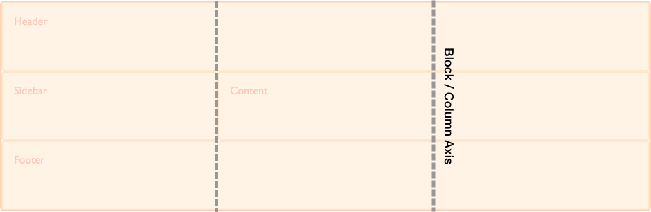

{{CSSRef}}

{{PreviousMenuNext("Web/CSS/CSS_Grid_Layout/Placement_automatique_sur_une_grille_CSS", "Web/CSS/CSS_Grid_Layout/Les_grilles_CSS_les_valeurs_logiques_les_modes_d_écriture","Web/CSS/CSS_Grid_Layout")}}

Si vous connaissez [les boîtes flexibles (flexbox)](/fr/docs/Web/CSS/CSS_Flexible_Box_Layout) vous savez déjà comment aligner les éléments flexibles à l'intérieur d'un conteneur flexible. Ces propriétés d'alignement, initialement spécifiée dans la spécification des boîtes flexibles, sont désormais spécifiées dans une nouvelle spécification [Box Alignment Level 3](https://drafts.csswg.org/css-align/). Cette spécification détaille le fonctionnement de l'alignement pour les différentes méthodes de disposition.

Chaque méthode de disposition qui implémente cette nouvelle spécification se comportera légèrement différemment selon les différences de contraintes et de fonctionnalités (et aussi selon le comportement historique). On ne pourra donc pas avoir un alignement exactement homogène. La spécification pour l'alignement des boîtes détaille le fonctionnement de chaque méthode mais malheureusement, à l'heure actuelle, aucun navigateur ne prend en charge cette spécification. À l'heure actuelle, les navigateurs respectent les règles de cette spécification pour l'alignement et la répartition de l'espace lorsqu'on utilise une disposition en grille. Dans cet article, nous verrons comment celles-ci fonctionnent. On retrouvera de nombreux points communs avec les boîtes flexibles pour le fonctionnement de ces propriétés et valeurs. Toutefois, les grilles fonctionnant sur deux axes et les boîtes flexibles sur un seul, il faudra faire attention à quelques différences. Commençons par analyser les deux axes utilisés lorsqu'il s'agit d'aligner des objets sur une grille.

## Les deux axes d'une grille

Lorsqu'on manipule une grille, on dispose de deux axes sur lesquels aligner les objets. L'axe de bloc et l'axe en ligne. L'axe de bloc est l'axe selon lequel les blocs sont disposés quand on a une disposition en bloc (_block layout_). Par exemple, si on a deux paragraphes sur une page, par défaut, ils s'affichent l'un en dessous de l'autre.



**L'axe en ligne est orthogonal à l'axe de bloc. C'est la direction selon laquelle progresse le texte.**


Grâce aux propriétés et à leurs valeurs, nous serons en mesure d'aligner le contenu de la grillle par rapport à ces deux axes.

## Aligner des objets sur l'axe de bloc (_block axis_)

Les propriétés {{cssxref("align-self")}} et {{cssxref("align-items")}} permettent de contrôler l'alignement selon l'axe de bloc. Lorsqu'on utilise ces propriétés, on modifie l'alignement de l'objet au sein de la zone de grille sur laquelle il est placé.

### Utiliser align-items

Dans l'exemple suivant, on a quatre zones sur la grille. On peut utiliser la propriété {{cssxref("align-items")}} sur le conteneur de la grille afin d'aligner les objets avec l'une des valeurs suivantes :

- `auto`
- `normal`
- `start`
- `end`
- `center`
- `stretch`
- `baseline`
- `first baseline`
- `last baseline`

```css hidden
* {
  box-sizing: border-box;
}

.wrapper {
  border: 2px solid #f76707;
  border-radius: 5px;
  background-color: #fff4e6;
}

.wrapper > div {
  border: 2px solid #ffa94d;
  border-radius: 5px;
  background-color: #ffd8a8;
  padding: 1em;
  color: #d9480f;
}
```

```css
.wrapper {
  display: grid;
  grid-template-columns: repeat(8, 1fr);
  grid-gap: 10px;
  grid-auto-rows: 100px;
  grid-template-areas:
    "a a a a b b b b"
    "a a a a b b b b"
    "c c c c d d d d"
    "c c c c d d d d";
  align-items: start;
}
.item1 {
  grid-area: a;
}
.item2 {
  grid-area: b;
}
.item3 {
  grid-area: c;
}
.item4 {
  grid-area: d;
}
```

```html
<div class="wrapper">
  <div class="item1">Objet 1</div>
  <div class="item2">Objet 2</div>
  <div class="item3">Objet 3</div>
  <div class="item4">Objet 4</div>
</div>
```

{{EmbedLiveSample('Utiliser_align-items', '500', '450')}}

Lorsqu'on utilise `align-self: start`, la hauteur de chaque `<div>` sera déterminée par le contenu du `<div>`. En revanche, si on n'utilise pas {{cssxref("align-self")}}, chaque `<div>` sera étiré afin de remplir la zone de la grille.

La propriété {{cssxref("align-items")}} définit en fait la valeur de la propriété {{cssxref("align-self")}} pour tous les éléments fils de la grille. Cela signifie qu'on peut avoir un réglage plus fin sur chacun des objets de la grille en utilisant `align-self` pour les objets.

### Utiliser align-self

Dans le prochain exemple, on utilise la propriété `align-self` afin d'illustrer les différentes valeurs pour l'alignement. La première zone illustre le comportement par défaut pour `align-self` : l'objet est étiré. Le deuxième objet utilise la valeur `start`, le troisième utilise `end` et le quatrième utilise `center`.

```css hidden
* {
  box-sizing: border-box;
}

.wrapper {
  border: 2px solid #f76707;
  border-radius: 5px;
  background-color: #fff4e6;
}

.wrapper > div {
  border: 2px solid #ffa94d;
  border-radius: 5px;
  background-color: #ffd8a8;
  padding: 1em;
  color: #d9480f;
}
```

```css
.wrapper {
  display: grid;
  grid-template-columns: repeat(8, 1fr);
  grid-gap: 10px;
  grid-auto-rows: 100px;
  grid-template-areas:
    "a a a a b b b b"
    "a a a a b b b b"
    "c c c c d d d d"
    "c c c c d d d d";
}
.item1 {
  grid-area: a;
}
.item2 {
  grid-area: b;
  align-self: start;
}
.item3 {
  grid-area: c;
  align-self: end;
}
.item4 {
  grid-area: d;
  align-self: center;
}
```

```html
<div class="wrapper">
  <div class="item1">Objet 1</div>
  <div class="item2">Objet 2</div>
  <div class="item3">Objet 3</div>
  <div class="item4">Objet 4</div>
</div>
```

{{EmbedLiveSample('Utiliser_align-self', '500', '450')}}

### Gestion des objets avec un ratio intrinsèque

La spécification indique que le comportement par défaut pour {{cssxref("align-self")}} est d'étirer l'objet sauf si celui-ci possède un ratio intrinsèque. Dans ce cas, le comportement par défaut correspond à la valeur `start`. En effet, si le comportement par défaut était le même pour les éléments avec un ratio intrinsèque (une image matricielle par exemple), l'étirement distordrait l'objet.

Bien que ce comportement ait récemment été clarifié dans la spécification, il n'est pas encore implémenté dans les différents navigateurs. Pour le moment, il faut donc s'assurer d'utiliser {{cssxref("align-self")}} et {{cssxref("justify-self")}} avec les valeurs `start` pour les éléments concernés comme les images. Cela correspondra au comportement par défaut lorsqu'il aura été implémenté.

## Justifier les objets sur l'axe en ligne (_inline axis_)

{{cssxref("align-items")}} et {{cssxref("align-self")}} gèrent l'alignement des objets sur l'axe de bloc. {{cssxref("justify-items")}} et {{cssxref("justify-self")}} permettent quant à eux de gérer l'alignement sur l'axe en ligne. Les valeurs disponibles sont les mêmes que pour `align-self` :

- `auto`
- `normal`
- `start`
- `end`
- `center`
- `stretch`
- `baseline`
- `first baseline`
- `last baseline`

Juste après, on voit le même exemple qu'avec {{cssxref("align-items")}} où on a utilisé la propriété {{cssxref("justify-self")}}.

Là encore, la valeur par défaut `stretch` pour les objets qui n'ont pas de ratio intrinsèque. Cela signifie que, par défaut, les objets de la grille couvriront l'ensemble de la zone de grille sur laquelle ils sont placés. Dans l'exemple qui suit, le premier objet illustre cet alignement par défaut.

```css hidden
* {
  box-sizing: border-box;
}

.wrapper {
  border: 2px solid #f76707;
  border-radius: 5px;
  background-color: #fff4e6;
}

.wrapper > div {
  border: 2px solid #ffa94d;
  border-radius: 5px;
  background-color: #ffd8a8;
  padding: 1em;
  color: #d9480f;
}
```

```css
.wrapper {
  display: grid;
  grid-template-columns: repeat(8, 1fr);
  grid-gap: 10px;
  grid-auto-rows: 100px;
  grid-template-areas:
    "a a a a b b b b"
    "a a a a b b b b"
    "c c c c d d d d"
    "c c c c d d d d";
}
.item1 {
  grid-area: a;
}
.item2 {
  grid-area: b;
  justify-self: start;
}
.item3 {
  grid-area: c;
  justify-self: end;
}
.item4 {
  grid-area: d;
  justify-self: center;
}
```

```html
<div class="wrapper">
  <div class="item1">Objet 1</div>
  <div class="item2">Objet 2</div>
  <div class="item3">Objet 3</div>
  <div class="item4">Objet 4</div>
</div>
```

{{EmbedLiveSample('Justifier_les_objets_sur_laxe_en_ligne_inline_axis', '500', '450')}}

Comme pour {{cssxref("align-self")}} et {{cssxref("align-items")}}, on peut utiliser la propriété {{cssxref("justify-items")}} sur le conteneur de la grille afin de régler la valeur de {{cssxref("justify-self")}} pour l'ensemble des objets de la grille.

Les propriétés {{cssxref("justify-self")}} et {{cssxref("justify-items")}} ne sont pas disponibles lorsqu'on utilise les boîtes flexibles car celles-ci s'étendent uniquement sur une dimension. Pour aligner les éléments sur l'axe principale d'une boîte flexible, on utilisera la propriété {{cssxref("justify-content")}}.

### Propriétés raccourcies

La propriété {{CSSxRef("place-items")}} est une propriété raccourcie qui synthétise {{CSSxRef("align-items")}} et {{CSSxRef("justify-items")}}. {{CSSxRef("place-self")}} est une propriété raccourcie qui synthétise {{CSSxRef("align-self")}} et {{CSSxRef("justify-self")}}.

## Centrer un objet sur une zone

En combinant les propriétés `align-*` et `justify-*`, on peut facilement centrer un objet sur sa zone de grille.

```css hidden
* {
  box-sizing: border-box;
}

.wrapper {
  border: 2px solid #f76707;
  border-radius: 5px;
  background-color: #fff4e6;
}

.wrapper > div {
  border: 2px solid #ffa94d;
  border-radius: 5px;
  background-color: #ffd8a8;
  padding: 1em;
  color: #d9480f;
}
```

```css
.wrapper {
  display: grid;
  grid-template-columns: repeat(4, 1fr);
  grid-gap: 10px;
  grid-auto-rows: 200px;
  grid-template-areas:
    ". a a ."
    ". a a .";
}
.item1 {
  grid-area: a;
  align-self: center;
  justify-self: center;
}
```

```html
<div class="wrapper">
  <div class="item1">Objet 1</div>
</div>
```

{{EmbedLiveSample('Centrer_un_objet_sur_une_zone', '500', '480')}}

## Aligner les pistes d'une grille sur l'axe de bloc

Si on a des pistes qui n'occupent pas tout l'espace du conteneur, on pourra aligner les pistes au sein du conteneur. Là aussi, on peut obtenir cet alignement sur l'axe des colonnes et l'axe des lignes : {{cssxref("align-content")}} permet d'aligner les pistes selon l'axe des colonnes et {{cssxref("justify-content")}} permettant d'aligner sur l'axe en ligne.

La propriété {{cssxref("place-content")}} est une propriété raccourcie pour {{cssxref("align-content")}} et {{cssxref("justify-content")}}.

Les valeurs disponibles pour {{cssxref("align-content")}}, {{cssxref("justify-content")}} et {{cssxref("place-content")}} sont :

- `normal`
- `start`
- `end`
- `center`
- `stretch`
- `space-around`
- `space-between`
- `space-evenly`
- `baseline`
- `first baseline`
- `last baseline`

Dans l'exemple qui suit, on a un conteneur qui mesure 500 pixels de haut sur 500 pixels de large. On définit trois pistes de ligne et trois pistes de colonnes qui mesurent chacune 100 pixels et avec une gouttière de 10 pixels. On a donc un espace disponible dans le conteneur dans chaque direction.

La propriété `align-content` s'applique sur le conteneur de la grille car elle porte sur l'ensemble de la grille. Pour une disposition en grille, la valeur par défaut est `start` : cela indique que les pistes commencent à partir du coin en haut à gauche de la grille.

### Alignement par défaut

```css hidden
* {
  box-sizing: border-box;
}

.wrapper {
  border: 2px solid #f76707;
  border-radius: 5px;
  background-color: #fff4e6;
}

.wrapper > div {
  border: 2px solid #ffa94d;
  border-radius: 5px;
  background-color: #ffd8a8;
  padding: 1em;
  color: #d9480f;
}
```

```css
.wrapper {
  display: grid;
  grid-template-columns: repeat(3, 100px);
  grid-template-rows: repeat(3, 100px);
  height: 500px;
  width: 500px;
  grid-gap: 10px;
  grid-template-areas:
    "a a b"
    "a a b"
    "c d d";
}
.item1 {
  grid-area: a;
}
.item2 {
  grid-area: b;
}
.item3 {
  grid-area: c;
}
.item4 {
  grid-area: d;
}
```

```html
<div class="wrapper">
  <div class="item1">Objet 1</div>
  <div class="item2">Objet 2</div>
  <div class="item3">Objet 3</div>
  <div class="item4">Objet 4</div>
</div>
```

{{EmbedLiveSample('Alignement_par_défaut', '500', '520')}}

### Utiliser align-content: end

Si on ajoute `align-content` avec la valeur `end` sur le conteneur, les pistes seront déplacées à la fin du conteneur selon l'axe des colonnes.

```css hidden
* {
  box-sizing: border-box;
}

.wrapper {
  border: 2px solid #f76707;
  border-radius: 5px;
  background-color: #fff4e6;
}

.wrapper > div {
  border: 2px solid #ffa94d;
  border-radius: 5px;
  background-color: #ffd8a8;
  padding: 1em;
  color: #d9480f;
}
```

```css
.wrapper {
  display: grid;
  grid-template-columns: repeat(3, 100px);
  grid-template-rows: repeat(3, 100px);
  height: 500px;
  width: 500px;
  grid-gap: 10px;
  grid-template-areas:
    "a a b"
    "a a b"
    "c d d";
  align-content: end;
}
.item1 {
  grid-area: a;
}
.item2 {
  grid-area: b;
}
.item3 {
  grid-area: c;
}
.item4 {
  grid-area: d;
}
```

```html
<div class="wrapper">
  <div class="item1">Objet 1</div>
  <div class="item2">Objet 2</div>
  <div class="item3">Objet 3</div>
  <div class="item4">Objet 4</div>
</div>
```

{{EmbedLiveSample('Utiliser_align-content_end', '500', '520')}}

### Utiliser align-content: space-between

Pour cette propriété, on peut également utiliser des valeurs qu'on manipule avec les boîtes flexibles : `space-between`, `space-around` et `space-evenly` qui permettent de répartir l'espace. Si on utilise {{cssxref("align-content")}} avec `space-between` pour notre exemple, on voit alors que les éléments sont espacés de façon équitable.

```css hidden
* {
  box-sizing: border-box;
}

.wrapper {
  border: 2px solid #f76707;
  border-radius: 5px;
  background-color: #fff4e6;
}

.wrapper > div {
  border: 2px solid #ffa94d;
  border-radius: 5px;
  background-color: #ffd8a8;
  padding: 1em;
  color: #d9480f;
}
```

```css
.wrapper {
  display: grid;
  grid-template-columns: repeat(3, 100px);
  grid-template-rows: repeat(3, 100px);
  height: 500px;
  width: 500px;
  grid-gap: 10px;
  grid-template-areas:
    "a a b"
    "a a b"
    "c d d";
  align-content: space-between;
}
.item1 {
  grid-area: a;
}
.item2 {
  grid-area: b;
}
.item3 {
  grid-area: c;
}
.item4 {
  grid-area: d;
}
```

```html
<div class="wrapper">
  <div class="item1">Objet 1</div>
  <div class="item2">Objet 2</div>
  <div class="item3">Objet 3</div>
  <div class="item4">Objet 4</div>
</div>
```

{{EmbedLiveSample('Utiliser_align-content_space-between', '500', '1570')}}

On notera qu'en utilisant ces valeurs pour répartir l'espace, cela peut agrandir les objets de la grille. Si un objet s'étale sur plusieurs pistes, un espace sera ajouté entre chaque piste afin que l'objet qui doit être agrandi puisse absorber cet espace. Aussi, si vous choisissez d'utiliser ces valeurs, assurez-vous que le contenu des pistes puisse absorber cet espace supplémentaire ou que les propriétés d'alignement les renvoient au début de la piste plutôt que de les étirer.

Dans l'image qui suit, on a a placé une grille en utilisant `align-content: start` et une autre grille qui utilise `align-content: space-between`. On peut voir la façon dont les objets 1 et 2 (qui s'étalent sur deux lignes) ont gagné en hauteur pour combler l'espace entre les pistes.


## Justifier les pistes sur l'axe des lignes

Sur l'axe des lignes, on peut utiliser {{cssxref("justify-content")}} de la même façon qu'on utilisait {{cssxref("align-content")}} pour l'axe des colonnes.

Avec le même exemple, on utilise {{cssxref("justify-content")}} avec la valeur `space-around`. Là encore, les pistes qui s'étalent sur plus d'une colonne gagnent en largeur.

```css hidden
* {
  box-sizing: border-box;
}

.wrapper {
  border: 2px solid #f76707;
  border-radius: 5px;
  background-color: #fff4e6;
}

.wrapper > div {
  border: 2px solid #ffa94d;
  border-radius: 5px;
  background-color: #ffd8a8;
  padding: 1em;
  color: #d9480f;
}
```

```css
.wrapper {
  display: grid;
  grid-template-columns: repeat(3, 100px);
  grid-template-rows: repeat(3, 100px);
  height: 500px;
  width: 500px;
  grid-gap: 10px;
  grid-template-areas:
    "a a b"
    "a a b"
    "c d d";
  align-content: space-between;
  justify-content: space-around;
}
.item1 {
  grid-area: a;
}
.item2 {
  grid-area: b;
}
.item3 {
  grid-area: c;
}
.item4 {
  grid-area: d;
}
```

```html
<div class="wrapper">
  <div class="item1">Objet 1</div>
  <div class="item2">Objet 2</div>
  <div class="item3">Objet 3</div>
  <div class="item4">Objet 4</div>
</div>
```

{{EmbedLiveSample('Justifier_les_pistes_sur_laxe_des_lignes', '500', '500')}}

## Alignement et marges automatiques

Pour aligner les objets dans une zone, on peut également utiliser des marges automatiques. Si vous avez déjà utiliser `auto` pour les marges droite et gauche d'un conteneur de bloc, vous savez qu'une telle marge absorbe l'espace disponible. En utilisant `auto` pour les deux côtés, le bloc est contraint au milieu car les deux marges occupent le plus d'espace possible.

Dans l'exemple qui suit, pour l'objet 1, on utilise une marge à gauche avec `auto`. On peut alors voir le contenu poussé à droite de la zone (la marge à gauche occupant le plus d'espace possible).

```css hidden
* {
  box-sizing: border-box;
}

.wrapper {
  border: 2px solid #f76707;
  border-radius: 5px;
  background-color: #fff4e6;
}

.wrapper > div {
  border: 2px solid #ffa94d;
  border-radius: 5px;
  background-color: #ffd8a8;
  padding: 1em;
  color: #d9480f;
}
```

```css
.wrapper {
  display: grid;
  grid-template-columns: repeat(3, 100px);
  grid-template-rows: repeat(3, 100px);
  height: 500px;
  width: 500px;
  grid-gap: 10px;
  grid-template-areas:
    "a a b"
    "a a b"
    "c d d";
}
.item1 {
  grid-area: a;
  margin-left: auto;
}
.item2 {
  grid-area: b;
}
.item3 {
  grid-area: c;
}
.item4 {
  grid-area: d;
}
```

```html
<div class="wrapper">
  <div class="item1">Objet 1</div>
  <div class="item2">Objet 2</div>
  <div class="item3">Objet 3</div>
  <div class="item4">Objet 4</div>
</div>
```

{{EmbedLiveSample('Alignement_et_marges_automatiques', '500', '500')}}

On peut voir comment l'objet est aligné grâce à [l'outil de mise en évidence des grilles dans Firefox](/fr/docs/Tools/Page_Inspector/How_to/Examine_grid_layouts).


## L'alignement et les modes d'écriture

Dans tout ces exemples, nous avons travaillé en français ou en anglais, des langues qui s'écrivent de gauche à droite. Cela signifie que les lignes de début de notre grille étaient situées en haut et à gauche lorsqu'on raisonnait avec des directions _physiques_.

Les spécifications pour les grilles CSS et les boîtes flexibles sont conçues pour fonctionner avec les différents modes d'écriture. Cela signifie que si on travaille avec une langue qui s'écrit de droite à gauche (comme l'arabe), le début de la grille serait en haut à droite. Cela signifie également que la valeur par défaut `justify-content: start` placerait les pistes du côté droit de la grille. En revanche, si on utilise les marges automatiques avec `margin-right` ou `margin-left` ou si on utilise le positionnement absolu avec les valeurs `top`, `right`, `bottom` et `left`, on ne tiendra pas compte des modes d'écritures. Dans le guide suivant, nous verrons plus en détails comment les grilles et l'alignement interagissent avec les modes d'écriture. Cet aspect est fondamental si vous souhaitez développer des sites qui puissent être affichés dans plusieurs langues ou si vous souhaitez mélanger certaines langues ou modes d'écriture pour une application.

{{PreviousMenuNext("Web/CSS/CSS_Grid_Layout/Placement_automatique_sur_une_grille_CSS", "Web/CSS/CSS_Grid_Layout/Les_grilles_CSS_les_valeurs_logiques_les_modes_d_écriture","Web/CSS/CSS_Grid_Layout")}}
