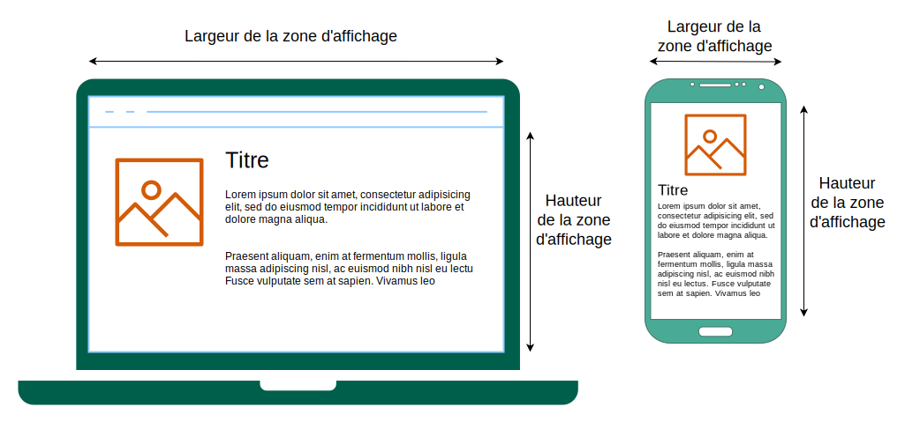

{{CSSRef}}

Les **requêtes média CSS**, plus souvent appelées **<i lang="en">media queries</i>**, sont un outil de [<i lang="en">responsive design</i>](/fr/docs/Learn_web_development/Core/CSS_layout/Responsive_Design) qui permet d'adapter la feuille de styles CSS en fonction de différents paramètres ou caractéristiques de l'appareil.

Par exemple, on pourra appliquer différentes mises en forme selon la taille de [la zone d'affichage](/fr/docs/Glossary/Viewport) pour que la disposition soit correcte selon les tailles d'écran des appareils.

Par exemple, on pourra utiliser une police de caractères plus petite pour les appareils avec des petits écrans, augmenter l'espace entre les paragraphes si la page est vue en mode portrait, ou encore augmenter la taille des boutons sur les écrans tactiles.

C'est [la règle @](/fr/docs/Web/CSS/CSS_syntax/At-rule) [`@media`](/fr/docs/Web/CSS/@media) qui est utilisée en [CSS](/fr/docs/Web/CSS) pour appliquer de façon conditionnelle un fragment d'une feuille de styles selon le résultat d'une requête média. Si on souhaite appliquer de façon conditionnelle une feuille de styles entière, on utilisera [`@import`](/fr/docs/Web/CSS/@import).

Lorsqu'on conçoit des composants HTML réutilisables, on peut également utiliser [les requêtes de conteneur](/fr/docs/Web/CSS/CSS_containment/Container_queries) qui permettent d'appliquer des mises en forme selon la taille de l'élément englobant plutôt que par rapport à la zone d'affichage ou aux caractéristiques de l'appareil.

### Les requêtes média en HTML

En [HTML](/fr/docs/Web/HTML), on peut appliquer des requêtes média à différents éléments&nbsp;:

- Dans l'attribut [`media`](/fr/docs/Web/HTML/Reference/Elements/link#media) de l'élément [`<link>`](/fr/docs/Web/HTML/Reference/Elements/link), qui définit le média auquel une ressource liée (généralement du CSS) s'applique.
- Dans l'attribut [`media`](/fr/docs/Web/HTML/Reference/Elements/source#media) de l'élément [`<source>`](/fr/docs/Web/HTML/Reference/Elements/source), qui définit le média sur lequel la source s'applique (uniquement valide à l'intérieur d'éléments [`<picture>`](/fr/docs/Web/HTML/Reference/Elements/picture)).
- Dans l'attribut [`media`](/fr/docs/Web/HTML/Reference/Elements/style#media) de l'élément [`<style>`](/fr/docs/Web/HTML/Reference/Elements/style), qui définit le média auquel le style s'applique.

### Les requêtes média en JavaScript

En [JavaScript](/fr/docs/Web/JavaScript), on peut utiliser la méthode [`Window.matchMedia()`](/fr/docs/Web/API/Window/matchMedia) pour tester une requête média par rapport à la fenêtre courante. On peut également utiliser [`MediaQueryList.addListener()`](/fr/docs/Web/API/MediaQueryList/addListener) pour réagir aux changements d'états d'une requête média. Grâce à cette méthode, votre site ou application peut réagir aux modifications de configuration, d'orientation ou d'état.

Pour en savoir plus sur les tests des requêtes média dans des programmes, voir l'article [Tester les requêtes média](/fr/docs/Web/CSS/CSS_media_queries/Testing_media_queries).

## Référence

### Règles @

- [`@import`](/fr/docs/Web/CSS/@import)
- [`@media`](/fr/docs/Web/CSS/@media)

## Guides

- [Utiliser les requêtes média](/fr/docs/Web/CSS/CSS_media_queries/Using_media_queries)
  - : Cet article présente les requêtes média, leur syntaxe, les opérateurs et caractéristiques média utilisées pour les construire.
- [Tester les requêtes média](/fr/docs/Web/CSS/CSS_media_queries/Testing_media_queries)
  - : Cet article explique comment tester une requête média grâce à un programme JavaScript. On pourra par exemple déterminer l'état de l'appareil, mettre en place des gestionnaires d'évènements afin d'être notifié·e lorsque les résultats d'une requête média évoluent (par exemple lorsque la personne tourne son appareil ou redimensionne la fenêtre de son navigateur).
- [Utiliser des requêtes média pour l'accessibilité](/fr/docs/Web/CSS/CSS_media_queries/Using_media_queries_for_accessibility)
  - : Cet article explique comment les requêtes média peuvent être utilisées afin de rendre un site plus accessible.

## Spécifications

{{Specifications}}

## Voir aussi

- [Les requêtes de conteneur](/fr/docs/Web/CSS/CSS_containment/Container_queries)
- La règle @ [`@supports`](/fr/docs/Web/CSS/@supports) afin d'appliquer une mise en forme selon que l'agent utilisateur prend ou non en charge certaines technologies CSS.
