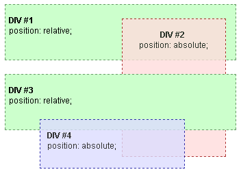
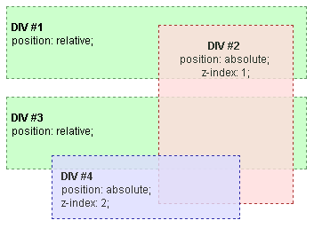

{{PreviousMenuNext("Web/CSS/Comprendre_z-index/L'empilement_de_couches","Web/CSS/Comprendre_z-index/Exemple_2", "Web/CSS/Comprendre_z-index")}}

## Premier exemple

Commençons par un exemple simple, dans le contexte d'empilement racine nous avons deux blocs _DIV_ (_DIV #1_ et _DIV #3_), tout deux positionnés relativement, mais sans propriété {{ cssxref("z-index") }}. Dans le bloc _DIV #1_ il y a un bloc _DIV #2_ en position absolue, alors que dans le bloc _DIV #3_ il y a un bloc _DIV #4_ en position absolue, tout deux également sans propriété `z-index`.

Le seul et unique contexte d'empilement est le contexte racine. Sans `z-index`, les éléments sont empilés dans leur ordre d'apparition dans le code HTML.



Si on assigne au bloc _DIV #2_ une valeur de `z-index` positive (non nulle et non automatique), il est rendu par dessus tous les autres blocs.


Si maintenant on assigne également au bloc _DIV #4_ une valeur de `z-index` positive, plus grande que celle du _DIV #2_, le bloc _DIV #4_ est rendu par dessus tous les autres, y compris par dessus le bloc _DIV #2_.



Dans le dernier exemple, vous pouvez voir que les blocs _DIV #2_ et _DIV #4_ ne sont pas frères, parce qu'ils appartiennent à des parents différents dans la hiérarchie des éléments HTML. Néanmoins, l'empilement du bloc _DIV #4_, tout en respectant le bloc _DIV #2_, peut être contrôlé avec la propriété `z-index`. Il se fait que les éléments _DIV #1_ et _DIV #3_ n'ayant pas de `z-index` défini, ils ne créent pas de contexte d'empilement. Cela signifie que l'ensemble de leur contenu, y compris les blocs _DIV #2_ et _DIV #3_, appartient au contexte d'empilement de la racine.

Dans le contexte d'empilement, les blocs _DIV #1_ et _DIV #3_ sont simplement assimilés dans l'élément racine, et la hiérarchie résultante est la suivante :

- Contexte d'empilement racine

  - DIV #2 (z-index 1)
  - DIV #4 (z-index 2)

> **Note :** Les blocs _DIV #1_ et _DIV #3_ ne sont pas translucides. Il est important de se souvenir que d'assigner une valeur d'opacité inférieure à 1 à un élément positionné, crée implicitement un contexte d'empilement, de la même façon que l'ajout de propriétés `z-index`. Et cet exemple montre ce qui arrive lorsqu'un élément parent ne crée pas de contexte d'empilement.

## **Exemple**

### CSS

```css
.bold {
  font-weight: bold;
  font: 12px Arial;
}
#div1,
#div3 {
  height: 80px;
  position: relative;
  border: 1px dashed #669966;
  background-color: #ccffcc;
  padding-left: 5px;
}

#div2 {
  opacity: 0.8;
  z-index: 1;
  position: absolute;
  width: 150px;
  height: 200px;
  top: 20px;
  left: 170px;
  border: 1px dashed #990000;
  background-color: #ffdddd;
  text-align: center;
}

#div4 {
  opacity: 0.8;
  z-index: 2;
  position: absolute;
  width: 200px;
  height: 70px;
  top: 65px;
  left: 50px;
  border: 1px dashed #000099;
  background-color: #ddddff;
  text-align: left;
  padding-left: 10px;
}
```

### **HTML**

```html
<div id="div1">
  <br/>
  <span class="bold">DIV #1</span>
  <br/>position: relative;
  <div id="div2">
    <br/><span class="bold">DIV #2</span>
    <br/>position: absolute;
     <br/>z-index: 1;
  </div>
</div>

<br/>

<div id="div3">
  <b/><span class="bold">DIV #3</span>
  <br/>position: relative;
  <div id="div4">
    <br/><span class="bold">DIV #4</span>
    <br/>position: absolute;
    <br/>z-index: 2;
  </div>
</div>
```

### Résultat

{{EmbedLiveSample('Exemple')}}

{{PreviousMenuNext("Web/CSS/Comprendre_z-index/L'empilement_de_couches","Web/CSS/Comprendre_z-index/Exemple_2", "Web/CSS/Comprendre_z-index")}}
