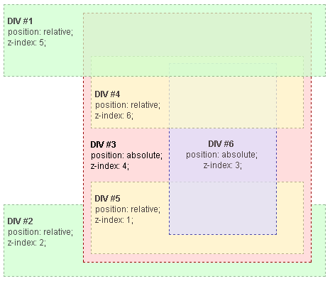

{{CSSRef}}

Le **contexte d'empilement** est une conceptualisation en trois dimensions de la façon dont les éléments HTML sont placés sur un axe de profondeur relatif à la personne qui fait face à la page web. Les éléments HTML s'organisent dans ce volume selon un ordre construit à partir des attributs de l'élément.

## Le contexte d'empilement

Dans l'exemple précédent, [Ajout de z-index](/fr/docs/Web/CSS/CSS_Positioning/Understanding_z_index/Adding_z-index), l'ordre de rendu de certains éléments était influencé par la valeur de la propriété `z-index`. Cela se produit parce que ces éléments ont des propriétés spéciales qui entraînent la formation d'un _contexte d'empilement_.

Un contexte d'empilement est formé dans le document par n'importe quel élément qui répond à l'un de ces critères&nbsp;:

- L'élément racine du document (HTML)
- Un élément pour lequel [`position`](/fr/docs/Web/CSS/position) vaut `absolute` ou `relative` et pour lequel [`z-index`](/fr/docs/Web/CSS/z-index) est différente de `auto`
- Un élément pour lequel [`position`](/fr/docs/Web/CSS/position) vaut `fixed` ou `sticky` (`sticky` s'applique pour les navigateurs sur mobile mais pas aux anciens navigateurs de bureau)
- Un élément qui est le fils d'un conteneur flexible ([`flexbox`](/fr/docs/Web/CSS/flexbox)) pour lequel [`z-index`](/fr/docs/Web/CSS/z-index) est différente de `auto`
- Un élément qui est le fils d'un conteneur en grille ([`grid`](/fr/docs/Web/CSS/grid)) pour lequel [`z-index`](/fr/docs/Web/CSS/z-index) est différente de `auto`
- Un élément pour lequel [`opacity`](/fr/docs/Web/CSS/opacity) est inférieure à 1 (cf. [la spécification](https://www.w3.org/TR/css3-color/#transparency))
- Un élément pour lequel [`mix-blend-mode`](/fr/docs/Web/CSS/mix-blend-mode) est différente de `normal`
- Un élément pour lequel n'importe laquelle de ces propriétés est différente de `none` :

  - [`transform`](/fr/docs/Web/CSS/transform)
  - [`filter`](/fr/docs/Web/CSS/filter)
  - [`perspective`](/fr/docs/Web/CSS/perspective)
  - [`clip-path`](/fr/docs/Web/CSS/clip-path)
  - [`mask`](/fr/docs/Web/CSS/mask) / [`mask-image`](/fr/docs/Web/CSS/mask-image) / [`mask-border`](/fr/docs/Web/CSS/mask-border)

- Un élément pour lequel [`isolation`](/fr/docs/Web/CSS/isolation) vaut `isolate`
- Un élément pour lequel [`-webkit-overflow-scrolling`](/fr/docs/Web/CSS/-webkit-overflow-scrolling) vaut `touch`.
- Un élément pour lequel la valeur de la propriété [`will-change`](/fr/docs/Web/CSS/will-change) concerne une propriété qui créerait un contexte d'empilement avec une valeur non-initiale (voir [ce billet en anglais](https://dev.opera.com/articles/css-will-change-property/)).
- Un élément pour lequel la valeur de la propriété [`contain`](/fr/docs/Web/CSS/contain) est `layout`, `paint` ou une valeur composite contenant un de ces mots-clés (par exemple `contain: strict` ou `contain: content`).

Sans contexte d'empilement, les éléments enfants sont empilés selon les règles vues avant. Les valeurs des `z-index` pour les contextes d'empilement des éléments enfants ont uniquement un sens pour l'élément parent. Les contextes d'empilement sont traités de façon atomique, comme une seule unité, dans le contexte de l'élément parent.

En bref&nbsp;:

- Les contextes d'empilement peuvent être enfants d'autres contextes d'empilement, et ensemble forment une hiérarchie de contextes d'empilement.
- Chaque contexte d'empilement est indépendant de ses voisins&nbsp;: seuls les éléments enfants sont pris en compte lorsque l'empilement est traité.
- Chaque contexte d'empilement est autonome&nbsp;: Une fois que le contenu de l'élément est empilé, l'élément entier est pris en compte dans l'ordre d'empilement du contexte parent.

> **Note :** La hiérarchie des contextes d'empilement est un sous-ensemble de la hiérarchie des éléments HTML, car seuls les éléments positionnés dans l'espace (avec la propriété `z-index` créent des contextes d'empilement. On peut dire que les éléments qui ne créent pas leur propre contexte d'empilement sont _assimilés_ par le contexte d'empilement parent.

## Un exemple



Dans cet exemple, tous les éléments positionnés créent leur propre contexte d'empilement, du fait de leur positionnement et de leur valeur `z-index`. La hiérarchie des contextes d'empilement est organisée comme suit&nbsp;:

- Racine

  - DIV #1
  - DIV #2
  - DIV #3

    - DIV #4
    - DIV #5
    - DIV #6

Il est important de noter que les blocs DIV #4, DIV #5 et DIV #6 sont les enfants du bloc DIV #3, donc leur empilement est complètement résolu à l'intérieur de ce dernier. Une fois que l'empilement et le rendu à l'intérieur du bloc 3 sont définis, la totalité de l'élément DIV #3 est prise en compte pour l'empilement dans l'élément racine par rapport à ses DIV voisins.

> **Note :**
>
> - _DIV #4_ est rendu dans le bloc _DIV #1_ car le `z-index` (5) de celui-ci est valide à l'intérieur du contexte d'empilement de l'élément racine, alors que le `z-index` (6) du bloc _DIV #4_ est valide à l'intérieur du contexte d'empilement du bloc _DIV #3_. Ainsi, DIV #4 se trouve sous _DIV #1_, parce que _DIV #4_ appartient à _DIV #3_, qui possède une valeur de `z-index` plus petite.
> - Pour la même raison _DIV #2_ (dont le `z-index` est 2) est rendu sous _DIV#5_ (de `z-index` égal à 1) parce que _DIV #5_ appartient à _DIV #3_, qui possède une valeur de `z-index` plus grande.
> - Le `z-index` du bloc _DIV #3_ est 4, mais cette valeur est indépendante du `z-index` du bloc _DIV #4_, _DIV #5_ et _DIV #6_, parce qu'il appartient à un contexte d'empilement différent.
> - Une méthode simple pour déterminer _l'ordre de rendu_ des éléments empilés sur l'axe Z consiste à considérer cette valeur comme un numéro de version où les éléments enfants sont des versions mineures, placées sous les versions majeures portées par leurs parents. Ainsi, on peut voir comment un élément avec une propriété `z-index` à 1 (DIV #5) est placé au-dessus d'un élément avec `z-index` à 2 (DIV #2), et comment un élément avec `z-index` à 6 (DIV #4) est empilé sous un élément avec `z-index` à 5 (DIV #1). Dans notre exemple, en triant selon l'ordre de rendu final, on a&nbsp;:
>
>   - Racine
>
>     - DIV #2 - z-index à 2
>     - DIV #3 - z-index à 4
>
>       - DIV #5 - z-index à 1, empilé sous un élément avec `z-index` à 4, qui aboutit à un ordre de rendu de 4.1
>       - DIV #6 - z-index à 3, empilé sous un élément avec `z-index` à 4, qui aboutit à un ordre de rendu de 4.3
>       - DIV #4 - z-index à 6, empilé sous un élément avec `z-index` à 4, qui aboutit à un ordre de rendu de 4.6
>
>     - DIV #1 - z-index à 5
## Exemple

### HTML

```html
<div id="div1">
  <h1>Élément de division n°1</h1>
  <code>position: relative;<br/>
  z-index: 5;</code>
</div>

<div id="div2">
  <h1>Élément de division n°2</h1>
  <code>position: relative;<br/>
  z-index: 2;</code>
</div>

<div id="div3">
  <div id="div4">
    <h1>Élément de division n°4</h1>
    <code>position: relative;<br/>
    z-index: 6;</code>
  </div>

  <h1>Élément de division n°3</h1>
  <code>position: absolute;<br/>
  z-index: 4;</code>

  <div id="div5">
    <h1>Élément de division n°5</h1>
    <code>position: relative;<br/>
    z-index: 1;</code>
  </div>

  <div id="div6">
    <h1>Élément de division n°6</h1>
    <code>position: absolute;<br/>
    z-index: 3;</code>
  </div>
</div>
```

### CSS

```css
* {
  margin: 0;
}
html {
  padding: 20px;
  font: 12px/20px Arial, sans-serif;
}
div {
  opacity: 0.7;
  position: relative;
}
h1 {
  font: inherit;
  font-weight: bold;
}
#div1,
#div2 {
  border: 1px dashed #696;
  padding: 10px;
  background-color: #cfc;
}
#div1 {
  z-index: 5;
  margin-bottom: 190px;
}
#div2 {
  z-index: 2;
}
#div3 {
  z-index: 4;
  opacity: 1;
  position: absolute;
  top: 40px;
  left: 180px;
  width: 330px;
  border: 1px dashed #900;
  background-color: #fdd;
  padding: 40px 20px 20px;
}
#div4,
#div5 {
  border: 1px dashed #996;
  background-color: #ffc;
}
#div4 {
  z-index: 6;
  margin-bottom: 15px;
  padding: 25px 10px 5px;
}
#div5 {
  z-index: 1;
  margin-top: 15px;
  padding: 5px 10px;
}
#div6 {
  z-index: 3;
  position: absolute;
  top: 20px;
  left: 180px;
  width: 150px;
  height: 125px;
  border: 1px dashed #009;
  padding-top: 125px;
  background-color: #ddf;
  text-align: center;
}
```

### Résultat

{{EmbedLiveSample("Exemple","556","396")}}

## Voir aussi

- [L'empilement sans propriété z-index](/fr/docs/Web/CSS/CSS_Positioning/Understanding_z_index/Stacking_without_z-index)&nbsp;: Les règles d'empilement à l'œuvre lorsque `z-index` n'est pas utilisée.
- [L'empilement de blocs flottants](/fr/docs/Web/CSS/CSS_Positioning/Understanding_z_index/Stacking_and_float)&nbsp;: La gestion de l'empilement avec les éléments flottants.
- [Utiliser z-index](/fr/docs/Web/CSS/CSS_Positioning/Understanding_z_index/Adding_z-index)&nbsp;: Comment utiliser `z-index` afin de modifier l'empilement par défaut.
- [Exemple de contexte d'empilement 1](/fr/docs/Web/CSS/CSS_Positioning/Understanding_z_index/Stacking_context_example_1)&nbsp;: Hiérarchie HTML à deux niveaux avec `z-index` sur le dernier niveau.
- [Exemple de contexte d'empilement 2](/fr/docs/Web/CSS/CSS_Positioning/Understanding_z_index/Stacking_context_example_2)&nbsp;: Hiérarchie HTML à deux niveaux avec `z-index` sur tous les niveaux.
- [Exemple de contexte d'empilement 3](/fr/docs/Web/CSS/CSS_Positioning/Understanding_z_index/Stacking_context_example_3)&nbsp;: Hiérarchie HTML à trois niveaux avec `z-index` sur le deuxième niveau.
